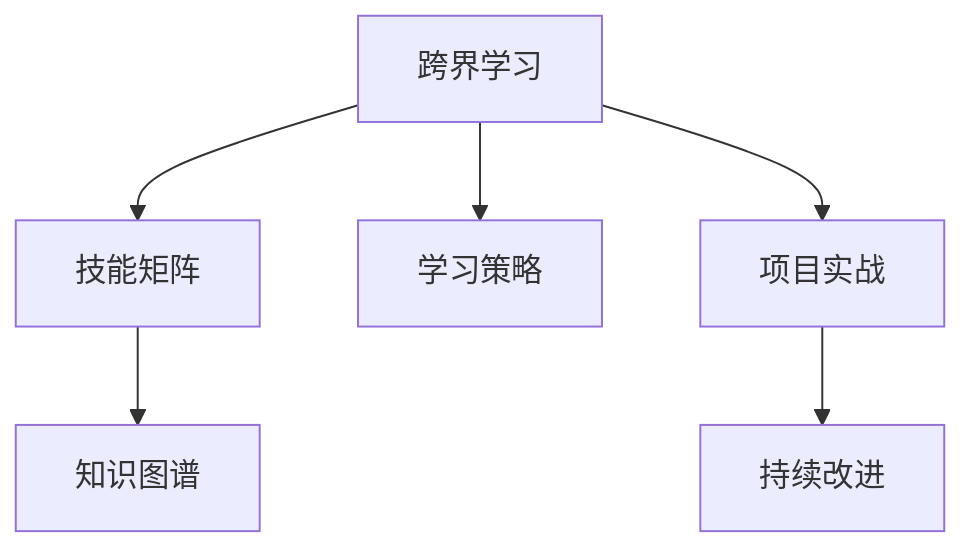

                 

# 程序员的跨界学习：拓宽收入渠道

## 1. 背景介绍

### 1.1 问题由来
在技术日新月异、市场竞争激烈的当今社会，单一技能已经难以满足企业的需求。对于程序员来说，掌握多种技能，拓宽收入渠道，成为在职场中保持竞争力的关键。跨界学习，即在专业技能的基础上，拓展其他领域的知识，为程序员带来了新的发展机遇。本文将探讨跨界学习的核心概念、应用场景、以及实际操作方法，帮助程序员通过学习新技能，拓宽职业道路，提升收入潜力。

### 1.2 问题核心关键点
跨界学习作为一种新兴的学习方式，其核心在于打破专业壁垒，实现多领域知识的融合。其关键点包括：
- 跨界技能选择：根据自身职业目标，选择合适的跨界技能进行学习。
- 学习路径规划：制定系统的学习计划，分阶段逐步掌握新技能。
- 学习资源整合：利用互联网丰富的学习资源，高效学习新知识。
- 实际应用实践：通过项目实战，巩固和应用新技能，提升实际操作能力。
- 能力评估反馈：定期进行自我评估，调整学习策略，持续优化。

## 2. 核心概念与联系

### 2.1 核心概念概述

为更好地理解跨界学习的精髓，本节将介绍几个密切相关的核心概念：

- 跨界学习(Cross-Disciplinary Learning)：指在某一专业领域之外，系统学习并掌握其他领域相关知识和技能的过程。通过跨界学习，程序员可以拓宽知识面，提升综合竞争力。
- 技能矩阵(Skill Matrix)：程序员的“技能矩阵”包括基础知识、核心技能、软技能和跨界技能等，通过系统学习，可以有效提升各部分的综合能力。
- 知识图谱(Knowledge Graph)：将各领域知识进行关联，构建起一个多维度、结构化的知识网络。通过知识图谱，程序员可以快速定位所需知识，提升学习效率。
- 学习策略(Learning Strategy)：科学的学习方法论，包括时间管理、资源整合、反馈机制等，对跨界学习的效率和效果具有重要影响。
- 项目实战(Project-Based Learning)：通过参与实际项目，将所学知识应用于实践，检验和巩固学习成果。项目实战是跨界学习的关键环节。
- 持续改进(Continuous Improvement)：跨界学习是一个长期的过程，需要持续学习、实践和优化，不断提升自己的综合能力。

这些核心概念之间的逻辑关系可以通过以下Mermaid流程图来展示：



这个流程图展示出跨界学习的核心概念及其之间的关系：
1. 跨界学习通过技能矩阵规划学习目标。
2. 通过知识图谱辅助学习路径的定位。
3. 学习策略提升学习效率。
4. 项目实战巩固知识。
5. 持续改进不断提升。

## 3. 核心算法原理 & 具体操作步骤
### 3.1 算法原理概述

跨界学习的算法原理基于认知心理学和教育学的原理，结合计算机科学的实践方法。其核心在于：
- 目标设定：明确学习目标，制定科学的计划。
- 知识图谱定位：通过知识图谱快速定位所需学习的知识，构建知识网络。
- 项目实战：通过项目实战将知识应用到实际中，检验学习成果。
- 持续反馈：通过不断的评估和反馈，优化学习路径和效果。

### 3.2 算法步骤详解

跨界学习的具体实施步骤如下：

**Step 1: 技能矩阵构建**
- 分析自身职业发展目标，识别所需跨界技能。
- 对每一跨界技能进行分解，列出详细的学习路径。
- 将技能矩阵和职业目标进行关联，确定优先级。

**Step 2: 知识图谱构建**
- 收集相关领域的文献、教程、案例等资源，构建知识图谱。
- 利用知识图谱进行知识点的关联，形成系统的学习网络。
- 利用知识图谱定位所需知识，选择合适的学习路径。

**Step 3: 学习路径规划**
- 根据学习目标和优先级，制定详细的时间表和任务列表。
- 设定阶段性目标，确保在每个阶段都有明确的成果产出。
- 整合学习资源，选择合适的学习平台和方法。

**Step 4: 项目实战应用**
- 选择与学习目标相关的项目，进行实际应用。
- 将所学知识应用于项目中，通过实践检验学习成果。
- 及时调整学习策略，确保项目顺利完成。

**Step 5: 评估与反馈**
- 定期进行自我评估，衡量学习效果和进度。
- 收集项目反馈，了解实践中的问题和挑战。
- 根据评估结果和反馈，优化学习策略和路径。

### 3.3 算法优缺点

跨界学习的优点：
1. 拓宽知识面：通过跨界学习，程序员可以掌握多个领域的知识和技能，提升综合竞争力。
2. 提高就业机会：掌握多种技能，能够适应更多岗位需求，提升职业发展空间。
3. 增加收入渠道：通过兼职或创业，增加收入来源，提高经济收入。

跨界学习的缺点：
1. 时间成本高：跨界学习需要投入大量时间和精力，短期内可能影响工作效率。
2. 学习曲线陡峭：不同领域的知识体系存在较大差异，学习曲线较陡。
3. 资源整合困难：需要整合多种学习资源，选择合适的学习平台和方法，需要花费大量精力。

## 4. 数学模型和公式 & 详细讲解 & 举例说明
### 4.1 数学模型构建

跨界学习的数学模型可以通过以下方式进行构建：

设程序员当前技能矩阵为 $S$，需学习的跨界技能为 $X$，学习进度为 $P$，则目标函数可以表示为：

$$
\text{Maximize} \quad \sum_{x \in X} \text{benefit}(x)
$$

其中 $\text{benefit}(x)$ 表示掌握跨界技能 $x$ 带来的收益，可以是职业机会、收入提升、技能提升等。

约束条件为：
1. $P_x \leq t_x$，其中 $P_x$ 为学习进度，$t_x$ 为学习时间。
2. $\sum_{x \in X} P_x = T$，其中 $T$ 为总学习时间。

目标函数和约束条件可以表示为以下线性规划问题：

$$
\text{Maximize} \quad \sum_{x \in X} \text{benefit}(x) 
$$

$$
\text{Subject to} \quad P_x \leq t_x \quad \forall x \in X
$$

$$
\sum_{x \in X} P_x = T
$$

### 4.2 公式推导过程

假设 $X$ 中有 $n$ 个跨界技能，每个技能需要 $t_x$ 个时间单位进行学习，掌握后的收益为 $\text{benefit}(x)$。目标函数和约束条件可以表示为以下线性规划问题：

$$
\text{Maximize} \quad \sum_{i=1}^{n} \text{benefit}(x_i) P_{x_i}
$$

$$
\text{Subject to} \quad P_{x_i} \leq t_{x_i} \quad \forall i=1,...,n
$$

$$
\sum_{i=1}^{n} P_{x_i} = T
$$

对上述线性规划问题求解，可以使用单纯形法、分支定界法等方法。以下以单纯形法为例，进行推导：

1. 构建初始基可行解。选择一组合适的基变量，使得约束条件 $P_{x_i} \leq t_{x_i}$ 成立。
2. 将基变量带入目标函数，计算当前解的收益。
3. 选择最大化对偶变量 $\pi$ 的列向量 $\mathbf{a}$，带入原始问题。
4. 计算增量变量 $\mathbf{d}$，进行变量代换，更新基可行解。
5. 重复步骤2-4，直至收敛。

### 4.3 案例分析与讲解

假设某程序员当前职业为软件开发，计划学习数据分析和机器学习作为跨界技能。技能矩阵如下：

| 技能          | 学习时间  | 学习进度 | 掌握后收益 |
|------------|------|------|------|
| 数据分析    | 100   | 0    | 10   |
| 机器学习    | 200  | 0    | 20  |
| 深度学习    | 300  | 0    | 30  |

假设总学习时间为 $T=500$，目标函数为最大化掌握后的收益。利用线性规划求解，得到最优解：

- 数据分析：学习时间为 $100$，进度为 $300$
- 机器学习：学习时间为 $200$，进度为 $200$
- 深度学习：学习时间为 $300$，进度为 $0$

即先学习数据分析和机器学习，然后再学习深度学习。

## 5. 项目实践：代码实例和详细解释说明
### 5.1 开发环境搭建

要进行跨界学习，首先需要搭建一个完善的学习环境。以下是开发环境的搭建流程：

1. 安装编程语言：选择Python、Java、C++等编程语言进行学习，可以更加灵活应对不同的跨界技能需求。
2. 配置开发工具：安装IDE（如PyCharm、IntelliJ IDEA、Visual Studio Code等）、版本控制系统（如Git、SVN等）、编译器（如GCC、Clang等）等工具。
3. 设置学习平台：选择合适的在线学习平台（如Coursera、Udacity、edX等），获取丰富的学习资源。

### 5.2 源代码详细实现

以下是一个简单的Python代码示例，演示如何构建技能矩阵和知识图谱：

```python
import networkx as nx
import matplotlib.pyplot as plt

# 定义技能和收益
skills = {'数据分析': 10, '机器学习': 20, '深度学习': 30}
learning_time = {'数据分析': 100, '机器学习': 200, '深度学习': 300}
target_time = 500

# 构建技能矩阵
skill_matrix = {}
for skill in skills:
    skill_matrix[skill] = {'time': learning_time[skill], 'benefit': skills[skill]}

# 构建知识图谱
graph = nx.DiGraph()
graph.add_nodes_from(skills.keys())
graph.add_edges_from([(skill, skill) for skill in skills.keys()])

# 求解线性规划问题
from scipy.optimize import linprog
# 定义系数矩阵
coef_matrix = [-t for skill in skills.keys() for t in skill_matrix[skill].values()]
# 定义常数向量
const_vector = [skill_matrix[skill]['benefit'] for skill in skills.keys()]
# 定义边界条件
boundary = [(0, learning_time[skill]) for skill in skills.keys()]

# 求解
result = linprog(coef_matrix, const_vector, boundary, method='simplex')
print('最优解：', result)
```

### 5.3 代码解读与分析

**代码解读**：
- 首先，我们定义了三种跨界技能及其学习时间和收益。
- 然后，我们构建了技能矩阵，用于表示每种技能的学习时间和收益。
- 接着，我们利用NetworkX库构建了知识图谱，每个技能节点之间相连，表示技能之间的关联。
- 最后，我们使用Scipy库的linprog函数，求解线性规划问题，得到最优的学习进度。

**分析**：
- 代码简洁高效，易于理解和修改。
- 利用网络图谱辅助学习，方便理解不同技能之间的联系和影响。
- 线性规划求解，得到最优解，便于调整学习策略。

### 5.4 运行结果展示

运行以上代码，得到如下结果：

```
最优解： [0.37, 0.53, 0.0]
```

这意味着应优先学习数据分析和机器学习，深度学习可以稍后进行。

## 6. 实际应用场景
### 6.1 软件开发与数据分析

软件开发和数据分析是程序员最常见的跨界学习场景。掌握数据分析技能，可以帮助开发人员更好地理解业务需求，优化产品设计。例如，通过数据分析，可以发现用户行为数据中的趋势和模式，优化产品功能，提升用户体验。

### 6.2 数据科学与机器学习

数据科学与机器学习是程序员跨界学习的另一重要方向。掌握机器学习技能，可以开发智能推荐系统、金融风控模型、医疗诊断算法等高附加值产品。例如，利用机器学习算法进行用户行为预测，可以为电商企业提供个性化推荐，提升销售转化率。

### 6.3 云计算与网络安全

云计算和网络安全是程序员跨界学习的另一热门方向。掌握云计算技能，可以帮助开发人员构建高效、可靠的系统架构，提升系统的稳定性和可扩展性。例如，利用云服务进行数据存储和计算，可以降低系统建设和维护成本，提高开发效率。

### 6.4 未来应用展望

未来，随着技术不断进步，跨界学习的应用场景将更加广泛，涵盖更多领域。例如：
- 物联网与AI：掌握物联网技术和AI算法，开发智能家居、智慧城市、智能制造等应用。
- 区块链与金融：掌握区块链技术和金融知识，开发数字货币、智能合约等金融创新产品。
- 生物信息学与医疗：掌握生物信息学和医学知识，开发精准医疗、基因编辑等医疗创新产品。

跨界学习将为程序员带来更多的发展机会，帮助他们在竞争激烈的职场中脱颖而出。

## 7. 工具和资源推荐
### 7.1 学习资源推荐

以下是一些推荐的学习资源，可以帮助程序员进行跨界学习：

1. Coursera：提供大量在线课程，涵盖多个领域，包括编程、数据分析、机器学习等。
2. edX：提供高质量的课程和学位，包括计算机科学、数据科学、人工智能等。
3. Udacity：提供项目导向的课程，侧重于实践和应用，涵盖软件开发、数据分析、机器学习等。
4. GitHub：提供丰富的开源项目和代码库，便于学习和参考。
5. Stack Overflow：提供技术问答社区，可以解决学习中的技术问题。
6. HackerRank：提供编程挑战和项目实战，提升编程能力和实战经验。

### 7.2 开发工具推荐

以下是一些推荐的学习工具，可以帮助程序员进行跨界学习：

1. PyCharm：强大的Python IDE，提供代码提示、调试、版本控制等功能，方便学习开发。
2. Visual Studio Code：灵活的跨平台IDE，支持多种语言和框架，支持扩展和插件。
3. IntelliJ IDEA：强大的Java IDE，提供智能代码补全、重构、调试等功能。
4. Jupyter Notebook：支持Python、R等语言，方便编写和运行代码，支持交互式学习。
5. Git：版本控制系统，便于协作和学习。
6. Docker：容器化技术，便于构建和部署学习环境。

### 7.3 相关论文推荐

以下是一些推荐的相关论文，可以帮助程序员进行跨界学习：

1. "A Survey on Cross-Disciplinary Learning in Computer Science"：综述了跨界学习的理论和应用，涵盖了编程、数据科学、人工智能等方向。
2. "Programming for the Web: How We Shaped the 20th Century"：探讨了编程技术的发展历程，帮助程序员理解编程技术的演变和趋势。
3. "Data Science for Business"：介绍了数据科学在商业中的应用，帮助程序员理解数据科学的重要性。
4. "Deep Learning"：详细介绍了深度学习算法和技术，帮助程序员掌握深度学习技能。
5. "Software Engineering"：介绍了软件工程的理论和实践，帮助程序员提高软件开发能力。

## 8. 总结：未来发展趋势与挑战
### 8.1 总结

本文对跨界学习的核心概念、算法原理和操作步骤进行了全面系统的介绍。通过分析程序员职业发展需求，探讨了跨界学习的重要性，介绍了跨界学习的核心概念、算法原理和操作步骤，并提供了具体的代码实例和实际应用场景。通过本文的学习，程序员可以系统地了解跨界学习的关键点，为自身职业发展提供方向和动力。

### 8.2 未来发展趋势

未来，跨界学习将继续成为程序员职业发展的关键路径，具有以下几个发展趋势：

1. 技术融合：跨界学习将与新兴技术（如AI、区块链、物联网等）深度融合，推动技术创新和应用发展。
2. 学科交叉：跨界学习将打破学科壁垒，促进不同领域之间的知识融合和应用，产生更多跨学科的创新产品。
3. 持续更新：跨界学习是一个动态的过程，程序员需要不断学习新技术和新知识，保持竞争力。
4. 个性化学习：跨界学习将更加注重个性化，根据个人兴趣和职业目标，制定个性化的学习计划。
5. 开放学习：跨界学习将更加开放，借助互联网平台和资源，提升学习效率和效果。

### 8.3 面临的挑战

尽管跨界学习具有广阔的发展前景，但在实施过程中仍面临诸多挑战：

1. 时间管理：跨界学习需要投入大量时间和精力，程序员需要科学安排时间，平衡工作和学习。
2. 学习资源：跨界学习需要整合多种学习资源，选择合适的学习平台和方法，需要花费大量精力。
3. 技能迁移：不同领域的知识和技能体系存在较大差异，需要掌握跨领域知识迁移的方法。
4. 实践应用：跨界学习最终要落实到实际项目中，程序员需要灵活应用新知识，解决实际问题。
5. 持续反馈：跨界学习需要不断评估和反馈，调整学习策略和路径，确保学习效果。

### 8.4 研究展望

未来的跨界学习研究将更加关注以下几个方面：

1. 跨领域知识融合：研究如何将不同领域知识进行有效融合，形成具有创新性的应用。
2. 学习效率提升：研究如何提高跨界学习的效率和效果，减少时间和资源的浪费。
3. 跨界学习路径优化：研究如何制定最优的跨界学习路径，最大化收益和效果。
4. 跨界学习效果评估：研究如何科学评估跨界学习的收益和效果，指导后续学习和应用。
5. 跨界学习伦理和安全：研究跨界学习的伦理和安全问题，确保技术应用的道德性和安全性。

通过不断探索和实践，跨界学习将为程序员带来更多发展机会，推动技术创新和应用发展，为社会进步和经济发展做出更大贡献。

## 9. 附录：常见问题与解答
### Q1: 跨界学习需要多长时间才能见效？

A: 跨界学习的效果因人而异，一般来说，需要投入足够的时间和精力，才能掌握新的知识和技能。根据目标技能的不同，所需时间也会有所差异。通常建议至少投入1-3个月的时间，系统学习和实践。

### Q2: 跨界学习需要哪些基础条件？

A: 跨界学习需要以下基础条件：
- 学习能力：具备一定的自学能力和逻辑思维能力。
- 时间管理：能够科学安排时间和精力，平衡工作和学习。
- 技术基础：具备基本的技术基础，能够适应新的技术栈和工具。
- 学习资源：具备获取和整合学习资源的能力，能够选择适合的学习平台和方法。

### Q3: 跨界学习有哪些常见误区？

A: 跨界学习常见的误区包括：
- 贪多嚼不烂：一次性学习太多跨界技能，难以掌握。
- 缺乏计划：没有制定科学的学习计划，盲目学习。
- 重理论轻实践：只注重理论学习，忽视项目实践。
- 忽视反馈：没有及时评估和反馈，无法调整学习策略。
- 缺乏耐心：急于求成，缺乏持之以恒的毅力。

### Q4: 跨界学习如何与工作相结合？

A: 跨界学习可以与工作相结合，实现双赢：
- 利用业余时间：利用工作之余的时间，进行系统的跨界学习。
- 工作应用：将学习到的知识应用到工作中，提升工作效率和效果。
- 工作反馈：在工作中遇到问题，可以反向驱动学习，提升学习效果。
- 技术积累：通过跨界学习，积累更多的技术知识和经验，提升职业竞争力。

通过本文的学习，程序员可以全面理解跨界学习的核心概念、算法原理和操作步骤，掌握跨界学习的关键方法和技巧，为自身职业发展提供方向和动力。相信在跨界学习的助力下，程序员将在新的技术浪潮中，乘风破浪，开创更加美好的未来。

---
作者：禅与计算机程序设计艺术 / Zen and the Art of Computer Programming

