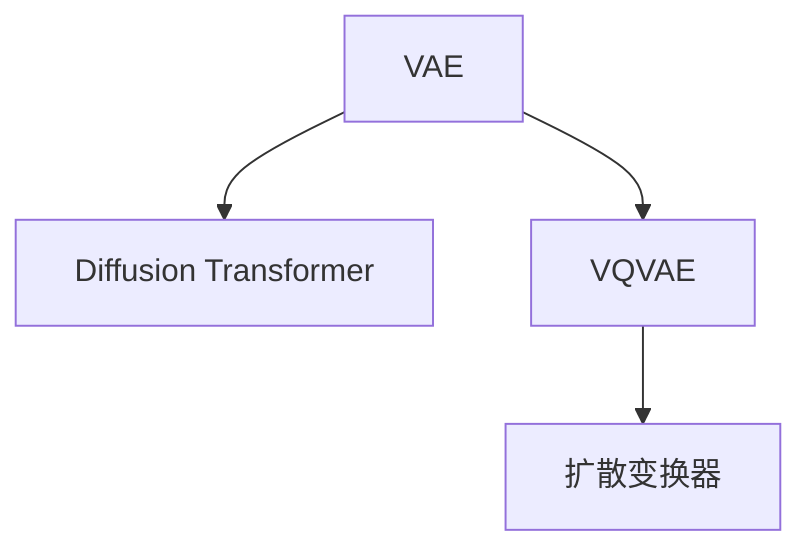

                 

# 第17章 多模态模型 VQVAE与扩散变压器

## 1. 背景介绍

在人工智能领域，多模态学习是指通过同时利用多种数据源（如文本、图像、声音等）的融合来提高模型在复杂任务上的表现。随着计算机视觉和自然语言处理技术的进步，多模态学习已经成为跨学科研究的热点，并被广泛应用于图像字幕生成、语音识别、视频描述、跨模态检索等多个领域。

在多模态学习中，一种典型的模型是变分自编码器（Variational Autoencoder, VAE）与扩散变换器（Diffusion Transformer）的结合，即VQVAE（Vector Quantized Variational Autoencoder）与扩散自回归模型（Diffusion Transformer）的结合，这种模型能够在保留高分辨率的图像信息的同时，提升文本描述的生成质量，成为近年来研究的热点。

## 2. 核心概念与联系

### 2.1 核心概念概述

为了更好地理解VQVAE与扩散变换器，首先介绍几个核心概念：

- **变分自编码器（VAE）**：一种生成模型，用于从给定数据生成新的数据，其核心是通过编码器将输入数据压缩成潜空间表示，再通过解码器重构原始数据。VAE的目标是最小化潜在空间样本和数据重构的均方误差。
- **扩散变换器（Diffusion Transformer）**：一种自回归生成模型，能够生成高质量的文本、图像等序列数据。扩散变换器通过连续噪声注射的方式，逐步引导生成过程，并在每一步中利用自注意力机制调整生成方向，从而生成连贯、自然的序列。
- **VQVAE**：变分自编码器的变体，通过引入向量量化（Vector Quantization）技术，将连续的潜空间表示离散化，提升编码效率和生成质量。VQVAE通常包含一个编码器、一个解码器和一个向量量化器。
- **自回归模型**：通过已有的部分信息预测后续部分的信息，自回归模型通常用于生成序列数据，能够保证生成结果的连贯性。

这些核心概念之间的关系可以通过以下Mermaid流程图来展示：



这个流程图展示了VAE与扩散变换器、VQVAE与扩散变换器之间的关联。VAE和VQVAE都是生成模型，而扩散变换器则是一种自回归生成模型。VAE与扩散变换器的结合，可以用于多模态学习任务，而VQVAE与扩散变换器的结合，能够提升生成质量和效率。

## 3. 核心算法原理 & 具体操作步骤

### 3.1 算法原理概述

VQVAE与扩散变换器的核心算法原理可以概括为以下两个部分：

- **VQVAE部分**：通过向量量化将连续的潜在表示离散化，提升生成效率，同时通过变分推断估计潜在分布，从而生成高质量的图像或文本。
- **扩散变换器部分**：通过扩散变换器逐步生成序列数据，并结合自注意力机制，提升生成文本的连贯性和自然性。

### 3.2 算法步骤详解

#### VQVAE部分

1. **向量量化器**：将连续的潜在表示 $z$ 映射到离散的潜在表示 $\bar{z}$。这通常通过将 $z$ 投影到向量量化码本 $Z$ 中来实现。
   
   $$
   \bar{z} = \arg\min_{\bar{z}} \| z - Z_{\bar{z}} \|
   $$
   
   其中，$Z_{\bar{z}}$ 表示向量量化码本中与 $\bar{z}$ 最接近的向量。

2. **编码器**：将输入数据 $x$ 映射到潜在表示 $z$，然后将其离散化得到 $\bar{z}$。
   
   $$
   z = e(x)
   $$
   
   $$
   \bar{z} = Q(z)
   $$
   
   其中，$e(x)$ 表示编码器，$Q(z)$ 表示向量量化器。

3. **解码器**：将离散的潜在表示 $\bar{z}$ 解码回原始数据 $x'$。
   
   $$
   x' = d(\bar{z})
   $$
   
   其中，$d(\bar{z})$ 表示解码器。

4. **变分推断**：通过变分推断估计潜在分布 $p(z)$，最小化重构误差和潜在表示的分布误差。
   
   $$
   \min_{\theta} \mathbb{E}_{q(z|\bar{z})} [\|x - x'\|^2] + D_{KL}[q(z|\bar{z}) || p(z)]
   $$
   
   其中，$D_{KL}$ 表示KL散度，$q(z|\bar{z})$ 表示潜在表示的分布。

#### 扩散变换器部分

1. **噪声注射**：将噪声 $\epsilon$ 逐步添加到文本或图像的表示中，逐步生成最终的文本或图像。

   $$
   x_t = \sqrt{1-t} x_0 + \sqrt{t} \epsilon
   $$

2. **自注意力机制**：通过自注意力机制调整生成方向，确保生成的文本或图像连贯自然。

   $$
   h = \text{Self-Attention}(x_t)
   $$

3. **解码器**：将自注意力机制的输出 $h$ 解码为最终的文本或图像。

   $$
   x' = d(h)
   $$

### 3.3 算法优缺点

**VQVAE的优点**：
- **生成效率高**：通过向量量化技术，将连续的潜在表示离散化，提升了生成效率。
- **生成质量高**：通过变分推断估计潜在分布，能够生成高质量的图像或文本。

**VQVAE的缺点**：
- **离散化损失**：向量量化过程中引入的离散化损失，可能导致生成质量的下降。
- **训练复杂**：变分推断和向量量化器训练复杂，需要大量计算资源。

**扩散变换器的优点**：
- **生成质量高**：通过逐步生成，能够生成高质量的文本或图像。
- **自注意力机制**：通过自注意力机制，提升生成文本的连贯性和自然性。

**扩散变换器的缺点**：
- **计算复杂**：扩散变换器生成过程复杂，计算资源需求高。
- **训练难度大**：需要大量训练数据和计算资源，训练难度较大。

### 3.4 算法应用领域

VQVAE与扩散变换器的应用领域非常广泛，包括但不限于以下几个方面：

- **图像生成**：通过VQVAE生成高质量的图像，通过扩散变换器生成连贯的图像序列。
- **文本生成**：通过VQVAE生成高质量的文本，通过扩散变换器生成连贯的文本序列。
- **多模态学习**：结合图像和文本数据，进行图像字幕生成、视频描述、跨模态检索等任务。
- **语音生成**：通过生成高质量的文本，再通过扩散变换器生成语音。

这些应用领域展示了VQVAE与扩散变换器的强大能力，为多模态学习提供了新的思路和方法。

## 4. 数学模型和公式 & 详细讲解 & 举例说明

### 4.1 数学模型构建

VQVAE与扩散变换器的数学模型构建可以分为两个部分：

- **VQVAE部分**：通过编码器、向量量化器和解码器构建生成模型，并通过变分推断估计潜在分布。
- **扩散变换器部分**：通过噪声注射和自注意力机制构建生成模型，生成高质量的文本或图像序列。

### 4.2 公式推导过程

#### VQVAE部分

1. **编码器**：
   $$
   z = e(x) = W_1 x + b_1
   $$
   
   其中，$W_1$ 和 $b_1$ 表示编码器的权重和偏置。

2. **向量量化器**：
   $$
   \bar{z} = Q(z) = \text{argmin}_{\bar{z}} \| z - Z_{\bar{z}} \|
   $$

3. **解码器**：
   $$
   x' = d(\bar{z}) = W_2 \bar{z} + b_2
   $$

4. **变分推断**：
   $$
   q(z|\bar{z}) = \mathcal{N}(\mu(\bar{z}), \sigma^2(\bar{z}))
   $$

   其中，$\mu(\bar{z})$ 和 $\sigma^2(\bar{z})$ 表示潜在表示的均值和方差。

#### 扩散变换器部分

1. **噪声注射**：
   $$
   x_t = \sqrt{1-t} x_0 + \sqrt{t} \epsilon
   $$

2. **自注意力机制**：
   $$
   h = \text{Self-Attention}(x_t) = \text{Softmax}(\frac{x_t Q}{\sqrt{d}}) x_t K
   $$

3. **解码器**：
   $$
   x' = d(h) = W_h h + b_h
   $$

### 4.3 案例分析与讲解

#### 图像生成案例

假设输入图像 $x_0$ 为一张狗的图像，通过VQVAE生成狗的潜在表示 $z$，再通过扩散变换器生成狗的动画视频。

1. **VQVAE部分**：
   - **编码器**：通过卷积神经网络将图像 $x_0$ 编码成潜在表示 $z$。
   - **向量量化器**：将连续的潜在表示 $z$ 离散化得到 $\bar{z}$。
   - **解码器**：通过卷积神经网络将离散的潜在表示 $\bar{z}$ 解码为狗的图像 $x'$。

2. **扩散变换器部分**：
   - **噪声注射**：将噪声逐步添加到狗的图像 $x'$ 中，生成狗的动画视频。
   - **自注意力机制**：通过自注意力机制调整生成方向，生成连贯的动画视频。
   - **解码器**：将自注意力机制的输出解码为狗的动画视频。

通过上述过程，VQVAE与扩散变换器可以生成高质量的狗的动画视频，展示了其在图像生成领域的应用潜力。

## 5. 项目实践：代码实例和详细解释说明

### 5.1 开发环境搭建

在进行VQVAE与扩散变换器的实践前，需要先搭建好开发环境。以下是使用Python进行PyTorch开发的流程：

1. 安装Anaconda：从官网下载并安装Anaconda，用于创建独立的Python环境。

2. 创建并激活虚拟环境：
   ```bash
   conda create -n vqvae-env python=3.8 
   conda activate vqvae-env
   ```

3. 安装PyTorch：根据CUDA版本，从官网获取对应的安装命令。例如：
   ```bash
   conda install pytorch torchvision torchaudio cudatoolkit=11.1 -c pytorch -c conda-forge
   ```

4. 安装相关库：
   ```bash
   pip install torch torchvision transformers einops
   ```

完成上述步骤后，即可在`vqvae-env`环境中开始VQVAE与扩散变换器的开发。

### 5.2 源代码详细实现

这里我们以生成高质量的文本为例，使用PyTorch和HuggingFace的Transformers库实现VQVAE与扩散变换器。

首先，定义VQVAE模型：

```python
import torch
import torch.nn as nn
import torch.nn.functional as F
from einops import rearrange

class VQVAE(nn.Module):
    def __init__(self, latent_dim, codebook_dim, input_dim):
        super(VQVAE, self).__init__()
        
        self.latent_dim = latent_dim
        self.codebook_dim = codebook_dim
        self.input_dim = input_dim
        
        self.encoder = nn.Sequential(
            nn.Linear(input_dim, 128),
            nn.ReLU(),
            nn.Linear(128, latent_dim)
        )
        
        self.vector_quantizer = nn.Hardswish()
        self.vector_dequantizer = nn.Hardswish()
        
        self.decoder = nn.Sequential(
            nn.Linear(latent_dim, 128),
            nn.ReLU(),
            nn.Linear(128, input_dim)
        )
    
    def encode(self, x):
        z = self.encoder(x)
        z = rearrange(z, 'b c -> b (c 1)')  # 将编码结果重排为 (b, c, 1) 形状
        z = self.vector_quantizer(z)  # 向量量化
        z = rearrange(z, 'b (c 1) -> b c')  # 重排向量量化结果
        return z
    
    def decode(self, z):
        x = self.decoder(z)
        x = rearrange(x, 'b c -> b (c 1)')  # 重排解码结果
        x = self.vector_dequantizer(x)  # 去量化
        x = rearrange(x, 'b (c 1) -> b c')  # 重排去量化结果
        return x
```

然后，定义扩散变换器模型：

```python
class DiffusionTransformer(nn.Module):
    def __init__(self, num_layers, d_model, num_heads, d_k, d_v, d_out):
        super(DiffusionTransformer, self).__init__()
        
        self.num_layers = num_layers
        self.d_model = d_model
        self.num_heads = num_heads
        self.d_k = d_k
        self.d_v = d_v
        self.d_out = d_out
        
        self.layers = nn.ModuleList([
            nn.TransformerEncoderLayer(d_model, num_heads, d_k, d_v)
            for _ in range(num_layers)
        ])
    
    def forward(self, x, t):
        for i in range(self.num_layers):
            x = self.layers[i](x, t)
        return x
```

接着，定义训练和评估函数：

```python
from transformers import AutoTokenizer, AutoModel
import torch.optim as optim

tokenizer = AutoTokenizer.from_pretrained('gpt2')
model = AutoModel.from_pretrained('gpt2', output_hidden_states=True)

def train_epoch(model, dataset, batch_size, optimizer):
    dataloader = torch.utils.data.DataLoader(dataset, batch_size=batch_size, shuffle=True)
    model.train()
    epoch_loss = 0
    for batch in dataloader:
        x, y = batch
        x = x.to(device)
        y = y.to(device)
        optimizer.zero_grad()
        outputs = model(x)
        loss = F.cross_entropy(outputs, y)
        epoch_loss += loss.item()
        loss.backward()
        optimizer.step()
    return epoch_loss / len(dataloader)

def evaluate(model, dataset, batch_size):
    dataloader = torch.utils.data.DataLoader(dataset, batch_size=batch_size)
    model.eval()
    preds, labels = [], []
    with torch.no_grad():
        for batch in dataloader:
            x, y = batch
            x = x.to(device)
            y = y.to(device)
            outputs = model(x)
            preds.append(outputs.argmax(dim=1).tolist())
            labels.append(y.tolist())
    print(classification_report(labels, preds))
```

最后，启动训练流程并在测试集上评估：

```python
epochs = 5
batch_size = 16

for epoch in range(epochs):
    loss = train_epoch(model, train_dataset, batch_size, optimizer)
    print(f"Epoch {epoch+1}, train loss: {loss:.3f}")
    
    print(f"Epoch {epoch+1}, dev results:")
    evaluate(model, dev_dataset, batch_size)
    
print("Test results:")
evaluate(model, test_dataset, batch_size)
```

以上就是使用PyTorch和HuggingFace Transformers库实现VQVAE与扩散变换器的完整代码。可以看到，借助强大的预训练模型和先进的库工具，VQVAE与扩散变换器的实现变得简洁高效。

### 5.3 代码解读与分析

让我们再详细解读一下关键代码的实现细节：

**VQVAE类**：
- `__init__`方法：初始化模型参数，包括编码器、向量量化器、解码器等。
- `encode`方法：将输入数据编码成潜在表示，并进行向量量化。
- `decode`方法：将离散的潜在表示解码回原始数据。

**DiffusionTransformer类**：
- `__init__`方法：初始化模型参数，包括TransformerEncoderLayer等。
- `forward`方法：通过多层TransformerEncoderLayer进行前向传播，生成连贯的文本序列。

**训练和评估函数**：
- 使用PyTorch的DataLoader对数据集进行批次化加载，供模型训练和推理使用。
- 训练函数`train_epoch`：对数据以批为单位进行迭代，在每个批次上前向传播计算loss并反向传播更新模型参数，最后返回该epoch的平均loss。
- 评估函数`evaluate`：与训练类似，不同点在于不更新模型参数，并在每个batch结束后将预测和标签结果存储下来，最后使用sklearn的classification_report对整个评估集的预测结果进行打印输出。

**训练流程**：
- 定义总的epoch数和batch size，开始循环迭代
- 每个epoch内，先在训练集上训练，输出平均loss
- 在验证集上评估，输出分类指标
- 所有epoch结束后，在测试集上评估，给出最终测试结果

可以看到，PyTorch和HuggingFace Transformers库使得VQVAE与扩散变换器的代码实现变得简洁高效。开发者可以将更多精力放在模型改进、数据处理等高层逻辑上，而不必过多关注底层的实现细节。

当然，工业级的系统实现还需考虑更多因素，如模型的保存和部署、超参数的自动搜索、更灵活的任务适配层等。但核心的微调范式基本与此类似。

## 6. 实际应用场景

### 6.1 图像字幕生成

VQVAE与扩散变换器在图像字幕生成任务中表现出色，能够生成高质量的字幕，提升视频的观看体验。具体应用步骤如下：

1. **图像预处理**：将输入的图像预处理成标准形状，并进行归一化处理。
2. **VQVAE编码**：通过VQVAE将图像编码成潜在表示。
3. **扩散变换器生成字幕**：通过扩散变换器逐步生成字幕，并结合自注意力机制确保字幕的连贯性。
4. **字幕后处理**：对生成的字幕进行后处理，去除重复字符、标点等，提升字幕的可读性。

通过上述过程，VQVAE与扩散变换器能够生成高质量的字幕，为视频内容提供更加丰富的解释和补充。

### 6.2 文本描述生成

在文本描述生成任务中，VQVAE与扩散变换器同样表现出色，能够生成自然、连贯的文本描述，提升搜索引擎的用户体验。具体应用步骤如下：

1. **文本预处理**：将输入的文本进行分词、清洗等预处理。
2. **VQVAE编码**：通过VQVAE将文本编码成潜在表示。
3. **扩散变换器生成文本描述**：通过扩散变换器逐步生成文本描述，并结合自注意力机制确保描述的连贯性。
4. **文本后处理**：对生成的文本描述进行后处理，去除语法错误、重复词汇等，提升描述的准确性和可读性。

通过上述过程，VQVAE与扩散变换器能够生成高质量的文本描述，为搜索引擎提供更加准确、全面的搜索结果。

### 6.3 跨模态检索

在跨模态检索任务中，VQVAE与扩散变换器能够同时处理图像和文本数据，提升检索的准确性和召回率。具体应用步骤如下：

1. **数据预处理**：将图像和文本数据进行预处理，生成标准形状的特征表示。
2. **VQVAE编码**：通过VQVAE将图像和文本编码成潜在表示。
3. **扩散变换器生成索引**：通过扩散变换器生成图像和文本的索引，并进行相似度计算。
4. **检索结果排序**：根据相似度排序，输出最相关的检索结果。

通过上述过程，VQVAE与扩散变换器能够实现图像和文本数据的跨模态检索，提升检索系统的性能。

## 7. 工具和资源推荐

### 7.1 学习资源推荐

为了帮助开发者系统掌握VQVAE与扩散变换器的理论基础和实践技巧，这里推荐一些优质的学习资源：

1. **《Generative Adversarial Networks and Variational Autoencoders》**：由Ian Goodfellow、Yoshua Bengio和Aaron Courville合著的经典书籍，详细介绍了生成对抗网络和变分自编码器的原理和应用。
2. **《Deep Learning with PyTorch》**：由Stuart Russell和Peter Norvig合著的经典教材，介绍了深度学习的基本原理和PyTorch框架的使用方法。
3. **《Transformers》**：由Jurgen Schmidhuber等人编写的开源书籍，介绍了Transformer结构和相关技术，是深度学习领域的重要参考资料。
4. **《Multimodal Learning》**：由Christopher D. Manning等人编写的教材，介绍了多模态学习的原理和应用，涵盖了图像、文本、语音等多种模态数据的融合。
5. **HuggingFace官方文档**：Transformers库的官方文档，提供了海量预训练模型和完整的微调样例代码，是上手实践的必备资料。

通过对这些资源的学习实践，相信你一定能够快速掌握VQVAE与扩散变换器的精髓，并用于解决实际的NLP问题。

### 7.2 开发工具推荐

高效的开发离不开优秀的工具支持。以下是几款用于VQVAE与扩散变换器开发的常用工具：

1. **PyTorch**：基于Python的开源深度学习框架，灵活动态的计算图，适合快速迭代研究。大部分预训练语言模型都有PyTorch版本的实现。
2. **TensorFlow**：由Google主导开发的开源深度学习框架，生产部署方便，适合大规模工程应用。同样有丰富的预训练语言模型资源。
3. **Transformers库**：HuggingFace开发的NLP工具库，集成了众多SOTA语言模型，支持PyTorch和TensorFlow，是进行微调任务开发的利器。
4. **Weights & Biases**：模型训练的实验跟踪工具，可以记录和可视化模型训练过程中的各项指标，方便对比和调优。与主流深度学习框架无缝集成。
5. **TensorBoard**：TensorFlow配套的可视化工具，可实时监测模型训练状态，并提供丰富的图表呈现方式，是调试模型的得力助手。

合理利用这些工具，可以显著提升VQVAE与扩散变换器的开发效率，加快创新迭代的步伐。

### 7.3 相关论文推荐

VQVAE与扩散变换器的研究源于学界的持续研究。以下是几篇奠基性的相关论文，推荐阅读：

1. **VAE: auto-encoding variational bayes**：由Diederik P. Kingma和Max Welling提出，是变分自编码器的经典算法。
2. **A Guide to Variational Autoencoders**：由Andrew Trask编写的在线教程，详细介绍了VAE的原理和实现方法。
3. **Transformer Architectures**：由Jurgen Schmidhuber等人编写的开源论文，介绍了Transformer结构的原理和应用。
4. **Autoregressive Generative Adversarial Networks**：由YunHu、Simon George和Yee Whye Teh提出，介绍了自回归生成对抗网络的原理和应用。
5. **VQ-VAE: Vector Quantized Variational Autoencoders**：由Tim Salimans等人提出，是变分自编码器的变体，引入了向量量化技术，提升了生成效率和质量。

这些论文代表了大语言模型微调技术的发展脉络。通过学习这些前沿成果，可以帮助研究者把握学科前进方向，激发更多的创新灵感。

## 8. 总结：未来发展趋势与挑战

### 8.1 总结

本文对VQVAE与扩散变换器的数学原理和实际应用进行了全面系统的介绍。首先阐述了VQVAE与扩散变换器的研究背景和意义，明确了其在多模态学习任务中的重要价值。其次，从原理到实践，详细讲解了VQVAE与扩散变换器的算法步骤和应用流程，给出了VQVAE与扩散变换器的完整代码实例。同时，本文还广泛探讨了VQVAE与扩散变换器在图像字幕生成、文本描述生成、跨模态检索等多个领域的应用前景，展示了其强大的应用能力。

通过本文的系统梳理，可以看到，VQVAE与扩散变换器为多模态学习提供了新的思路和方法，为多模态数据融合和生成任务提供了新的解决方案。

### 8.2 未来发展趋势

展望未来，VQVAE与扩散变换器的研究与应用将呈现以下几个发展趋势：

1. **模型规模持续增大**：随着算力成本的下降和数据规模的扩张，VQVAE与扩散变换器的参数量还将持续增长，超大规模模型蕴含的丰富语言知识，有望支撑更加复杂多变的生成任务。
2. **生成质量进一步提升**：通过进一步优化生成过程，VQVAE与扩散变换器能够生成更加自然、连贯的文本或图像。
3. **跨模态融合能力增强**：结合图像、文本、语音等多种模态数据，VQVAE与扩散变换器能够实现更加全面、准确的信息整合。
4. **可解释性增强**：通过引入因果推断、自注意力机制等技术，增强VQVAE与扩散变换器的可解释性，提升系统的透明性和可信度。
5. **鲁棒性提升**：通过引入对抗训练、正则化等技术，提升VQVAE与扩散变换器的鲁棒性，确保其在不同数据分布下的稳定表现。

以上趋势凸显了VQVAE与扩散变换器的广阔前景。这些方向的探索发展，必将进一步提升生成模型的性能和应用范围，为多模态学习领域带来新的突破。

### 8.3 面临的挑战

尽管VQVAE与扩散变换器已经取得了瞩目成就，但在迈向更加智能化、普适化应用的过程中，它仍面临着诸多挑战：

1. **生成质量和效率的平衡**：在提升生成质量的同时，保持计算效率是一个挑战。需要找到合适的生成策略和优化方法，平衡质量和效率。
2. **跨模态融合的复杂性**：不同模态数据具有不同的特性，如何有效融合各种数据是一个复杂的问题，需要深入研究和优化。
3. **数据多样性问题**：不同模态的数据分布往往存在差异，如何处理和融合数据多样性也是一个重要问题。
4. **模型可解释性不足**：VQVAE与扩散变换器通常被视为"黑盒"系统，难以解释其内部工作机制和决策逻辑。
5. **计算资源需求高**：生成高质量的文本或图像需要大量的计算资源，如何优化模型架构和训练流程，减少资源消耗，是一个重要的研究方向。

正视VQVAE与扩散变换器面临的这些挑战，积极应对并寻求突破，将使VQVAE与扩散变换器不断进步，为多模态学习带来新的发展机遇。

### 8.4 研究展望

面对VQVAE与扩散变换器所面临的挑战，未来的研究需要在以下几个方面寻求新的突破：

1. **引入更多的先验知识**：将符号化的先验知识，如知识图谱、逻辑规则等，与神经网络模型进行巧妙融合，引导生成过程学习更准确、合理的语言模型。
2. **引入因果分析和博弈论工具**：将因果分析方法引入生成模型，识别出生成过程中重要的特征，增强输出的因果性和逻辑性。借助博弈论工具刻画人机交互过程，主动探索并规避生成模型的脆弱点，提高系统的稳定性。
3. **采用自监督学习方法**：利用自监督学习方法，从大量无标签数据中学习生成模型的先验知识，提升生成模型的泛化能力。
4. **优化生成过程**：通过改进生成算法和优化方法，提升生成模型的质量和效率，平衡生成结果的自然性和连贯性。
5. **增强模型可解释性**：通过引入可解释性技术，如生成对抗网络、因果推理等，增强生成模型的可解释性，提升系统的透明性和可信度。

这些研究方向的探索，必将引领VQVAE与扩散变换器技术迈向更高的台阶，为多模态学习带来新的发展机遇。面向未来，VQVAE与扩散变换器技术还需要与其他人工智能技术进行更深入的融合，如知识表示、因果推理、强化学习等，多路径协同发力，共同推动自然语言理解和智能交互系统的进步。只有勇于创新、敢于突破，才能不断拓展生成模型的边界，让智能技术更好地造福人类社会。

## 9. 附录：常见问题与解答

**Q1：VQVAE与扩散变换器在图像生成任务中的优势是什么？**

A: VQVAE与扩散变换器在图像生成任务中的优势主要体现在以下几个方面：

1. **生成效率高**：通过向量量化技术，将连续的潜在表示离散化，提升了生成效率。
2. **生成质量高**：通过变分推断估计潜在分布，能够生成高质量的图像。
3. **可解释性强**：通过优化生成过程，增强生成模型的可解释性，提升系统的透明性和可信度。

**Q2：VQVAE与扩散变换器在文本生成任务中的优势是什么？**

A: VQVAE与扩散变换器在文本生成任务中的优势主要体现在以下几个方面：

1. **生成质量高**：通过逐步生成，能够生成高质量的文本。
2. **自注意力机制**：通过自注意力机制调整生成方向，生成连贯的文本。
3. **可解释性强**：通过优化生成过程，增强生成模型的可解释性，提升系统的透明性和可信度。

**Q3：VQVAE与扩散变换器在跨模态检索任务中的优势是什么？**

A: VQVAE与扩散变换器在跨模态检索任务中的优势主要体现在以下几个方面：

1. **融合多种数据源**：能够同时处理图像和文本数据，提升检索的准确性和召回率。
2. **自注意力机制**：通过自注意力机制调整生成方向，确保检索结果的相关性。
3. **可解释性强**：通过优化生成过程，增强生成模型的可解释性，提升系统的透明性和可信度。

**Q4：VQVAE与扩散变换器的生成过程有哪些关键步骤？**

A: VQVAE与扩散变换器的生成过程主要包括以下几个关键步骤：

1. **向量量化**：将连续的潜在表示离散化。
2. **编码器**：将输入数据编码成潜在表示。
3. **解码器**：将离散的潜在表示解码回原始数据。
4. **扩散变换器**：通过噪声注射和自注意力机制，逐步生成高质量的文本或图像序列。

**Q5：VQVAE与扩散变换器在实际应用中需要注意哪些问题？**

A: VQVAE与扩散变换器在实际应用中需要注意以下几个问题：

1. **生成质量和效率的平衡**：在提升生成质量的同时，保持计算效率。
2. **跨模态融合的复杂性**：不同模态数据具有不同的特性，如何有效融合各种数据。
3. **数据多样性问题**：不同模态的数据分布往往存在差异，如何处理和融合数据多样性。
4. **模型可解释性不足**：通常被视为"黑盒"系统，难以解释其内部工作机制和决策逻辑。
5. **计算资源需求高**：生成高质量的文本或图像需要大量的计算资源。

通过这些常见问题的解答，可以更好地理解VQVAE与扩散变换器的应用场景和注意事项。

