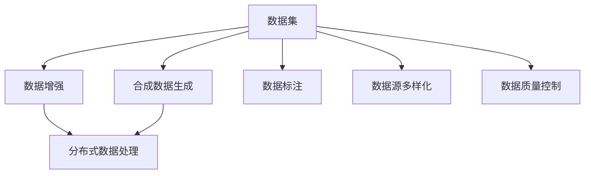

                 

# 第十一章：数据集和合成数据生成

> 关键词：数据集, 合成数据生成, 数据增强, 分布式数据处理, 数据标注, 数据源多样化, 数据质量和完整性

## 1. 背景介绍

在人工智能的训练和模型优化过程中，数据集的质量和数量是决定模型性能的关键因素。随着深度学习模型的发展，尤其是大语言模型和计算机视觉模型的应用，数据集的重要性愈发凸显。但现实情况中，获取高质量、大规模的数据往往面临诸多挑战。为了应对这些挑战，数据集生成技术应运而生，成为解决数据需求的重要手段。本章将深入探讨数据集和合成数据生成技术，从原理到实践，为读者呈现一个全面的视角。

### 1.1 数据集的重要性

在人工智能的训练过程中，数据集扮演着至关重要的角色。良好的数据集可以有效提升模型的泛化能力和准确性。数据集的重要性主要体现在以下几个方面：

1. **数据的多样性**：数据集应该涵盖广泛的场景和情况，以确保模型在不同情境下的稳定性和鲁棒性。
2. **数据的真实性**：数据集应尽可能反映真实世界的场景，避免偏见和误导。
3. **数据的大小**：大数据集有助于模型学习复杂的模式和规律，提升模型的性能。
4. **数据的可访问性**：高质量的数据集应当易于获取和处理，避免成为数据集构建的瓶颈。

### 1.2 数据集生成技术的发展

数据集生成技术的发展，是为了应对数据获取难度大和数据分布不均等问题。通过合成数据生成技术，可以从现有的数据集中提取和生成新的数据，用于模型的训练和评估。该技术在计算机视觉、自然语言处理、推荐系统等领域得到了广泛应用。数据集生成技术的发展，标志着人工智能数据需求的智能化、自动化趋势，为模型训练提供了更高效、更灵活的解决方案。

## 2. 核心概念与联系

### 2.1 核心概念概述

本节将介绍几个与数据集和合成数据生成密切相关的核心概念：

1. **数据集(Dataset)**：用于模型训练、评估和测试的数据集合，通常包括训练集、验证集和测试集。数据集的大小、多样性和质量直接影响模型的性能。
2. **合成数据生成(Synthetic Data Generation)**：通过算法生成具有与真实数据相似统计特性的虚拟数据，用于补充或替代真实数据集。
3. **数据增强(Data Augmentation)**：通过对训练数据进行变换、增强等操作，增加数据的多样性，提升模型的鲁棒性。
4. **分布式数据处理(Distributed Data Processing)**：通过分布式计算框架，对大规模数据集进行高效处理，加速数据集构建和模型训练。
5. **数据标注(Data Labeling)**：为数据集中的每个样本添加标签，用于模型的监督学习和训练。
6. **数据源多样化(Source Diversity)**：利用多种数据源和数据格式，构建多样化的数据集，提升模型的泛化能力。

### 2.2 核心概念原理和架构的 Mermaid 流程图



这个流程图展示了数据集构建过程中的各个环节及其相互关系：

1. **数据集**：是数据增强、合成数据生成等操作的起点。
2. **数据增强**：通过变换、噪声添加等手段，提升数据集的多样性。
3. **合成数据生成**：在现有数据基础上生成新的虚拟数据，增加数据量。
4. **分布式数据处理**：通过分布式计算，高效处理大规模数据集。
5. **数据标注**：为数据集中的每个样本添加标签，指导模型学习。
6. **数据源多样化**：利用不同来源的数据，构建多样化的数据集。
7. **数据质量控制**：确保数据集的完整性和准确性，避免噪音和偏见。

## 3. 核心算法原理 & 具体操作步骤

### 3.1 算法原理概述

数据集和合成数据生成技术，本质上是基于数据增强和数据插值的方法，通过算法生成具有真实数据相似特征的虚拟数据。其核心思想是通过对现有数据的变换、插值等操作，生成新的数据点，从而扩大数据集规模，提升模型性能。

形式化地，假设现有数据集为 $D=\{(x_i,y_i)\}_{i=1}^N$，其中 $x_i$ 为输入，$y_i$ 为标签。合成数据生成的目标是通过算法 $G$，生成新的数据点 $(x',y')$，使得其与真实数据相似，即：

$$
(x',y') \sim G(x,y)
$$

通常，$G$ 是一个概率分布或映射函数，用于生成与真实数据分布相似的新数据。合成数据生成的主要步骤如下：

1. 收集或生成现有数据集 $D$。
2. 定义合成数据生成算法 $G$。
3. 生成新的合成数据点 $(x',y')$。
4. 将合成数据点与现有数据混合，构建新的数据集。
5. 对新数据集进行数据增强、标注等操作，用于模型训练。

### 3.2 算法步骤详解

以下是对合成数据生成技术的详细步骤讲解：

#### 3.2.1 数据预处理

在进行合成数据生成之前，首先需要对现有数据进行预处理，包括数据清洗、标准化和归一化等操作。数据预处理的目的是提高数据质量，减少噪音和异常值，使得数据分布更加合理。

**数据清洗**：去除数据集中的无效数据、错误数据和异常值，确保数据集的一致性和准确性。

**数据标准化**：将数据转换为标准正态分布，使得不同特征具有相同的尺度，便于后续操作。

**数据归一化**：将数据缩放到0-1之间，避免特征之间尺度不一致导致的偏差。

#### 3.2.2 数据增强

数据增强是通过对现有数据进行变换、噪声添加等操作，生成新的数据点，以增加数据的多样性，提升模型的鲁棒性。常用的数据增强技术包括：

1. **随机裁剪**：随机裁剪原始图像或文本，增加数据的多样性。
2. **旋转、翻转**：对图像进行旋转、翻转等变换，生成新的图像数据。
3. **颜色抖动**：调整图像的颜色亮度、对比度等参数，生成不同的图像数据。
4. **噪声添加**：在图像中随机添加高斯噪声、椒盐噪声等，增加数据的不确定性。
5. **数据混合**：将不同的数据集混合，生成新的数据点。

#### 3.2.3 合成数据生成

合成数据生成是通过算法 $G$，生成新的数据点 $(x',y')$，使得其与真实数据相似。常用的合成数据生成算法包括：

1. **基于GAN的生成模型**：通过生成对抗网络(GAN)，生成与真实数据分布相似的新数据。
2. **基于VAE的生成模型**：通过变分自编码器(VAE)，生成具有随机性和连续性的新数据。
3. **基于插值的生成模型**：通过插值算法，生成具有连续性和可解释性的新数据。

#### 3.2.4 合成数据与现有数据混合

将生成的合成数据点 $(x',y')$ 与现有数据 $(x_i,y_i)$ 混合，构建新的数据集。新的数据集应该包含大量的合成数据和少量的真实数据，以确保模型的泛化能力和鲁棒性。

#### 3.2.5 数据标注和分布式处理

对新数据集进行数据标注，指导模型学习。同时，利用分布式计算框架，高效处理大规模数据集，加速数据集构建和模型训练。

### 3.3 算法优缺点

数据集和合成数据生成技术在提升模型性能和数据集多样性方面具有显著优势，但也存在一些局限性：

**优点**：

1. **数据多样性**：通过生成新的数据点，增加数据集的多样性，提升模型的泛化能力。
2. **数据效率**：合成数据生成可以在一定程度上缓解数据稀缺问题，降低数据获取成本。
3. **数据鲁棒性**：通过数据增强，提升模型对噪声和异常值的鲁棒性。

**缺点**：

1. **数据质量**：生成的合成数据可能存在噪音和不一致性，影响模型的性能。
2. **算法复杂度**：合成数据生成算法复杂，需要大量的计算资源和时间。
3. **数据依赖**：合成数据生成依赖于现有数据，难以独立生成高质量的数据集。

### 3.4 算法应用领域

数据集和合成数据生成技术在多个领域得到了广泛应用：

1. **计算机视觉**：在图像识别、目标检测等任务中，通过合成数据生成，增加数据集的多样性，提升模型的泛化能力。
2. **自然语言处理**：在文本分类、情感分析等任务中，通过生成新的文本数据，增加数据的多样性，提升模型的理解能力。
3. **推荐系统**：在推荐系统中，通过合成数据生成，增加用户行为数据的多样性，提升推荐系统的准确性和多样性。
4. **医疗领域**：在医疗影像分析、疾病预测等任务中，通过合成数据生成，增加数据集的多样性，提升模型的诊断能力。

## 4. 数学模型和公式 & 详细讲解 & 举例说明

### 4.1 数学模型构建

本节将使用数学语言对数据集和合成数据生成技术进行更加严格的刻画。

假设现有数据集为 $D=\{(x_i,y_i)\}_{i=1}^N$，其中 $x_i \in \mathbb{R}^d$ 为输入，$y_i \in \{0,1\}$ 为标签。合成数据生成算法 $G$ 的生成概率分布为 $P_{\theta}(x')$，其中 $\theta$ 为模型的参数。

定义生成数据集 $G(D)=\{(x',y')\}_{i=1}^N$，其中 $x' \sim P_{\theta}(x')$，$y' \sim P_{\theta}(y')$。通过合成数据生成算法，可以生成新的数据集，使得其与真实数据分布相似。

### 4.2 公式推导过程

以下推导数据增强和合成数据生成的数学模型。

**数据增强**：假设原始数据集为 $D=\{(x_i,y_i)\}_{i=1}^N$，对图像进行随机裁剪，生成新的图像数据 $(x',y')$。设裁剪后的图像尺寸为 $h \times w$，裁剪位置为 $(x,y)$，其中 $x$ 和 $y$ 为随机变量。则裁剪后的图像为：

$$
x' = \frac{1}{h}\sum_{i=0}^{h-1}\frac{1}{w}\sum_{j=0}^{w-1}x_{i,j}
$$

其中 $x_{i,j}$ 为原始图像的第 $i$ 行、第 $j$ 列的像素值。随机裁剪后的标签 $y'$ 与原始标签 $y$ 相同。

**合成数据生成**：假设原始数据集为 $D=\{(x_i,y_i)\}_{i=1}^N$，通过生成对抗网络(GAN)生成新的数据点 $(x',y')$。设生成器网络为 $G_{\theta}$，判别器网络为 $D_{\phi}$，其中 $\theta$ 和 $\phi$ 为网络的参数。生成器的目标是最小化判别器损失，即：

$$
\min_{\theta} \mathbb{E}_{x'} [\log D_{\phi}(x')] + \mathbb{E}_{x} [\log (1-D_{\phi}(G_{\theta}(x)))]
$$

判别器的目标是最小化生成器的损失，即：

$$
\min_{\phi} \mathbb{E}_{x} [\log D_{\phi}(x)] + \mathbb{E}_{x'} [\log (1-D_{\phi}(x'))]
$$

通过上述公式，可以构建生成对抗网络，生成与真实数据分布相似的新数据。

### 4.3 案例分析与讲解

以下是一个基于GAN生成器生成手写数字数据的案例：

1. 收集手写数字数据集，包括1000张手写数字图片和相应的标签。
2. 定义生成器网络，使用卷积神经网络(Convolutional Neural Network, CNN)结构。
3. 定义判别器网络，使用全连接神经网络(Fully Connected Neural Network, FCN)结构。
4. 通过训练生成对抗网络，生成新的手写数字图片。
5. 将生成的手写数字图片与原始数据混合，构建新的数据集。
6. 对新数据集进行数据增强、标注等操作，用于模型训练。

## 5. 项目实践：代码实例和详细解释说明

### 5.1 开发环境搭建

在进行数据集和合成数据生成实践前，我们需要准备好开发环境。以下是使用Python进行TensorFlow开发的环境配置流程：

1. 安装Anaconda：从官网下载并安装Anaconda，用于创建独立的Python环境。

2. 创建并激活虚拟环境：
```bash
conda create -n tf-env python=3.8 
conda activate tf-env
```

3. 安装TensorFlow：根据CUDA版本，从官网获取对应的安装命令。例如：
```bash
conda install tensorflow -c tf -c conda-forge
```

4. 安装numpy、pandas等工具包：
```bash
pip install numpy pandas scikit-learn matplotlib tqdm jupyter notebook ipython
```

完成上述步骤后，即可在`tf-env`环境中开始数据集和合成数据生成实践。

### 5.2 源代码详细实现

这里我们以生成手写数字图片数据为例，给出使用TensorFlow进行数据集和合成数据生成的代码实现。

首先，定义生成器网络：

```python
import tensorflow as tf

def create_generator():
    inputs = tf.keras.Input(shape=(100,))
    dense = tf.keras.layers.Dense(256)(inputs)
    relu = tf.keras.layers.Activation('relu')(dense)
    dense2 = tf.keras.layers.Dense(784, activation='tanh')(relu)
    flat = tf.keras.layers.Reshape((28, 28, 1))(dense2)
    return tf.keras.Model(inputs=inputs, outputs=flat)
```

然后，定义判别器网络：

```python
def create_discriminator():
    inputs = tf.keras.Input(shape=(28, 28, 1))
    conv1 = tf.keras.layers.Conv2D(32, 3, activation='relu')(inputs)
    conv2 = tf.keras.layers.MaxPooling2D()(conv1)
    conv3 = tf.keras.layers.Conv2D(64, 3, activation='relu')(conv2)
    conv4 = tf.keras.layers.MaxPooling2D()(conv3)
    flatten = tf.keras.layers.Flatten()(conv4)
    dense = tf.keras.layers.Dense(1, activation='sigmoid')(flatten)
    return tf.keras.Model(inputs=inputs, outputs=dense)
```

接着，定义生成器和判别器的损失函数和优化器：

```python
generator = create_generator()
discriminator = create_discriminator()

generator.compile(optimizer='adam', loss='binary_crossentropy')
discriminator.compile(optimizer='adam', loss='binary_crossentropy')

# 设置生成器的损失函数为判别器的输出
generator.compile(optimizer='adam', loss=discriminator.output)

# 训练生成对抗网络
epochs = 10000
batch_size = 128

for epoch in range(epochs):
    for _ in range(epochs//10):
        real_data = tf.random.normal(shape=(batch_size, 28, 28, 1))
        real_labels = tf.ones(batch_size)
        real_loss = discriminator.train_on_batch(real_data, real_labels)

        noise_data = tf.random.normal(shape=(batch_size, 100))
        fake_labels = tf.zeros(batch_size)
        fake_loss = discriminator.train_on_batch(generator(noise_data), fake_labels)

        gen_loss = generator.train_on_batch(noise_data, real_labels)

    print('Epoch:', epoch+1, 'Loss:', [real_loss, fake_loss, gen_loss])
```

最后，生成新的手写数字图片数据：

```python
def generate_images(n):
    noise = tf.random.normal(shape=(n, 100))
    generated_images = generator.predict(noise)
    generated_images = tf.reshape(generated_images, (n, 28, 28, 1))
    return generated_images

n = 100
new_images = generate_images(n)

plt.imshow(new_images[0, :, :, 0], cmap='gray')
plt.title('Generated Image')
plt.show()
```

以上代码实现了基于GAN生成手写数字图片数据的过程。可以看到，通过生成对抗网络，可以在少量真实数据的基础上，生成大量的新数据。

### 5.3 代码解读与分析

让我们再详细解读一下关键代码的实现细节：

**生成器和判别器网络**：
- 使用TensorFlow定义生成器和判别器网络结构，分别用于生成新的手写数字图片和判别真实图片和生成图片。
- 生成器网络使用CNN结构，通过全连接层、激活函数和卷积层等组件，将随机噪声输入转化为新的手写数字图片。
- 判别器网络使用FCN结构，通过卷积层、池化层和全连接层等组件，判断输入图片的真实性。

**损失函数和优化器**：
- 定义生成器、判别器的损失函数和优化器，使用Adam优化算法，以最小化生成对抗网络的损失。
- 将生成器的损失函数设置为判别器的输出，使得生成器在生成新图片的同时，也能优化判别器的性能。

**训练生成对抗网络**：
- 循环迭代训练生成对抗网络，通过随机生成真实数据和噪声数据，训练生成器和判别器。
- 每个epoch内，分别计算真实数据和生成数据的损失，并使用Adam优化器更新模型参数。
- 每10个epoch输出一次损失，观察模型训练过程的稳定性和收敛性。

**生成新的手写数字图片数据**：
- 定义生成函数，输入噪声数据，通过生成器网络生成新的手写数字图片。
- 使用Matplotlib可视化生成的图片，展示生成器网络的训练效果。

可以看到，TensorFlow提供了强大的深度学习框架，方便进行生成对抗网络等复杂模型的构建和训练。开发者可以将其灵活应用到各种合成数据生成的场景中。

当然，工业级的系统实现还需考虑更多因素，如模型的保存和部署、超参数的自动搜索、更灵活的任务适配层等。但核心的生成对抗网络训练流程基本与此类似。

## 6. 实际应用场景

### 6.1 智能医疗影像分析

在智能医疗影像分析中，数据集和合成数据生成技术可以用于生成假阳性/假阴性样本，增加数据集的多样性，提升模型的诊断能力。例如，通过生成对抗网络生成肺部CT图像，增加对肺结节的识别能力。

### 6.2 自动驾驶感知系统

在自动驾驶感知系统中，合成数据生成技术可以用于生成各种复杂的道路场景，如车辆、行人、交通灯等，增加训练集的多样性，提升模型的感知能力。例如，通过生成对抗网络生成夜间的城市街道图像，增加对夜间驾驶场景的适应能力。

### 6.3 自然语言处理(NLP)

在自然语言处理(NLP)中，合成数据生成技术可以用于生成文本样本，增加数据集的多样性，提升模型的理解能力。例如，通过生成对抗网络生成自然语言文本，增加对不同语言风格的适应能力。

### 6.4 工业机器人控制

在工业机器人控制中，合成数据生成技术可以用于生成机器人的工作场景，增加训练集的多样性，提升机器人的智能控制能力。例如，通过生成对抗网络生成机器人的动作序列，增加对复杂动作的识别能力。

## 7. 工具和资源推荐

### 7.1 学习资源推荐

为了帮助开发者系统掌握数据集和合成数据生成技术的理论基础和实践技巧，这里推荐一些优质的学习资源：

1. 《Python数据科学手册》：这本书全面介绍了Python在数据处理、数据分析、数据可视化等方面的应用，适合初学者快速入门。
2. 《深度学习》课程：由斯坦福大学开设的深度学习课程，讲解了深度学习的基本原理和应用，涵盖神经网络、卷积神经网络、生成对抗网络等主题。
3. 《数据科学基础》：这本书介绍了数据科学的基本概念和工具，包括数据清洗、数据增强、数据标注等技术。
4. Kaggle竞赛：Kaggle是一个数据科学竞赛平台，提供大量数据集和比赛，可以用于实践数据集和合成数据生成技术。
5. TensorFlow官方文档：TensorFlow提供了详细的文档和教程，适合深入学习深度学习框架和数据处理技术。

通过对这些资源的学习实践，相信你一定能够快速掌握数据集和合成数据生成的精髓，并用于解决实际的数据问题。

### 7.2 开发工具推荐

高效的开发离不开优秀的工具支持。以下是几款用于数据集和合成数据生成开发的常用工具：

1. TensorFlow：由Google主导开发的开源深度学习框架，生产部署方便，适合大规模工程应用。提供丰富的深度学习组件和数据处理工具。
2. PyTorch：基于Python的开源深度学习框架，灵活动态的计算图，适合快速迭代研究。提供了丰富的深度学习组件和数据处理工具。
3. OpenAI GPT-3：最新的自然语言处理模型，支持文本生成和语义理解。
4. Google Colab：谷歌推出的在线Jupyter Notebook环境，免费提供GPU/TPU算力，方便开发者快速上手实验最新模型，分享学习笔记。
5. Jupyter Notebook：常用的Python开发工具，支持多种语言和库，适合进行交互式学习和开发。

合理利用这些工具，可以显著提升数据集和合成数据生成任务的开发效率，加快创新迭代的步伐。

### 7.3 相关论文推荐

数据集和合成数据生成技术的发展，得益于学界的持续研究。以下是几篇奠基性的相关论文，推荐阅读：

1. 《Deep Learning》：由Ian Goodfellow、Yoshua Bengio和Aaron Courville合著，系统介绍了深度学习的基本概念和算法。
2. 《Generative Adversarial Networks》：由Ian Goodfellow等提出，奠定了生成对抗网络的基础。
3. 《Super Resolution Learned Image Patch Exemplar Synthesis》：通过生成对抗网络，合成高质量的超分辨率图像。
4. 《An Analysis of Generative Adversarial Networks and Variants》：对生成对抗网络及其变体进行了全面分析，探讨了其优缺点和应用场景。
5. 《Semantic Image Synthesis with Deep Generative Models》：通过生成对抗网络，生成具有语义信息的高质量图像。

这些论文代表了大数据集和合成数据生成技术的发展脉络。通过学习这些前沿成果，可以帮助研究者把握学科前进方向，激发更多的创新灵感。

## 8. 总结：未来发展趋势与挑战

### 8.1 研究成果总结

本文对数据集和合成数据生成技术进行了全面系统的介绍。首先阐述了数据集的重要性，然后介绍了数据集和合成数据生成技术的核心概念和原理，详细讲解了合成数据生成的数学模型和算法步骤，给出了基于TensorFlow的代码实例和详细解释说明。最后，探讨了数据集和合成数据生成技术在多个领域的应用前景，并推荐了相关的学习资源、开发工具和研究论文。

### 8.2 未来发展趋势

展望未来，数据集和合成数据生成技术将呈现以下几个发展趋势：

1. **自动化数据生成**：随着深度学习技术的发展，未来将出现更加智能、自动化的数据生成技术，能够根据任务需求，自动生成高质量的数据集。
2. **跨领域数据生成**：数据生成技术将不再局限于单一领域，而是跨领域融合，生成更加多样化的数据集，提升模型的泛化能力。
3. **分布式数据处理**：数据生成和处理将更加依赖于分布式计算框架，如TensorFlow、PyTorch等，以应对大规模数据集的处理需求。
4. **数据质量提升**：数据生成技术的目标是生成与真实数据相似的新数据，未来将更加注重生成数据的质量和一致性。
5. **数据增强技术**：数据增强技术将不断优化，提升数据的多样性和鲁棒性，减少对标注数据的依赖。

### 8.3 面临的挑战

尽管数据集和合成数据生成技术在数据集构建和模型训练中发挥了重要作用，但在应用过程中仍面临诸多挑战：

1. **数据生成算法复杂**：生成对抗网络等算法需要大量的计算资源和时间，难以快速生成高质量数据集。
2. **数据生成质量不稳定**：生成的数据可能存在噪音和不一致性，影响模型的性能。
3. **数据依赖性**：生成数据需要依赖于现有数据，难以独立生成高质量的数据集。
4. **数据标注成本**：大规模数据集标注成本高昂，成为数据集构建的瓶颈。
5. **数据隐私和安全**：生成数据可能包含敏感信息，需要采取隐私保护措施。

### 8.4 研究展望

面对数据集和合成数据生成技术面临的挑战，未来的研究需要在以下几个方面寻求新的突破：

1. **优化生成算法**：通过改进生成对抗网络等算法，提升数据生成的质量和效率，减少计算资源和时间消耗。
2. **增强数据质量控制**：采用更加先进的数据增强和数据质量控制技术，提升生成数据的稳定性和一致性。
3. **跨领域数据融合**：探索跨领域数据融合技术，生成更加多样化和泛化的数据集。
4. **自动化标注系统**：开发自动化标注系统，减少数据标注的成本和时间，提高标注效率。
5. **隐私保护技术**：研究隐私保护技术，保护生成数据的隐私和安全。

这些研究方向的探索，必将引领数据集和合成数据生成技术迈向更高的台阶，为数据集构建和模型训练提供更高效、更灵活的解决方案。面向未来，数据集和合成数据生成技术需要在理论和实践两个方面不断创新，共同推动人工智能技术的进步。

## 9. 附录：常见问题与解答

**Q1：数据集和合成数据生成技术在实际应用中需要注意哪些问题？**

A: 在实际应用中，数据集和合成数据生成技术需要注意以下几个问题：

1. **数据多样性**：生成的数据应尽可能涵盖多种情况和场景，以确保模型在各种情境下的稳定性和鲁棒性。
2. **数据质量**：生成的数据应与真实数据相似，避免噪音和不一致性，确保模型的准确性和可靠性。
3. **数据依赖性**：生成数据需要依赖于现有数据，难以独立生成高质量的数据集，需要注意数据的代表性。
4. **数据标注**：生成数据需要与现有数据进行混合，进行数据标注和分布式处理，确保数据集的多样性和标注数据的准确性。
5. **计算资源**：生成对抗网络等算法需要大量的计算资源和时间，需要考虑硬件的瓶颈和成本。

**Q2：如何评估生成数据的质量？**

A: 评估生成数据的质量，主要从以下几个方面考虑：

1. **统计分布**：生成的数据应与真实数据具有相似的统计分布，避免偏见和偏差。
2. **可视化效果**：通过可视化生成数据，检查其是否具有真实的图像或文本特征。
3. **评估指标**：使用各种评估指标，如均方误差、交叉熵等，衡量生成数据的性能。
4. **人类评估**：通过人类评估，检查生成数据是否具有可理解性和真实性。

**Q3：数据集和合成数据生成技术在工业应用中需要考虑哪些因素？**

A: 数据集和合成数据生成技术在工业应用中，需要考虑以下因素：

1. **计算资源**：生成数据需要大量的计算资源和时间，需要考虑硬件的瓶颈和成本。
2. **数据隐私**：生成的数据可能包含敏感信息，需要采取隐私保护措施。
3. **数据标注**：大规模数据集标注成本高昂，需要考虑自动化标注系统的开发。
4. **模型性能**：生成的数据应尽可能提高模型的泛化能力和鲁棒性。
5. **系统集成**：数据集和生成数据需要与现有系统进行集成，确保数据兼容性和应用稳定性。

**Q4：数据集和合成数据生成技术在实际应用中如何优化？**

A: 数据集和合成数据生成技术在实际应用中，可以从以下几个方面进行优化：

1. **优化生成算法**：改进生成对抗网络等算法，提升数据生成的质量和效率。
2. **增强数据质量控制**：采用更加先进的数据增强和数据质量控制技术，提升生成数据的稳定性和一致性。
3. **跨领域数据融合**：探索跨领域数据融合技术，生成更加多样化和泛化的数据集。
4. **自动化标注系统**：开发自动化标注系统，减少数据标注的成本和时间，提高标注效率。
5. **隐私保护技术**：研究隐私保护技术，保护生成数据的隐私和安全。

这些优化措施可以帮助提高数据集和合成数据生成技术的实用性和可靠性，推动其在实际应用中的广泛应用。

**Q5：数据集和合成数据生成技术在医疗影像分析中的应用前景如何？**

A: 数据集和合成数据生成技术在医疗影像分析中具有广泛的应用前景：

1. **生成假阳性/假阴性样本**：通过生成对抗网络生成假阳性/假阴性样本，增加数据集的多样性，提升模型的诊断能力。
2. **生成复杂病例图像**：通过生成对抗网络生成复杂的医疗影像图像，增加对罕见病例的适应能力。
3. **数据隐私保护**：生成数据可以保护患者隐私，避免泄露敏感信息。
4. **模型泛化能力**：生成数据可以提高模型的泛化能力，提升对不同类型病例的识别能力。

总之，数据集和合成数据生成技术在医疗影像分析中的应用前景广阔，具有重要的实际价值和理论意义。

