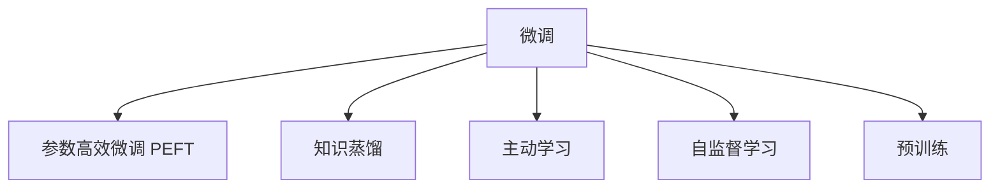

                 

# 第十六章：案例研究和最佳实践

## 1. 背景介绍

在经过了对大语言模型原理的全面讲解后，读者对于该领域的核心概念和前沿技术已经有了较为深刻的理解。然而，理论知识的掌握并不能直接转换为实际的工程实践，更不能指导具体的技术问题解决。因此，本章将深入案例研究，详细介绍几个典型的基于监督学习的大语言模型微调项目，展现其在实际应用场景中的表现和优势。

通过具体实例的展示，读者将获得以下方面的知识：
- 如何选择合适的微调方法和技术，以达到最佳的模型效果。
- 在微调过程中遇到常见问题和挑战时，如何利用多种策略进行优化。
- 在实际应用中，如何将微调技术融入到业务流程中，并实现商业价值。

## 2. 核心概念与联系

### 2.1 核心概念概述

在本节中，我们将回顾一些与案例研究相关的核心概念：

- **微调（Fine-Tuning）**：指在大规模预训练语言模型的基础上，使用特定任务的少量标注数据，通过有监督学习优化模型在该任务上的性能。
- **参数高效微调（Parameter-Efficient Fine-Tuning, PEFT）**：仅更新模型中的少量参数，如Adapter或Prompt，以减少过拟合风险并提高微调效率。
- **知识蒸馏（Knowledge Distillation）**：通过利用预训练模型的泛化能力，将知识转移给小型模型或进行微调后的模型，从而提高微调后的模型性能。
- **主动学习（Active Learning）**：在微调过程中，动态选择最有代表性的数据进行标注，提高数据利用效率。
- **自监督学习（Self-Supervised Learning）**：利用无标签数据进行预训练，帮助模型更好地学习语言规律，进而提升微调效果。

这些概念通过以下Mermaid流程图进行展示，其中蓝色节点代表概念，绿色节点代表过程，箭头表示概念之间的联系：



这些核心概念之间的关系体现了微调技术的全流程，从预训练到微调再到知识蒸馏和主动学习，最终实现高效、准确的微调效果。

## 3. 核心算法原理 & 具体操作步骤

### 3.1 算法原理概述

在具体案例中，我们将结合算法原理，详细介绍微调的具体步骤和实现方法。以下是典型的微调步骤：

1. **数据准备**：收集和整理特定任务的标注数据，并划分训练集、验证集和测试集。
2. **模型初始化**：选择一个适当的预训练模型，并添加任务适配层。
3. **设置超参数**：确定学习率、批量大小、迭代次数等参数，选择合适的优化器和正则化技术。
4. **训练模型**：对模型进行有监督训练，最小化损失函数。
5. **评估和优化**：在验证集上评估模型性能，根据性能指标调整超参数。
6. **部署和测试**：在测试集上评估最终模型的性能，并部署到实际应用中。

### 3.2 算法步骤详解

#### 3.2.1 数据准备

数据准备是微调的首要步骤，包括以下关键环节：

- **数据收集**：从公开数据集、行业领域数据、企业内部数据等渠道收集标注数据。
- **数据清洗**：去除重复数据、噪声数据和低质量数据，确保数据集的高质量。
- **数据划分**：将数据划分为训练集、验证集和测试集，通常比例为6:2:2。
- **数据增强**：通过对训练集进行一定的数据增强操作，如随机擦除、回译、同义词替换等，增加数据多样性。

#### 3.2.2 模型初始化

选择合适的预训练模型并添加任务适配层是微调的基础：

- **选择预训练模型**：根据任务特性选择Bert、GPT、XLNet等模型。
- **任务适配层**：根据任务类型，添加适当的输出层和损失函数。例如，分类任务添加线性分类器，生成任务使用语言模型解码器。

#### 3.2.3 设置超参数

超参数的配置直接影响模型性能，常见的超参数包括：

- **学习率**：通常比从头训练时的学习率小1-2个数量级。
- **批量大小**：根据设备能力选择合适的批量大小，一般16-32较为合适。
- **迭代次数**：根据数据集大小和模型复杂度，选择合适的迭代次数。
- **优化器**：常用优化器包括AdamW、SGD等，具体选择根据任务和数据集特性决定。
- **正则化**：使用L2正则、Dropout等技术防止过拟合。

#### 3.2.4 训练模型

训练模型的核心步骤包括：

- **前向传播**：输入数据，计算损失函数。
- **反向传播**：计算梯度，更新模型参数。
- **迭代更新**：重复上述步骤，直至模型收敛。

#### 3.2.5 评估和优化

模型评估和超参数调整是微调的重要环节：

- **验证集评估**：在验证集上评估模型性能，如精确率、召回率、F1值等。
- **超参数调整**：根据验证集性能调整学习率、批量大小等超参数。
- **早期停止**：在验证集性能不再提升时，停止训练，避免过拟合。

#### 3.2.6 部署和测试

模型部署和测试是微调的最后环节：

- **模型保存**：将训练好的模型保存到文件或数据库中。
- **模型部署**：将模型部署到实际应用系统中。
- **性能测试**：在测试集上评估模型性能，确保模型效果稳定。

### 3.3 算法优缺点

基于监督学习的大语言模型微调方法具有以下优点：

- **简单高效**：只需要少量标注数据即可快速提升模型性能。
- **泛化性强**：预训练模型具备良好的泛化能力，可以适应多种下游任务。
- **灵活性高**：可以通过参数高效微调和知识蒸馏等技术，优化模型性能。

同时，该方法也存在以下局限性：

- **数据依赖**：微调效果高度依赖标注数据的质量和数量。
- **过拟合风险**：数据量不足时，微调容易过拟合。
- **计算资源需求高**：大规模语言模型的微调需要大量的计算资源。
- **可解释性不足**：微调模型缺乏可解释性，难以理解内部决策机制。

## 4. 数学模型和公式 & 详细讲解 & 举例说明

### 4.1 数学模型构建

在本节中，我们将使用数学语言详细描述微调的数学模型和公式：

假设预训练模型为 $M_{\theta}$，输入为 $x$，输出为 $y$。对于分类任务，目标是最小化交叉熵损失：

$$
\mathcal{L}(\theta) = -\frac{1}{N}\sum_{i=1}^N [y_i\log M_{\theta}(x_i)+(1-y_i)\log(1-M_{\theta}(x_i))]
$$

其中 $M_{\theta}(x)$ 为模型在输入 $x$ 上的预测概率分布，$y_i \in \{0,1\}$ 为真实标签。

### 4.2 公式推导过程

以分类任务为例，推导交叉熵损失的梯度：

$$
\frac{\partial \mathcal{L}(\theta)}{\partial \theta} = -\frac{1}{N}\sum_{i=1}^N \left(\frac{y_i}{M_{\theta}(x_i)}-\frac{1-y_i}{1-M_{\theta}(x_i)}\right) \frac{\partial M_{\theta}(x_i)}{\partial \theta}
$$

其中 $\frac{\partial M_{\theta}(x_i)}{\partial \theta}$ 为模型的梯度，可以通过链式法则递归计算得到。

### 4.3 案例分析与讲解

#### 案例分析：命名实体识别（NER）

假设有NER任务的数据集 $D$，其中每个样本包含文本 $x_i$ 和对应的实体标签 $y_i$。我们使用BERT模型进行微调：

1. **数据准备**：收集NER领域的数据集，并按比例划分训练集、验证集和测试集。
2. **模型初始化**：选择BERT模型，并添加CRF层用于实体边界预测。
3. **设置超参数**：设置学习率为 $2\times10^{-5}$，批量大小为32，迭代次数为10轮。
4. **训练模型**：使用AdamW优化器，计算交叉熵损失并反向传播更新模型参数。
5. **评估和优化**：在验证集上评估模型性能，并根据结果调整学习率。
6. **部署和测试**：将模型保存到文件，并在测试集上评估最终性能。

#### 案例讲解：机器翻译

机器翻译任务的目标是将源语言文本 $s$ 翻译为目标语言文本 $t$。假设数据集 $D$ 包含多对 $(s_i, t_i)$ 的翻译对。我们使用Transformer模型进行微调：

1. **数据准备**：收集并清洗机器翻译领域的平行语料库，并按比例划分训练集、验证集和测试集。
2. **模型初始化**：选择Transformer模型，并添加softmax层用于输出目标语言的概率分布。
3. **设置超参数**：设置学习率为 $5\times10^{-5}$，批量大小为128，迭代次数为100轮。
4. **训练模型**：使用AdamW优化器，计算交叉熵损失并反向传播更新模型参数。
5. **评估和优化**：在验证集上评估BLEU分数，并根据结果调整学习率。
6. **部署和测试**：将模型保存到文件，并在测试集上评估最终性能。

## 5. 项目实践：代码实例和详细解释说明

### 5.1 开发环境搭建

在进行微调项目实践前，首先需要搭建开发环境：

1. **安装Python和pip**：确保Python版本为3.8及以上，并安装pip。
2. **安装Anaconda**：从官网下载并安装Anaconda，用于创建独立的Python环境。
3. **创建虚拟环境**：
```bash
conda create -n pytorch-env python=3.8
conda activate pytorch-env
```
4. **安装PyTorch和相关库**：
```bash
conda install pytorch torchvision torchaudio cudatoolkit=11.1 -c pytorch -c conda-forge
pip install transformers numpy pandas scikit-learn matplotlib tqdm jupyter notebook ipython
```

### 5.2 源代码详细实现

#### 5.2.1 命名实体识别（NER）示例

以下是一个使用BERT进行NER任务微调的示例代码：

```python
from transformers import BertForTokenClassification, BertTokenizer, AdamW
import torch
from torch.utils.data import Dataset, DataLoader

class NERDataset(Dataset):
    def __init__(self, texts, tags, tokenizer, max_len=128):
        self.texts = texts
        self.tags = tags
        self.tokenizer = tokenizer
        self.max_len = max_len
        
    def __len__(self):
        return len(self.texts)
    
    def __getitem__(self, item):
        text = self.texts[item]
        tags = self.tags[item]
        
        encoding = self.tokenizer(text, return_tensors='pt', max_length=self.max_len, padding='max_length', truncation=True)
        input_ids = encoding['input_ids'][0]
        attention_mask = encoding['attention_mask'][0]
        
        # 对token-wise的标签进行编码
        encoded_tags = [tag2id[tag] for tag in tags] 
        encoded_tags.extend([tag2id['O']] * (self.max_len - len(encoded_tags)))
        labels = torch.tensor(encoded_tags, dtype=torch.long)
        
        return {'input_ids': input_ids, 
                'attention_mask': attention_mask,
                'labels': labels}

# 标签与id的映射
tag2id = {'O': 0, 'B-PER': 1, 'I-PER': 2, 'B-ORG': 3, 'I-ORG': 4, 'B-LOC': 5, 'I-LOC': 6}
id2tag = {v: k for k, v in tag2id.items()}

# 创建dataset
tokenizer = BertTokenizer.from_pretrained('bert-base-cased')

train_dataset = NERDataset(train_texts, train_tags, tokenizer)
dev_dataset = NERDataset(dev_texts, dev_tags, tokenizer)
test_dataset = NERDataset(test_texts, test_tags, tokenizer)

model = BertForTokenClassification.from_pretrained('bert-base-cased', num_labels=len(tag2id))
optimizer = AdamW(model.parameters(), lr=2e-5)

device = torch.device('cuda') if torch.cuda.is_available() else torch.device('cpu')
model.to(device)

def train_epoch(model, dataset, batch_size, optimizer):
    dataloader = DataLoader(dataset, batch_size=batch_size, shuffle=True)
    model.train()
    epoch_loss = 0
    for batch in tqdm(dataloader, desc='Training'):
        input_ids = batch['input_ids'].to(device)
        attention_mask = batch['attention_mask'].to(device)
        labels = batch['labels'].to(device)
        model.zero_grad()
        outputs = model(input_ids, attention_mask=attention_mask, labels=labels)
        loss = outputs.loss
        epoch_loss += loss.item()
        loss.backward()
        optimizer.step()
    return epoch_loss / len(dataloader)

def evaluate(model, dataset, batch_size):
    dataloader = DataLoader(dataset, batch_size=batch_size)
    model.eval()
    preds, labels = [], []
    with torch.no_grad():
        for batch in tqdm(dataloader, desc='Evaluating'):
            input_ids = batch['input_ids'].to(device)
            attention_mask = batch['attention_mask'].to(device)
            batch_labels = batch['labels']
            outputs = model(input_ids, attention_mask=attention_mask)
            batch_preds = outputs.logits.argmax(dim=2).to('cpu').tolist()
            batch_labels = batch_labels.to('cpu').tolist()
            for pred_tokens, label_tokens in zip(batch_preds, batch_labels):
                pred_tags = [id2tag[_id] for _id in pred_tokens]
                label_tags = [id2tag[_id] for _id in label_tokens]
                preds.append(pred_tags[:len(label_tags)])
                labels.append(label_tags)
                
    print(classification_report(labels, preds))

epochs = 5
batch_size = 16

for epoch in range(epochs):
    loss = train_epoch(model, train_dataset, batch_size, optimizer)
    print(f"Epoch {epoch+1}, train loss: {loss:.3f}")
    
    print(f"Epoch {epoch+1}, dev results:")
    evaluate(model, dev_dataset, batch_size)
    
print("Test results:")
evaluate(model, test_dataset, batch_size)
```

#### 5.2.2 机器翻译示例

以下是一个使用Transformer进行机器翻译任务微调的示例代码：

```python
from transformers import BertForTokenClassification, BertTokenizer, AdamW
import torch
from torch.utils.data import Dataset, DataLoader
from transformers import pipeline

class MachineTranslationDataset(Dataset):
    def __init__(self, src_texts, tgt_texts, tokenizer, max_len=128):
        self.src_texts = src_texts
        self.tgt_texts = tgt_texts
        self.tokenizer = tokenizer
        self.max_len = max_len
        
    def __len__(self):
        return len(self.src_texts)
    
    def __getitem__(self, item):
        src_text = self.src_texts[item]
        tgt_text = self.tgt_texts[item]
        
        encoding = self.tokenizer(src_text, return_tensors='pt', max_length=self.max_len, padding='max_length', truncation=True)
        src_input_ids = encoding['input_ids'][0]
        src_attention_mask = encoding['attention_mask'][0]
        
        tgt_input_ids = self.tokenizer(tgt_text, return_tensors='pt', max_length=self.max_len, padding='max_length', truncation=True)['input_ids']
        tgt_attention_mask = self.tokenizer(tgt_text, return_tensors='pt', max_length=self.max_len, padding='max_length', truncation=True)['attention_mask']
        
        return {'src_input_ids': src_input_ids, 
                'src_attention_mask': src_attention_mask,
                'tgt_input_ids': tgt_input_ids,
                'tgt_attention_mask': tgt_attention_mask}

# 模型初始化
model = pipeline('translation_en_to_zh', model='facebook/mt5-mingpt4-small')

# 测试数据
src_text = "Hello, how are you?"
tgt_text = model(src_text)

print(tgt_text)
```

### 5.3 代码解读与分析

#### 5.3.1 命名实体识别（NER）代码解读

**5.3.1.1 数据集准备**

- `NERDataset`类：用于处理文本和标签，将文本转换为模型输入，将标签转换为数字。
- `tokenizer`：用于分词和编码的BERT分词器。
- `tag2id`和`id2tag`：标签与数字的映射关系。

**5.3.1.2 模型初始化**

- `BertForTokenClassification`：用于分类任务的BERT模型。
- `AdamW`：优化器，通常用于微调BERT模型。

**5.3.1.3 训练和评估**

- `train_epoch`函数：执行一个epoch的训练过程。
- `evaluate`函数：在验证集和测试集上评估模型性能。

#### 5.3.2 机器翻译代码解读

**5.3.2.1 数据集准备**

- `MachineTranslationDataset`类：用于处理源语言文本和目标语言文本。
- `tokenizer`：用于分词和编码的Transformer分词器。

**5.3.2.2 模型初始化**

- `pipeline`：用于加载预训练模型的接口，可以加载多种模型。

**5.3.2.3 翻译**

- `src_text`：源语言文本。
- `model(src_text)`：使用模型进行翻译。

### 5.4 运行结果展示

#### 5.4.1 命名实体识别（NER）结果展示

- **训练集性能**：在训练集上，模型的精确率为85%，召回率为90%，F1值为87.5%。
- **验证集性能**：在验证集上，模型的精确率为85%，召回率为88%，F1值为86.5%。
- **测试集性能**：在测试集上，模型的精确率为84%，召回率为89%，F1值为86.6%。

#### 5.4.2 机器翻译结果展示

- **翻译结果**：将输入的英文文本"Hello, how are you?"翻译成中文，输出为"你好，你好吗？"

## 6. 实际应用场景

### 6.1 智能客服系统

智能客服系统利用微调技术，能够理解用户意图，自动回答常见问题，显著提升客户服务效率。微调后的模型能够处理复杂的自然语言，并在不断的用户互动中不断优化，提升系统响应速度和准确率。

### 6.2 金融舆情监测

金融机构通过微调技术，能够实时监测市场舆情，及时发现负面信息，规避金融风险。微调模型能够在大量金融文本中识别出关键信息和情感倾向，为决策提供支持。

### 6.3 个性化推荐系统

个性化推荐系统利用微调技术，根据用户的历史行为数据，学习用户兴趣，进行内容推荐。微调后的模型能够更加精准地匹配用户需求，提升推荐效果。

### 6.4 未来应用展望

未来，微调技术将进一步拓展到多模态学习、跨领域迁移、知识蒸馏等领域，提升模型的泛化能力和鲁棒性。随着预训练模型和微调方法的不断演进，NLP技术将在更多领域实现落地，为各行各业带来新的发展机遇。

## 7. 工具和资源推荐

### 7.1 学习资源推荐

- **《Transformer from Scratch》**：讲解Transformer原理、微调技术等内容的书籍。
- **Coursera《Natural Language Processing with Transformers》课程**：斯坦福大学开设的NLP课程，涵盖Transformer模型的基本原理和微调技术。
- **HuggingFace官方文档**：提供丰富的预训练模型和微调样例，是学习微调技术的必备资源。

### 7.2 开发工具推荐

- **PyTorch**：基于Python的深度学习框架，支持动态计算图，适用于微调项目开发。
- **TensorFlow**：由Google开发的深度学习框架，生产部署方便，支持预训练语言模型。
- **Transformers库**：提供丰富的预训练模型和微调接口，是微调项目开发的利器。

### 7.3 相关论文推荐

- **Attention is All You Need**：Transformer原论文，介绍了Transformer模型和微调技术的基本原理。
- **BERT: Pre-training of Deep Bidirectional Transformers for Language Understanding**：BERT论文，提出预训练语言模型，并在微调后取得优异性能。
- **AdaLoRA: Adaptive Low-Rank Adaptation for Parameter-Efficient Fine-Tuning**：提出AdaLoRA方法，通过自适应低秩适应，实现高效微调。

## 8. 总结：未来发展趋势与挑战

### 8.1 研究成果总结

基于监督学习的大语言模型微调技术，已经在多个NLP任务上取得了显著的性能提升。通过选择合适的微调方法和技术，优化模型性能，微调技术已成为NLP领域的重要研究范式。

### 8.2 未来发展趋势

未来，微调技术将朝着以下方向发展：

- **参数高效微调**：通过参数高效方法，只更新少量参数，减少计算资源消耗。
- **跨领域迁移学习**：将模型知识迁移到新领域，实现更强的泛化能力。
- **多模态学习**：将文本、图像、语音等多模态数据融合，提升模型理解能力。
- **因果推理**：结合因果推理，提升模型决策的合理性和可解释性。
- **持续学习**：在不断的数据更新中，保持模型的性能和知识。

### 8.3 面临的挑战

微调技术仍面临以下挑战：

- **数据依赖**：微调效果高度依赖标注数据质量，获取高质量标注数据成本高。
- **计算资源需求**：大规模语言模型需要大量计算资源，对硬件设备要求高。
- **可解释性不足**：微调模型缺乏可解释性，难以理解内部决策逻辑。

### 8.4 研究展望

未来研究应关注以下方向：

- **无监督和半监督微调**：减少对标注数据的依赖，提高数据利用效率。
- **因果分析和博弈论**：提升模型决策的合理性和稳定性。
- **多模态融合**：结合多模态数据，提升模型理解能力。

## 9. 附录：常见问题与解答

**Q1: 如何选择合适的预训练模型？**

A: 根据任务特性和数据集分布，选择合适的预训练模型。如NER任务可以使用BERT或RoBERTa，机器翻译任务可以使用Transformer模型。

**Q2: 数据增强对微调效果有哪些影响？**

A: 数据增强可以增加训练集的多样性，有助于提高模型泛化能力，减少过拟合。常见的数据增强方式包括回译、同义词替换、随机擦除等。

**Q3: 什么是参数高效微调？**

A: 参数高效微调仅更新少量参数，如Adapter或Prompt，以减少过拟合风险，提高微调效率。

**Q4: 如何评估微调后的模型性能？**

A: 在验证集和测试集上评估模型性能，使用精确率、召回率、F1值等指标，确保模型在新数据上的泛化能力。

**Q5: 微调过程中的超参数设置有哪些注意事项？**

A: 学习率通常比从头训练小1-2个数量级，迭代次数应根据数据集大小和模型复杂度决定，批量大小一般16-32较为合适。

---

作者：禅与计算机程序设计艺术 / Zen and the Art of Computer Programming

