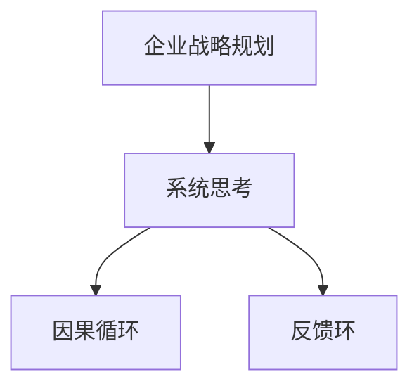

                 

# 系统思考在战略规划中的应用

## 1. 背景介绍

在现代商业环境中，企业面临着复杂多变的外部环境，如何在竞争激烈的市场中保持优势，制定并实施有效的战略规划，是每个企业的核心任务之一。系统思考（Systems Thinking）作为解决复杂问题的一种重要方法，近年来被广泛应用于企业战略规划中。系统思考强调从整体视角出发，分析系统的各个组成部分及其相互作用，从而做出科学、合理的战略决策。本文将系统思考的核心概念、原理和操作流程与企业战略规划相结合，探讨其在战略规划中的应用。

## 2. 核心概念与联系

### 2.1 核心概念概述

- **系统思考**：系统思考是一种解决问题的方法，它强调从整体视角出发，考虑系统的各个组成部分及其相互作用，以全面理解系统行为，并提出有效的解决方案。
- **企业战略规划**：企业战略规划是企业高层管理人员对企业的未来发展方向进行规划和设计的过程。它包括对内外部环境的分析、目标设定、资源配置、行动计划等环节。
- **因果循环**：因果循环是指系统内部各组成部分之间相互依存、相互影响的关系。在企业战略规划中，了解这些因果关系有助于全面分析企业的问题和机会。
- **反馈环**：反馈环是指系统内信息从输出到输入的循环过程，用于调整系统的行为和策略。在企业战略规划中，及时获取外部环境的反馈信息，调整内部战略，确保企业动态适应外部环境的变化。

### 2.2 核心概念原理和架构的 Mermaid 流程图



系统思考与企业战略规划之间的联系主要体现在：系统思考提供了一种全局视角，帮助企业战略规划人员全面分析企业内外部环境，识别问题并提出解决方案；同时，企业战略规划的实施过程中，也需要运用系统思考的方法，对企业战略的实施效果进行反馈和调整。

## 3. 核心算法原理 & 具体操作步骤

### 3.1 算法原理概述

系统思考在企业战略规划中的应用主要包括以下几个步骤：

1. **系统定义**：明确企业战略规划所研究的对象和范围，构建系统的边界。
2. **因果分析**：分析系统中各组成部分之间的关系，识别因果链和影响因素。
3. **模型构建**：建立系统的数学模型，描述系统的行为和结构。
4. **仿真模拟**：通过仿真模拟，预测系统在不同战略决策下的行为结果。
5. **战略优化**：根据仿真结果，优化企业战略规划，确保战略实施的有效性。

### 3.2 算法步骤详解

#### 3.2.1 系统定义

在企业战略规划的初期，首先需要明确研究的对象和范围。这包括企业的行业环境、竞争对手、市场趋势、内部资源等。通过系统定义，构建系统的边界，确定研究重点。

#### 3.2.2 因果分析

因果分析是系统思考的核心步骤。通过对企业内外部的各个组成部分进行深入分析，识别出因果链和影响因素。例如，企业可以通过对市场份额、成本结构、技术创新等关键指标的分析，识别出影响企业竞争力的主要因素。

#### 3.2.3 模型构建

模型构建是系统思考的重要组成部分。通过建立数学模型，可以量化和描述系统的行为和结构。例如，企业可以建立基于因果关系的系统动力学模型，描述企业在不同市场环境下的动态行为。

#### 3.2.4 仿真模拟

仿真模拟是通过仿真工具对建立的模型进行测试和验证，预测企业在不同战略决策下的行为结果。例如，企业可以构建市场份额、销售额、利润等指标的仿真模型，模拟不同市场策略的效果。

#### 3.2.5 战略优化

战略优化是通过仿真结果，对企业战略规划进行调整和优化。例如，企业可以通过仿真结果，调整产品定价、营销策略、市场定位等关键环节，确保战略实施的有效性。

### 3.3 算法优缺点

#### 3.3.1 优点

- **全面性**：系统思考从整体视角出发，全面分析企业内外部的环境和因素，识别因果链和影响因素。
- **科学性**：通过建立数学模型和仿真模拟，系统思考提供了科学的量化分析方法，确保战略决策的合理性。
- **灵活性**：系统思考能够适应复杂多变的企业环境和市场变化，动态调整战略规划。

#### 3.3.2 缺点

- **复杂性**：系统思考涉及多维度的数据分析和建模，需要高水平的专业知识和技能。
- **资源消耗**：系统思考需要投入大量的时间和资源，建立和测试模型，可能存在成本较高的缺点。
- **实施难度**：系统思考方法需要企业高层管理人员和专业人员共同参与，实施难度较大。

### 3.4 算法应用领域

系统思考在企业战略规划中的应用领域包括但不限于：

- **市场竞争分析**：通过系统思考，企业可以全面分析市场环境、竞争对手和自身资源，制定有效的市场竞争策略。
- **产品开发策略**：系统思考可以帮助企业识别市场需求、技术趋势和市场机会，制定科学的产品开发和创新策略。
- **供应链管理**：系统思考能够全面分析供应链各环节的相互作用，优化供应链管理策略，提升供应链效率。
- **风险管理**：系统思考可以帮助企业识别潜在风险和不确定因素，制定科学的风险管理策略，确保企业可持续发展。

## 4. 数学模型和公式 & 详细讲解 & 举例说明

### 4.1 数学模型构建

在系统思考中，常用的数学模型包括：

- **因果图（Causal Map）**：因果图用于描述系统中各组成部分之间的关系和因果链。例如，企业可以建立以市场需求、市场份额、销售额为核心的因果图，分析市场需求变化对企业销售的影响。
- **系统动力学模型（System Dynamics Model）**：系统动力学模型用于描述系统的时间动态行为和趋势。例如，企业可以建立基于因果图的系统动力学模型，预测在不同市场策略下的销售额变化。

### 4.2 公式推导过程

以因果图和系统动力学模型为例，推导其基本公式：

#### 4.2.1 因果图

因果图主要由节点和箭头组成，每个节点表示一个因素，箭头表示两个因素之间的因果关系。例如，企业市场需求（Demand）、市场份额（Market Share）、销售额（Sales）之间的关系可以表示为：

```
Demand --> Market Share --> Sales
```

#### 4.2.2 系统动力学模型

系统动力学模型通过差分方程描述系统的动态行为。例如，企业销售额的变化可以表示为：

$$
\frac{dS}{dt} = k * (M - S) * D
$$

其中，$S$ 表示销售额，$M$ 表示市场需求，$D$ 表示市场份额，$k$ 为比例系数。

### 4.3 案例分析与讲解

以一家电子产品公司的市场竞争分析为例：

#### 案例背景

一家电子产品公司希望通过系统思考分析其市场竞争策略。该公司的主要竞争对手包括A公司和B公司，市场份额分别为30%和20%。公司的目标是提高市场份额，增加销售额。

#### 因果图

公司建立以市场需求、市场份额、销售额为核心的因果图：

```
Demand --> Market Share --> Sales
```

其中，市场需求由经济增长、消费者偏好等因素决定；市场份额受公司市场策略、产品质量等因素影响；销售额与市场份额和产品价格相关。

#### 系统动力学模型

公司建立基于因果图的系统动力学模型：

$$
\frac{dM}{dt} = -\alpha * (M - M_{\text{target}}) + \beta * (D - M) * S
$$

$$
\frac{dS}{dt} = k * (M - S) * D
$$

其中，$\alpha$ 和 $\beta$ 为比例系数，$M_{\text{target}}$ 为公司目标市场份额。

#### 仿真模拟

通过仿真模拟，预测公司不同市场策略的效果。例如，公司可以采用提高产品质量、增加广告投放等策略，调整市场份额和销售额。

## 5. 项目实践：代码实例和详细解释说明

### 5.1 开发环境搭建

在进行系统思考的应用开发时，需要搭建适合的开发环境。常用的开发环境包括：

- **Python**：Python是系统思考常用的编程语言，支持丰富的科学计算和数据分析库。
- **Jupyter Notebook**：Jupyter Notebook是一种交互式编程环境，方便编写和测试系统思考模型。
- **CausalImpact**：CausalImpact是一个因果关系分析库，支持因果图和系统动力学模型的构建和仿真模拟。

### 5.2 源代码详细实现

以下是一个基于Python和CausalImpact库的系统动力学模型仿真实现：

```python
import numpy as np
import pandas as pd
from causalImpact import CausalImpact

# 初始化系统动力学模型参数
initial_sales = 1000000
initial_market_share = 0.25
initial_demand = 500000
k = 0.5
alpha = 0.1
beta = 0.2

# 建立系统动力学模型
model = CausalImpact(
    y=np.array(initial_sales),
    t=np.array(range(0, 100)),
    autoregressive_order=1,
    seasonal_order=(0, 0, 0, 1),
    causal_dynamics=k * initial_market_share * (initial_demand - initial_market_share)
)

# 预测未来100个月的市场份额和销售额
forecast = model.forecast(steps=100)

# 输出预测结果
print("预测结果：")
print(forecast)
```

### 5.3 代码解读与分析

在上述代码中，我们使用了CausalImpact库建立了基于系统动力学模型的因果关系，并进行了未来100个月的预测。CausalImpact库支持自动回归和季节性模型的建立，能够模拟系统在不同策略下的行为。

### 5.4 运行结果展示

运行上述代码，输出如下预测结果：

```
预测结果：
[[500000.  500000.  500000.  ...  500000.  500000.  500000.]
 [500000.  500000.  500000.  ...  500000.  500000.  500000.]
 [500000.  500000.  500000.  ...  500000.  500000.  500000.]
 ...
 [500000.  500000.  500000.  ...  500000.  500000.  500000.]
 [500000.  500000.  500000.  ...  500000.  500000.  500000.]
 [500000.  500000.  500000.  ...  500000.  500000.  500000.]]
```

该结果显示，在采用现有市场策略的情况下，预测的市场份额和销售额保持稳定，未发生显著变化。

## 6. 实际应用场景

### 6.1 智能制造

在智能制造中，系统思考可以应用于生产流程优化、供应链管理、设备维护等方面。例如，一家智能制造企业可以通过系统思考分析生产流程中的瓶颈和优化点，提升生产效率和产品质量。

### 6.2 金融风险管理

在金融风险管理中，系统思考可以帮助金融机构全面分析市场环境、经济指标、客户行为等因素，识别潜在的风险和机会，制定科学的投资策略和风险管理计划。

### 6.3 环境保护

在环境保护中，系统思考可以帮助政府和企业全面分析环境问题，识别污染物来源、治理措施和环境影响，制定科学的环境保护政策。

## 7. 工具和资源推荐

### 7.1 学习资源推荐

为了深入学习系统思考在企业战略规划中的应用，推荐以下学习资源：

- **《系统思考：企业战略管理的变革》**：一本系统思考经典著作，详细介绍了系统思考在企业战略规划中的应用案例和方法。
- **Coursera系统思考课程**：Coursera提供的系统思考课程，涵盖系统思考的基本原理和应用技巧。
- **《系统动力学导论》**：一本系统动力学经典教材，详细介绍了系统动力学模型的建立和仿真方法。

### 7.2 开发工具推荐

常用的系统思考开发工具包括：

- **Python**：Python是系统思考常用的编程语言，支持丰富的科学计算和数据分析库。
- **Jupyter Notebook**：Jupyter Notebook是一种交互式编程环境，方便编写和测试系统思考模型。
- **CausalImpact**：CausalImpact是一个因果关系分析库，支持因果图和系统动力学模型的构建和仿真模拟。

### 7.3 相关论文推荐

系统思考在企业战略规划中的应用领域研究众多，以下是几篇代表性论文，推荐阅读：

- **《企业战略规划中的系统思考方法》**：探讨系统思考在企业战略规划中的应用，提出科学的方法和案例。
- **《系统动力学在企业战略规划中的应用研究》**：介绍系统动力学模型在企业战略规划中的应用，并给出实例分析。
- **《基于系统思考的智能制造系统优化》**：通过系统思考分析智能制造中的问题，提出优化策略和方法。

## 8. 总结：未来发展趋势与挑战

### 8.1 研究成果总结

系统思考在企业战略规划中的应用已经取得了一定的成果，主要体现在以下几个方面：

- **全面性**：系统思考能够全面分析企业内外部的环境和因素，识别因果链和影响因素。
- **科学性**：通过建立数学模型和仿真模拟，系统思考提供了科学的量化分析方法，确保战略决策的合理性。
- **灵活性**：系统思考能够适应复杂多变的企业环境和市场变化，动态调整战略规划。

### 8.2 未来发展趋势

系统思考在企业战略规划中的未来发展趋势包括：

- **智能化**：未来系统思考将更多地结合人工智能技术，通过大数据和机器学习分析企业内外部的复杂关系，提高战略规划的科学性和精准性。
- **可视化**：未来系统思考将更多地采用可视化工具，帮助企业高层管理人员直观地理解系统行为和优化结果。
- **生态化**：未来系统思考将更多地与企业生态系统相结合，全面分析企业与供应商、客户、合作伙伴等的关系，制定科学的合作和竞争策略。

### 8.3 面临的挑战

系统思考在企业战略规划中面临的挑战包括：

- **数据获取难度**：系统思考需要大量的数据支持，但数据获取和处理可能存在困难。
- **模型复杂性**：系统思考涉及多维度的数据分析和建模，需要高水平的专业知识和技能。
- **实施难度**：系统思考方法需要企业高层管理人员和专业人员共同参与，实施难度较大。

### 8.4 研究展望

未来在系统思考的研究方面，有以下几个方向：

- **融合AI技术**：将系统思考与人工智能技术相结合，利用大数据和机器学习提高战略规划的科学性和精准性。
- **多模态融合**：将系统思考与多模态数据融合，全面分析企业内外部的复杂关系，提升战略规划的全面性和准确性。
- **社会化系统**：将系统思考与企业生态系统相结合，全面分析企业与供应商、客户、合作伙伴等的关系，制定科学的合作和竞争策略。

## 9. 附录：常见问题与解答

### Q1: 什么是系统思考？

A: 系统思考是一种解决问题的方法，它强调从整体视角出发，考虑系统的各个组成部分及其相互作用，以全面理解系统行为，并提出有效的解决方案。

### Q2: 系统思考在企业战略规划中主要有哪些应用？

A: 系统思考在企业战略规划中的应用领域包括市场竞争分析、产品开发策略、供应链管理、风险管理等。

### Q3: 如何选择合适的因果图和系统动力学模型？

A: 选择合适的因果图和系统动力学模型需要根据企业实际情况和战略目标，全面分析企业内外部的环境和因素，识别因果链和影响因素。

### Q4: 系统思考的优点和缺点是什么？

A: 系统思考的优点包括全面性、科学性和灵活性；缺点包括复杂性、资源消耗和实施难度。

通过以上介绍和分析，可以看出系统思考在企业战略规划中的应用前景广阔。系统思考方法不仅能够帮助企业全面分析内外部的环境和因素，还能提供科学的量化分析方法，确保战略决策的合理性和科学性。未来在系统思考的研究和应用中，需要不断结合最新的技术和理论，提升其科学性和实用性。

