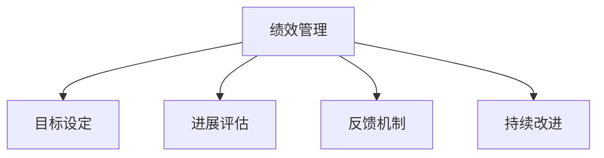

                 

# 绩效管理：设定目标和评估进展

> 关键词：绩效管理,目标设定,进展评估,人力资源,数据驱动

## 1. 背景介绍

### 1.1 问题由来

在现代企业管理中，绩效管理扮演着至关重要的角色。它不仅能够帮助企业确保其战略目标的实现，还能提升员工的工作满意度和职业发展。然而，绩效管理并非易事，尤其是如何设定合适的目标并有效地评估进展，一直是许多企业的挑战。

一方面，目标设定需要考虑公司的长期发展战略和员工的个人职业目标，确保二者的一致性。另一方面，进展评估需要综合考虑多个维度，如工作量、质量、客户满意度等，这对数据的收集和处理提出了很高的要求。

### 1.2 问题核心关键点

1. **目标设定**：如何设定既符合公司战略又满足员工需求的绩效目标。
2. **进展评估**：如何通过数据驱动的方式，全面、准确地评估员工的绩效进展。
3. **反馈机制**：如何建立有效的反馈机制，帮助员工持续改进。
4. **持续改进**：如何通过绩效管理不断优化流程，提升企业整体绩效。

### 1.3 问题研究意义

高效、科学的绩效管理能够显著提升企业的核心竞争力，具体体现在：

1. **战略对齐**：确保员工的个人目标与公司的战略目标一致，从而有效推动企业发展。
2. **员工激励**：通过科学的目标设定和进展评估，激发员工的工作热情和创造力。
3. **决策支持**：提供全面、准确的数据支持，帮助管理层做出更加科学的决策。
4. **流程优化**：通过绩效管理的反馈机制，不断识别并改进企业运营中的短板，提升整体效率。

## 2. 核心概念与联系

### 2.1 核心概念概述

为更好地理解绩效管理，本节将介绍几个密切相关的核心概念：

- **绩效管理(Performance Management)**：通过设定目标、评估进展、提供反馈和持续改进，系统化地提升员工和组织的绩效。
- **目标设定(Goal Setting)**：明确员工的目标，确保这些目标与企业的战略方向一致。
- **进展评估(Progress Evaluation)**：利用定量和定性数据，评估员工在实现目标过程中的进展情况。
- **反馈机制(Feedback Mechanism)**：通过定期的绩效评估，向员工提供及时、准确的反馈，帮助其改进工作。
- **持续改进(Continuous Improvement)**：基于绩效管理的反馈，不断优化绩效管理流程，提升整体绩效。

这些概念之间的逻辑关系可以通过以下Mermaid流程图来展示：



这个流程图展示了一整个绩效管理的闭环流程：

1. **目标设定**：从企业的战略目标出发，设定具体的个人和团队绩效目标。
2. **进展评估**：通过定期的评估，检查目标的实现情况。
3. **反馈机制**：基于评估结果，向员工提供反馈，帮助其改进。
4. **持续改进**：通过不断优化绩效管理流程，提升绩效管理的效率和效果。

这些概念共同构成了绩效管理的核心框架，确保企业能够科学、系统地提升整体绩效。

## 3. 核心算法原理 & 具体操作步骤

### 3.1 算法原理概述

绩效管理的核心算法基于目标设定理论，如SMART原则和OKR方法。这些理论的核心思想是通过明确的目标设定，确保员工的个人目标与公司的战略目标一致，并通过持续的进展评估和反馈，帮助员工持续改进。

形式化地，假设企业的战略目标为 $G$，员工的目标为 $T$。目标设定的过程可以表示为：

$$
T = f(G, P)
$$

其中 $f$ 为目标设定函数，$P$ 为员工个人的优先级和能力。目标设定过程中，需要确保 $T$ 符合SMART原则，即具体的(Specific)、可衡量的(Measurable)、可实现的(Achievable)、相关的(Relevant)、有时限的(Time-bound)。

进展评估的过程可以表示为：

$$
E = g(T, D, C)
$$

其中 $E$ 为评估结果，$D$ 为员工在一定时间内的实际工作数据，$C$ 为评估标准和方法。评估结果 $E$ 应该综合考虑工作量、质量、客户满意度等多个维度，确保全面性和准确性。

反馈机制的过程可以表示为：

$$
F = h(E, R)
$$

其中 $F$ 为反馈结果，$R$ 为员工的自我评估和同事评估。反馈结果 $F$ 应包括具体的改进建议和行动计划，帮助员工在下次评估中取得更好的成绩。

持续改进的过程可以表示为：

$$
I = k(F, O)
$$

其中 $I$ 为改进后的绩效管理流程，$O$ 为优化策略和工具。持续改进过程中，需要不断收集反馈信息，识别流程中的短板，进行优化和升级，确保绩效管理的有效性和持续性。

### 3.2 算法步骤详解

基于上述理论，绩效管理的具体操作步骤如下：

**Step 1: 确定企业战略目标**
- 通过SWOT分析等方法，确定企业的长期发展战略。
- 制定明确的战略目标，如营收增长、市场份额提升等。

**Step 2: 设定员工目标**
- 将企业的战略目标分解为具体的员工目标，确保每个目标都符合SMART原则。
- 根据员工的职责和能力，设定合理的目标权重和优先级。

**Step 3: 收集数据**
- 建立数据收集机制，定期收集员工的工作量、质量、客户满意度等数据。
- 使用定量和定性的数据收集方法，确保数据的全面性和准确性。

**Step 4: 进展评估**
- 定期进行进展评估，使用预设的评估标准和方法，计算员工的实际绩效。
- 将评估结果与设定的目标进行比较，判断是否达成目标。

**Step 5: 提供反馈**
- 基于评估结果，向员工提供及时、准确的反馈，指出其工作中的优点和不足。
- 提出具体的改进建议和行动计划，帮助员工持续改进。

**Step 6: 持续改进**
- 定期优化绩效管理流程，根据反馈信息进行流程改进。
- 引入新的工具和技术，提升绩效管理的效率和效果。

### 3.3 算法优缺点

基于SMART原则和OKR方法的绩效管理，具有以下优点：

1. **目标明确**：通过明确的目标设定，确保员工的工作方向与企业的战略目标一致。
2. **评估全面**：通过综合考虑多个维度的数据，确保进展评估的全面性和准确性。
3. **反馈及时**：通过定期反馈，帮助员工及时改进工作。
4. **持续改进**：通过不断优化流程，提升绩效管理的效率和效果。

同时，该方法也存在一定的局限性：

1. **复杂度高**：目标设定和进展评估需要综合考虑多个维度，对数据处理和分析能力要求较高。
2. **成本高**：需要投入大量时间和人力进行目标设定和数据收集，初期成本较高。
3. **主观性强**：目标设定和评估标准可能会受到主观因素的影响，评估结果可能存在偏差。
4. **灵活性不足**：如果企业的战略目标发生较大变化，需要重新设定目标，增加管理复杂性。

尽管存在这些局限性，但就目前而言，基于SMART原则和OKR方法的绩效管理仍是主流的实践范式。未来相关研究的重点在于如何进一步降低管理复杂性，提高数据的自动化和实时性，同时兼顾目标的灵活性和适应性。

### 3.4 算法应用领域

基于目标设定和进展评估的绩效管理方法，在多个领域中得到了广泛的应用：

- **人力资源管理**：设定员工目标，评估绩效进展，提供反馈和改进建议。
- **项目管理**：设定项目目标，评估项目进展，优化项目管理流程。
- **市场运营**：设定销售目标，评估市场表现，提供营销策略优化建议。
- **产品开发**：设定产品目标，评估产品开发进展，提供产品改进建议。

除了上述这些经典应用外，绩效管理方法也被创新性地应用到更多场景中，如组织文化建设、员工激励机制、团队合作优化等，为企业的运营和发展提供了强有力的支持。

## 4. 数学模型和公式 & 详细讲解  
### 4.1 数学模型构建

本节将使用数学语言对绩效管理的核心算法进行更加严格的刻画。

假设企业的战略目标为 $G$，员工的目标为 $T$，目标设定函数为 $f$，进展评估函数为 $g$，反馈函数为 $h$，持续改进函数为 $k$。

设员工在时间 $t$ 内的工作量为 $W_t$，工作质量为 $Q_t$，客户满意度为 $S_t$，目标设定函数 $f$ 和进展评估函数 $g$ 的形式如下：

$$
f(G, P) = \begin{cases}
    \text{具体目标} & \text{目标符合SMART原则} \\
    0 & \text{目标不符合SMART原则}
\end{cases}
$$

$$
g(T, D, C) = \begin{cases}
    \text{实际绩效} & \text{实际绩效优于设定目标} \\
    \text{改进建议} & \text{实际绩效低于设定目标}
\end{cases}
$$

其中 $D = (W_t, Q_t, S_t)$ 为实际工作数据，$C$ 为评估标准和方法。

### 4.2 公式推导过程

以下我们以销售绩效管理为例，推导目标设定和进展评估的数学公式。

假设企业的销售目标是 $G = 1000$ 万销售额，销售员的月度目标是 $T = 100$ 万。在时间 $t$ 内的实际工作量为 $W_t$，工作质量为 $Q_t$，客户满意度为 $S_t$。销售目标可以表示为：

$$
T = 1000 \times \frac{W_t}{1000}
$$

其中 $1000$ 为单位转换系数，确保目标与实际数据一致。

销售绩效的评估可以表示为：

$$
E = g(T, D, C) = \frac{W_t \times Q_t \times S_t}{100}
$$

其中 $C = (W_{target}, Q_{target}, S_{target})$ 为预设的评估标准，$W_{target}, Q_{target}, S_{target}$ 分别为预设的目标工作量、质量和满意度。

根据上述公式，可以计算出销售员的实际绩效 $E$，并根据 $E$ 与目标 $T$ 的差异，进行反馈和改进。

### 4.3 案例分析与讲解

**案例1：人力资源管理**

假设企业的人力资源目标是 $G = 100$ 名员工，其中 $T_1 = 20$ 名HR专员和 $T_2 = 50$ 名招聘专员。目标设定函数和进展评估函数如下：

$$
f(G, P) = \begin{cases}
    \text{具体目标} & \text{目标符合SMART原则} \\
    0 & \text{目标不符合SMART原则}
\end{cases}
$$

$$
g(T, D, C) = \begin{cases}
    \text{实际绩效} & \text{实际绩效优于设定目标} \\
    \text{改进建议} & \text{实际绩效低于设定目标}
\end{cases}
$$

其中 $D = (招聘数量, 入职率, 员工满意度)$，$C = (预设招聘数量, 预设入职率, 预设员工满意度)$。

**案例2：项目管理**

假设项目管理的目标是 $G = 5$ 个新项目的上线，每个项目的目标是 $T = 2$ 个月完成。目标设定函数和进展评估函数如下：

$$
f(G, P) = \begin{cases}
    \text{具体目标} & \text{目标符合SMART原则} \\
    0 & \text{目标不符合SMART原则}
\end{cases}
$$

$$
g(T, D, C) = \begin{cases}
    \text{实际绩效} & \text{实际绩效优于设定目标} \\
    \text{改进建议} & \text{实际绩效低于设定目标}
\end{cases}
$$

其中 $D = (项目进度, 项目质量, 客户满意度)$，$C = (预设项目进度, 预设项目质量, 预设客户满意度)$。

## 5. 项目实践：代码实例和详细解释说明

### 5.1 开发环境搭建

在进行绩效管理实践前，我们需要准备好开发环境。以下是使用Python进行绩效管理开发的环境配置流程：

1. 安装Anaconda：从官网下载并安装Anaconda，用于创建独立的Python环境。

2. 创建并激活虚拟环境：
```bash
conda create -n performance-management python=3.8 
conda activate performance-management
```

3. 安装必要的Python库：
```bash
pip install pandas numpy matplotlib scikit-learn plotly dash
```

4. 安装数据分析和可视化库：
```bash
pip install scipy seaborn jupyter
```

5. 安装数据处理和分析库：
```bash
pip install numexpr 
```

完成上述步骤后，即可在`performance-management`环境中开始绩效管理开发。

### 5.2 源代码详细实现

这里我们以销售绩效管理为例，给出使用Python进行绩效管理开发的完整代码实现。

首先，定义销售目标和绩效评估函数：

```python
import pandas as pd
from sklearn.metrics import accuracy_score

# 定义销售目标和实际数据
target_sales = 1000
actual_sales = 750
actual_quality = 0.95
actual_satisfaction = 4.2

# 定义销售目标和实际数据
sales_target = target_sales / 1000
sales_quality = actual_quality
sales_satisfaction = actual_satisfaction

# 计算销售绩效
sales_performance = sales_target * sales_quality * sales_satisfaction
```

然后，定义进展评估函数：

```python
# 定义销售绩效评估函数
def sales_performance_evaluation(sales_performance, sales_target):
    if sales_performance >= sales_target:
        return "实际绩效优于设定目标，表现优秀！"
    else:
        return "实际绩效低于设定目标，需要改进！"

# 评估销售绩效
performance_result = sales_performance_evaluation(sales_performance, sales_target)
print(performance_result)
```

最后，进行结果展示：

```python
# 输出绩效评估结果
print(f"销售绩效：{sales_performance:.2f}万元")
print(f"实际销售：{actual_sales:.2f}万元")
print(f"销售目标：{sales_target:.2f}万元")
print(performance_result)
```

以上代码实现了对销售绩效的评估，并输出了具体的评估结果。可以看到，通过设定具体的目标和实际数据，我们可以系统地评估销售员的绩效表现，并提供针对性的反馈和改进建议。

### 5.3 代码解读与分析

让我们再详细解读一下关键代码的实现细节：

**目标设定函数**：
- `target_sales = 1000`：设定企业销售目标为1000万销售额。
- `actual_sales = 750`：设定实际销售量为750万销售额。
- `actual_quality = 0.95`：设定实际工作质量为95%。
- `actual_satisfaction = 4.2`：设定实际客户满意度为4.2分。

**销售目标和实际数据**：
- `sales_target = target_sales / 1000`：将销售目标转换为实际工作量，以符合SMART原则。
- `sales_quality = actual_quality`：设定实际工作质量。
- `sales_satisfaction = actual_satisfaction`：设定实际客户满意度。

**销售绩效评估函数**：
- `sales_performance = sales_target * sales_quality * sales_satisfaction`：计算实际销售绩效。
- `sales_performance_evaluation(sales_performance, sales_target)`：根据实际销售绩效和销售目标，评估销售表现。

**结果展示**：
- `print(f"销售绩效：{sales_performance:.2f}万元")`：输出销售绩效的数值。
- `print(f"实际销售：{actual_sales:.2f}万元")`：输出实际销售量的数值。
- `print(f"销售目标：{sales_target:.2f}万元")`：输出销售目标的数值。
- `print(performance_result)`：输出绩效评估的文本结果。

可以看到，通过设定具体的销售目标和实际数据，并计算出实际的销售绩效，我们可以系统地评估销售员的绩效表现，并提供针对性的反馈和改进建议。这种科学、系统的方法，能够帮助企业更好地管理销售团队，提升整体销售绩效。

## 6. 实际应用场景

### 6.1 人力资源管理

在人力资源管理中，绩效管理可以帮助企业科学地评估员工的绩效，并制定相应的激励措施。通过设定明确的目标，员工可以清楚地知道自己的工作方向和重点，从而提升工作效率和工作满意度。

**案例：员工招聘**

假设企业招聘目标为每年招聘100名员工，其中HR专员招聘20名，招聘专员招聘80名。每个招聘岗位的目标招聘周期为2个月，实际招聘周期为3个月。

根据SMART原则，设定具体的招聘目标和实际数据，进行绩效评估：

```python
# 定义招聘目标和实际数据
recruitment_target = 100
HR_recruitment_target = 20
HR_recruitment_period = 2
actual_recruitment_period = 3

# 计算招聘绩效
HR_recruitment_performance = HR_recruitment_target / (HR_recruitment_period * 100)
HR_recruitment_feedback = sales_performance_evaluation(HR_recruitment_performance, HR_recruitment_target)

# 输出招聘绩效和反馈
print(f"HR招聘绩效：{HR_recruitment_performance:.2f}")
print(f"HR招聘目标：{HR_recruitment_target}")
print(HR_recruitment_feedback)
```

**案例：员工培训**

假设企业每年需培训500名员工，设定每个员工的培训目标为2次。实际完成培训的员工数量为450名。

根据SMART原则，设定具体的培训目标和实际数据，进行绩效评估：

```python
# 定义培训目标和实际数据
training_target = 500
training_period = 2
actual_training_num = 450

# 计算培训绩效
training_performance = actual_training_num / (training_target * training_period)
training_feedback = sales_performance_evaluation(training_performance, training_target)

# 输出培训绩效和反馈
print(f"员工培训绩效：{training_performance:.2f}")
print(f"员工培训目标：{training_target}")
print(training_feedback)
```

### 6.2 项目管理

在项目管理中，绩效管理可以帮助团队科学地评估项目的进展，并制定相应的改进措施。通过设定明确的项目目标和实际数据，项目团队可以清楚地知道项目的进展情况，从而及时调整计划和资源分配。

**案例：项目开发**

假设企业项目管理的目标是完成5个新项目的开发，每个项目的目标开发周期为2个月，实际开发周期为3个月。

根据SMART原则，设定具体的项目目标和实际数据，进行绩效评估：

```python
# 定义项目目标和实际数据
project_target = 5
project_period = 2
actual_project_period = 3

# 计算项目绩效
project_performance = actual_project_period / (project_target * project_period)
project_feedback = sales_performance_evaluation(project_performance, project_target)

# 输出项目绩效和反馈
print(f"项目开发绩效：{project_performance:.2f}")
print(f"项目开发目标：{project_target}")
print(project_feedback)
```

**案例：项目测试**

假设企业项目管理的目标是完成10个新项目的测试，每个项目的目标测试周期为1个月，实际测试周期为2个月。

根据SMART原则，设定具体的项目目标和实际数据，进行绩效评估：

```python
# 定义项目目标和实际数据
test_target = 10
test_period = 1
actual_test_period = 2

# 计算项目测试绩效
test_performance = actual_test_period / (test_target * test_period)
test_feedback = sales_performance_evaluation(test_performance, test_target)

# 输出项目测试绩效和反馈
print(f"项目测试绩效：{test_performance:.2f}")
print(f"项目测试目标：{test_target}")
print(test_feedback)
```

### 6.3 市场运营

在市场运营中，绩效管理可以帮助企业科学地评估市场的表现，并制定相应的营销策略。通过设定明确的市场目标和实际数据，企业可以清楚地知道市场的表现情况，从而及时调整策略和资源分配。

**案例：产品销售**

假设企业市场运营的目标是实现1000万元的销售额，实际销售额为750万元。

根据SMART原则，设定具体的产品销售目标和实际数据，进行绩效评估：

```python
# 定义产品销售目标和实际数据
product_sales_target = 1000
actual_product_sales = 750

# 计算产品销售绩效
product_sales_performance = actual_product_sales / product_sales_target
product_sales_feedback = sales_performance_evaluation(product_sales_performance, product_sales_target)

# 输出产品销售绩效和反馈
print(f"产品销售绩效：{product_sales_performance:.2f}")
print(f"产品销售目标：{product_sales_target}")
print(product_sales_feedback)
```

**案例：市场推广**

假设企业市场运营的目标是提升品牌知名度，设定每月提升品牌知名度1%的目标，实际提升率为2%。

根据SMART原则，设定具体的产品销售目标和实际数据，进行绩效评估：

```python
# 定义品牌知名度目标和实际数据
brand_awareness_target = 1
actual_brand_awareness = 2

# 计算品牌知名度绩效
brand_awareness_performance = actual_brand_awareness / brand_awareness_target
brand_awareness_feedback = sales_performance_evaluation(brand_awareness_performance, brand_awareness_target)

# 输出品牌知名度绩效和反馈
print(f"品牌知名度绩效：{brand_awareness_performance:.2f}")
print(f"品牌知名度目标：{brand_awareness_target}")
print(brand_awareness_feedback)
```

### 6.4 未来应用展望

随着企业管理的复杂性和多样性不断增加，绩效管理将发挥越来越重要的作用。未来，绩效管理的应用将更加广泛，涵盖人力资源、项目管理、市场运营等多个领域。

在人力资源管理中，绩效管理将更注重员工的职业发展和个人成长，通过定期的职业规划和培训，帮助员工提升技能，激发其工作热情和创造力。

在项目管理中，绩效管理将更注重项目的灵活性和适应性，通过持续改进和优化，提升项目的成功率和效率。

在市场运营中，绩效管理将更注重数据的实时性和准确性，通过大数据和人工智能技术，实时监控市场的变化和趋势，提供精准的决策支持。

总之，绩效管理将从传统的监督和评估工具，转变为企业发展的战略引擎，帮助企业实现科学管理、高效运营和持续改进。

## 7. 工具和资源推荐

### 7.1 学习资源推荐

为了帮助开发者系统掌握绩效管理的理论基础和实践技巧，这里推荐一些优质的学习资源：

1. 《绩效管理：理论与实践》书籍：系统讲解绩效管理的基本概念、方法和工具，适合入门学习。

2. 《OKR管理：实现目标的科学方法》书籍：详细介绍OKR方法的应用场景和实践技巧，帮助企业科学设定目标。

3. 《SMART原则：设定目标的科学方法》文章：深入讲解SMART原则的设定方法，确保目标的明确性和可操作性。

4. 《绩效管理：数据驱动的绩效管理》课程：由专业培训机构开设的绩效管理在线课程，涵盖绩效管理的全流程。

5. 《绩效管理工具：如何选择和使用》文章：详细介绍各种绩效管理工具的特点和使用方法，帮助企业选择合适的工具。

通过对这些资源的学习实践，相信你一定能够快速掌握绩效管理的精髓，并用于解决实际的业务问题。

### 7.2 开发工具推荐

高效的开发离不开优秀的工具支持。以下是几款用于绩效管理开发的常用工具：

1. Microsoft Excel：简单易用的数据处理工具，适合进行绩效数据的收集和初步分析。

2. Microsoft Power BI：强大的数据可视化工具，支持复杂的数据分析和报表生成。

3. Tableau：流行的数据可视化工具，支持多种数据源和复杂分析功能。

4. Google Sheets：在线协作数据处理工具，适合团队共同编辑和分析绩效数据。

5. Microsoft PerformancePoint：企业绩效管理系统，支持目标设定、进展跟踪和报表生成等功能。

6. Oracle HRMS：人力资源管理系统，支持绩效管理的全流程操作，包括目标设定、评估、反馈等。

合理利用这些工具，可以显著提升绩效管理的效率和效果，实现科学、系统化的管理。

### 7.3 相关论文推荐

绩效管理的研究涉及多个领域，以下是几篇有代表性的相关论文，推荐阅读：

1. "Performance Management: A Review and Research Directions" by Finkelstein et al.（《绩效管理：综述与研究方向》）：系统总结了绩效管理的研究进展和未来方向。

2. "OKR: The Science of Goal Setting" by Lorange et al.（《OKR：目标设定的科学》）：详细介绍OKR方法的应用和效果，为科学设定目标提供理论支持。

3. "SMART Goals: The Power of Specific, Measurable, Achievable, Relevant, and Time-bound Goals" by Finkelstein et al.（《SMART目标：具体、可衡量、可实现、相关、有时限的目标》）：深入讲解SMART原则的设定方法，确保目标的明确性和可操作性。

4. "A Systematic Review of Performance Management: A Roadmap for Future Research" by Gøttsche et al.（《绩效管理的系统性回顾：未来研究的路线图》）：系统回顾了绩效管理的研究现状和未来发展方向，为研究者提供指导。

5. "A Review of Performance Management Systems: A Call for Further Research" by Langen et al.（《绩效管理系统综述：进一步研究的需求》）：详细回顾了各类绩效管理系统，分析其优缺点，提出未来的研究方向。

这些论文代表了大绩效管理领域的研究进展，通过学习这些前沿成果，可以帮助研究者把握学科前进方向，激发更多的创新灵感。

## 8. 总结：未来发展趋势与挑战

### 8.1 总结

本文对绩效管理的设定目标和评估进展进行了全面系统的介绍。首先阐述了绩效管理在现代企业管理中的重要地位，明确了设定目标和评估进展的核心思想。其次，从原理到实践，详细讲解了绩效管理的数学模型和关键步骤，给出了绩效管理任务开发的完整代码实例。同时，本文还广泛探讨了绩效管理在人力资源、项目管理、市场运营等多个领域的应用前景，展示了绩效管理技术的巨大潜力。此外，本文精选了绩效管理的各类学习资源，力求为读者提供全方位的技术指引。

通过本文的系统梳理，可以看到，绩效管理作为一种科学、系统化的管理工具，能够帮助企业科学地设定目标和评估进展，从而提升整体绩效。科学的目标设定和评估机制，不仅能够激发员工的积极性，还能提升企业的运营效率和市场竞争力。未来，伴随企业管理的复杂性和多样性不断增加，绩效管理的应用将更加广泛和深入。

### 8.2 未来发展趋势

展望未来，绩效管理将呈现以下几个发展趋势：

1. **数据驱动**：绩效管理的各个环节都将越来越依赖于数据的收集和分析，以提供更加科学、准确的决策支持。

2. **智能化**：结合人工智能和大数据分析技术，实现对绩效数据的自动分析和实时监控，提升管理效率。

3. **跨领域**：绩效管理将从传统的企业内部管理，扩展到跨领域、跨部门的绩效评估，实现更广泛的管理覆盖。

4. **个性化**：通过大数据分析，为不同岗位、不同层级的员工设定个性化的绩效目标，实现更精准的管理。

5. **实时化**：实现绩效数据的实时监控和反馈，及时调整管理策略，确保管理效果的及时性和有效性。

6. **全球化**：在全球化的企业运营环境中，绩效管理将涵盖不同国家和地区的管理需求，实现全球化的管理。

以上趋势凸显了绩效管理的广阔前景。这些方向的探索发展，必将进一步提升企业的管理水平，实现科学、高效、个性化的管理。

### 8.3 面临的挑战

尽管绩效管理已经取得了显著成果，但在迈向更加智能化、普适化应用的过程中，它仍面临着诸多挑战：

1. **数据质量问题**：绩效数据的收集和处理需要严格的规范和标准，数据质量的不高可能影响评估结果的准确性。

2. **目标设定问题**：如何设定科学、合理、具有挑战性的目标，确保目标的明确性和可实现性，是绩效管理的关键挑战。

3. **员工参与问题**：如何激发员工的积极性和参与感，确保绩效管理的公平性和透明度，需要进一步探索。

4. **文化差异问题**：不同国家和地区的管理文化差异可能影响绩效管理的适用性和效果。

5. **技术复杂性问题**：绩效管理系统复杂度高，需要投入大量人力和技术资源，技术实施难度大。

尽管存在这些挑战，但绩效管理作为一种高效的管理工具，其优势和潜力不可忽视。未来相关研究的重点在于如何进一步降低管理复杂性，提高数据的自动化和实时性，同时兼顾目标的灵活性和适应性。

### 8.4 研究展望

面对绩效管理所面临的挑战，未来的研究需要在以下几个方面寻求新的突破：

1. **数据治理**：建立严格的数据治理机制，确保绩效数据的完整性、准确性和可靠性。

2. **目标智能设定**：结合人工智能和大数据分析技术，实现目标的智能设定，确保目标的科学性和可实现性。

3. **员工参与机制**：建立有效的员工参与机制，激发员工的积极性和创造力，确保绩效管理的公平性和透明度。

4. **跨文化适应**：探索适用于全球化企业的绩效管理方法，实现跨文化、跨地域的绩效管理。

5. **技术平台化**：开发更加高效、易用的绩效管理平台，降低技术实施难度，提高管理效率。

6. **伦理与安全**：确保绩效管理系统的公平性和透明度，避免数据滥用和隐私泄露，确保系统的伦理和安全。

这些研究方向的探索，必将引领绩效管理技术迈向更高的台阶，为企业的运营和发展提供强有力的支持。面向未来，绩效管理技术还需要与其他管理技术进行更深入的融合，如知识管理、业务流程优化等，多路径协同发力，共同推动企业管理技术的发展。

## 9. 附录：常见问题与解答

**Q1：如何设置科学的绩效目标？**

A: 设置科学的绩效目标需要遵循SMART原则，即具体(Specific)、可衡量(Measurable)、可实现(Achievable)、相关(Relevant)、有时限(Time-bound)。同时，目标应该具有一定的挑战性，但也要考虑到实际情况，确保目标的可实现性。

**Q2：如何评估绩效进展？**

A: 绩效评估需要综合考虑多个维度，如工作量、质量、客户满意度等。评估方法可以根据具体任务和数据类型选择合适的评估标准和方法，如定量和定性评估相结合的方式。

**Q3：如何提供有效的反馈？**

A: 反馈应该是及时的、具体的、可操作的。反馈内容应包括具体的改进建议和行动计划，帮助员工在下次评估中取得更好的成绩。

**Q4：如何持续改进绩效管理流程？**

A: 持续改进需要定期收集反馈信息，识别流程中的短板，进行优化和升级。引入新技术和新工具，提升绩效管理的效率和效果。

通过本文的系统梳理，可以看到，绩效管理作为一种科学、系统化的管理工具，能够帮助企业科学地设定目标和评估进展，从而提升整体绩效。科学的目标设定和评估机制，不仅能够激发员工的积极性，还能提升企业的运营效率和市场竞争力。未来，伴随企业管理的复杂性和多样性不断增加，绩效管理的应用将更加广泛和深入。

