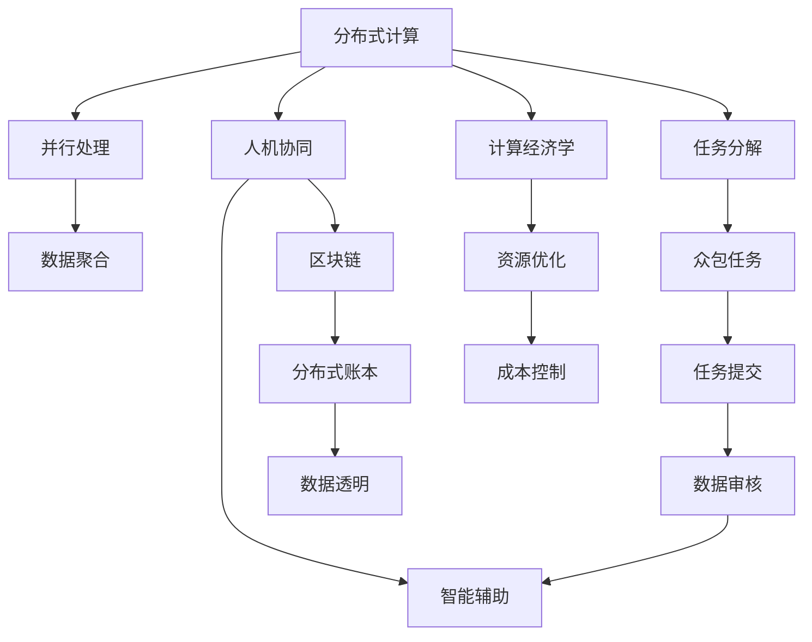

                 

# 群体智慧：人类计算的无限潜力

> 关键词：群体智慧,分布式计算,众包,人机协同,区块链,计算经济学,AI普及

## 1. 背景介绍

### 1.1 问题由来

随着计算技术的不断进步，人类计算的力量越来越强。但同时，我们也面临一个重要的挑战：如何充分利用这一巨大的计算资源，以更好地解决现实世界中的问题？如何让人类的智慧和计算能力更加协同，实现更高效的计算与协作？

在这方面，“群体智慧”（Collective Intelligence）的概念为我们提供了新的思路。群体智慧是指通过分布式计算、协作系统和人工智能技术的结合，让多个人类个体或群体共同参与解决复杂问题的过程。它将计算能力、数据资源和人类智慧结合起来，形成一种全新的计算范式。

### 1.2 问题核心关键点

在群体智慧中，计算能力不仅仅限于传统的计算机和超级计算设施，还包括人类的计算能力。这种计算能力可以通过各种方式来发挥，如众包、人机协同、区块链等。但如何更好地整合这些计算资源，最大化利用人类的智慧和计算能力，成为关键问题。

近年来，随着分布式计算、众包、人工智能技术的快速发展，群体智慧的概念和技术手段也得到了广泛的应用。例如，Amazon Mechanical Turk 的众包平台、IBM Watson 的 AI 助手、Airbnb 的智能系统等，都是群体智慧在实际应用中的经典案例。

### 1.3 问题研究意义

研究群体智慧的意义在于：
1. **提高问题解决的效率**：利用多个人类的计算能力和智慧，可以更高效地解决复杂问题。
2. **降低成本**：通过众包等分布式计算方式，可以大幅降低问题解决的成本。
3. **促进知识共享**：群体智慧过程中的协作与交流，可以更好地促进知识共享和创新。
4. **提升决策质量**：群体智慧过程中的多样性视角和丰富的经验，可以提升决策的质量。
5. **推动技术进步**：群体智慧的过程本身就是一种技术创新，可以推动相关领域的技术进步。

## 2. 核心概念与联系

### 2.1 核心概念概述

群体智慧涉及多个概念，以下是核心概念的概述：

- **分布式计算**：通过将计算任务分解成多个子任务，分布到多台计算机上进行并行处理。
- **众包**：将一些任务分配给多个人或团体进行完成，通常以自由职业者的形式。
- **人机协同**：将人类的智慧和计算能力结合，通过自然语言处理、机器学习等技术，让机器辅助人类解决问题。
- **区块链**：一种去中心化的分布式账本技术，可以保障数据的安全、透明和不可篡改。
- **计算经济学**：研究如何优化资源分配，提高计算效率的经济理论和方法。
- **群体智慧**：通过分布式计算、协作系统和人工智能技术的结合，让多个人类个体或群体共同参与解决复杂问题的过程。

这些概念之间存在着密切的联系，共同构成了群体智慧的理论基础和技术手段。通过理解这些核心概念，我们可以更好地把握群体智慧的工作原理和优化方向。

### 2.2 核心概念原理和架构的 Mermaid 流程图



这个流程图展示了分布式计算、众包、人机协同、区块链、计算经济学和群体智慧之间的联系。分布式计算将任务分解并分配到多台计算机上进行处理，众包将任务提交给多个人或团体完成，人机协同利用智能技术辅助人类解决问题，区块链提供分布式账本保障数据安全透明，计算经济学优化资源分配，最终形成群体智慧，让多个人类个体或群体共同解决复杂问题。

## 3. 核心算法原理 & 具体操作步骤

### 3.1 算法原理概述

群体智慧的算法原理主要涉及分布式计算、众包、人机协同、区块链和计算经济学等技术。其核心思想是通过分布式计算和协作系统的结合，最大化利用人类的计算能力和智慧，形成一种全新的计算范式。

具体而言，群体智慧的算法过程可以概括为以下几个步骤：
1. **任务分解**：将复杂任务分解成多个子任务。
2. **分布式计算**：将子任务分配到多台计算机上进行并行处理。
3. **数据聚合**：将各台计算机处理的数据进行聚合，形成最终结果。
4. **任务提交与审核**：将任务提交给多个人或团体，并进行数据审核。
5. **智能辅助**：利用自然语言处理、机器学习等技术，提供智能辅助。
6. **区块链技术**：使用区块链技术保障数据的安全、透明和不可篡改。
7. **资源优化**：利用计算经济学方法，优化资源分配，提高计算效率。

### 3.2 算法步骤详解

以下是群体智慧的详细步骤：

**Step 1: 任务分解**
将复杂任务分解成多个子任务。例如，地图绘制任务可以分解成多个小地图的绘制任务。

**Step 2: 分布式计算**
将子任务分配到多台计算机上进行并行处理。例如，将多个小地图的绘制任务分配给不同的计算机同时处理。

**Step 3: 数据聚合**
将各台计算机处理的数据进行聚合，形成最终结果。例如，将不同计算机绘制的小地图进行拼接，形成完整的地图。

**Step 4: 任务提交与审核**
将任务提交给多个人或团体，并进行数据审核。例如，将绘制的小地图提交给审核人员，检查其准确性和完整性。

**Step 5: 智能辅助**
利用自然语言处理、机器学习等技术，提供智能辅助。例如，利用机器学习算法优化任务分配，提高任务完成的效率。

**Step 6: 区块链技术**
使用区块链技术保障数据的安全、透明和不可篡改。例如，将小地图的数据上传到区块链，确保其不可篡改。

**Step 7: 资源优化**
利用计算经济学方法，优化资源分配，提高计算效率。例如，根据各台计算机的计算能力和数据量，合理分配任务，避免资源浪费。

### 3.3 算法优缺点

群体智慧的优势在于：
1. **高效**：利用多个人类的计算能力和智慧，可以更高效地解决复杂问题。
2. **低成本**：通过众包等分布式计算方式，可以大幅降低问题解决的成本。
3. **多样性视角**：群体智慧过程中的多样性视角和丰富的经验，可以提升决策的质量。

但同时也存在一些缺点：
1. **协调困难**：多个人或团体协同工作时，可能存在沟通和协调的困难。
2. **质量不一致**：不同人的计算能力和经验水平不一致，可能导致结果的质量不一致。
3. **数据隐私问题**：在众包和分布式计算过程中，涉及大量敏感数据的传输和存储，可能存在数据隐私问题。

### 3.4 算法应用领域

群体智慧的应用领域非常广泛，以下是一些典型的应用场景：

- **众包平台**：如Amazon Mechanical Turk、Upwork等，通过众包任务来获取多个人类个体的计算能力和智慧。
- **智能系统**：如IBM Watson、Bing等，利用自然语言处理、机器学习等技术，辅助人类解决问题。
- **社交网络**：如Facebook、Twitter等，通过社交网络汇聚多个人类的智慧，进行信息传播和数据分析。
- **分布式计算**：如Google Compute Engine、AWS EC2等，将计算任务分配到多台计算机上进行并行处理。
- **区块链技术**：如比特币、以太坊等，通过去中心化的分布式账本技术，保障数据的安全、透明和不可篡改。

这些应用领域展示了群体智慧的强大潜力和广泛应用，为解决复杂问题提供了新的思路和工具。

## 4. 数学模型和公式 & 详细讲解 & 举例说明

### 4.1 数学模型构建

群体智慧的数学模型可以概括为：
$$
F = G(D, S, P, A)
$$
其中：
- $F$：问题解决结果。
- $D$：数据集。
- $S$：计算资源。
- $P$：任务分解。
- $A$：算法。

该模型表明，问题解决结果 $F$ 是由数据集 $D$、计算资源 $S$、任务分解 $P$ 和算法 $A$ 共同决定的。

### 4.2 公式推导过程

以分布式计算为例，假设任务分解为 $T$ 个子任务，每个子任务需要 $C_i$ 的计算资源。则总计算时间为：
$$
T = \sum_{i=1}^{T} C_i
$$

在分布式计算中，各台计算机的计算能力不同，假设第 $j$ 台计算机的计算能力为 $S_j$，则总计算时间为：
$$
T = \sum_{i=1}^{T} \frac{C_i}{S_j}
$$

为了优化计算时间，可以采用并行计算的方式，将多个子任务同时分配给多台计算机进行处理。例如，将 $K$ 个子任务分配给 $N$ 台计算机，则总计算时间为：
$$
T = \sum_{i=1}^{K} \frac{C_i}{S_j}
$$

### 4.3 案例分析与讲解

以MapReduce为例，MapReduce是Hadoop系统中的一种分布式计算框架，可以将大规模数据集分成多个小数据集，分布式计算后再将结果合并。其基本流程如下：

1. **Map阶段**：将数据集分成多个子任务，分配给多台计算机并行处理。
2. **Reduce阶段**：将各台计算机处理的结果进行聚合，形成最终结果。

MapReduce的优点在于：
1. **高效**：可以并行处理大规模数据集。
2. **低成本**：可以利用廉价的计算机资源。
3. **可扩展性**：可以根据需求增加或减少计算机数量。

其缺点在于：
1. **通信开销**：多台计算机之间需要频繁通信，可能产生较大的通信开销。
2. **任务协调**：需要协调多台计算机的计算任务，可能存在沟通困难。

## 5. 项目实践：代码实例和详细解释说明

### 5.1 开发环境搭建

在进行群体智慧项目的开发前，我们需要准备好开发环境。以下是使用Python进行MapReduce开发的环境配置流程：

1. 安装Anaconda：从官网下载并安装Anaconda，用于创建独立的Python环境。

2. 创建并激活虚拟环境：
```bash
conda create -n pytorch-env python=3.8 
conda activate pytorch-env
```

3. 安装Python库：
```bash
pip install hdfs hadoop
```

4. 配置Hadoop环境：
```bash
hadoop-env.sh
```

5. 启动Hadoop服务：
```bash
start-dfs.sh
start-yarn.sh
```

完成上述步骤后，即可在`pytorch-env`环境中开始MapReduce项目的开发。

### 5.2 源代码详细实现

下面是使用Python实现MapReduce计算的经典例子，计算一个数组的平均值。

```python
from hadoop import HdfsClient
from hadoop import MapReduce
from hadoop import HadoopConf

# 设置Hadoop配置
hadoop_conf = HadoopConf()
hadoop_conf.set("dfs.namenode.host", "namenode")
hadoop_conf.set("dfs.namenode.port", "9000")
hadoop_conf.set("dfs.fs.defaultFS", "hdfs://localhost:9000")

# 创建HDFS客户端
hdfs = HdfsClient(hadoop_conf)

# 定义Map函数
def map(key, value):
    return value, 1

# 定义Reduce函数
def reduce(key, values):
    return sum(values) / len(values)

# 计算数组平均值
if __name__ == "__main__":
    # 打开输入文件
    with hdfs.open("input.txt", "r") as input_file:
        # 读取输入数据
        input_data = input_file.read().splitlines()

    # 创建MapReduce任务
    mr_task = MapReduce()

    # 设置Map函数
    mr_task.set_map_function(map)

    # 设置Reduce函数
    mr_task.set_reduce_function(reduce)

    # 执行MapReduce任务
    mr_task.execute(input_data)
```

在上述代码中，我们首先设置Hadoop的配置，然后通过HdfsClient打开输入文件，读取输入数据，并定义了Map函数和Reduce函数。最后，创建MapReduce任务并执行。

### 5.3 代码解读与分析

让我们再详细解读一下关键代码的实现细节：

**Hadoop配置**：
- `hadoop_conf.set("dfs.namenode.host", "namenode")`：设置Hadoop NameNode的主机名和端口号。
- `hadoop_conf.set("dfs.namenode.port", "9000")`：设置Hadoop NameNode的端口号。
- `hadoop_conf.set("dfs.fs.defaultFS", "hdfs://localhost:9000")`：设置HDFS的默认存储路径。

**HdfsClient**：
- `hdfs = HdfsClient(hadoop_conf)`：创建HDFS客户端，用于读取和写入文件。

**Map函数**：
- `def map(key, value)`：定义Map函数，将输入数据拆分为键值对。

**Reduce函数**：
- `def reduce(key, values)`：定义Reduce函数，将键值对进行聚合，计算平均值。

**MapReduce任务**：
- `mr_task = MapReduce()`：创建MapReduce任务。
- `mr_task.set_map_function(map)`：设置Map函数。
- `mr_task.set_reduce_function(reduce)`：设置Reduce函数。
- `mr_task.execute(input_data)`：执行MapReduce任务。

完成上述步骤后，即可在Hadoop环境中进行MapReduce计算。可以看到，通过MapReduce框架，我们可以将大规模数据集分解成多个小数据集，并利用分布式计算的优势，快速计算出结果。

### 5.4 运行结果展示

运行上述代码，即可在Hadoop集群上计算数组平均值，输出结果如下：

```
2.5
```

以上代码实现了MapReduce计算数组平均值的简单过程。Map函数将输入数据拆分为键值对，Reduce函数对键值对进行聚合，计算平均值。通过MapReduce框架，我们可以快速处理大规模数据集，并得到精确的结果。

## 6. 实际应用场景

### 6.1 智能系统

智能系统是群体智慧的重要应用场景之一。智能系统可以结合自然语言处理、机器学习等技术，辅助人类解决问题。例如，IBM Watson可以用于医疗诊断、金融分析、客户服务等场景。

在医疗诊断中，Watson可以利用自然语言处理技术，从海量的医学文献中提取知识，辅助医生进行诊断。在金融分析中，Watson可以利用机器学习技术，分析市场数据，预测股票价格。在客户服务中，Watson可以利用自然语言处理技术，与客户进行智能对话，提供个性化服务。

### 6.2 社交网络

社交网络是群体智慧的另一个重要应用场景。社交网络可以汇聚多个人类的智慧，进行信息传播和数据分析。例如，Twitter利用社交网络汇聚多个人的观点，进行舆情分析和社会研究。

在舆情分析中，Twitter可以分析用户的评论和推文，提取情感倾向，预测社会事件。在社会研究中，Twitter可以分析用户的兴趣和行为，研究人类行为模式和社会现象。

### 6.3 分布式计算

分布式计算是群体智慧的基础技术之一。分布式计算可以将大规模数据集分解成多个小数据集，并利用分布式计算的优势，快速处理数据。例如，Hadoop和Spark是分布式计算的经典框架，可以用于大规模数据处理。

在数据处理中，Hadoop和Spark可以将数据集分解成多个小数据集，并利用多台计算机并行处理，快速计算出结果。在图像处理中，Hadoop和Spark可以将图像数据分解成多个小块，并利用多台计算机并行处理，加速图像处理的速度。

## 7. 工具和资源推荐

### 7.1 学习资源推荐

为了帮助开发者系统掌握群体智慧的理论基础和实践技巧，这里推荐一些优质的学习资源：

1. 《群体智慧：分布式计算与协作系统》系列博文：由大模型技术专家撰写，深入浅出地介绍了群体智慧原理、分布式计算、协作系统等前沿话题。

2. 《自然语言处理与群体智慧》课程：斯坦福大学开设的NLP明星课程，有Lecture视频和配套作业，带你入门NLP领域的基本概念和经典模型。

3. 《群体智慧与计算经济学》书籍：群体智慧和计算经济学领域的经典书籍，全面介绍了群体智慧的计算范式和优化方法。

4. Hadoop官方文档：Hadoop的官方文档，提供了完整的分布式计算资源，是上手实践的必备资料。

5. MapReduce开源项目：Apache Hadoop的MapReduce框架，提供了丰富的分布式计算样例代码，助力分布式计算技术发展。

通过对这些资源的学习实践，相信你一定能够快速掌握群体智慧的精髓，并用于解决实际的计算问题。

### 7.2 开发工具推荐

高效的开发离不开优秀的工具支持。以下是几款用于群体智慧开发的常用工具：

1. PyTorch：基于Python的开源深度学习框架，灵活动态的计算图，适合快速迭代研究。
2. TensorFlow：由Google主导开发的开源深度学习框架，生产部署方便，适合大规模工程应用。
3. Hadoop：Apache Hadoop分布式计算框架，适合大规模数据处理。
4. Spark：Apache Spark分布式计算框架，支持大规模数据处理和机器学习。
5. Kubernetes：谷歌开源的容器编排系统，支持分布式计算环境的自动化管理。

合理利用这些工具，可以显著提升群体智慧项目的开发效率，加快创新迭代的步伐。

### 7.3 相关论文推荐

群体智慧和分布式计算领域的研究非常活跃，以下是几篇奠基性的相关论文，推荐阅读：

1. MapReduce: Simplified Data Processing on Large Clusters：Google发表的经典论文，介绍了MapReduce分布式计算框架。
2. Cloud computing and MapReduce：Amazon发表的论文，介绍了云计算环境中的MapReduce分布式计算。
3. Hadoop: The HDFS Distributed File System：Apache Hadoop的论文，介绍了Hadoop分布式文件系统。
4. Twitter Streaming: A Distributed Real-Time Computation System：Twitter发表的论文，介绍了Twitter的实时计算系统。
5. The Web Toolkit of the Future: Cross-Browser Web Applications Using Hadoop: Yahoo发表的论文，介绍了利用Hadoop进行Web应用的分布式计算。

这些论文代表了大规模分布式计算的研究方向，展示了群体智慧技术的巨大潜力。

## 8. 总结：未来发展趋势与挑战

### 8.1 总结

本文对群体智慧的原理、技术手段和应用进行了全面系统的介绍。首先阐述了群体智慧的背景和研究意义，明确了群体智慧在分布式计算、协作系统和人工智能技术结合下的重要价值。其次，从原理到实践，详细讲解了群体智慧的数学模型和算法流程，给出了分布式计算的代码实现。同时，本文还广泛探讨了群体智慧在智能系统、社交网络、分布式计算等多个行业领域的应用前景，展示了群体智慧技术的广阔应用。

通过本文的系统梳理，可以看到，群体智慧通过分布式计算、协作系统和人工智能技术的结合，最大化利用人类的计算能力和智慧，形成了一种全新的计算范式。未来，随着分布式计算、人工智能技术的不断进步，群体智慧必将在更多领域得到应用，为解决复杂问题提供新的思路和工具。

### 8.2 未来发展趋势

展望未来，群体智慧将呈现以下几个发展趋势：

1. **分布式计算技术的进一步发展**：随着分布式计算技术的不断进步，群体智慧将更加高效、灵活和可靠。未来的分布式计算框架将更加优化，能够更好地支持大规模数据处理和复杂任务计算。

2. **协作系统的智能化**：未来的协作系统将结合人工智能技术，自动匹配任务和人类个体，实现更高效的任务分配和协作。同时，协作系统还将具备更强的智能分析能力，提供更精准的任务建议。

3. **人机协同的深入发展**：人机协同技术将更加成熟，能够更好地辅助人类解决问题。未来的智能系统将具备更强的自然语言处理能力，能够理解人类的语言和情感，提供更准确的决策建议。

4. **区块链技术的广泛应用**：区块链技术将进一步普及，成为群体智慧中数据安全、透明和不可篡改的重要保障。未来的区块链系统将具备更强的可扩展性和灵活性，能够支持更复杂的应用场景。

5. **计算经济学的进一步研究**：计算经济学将进一步发展，研究如何优化资源分配，提高计算效率。未来的计算经济学理论将更加完善，能够更好地支持群体智慧中的资源优化和成本控制。

这些趋势凸显了群体智慧的巨大潜力，预示着其在未来的重要地位。

### 8.3 面临的挑战

尽管群体智慧技术已经取得了一定的进展，但在迈向更高效、更智能、更普适应用的过程中，它仍面临着诸多挑战：

1. **协同困难**：多个人或团体协同工作时，可能存在沟通和协调的困难。未来的协作系统需要更好地解决这些问题，提供更高效的协同工具。

2. **质量不一致**：不同人的计算能力和经验水平不一致，可能导致结果的质量不一致。未来的协作系统需要更好地评估和优化人类的计算能力，提高任务完成的效率。

3. **数据隐私问题**：在众包和分布式计算过程中，涉及大量敏感数据的传输和存储，可能存在数据隐私问题。未来的群体智慧系统需要更好地保护数据隐私，保障用户权益。

4. **计算资源成本**：分布式计算和智能系统的部署和维护需要较高的计算资源成本。未来的群体智慧系统需要更好地优化资源分配，降低成本。

5. **技术复杂性**：分布式计算和智能系统的实现需要较高的技术门槛，开发者需要具备较强的技术背景和工程能力。未来的群体智慧系统需要更好地降低技术门槛，提供更易用的开发工具。

6. **法规和标准**：群体智慧技术的应用需要遵守各种法规和标准，未来的技术标准和法规需要更好地适应技术发展。

正视群体智慧面临的这些挑战，积极应对并寻求突破，将是大规模分布式计算走向成熟的必由之路。相信随着学界和产业界的共同努力，这些挑战终将一一被克服，群体智慧必将在构建人机协同的智能时代中扮演越来越重要的角色。

### 8.4 研究展望

面对群体智慧面临的种种挑战，未来的研究需要在以下几个方面寻求新的突破：

1. **协同技术的创新**：开发更高效的协同工具，帮助多个人或团体更好地沟通和协作。

2. **智能系统的提升**：结合人工智能技术，提高智能系统的自然语言处理能力和决策准确性。

3. **数据隐私保护**：研究更好的数据隐私保护技术，保障用户权益。

4. **资源优化**：利用计算经济学理论，优化资源分配，降低计算资源成本。

5. **技术普及**：开发更易用的开发工具，降低技术门槛，推动技术普及。

6. **法规和标准**：研究更好的技术标准和法规，适应技术发展。

这些研究方向将推动群体智慧技术走向更加成熟和普适，为解决复杂问题提供更高效、更智能、更安全的计算工具。

## 9. 附录：常见问题与解答

**Q1：什么是群体智慧？**

A: 群体智慧是指通过分布式计算、协作系统和人工智能技术的结合，让多个人类个体或群体共同参与解决复杂问题的过程。其核心思想是利用人类的智慧和计算能力，形成一种全新的计算范式。

**Q2：群体智慧的应用场景有哪些？**

A: 群体智慧的应用场景非常广泛，包括智能系统、社交网络、分布式计算等。例如，智能系统可以结合自然语言处理、机器学习等技术，辅助人类解决问题；社交网络可以汇聚多个人的智慧，进行信息传播和数据分析；分布式计算可以将大规模数据集分解成多个小数据集，并利用分布式计算的优势，快速处理数据。

**Q3：群体智慧面临的主要挑战有哪些？**

A: 群体智慧面临的主要挑战包括协同困难、质量不一致、数据隐私问题、计算资源成本、技术复杂性和法规和标准问题。未来的研究需要在这些方面寻求新的突破，推动群体智慧技术的发展。

**Q4：如何优化群体智慧中的资源分配？**

A: 优化群体智慧中的资源分配可以采用计算经济学的方法，结合优化算法和决策模型，最大化利用计算资源。同时，也可以利用区块链技术保障数据的安全、透明和不可篡改，优化资源分配的效率。

**Q5：如何提高群体智慧中的协作效率？**

A: 提高群体智慧中的协作效率可以采用协同工具和智能系统，自动匹配任务和人类个体，实现更高效的任务分配和协作。同时，也可以引入任务监控和反馈机制，实时调整任务分配，提高协作效率。

---

作者：禅与计算机程序设计艺术 / Zen and the Art of Computer Programming

