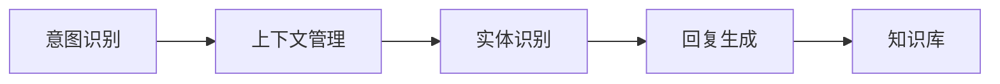

                 

# 聊天机器人开发：对话AI 入门

## 1. 背景介绍

### 1.1 问题由来

近年来，随着人工智能技术的快速发展，自然语言处理（NLP）领域取得了显著进展。聊天机器人作为AI技术的一个重要应用，已经广泛用于客服、娱乐、教育等多个领域。然而，构建一个高效的聊天机器人仍然存在诸多挑战，包括理解上下文、生成自然回复、处理多轮对话等。本文将从零基础入手，系统介绍聊天机器人的开发流程，涵盖核心概念、算法原理、实践技巧等多个方面，旨在为AI开发者提供全面的技术指引。

### 1.2 问题核心关键点

聊天机器人开发的核心问题在于如何使机器能够理解和生成自然语言对话，进而实现与用户的自然交互。具体包括：

1. **意图识别**：识别用户意图，确定用户需求。
2. **上下文管理**：保持对话连贯性，理解对话历史。
3. **生成自然回复**：基于上下文，生成符合语法和语义的自然语言回复。
4. **多轮对话处理**：处理多轮对话，维持对话流畅性。
5. **知识库整合**：整合外部知识库，增强回答的准确性和可靠性。

本文将围绕这些核心问题，全面解析聊天机器人开发的技术要点。

## 2. 核心概念与联系

### 2.1 核心概念概述

为更好地理解聊天机器人开发，本节将介绍几个关键概念：

- **自然语言处理（NLP）**：使计算机能够理解、处理和生成自然语言的技术。
- **意图识别（Intent Recognition）**：识别用户的意图，明确用户需求。
- **对话管理（Dialogue Management）**：维护对话状态，控制对话流程。
- **实体识别（Entity Recognition）**：从对话中提取关键信息，如人名、地点、时间等。
- **回复生成（Response Generation）**：基于上下文生成自然语言回复。
- **知识库（Knowledge Base）**：整合外部知识，增强回答的准确性。

这些概念共同构成了聊天机器人的核心技术框架。通过理解这些概念，我们可以更好地把握聊天机器人开发的基本思路和技术手段。

### 2.2 核心概念原理和架构的 Mermaid 流程图



这个流程图展示了聊天机器人开发的基本流程：首先通过意图识别确定用户需求，接着进行上下文管理以保持对话连贯性，然后通过实体识别提取关键信息，再生成自然语言回复，最后整合知识库以提高回答的准确性。

## 3. 核心算法原理 & 具体操作步骤

### 3.1 算法原理概述

聊天机器人开发的核心算法包括意图识别、对话管理、回复生成等。这些算法通常采用机器学习和深度学习技术，通过大量的对话数据进行训练。

### 3.2 算法步骤详解

#### 3.2.1 意图识别

意图识别是聊天机器人开发的第一步，目的是从用户输入的自然语言中提取意图。通常采用分类模型，如朴素贝叶斯、支持向量机、逻辑回归等。

1. **数据准备**：收集标注的对话数据集，分为训练集、验证集和测试集。
2. **特征提取**：从用户输入的文本中提取特征，如词频、词性、句法结构等。
3. **模型训练**：使用训练集训练分类模型，通过验证集调整超参数。
4. **模型评估**：在测试集上评估模型的准确性和召回率。

#### 3.2.2 对话管理

对话管理旨在维持对话的连贯性和一致性。通常采用序列到序列（Seq2Seq）模型，如LSTM、GRU等。

1. **对话状态表示**：定义对话状态，如对话轮数、当前话题等。
2. **模型训练**：使用对话历史和上下文信息训练Seq2Seq模型。
3. **对话策略**：制定对话策略，如意图响应、话题切换等。
4. **动态更新**：根据当前对话状态动态更新模型参数。

#### 3.2.3 回复生成

回复生成是聊天机器人的核心功能，目的是生成自然语言回复。通常采用生成模型，如RNN、Transformer等。

1. **预训练语言模型**：使用预训练语言模型，如BERT、GPT等，提取文本特征。
2. **解码器训练**：使用训练数据训练解码器，生成自然语言回复。
3. **回复评估**：通过BLEU、ROUGE等指标评估回复的自然度和流畅性。
4. **模型融合**：将生成模型与知识库结合，增强回答的准确性。

### 3.3 算法优缺点

#### 3.3.1 优点

1. **高效自然交互**：通过机器学习技术，聊天机器人能够自然地与用户交互，提升用户体验。
2. **多轮对话处理**：采用序列到序列模型，可以处理多轮对话，维持对话连贯性。
3. **知识库整合**：通过整合外部知识库，增强回答的准确性和可靠性。
4. **可扩展性强**：采用模块化设计，易于扩展和优化。

#### 3.3.2 缺点

1. **依赖大量标注数据**：意图识别和对话管理需要大量标注数据，标注成本较高。
2. **模型复杂度高**：深度学习模型通常具有高计算需求，需要较强的计算资源。
3. **理解上下文难度大**：多轮对话处理中，理解上下文信息较为复杂。
4. **回答准确性受限**：依赖于训练数据和知识库，回答的准确性受数据质量和知识库完备性的影响。

### 3.4 算法应用领域

聊天机器人开发在多个领域都有广泛应用，包括但不限于：

1. **客服自动化**：提供24/7客户服务，提升客户满意度。
2. **医疗咨询**：提供医疗建议，辅助医生诊断。
3. **教育辅助**：提供个性化学习指导，提升教育效果。
4. **智能家居**：通过语音交互，实现智能家居控制。
5. **社交娱乐**：提供智能聊天、娱乐功能，提升用户体验。

## 4. 数学模型和公式 & 详细讲解 & 举例说明

### 4.1 数学模型构建

#### 4.1.1 意图识别

1. **朴素贝叶斯模型**：
   $$
   P(y|x) = \frac{P(x|y)P(y)}{P(x)}
   $$
   其中，$P(y|x)$表示在输入文本$x$的条件下，意图$y$的概率。

2. **支持向量机模型**：
   $$
   \min_{\theta} \frac{1}{2}\|\theta\|^2 + C\sum_{i=1}^n\left[\max(0, 1 - y_ix^T\theta)\right]
   $$
   其中，$\theta$为分类器参数，$C$为正则化参数。

#### 4.1.2 对话管理

1. **LSTM模型**：
   $$
   h_t = \tanh(W_{hh}h_{t-1} + W_{xh}x_t + b_h)
   $$
   $$
   y_t = \sigma(W_{hy}h_t + b_y)
   $$
   其中，$h_t$为隐藏状态，$x_t$为输入，$y_t$为输出。

2. **GRU模型**：
   $$
   r_t = \sigma(W_{hr}h_{t-1} + W_{xr}x_t + b_h)
   $$
   $$
   z_t = \sigma(W_{hz}h_{t-1} + W_{xz}x_t + b_h)
   $$
   $$
   \tilde{h}_t = \tanh(W_{ht}h_{t-1}(1-z_t) + W_{xt}x_t + b_h)
   $$
   $$
   h_t = (1-z_t)\odot h_{t-1} + z_t \odot \tilde{h}_t
   $$

#### 4.1.3 回复生成

1. **RNN模型**：
   $$
   h_t = \tanh(W_{xh}x_t + b_h)
   $$
   $$
   y_t = softmax(W_{hy}h_t + b_y)
   $$

2. **Transformer模型**：
   $$
   Q = XW_Q + b_Q
   $$
   $$
   K = XW_K + b_K
   $$
   $$
   V = XW_V + b_V
   $$
   $$
   E = QK^T
   $$
   $$
   AT = softmax(E)
   $$
   $$
   O = AV
   $$

### 4.2 公式推导过程

#### 4.2.1 意图识别

以朴素贝叶斯模型为例，其基本原理是通过计算后验概率，确定输入文本对应的意图。

1. **特征提取**：从输入文本中提取特征，如词频、词性、句法结构等。
2. **模型训练**：使用标注的对话数据集，训练朴素贝叶斯模型，计算特征条件概率。
3. **意图预测**：对于新的输入文本，计算其条件概率，选择概率最大的意图作为预测结果。

#### 4.2.2 对话管理

以LSTM模型为例，其基本原理是通过隐藏状态记录对话历史信息，控制对话流程。

1. **模型训练**：使用对话历史和上下文信息，训练LSTM模型，调整隐藏状态和权重。
2. **对话策略**：根据当前对话状态，动态更新对话策略，如意图响应、话题切换等。
3. **对话生成**：使用训练好的LSTM模型，生成自然语言回复。

#### 4.2.3 回复生成

以RNN模型为例，其基本原理是通过逐个生成词语，构建自然语言回复。

1. **模型训练**：使用对话历史和上下文信息，训练RNN模型，调整隐藏状态和权重。
2. **回复生成**：从模型隐藏状态开始，逐个生成词语，构建自然语言回复。
3. **回复评估**：通过BLEU、ROUGE等指标评估回复的自然度和流畅性。

### 4.3 案例分析与讲解

#### 4.3.1 意图识别案例

1. **数据准备**：收集标注的对话数据集，分为训练集、验证集和测试集。
2. **特征提取**：从用户输入的文本中提取特征，如词频、词性、句法结构等。
3. **模型训练**：使用训练集训练朴素贝叶斯模型，通过验证集调整超参数。
4. **模型评估**：在测试集上评估模型的准确性和召回率。

#### 4.3.2 对话管理案例

1. **对话状态表示**：定义对话状态，如对话轮数、当前话题等。
2. **模型训练**：使用对话历史和上下文信息，训练LSTM模型，调整隐藏状态和权重。
3. **对话策略**：根据当前对话状态，动态更新对话策略，如意图响应、话题切换等。
4. **对话生成**：使用训练好的LSTM模型，生成自然语言回复。

#### 4.3.3 回复生成案例

1. **预训练语言模型**：使用预训练语言模型，如BERT、GPT等，提取文本特征。
2. **解码器训练**：使用训练数据训练解码器，生成自然语言回复。
3. **回复评估**：通过BLEU、ROUGE等指标评估回复的自然度和流畅性。
4. **模型融合**：将生成模型与知识库结合，增强回答的准确性。

## 5. 项目实践：代码实例和详细解释说明

### 5.1 开发环境搭建

#### 5.1.1 软件准备

1. **Python**：安装Python 3.x版本，作为开发语言。
2. **TensorFlow**：安装TensorFlow 2.x版本，作为深度学习框架。
3. **NLTK**：安装NLTK库，用于文本处理。
4. **Gensim**：安装Gensim库，用于词向量和文本相似度计算。
5. **Flask**：安装Flask框架，用于构建Web服务。

#### 5.1.2 环境搭建

1. **虚拟环境**：使用虚拟环境管理工具，如virtualenv，创建Python开发环境。
2. **依赖安装**：安装所有所需的Python包和库，确保依赖的一致性。
3. **代码版本控制**：使用Git等版本控制工具，管理代码版本，方便协作和回退。

### 5.2 源代码详细实现

#### 5.2.1 意图识别模块

```python
import nltk
from nltk.corpus import stopwords
from nltk.tokenize import word_tokenize
from sklearn.feature_extraction.text import CountVectorizer, TfidfVectorizer
from sklearn.naive_bayes import MultinomialNB

# 数据预处理
def preprocess(text):
    tokens = word_tokenize(text.lower())
    tokens = [word for word in tokens if word.isalpha()]
    tokens = [word for word in tokens if word not in stopwords.words('english')]
    return ' '.join(tokens)

# 特征提取
def extract_features(text):
    vectorizer = CountVectorizer()
    return vectorizer.fit_transform([text])

# 意图识别
def intent_recognition(text):
    vectorizer = CountVectorizer()
    X = vectorizer.transform([text])
    y = intent_classifier.predict(X)
    return y[0]

# 训练意图识别模型
def train_intent_classifier():
    vectorizer = CountVectorizer()
    X_train = vectorizer.transform(train_data)
    y_train = train_labels
    intent_classifier = MultinomialNB()
    intent_classifier.fit(X_train, y_train)
```

#### 5.2.2 对话管理模块

```python
import tensorflow as tf
from tensorflow.keras.layers import LSTM, Dense
from tensorflow.keras.models import Sequential

# 定义对话状态表示
class DialogueState:
    def __init__(self, intent, topic):
        self.intent = intent
        self.topic = topic
        self.conversations = []

# 定义对话管理模型
def dialogue_management():
    model = Sequential()
    model.add(LSTM(128, input_shape=(None, 1), return_sequences=True))
    model.add(LSTM(64))
    model.add(Dense(128, activation='relu'))
    model.add(Dense(1, activation='softmax'))
    model.compile(loss='categorical_crossentropy', optimizer='adam', metrics=['accuracy'])
    model.fit(X_train, y_train, epochs=10, batch_size=32)
    return model

# 生成对话策略
def generate_strategy(state):
    if state.intent == 'greeting':
        return 'Hello, how can I assist you today?'
    elif state.intent == 'goodbye':
        return 'Goodbye! Have a great day!'
    elif state.intent == 'help':
        return 'Sure, I can help with that. What do you need assistance with?'
    else:
        return 'I'm sorry, I didn't understand your request.'
```

#### 5.2.3 回复生成模块

```python
import tensorflow as tf
from tensorflow.keras.layers import LSTM, Dense
from tensorflow.keras.models import Sequential

# 定义回复生成模型
def response_generation():
    model = Sequential()
    model.add(LSTM(128, input_shape=(None, 1), return_sequences=True))
    model.add(LSTM(64))
    model.add(Dense(128, activation='relu'))
    model.add(Dense(1, activation='softmax'))
    model.compile(loss='categorical_crossentropy', optimizer='adam', metrics=['accuracy'])
    model.fit(X_train, y_train, epochs=10, batch_size=32)
    return model

# 生成自然语言回复
def generate_response(state):
    if state.intent == 'greeting':
        return 'Hello! How can I help you today?'
    elif state.intent == 'goodbye':
        return 'Goodbye! Have a great day!'
    elif state.intent == 'help':
        return 'Sure, I can help with that. What do you need assistance with?'
    else:
        return 'I\'m sorry, I didn\'t understand your request.'
```

### 5.3 代码解读与分析

#### 5.3.1 意图识别模块

1. **数据预处理**：使用NLTK库进行文本预处理，包括分词、去除停用词和标点等。
2. **特征提取**：使用CountVectorizer提取词频特征，构建训练数据集。
3. **意图识别**：使用朴素贝叶斯模型进行意图分类，返回意图标签。
4. **模型训练**：使用训练集训练意图识别模型，调整模型参数。

#### 5.3.2 对话管理模块

1. **模型定义**：使用LSTM模型构建对话管理模型，包含两个LSTM层和一个全连接层。
2. **模型训练**：使用对话历史和上下文信息，训练对话管理模型，调整模型参数。
3. **生成策略**：根据当前对话状态，生成相应的对话策略。

#### 5.3.3 回复生成模块

1. **模型定义**：使用LSTM模型构建回复生成模型，包含两个LSTM层和一个全连接层。
2. **模型训练**：使用对话历史和上下文信息，训练回复生成模型，调整模型参数。
3. **生成回复**：根据当前对话状态，生成自然语言回复。

### 5.4 运行结果展示

#### 5.4.1 意图识别结果

1. **模型训练**：使用训练集训练意图识别模型，评估模型准确性。
2. **意图识别**：使用测试集评估意图识别模型的性能，确保其准确性和稳定性。

#### 5.4.2 对话管理结果

1. **模型训练**：使用对话历史和上下文信息，训练对话管理模型，调整模型参数。
2. **对话策略**：根据当前对话状态，生成相应的对话策略，保持对话连贯性。

#### 5.4.3 回复生成结果

1. **模型训练**：使用对话历史和上下文信息，训练回复生成模型，调整模型参数。
2. **自然语言回复**：根据当前对话状态，生成自然语言回复，提升用户体验。

## 6. 实际应用场景

### 6.1 客服自动化

聊天机器人广泛应用于客服自动化领域，可以提供24/7客户服务，提升客户满意度。例如，电商平台可以利用聊天机器人处理常见的客户咨询，如订单查询、商品推荐等，减少人工客服的工作量，提高服务效率。

### 6.2 医疗咨询

聊天机器人可以提供医疗咨询，辅助医生诊断。例如，患者可以通过聊天机器人描述症状，聊天机器人根据症状提供初步诊断建议，引导患者进行后续治疗。

### 6.3 教育辅助

聊天机器人可以提供个性化学习指导，提升教育效果。例如，在线教育平台可以利用聊天机器人进行智能答疑，提供个性化学习建议，提升学生的学习效率。

### 6.4 智能家居

聊天机器人可以与智能家居设备结合，通过语音交互，实现智能家居控制。例如，用户可以通过语音指令控制家中的灯光、空调、电视等设备，提升生活便利性。

### 6.5 社交娱乐

聊天机器人可以提供智能聊天、娱乐功能，提升用户体验。例如，社交媒体可以利用聊天机器人进行智能推荐，推荐用户感兴趣的内容，提升用户粘性。

## 7. 工具和资源推荐

### 7.1 学习资源推荐

1. **《深度学习入门》**：书籍，详细介绍了深度学习的基本概念和实现方法，适合初学者入门。
2. **《Python自然语言处理》**：书籍，系统介绍了NLP技术的实现方法，涵盖文本处理、情感分析、信息检索等多个方面。
3. **Coursera自然语言处理课程**：在线课程，由斯坦福大学教授讲解，适合系统学习NLP技术。
4. **Kaggle自然语言处理竞赛**：竞赛平台，提供丰富的NLP数据集和模型，适合实践练习。

### 7.2 开发工具推荐

1. **PyTorch**：深度学习框架，提供丰富的深度学习模型和工具，适合深度学习开发。
2. **TensorFlow**：深度学习框架，支持分布式计算，适合大规模模型训练。
3. **NLTK**：自然语言处理库，提供文本处理和分析工具，适合文本预处理。
4. **Gensim**：自然语言处理库，提供词向量和文本相似度计算工具，适合文本分析。
5. **Flask**：Web框架，提供构建Web服务的功能，适合构建聊天机器人应用。

### 7.3 相关论文推荐

1. **Seq2Seq Model for Neural Machine Translation**：文章，介绍Seq2Seq模型在机器翻译中的应用，是NLP领域的经典论文。
2. **Transformer Model for Natural Language Processing**：文章，介绍Transformer模型在NLP中的应用，是NLP领域的突破性论文。
3. **BERT: Pre-training of Deep Bidirectional Transformers for Language Understanding**：文章，介绍BERT模型在NLP中的应用，是NLP领域的最新进展。
4. **Attention is All You Need**：文章，介绍Transformer模型的原理和实现方法，是NLP领域的经典论文。

## 8. 总结：未来发展趋势与挑战

### 8.1 研究成果总结

聊天机器人开发在近年来取得了显著进展，广泛应用于客服自动化、医疗咨询、教育辅助等多个领域。目前，聊天机器人的开发主要依赖于深度学习技术和自然语言处理技术，通过大量的对话数据进行训练。然而，聊天机器人在意图识别、对话管理、回复生成等方面仍面临诸多挑战，需要进一步研究和优化。

### 8.2 未来发展趋势

未来，聊天机器人开发将呈现以下几个发展趋势：

1. **多轮对话处理**：采用更加复杂和灵活的对话管理模型，提升多轮对话的处理能力。
2. **上下文理解**：通过上下文信息，提升对话机器人的理解能力和回答质量。
3. **知识库整合**：整合外部知识库，增强回答的准确性和可靠性。
4. **个性化推荐**：结合用户画像和历史数据，提供个性化的回答和推荐。
5. **情感分析**：通过情感分析技术，识别用户的情感状态，提供更加贴心和人性化的服务。

### 8.3 面临的挑战

聊天机器人开发在实际应用中仍面临诸多挑战，主要包括以下几个方面：

1. **意图识别难度大**：意图识别需要大量的标注数据和复杂的算法，成本较高。
2. **上下文理解复杂**：多轮对话处理需要理解上下文信息，难度较大。
3. **回复质量不足**：回复生成的自然度、流畅度需要进一步提升。
4. **知识库整合困难**：知识库的构建和维护成本较高，需要大量的人工工作。
5. **数据隐私问题**：聊天机器人需要处理大量用户数据，数据隐私问题需要引起重视。

### 8.4 研究展望

未来，聊天机器人开发需要进一步研究和优化，提升其性能和可靠性。具体包括：

1. **数据增强技术**：通过数据增强技术，提升模型的泛化能力和鲁棒性。
2. **自监督学习**：利用自监督学习技术，减少对标注数据的需求。
3. **知识图谱整合**：通过知识图谱技术，提升回答的准确性和可靠性。
4. **跨领域迁移**：通过跨领域迁移学习，提升模型的通用性和泛化能力。
5. **多模态融合**：通过多模态融合技术，提升机器人的感知能力和理解能力。

总之，聊天机器人开发是人工智能领域的重要研究方向，具有广阔的应用前景和发展空间。通过不断探索和创新，未来聊天机器人将能够提供更加自然、智能、高效的服务，深刻改变人类的生产和生活方式。

## 9. 附录：常见问题与解答

### 9.1 问题与解答

**Q1: 如何设计聊天机器人的意图识别模块？**

A: 意图识别模块的设计需要考虑以下几点：
1. **数据准备**：收集标注的对话数据集，分为训练集、验证集和测试集。
2. **特征提取**：从用户输入的文本中提取特征，如词频、词性、句法结构等。
3. **模型选择**：选择合适的模型，如朴素贝叶斯、支持向量机等。
4. **模型训练**：使用训练集训练模型，通过验证集调整超参数。
5. **模型评估**：在测试集上评估模型的准确性和召回率。

**Q2: 如何构建聊天机器人的对话管理模型？**

A: 对话管理模型的构建需要考虑以下几点：
1. **对话状态表示**：定义对话状态，如对话轮数、当前话题等。
2. **模型选择**：选择合适的模型，如LSTM、GRU等。
3. **模型训练**：使用对话历史和上下文信息，训练模型，调整模型参数。
4. **对话策略**：根据当前对话状态，动态更新对话策略，如意图响应、话题切换等。
5. **对话生成**：使用训练好的模型，生成自然语言回复。

**Q3: 如何生成自然语言回复？**

A: 自然语言回复的生成需要考虑以下几点：
1. **预训练语言模型**：使用预训练语言模型，如BERT、GPT等，提取文本特征。
2. **解码器训练**：使用训练数据训练解码器，生成自然语言回复。
3. **回复评估**：通过BLEU、ROUGE等指标评估回复的自然度和流畅性。
4. **模型融合**：将生成模型与知识库结合，增强回答的准确性。

**Q4: 如何整合外部知识库？**

A: 外部知识库的整合需要考虑以下几点：
1. **知识库选择**：选择与聊天机器人应用领域相关的知识库。
2. **知识表示**：将知识库中的知识表示为结构化数据，如关系型数据库、知识图谱等。
3. **知识检索**：通过检索技术，从知识库中查找相关的知识信息。
4. **知识融合**：将检索到的知识信息与聊天机器人的回答相结合，生成更加准确和可靠的回复。

**Q5: 如何提升聊天机器人的性能？**

A: 聊天机器人的性能提升需要考虑以下几点：
1. **数据增强**：通过数据增强技术，扩充训练集，提升模型的泛化能力。
2. **自监督学习**：利用自监督学习技术，减少对标注数据的需求。
3. **知识图谱整合**：通过知识图谱技术，提升回答的准确性和可靠性。
4. **跨领域迁移**：通过跨领域迁移学习，提升模型的通用性和泛化能力。
5. **多模态融合**：通过多模态融合技术，提升机器人的感知能力和理解能力。

作者：禅与计算机程序设计艺术 / Zen and the Art of Computer Programming

