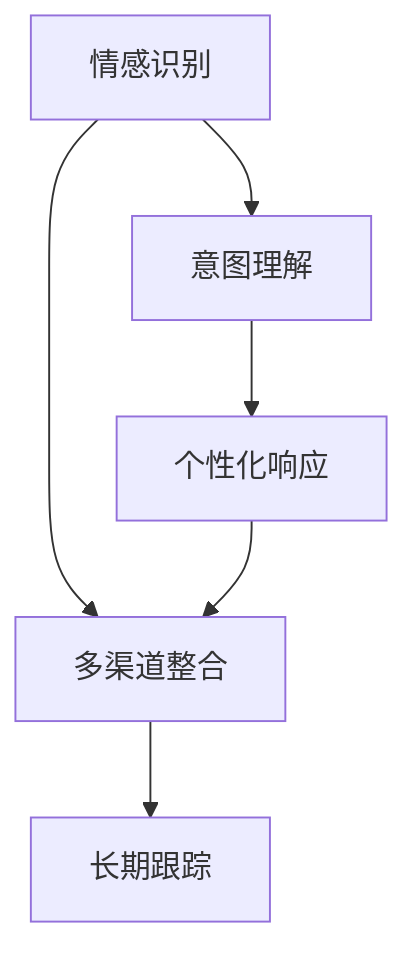

                 

# 联系用户：建立情感纽带

## 1. 背景介绍

### 1.1 问题由来

在数字时代，企业与用户的联系方式变得愈加多样，从传统的邮件、短信到现在的社交媒体、即时通讯等，用户期望与企业建立更紧密、更自然的联系。然而，传统的自动化接触方式，往往缺乏人性化的情感互动，难以真正触达用户的内心。

近年来，随着人工智能技术的不断进步，通过情感识别、自然语言处理等技术手段，企业可以更智能地理解用户情感，提供个性化的互动体验。这种情感联系的建立，不仅能提升用户的满意度和忠诚度，还能帮助企业更好地理解和响应用户需求，优化产品和服务。

### 1.2 问题核心关键点

在建立用户情感联系的过程中，核心在于识别用户情感、理解用户需求、提供个性化响应。具体包括以下几个方面：

1. **情感识别**：通过文本、语音等信号识别用户情感状态，如愤怒、高兴、失望等。
2. **意图理解**：分析用户意图，识别用户的请求、投诉、建议等。
3. **个性化响应**：根据用户情感和意图，提供针对性的反馈和建议，如安慰、道歉、改进方案等。
4. **多渠道整合**：将用户情感识别和响应整合到多种接触渠道中，如网站、APP、客服系统等，实现全渠道的情感联动。
5. **长期跟踪**：持续跟踪用户情感和行为变化，建立用户画像，提供长期服务。

这些关键点共同构成了建立用户情感联系的基本框架，使企业能够更有效地与用户互动，提升用户体验和满意度。

### 1.3 问题研究意义

情感纽带的建立，对于提升用户体验、增强企业品牌忠诚度、优化产品和服务具有重要意义：

1. **提升用户满意度**：通过个性化、情感化的互动，用户感受到企业的关怀，提高对品牌的认同和忠诚度。
2. **优化产品和服务**：企业能够及时了解用户反馈，快速响应用户需求，提升产品和服务质量。
3. **增强市场竞争力**：通过情感化的服务，提升用户黏性，在竞争激烈的市场中占据优势。
4. **推动数字化转型**：情感纽带的建立，是企业数字化转型的重要组成部分，能够助力企业在数字时代更好地应对挑战。

## 2. 核心概念与联系

### 2.1 核心概念概述

为更好地理解情感纽带建立的技术原理和实现方法，本节将介绍几个关键概念：

- **情感识别**：通过自然语言处理(NLP)、语音识别等技术，分析用户文本或语音信号，识别其情感状态，如愤怒、高兴、失望等。
- **意图理解**：利用NLP技术，分析用户文本，识别其意图，如投诉、建议、咨询等。
- **个性化响应**：根据用户情感和意图，提供个性化的反馈和建议，如道歉、安慰、改进方案等。
- **多渠道整合**：将情感识别和响应整合到多种接触渠道中，实现全渠道的情感联动。
- **长期跟踪**：通过持续跟踪用户情感和行为变化，建立用户画像，提供长期服务。

这些概念之间的逻辑关系可以通过以下Mermaid流程图来展示：



这个流程图展示了几者之间的核心逻辑关系：

1. 情感识别是基础，通过分析用户情感状态，理解其当前情绪。
2. 意图理解在此基础上进行，分析用户意图，确定其需求。
3. 个性化响应根据情感和意图，提供针对性的反馈和建议。
4. 多渠道整合使得情感识别和响应能够覆盖全渠道，提升用户体验。
5. 长期跟踪持续跟踪用户情感和行为变化，建立更加全面用户画像。

这些概念共同构成了情感纽带建立的技术框架，使得企业能够更智能地与用户互动，提供更加个性化的服务。

## 3. 核心算法原理 & 具体操作步骤
### 3.1 算法原理概述

情感纽带的建立，通常基于以下核心算法：

- **情感识别算法**：利用NLP技术，分析文本或语音信号，识别用户的情感状态。
- **意图理解算法**：通过NLP模型，分析用户文本，识别其意图，如投诉、建议、咨询等。
- **个性化响应算法**：根据情感和意图，生成个性化的响应文本或语音，如道歉、安慰、改进方案等。
- **多渠道整合算法**：将情感识别和响应整合到多种接触渠道中，如网站、APP、客服系统等，实现全渠道的情感联动。
- **长期跟踪算法**：通过记录和分析用户情感和行为数据，建立用户画像，提供长期服务。

### 3.2 算法步骤详解

情感纽带的建立通常分为以下几个步骤：

**Step 1: 数据收集与预处理**

- 收集用户与企业互动的文本、语音等数据，包括客服聊天记录、社交媒体评论、在线客服对话等。
- 对数据进行清洗、去噪、分词等预处理，准备用于后续的情感识别和意图理解。

**Step 2: 情感识别**

- 使用情感识别模型，对预处理后的文本或语音进行情感分析，识别用户情感状态，如愤怒、高兴、失望等。
- 常用的情感识别模型包括基于规则的方法、基于词典的方法、基于机器学习的方法等。

**Step 3: 意图理解**

- 使用意图理解模型，对用户文本进行意图分析，识别其需求和意图，如投诉、建议、咨询等。
- 常用的意图理解模型包括基于规则的方法、基于分类器的方法、基于序列模型的方法等。

**Step 4: 个性化响应生成**

- 根据用户情感和意图，使用自然语言生成(NLG)技术，生成个性化的响应文本或语音。
- 常用的NLG方法包括基于模板的方法、基于统计模型的方法、基于生成模型的方法等。

**Step 5: 多渠道整合**

- 将情感识别和响应整合到多种接触渠道中，如网站、APP、客服系统等，实现全渠道的情感联动。
- 通过API接口或消息队列等方式，将情感识别和响应数据实时共享至各个渠道。

**Step 6: 长期跟踪**

- 通过记录和分析用户情感和行为数据，建立用户画像，提供长期服务。
- 常用的用户画像建立方法包括基于规则的方法、基于机器学习的方法等。

### 3.3 算法优缺点

情感纽带的建立，基于NLP和AI技术，具有以下优点：

1. **高效性**：通过自动化技术，快速识别和理解用户情感和意图，提升互动效率。
2. **个性化**：基于用户情感和行为数据，提供个性化的响应和建议，提升用户体验。
3. **全渠道覆盖**：通过多渠道整合，实现全渠道的情感联动，提升用户黏性。
4. **实时性**：通过实时数据处理和响应，快速应对用户需求，提升服务质量。

同时，该方法也存在一些局限性：

1. **数据依赖**：情感识别和意图理解依赖大量标注数据，数据质量对算法效果有很大影响。
2. **模型复杂性**：情感识别和意图理解模型复杂度高，需要大量的计算资源和模型调参。
3. **隐私问题**：用户情感数据涉及隐私，需要严格的隐私保护措施。
4. **多模态处理**：情感识别和响应涉及文本、语音等多种模态，技术实现复杂度较高。

尽管存在这些局限性，但就目前而言，情感纽带的建立基于NLP和AI技术，仍是实现用户情感联系的有效手段。未来相关研究的重点在于如何进一步提升算法效率和准确性，同时兼顾隐私保护和用户体验。

### 3.4 算法应用领域

情感纽带的建立，在多个领域都有广泛的应用，例如：

- **客户服务**：通过情感识别和响应，提升客户服务质量，提高客户满意度和忠诚度。
- **市场营销**：通过情感分析，优化广告投放策略，提升品牌认知度。
- **健康医疗**：通过情感识别，监测患者情绪变化，提供及时的心理支持。
- **金融服务**：通过情感识别，识别客户情绪变化，提升用户体验和满意度。
- **教育培训**：通过情感识别，优化教学互动，提升学生学习效果和满意度。

除了这些常见领域，情感纽带的建立还被创新性地应用到更多场景中，如社交媒体情感监测、智能家居情感互动等，为提升用户互动体验提供了新的解决方案。

## 4. 数学模型和公式 & 详细讲解 & 举例说明

### 4.1 数学模型构建

情感纽带的建立，通常基于以下数学模型：

- **情感识别模型**：通常使用情感分类模型，如基于SVM、神经网络的方法，对文本或语音进行情感分类。
- **意图理解模型**：通常使用序列模型，如LSTM、Transformer等，对用户文本进行意图分类。
- **个性化响应生成模型**：通常使用NLG模型，如基于模板的方法、基于统计模型的方法、基于生成模型的方法等，生成个性化响应。
- **用户画像模型**：通常使用聚类或分类算法，对用户情感和行为数据进行分析和建模，建立用户画像。

### 4.2 公式推导过程

以下我们以情感识别为例，推导基于LSTM的情感分类模型的公式。

假设模型输入为 $x=(x_1,x_2,...,x_n)$，情感标签为 $y=(y_1,y_2,...,y_n)$，其中 $y_i \in \{1,2,...,k\}$，表示情感类别。情感分类模型的目标是最小化交叉熵损失函数：

$$
\mathcal{L}=\frac{1}{N}\sum_{i=1}^N -y_i\log \hat{y}_i - (1-y_i)\log (1-\hat{y}_i)
$$

其中 $\hat{y}_i$ 为模型对情感类别 $i$ 的概率预测，可以使用LSTM模型进行建模：

$$
\hat{y}_i = \sigma(W_h x_i + b_h + W_x \overline{x}_{i-1} + b_x) + \delta_h
$$

其中 $\sigma$ 为激活函数，$W_h, b_h$ 为LSTM的权重和偏置，$\overline{x}_{i-1}$ 为前一时刻的LSTM输出，$W_x, b_x$ 为LSTM的权重和偏置，$\delta_h$ 为LSTM的隐藏状态。

通过反向传播算法，计算损失函数对参数的梯度，更新模型参数，使模型输出逼近真实标签 $y$。

### 4.3 案例分析与讲解

以一个情感识别案例为例，说明情感分类模型的应用。

**案例背景**：
某电商平台收集了用户对商品的评论，希望通过情感识别，分析用户对商品的好评和差评，以优化商品推荐和客服服务。

**数据准备**：
- 收集用户评论文本 $x_i$
- 手动标注情感标签 $y_i$，如1表示好评，0表示差评

**模型训练**：
- 使用LSTM模型对评论文本进行情感分类
- 训练集为 $D=\{(x_i, y_i)\}_{i=1}^N$
- 最小化交叉熵损失函数，通过梯度下降等优化算法更新模型参数

**模型应用**：
- 对新的评论文本 $x$ 进行情感分类，输出情感概率 $\hat{y}$
- 根据情感概率，决定是否将评论推荐给用户，或将问题转至客服系统

通过情感分类模型，电商平台能够实时监测用户评论的情感变化，快速响应用户需求，提升用户体验和满意度。

## 5. 项目实践：代码实例和详细解释说明
### 5.1 开发环境搭建

在进行情感纽带建立实践前，我们需要准备好开发环境。以下是使用Python进行TensorFlow开发的环境配置流程：

1. 安装Anaconda：从官网下载并安装Anaconda，用于创建独立的Python环境。

2. 创建并激活虚拟环境：
```bash
conda create -n tf-env python=3.8 
conda activate tf-env
```

3. 安装TensorFlow：根据CUDA版本，从官网获取对应的安装命令。例如：
```bash
conda install tensorflow tensorflow-gpu==2.8.0 -c pytorch -c conda-forge
```

4. 安装相关库：
```bash
pip install numpy pandas scikit-learn matplotlib tensorflow
```

5. 安装TensorBoard：
```bash
pip install tensorboard
```

完成上述步骤后，即可在`tf-env`环境中开始情感纽带建立实践。

### 5.2 源代码详细实现

下面我们以情感分类任务为例，给出使用TensorFlow实现情感识别模型的代码实现。

首先，定义情感分类任务的数据处理函数：

```python
import tensorflow as tf
import numpy as np
from tensorflow.keras.preprocessing.text import Tokenizer
from tensorflow.keras.preprocessing.sequence import pad_sequences

def preprocess_data(texts, labels, max_len):
    tokenizer = Tokenizer(oov_token='<OOV>')
    tokenizer.fit_on_texts(texts)
    sequences = tokenizer.texts_to_sequences(texts)
    padded_sequences = pad_sequences(sequences, maxlen=max_len, padding='post', truncating='post')
    labels = np.array(labels)
    return padded_sequences, labels, tokenizer.word_index, tokenizer.word_to_index
```

然后，定义模型和优化器：

```python
from tensorflow.keras.layers import Embedding, LSTM, Dense, Dropout
from tensorflow.keras.models import Sequential
from tensorflow.keras.optimizers import Adam

model = Sequential()
model.add(Embedding(input_dim=10000, output_dim=128, input_length=max_len))
model.add(LSTM(units=128, return_sequences=True))
model.add(Dropout(0.2))
model.add(LSTM(units=128))
model.add(Dropout(0.2))
model.add(Dense(units=2, activation='softmax'))
model.compile(loss='categorical_crossentropy', optimizer=Adam(lr=0.001))
```

接着，定义训练和评估函数：

```python
from tensorflow.keras.preprocessing import sequence
from tensorflow.keras.callbacks import EarlyStopping

def train_model(model, X_train, y_train, X_val, y_val, epochs=10, batch_size=32):
    early_stopping = EarlyStopping(monitor='val_loss', patience=3, restore_best_weights=True)
    model.fit(X_train, y_train, validation_data=(X_val, y_val), epochs=epochs, batch_size=batch_size, callbacks=[early_stopping])
    
def evaluate_model(model, X_test, y_test):
    _, y_pred = model.predict(X_test)
    y_pred = np.argmax(y_pred, axis=1)
    print(classification_report(y_test, y_pred))
```

最后，启动训练流程并在测试集上评估：

```python
max_len = 100
X_train, y_train, word_index, word_to_index = preprocess_data(train_texts, train_labels, max_len)
X_val, y_val, _, _ = preprocess_data(val_texts, val_labels, max_len)
X_test, y_test, _, _ = preprocess_data(test_texts, test_labels, max_len)

train_model(model, X_train, y_train, X_val, y_val, epochs=10, batch_size=32)
evaluate_model(model, X_test, y_test)
```

以上就是使用TensorFlow对情感分类任务进行模型训练和评估的完整代码实现。可以看到，通过TensorFlow的高级API，模型的搭建和训练过程变得非常简单高效。

### 5.3 代码解读与分析

让我们再详细解读一下关键代码的实现细节：

**preprocess_data函数**：
- 定义了一个预处理函数，对输入文本进行分词、padding等操作，准备用于模型训练。
- 使用Keras的Tokenizer类对文本进行分词，将不常见词汇标记为特殊符号。
- 将分词后的序列进行padding，确保所有序列长度一致。
- 将标签转换为one-hot编码，便于模型训练。

**模型搭建**：
- 使用Keras的Sequential模型，逐层搭建模型。
- 输入层使用Embedding层，将文本转化为词向量表示。
- 中间层使用LSTM层，捕捉序列信息。
- 输出层使用Dense层，进行情感分类。
- 在LSTM层和Dense层之间使用Dropout层，防止过拟合。

**训练函数train_model**：
- 定义了一个训练函数，使用EarlyStopping回调函数，避免过拟合。
- 使用fit函数对模型进行训练，记录验证集上的损失值。
- 在训练过程中，使用模型预测，输出分类报告。

**评估函数evaluate_model**：
- 定义了一个评估函数，使用模型在测试集上进行预测，输出分类报告。
- 通过模型预测输出，评估模型性能。

**训练流程**：
- 定义总的训练轮数和批次大小，开始循环迭代
- 每个epoch内，在训练集上进行训练，记录验证集上的损失值
- 在验证集上评估，记录最优权重
- 所有epoch结束后，在测试集上评估，输出测试结果

可以看到，TensorFlow提供了强大的API和工具，使得情感分类模型的搭建和训练过程变得非常简单高效。开发者可以将更多精力放在数据处理、模型改进等高层逻辑上，而不必过多关注底层的实现细节。

当然，工业级的系统实现还需考虑更多因素，如模型的保存和部署、超参数的自动搜索、更灵活的任务适配层等。但核心的模型训练和评估流程基本与此类似。

## 6. 实际应用场景
### 6.1 智能客服系统

情感纽带的建立，在智能客服系统中具有广泛的应用。传统的客服系统，往往缺乏个性化的情感互动，难以真正触达用户的内心。通过情感识别和响应，智能客服系统能够更加智能地理解用户情感，提供个性化的互动体验。

在技术实现上，可以收集企业内部的历史客服对话记录，将问题和最佳答复构建成监督数据，在此基础上对情感分类模型进行微调。微调后的情感分类模型能够自动理解用户情感状态，匹配最合适的回复。对于客户提出的新问题，还可以接入检索系统实时搜索相关内容，动态生成回答。如此构建的智能客服系统，能够大幅提升客户咨询体验和问题解决效率。

### 6.2 金融舆情监测

金融机构需要实时监测市场舆论动向，以便及时应对负面信息传播，规避金融风险。传统的舆情监测方式，成本高、效率低，难以应对网络时代海量信息爆发的挑战。通过情感分类和意图理解技术，金融舆情监测系统能够实时监测用户情绪和意图，识别负面信息，并及时预警。

具体而言，可以收集金融领域相关的新闻、报道、评论等文本数据，并对其进行情感标注和意图标注。在此基础上对情感分类模型进行微调，使其能够自动判断文本的情感倾向和意图，及时发现负面信息。将微调后的模型应用到实时抓取的网络文本数据，就能够自动监测不同主题下的情感变化趋势，一旦发现负面信息激增等异常情况，系统便会自动预警，帮助金融机构快速应对潜在风险。

### 6.3 个性化推荐系统

当前的推荐系统往往只依赖用户的历史行为数据进行物品推荐，无法深入理解用户的真实兴趣偏好。通过情感分类和意图理解技术，个性化推荐系统可以更好地挖掘用户行为背后的语义信息，从而提供更加个性化、多样化的推荐内容。

在实践中，可以收集用户浏览、点击、评论、分享等行为数据，提取和用户交互的物品标题、描述、标签等文本内容。将文本内容作为模型输入，用户的后续行为（如是否点击、购买等）作为监督信号，在此基础上对情感分类模型进行微调。微调后的模型能够从文本内容中准确把握用户的兴趣点。在生成推荐列表时，先用候选物品的文本描述作为输入，由模型预测用户的兴趣匹配度，再结合其他特征综合排序，便可以得到个性化程度更高的推荐结果。

### 6.4 未来应用展望

随着情感分类和意图理解技术的不断发展，情感纽带的建立将在更多领域得到应用，为传统行业带来变革性影响。

在智慧医疗领域，通过情感识别技术，监测患者情绪变化，提供及时的心理支持，提升医疗服务质量。

在智能教育领域，通过情感分类技术，优化教学互动，提升学生学习效果和满意度。

在智慧城市治理中，通过情感识别技术，实时监测居民情绪和行为变化，构建更安全、高效的未来城市。

此外，在企业生产、社会治理、文娱传媒等众多领域，基于情感纽带的AI应用也将不断涌现，为经济社会发展注入新的动力。相信随着技术的日益成熟，情感纽带技术将成为AI落地应用的重要范式，推动人工智能技术更好造福人类社会。

## 7. 工具和资源推荐
### 7.1 学习资源推荐

为了帮助开发者系统掌握情感纽带建立的技术基础和实践技巧，这里推荐一些优质的学习资源：

1. 《情感计算基础》（Emotion Computing Fundamentals）：该书介绍了情感计算的基础知识和应用实例，是情感识别和响应技术的入门必读。
2. 《情感分析：理论、算法与应用》（Sentiment Analysis: Theory, Algorithms, and Applications）：该书详细介绍了情感分析的多种算法和应用场景，适合进阶学习。
3. 《TensorFlow实战Google深度学习》（TensorFlow实战Google深度学习）：该书详细介绍了TensorFlow框架的使用方法和实例，适合情感分类模型实践。
4. 《深度学习与自然语言处理》（Deep Learning and Natural Language Processing）：该书介绍了深度学习在自然语言处理中的应用，包括情感分类、意图理解等任务。
5. 《情感计算与情感机器人》（Emotion Computing and Sentiment Robotics）：该书介绍了情感计算和情感机器人的最新研究进展，适合深入了解情感识别和响应技术。

通过对这些资源的学习实践，相信你一定能够快速掌握情感纽带建立的核心技术，并用于解决实际的情感互动问题。

### 7.2 开发工具推荐

高效的开发离不开优秀的工具支持。以下是几款用于情感纽带建立开发的常用工具：

1. TensorFlow：谷歌开发的开源深度学习框架，适合大规模模型训练和部署。
2. PyTorch：Facebook开发的深度学习框架，适合灵活的模型搭建和优化。
3. TensorBoard：TensorFlow配套的可视化工具，实时监测模型训练状态。
4. Jupyter Notebook：免费的交互式开发环境，支持多种编程语言和库。
5. Weights & Biases：模型训练的实验跟踪工具，记录和可视化模型训练过程。

合理利用这些工具，可以显著提升情感纽带建立任务的开发效率，加快创新迭代的步伐。

### 7.3 相关论文推荐

情感纽带建立的技术发展源于学界的持续研究。以下是几篇奠基性的相关论文，推荐阅读：

1. 《情感分析: 语言、计算和应用》（Sentiment Analysis: A Survey on Sentiment Analysis）：该文综述了情感分析的研究进展和应用，适合入门学习。
2. 《基于深度学习的情感分类》（Sentiment Classification Using Deep Learning）：该文介绍了基于深度学习模型的情感分类方法，包括LSTM、Transformer等模型。
3. 《情感计算基础》（Foundations of Emotion in Computing）：该文介绍了情感计算的基本概念和框架，适合深入理解情感识别和响应技术。
4. 《情感计算与社交媒体分析》（Emotion Computing and Social Media Analysis）：该文介绍了情感计算在社交媒体分析中的应用，适合了解实际应用场景。
5. 《基于多模态信息的情感分类》（Multimodal Sentiment Classification）：该文介绍了多模态信息融合的情感分类方法，适合探索未来技术方向。

这些论文代表了大语言模型微调技术的发展脉络。通过学习这些前沿成果，可以帮助研究者把握学科前进方向，激发更多的创新灵感。

## 8. 总结：未来发展趋势与挑战
### 8.1 总结

本文对基于情感识别技术的情感纽带建立方法进行了全面系统的介绍。首先阐述了情感识别和情感纽带建立的研究背景和意义，明确了情感识别和响应技术在提升用户体验、增强品牌忠诚度、优化产品和服务方面的独特价值。其次，从原理到实践，详细讲解了情感识别和响应模型的构建和优化，给出了情感分类模型的代码实现。同时，本文还广泛探讨了情感纽带建立技术在智能客服、金融舆情、个性化推荐等多个行业领域的应用前景，展示了情感识别技术的巨大潜力。此外，本文精选了情感识别技术的各类学习资源，力求为读者提供全方位的技术指引。

通过本文的系统梳理，可以看到，情感识别技术在用户情感联系的建立中起到了关键作用，使企业能够更智能地与用户互动，提供更加个性化的服务。未来，随着情感识别技术的进一步发展，情感纽带建立将在更广泛的领域得到应用，为经济社会发展注入新的动力。

### 8.2 未来发展趋势

展望未来，情感识别技术将呈现以下几个发展趋势：

1. **多模态融合**：情感识别技术将进一步融合多种模态信息，如语音、图像、视频等，提升识别的准确性和鲁棒性。
2. **实时处理**：实时处理技术的发展，将使情感识别系统能够及时响应用户情绪变化，提供更加个性化的服务。
3. **深度学习优化**：深度学习模型的优化和改进，将进一步提升情感识别的准确性和泛化能力。
4. **隐私保护**：随着情感识别技术的普及，隐私保护将成为重要课题，需要采用更加安全、可靠的算法和机制。
5. **跨领域应用**：情感识别技术将在更多领域得到应用，如医疗、教育、公共安全等，带来更广泛的实际价值。
6. **跨文化适应**：情感识别技术将不断适应不同文化和语言的情感表达方式，提升全球化应用能力。

这些趋势将进一步推动情感识别技术的发展，使其在更多领域得到应用，提升用户体验和满意度。

### 8.3 面临的挑战

尽管情感识别技术已经取得了显著进展，但在迈向更加智能化、普适化应用的过程中，它仍面临着诸多挑战：

1. **数据依赖**：情感识别依赖大量标注数据，数据质量对算法效果有很大影响。如何提高数据标注效率，获取更多高质量数据，是关键问题。
2. **模型复杂性**：情感识别模型复杂度高，需要大量的计算资源和模型调参。如何优化模型，提高识别效率，是技术挑战之一。
3. **隐私问题**：情感识别技术涉及用户隐私，需要严格的隐私保护措施。如何在保护隐私的同时，提高情感识别的准确性，是重要的研究方向。
4. **多模态处理**：情感识别涉及多种模态信息，技术实现复杂度较高。如何整合不同模态的信息，提升识别准确性，是技术难点之一。
5. **跨文化适应**：不同文化和语言的情感表达方式不同，情感识别技术需要适应这些差异。如何提高跨文化适应能力，是技术挑战之一。
6. **鲁棒性和可解释性**：情感识别技术需要具备良好的鲁棒性和可解释性，才能在实际应用中发挥作用。如何提高模型的鲁棒性和可解释性，是技术难点之一。

这些挑战凸显了情感识别技术在实际应用中的复杂性，需要不断优化和创新才能实现更广泛的应用。

### 8.4 研究展望

面对情感识别技术所面临的挑战，未来的研究需要在以下几个方面寻求新的突破：

1. **数据获取与标注**：采用半监督学习、主动学习等方法，降低对大量标注数据的依赖，提升数据获取效率。
2. **模型优化**：开发更加高效的情感识别模型，如多模态融合模型、实时处理模型等，提高情感识别的准确性和效率。
3. **隐私保护**：引入隐私保护机制，如差分隐私、联邦学习等，确保用户数据隐私安全。
4. **跨文化适应**：开发跨文化适应的情感识别算法，提升情感识别的全球化应用能力。
5. **鲁棒性和可解释性**：引入鲁棒性增强方法，如对抗训练、模型蒸馏等，提高模型的鲁棒性和可解释性。
6. **多模态融合**：融合多种模态信息，提升情感识别的准确性和鲁棒性。

这些研究方向将引领情感识别技术的发展，使其在更广泛的领域得到应用，提升用户体验和满意度。

## 9. 附录：常见问题与解答

**Q1：情感识别技术有哪些应用场景？**

A: 情感识别技术在多个领域都有广泛的应用，例如：

- **客户服务**：通过情感识别和响应，提升客户服务质量，提高客户满意度和忠诚度。
- **金融舆情监测**：实时监测市场舆论动向，及时应对负面信息传播，规避金融风险。
- **个性化推荐系统**：优化推荐算法，提升用户个性化体验。
- **医疗健康**：监测患者情绪变化，提供及时的心理支持。
- **智能家居**：通过语音识别，实现与用户的情感互动。
- **社交媒体分析**：实时监测用户情绪变化，分析舆情趋势。

**Q2：情感识别技术有哪些优点和局限性？**

A: 情感识别技术具有以下优点：

1. **高效性**：通过自动化技术，快速识别和理解用户情感状态，提升互动效率。
2. **个性化**：基于用户情感和行为数据，提供个性化的响应和建议，提升用户体验。
3. **全渠道覆盖**：将情感识别和响应整合到多种接触渠道中，实现全渠道的情感联动。
4. **实时性**：通过实时数据处理和响应，快速应对用户需求，提升服务质量。

同时，该技术也存在一些局限性：

1. **数据依赖**：情感识别依赖大量标注数据，数据质量对算法效果有很大影响。
2. **模型复杂性**：情感识别模型复杂度高，需要大量的计算资源和模型调参。
3. **隐私问题**：情感识别技术涉及用户隐私，需要严格的隐私保护措施。
4. **多模态处理**：情感识别涉及多种模态信息，技术实现复杂度较高。

尽管存在这些局限性，但就目前而言，情感识别技术仍是实现用户情感联系的有效手段。未来相关研究的重点在于如何进一步提升算法效率和准确性，同时兼顾隐私保护和用户体验。

**Q3：情感识别技术的未来发展趋势是什么？**

A: 未来情感识别技术将呈现以下几个发展趋势：

1. **多模态融合**：情感识别技术将进一步融合多种模态信息，如语音、图像、视频等，提升识别的准确性和鲁棒性。
2. **实时处理**：实时处理技术的发展，将使情感识别系统能够及时响应用户情绪变化，提供更加个性化的服务。
3. **深度学习优化**：深度学习模型的优化和改进，将进一步提升情感识别的准确性和泛化能力。
4. **隐私保护**：随着情感识别技术的普及，隐私保护将成为重要课题，需要采用更加安全、可靠的算法和机制。
5. **跨领域应用**：情感识别技术将在更多领域得到应用，如医疗、教育、公共安全等，带来更广泛的实际价值。
6. **跨文化适应**：情感识别技术需要适应不同文化和语言的情感表达方式，提升全球化应用能力。

这些趋势将进一步推动情感识别技术的发展，使其在更多领域得到应用，提升用户体验和满意度。

**Q4：情感识别技术的未来突破点是什么？**

A: 未来情感识别技术的突破点在于以下几个方面：

1. **数据获取与标注**：采用半监督学习、主动学习等方法，降低对大量标注数据的依赖，提升数据获取效率。
2. **模型优化**：开发更加高效的情感识别模型，如多模态融合模型、实时处理模型等，提高情感识别的准确性和效率。
3. **隐私保护**：引入隐私保护机制，如差分隐私、联邦学习等，确保用户数据隐私安全。
4. **跨文化适应**：开发跨文化适应的情感识别算法，提升情感识别的全球化应用能力。
5. **鲁棒性和可解释性**：引入鲁棒性增强方法，如对抗训练、模型蒸馏等，提高模型的鲁棒性和可解释性。
6. **多模态融合**：融合多种模态信息，提升情感识别的准确性和鲁棒性。

这些研究方向将引领情感识别技术的发展，使其在更广泛的领域得到应用，提升用户体验和满意度。

**Q5：情感识别技术如何保护用户隐私？**

A: 保护用户隐私是情感识别技术应用中需要重点考虑的问题。以下是几种常见的隐私保护措施：

1. **差分隐私**：在数据收集和处理过程中，加入随机噪声，确保单个用户的数据无法被反向识别。
2. **联邦学习**：通过分布式训练，各参与方保留本地数据，避免数据泄露。
3. **匿名化处理**：对用户数据进行匿名化处理，去除可能标识用户身份的信息。
4. **安全多方计算**：在数据处理过程中，各参与方通过安全计算，共享计算结果，避免数据交换。
5. **隐私保护算法**：使用隐私保护算法，如k-匿名、t-接近性、l-diversity等，确保数据隐私安全。

这些隐私保护措施可以在保护用户隐私的同时，确保情感识别技术的准确性和有效性。

---

作者：禅与计算机程序设计艺术 / Zen and the Art of Computer Programming

