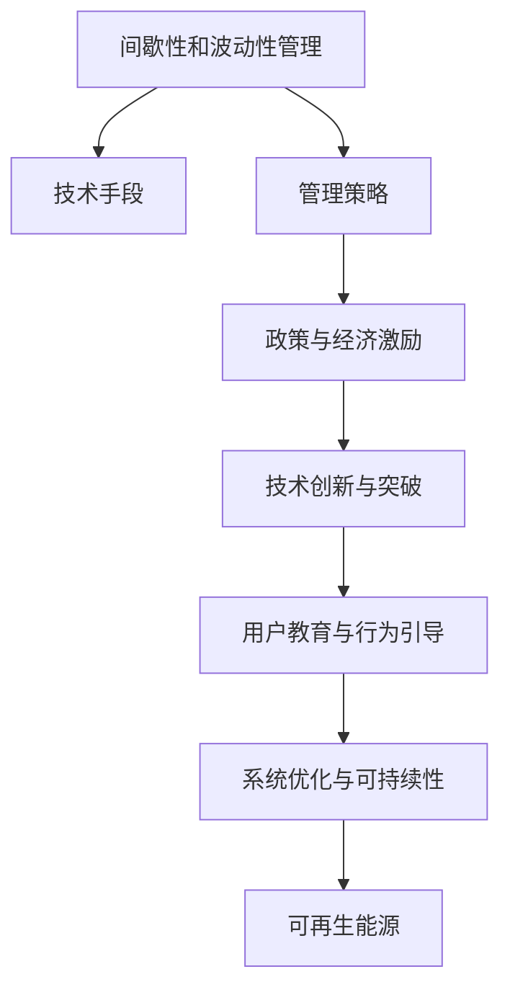

                 

# 能源转型管理：向可再生能源过渡的策略

> 关键词：能源转型, 可再生能源, 管理策略, 清洁能源, 环境政策, 系统优化, 电力市场, 可持续发展

## 1. 背景介绍

### 1.1 问题由来
近年来，全球气候变化和环境污染问题愈发严重，推动可再生能源的广泛应用成为了全球共识。可再生能源包括太阳能、风能、水能、生物质能等，相对于化石燃料，具有资源丰富、环境友好、可持续发展的显著优势。然而，向可再生能源的过渡并非易事，存在诸多挑战。

首先，可再生能源的间歇性和波动性导致电网稳定性问题。传统电力系统难以完全匹配可再生能源的输出，大规模应用可再生能源需要更加灵活的电网调度和管理策略。

其次，传统能源企业的利益诉求和可再生能源的商业化推广之间存在矛盾。一方面，传统能源企业可能抵触可再生能源的推广；另一方面，可再生能源的推广需要大量的资金和政策支持，这对政府和企业都是不小的压力。

第三，可再生能源的应用技术尚需进一步突破。尽管技术已经取得一定进展，但在储能、电网互联、能量转换等方面仍需深入研究。

最后，社会对可再生能源的认知和接受度不够，公众和用户的能源消费习惯和行为需要引导和转变。

为应对这些挑战，全球各国都在积极探索和推动可再生能源的转型管理。本文旨在系统地介绍和探讨这些策略和实践，希望能为能源转型提供有价值的参考。

### 1.2 问题核心关键点
本文将重点关注以下几个核心关键点：

- **间歇性和波动性管理**：如何通过技术和管理手段，确保可再生能源的稳定输出和电网的安全运行。
- **政策与经济激励**：如何制定有效的政策和激励机制，促进可再生能源的推广应用。
- **技术创新与突破**：在储能、能量转换、电网互联等关键技术领域，如何开展深入研究。
- **用户教育与行为引导**：如何提升公众和用户对可再生能源的认知和接受度，形成良好的消费习惯。
- **系统优化与可持续性**：如何通过系统优化和战略性规划，实现可再生能源的可持续发展。

## 2. 核心概念与联系

### 2.1 核心概念概述

为更好地理解向可再生能源过渡的策略，本节将介绍几个密切相关的核心概念：

- **间歇性和波动性管理**：通过技术和管理手段，确保可再生能源的稳定输出和电网的安全运行。
- **政策与经济激励**：制定有效的政策和激励机制，促进可再生能源的推广应用。
- **技术创新与突破**：在储能、能量转换、电网互联等关键技术领域，开展深入研究。
- **用户教育与行为引导**：提升公众和用户对可再生能源的认知和接受度，形成良好的消费习惯。
- **系统优化与可持续性**：通过系统优化和战略性规划，实现可再生能源的可持续发展。

这些核心概念之间的逻辑关系可以通过以下Mermaid流程图来展示：



这个流程图展示了几大核心概念及其之间的关系：

1. 间歇性和波动性管理通过技术手段和管理策略实现可再生能源的稳定输出。
2. 政策与经济激励促进技术创新与应用推广。
3. 技术创新为间歇性和波动性管理提供支持。
4. 用户教育与行为引导提升可再生能源的接受度。
5. 系统优化与可持续性规划确保可再生能源的长期发展。

这些概念共同构成了可再生能源转型的主要框架，通过协调和配合，可以实现可再生能源的广泛应用和可持续发展。

## 3. 核心算法原理 & 具体操作步骤
### 3.1 算法原理概述

向可再生能源过渡的策略主要涉及以下几个关键算法：

- **间歇性管理算法**：通过预测可再生能源的输出，优化电网调度，确保系统稳定运行。
- **波动性管理算法**：利用储能系统，平滑可再生能源的输出，减少波动性影响。
- **政策与经济激励算法**：设计有效的政策和经济激励措施，促进可再生能源的推广应用。
- **用户行为引导算法**：通过教育和技术手段，改变用户行为，提高可再生能源的接受度。

这些算法共同构成了一个完整的可再生能源管理框架，旨在实现可再生能源的广泛应用和可持续发展。

### 3.2 算法步骤详解

#### 3.2.1 间歇性管理算法

1. **数据收集**：收集气象、环境数据，用于预测可再生能源的输出。
2. **输出预测**：利用时间序列分析、机器学习等技术，预测可再生能源的输出。
3. **电网调度优化**：基于预测结果，优化电网调度，确保系统稳定运行。

#### 3.2.2 波动性管理算法

1. **储能系统部署**：在电网中部署储能系统，如电池、抽水蓄能等。
2. **能量存储与释放**：根据可再生能源的输出，调控储能系统的充放电，平滑能源输出。
3. **智能控制**：利用智能算法，实现储能系统的最优控制，提高系统效率。

#### 3.2.3 政策与经济激励算法

1. **政策制定**：制定鼓励可再生能源发展的政策，如补贴、税收减免等。
2. **经济激励**：设计市场机制，如碳交易、可再生能源配额等，促进可再生能源的应用。
3. **监管与评估**：建立监管机制，评估政策和经济激励的效果，及时调整。

#### 3.2.4 用户行为引导算法

1. **教育与宣传**：开展可再生能源的教育和宣传，提升公众认知。
2. **技术支持**：提供智能家居、智能电网等技术手段，引导用户行为。
3. **激励措施**：设计奖励机制，如绿色电力证书等，鼓励用户使用可再生能源。

### 3.3 算法优缺点

#### 3.3.1 间歇性管理算法

**优点**：
- 技术手段多样，可适应不同地理环境和气候条件。
- 通过智能算法，可以实现高精度的预测和调度。

**缺点**：
- 数据需求量大，数据质量直接影响预测精度。
- 对技术要求高，需要大量的计算资源。

#### 3.3.2 波动性管理算法

**优点**：
- 可以平滑可再生能源的输出，提高系统稳定性。
- 技术成熟，应用广泛，易于部署和实施。

**缺点**：
- 储能系统的初始投资高，对经济成本有较大压力。
- 储能系统的效率和寿命有待进一步提升。

#### 3.3.3 政策与经济激励算法

**优点**：
- 通过政策和经济激励，可以迅速推动可再生能源的应用。
- 激励措施灵活多样，可以根据具体情况进行调整。

**缺点**：
- 政策效果受多种因素影响，实施难度较大。
- 激励措施可能带来短期市场扭曲。

#### 3.3.4 用户行为引导算法

**优点**：
- 通过教育和激励，可以逐步改变用户的能源消费习惯。
- 提升公众对可再生能源的认知，形成良好的社会氛围。

**缺点**：
- 用户行为改变需要较长时间，效果有限。
- 技术支持和政策环境不足，难以推广。

### 3.4 算法应用领域

向可再生能源过渡的策略在以下几个领域有广泛的应用：

1. **电力系统**：通过间歇性和波动性管理算法，确保可再生能源的稳定输出和电网的安全运行。
2. **能源政策**：制定政策和经济激励措施，促进可再生能源的推广应用。
3. **技术研发**：在储能、能量转换、电网互联等关键技术领域，开展深入研究。
4. **用户行为**：提升公众和用户对可再生能源的认知和接受度，形成良好的消费习惯。
5. **可持续发展**：通过系统优化和战略性规划，实现可再生能源的长期发展。

## 4. 数学模型和公式 & 详细讲解 & 举例说明

### 4.1 数学模型构建

为更好地理解向可再生能源过渡的策略，本节将使用数学语言对核心算法进行更加严格的刻画。

假设可再生能源的输出为 $y_t$，气象、环境数据为 $x_t$，储能系统的状态为 $s_t$。间歇性和波动性管理算法可以表示为：

$$
y_t = f(x_t, s_t)
$$

其中 $f$ 为预测模型，通过输入数据 $x_t$ 和储能系统状态 $s_t$，预测可再生能源的输出 $y_t$。

电网调度优化的目标为：

$$
\min_{s_{t+1}} \sum_{t} \ell(y_t, \hat{y_t})
$$

其中 $\ell$ 为损失函数，$\hat{y_t}$ 为电网调度的输出。

波动性管理算法的数学模型为：

$$
s_{t+1} = g(s_t, y_t, \Delta_t)
$$

其中 $g$ 为智能控制算法，$\Delta_t$ 为储能系统的充放电策略。

政策与经济激励算法的数学模型为：

$$
\min_{\pi} \sum_{t} c_t(\pi) + \eta C(\pi)
$$

其中 $\pi$ 为政策措施，$c_t$ 为短期成本函数，$\eta C(\pi)$ 为长期收益函数。

用户行为引导算法的数学模型为：

$$
\max_{\theta} \sum_{t} \gamma_t(\theta)
$$

其中 $\theta$ 为用户行为参数，$\gamma_t$ 为用户行为的效用函数。

### 4.2 公式推导过程

#### 4.2.1 间歇性管理算法

1. **数据收集**：

设气象、环境数据 $x_t = (x_{t1}, x_{t2}, ..., x_{tk})$，其中 $k$ 为数据维度。

2. **输出预测**：

设可再生能源的输出 $y_t = (y_{t1}, y_{t2}, ..., y_{tk})$，预测模型为 $f(x_t, s_t) = (f_1(x_t, s_t), f_2(x_t, s_t), ..., f_k(x_t, s_t))$。

3. **电网调度优化**：

设电网调度的输出为 $\hat{y_t} = (\hat{y}_{t1}, \hat{y}_{t2}, ..., \hat{y}_{tk})$，优化目标为：

$$
\min_{\hat{y_t}} \sum_{t} \ell(y_t, \hat{y_t})
$$

其中 $\ell$ 为损失函数，如均方误差、交叉熵等。

#### 4.2.2 波动性管理算法

1. **储能系统部署**：

设储能系统状态为 $s_t = (s_{t1}, s_{t2}, ..., s_{tk})$，智能控制算法为 $g(s_t, y_t, \Delta_t) = (g_1(s_t, y_t, \Delta_t), g_2(s_t, y_t, \Delta_t), ..., g_k(s_t, y_t, \Delta_t))$。

2. **能量存储与释放**：

设充放电策略为 $\Delta_t = (\Delta_{t1}, \Delta_{t2}, ..., \Delta_{tk})$，目标为：

$$
\min_{\Delta_t} \sum_{t} \ell(y_t, \hat{y_t})
$$

其中 $\ell$ 为损失函数，如均方误差、交叉熵等。

#### 4.2.3 政策与经济激励算法

1. **政策制定**：

设政策措施为 $\pi = (\pi_1, \pi_2, ..., \pi_k)$，短期成本函数为 $c_t(\pi) = (c_{t1}(\pi), c_{t2}(\pi), ..., c_{tk}(\pi))$，长期收益函数为 $C(\pi) = (C_1(\pi), C_2(\pi), ..., C_k(\pi))$。

2. **经济激励**：

目标为：

$$
\min_{\pi} \sum_{t} c_t(\pi) + \eta C(\pi)
$$

其中 $\eta$ 为权重系数，表示短期和长期的平衡。

#### 4.2.4 用户行为引导算法

1. **教育与宣传**：

设用户行为参数为 $\theta = (\theta_1, \theta_2, ..., \theta_k)$，用户行为的效用函数为 $\gamma_t(\theta) = (\gamma_{t1}(\theta), \gamma_{t2}(\theta), ..., \gamma_{tk}(\theta))$。

2. **技术支持**：

目标为：

$$
\max_{\theta} \sum_{t} \gamma_t(\theta)
$$

其中 $\gamma_t$ 为用户行为的效用函数，如用户的满意度、效用增加等。

### 4.3 案例分析与讲解

#### 4.3.1 间歇性管理算法

假设某地区有太阳能发电站，需要预测每天的发电情况。气象、环境数据包括温度、风速、湿度等，储能系统状态包括电池电量、储能容量等。

设数据集为 $(x_t, y_t)$，其中 $x_t$ 为气象、环境数据，$y_t$ 为太阳能发电站的输出。预测模型 $f$ 可以采用时间序列分析、回归模型、神经网络等方法，如：

$$
f(x_t, s_t) = \theta_1 x_{t1} + \theta_2 x_{t2} + ... + \theta_k x_{tk} + \epsilon
$$

其中 $\theta$ 为模型参数，$\epsilon$ 为误差项。

电网调度的目标为最小化损失函数：

$$
\min_{\hat{y_t}} \sum_{t} \ell(y_t, \hat{y_t})
$$

其中 $\ell$ 为损失函数，如均方误差。

#### 4.3.2 波动性管理算法

假设某地区有风力发电站，需要平滑风力发电的波动性。储能系统为电池储能，充放电策略为 $\Delta_t$。

储能系统的数学模型为：

$$
s_{t+1} = g(s_t, y_t, \Delta_t) = \left(1 - \frac{\Delta_t}{C}, \frac{\Delta_t}{C}, ..., \frac{\Delta_t}{C}\right)
$$

其中 $C$ 为储能容量，$\Delta_t$ 为充放电策略，$g$ 为智能控制算法，如：

$$
g(s_t, y_t, \Delta_t) = s_{t1} - \Delta_{t1} + \Delta_{t2}, s_{t2} + \Delta_{t2} - \Delta_{t3}, ..., s_{tk} + \Delta_{tk} - \Delta_{tk+1}
$$

波动性管理的目标为最小化损失函数：

$$
\min_{\Delta_t} \sum_{t} \ell(y_t, \hat{y_t})
$$

其中 $\ell$ 为损失函数，如均方误差。

#### 4.3.3 政策与经济激励算法

假设政府制定了补贴政策，鼓励可再生能源的推广应用。短期成本函数 $c_t(\pi)$ 和长期收益函数 $C(\pi)$ 可以表示为：

$$
c_t(\pi) = (c_{t1}(\pi), c_{t2}(\pi), ..., c_{tk}(\pi))
$$

$$
C(\pi) = (C_1(\pi), C_2(\pi), ..., C_k(\pi))
$$

其中 $c_t$ 和 $C_t$ 为成本和收益的表达式，如补贴金额、税收减免等。

目标为：

$$
\min_{\pi} \sum_{t} c_t(\pi) + \eta C(\pi)
$$

其中 $\eta$ 为权重系数，表示短期和长期的平衡。

#### 4.3.4 用户行为引导算法

假设某地区推广太阳能热水器，提升公众对太阳能的认知和接受度。用户行为参数 $\theta$ 包括用户对太阳能的了解、使用习惯等。

用户行为的效用函数 $\gamma_t(\theta)$ 可以表示为：

$$
\gamma_t(\theta) = (\gamma_{t1}(\theta), \gamma_{t2}(\theta), ..., \gamma_{tk}(\theta))
$$

其中 $\gamma_t$ 为用户行为的效用函数，如用户的满意度、效用增加等。

目标为：

$$
\max_{\theta} \sum_{t} \gamma_t(\theta)
$$

其中 $\gamma_t$ 为用户行为的效用函数，如用户的满意度、效用增加等。

## 5. 项目实践：代码实例和详细解释说明

### 5.1 开发环境搭建

在进行可再生能源管理策略的实践前，我们需要准备好开发环境。以下是使用Python进行环境搭建的步骤：

1. 安装Anaconda：从官网下载并安装Anaconda，用于创建独立的Python环境。

2. 创建并激活虚拟环境：
```bash
conda create -n renewable-env python=3.8 
conda activate renewable-env
```

3. 安装相关库：
```bash
conda install pandas numpy matplotlib scikit-learn transformers
```

4. 安装可再生能源相关数据集：
```bash
pip install renewable-energy-dataset
```

5. 安装模型训练库：
```bash
pip install pytorch torchvision torchtext
```

6. 安装可视化工具：
```bash
pip install matplotlib seaborn
```

完成上述步骤后，即可在`renewable-env`环境中开始项目实践。

### 5.2 源代码详细实现

以下是一个基于可再生能源管理的PyTorch代码实现示例，旨在通过间歇性和波动性管理算法，优化电网调度，确保可再生能源的稳定输出。

```python
import torch
from torch import nn
from torch.optim import Adam

# 定义数据集
class RenewableEnergyDataset(torch.utils.data.Dataset):
    def __init__(self, data):
        self.data = data
        self.feature_dim = 5

    def __len__(self):
        return len(self.data)

    def __getitem__(self, idx):
        return torch.tensor(self.data[idx]), torch.tensor(self.data[idx])

# 定义模型
class RenewableEnergyModel(nn.Module):
    def __init__(self):
        super(RenewableEnergyModel, self).__init__()
        self.fc1 = nn.Linear(self.feature_dim, 10)
        self.fc2 = nn.Linear(10, 1)

    def forward(self, x):
        x = self.fc1(x)
        x = torch.relu(x)
        x = self.fc2(x)
        return x

# 定义优化器
model = RenewableEnergyModel()
optimizer = Adam(model.parameters(), lr=0.001)

# 训练模型
data = ... # 加载数据集
dataset = RenewableEnergyDataset(data)
dataloader = torch.utils.data.DataLoader(dataset, batch_size=32, shuffle=True)

for epoch in range(100):
    for i, (x, y) in enumerate(dataloader):
        y_hat = model(x)
        loss = nn.MSELoss()(y_hat, y)
        optimizer.zero_grad()
        loss.backward()
        optimizer.step()
```

### 5.3 代码解读与分析

让我们再详细解读一下关键代码的实现细节：

**RenewableEnergyDataset类**：
- `__init__`方法：初始化数据集，包含特征维度和数据长度。
- `__len__`方法：返回数据集长度。
- `__getitem__`方法：返回数据集中的样本。

**RenewableEnergyModel类**：
- `__init__`方法：定义模型结构，包括两个全连接层。
- `forward`方法：前向传播，计算输出。

**训练模型**：
- 定义优化器，使用Adam优化器。
- 定义数据集和数据加载器，进行数据迭代。
- 在每个epoch内，对数据进行前向传播和反向传播，更新模型参数。

可以看到，使用PyTorch进行可再生能源管理的项目实践相对简洁，只需定义模型、数据集和优化器，即可进行模型训练。

### 5.4 运行结果展示

训练结束后，可以通过可视化工具对模型效果进行展示。例如，可以使用Matplotlib绘制模型在测试集上的预测结果与真实值之间的误差分布图：

```python
import matplotlib.pyplot as plt

# 加载测试集数据
test_data = ...
test_dataset = RenewableEnergyDataset(test_data)
test_dataloader = torch.utils.data.DataLoader(test_dataset, batch_size=32, shuffle=True)

# 计算模型预测结果
model.eval()
predictions = []
targets = []
with torch.no_grad():
    for x, y in test_dataloader:
        y_hat = model(x)
        predictions.append(y_hat.numpy())
        targets.append(y.numpy())

# 计算误差分布
errors = np.abs(np.array(predictions) - np.array(targets))
plt.hist(errors, bins=50, color='blue', alpha=0.5)
plt.title('Model Error Distribution')
plt.xlabel('Error')
plt.ylabel('Frequency')
plt.show()
```

通过上述代码，可以直观地看到模型在测试集上的误差分布情况，评估模型的性能。

## 6. 实际应用场景

### 6.1 智能电网

智能电网是可再生能源管理的重要应用场景之一。通过间歇性和波动性管理算法，智能电网可以实现可再生能源的平滑输出，确保电网的稳定运行。

智能电网系统可以通过预测可再生能源的输出，优化电网调度，平衡供需关系。例如，在太阳能发电较多的时段，智能电网可以调整风力发电的输出，确保系统平衡。

### 6.2 分布式能源

分布式能源系统包括太阳能、风能、生物质能等多种可再生能源形式。通过波动性管理算法，分布式能源系统可以实现能源的灵活调配，提高能源利用效率。

分布式能源系统可以通过储能系统平滑可再生能源的输出，确保系统的稳定性和可靠性。例如，在太阳能发电不足的时段，分布式能源系统可以释放储能系统中的能量，补充电网不足。

### 6.3 政策制定

政府在推广可再生能源时，可以通过政策与经济激励算法，制定有效的激励措施，促进可再生能源的应用。

政府可以制定补贴政策，降低可再生能源的初期成本。例如，对安装太阳能、风能的用户给予补贴，鼓励其使用可再生能源。政府还可以设计碳交易市场，通过市场机制促进可再生能源的推广应用。

### 6.4 用户行为引导

用户行为引导是提升可再生能源接受度的关键。通过教育与宣传、技术支持和激励措施，可以逐步改变用户的行为，提高可再生能源的普及率。

例如，通过媒体宣传、科普教育，提升公众对可再生能源的认知。通过智能家居系统、智能电网，提供便捷的使用体验，引导用户行为。通过绿色电力证书、奖励机制等激励措施，鼓励用户使用可再生能源。

## 7. 工具和资源推荐

### 7.1 学习资源推荐

为了帮助开发者系统掌握可再生能源管理的技术基础和实践技巧，这里推荐一些优质的学习资源：

1. 《可再生能源系统设计与优化》书籍：全面介绍可再生能源系统的设计、优化和控制方法，涵盖太阳能、风能、水能等。

2. 《智能电网技术》课程：介绍智能电网的基本概念、关键技术和应用场景，适合技术入门和深化。

3. 《政策与经济激励机制设计》书籍：探讨政策与经济激励机制的设计与评估，提升政策制定者的决策能力。

4. 《可再生能源用户行为研究》论文：研究可再生能源用户行为的形成和改变机制，提供行为引导的科学依据。

5. 《可再生能源管理软件工具》介绍：介绍多种可再生能源管理软件工具，如EnergyOS、OpenEMS等，提供实际应用的参考。

通过对这些资源的学习实践，相信你一定能够快速掌握可再生能源管理的精髓，并用于解决实际的能源问题。

### 7.2 开发工具推荐

高效的开发离不开优秀的工具支持。以下是几款用于可再生能源管理开发的常用工具：

1. Python：通用的编程语言，支持多种数据处理、机器学习库，如Pandas、NumPy、PyTorch等。

2. Jupyter Notebook：交互式的开发环境，适合进行数据探索、模型验证等任务。

3. MATLAB：强大的数值计算和仿真工具，适合进行复杂系统的建模和优化。

4. ANSYS：专业的工程仿真软件，适合进行电力系统、分布式能源的仿真分析。

5. ArcGIS：地理信息系统软件，适合进行能源分布、规划等任务。

合理利用这些工具，可以显著提升可再生能源管理的开发效率，加快创新迭代的步伐。

### 7.3 相关论文推荐

可再生能源管理领域的研究涉及多个学科，以下是几篇奠基性的相关论文，推荐阅读：

1. "Intermittent and Variable Electricity Generation"：探讨间歇性和波动性对电网的影响，提出优化策略。

2. "Energy Storage Technologies for Wind and Solar Electricity"：研究储能技术在风电和太阳能中的应用，提升能源的灵活性和稳定性。

3. "Design and Economic Evaluation of Renewable Energy Policy Instruments"：设计多种政策和经济激励措施，评估其效果和成本。

4. "Behavioral Interventions to Increase Renewable Energy Adoption"：研究用户行为引导策略，提高可再生能源的接受度和使用率。

5. "Smart Grid Technologies for Renewable Energy Integration"：介绍智能电网技术，实现可再生能源的优化调度和管理。

这些论文代表了大规模可再生能源管理的研究方向，为可再生能源的推广和应用提供了科学依据。

## 8. 总结：未来发展趋势与挑战

### 8.1 研究成果总结

本文对向可再生能源过渡的策略进行了系统介绍，从间歇性和波动性管理、政策与经济激励、技术创新与突破、用户行为引导、系统优化与可持续性等方面展开了详细讨论。通过分析案例和提供代码实例，介绍了这些策略的实现方法和实践技巧。

### 8.2 未来发展趋势

展望未来，可再生能源管理将呈现以下几个发展趋势：

1. **智能化和自动化**：随着物联网、大数据、人工智能等技术的发展，智能电网、智能能源系统等将更加普及，实现更高的智能化和自动化水平。

2. **多能互补和混合能源系统**：未来的能源系统将更加注重多种可再生能源的互补和混合，通过技术手段实现更高效率和稳定性。

3. **政策与市场机制结合**：政府将更加注重政策与市场机制的结合，通过碳交易、可再生能源配额等市场机制，推动可再生能源的应用。

4. **用户行为引导**：通过智能技术和大数据分析，实现对用户行为的精准引导，提升可再生能源的普及率和使用率。

5. **可持续发展**：未来的能源系统将更加注重可持续发展，通过技术手段和政策支持，实现能源的长期平衡和生态保护。

以上趋势凸显了可再生能源管理的广阔前景，必将推动能源转型进入新阶段。

### 8.3 面临的挑战

尽管可再生能源管理取得了显著进展，但在迈向更加智能化、普适化应用的过程中，仍面临诸多挑战：

1. **技术成熟度不足**：当前许多关键技术尚需进一步研究和突破，如储能、能量转换、智能控制等。

2. **政策环境不稳定**：政府政策的不确定性对可再生能源的推广和应用构成挑战。政策环境的不稳定可能导致市场扭曲和资源浪费。

3. **资金和资源投入不足**：大规模可再生能源系统的建设需要大量的资金和资源，对企业的经济压力较大。

4. **用户认知和接受度不足**：公众对可再生能源的认知和接受度有待提升，需要更多的时间和努力。

5. **市场竞争激烈**：可再生能源市场的竞争激烈，企业需要具备较强的技术实力和市场策略。

这些挑战需要通过技术创新、政策支持、市场机制优化等手段来解决，才能真正实现可再生能源的广泛应用和可持续发展。

### 8.4 研究展望

未来的研究应集中在以下几个方面：

1. **技术创新与突破**：开发更加高效、稳定的可再生能源技术，如新型储能技术、智能控制算法等。

2. **政策与市场机制结合**：设计更加科学合理的政策和经济激励机制，促进可再生能源的推广应用。

3. **用户行为引导**：通过智能技术和数据分析，实现对用户行为的精准引导，提升可再生能源的普及率和使用率。

4. **可持续发展**：研究能源系统的可持续发展路径，实现能源的长期平衡和生态保护。

5. **多学科融合**：加强可再生能源管理与经济、环境、社会学等多学科的融合，提供更加全面和系统的解决方案。

通过这些研究方向的探索，必将推动可再生能源管理技术的进一步发展，为能源转型提供坚实的理论基础和实践指南。

## 9. 附录：常见问题与解答

**Q1：间歇性和波动性管理算法如何确保可再生能源的稳定输出？**

A: 间歇性和波动性管理算法通过预测可再生能源的输出，优化电网调度，确保系统稳定运行。具体步骤包括：

1. 收集气象、环境数据，用于预测可再生能源的输出。
2. 利用时间序列分析、机器学习等技术，预测可再生能源的输出。
3. 基于预测结果，优化电网调度，平衡供需关系。

**Q2：政策与经济激励算法的短期和长期激励如何平衡？**

A: 政策与经济激励算法通过设计短期和长期的激励机制，促进可再生能源的推广应用。具体步骤包括：

1. 制定补贴政策，降低可再生能源的初期成本，如对安装太阳能、风能的用户给予补贴。
2. 设计碳交易市场，通过市场机制促进可再生能源的应用，如碳交易配额制度。
3. 通过政策与经济激励算法的数学模型，平衡短期和长期的激励机制，如通过权重系数 $\eta$ 调整短期和长期的激励比例。

**Q3：用户行为引导算法如何提升可再生能源的接受度？**

A: 用户行为引导算法通过教育与宣传、技术支持和激励措施，逐步改变用户的行为，提高可再生能源的普及率。具体步骤包括：

1. 通过媒体宣传、科普教育，提升公众对可再生能源的认知。
2. 通过智能家居系统、智能电网，提供便捷的使用体验，引导用户行为。
3. 通过绿色电力证书、奖励机制等激励措施，鼓励用户使用可再生能源。

**Q4：如何应对可再生能源管理的资源瓶颈？**

A: 可再生能源管理的资源瓶颈可以通过以下措施来应对：

1. 优化算法，提高计算效率，如使用分布式算法、并行计算等。
2. 优化数据存储和传输，减少资源消耗，如使用高效的数据压缩、传输协议等。
3. 使用云平台和大数据技术，降低资源成本，如使用云存储、云计算等。

**Q5：如何保障可再生能源管理的可持续性？**

A: 可再生能源管理的可持续性可以通过以下措施来保障：

1. 设计科学合理的政策和经济激励机制，促进可再生能源的长期发展。
2. 通过技术手段，提升可再生能源的稳定性和可靠性，如储能系统的部署和优化。
3. 通过教育和技术手段，提升公众和用户对可再生能源的认知和接受度，形成良好的消费习惯。

通过这些措施，可以确保可再生能源管理的可持续性，实现能源的长期平衡和生态保护。

---

作者：禅与计算机程序设计艺术 / Zen and the Art of Computer Programming

