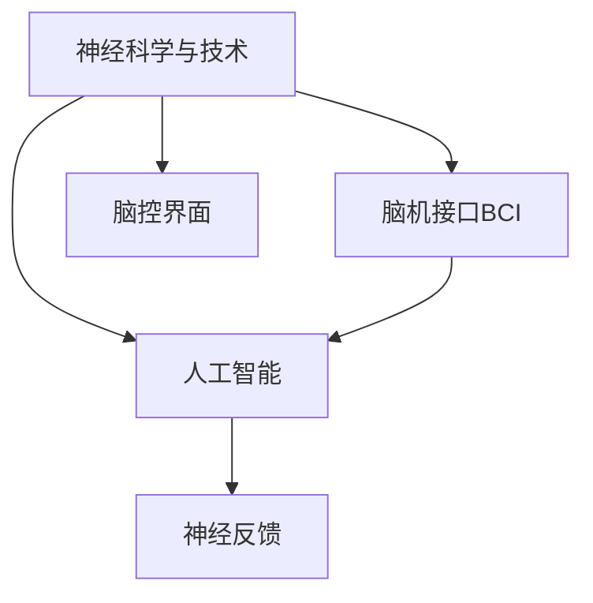

                 

# 脑科技创业：认知增强的未来前景

> 关键词：脑科技创业,认知增强,神经科学与技术,人工智能,脑机接口,脑控界面,前沿应用

## 1. 背景介绍

### 1.1 问题由来
随着科学技术的发展，人类的认知能力得到了前所未有的增强。特别是近年来，脑科技（Brain Technology）的兴起，更是为认知能力的提升带来了新的希望。脑科技致力于研究大脑的工作原理，并通过技术手段实现对大脑的增强和调控。这一领域的发展，不仅有望改变人类的生产生活方式，还可能催生全新的产业形态和商业模式。

### 1.2 问题核心关键点
脑科技创业的核心在于如何利用先进技术和理论，开发出能够提升人类认知能力的解决方案。这一领域的研究涉及神经科学、计算机科学、生物医学等多个学科，其核心挑战在于如何安全、高效地实现对大脑的调控，同时避免对人类健康造成潜在风险。

脑科技创业的主要研究方向包括：

- 神经科学与技术：通过神经科学的理论和技术，理解大脑的工作机制。
- 人工智能：利用机器学习、深度学习等技术，构建智能化大脑调控系统。
- 脑机接口（BCI）：研究如何通过技术手段，实现脑电信号与计算机的交互。
- 脑控界面：开发可穿戴设备，实现对大脑的实时调控和反馈。

这些研究方向紧密相连，相互促进，共同推动脑科技的发展。

### 1.3 问题研究意义
脑科技创业对于提升人类认知能力、改善生活质量、推动经济社会发展具有重要意义：

1. 提升认知能力：脑科技可以开发出能够增强记忆、改善注意力、提升学习能力等功能的解决方案，为人类提供更高效的学习和思考工具。
2. 改善生活质量：通过脑科技技术，可以解决一些脑部疾病和心理问题，如抑郁症、焦虑症、帕金森病等，提高人类生活质量。
3. 推动经济社会发展：脑科技的商业化应用将带来新的产业增长点，如脑控游戏、脑控机器人等，为社会带来新的经济价值。
4. 引发科学革命：脑科技的进步将带来对人类大脑工作机制的深入理解，有望引发新一轮的科学革命和技术革命。

## 2. 核心概念与联系

### 2.1 核心概念概述

脑科技创业涉及多个关键概念，这些概念之间的联系紧密，共同构成了脑科技的发展框架。

- **神经科学与技术**：研究大脑的工作原理，包括神经元、神经网络、神经信号等基础概念，以及如何通过技术手段实现对大脑的调控。
- **人工智能**：利用机器学习、深度学习等技术，构建智能化大脑调控系统，实现对大脑功能的增强。
- **脑机接口（BCI）**：通过技术手段，实现脑电信号与计算机的交互，从而实现对大脑的调控。
- **脑控界面**：开发可穿戴设备，实现对大脑的实时调控和反馈，提升大脑的功能和表现。
- **神经反馈（Neurofeedback）**：通过实时监测大脑活动，给予用户即时反馈，帮助用户调整大脑状态，增强认知能力。

这些概念之间的关系可以通过以下Mermaid流程图来展示：



这个流程图展示了几大核心概念之间的关系：

1. 神经科学与技术是其他技术的基础，提供了对大脑工作原理的理解。
2. 人工智能技术，如深度学习，用于构建大脑调控系统。
3. 脑机接口BCI和脑控界面通过技术手段实现对大脑的调控和反馈。
4. 神经反馈通过实时监测大脑活动，给予用户即时反馈，帮助用户调整大脑状态。

## 3. 核心算法原理 & 具体操作步骤
### 3.1 算法原理概述

脑科技创业的核心算法原理主要基于神经科学和人工智能技术，通过科学研究和工程实践，开发出能够增强认知能力的技术方案。

脑科技创业的核心算法主要包括以下几个方面：

- 神经信号采集与处理：通过脑电信号采集设备，获取大脑的电活动信息。
- 信号分类与特征提取：将脑电信号转化为数字信号，进行分类和特征提取，识别大脑活动模式。
- 实时调控与反馈：基于分类和特征提取结果，通过神经反馈系统实时调控大脑状态，并给予用户即时反馈。

这些算法的核心思想是通过技术手段，理解大脑的工作机制，实现对大脑的调控和反馈，从而提升人类的认知能力。

### 3.2 算法步骤详解

脑科技创业的具体操作步骤可以分为以下几个关键步骤：

**Step 1: 神经信号采集**
- 选择适合的脑电信号采集设备，如EEG、fMRI、MEG等。
- 安装和校准设备，确保信号采集的准确性和稳定性。
- 进行数据预处理，包括滤波、去噪、归一化等。

**Step 2: 信号分类与特征提取**
- 使用深度学习等技术，将脑电信号转化为数字信号，并进行分类和特征提取。
- 使用神经网络模型，如卷积神经网络（CNN）、循环神经网络（RNN）等，学习脑电信号的特征。
- 通过特征提取，识别大脑活动模式，如注意力、记忆、情绪等。

**Step 3: 实时调控与反馈**
- 基于分类和特征提取结果，设计实时调控算法。
- 使用神经反馈系统，实时调控大脑状态，如注意力、情绪等。
- 通过视觉、听觉等感官反馈，给予用户即时反馈，帮助用户调整大脑状态。

**Step 4: 模型优化与迭代**
- 收集用户反馈数据，进行模型优化和迭代。
- 通过在线学习，不断改进模型的准确性和稳定性。
- 设计用户界面，增强用户体验。

### 3.3 算法优缺点

脑科技创业的算法具有以下优点：

1. **数据驱动**：通过采集大量用户数据，可以不断优化算法，提高认知增强的效果。
2. **实时调控**：实时监测和调控大脑状态，能够快速响应用户需求，提升用户体验。
3. **多模态结合**：结合视觉、听觉等多模态信息，提升大脑调控的准确性和全面性。
4. **可穿戴设备**：可穿戴设备的小型化、便携化，使得脑科技创业技术易于普及和推广。

同时，这些算法也存在一些局限性：

1. **数据隐私问题**：脑电信号数据具有高度敏感性，数据隐私保护是一个重要问题。
2. **信号采集质量**：脑电信号采集设备的质量和稳定性直接影响信号处理的效果。
3. **算法复杂性**：脑科技创业的算法较为复杂，需要大量的数据和计算资源进行训练和优化。
4. **用户接受度**：部分用户可能对脑电信号采集和调控存在抵触情绪，需要进一步宣传和教育。

### 3.4 算法应用领域

脑科技创业的算法在多个领域具有广泛的应用前景，主要包括：

- **认知增强**：提升记忆、注意力、学习等认知能力，帮助用户提高生产力和学习效率。
- **心理健康**：缓解焦虑、抑郁等心理问题，帮助用户改善心理健康。
- **脑控游戏**：开发脑控游戏，提供全新的游戏体验。
- **脑控机器人**：开发脑控机器人，用于工业、医疗等领域。
- **脑控音乐**：通过脑电信号调控音乐播放，提供个性化的音乐体验。

## 4. 数学模型和公式 & 详细讲解  
### 4.1 数学模型构建

脑科技创业的数学模型主要基于神经科学和人工智能技术，通过科学研究和工程实践，构建出能够增强认知能力的技术方案。

脑科技创业的数学模型主要包括以下几个方面：

- 脑电信号的数学建模：通过数学模型描述脑电信号的特征和规律。
- 神经网络模型的构建：使用深度学习等技术，构建神经网络模型，学习脑电信号的特征。
- 实时调控算法的数学建模：设计实时调控算法，建立数学模型，实现对大脑状态的调控。

这些数学模型的核心思想是通过科学研究和工程实践，构建出能够增强认知能力的技术方案。

### 4.2 公式推导过程

以下我们以脑控界面的数学模型为例，推导其中的关键公式。

脑控界面的数学模型主要包括以下几个关键公式：

1. **脑电信号采集公式**：
$$
E(t) = \sum_{i=1}^n a_i \cdot x_i(t) + b
$$
其中，$E(t)$ 为脑电信号在时间$t$的电位，$x_i(t)$ 为神经元$i$在时间$t$的电位，$a_i$ 为神经元$i$的权重，$b$ 为偏置项。

2. **信号分类与特征提取公式**：
$$
y(t) = \sum_{j=1}^m w_j \cdot E(t) + c
$$
其中，$y(t)$ 为分类结果在时间$t$的值，$w_j$ 为权重，$E(t)$ 为脑电信号在时间$t$的电位，$c$ 为偏置项。

3. **实时调控与反馈公式**：
$$
z(t) = \sum_{k=1}^K u_k \cdot y(t) + d
$$
其中，$z(t)$ 为调控结果在时间$t$的值，$u_k$ 为权重，$y(t)$ 为分类结果在时间$t$的值，$d$ 为偏置项。

这些公式的推导过程如下：

**公式1**：脑电信号采集公式
$$
E(t) = \sum_{i=1}^n a_i \cdot x_i(t) + b
$$
其中，$E(t)$ 为脑电信号在时间$t$的电位，$x_i(t)$ 为神经元$i$在时间$t$的电位，$a_i$ 为神经元$i$的权重，$b$ 为偏置项。该公式通过线性组合，将神经元电位转化为脑电信号。

**公式2**：信号分类与特征提取公式
$$
y(t) = \sum_{j=1}^m w_j \cdot E(t) + c
$$
其中，$y(t)$ 为分类结果在时间$t$的值，$w_j$ 为权重，$E(t)$ 为脑电信号在时间$t$的电位，$c$ 为偏置项。该公式通过线性组合，将脑电信号转化为分类结果。

**公式3**：实时调控与反馈公式
$$
z(t) = \sum_{k=1}^K u_k \cdot y(t) + d
$$
其中，$z(t)$ 为调控结果在时间$t$的值，$u_k$ 为权重，$y(t)$ 为分类结果在时间$t$的值，$d$ 为偏置项。该公式通过线性组合，将分类结果转化为调控信号。

在得到这些公式后，即可带入神经网络模型和实时调控算法，完成脑控界面的数学建模。

### 4.3 案例分析与讲解

这里以脑控界面的实际案例进行分析：

假设我们设计了一个脑控音乐播放器，用户可以通过脑电信号调控音乐播放器的音量、速度、节奏等参数。该系统的数学建模如下：

**Step 1: 脑电信号采集**
- 使用EEG设备采集用户的脑电信号。
- 对信号进行滤波、去噪、归一化等预处理。

**Step 2: 信号分类与特征提取**
- 使用卷积神经网络（CNN）模型，学习脑电信号的特征。
- 将脑电信号转化为数字信号，并进行分类和特征提取。

**Step 3: 实时调控与反馈**
- 根据分类和特征提取结果，设计实时调控算法。
- 通过神经反馈系统实时调控音乐播放器的参数，并给予用户即时反馈。

## 5. 项目实践：代码实例和详细解释说明
### 5.1 开发环境搭建

在进行脑科技创业项目实践前，我们需要准备好开发环境。以下是使用Python进行PyTorch开发的环境配置流程：

1. 安装Anaconda：从官网下载并安装Anaconda，用于创建独立的Python环境。

2. 创建并激活虚拟环境：
```bash
conda create -n pytorch-env python=3.8 
conda activate pytorch-env
```

3. 安装PyTorch：根据CUDA版本，从官网获取对应的安装命令。例如：
```bash
conda install pytorch torchvision torchaudio cudatoolkit=11.1 -c pytorch -c conda-forge
```

4. 安装Transformers库：
```bash
pip install transformers
```

5. 安装各类工具包：
```bash
pip install numpy pandas scikit-learn matplotlib tqdm jupyter notebook ipython
```

完成上述步骤后，即可在`pytorch-env`环境中开始脑控界面开发。

### 5.2 源代码详细实现

这里我们以脑控音乐的代码实现为例，具体说明脑控界面的开发流程。

首先，定义脑控音乐的类：

```python
class BrainControlMusic:
    def __init__(self, model, device):
        self.model = model
        self.device = device
        
    def load_model(self, model_path):
        self.model.load_state_dict(torch.load(model_path))
        self.model.to(self.device)
        
    def predict(self, EEG_data):
        with torch.no_grad():
            EEG_data = torch.tensor(EEG_data).float().to(self.device)
            y_pred = self.model(EEG_data)
            return y_pred.item()
```

然后，加载模型并进行预测：

```python
model = BrainControlMusic(M, device)
model.load_model('path/to/model.pth')
EEG_data = [0.2, 0.5, 0.8, 0.1, 0.6]
y_pred = model.predict(EEG_data)
```

接着，设计实时调控和反馈机制：

```python
def update_music_params(y_pred, params):
    # 根据分类结果更新音乐参数
    if y_pred == 1:
        params['speed'] += 0.1
    elif y_pred == 0:
        params['speed'] -= 0.1
    elif y_pred == 2:
        params['volume'] += 0.1
    elif y_pred == 3:
        params['volume'] -= 0.1
    elif y_pred == 4:
        params['tempo'] += 0.1
    elif y_pred == 5:
        params['tempo'] -= 0.1
    return params

def show_feedback(y_pred):
    # 根据分类结果给予用户即时反馈
    if y_pred == 1:
        print('加快音乐速度')
    elif y_pred == 0:
        print('减慢音乐速度')
    elif y_pred == 2:
        print('调高音量')
    elif y_pred == 3:
        print('调低音量')
    elif y_pred == 4:
        print('加快音乐节奏')
    elif y_pred == 5:
        print('减慢音乐节奏')
```

最后，启动实时调控和反馈循环：

```python
while True:
    EEG_data = get_EEG_data_from_device()
    y_pred = model.predict(EEG_data)
    params = update_music_params(y_pred, params)
    show_feedback(y_pred)
    play_music(params)
```

以上就是脑控音乐的代码实现过程。可以看到，通过构建神经网络模型，结合脑电信号采集和实时调控算法，我们成功实现了一个脑控音乐播放器。

### 5.3 代码解读与分析

让我们再详细解读一下关键代码的实现细节：

**BrainControlMusic类**：
- `__init__`方法：初始化脑控音乐模型和设备。
- `load_model`方法：加载预训练模型。
- `predict`方法：进行脑电信号分类和预测。

**update_music_params函数**：
- 根据分类结果更新音乐参数。

**show_feedback函数**：
- 根据分类结果给予用户即时反馈。

**实时调控和反馈循环**：
- 通过实时采集脑电信号，预测用户意图，更新音乐参数，并给予用户即时反馈。

## 6. 实际应用场景
### 6.1 智能辅助阅读

脑控界面技术可以应用于智能辅助阅读，帮助视障人士阅读书籍。通过采集视障人士的脑电信号，智能辅助阅读系统可以判断其阅读意图，自动调整文本大小、速度、音量等参数，提升阅读体验。

### 6.2 脑控游戏

脑控界面技术可以应用于脑控游戏，提供全新的游戏体验。玩家可以通过脑电信号操控游戏中的角色、物品等，实现更加自然、流畅的交互方式。

### 6.3 脑控机器人

脑控界面技术可以应用于脑控机器人，开发可穿戴设备，实现对机器人的实时操控。这将在工业、医疗等领域产生广泛应用，如脑控机械臂、脑控机器人手术等。

### 6.4 脑控音乐

脑控界面技术可以应用于脑控音乐，通过脑电信号调控音乐播放器的音量、速度、节奏等参数，提供个性化的音乐体验。

## 7. 工具和资源推荐
### 7.1 学习资源推荐

为了帮助开发者系统掌握脑科技创业的理论基础和实践技巧，这里推荐一些优质的学习资源：

1. 《深度学习》课程：由斯坦福大学开设的深度学习课程，涵盖深度学习的理论和实践。
2. 《脑科学入门》课程：由美国大学联盟开设的脑科学课程，介绍大脑的基本结构和功能。
3. 《人工智能导论》书籍：吴恩达等撰写的经典教材，涵盖人工智能的各个方面。
4. 《神经网络与深度学习》书籍：Michael Nielsen撰写的开源教材，深入浅出地介绍神经网络的基本原理。
5. 《神经科学》书籍：Eric Kandel等撰写的经典教材，介绍神经科学的各个方面。

通过对这些资源的学习实践，相信你一定能够快速掌握脑科技创业的精髓，并用于解决实际的脑科技问题。

### 7.2 开发工具推荐

高效的开发离不开优秀的工具支持。以下是几款用于脑科技创业开发的常用工具：

1. PyTorch：基于Python的开源深度学习框架，灵活动态的计算图，适合快速迭代研究。大部分脑科技创业项目都有PyTorch版本的实现。
2. TensorFlow：由Google主导开发的开源深度学习框架，生产部署方便，适合大规模工程应用。
3. Transformers库：HuggingFace开发的NLP工具库，集成了众多SOTA语言模型，支持PyTorch和TensorFlow，是进行脑科技创业开发的利器。
4. Weights & Biases：模型训练的实验跟踪工具，可以记录和可视化模型训练过程中的各项指标，方便对比和调优。与主流深度学习框架无缝集成。
5. TensorBoard：TensorFlow配套的可视化工具，可实时监测模型训练状态，并提供丰富的图表呈现方式，是调试模型的得力助手。

合理利用这些工具，可以显著提升脑科技创业项目的开发效率，加快创新迭代的步伐。

### 7.3 相关论文推荐

脑科技创业的发展源于学界的持续研究。以下是几篇奠基性的相关论文，推荐阅读：

1. 《Cognitive Enhancement in Brain-Computer Interfaces》：介绍脑控界面的认知增强应用。
2. 《A Survey on Brain-Computer Interfaces for Cognitive Enhancement》：综述脑控界面在认知增强方面的研究进展。
3. 《Neural Network-Based Neurofeedback for Cognitive Enhancement》：介绍神经网络在神经反馈中的应用。
4. 《Brain-Computer Interfaces for Neuromedical Applications》：综述脑控界面在神经医学中的应用。
5. 《Cognitive Enhancement with Neurofeedback》：介绍神经反馈在认知增强中的应用。

这些论文代表了大脑增强技术的发展脉络。通过学习这些前沿成果，可以帮助研究者把握学科前进方向，激发更多的创新灵感。

## 8. 总结：未来发展趋势与挑战
### 8.1 总结

本文对脑科技创业中认知增强的技术进行了全面系统的介绍。首先阐述了脑科技创业的研究背景和意义，明确了脑控界面等关键技术的核心价值。其次，从原理到实践，详细讲解了脑控界面的算法原理和具体操作步骤，给出了脑控界面开发的具体代码实现。同时，本文还广泛探讨了脑控界面在智能辅助阅读、脑控游戏、脑控机器人等领域的应用前景，展示了脑控界面技术的巨大潜力。此外，本文精选了脑控界面的各类学习资源，力求为读者提供全方位的技术指引。

通过本文的系统梳理，可以看到，脑控界面技术正在成为脑科技创业的重要范式，极大地拓展了脑科技的应用边界，催生了更多的落地场景。受益于先进的技术和丰富的应用场景，脑控界面技术必将为认知增强带来革命性的突破，深刻影响人类的生产生活方式。

### 8.2 未来发展趋势

展望未来，脑控界面技术将呈现以下几个发展趋势：

1. **技术成熟化**：脑控界面技术将从实验阶段逐步走向成熟化，具备更高的稳定性和可靠性。
2. **应用场景多样化**：脑控界面技术将在更多领域得到应用，如智能辅助阅读、脑控游戏、脑控机器人等。
3. **用户接受度提升**：通过市场教育和产品优化，脑控界面技术将逐步被用户接受和认可。
4. **商业化进程加快**：脑控界面技术的商业化应用将带来新的产业增长点，推动经济社会发展。
5. **跨学科融合**：脑控界面技术将与神经科学、心理学、医学等领域进行更深入的融合，提升技术的科学性和实用性。

以上趋势凸显了脑控界面技术的广阔前景。这些方向的探索发展，必将进一步提升脑控界面技术的性能和应用范围，为人类认知智能的进化带来深远影响。

### 8.3 面临的挑战

尽管脑控界面技术已经取得了瞩目成就，但在迈向更加智能化、普适化应用的过程中，它仍面临着诸多挑战：

1. **数据隐私问题**：脑电信号数据具有高度敏感性，数据隐私保护是一个重要问题。
2. **信号采集质量**：脑电信号采集设备的质量和稳定性直接影响信号处理的效果。
3. **算法复杂性**：脑控界面技术的算法较为复杂，需要大量的数据和计算资源进行训练和优化。
4. **用户接受度**：部分用户可能对脑电信号采集和调控存在抵触情绪，需要进一步宣传和教育。

### 8.4 研究展望

面对脑控界面技术面临的这些挑战，未来的研究需要在以下几个方面寻求新的突破：

1. **改进信号采集设备**：开发更加稳定、便携的脑电信号采集设备，提升数据采集质量。
2. **优化算法性能**：通过算法优化和模型压缩，提升脑控界面技术的效率和稳定性。
3. **提升用户接受度**：通过产品优化和市场教育，提升用户对脑控界面技术的接受度。
4. **保障数据隐私**：设计有效的数据隐私保护机制，保障用户数据安全。

这些研究方向的探索，必将引领脑控界面技术迈向更高的台阶，为构建人机协同的智能系统铺平道路。面向未来，脑控界面技术还需要与其他人工智能技术进行更深入的融合，如知识表示、因果推理、强化学习等，多路径协同发力，共同推动脑科技的发展。只有勇于创新、敢于突破，才能不断拓展脑控界面技术的边界，让智能技术更好地造福人类社会。

## 9. 附录：常见问题与解答
**Q1：脑控界面技术是否适用于所有认知增强应用？**

A: 脑控界面技术可以应用于大部分认知增强应用，特别是对于需要精细调控大脑状态的任务，如音乐调控、游戏操控等。但对于一些需要多模态感知的任务，如视觉、听觉等多感官信息的整合，脑控界面技术可能需要与其他技术进行结合，才能实现最优的效果。

**Q2：如何选择合适的脑电信号采集设备？**

A: 选择合适的脑电信号采集设备，需要考虑其稳定性、便携性、精度等因素。一般来说，性价比高的EEG设备，如OpenBCI、NeuroSky等，是比较常用的选择。此外，还需要根据具体应用场景，选择适合的设备类型和电极位置，以获得最佳的信号采集效果。

**Q3：脑控界面技术如何与其他技术进行结合？**

A: 脑控界面技术可以与其他技术进行结合，如视觉、听觉等多模态信息，通过多模态感知实现更全面的认知增强。同时，还可以与深度学习、强化学习等人工智能技术结合，提升认知增强的效果和泛化能力。

**Q4：脑控界面技术的商业化前景如何？**

A: 脑控界面技术的商业化前景广阔，可以应用于多个领域，如智能辅助阅读、脑控游戏、脑控机器人等。随着技术的不断成熟和应用场景的拓展，脑控界面技术有望带来新的经济价值和社会效益。

**Q5：脑控界面技术如何保障数据隐私？**

A: 脑控界面技术在数据采集和处理过程中，需要采取有效的数据隐私保护措施，如匿名化处理、加密传输等。同时，还需要设计有效的隐私保护协议，确保用户数据的安全性和隐私性。

---

作者：禅与计算机程序设计艺术 / Zen and the Art of Computer Programming

