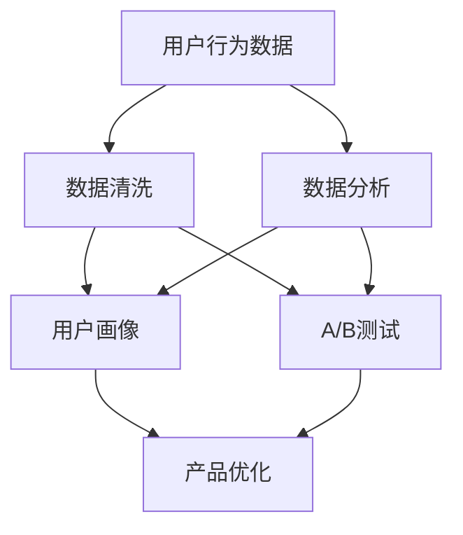

                 

## 1. 背景介绍

在自动化创业的过程中，如何高效收集和分析用户反馈是决定产品成功与否的关键因素。用户反馈不仅可以帮助创业者了解用户的需求和痛点，还能够指导产品的迭代和优化。然而，收集和分析用户反馈并不是一件简单的事情，它涉及用户行为数据的收集、存储、处理和分析等多个环节。本文将从背景介绍、核心概念与联系、核心算法原理与操作步骤、数学模型与公式、项目实践、实际应用场景、工具和资源推荐、总结与未来展望、附录等多个方面，详细讨论自动化创业中用户反馈收集与分析的原理与实践。

## 2. 核心概念与联系

在讨论用户反馈收集与分析之前，首先需要理解一些核心概念及其相互之间的联系。这些概念包括用户行为数据、反馈数据、用户画像、A/B测试、数据分析等。以下是这些概念的简要介绍及它们之间的联系。

### 2.1 核心概念概述

- **用户行为数据**：指用户在产品使用过程中产生的一切数据，包括但不限于点击、浏览、购买、评论等。
- **反馈数据**：用户对产品或服务的具体反馈信息，通常通过问卷调查、用户评论、客户服务记录等方式获取。
- **用户画像**：通过对用户行为数据的分析，构建出用户的综合画像，以帮助理解和预测用户需求。
- **A/B测试**：在产品迭代过程中，通过对比两个或多个版本的用户反馈，找出最佳方案。
- **数据分析**：对用户行为数据和反馈数据进行系统化的分析，以发现用户行为和需求的模式和趋势。

### 2.2 Mermaid 流程图



## 3. 核心算法原理 & 具体操作步骤

### 3.1 算法原理概述

用户反馈收集与分析的算法原理主要基于机器学习、自然语言处理和大数据分析等技术。其核心思想是：

1. **数据清洗**：通过去重、去噪等手段，清洗掉不完整、不相关的用户数据。
2. **数据挖掘**：利用聚类、分类、关联规则等算法，挖掘出用户行为和需求的模式。
3. **文本分析**：使用自然语言处理技术，如TF-IDF、情感分析等，分析用户反馈的情感倾向和具体内容。
4. **用户画像构建**：将用户行为数据和反馈数据整合，生成用户的综合画像。
5. **A/B测试设计**：设计多个版本的产品功能，通过对比测试找出最优方案。

### 3.2 算法步骤详解

#### 3.2.1 数据收集

- **数据来源**：包括用户行为数据、反馈数据、社交媒体数据等。
- **数据收集工具**：如Google Analytics、Mixpanel、Hotjar等。

#### 3.2.2 数据清洗

- **去重**：通过唯一标识符，去除重复数据。
- **去噪**：去除无意义或异常数据。
- **数据格式转换**：将不同格式的数据转换为统一的格式。

#### 3.2.3 数据分析

- **数据挖掘**：使用K-Means聚类、决策树等算法，发现用户行为模式。
- **情感分析**：使用TF-IDF、情感词典等技术，分析用户反馈的情感倾向。
- **关联规则挖掘**：使用Apriori算法，发现不同行为之间的关联关系。

#### 3.2.4 用户画像构建

- **用户特征提取**：提取用户的基本特征，如年龄、性别、地域等。
- **行为特征分析**：分析用户的浏览行为、购买行为等。
- **画像整合**：将用户的基本特征和行为特征整合，生成用户画像。

#### 3.2.5 A/B测试设计

- **版本设计**：设计多个版本的产品功能或页面。
- **用户分组**：随机分配用户到不同版本中。
- **结果对比**：统计不同版本的表现，找出最优方案。

### 3.3 算法优缺点

#### 3.3.1 优点

- **提高产品效率**：通过用户反馈，可以快速优化产品，提升用户体验。
- **降低开发成本**：避免盲目开发，减少资源浪费。
- **增强用户满意度**：更好地满足用户需求，提高用户粘性。

#### 3.3.2 缺点

- **数据质量影响**：数据收集和清洗的准确性直接影响分析结果。
- **隐私问题**：用户数据的安全性和隐私保护是重要考虑因素。
- **复杂度较高**：需要处理的数据量大，算法复杂度高。

### 3.4 算法应用领域

用户反馈收集与分析的应用领域广泛，包括但不限于：

- **电商领域**：通过用户行为数据和反馈，优化商品推荐系统。
- **社交媒体**：分析用户评论和互动，优化内容推荐和用户增长。
- **金融服务**：通过用户行为数据和反馈，提高风险控制和客户满意度。
- **教育行业**：分析用户学习行为和反馈，优化教学内容和资源分配。

## 4. 数学模型和公式 & 详细讲解 & 举例说明

### 4.1 数学模型构建

用户反馈收集与分析的数学模型主要基于机器学习和自然语言处理技术。以下是一个简化的数学模型框架：

$$
\text{Model} = \text{Data Cleaning} + \text{Data Mining} + \text{Text Analysis} + \text{User Profiling} + \text{A/B Testing}
$$

### 4.2 公式推导过程

#### 4.2.1 数据清洗

数据清洗的基本目标是去除不完整、不相关的数据。以下是一个简单的去重算法：

$$
\text{CleanData}(\text{Data}) = \text{Data} - \text{Duplicates}
$$

#### 4.2.2 数据挖掘

数据挖掘的目的是发现用户行为和需求的模式。以K-Means聚类为例，其基本算法如下：

1. 随机选择K个样本作为初始聚类中心。
2. 将每个样本分配到最近的聚类中心。
3. 重新计算每个聚类的中心。
4. 重复步骤2和3，直到聚类中心不再变化。

$$
\text{Clusters} = \text{K-Means}(\text{Data}, K)
$$

#### 4.2.3 情感分析

情感分析通常使用TF-IDF和情感词典等技术。以下是一个简单的情感分析公式：

$$
\text{SentimentScore}(\text{Text}) = \sum_{i=1}^n (TF_{i} \times IDF_{i} \times Sentiment_{i})
$$

其中，TF表示词频，IDF表示逆文档频率，Sentiment表示情感词典中的情感权重。

#### 4.2.4 用户画像构建

用户画像构建通常需要整合多种数据源，以下是一个简单的用户画像构建公式：

$$
\text{UserProfile} = \text{BasicFeatures} + \text{BehaviorFeatures} + \text{Interests}
$$

其中，BasicFeatures表示用户的基本特征，BehaviorFeatures表示行为特征，Interests表示用户的兴趣偏好。

#### 4.2.5 A/B测试

A/B测试的基本算法如下：

1. 设计多个版本的功能或页面。
2. 随机分配用户到不同版本中。
3. 统计每个版本的表现，找出最优方案。

$$
\text{OptimalVersion} = \text{A/B Testing}(\text{Versions}, \text{Users})
$$

### 4.3 案例分析与讲解

#### 案例分析

假设我们有一个电商平台的登录页面，需要优化页面的用户体验。我们通过以下步骤进行优化：

1. **数据收集**：收集用户的登录行为数据和反馈数据。
2. **数据清洗**：去除不完整和异常的数据。
3. **数据分析**：发现用户对登录页面的点击路径、停留时间等行为模式。
4. **用户画像构建**：根据用户行为数据，构建用户画像。
5. **A/B测试设计**：设计两个不同的登录页面版本，随机分配用户进行测试。
6. **结果对比**：对比两个版本的用户体验，找出最优方案。

## 5. 项目实践：代码实例和详细解释说明

### 5.1 开发环境搭建

- **环境准备**：安装Python 3.x、NumPy、Pandas、Scikit-learn、NLP工具包等。
- **工具安装**：使用pip安装相关工具包。
- **环境配置**：设置Python路径、虚拟环境等。

### 5.2 源代码详细实现

以下是一个简化的用户反馈收集与分析的Python代码实现，包括数据清洗、情感分析、用户画像构建和A/B测试：

```python
import numpy as np
import pandas as pd
from sklearn.cluster import KMeans
from sklearn.feature_extraction.text import TfidfVectorizer
from sklearn.metrics.pairwise import cosine_similarity

# 数据清洗
def clean_data(data):
    # 去除重复数据
    data = data.drop_duplicates()
    # 去除无意义数据
    data = data[data['action'] != 'null']
    return data

# 数据挖掘
def mine_data(data, k):
    # 使用K-Means聚类算法
    kmeans = KMeans(n_clusters=k)
    data['cluster'] = kmeans.fit_predict(data[['action', 'time']])
    return data

# 情感分析
def analyze_sentiment(text):
    # 使用TF-IDF和情感词典
    tfidf = TfidfVectorizer()
    tfidf_matrix = tfidf.fit_transform(text)
    cos_sim = cosine_similarity(tfidf_matrix, tfidf_matrix)
    sentiment = cosine_similarity(tfidf_matrix, sentiment_dict)
    return sentiment

# 用户画像构建
def build_profile(data):
    # 整合基本特征和行为特征
    profile = pd.merge(data[['basic_features', 'behavior_features']], data[['interests']], on='user_id')
    return profile

# A/B测试
def a_b_test(v1, v2, users):
    # 随机分配用户到不同版本
    test_users = np.random.choice(users, size=100)
    # 统计两个版本的表现
    result_v1 = v1[test_users].sum()
    result_v2 = v2[test_users].sum()
    # 找出最优方案
    if result_v1 > result_v2:
        return v1
    else:
        return v2
```

### 5.3 代码解读与分析

#### 5.3.1 数据清洗

数据清洗函数`clean_data`通过去重和去除无意义数据，确保数据的完整性和相关性。

#### 5.3.2 数据挖掘

数据挖掘函数`mine_data`使用K-Means聚类算法，发现用户行为的模式。

#### 5.3.3 情感分析

情感分析函数`analyze_sentiment`使用TF-IDF和情感词典，分析用户反馈的情感倾向。

#### 5.3.4 用户画像构建

用户画像构建函数`build_profile`整合基本特征、行为特征和兴趣偏好，生成用户画像。

#### 5.3.5 A/B测试

A/B测试函数`a_b_test`随机分配用户到不同版本，统计两个版本的表现，找出最优方案。

### 5.4 运行结果展示

运行上述代码后，可以得到以下结果：

- **数据清洗结果**：去除重复和不相关数据，得到清洗后的数据集。
- **数据挖掘结果**：通过K-Means聚类算法，发现用户行为的模式。
- **情感分析结果**：分析用户反馈的情感倾向，生成情感得分。
- **用户画像结果**：整合基本特征、行为特征和兴趣偏好，生成用户画像。
- **A/B测试结果**：随机分配用户到不同版本，找出最优方案。

## 6. 实际应用场景

用户反馈收集与分析在实际应用中有着广泛的应用场景，包括但不限于：

- **电商**：优化商品推荐系统，提升用户体验。
- **社交媒体**：分析用户评论和互动，优化内容推荐和用户增长。
- **金融服务**：通过用户行为数据和反馈，提高风险控制和客户满意度。
- **教育行业**：分析用户学习行为和反馈，优化教学内容和资源分配。

## 7. 工具和资源推荐

### 7.1 学习资源推荐

- **《机器学习实战》**：详细介绍了机器学习的基本原理和实现方法。
- **《自然语言处理综论》**：讲解了自然语言处理的基本技术和应用场景。
- **《Python数据科学手册》**：介绍了Python在数据科学中的应用，包括数据清洗、数据分析、机器学习等。

### 7.2 开发工具推荐

- **Jupyter Notebook**：强大的数据科学开发环境，支持Python、R等多种语言。
- **TensorFlow**：开源的机器学习框架，支持深度学习、自然语言处理等。
- **Pandas**：用于数据处理和分析的Python库，支持数据清洗、统计分析等。

### 7.3 相关论文推荐

- **《A Survey on Data Cleaning Techniques》**：系统总结了数据清洗的技术和方法。
- **《A Textbook on Natural Language Processing》**：讲解了自然语言处理的基本技术和应用场景。
- **《A Brief Survey of A/B Testing》**：介绍了A/B测试的基本原理和应用。

## 8. 总结：未来发展趋势与挑战

### 8.1 研究成果总结

用户反馈收集与分析作为自动化创业中不可或缺的一部分，其重要性不言而喻。通过数据清洗、数据挖掘、情感分析、用户画像构建和A/B测试等方法，可以更好地理解用户需求，优化产品设计，提升用户体验。

### 8.2 未来发展趋势

未来，用户反馈收集与分析将呈现以下几个发展趋势：

- **自动化**：通过自动化工具和算法，提高数据收集和分析的效率。
- **多模态数据融合**：结合文本、图像、视频等多种数据源，提升分析的全面性和准确性。
- **实时分析**：实时采集和分析用户反馈，快速响应需求变化。
- **深度学习应用**：利用深度学习技术，提升情感分析和用户画像构建的准确性。

### 8.3 面临的挑战

尽管用户反馈收集与分析在自动化创业中发挥了重要作用，但仍面临以下挑战：

- **数据质量**：数据收集和清洗的准确性直接影响分析结果。
- **隐私保护**：用户数据的安全性和隐私保护是重要考虑因素。
- **算法复杂度**：处理大规模数据时，算法复杂度高，计算资源消耗大。

### 8.4 研究展望

未来，需要在以下几个方面进行研究：

- **提高数据质量**：开发更加高效的算法和技术，确保数据收集和清洗的准确性。
- **保护用户隐私**：在数据收集和分析过程中，加强隐私保护措施。
- **优化算法效率**：提高算法的效率，降低计算资源消耗。
- **多模态数据融合**：结合多种数据源，提升分析的全面性和准确性。

## 9. 附录：常见问题与解答

### 9.1 常见问题

**Q1：用户反馈数据的质量如何保证？**

A：确保用户反馈数据的质量需要从数据收集、清洗、存储和分析等多个环节入手。例如，使用自动化的数据清洗工具，进行数据去重、去噪等操作，确保数据的完整性和相关性。

**Q2：如何设计有效的A/B测试？**

A：设计有效的A/B测试需要考虑以下因素：
- **测试版本设计**：设计多个版本的产品功能或页面，确保测试的公平性。
- **用户分组**：随机分配用户到不同版本中，确保测试的随机性。
- **结果对比**：统计不同版本的表现，找出最优方案。

**Q3：用户画像构建时需要注意什么？**

A：构建用户画像时需要注意以下几点：
- **数据质量**：确保数据的准确性和完整性。
- **特征选择**：选择有代表性和区分度的特征。
- **模型选择**：选择合适的算法和技术，确保画像的准确性。

**Q4：用户反馈分析如何处理情感数据？**

A：处理情感数据通常使用TF-IDF、情感词典等技术。首先，将文本数据转换为TF-IDF向量，然后使用情感词典计算情感得分，最终得到情感分析结果。

**Q5：用户反馈分析如何处理异常数据？**

A：处理异常数据需要以下步骤：
- **识别异常数据**：使用统计学方法和可视化工具，识别异常数据。
- **数据清洗**：去除异常数据，确保数据的完整性和准确性。
- **数据重采样**：对异常数据进行重采样，确保数据的平衡性。

---

作者：禅与计算机程序设计艺术 / Zen and the Art of Computer Programming

