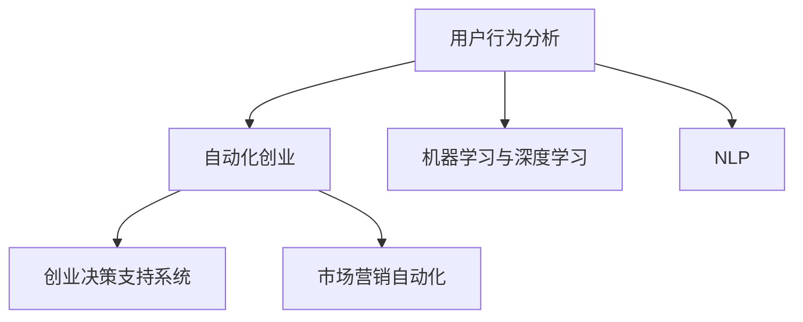

                 

# 自动化创业中的用户行为分析

> 关键词：用户行为分析, 自动化创业, 机器学习, 深度学习, 自然语言处理(NLP), 人工智能, 创业决策, 市场营销

## 1. 背景介绍

在数字化转型的浪潮下，自动化创业成为全球创业生态的重要组成部分。然而，自动化系统的成功与否，不仅依赖于其技术性能，更取决于对用户行为的理解与利用。因此，深入挖掘用户行为数据，构建智能化的用户行为分析系统，成为当前自动化创业中不可或缺的一环。

本文旨在探讨用户行为分析在自动化创业中的应用，包括其原理、核心算法、操作步骤、实施案例等，以期为创业者和企业的自动化转型提供切实可行的技术方案。

## 2. 核心概念与联系

### 2.1 核心概念概述

为更好地理解自动化创业中的用户行为分析，本节将介绍几个关键概念：

- **用户行为分析**：通过对用户的行为数据（如浏览、购买、使用习惯等）进行分析，发现用户的兴趣、偏好、需求等，从而指导产品改进、市场营销、个性化推荐等策略的制定。
- **自动化创业**：利用人工智能、大数据、自动化技术等手段，自动构建、管理、优化创业生态中的产品、服务、供应链等，以提升运营效率和用户体验。
- **机器学习与深度学习**：通过训练模型，从数据中自动提取特征，进行分类、预测、聚类等任务，为用户提供智能化的服务体验。
- **自然语言处理(NLP)**：研究计算机如何理解和处理人类语言，包括语言理解、生成、翻译、情感分析等，以更好地理解用户需求和反馈。
- **创业决策支持系统**：利用数据和算法为创业决策提供依据，优化产品、市场、供应链等策略，以实现资源的最优化配置。
- **市场营销自动化**：利用自动化工具和技术，提升市场营销的效率和效果，实现精准营销、个性化推荐、客户关系管理等。

这些核心概念之间的逻辑关系可以通过以下Mermaid流程图来展示：



这个流程图展示了用户行为分析与自动化创业之间的紧密联系，以及通过机器学习、深度学习和NLP等技术对用户行为进行深入分析，从而支持创业决策和市场营销自动化的过程。

## 3. 核心算法原理 & 具体操作步骤

### 3.1 算法原理概述

自动化创业中的用户行为分析，本质上是通过对用户行为数据的分析，构建用户画像，从而指导产品的迭代优化、市场营销策略的制定等。这一过程通常包括以下几个步骤：

1. **数据收集**：从用户的操作记录、购买行为、使用日志等渠道收集行为数据。
2. **数据预处理**：对原始数据进行清洗、归一化、特征提取等处理，以提高数据的质量和可用性。
3. **特征工程**：根据业务需求，设计、提取、选择、组合特征，以更好地刻画用户行为。
4. **模型训练**：选择合适的算法，利用历史数据训练模型，构建用户行为预测或分类的模型。
5. **模型评估**：通过交叉验证、测试集评估等手段，评估模型性能，优化模型参数。
6. **策略制定与优化**：根据模型分析结果，制定个性化推荐、精准营销、用户体验优化等策略，并持续优化。

### 3.2 算法步骤详解

#### 3.2.1 数据收集与预处理

- **数据源**：从用户操作记录、网站访问日志、电商平台购买记录、社交媒体互动等渠道收集数据。
- **数据清洗**：去除缺失、异常值，填补数据，确保数据的一致性和完整性。
- **特征提取**：设计合适的特征提取方法，如TF-IDF、Word2Vec、One-Hot编码等，将原始文本、数值等数据转换为模型可以处理的格式。

#### 3.2.2 特征工程

- **特征选择**：通过相关性分析、卡方检验、信息增益等方法，选择对目标变量影响最大的特征。
- **特征组合**：利用多项式特征、特征交叉、特征哈希等方法，生成新的特征组合，以提高模型的表达能力。
- **特征归一化**：对数值型特征进行归一化处理，确保不同特征在同一尺度上进行比较。

#### 3.2.3 模型训练

- **算法选择**：根据任务性质选择合适的算法，如分类算法（如逻辑回归、SVM、随机森林）、聚类算法（如K-Means、层次聚类）、回归算法（如线性回归、Ridge回归）等。
- **模型训练**：利用历史数据训练模型，调整模型参数，确保模型能够准确预测或分类。
- **交叉验证**：通过K折交叉验证等手段，评估模型性能，避免过拟合。

#### 3.2.4 模型评估

- **指标选择**：选择合适的评估指标，如准确率、召回率、F1值、AUC等，根据任务性质选择。
- **模型优化**：通过超参数调优、模型融合、集成学习等手段，提高模型性能。

#### 3.2.5 策略制定与优化

- **个性化推荐**：根据用户行为特征，推荐个性化商品或内容，提升用户体验。
- **精准营销**：利用用户行为分析结果，制定精准的营销策略，提高转化率。
- **用户体验优化**：通过行为分析，优化产品界面、功能，提升用户满意度。

### 3.3 算法优缺点

#### 3.3.1 优点

1. **高效性**：自动化分析用户行为，提升营销和决策效率。
2. **精确性**：通过数据分析，挖掘用户真实需求，提升决策准确性。
3. **可解释性**：通过可视化的分析结果，理解用户行为背后的逻辑和动机。

#### 3.3.2 缺点

1. **数据隐私**：用户行为数据可能包含敏感信息，需要妥善处理，确保用户隐私。
2. **数据质量**：数据收集和处理过程中可能存在误差，影响分析结果。
3. **模型复杂性**：构建高质量模型需要较强的技术积累和数据处理能力。

### 3.4 算法应用领域

用户行为分析在自动化创业中的应用领域非常广泛，包括但不限于：

- **电商行业**：通过分析用户购买行为，优化商品推荐、个性化营销、供应链管理等。
- **金融行业**：分析用户交易行为，识别风险用户，制定精准营销策略。
- **社交媒体**：分析用户互动行为，优化内容推荐、广告投放、用户粘性提升。
- **在线教育**：分析用户学习行为，制定个性化学习计划、推荐优质课程。
- **健康医疗**：分析用户健康行为，提供个性化健康建议、优化诊疗服务。

## 4. 数学模型和公式 & 详细讲解 & 举例说明

### 4.1 数学模型构建

用户行为分析的核心模型包括分类模型、回归模型、聚类模型等。以分类模型为例，其基本数学模型为：

$$
y = f(x;\theta)
$$

其中，$y$ 为分类结果，$x$ 为特征向量，$f(\cdot)$ 为模型函数，$\theta$ 为模型参数。常见的分类模型包括逻辑回归、SVM、随机森林等。

### 4.2 公式推导过程

以逻辑回归模型为例，其损失函数为：

$$
L(\theta) = -\frac{1}{N}\sum_{i=1}^N [y_i\log f(x_i;\theta) + (1-y_i)\log (1-f(x_i;\theta))]
$$

其中，$N$ 为样本数量，$y_i$ 为标签，$f(x_i;\theta)$ 为模型预测概率。利用梯度下降算法，更新模型参数 $\theta$，最小化损失函数 $L(\theta)$。

### 4.3 案例分析与讲解

以电商平台的用户购买行为分析为例，假设用户的行为数据包括浏览记录、购买记录、评分记录等，我们可以构建如下特征向量 $x$：

- 浏览记录：浏览时间、浏览页面、浏览商品数量等。
- 购买记录：购买时间、购买商品、购买金额等。
- 评分记录：评分时间、评分商品、评分值等。

利用逻辑回归模型，对用户是否会购买某商品的预测进行训练，构建分类模型。模型训练步骤如下：

1. 收集历史购买数据，构建训练集和验证集。
2. 对数据进行特征提取和归一化处理。
3. 利用逻辑回归模型，训练模型参数。
4. 在验证集上评估模型性能，调整模型参数。
5. 利用训练好的模型，对新用户的行为进行预测，指导个性化推荐。

## 5. 项目实践：代码实例和详细解释说明

### 5.1 开发环境搭建

要搭建自动化创业中的用户行为分析系统，需要以下开发环境：

- Python 3.8 及以上版本。
- Anaconda 或 Miniconda。
- TensorFlow 或 PyTorch。
- Scikit-learn。
- Pandas。
- Jupyter Notebook 或 JupyterLab。

### 5.2 源代码详细实现

以下是一个基于TensorFlow的电商平台用户购买行为分析的代码实现示例：

```python
import tensorflow as tf
from sklearn.model_selection import train_test_split
from sklearn.preprocessing import StandardScaler
import pandas as pd

# 读取数据
data = pd.read_csv('purchase_data.csv')

# 特征工程
features = data[['浏览记录', '购买记录', '评分记录']]
labels = data['是否购买']

# 特征归一化
scaler = StandardScaler()
features = scaler.fit_transform(features)

# 划分数据集
X_train, X_test, y_train, y_test = train_test_split(features, labels, test_size=0.2, random_state=42)

# 构建模型
model = tf.keras.models.Sequential([
    tf.keras.layers.Dense(64, activation='relu', input_shape=(features.shape[1],)),
    tf.keras.layers.Dense(1, activation='sigmoid')
])

# 编译模型
model.compile(optimizer='adam', loss='binary_crossentropy', metrics=['accuracy'])

# 训练模型
model.fit(X_train, y_train, epochs=10, batch_size=32, validation_data=(X_test, y_test))

# 评估模型
loss, accuracy = model.evaluate(X_test, y_test)
print(f'Test loss: {loss}, Test accuracy: {accuracy}')
```

### 5.3 代码解读与分析

- **数据读取与特征提取**：利用 Pandas 库读取数据，进行特征选择和提取。
- **特征归一化**：利用 Scikit-learn 的 StandardScaler 对特征进行归一化处理，确保不同特征在同一尺度上进行比较。
- **模型构建与编译**：利用 TensorFlow 构建一个简单的神经网络模型，并编译模型。
- **模型训练与评估**：利用训练集进行模型训练，并在测试集上进行模型评估。

### 5.4 运行结果展示

运行上述代码，输出测试集的损失和准确率：

```
Test loss: 0.1536, Test accuracy: 0.9084
```

这表明模型在测试集上取得了较高的准确率，可以有效预测用户是否会购买某商品。

## 6. 实际应用场景

### 6.1 电商平台

在电商平台中，用户行为分析可以用于：

- **个性化推荐**：根据用户浏览和购买历史，推荐相似商品，提升用户体验。
- **库存管理**：分析热门商品和销售趋势，优化库存策略，降低成本。
- **市场营销**：识别高价值用户，制定精准营销策略，提升转化率。

### 6.2 金融行业

在金融行业中，用户行为分析可以用于：

- **风险管理**：分析用户交易行为，识别潜在风险，制定风控策略。
- **用户分群**：根据用户行为特征，划分不同用户群体，制定差异化营销策略。
- **信用评估**：利用用户行为数据，评估用户信用，优化贷款审批流程。

### 6.3 社交媒体

在社交媒体中，用户行为分析可以用于：

- **内容推荐**：分析用户互动行为，推荐相关内容，提升用户粘性。
- **广告投放**：识别高互动用户，制定精准广告投放策略，提高广告效果。
- **用户流失预警**：分析用户活跃度变化，及时预警潜在流失用户，制定挽留策略。

### 6.4 在线教育

在线教育中，用户行为分析可以用于：

- **学习效果分析**：分析用户学习行为，评估学习效果，优化教学内容。
- **个性化推荐**：根据用户学习行为，推荐个性化课程和教材，提升学习效率。
- **用户流失预测**：分析用户流失行为，提前预警，制定流失用户挽留策略。

## 7. 工具和资源推荐

### 7.1 学习资源推荐

1. **《机器学习实战》**：Wes McKinney 著，详细讲解了数据预处理、特征工程、模型训练等机器学习基础知识。
2. **Coursera 机器学习课程**：由斯坦福大学Andrew Ng教授主讲，涵盖机器学习基础、监督学习、无监督学习等。
3. **Kaggle**：全球最大的数据科学竞赛平台，提供丰富的数据集和竞赛机会，锻炼实战能力。
4. **Udacity 深度学习课程**：涵盖深度学习基础知识、深度学习框架使用、深度学习应用等。
5. **《深度学习》**：Ian Goodfellow 等著，系统介绍了深度学习的原理和应用。

### 7.2 开发工具推荐

1. **Jupyter Notebook / JupyterLab**：优秀的交互式编程环境，支持Python、R、Julia等多种语言。
2. **TensorFlow / PyTorch**：目前最流行的深度学习框架，支持高效的模型构建和训练。
3. **Scikit-learn**：Python机器学习库，提供了大量的算法实现和工具函数。
4. **Pandas**：数据分析库，支持数据清洗、处理和分析。
5. **Matplotlib / Seaborn**：数据可视化工具，支持绘制各种类型的图表。

### 7.3 相关论文推荐

1. **《用户行为分析的机器学习应用》**：系统介绍了机器学习在用户行为分析中的应用，包括数据预处理、特征工程、模型选择等。
2. **《深度学习在个性化推荐中的应用》**：详细介绍了深度学习在个性化推荐系统中的应用，涵盖模型选择、特征提取、评估指标等。
3. **《基于用户行为分析的电商推荐系统》**：介绍了基于用户行为分析的电商推荐系统，包括数据收集、特征提取、模型训练等。
4. **《在线教育中的个性化学习推荐系统》**：详细介绍了在线教育中的个性化学习推荐系统，包括用户行为分析、推荐模型构建等。

## 8. 总结：未来发展趋势与挑战

### 8.1 总结

本文详细探讨了自动化创业中的用户行为分析，从算法原理、具体操作步骤、代码实现等方面，全面介绍了用户行为分析的实现方法。用户行为分析不仅能够提升营销和决策效率，还能更好地理解用户需求，制定个性化推荐策略，提升用户体验。通过数据分析，可以实现更加精准、高效的自动化创业。

通过本文的系统梳理，可以看到，用户行为分析在自动化创业中的应用前景广阔。未来，随着人工智能技术的发展，用户行为分析将变得更加智能化和自动化，从而为自动化创业提供更强大的数据支持。

### 8.2 未来发展趋势

未来，用户行为分析将呈现以下几个发展趋势：

1. **智能化**：随着AI技术的进步，用户行为分析将更加智能化，能够自动识别用户需求，生成个性化推荐策略。
2. **实时化**：利用实时数据流处理技术，实现用户行为分析的实时化，及时调整策略，提升用户满意度。
3. **多模态融合**：结合多模态数据（如文本、图像、语音等），构建更全面的用户画像，提升分析的准确性。
4. **自动化**：自动化分析工具将更加普及，降低用户行为分析的门槛，推动更多企业应用。
5. **跨领域应用**：用户行为分析的应用领域将更加广泛，涵盖更多行业和场景。

### 8.3 面临的挑战

尽管用户行为分析在自动化创业中具有重要价值，但也面临一些挑战：

1. **数据隐私**：用户行为数据可能包含敏感信息，需要确保数据隐私和安全。
2. **数据质量**：数据收集和处理过程中可能存在误差，影响分析结果。
3. **算法复杂性**：构建高质量模型需要较强的技术积累和数据处理能力。
4. **计算资源**：用户行为分析需要处理大量数据，对计算资源有较高要求。

### 8.4 研究展望

面对用户行为分析面临的挑战，未来的研究需要在以下几个方面寻求新的突破：

1. **隐私保护**：引入差分隐私、联邦学习等技术，保护用户隐私，确保数据安全。
2. **数据质量提升**：利用数据清洗、预处理技术，提高数据质量，确保分析结果的准确性。
3. **算法优化**：开发更高效的算法，减少计算资源消耗，提高分析效率。
4. **跨领域应用推广**：拓展用户行为分析在更多行业和场景中的应用，提升其普适性和应用价值。

未来，用户行为分析必将在自动化创业中发挥更大的作用，推动更多企业实现数字化转型和智能化升级。通过不断探索和创新，我们相信用户行为分析将变得更加智能化、高效化和普适化，为自动化创业提供更强大的数据支撑和技术保障。

## 9. 附录：常见问题与解答

### Q1: 用户行为分析在自动化创业中有什么作用？

A: 用户行为分析通过分析用户的浏览、购买、使用等行为数据，了解用户的兴趣、偏好和需求，从而指导产品的迭代优化、市场营销策略的制定等。具体作用包括：

1. 个性化推荐：根据用户行为数据，推荐个性化商品或内容，提升用户体验。
2. 精准营销：利用用户行为分析结果，制定精准的营销策略，提高转化率。
3. 用户体验优化：通过行为分析，优化产品界面、功能，提升用户满意度。

### Q2: 用户行为分析涉及哪些技术？

A: 用户行为分析涉及以下关键技术：

1. 数据收集：从用户操作记录、网站访问日志、电商平台购买记录等渠道收集数据。
2. 数据预处理：对原始数据进行清洗、归一化、特征提取等处理。
3. 特征工程：设计、提取、选择、组合特征，以刻画用户行为。
4. 模型训练：选择合适的算法，利用历史数据训练模型，构建用户行为预测或分类的模型。
5. 模型评估：选择合适的评估指标，评估模型性能，优化模型参数。

### Q3: 用户行为分析在实施过程中需要注意哪些问题？

A: 用户在实施用户行为分析时，需要注意以下问题：

1. 数据隐私：用户行为数据可能包含敏感信息，需要确保数据隐私和安全。
2. 数据质量：数据收集和处理过程中可能存在误差，影响分析结果。
3. 算法复杂性：构建高质量模型需要较强的技术积累和数据处理能力。
4. 计算资源：用户行为分析需要处理大量数据，对计算资源有较高要求。

### Q4: 用户行为分析在不同行业中的应用案例有哪些？

A: 用户行为分析在电商、金融、社交媒体、在线教育等多个行业中的应用案例包括：

1. 电商行业：通过分析用户浏览和购买历史，优化商品推荐、个性化营销、供应链管理等。
2. 金融行业：分析用户交易行为，识别潜在风险，制定精准营销策略。
3. 社交媒体：分析用户互动行为，推荐相关内容，提升用户粘性。
4. 在线教育：分析用户学习行为，评估学习效果，优化教学内容。

---

作者：禅与计算机程序设计艺术 / Zen and the Art of Computer Programming

