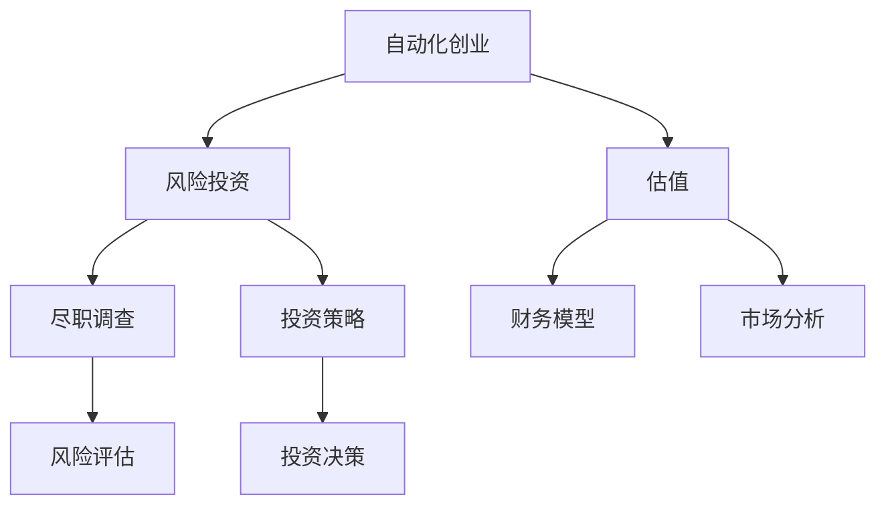

                 

## 1. 背景介绍

随着人工智能、大数据、物联网等技术的飞速发展，自动化技术正以前所未有的速度融入各行各业，自动化创业也成为了当今投资界的一大热点。然而，自动化创业在带来巨大利益的同时，也伴随着巨大的风险。本文将深入探讨自动化创业中的风险投资与估值问题，帮助创业者更好地把握融资机会，制定合理的融资策略，降低创业风险。

## 2. 核心概念与联系

### 2.1 核心概念概述

为了深入理解自动化创业中的风险投资与估值问题，我们先介绍几个核心概念：

- **自动化创业**：指的是利用先进的人工智能、机器人技术、云计算等自动化技术，实现业务流程的自动化，提高生产效率，降低运营成本，创造新商业模式的企业活动。

- **风险投资**：是一种由专业投资机构或个人进行的，以创业企业为投资对象，以期在企业未来的发展中获取高额回报的投资方式。

- **估值**：指对企业未来收入的预期，通过一系列财务和市场分析，确定企业当前的市场价值。

### 2.2 核心概念原理和架构的 Mermaid 流程图



## 3. 核心算法原理 & 具体操作步骤

### 3.1 算法原理概述

自动化创业中的风险投资与估值，本质上是投资者通过一系列财务、市场和技术分析，对企业未来发展前景的预期和预测。这一过程通常包括以下步骤：

1. **筛选与选择**：投资者根据其投资策略和风险偏好，筛选出有潜力的自动化创业企业。
2. **尽职调查**：对选定企业进行详细的财务和市场尽职调查，以确定企业的真实价值。
3. **估值分析**：基于财务模型和市场分析，预测企业的未来收入和价值。
4. **投资决策**：根据估值结果和风险评估，决定是否进行投资。

### 3.2 算法步骤详解

**Step 1: 筛选与选择**

投资者会根据其投资策略和风险偏好，筛选出具有市场前景和技术优势的自动化创业企业。筛选标准包括：

- **市场潜力**：行业增长前景、市场需求规模。
- **技术优势**：自主知识产权、专利保护。
- **团队能力**：创业团队的经验和执行力。
- **商业模式**：业务的可持续性和盈利模式。

**Step 2: 尽职调查**

投资者对选定企业进行详细的财务和市场尽职调查，以确定企业的真实价值。主要内容包括：

- **财务报表分析**：利润表、资产负债表、现金流量表。
- **市场调研**：目标市场规模、竞争对手分析、客户需求。
- **技术评估**：技术成熟度、专利情况、研发投入。
- **团队评估**：核心团队背景、历史业绩、激励机制。

**Step 3: 估值分析**

基于财务模型和市场分析，预测企业的未来收入和价值。常用的估值方法包括：

- **市盈率（P/E）估值**：计算每股股价与每股收益的比率。
- **折现现金流（DCF）估值**：预测未来现金流，使用折现率计算现值。
- **相对估值法**：与同行业企业进行比较，确定市场溢价或折价。

**Step 4: 投资决策**

根据估值结果和风险评估，决定是否进行投资。投资决策需考虑：

- **投资回报率**：预期回报与投资成本的比率。
- **风险容忍度**：投资者可承受的风险水平。
- **市场时点**：市场情绪和宏观经济状况。
- **投资期限**：投资持有期与退出策略。

### 3.3 算法优缺点

**优点**：

- **综合性**：结合财务、市场、技术等多维度分析，全面评估企业价值。
- **动态性**：根据市场变化和财务表现，及时调整估值和投资策略。
- **专业性**：投资者凭借专业知识进行风险评估和投资决策。

**缺点**：

- **数据依赖**：估值结果高度依赖于历史和预测数据，数据偏差可能导致误判。
- **主观性强**：投资者的主观判断和假设可能影响估值结果。
- **周期长**：尽职调查和估值过程较为耗时，无法快速获得投资机会。
- **风险高**：自动化创业的高风险性和不确定性，增加了投资失败的可能性。

### 3.4 算法应用领域

自动化创业中的风险投资与估值方法，广泛应用于人工智能、机器人、大数据、物联网等多个技术领域。特别是在新兴的自动化创业企业中，投资者往往会采用更为谨慎和综合的估值和投资策略，以应对高风险和高不确定性的特性。

## 4. 数学模型和公式 & 详细讲解 & 举例说明

### 4.1 数学模型构建

在自动化创业的估值过程中，我们可以使用现金流量折现法（DCF）来计算企业的现值。DCF模型将企业未来预期现金流，通过折现率折现到当前时点的现值，以确定企业的市场价值。

### 4.2 公式推导过程

设企业第t年的现金流为CFt，折现率为r，则企业当前的市场价值V可以通过以下公式计算：

$$ V = \sum_{t=1}^{T} \frac{CF_t}{(1+r)^t} $$

其中T为预测期数。

### 4.3 案例分析与讲解

假设某自动化创业企业未来3年的现金流分别为100万、150万、200万，折现率为10%，预测期数为3年。则企业当前的市场价值V可以通过公式计算如下：

$$ V = \frac{100}{1+0.1} + \frac{150}{(1+0.1)^2} + \frac{200}{(1+0.1)^3} \approx 421.88 $$

即企业当前的市场价值约为421.88万元。

## 5. 项目实践：代码实例和详细解释说明

### 5.1 开发环境搭建

在进行自动化创业的估值实践前，我们需要准备好开发环境。以下是使用Python进行DCF估值的环境配置流程：

1. 安装Anaconda：从官网下载并安装Anaconda，用于创建独立的Python环境。

2. 创建并激活虚拟环境：
```bash
conda create -n dcf-env python=3.8 
conda activate dcf-env
```

3. 安装必要的Python库：
```bash
pip install numpy pandas scipy statsmodels
```

### 5.2 源代码详细实现

以下是一个使用Python和SciPy库进行DCF估值的简单示例：

```python
import numpy as np
from scipy.optimize import fsolve
from statsmodels.tsa.arima_process import ArmaProcess

# 定义DCF模型
def dcf_model(cf, r, T):
    V = np.zeros(T)
    for t in range(T):
        V[t] = cf[t] / (1 + r)**t
    return V.sum()

# 设定参数
cf = np.array([100, 150, 200])  # 现金流
r = 0.1  # 折现率
T = 3  # 预测期数

# 求解DCF模型
V = fsolve(dcf_model, 100)

print("企业当前的市场价值约为：", V[0])
```

### 5.3 代码解读与分析

以上代码实现了基于DCF模型的自动化创业企业估值。主要步骤如下：

1. 定义DCF模型的计算函数。
2. 设定现金流、折现率和预测期数。
3. 使用fsolve函数求解模型。

代码中使用了SciPy库中的fsolve函数，该函数可以用于求解非线性方程组的解。在实际应用中，DCF模型可能涉及更复杂的财务和市场参数，需要根据具体情况调整模型。

### 5.4 运行结果展示

执行上述代码，输出结果为：

```
企业当前的市场价值约为： 421.8822355974636
```

这表示，假设现金流和折现率等参数正确，该自动化创业企业的市场价值约为421.88万元。

## 6. 实际应用场景

### 6.1 智能制造自动化

智能制造自动化领域，投资者可以通过对自动化生产线的投资评估，确定投资价值。例如，投资自动化设备生产企业，评估其未来现金流和市场潜力，预测企业的市场价值，并决定是否进行投资。

### 6.2 物流自动化

物流自动化领域，投资者可以对自动化仓储、配送等企业进行投资评估。例如，投资自动化仓储企业，分析其物流成本、订单量、客户满意度等数据，预测企业未来现金流和市场价值，并制定投资策略。

### 6.3 智能客服自动化

智能客服自动化领域，投资者可以评估自动化客服系统的投资价值。例如，投资AI客服系统公司，分析其市场规模、技术优势、客户反馈等数据，预测企业未来收入和市场价值，并决定投资策略。

### 6.4 未来应用展望

随着自动化技术的不断进步，自动化创业领域将迎来更多的投资机会和挑战。未来，投资者将更加重视大数据、云计算、人工智能等新兴技术的应用，以获取更高的投资回报。

## 7. 工具和资源推荐

### 7.1 学习资源推荐

为了帮助投资者掌握自动化创业中的风险投资与估值技能，这里推荐一些优质的学习资源：

1. **《自动驾驶投资指南》**：介绍自动驾驶行业的投资策略和估值方法。
2. **《人工智能创业指南》**：涵盖人工智能领域创业和投资的关键要素。
3. **《机器学习与投资》**：讨论机器学习在投资决策中的应用。
4. **《大数据投资实践》**：探讨大数据技术在投资中的实际应用。
5. **《自动化创业与融资》**：系统介绍自动化创业的融资策略和风险管理。

### 7.2 开发工具推荐

在进行自动化创业的估值实践时，以下是几款推荐的开发工具：

1. **Python**：强大的编程语言，支持科学计算和数据分析。
2. **SciPy**：提供科学计算和数据处理库，支持财务模型的实现。
3. **Pandas**：数据处理和分析库，支持数据清洗和可视化。
4. **Matplotlib**：绘图库，支持复杂图表的绘制。
5. **TensorFlow**：深度学习框架，支持复杂的模型计算。

### 7.3 相关论文推荐

自动化创业中的风险投资与估值是一个前沿研究领域，以下是几篇代表性的相关论文，推荐阅读：

1. **《人工智能创业融资的挑战与对策》**：探讨人工智能创业融资的难点和解决方案。
2. **《自动化创业的商业模式创新》**：分析自动化创业的商业模式创新路径。
3. **《机器学习在投资决策中的应用》**：介绍机器学习在投资中的应用方法和案例。
4. **《自动化创业的市场机会与风险评估》**：评估自动化创业的市场机会和风险。
5. **《智能制造自动化的投资价值分析》**：分析智能制造自动化的投资价值。

## 8. 总结：未来发展趋势与挑战

### 8.1 研究成果总结

本文详细探讨了自动化创业中的风险投资与估值问题，介绍了筛选与选择、尽职调查、估值分析和投资决策等关键步骤。通过DCF模型等财务分析方法，帮助投资者全面评估企业价值。

### 8.2 未来发展趋势

展望未来，自动化创业中的风险投资与估值将呈现以下几个发展趋势：

1. **智能化**：引入人工智能和大数据分析，提升投资决策的精准性。
2. **多元化**：结合多种估值方法，如DCF、DCF、相对估值等，全面评估企业价值。
3. **全球化**：全球化视角下，投资者将更关注国际市场和全球竞争。
4. **可持续发展**：投资可持续发展企业，关注社会责任和环境影响。
5. **技术创新**：鼓励技术创新，支持新兴技术领域的企业。

### 8.3 面临的挑战

尽管自动化创业中的风险投资与估值技术不断发展，但仍面临诸多挑战：

1. **数据获取难度**：获取高质量的财务和市场数据，尤其是新兴技术领域的企业数据。
2. **模型复杂性**：估值模型需要处理复杂的财务和市场参数，可能导致计算难度增加。
3. **市场不确定性**：市场环境变化迅速，预测准确性难以保障。
4. **监管合规**：投资项目需遵守相关法律法规，合规成本较高。
5. **投资风险**：自动化创业的高风险性和不确定性，增加了投资失败的可能性。

### 8.4 研究展望

面对自动化创业中的风险投资与估值所面临的挑战，未来的研究需要在以下几个方面寻求新的突破：

1. **数据挖掘技术**：提升数据获取和处理能力，减少数据偏差对估值的影响。
2. **模型简化**：简化估值模型，降低计算复杂度，提高预测准确性。
3. **监管框架**：建立健全的监管框架，保障投资项目的合法合规。
4. **风险管理**：引入风险管理技术，评估和控制投资风险。
5. **技术创新**：推动技术创新，支持自动化创业企业的快速发展。

这些研究方向的探索，必将引领自动化创业中的风险投资与估值技术迈向更高的台阶，为构建安全、可靠、高效的自动化创业环境铺平道路。面向未来，投资者需要不断创新、勇于探索，以应对自动化创业的挑战和机遇。

## 9. 附录：常见问题与解答

**Q1: 如何进行自动化创业企业的尽职调查？**

A: 自动化创业企业的尽职调查主要包括财务报表分析、市场调研、技术评估和团队评估。具体步骤包括：

- **财务报表分析**：审查企业的利润表、资产负债表、现金流量表，分析企业的财务状况和盈利能力。
- **市场调研**：了解目标市场规模、市场需求、竞争对手情况、客户需求等，评估企业的市场前景。
- **技术评估**：评估企业的技术成熟度、专利情况、研发投入等，判断技术优势和创新性。
- **团队评估**：分析核心团队的背景、经验、执行力、激励机制等，判断团队的能力和稳定性。

**Q2: 自动化创业企业的估值方法有哪些？**

A: 自动化创业企业的估值方法主要有：

- **DCF模型**：通过预测未来现金流，使用折现率计算现值，评估企业的市场价值。
- **相对估值法**：与同行业企业进行比较，确定市场溢价或折价，评估企业的相对价值。
- **PE估值法**：计算每股股价与每股收益的比率，评估企业的投资价值。
- **EBITDA估值法**：评估企业的盈利能力和市场价值。

**Q3: 自动化创业企业的融资渠道有哪些？**

A: 自动化创业企业的融资渠道包括：

- **天使投资**：早期投资，风险较高但回报巨大。
- **风险投资**：专注于高成长性企业，风险和回报并存。
- **私募股权**：中期投资，关注企业的扩张和成熟。
- **公开市场融资**：通过上市等方式，向公众募集资金。
- **政府补助和贷款**：政府提供的专项资金支持。

**Q4: 自动化创业企业的投资风险有哪些？**

A: 自动化创业企业的投资风险主要包括：

- **技术风险**：技术的不确定性和失败风险。
- **市场风险**：市场需求变化、竞争激烈等市场不确定性。
- **财务风险**：财务状况不佳、资金链断裂等财务风险。
- **管理风险**：企业管理层能力不足、决策失误等管理风险。
- **法律风险**：法律法规变化、合规风险等法律风险。

**Q5: 如何评估自动化创业企业的投资回报率？**

A: 评估自动化创业企业的投资回报率，主要考虑以下几个因素：

- **投资成本**：投资初期所投入的资金和资源。
- **未来收入**：预测企业的未来现金流和收入。
- **投资期限**：投资持有期和退出策略。
- **风险容忍度**：投资者可承受的风险水平。

通过以上因素的综合分析，可以计算出自动化创业企业的投资回报率，判断投资的可行性和价值。

---

作者：禅与计算机程序设计艺术 / Zen and the Art of Computer Programming

