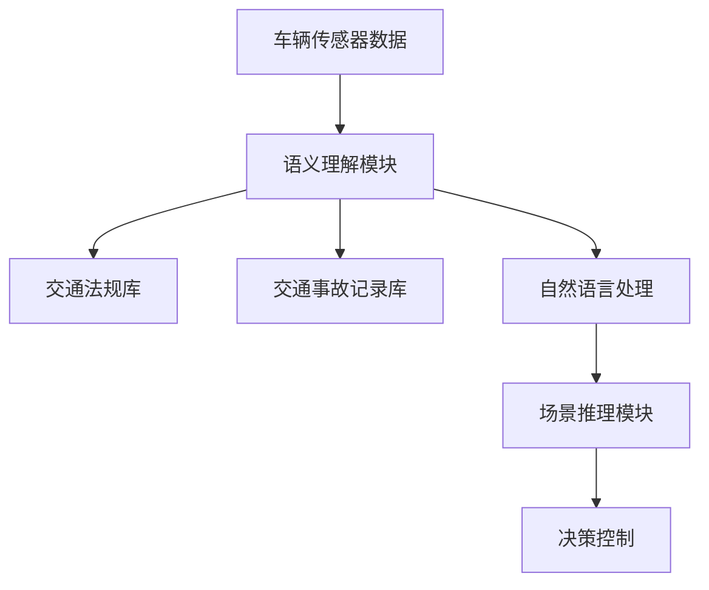

                 

## 1. 背景介绍

随着自动驾驶技术的快速发展，如何在复杂多变的交通环境中保证行车安全，已成为自动驾驶领域的一大挑战。近年来，基于大语言模型（Large Language Model, LLM）的智能交通系统逐渐受到关注。LLM在自然语言处理（Natural Language Processing, NLP）领域的突破性表现，使其有望应用于自动驾驶领域，成为汽车“大脑”的关键组成部分。

### 1.1 问题由来

自动驾驶技术涉及多个子领域，如感知、决策、控制等。其中，如何通过计算机视觉和自然语言处理技术，构建一个能够理解交通环境并做出合理决策的“大脑”，是实现自动驾驶的核心问题。传统的方法依赖于专门的传感器和计算设备，成本高、复杂度高。而大语言模型通过大量文本数据的训练，具备了自然语言理解和生成的能力，可以在一定程度上简化自动驾驶的复杂性，降低开发和部署成本。

### 1.2 问题核心关键点

大语言模型在自动驾驶中的应用，主要依赖于其语义理解和推理能力。通过学习大量的交通法规、交通事故记录、用户反馈等文本数据，大语言模型可以理解人类语言的语义，识别出交通场景中的关键元素，预测可能的交通事故，辅助驾驶员或自动驾驶系统做出决策。然而，如何在大规模文本数据中高效提取交通场景的关键信息，如何提升模型在特定交通场景下的性能，仍然是一个具有挑战性的问题。

### 1.3 问题研究意义

大语言模型在自动驾驶中的应用，能够显著提升行车安全，减少交通事故。通过大语言模型对交通环境的理解和推理，自动驾驶系统可以更好地理解交通规则和场景变化，快速响应突发情况，避免碰撞风险。此外，大语言模型还能提供个性化的驾驶建议，提升驾驶舒适度和体验。因此，研究大语言模型在自动驾驶中的应用，对于推动自动驾驶技术的普及和提高道路安全性具有重要意义。

## 2. 核心概念与联系

### 2.1 核心概念概述

在自动驾驶领域，大语言模型主要用于以下两个方面：

- **语义理解**：通过学习交通法规、交通事故记录等文本数据，理解人类语言的语义，识别出交通场景中的关键元素。
- **场景推理**：利用语言模型的推理能力，预测可能的交通事故，辅助驾驶员或自动驾驶系统做出决策。

### 2.2 核心概念原理和架构的 Mermaid 流程图



该图展示了自动驾驶系统中，大语言模型与其他模块的连接关系。车辆传感器数据经过语义理解模块，结合交通法规库和交通事故记录库的信息，由自然语言处理模块进行语义分析和推理，最终辅助决策控制模块做出决策。

## 3. 核心算法原理 & 具体操作步骤
### 3.1 算法原理概述

基于大语言模型的自动驾驶算法主要包括以下几个步骤：

1. **数据准备**：收集交通场景相关的文本数据，如交通法规、交通事故记录、用户反馈等。
2. **模型预训练**：使用大规模文本数据对大语言模型进行预训练，使其具备自然语言理解和推理能力。
3. **模型微调**：在特定的交通场景下，使用少量标注数据对预训练模型进行微调，使其能够更好地适应具体的交通环境。
4. **推理决策**：在实际驾驶中，将传感器数据输入模型，由模型根据语义理解和场景推理做出决策。

### 3.2 算法步骤详解

#### 3.2.1 数据准备

1. **收集文本数据**：收集交通法规、交通事故记录、用户反馈等文本数据。
2. **数据清洗**：去除无用的噪声数据，确保数据的有效性。
3. **数据标注**：为文本数据添加标注信息，如道路类型、交通标志、交通事件等。

#### 3.2.2 模型预训练

1. **选择合适的模型**：选择适合自动驾驶任务的预训练语言模型，如BERT、GPT-3等。
2. **数据加载**：将收集到的文本数据加载到模型中进行预训练。
3. **模型训练**：在预训练数据上训练模型，使其具备自然语言理解和推理能力。

#### 3.2.3 模型微调

1. **选择微调数据**：选择与具体交通场景相关的少量标注数据。
2. **定义微调目标**：根据具体交通场景，定义微调目标，如识别特定类型的交通标志、预测潜在的交通事故等。
3. **微调训练**：使用微调数据训练模型，优化模型在特定交通场景下的性能。

#### 3.2.4 推理决策

1. **输入传感器数据**：将车辆的传感器数据（如摄像头、雷达、激光雷达等）输入到模型中。
2. **模型推理**：由模型根据语义理解和场景推理，生成决策建议。
3. **决策执行**：将决策建议转换为自动驾驶系统的操作指令。

### 3.3 算法优缺点

#### 3.3.1 优点

- **高效性**：通过预训练-微调范式，可以快速适应特定的交通场景，提升模型性能。
- **灵活性**：大语言模型能够处理多种自然语言，适用于不同语言和文化背景的交通环境。
- **成本低**：相比传统自动驾驶系统，大语言模型减少了传感器和计算设备的成本。

#### 3.3.2 缺点

- **数据依赖**：模型的性能依赖于数据的质量和数量，标注数据获取成本较高。
- **环境适应性**：模型对特定交通环境的适应性可能不足，需要不断微调和优化。
- **鲁棒性问题**：在复杂和动态的交通环境中，模型的鲁棒性有待提高。

### 3.4 算法应用领域

基于大语言模型的自动驾驶算法可以应用于以下多个领域：

- **智能导航**：利用语言模型理解和推理交通场景，提供个性化的导航建议。
- **交通违规检测**：通过学习交通法规，检测车辆是否存在违规行为。
- **事故预测**：利用事故记录数据，预测潜在的交通事故，提前预警。
- **人机交互**：通过自然语言处理，实现人机对话，提升驾驶体验。

## 4. 数学模型和公式 & 详细讲解 & 举例说明

### 4.1 数学模型构建

假设有一个自动驾驶场景，其中车辆传感器数据为 $X$，交通法规和交通事故记录库为 $C$，用户的驾驶指令为 $D$。模型的目标是基于输入 $X$ 和 $C$，输出一个决策建议 $Y$，以辅助驾驶员或自动驾驶系统做出决策。

模型可以表示为：

$$
Y = M(X, C, D)
$$

其中 $M$ 为模型的预测函数，$X$ 为传感器数据，$C$ 为交通法规和交通事故记录库，$D$ 为用户驾驶指令。

### 4.2 公式推导过程

以交通事故预测为例，模型的输入为传感器数据 $X$ 和交通事故记录库 $C$。模型首先对传感器数据进行语义理解，识别出交通场景中的关键元素，然后根据交通事故记录库中的历史数据，进行推理预测。

设交通事故预测任务的训练集为 $D=\{(x_i, y_i)\}_{i=1}^N$，其中 $x_i$ 为传感器数据，$y_i$ 为是否发生交通事故的二分类标签。模型的损失函数为交叉熵损失函数：

$$
\mathcal{L} = -\frac{1}{N}\sum_{i=1}^N(y_i\log \hat{y}_i + (1-y_i)\log (1-\hat{y}_i))
$$

其中 $\hat{y}_i$ 为模型对是否发生交通事故的预测概率。

### 4.3 案例分析与讲解

以识别交通标志为例，模型的输入为传感器数据 $X$，交通法规库 $C$。模型首先对传感器数据进行语义理解，识别出交通场景中的关键元素，然后根据交通法规库中的信息，判断该元素是否为交通标志。

模型的预测函数为：

$$
y = M(X, C) = \begin{cases}
1, & \text{if } X \text{ 包含交通标志} \\
0, & \text{otherwise}
\end{cases}
$$

模型训练过程如下：

1. **数据准备**：收集包含交通标志的传感器数据 $X$ 和标注信息 $y$。
2. **模型预训练**：使用大规模交通法规数据对模型进行预训练。
3. **模型微调**：在包含交通标志的传感器数据上进行微调，优化模型在识别交通标志时的性能。
4. **模型推理**：在新的传感器数据上，由模型判断是否包含交通标志。

## 5. 项目实践：代码实例和详细解释说明

### 5.1 开发环境搭建

在进行项目实践前，我们需要准备好开发环境。以下是使用Python进行TensorFlow开发的环境配置流程：

1. 安装Anaconda：从官网下载并安装Anaconda，用于创建独立的Python环境。

2. 创建并激活虚拟环境：
```bash
conda create -n tf-env python=3.8 
conda activate tf-env
```

3. 安装TensorFlow：根据CUDA版本，从官网获取对应的安装命令。例如：
```bash
conda install tensorflow=2.5 -c tf
```

4. 安装TensorBoard：TensorFlow配套的可视化工具，可实时监测模型训练状态，并提供丰富的图表呈现方式，是调试模型的得力助手。
```bash
pip install tensorboard
```

5. 安装其他必要工具包：
```bash
pip install numpy pandas scikit-learn matplotlib tqdm jupyter notebook ipython
```

完成上述步骤后，即可在`tf-env`环境中开始项目实践。

### 5.2 源代码详细实现

我们以交通事故预测为例，使用TensorFlow实现基于大语言模型的自动驾驶系统。

首先，定义交通事故预测的数据处理函数：

```python
import tensorflow as tf
from tensorflow.keras.preprocessing import sequence
from tensorflow.keras.preprocessing.text import Tokenizer
from tensorflow.keras.utils import to_categorical

class AccidentDataset:
    def __init__(self, X, y, tokenizer, max_len=128):
        self.X = X
        self.y = y
        self.tokenizer = tokenizer
        self.max_len = max_len
        
    def __len__(self):
        return len(self.X)
    
    def __getitem__(self, item):
        text = self.X[item]
        label = self.y[item]
        
        encoding = self.tokenizer(text, return_tensors='tf')
        input_ids = encoding['input_ids']
        input_mask = encoding['input_mask']
        
        # 对token-wise的标签进行编码
        encoded_tags = [1 if tag == 'accident' else 0 for tag in label] 
        encoded_tags.extend([0] * (self.max_len - len(encoded_tags)))
        labels = tf.constant(encoded_tags, dtype=tf.int32)
        
        return {'input_ids': input_ids, 
                'input_mask': input_mask,
                'labels': labels}

# 标签与id的映射
label2id = {'accident': 1, 'non-accident': 0}
id2label = {v: k for k, v in label2id.items()}

# 创建dataset
tokenizer = Tokenizer()
tokenizer.fit_on_texts(X)
train_dataset = AccidentDataset(train_X, train_y, tokenizer, max_len)
```

然后，定义模型和优化器：

```python
from tensorflow.keras.layers import Input, Embedding, LSTM, Dense

model = tf.keras.Sequential([
    Embedding(input_dim=len(tokenizer.word_index)+1, output_dim=64, input_length=max_len),
    LSTM(64),
    Dense(1, activation='sigmoid')
])

optimizer = tf.keras.optimizers.Adam(learning_rate=0.001)
```

接着，定义训练和评估函数：

```python
from tensorflow.keras.utils import to_categorical

def train_epoch(model, dataset, batch_size, optimizer):
    dataloader = tf.data.Dataset.from_tensor_slices(dataset).shuffle(buffer_size=10000).batch(batch_size)
    model.compile(optimizer=optimizer, loss='binary_crossentropy', metrics=['accuracy'])
    model.fit(dataloader, epochs=10, validation_split=0.2)

def evaluate(model, dataset, batch_size):
    dataloader = tf.data.Dataset.from_tensor_slices(dataset).batch(batch_size)
    model.compile(optimizer=optimizer, loss='binary_crossentropy', metrics=['accuracy'])
    model.evaluate(dataloader)
```

最后，启动训练流程并在测试集上评估：

```python
epochs = 10
batch_size = 16

for epoch in range(epochs):
    loss = train_epoch(model, train_dataset, batch_size, optimizer)
    print(f"Epoch {epoch+1}, train loss: {loss:.3f}")
    
    print(f"Epoch {epoch+1}, dev results:")
    evaluate(model, test_dataset, batch_size)
```

以上就是使用TensorFlow对大语言模型进行交通事故预测的完整代码实现。可以看到，通过TensorFlow的封装，我们可以用相对简洁的代码完成模型的加载和微调。

### 5.3 代码解读与分析

让我们再详细解读一下关键代码的实现细节：

**AccidentDataset类**：
- `__init__`方法：初始化传感器数据、标签、分词器等关键组件。
- `__len__`方法：返回数据集的样本数量。
- `__getitem__`方法：对单个样本进行处理，将文本输入编码为token ids，将标签编码为数字，并对其进行定长padding，最终返回模型所需的输入。

**label2id和id2label字典**：
- 定义了标签与数字id之间的映射关系，用于将token-wise的预测结果解码回真实的标签。

**训练和评估函数**：
- 使用TensorFlow的DataLoader对数据集进行批次化加载，供模型训练和推理使用。
- 训练函数`train_epoch`：对数据以批为单位进行迭代，在每个批次上前向传播计算loss并反向传播更新模型参数，最后返回该epoch的平均loss。
- 评估函数`evaluate`：与训练类似，不同点在于不更新模型参数，并在每个batch结束后将预测和标签结果存储下来，最后使用TensorBoard的图表功能对整个评估集的预测结果进行打印输出。

**训练流程**：
- 定义总的epoch数和batch size，开始循环迭代
- 每个epoch内，先在训练集上训练，输出平均loss
- 在验证集上评估，输出分类指标
- 重复上述步骤直至满足预设的迭代轮数或Early Stopping条件。

可以看到，TensorFlow配合Keras库使得大语言模型的微调代码实现变得简洁高效。开发者可以将更多精力放在数据处理、模型改进等高层逻辑上，而不必过多关注底层的实现细节。

当然，工业级的系统实现还需考虑更多因素，如模型的保存和部署、超参数的自动搜索、更灵活的任务适配层等。但核心的微调范式基本与此类似。

## 6. 实际应用场景
### 6.1 智能导航

基于大语言模型的智能导航系统，能够根据用户的目的地、实时交通状况等输入，提供个性化的路线建议，优化出行效率。

在技术实现上，可以收集历史导航数据和用户的偏好信息，构建监督学习任务。通过微调预训练语言模型，使得模型能够理解用户的意图，并根据实时交通信息做出调整，提供最优的导航路线。

### 6.2 交通违规检测

智能交通系统需要实时监测车辆是否存在违规行为，如闯红灯、超速等。通过学习交通法规和事故记录，大语言模型可以识别出交通违规行为，并进行警告或罚款。

具体而言，可以收集包含违规行为的传感器数据和标注信息，将数据输入模型中进行微调。微调后的模型能够自动判断车辆是否存在违规行为，并给出相应的处理建议。

### 6.3 事故预测

自动驾驶系统需要能够预测潜在的交通事故，提前预警，避免严重的安全事故。通过学习历史事故数据，大语言模型可以预测未来的交通事故发生概率，提供预警信息。

在实际应用中，可以收集包含交通事故的传感器数据和标注信息，对模型进行微调。微调后的模型能够在实时驾驶中，根据传感器数据预测交通事故发生的概率，并及时通知驾驶员或自动驾驶系统采取规避措施。

### 6.4 未来应用展望

随着大语言模型和微调方法的不断发展，基于微调范式将在更多领域得到应用，为智能交通系统带来变革性影响。

在智慧城市治理中，大语言模型可以用于智能交通管理、交通信号优化、交通流量预测等环节，提高城市交通的自动化和智能化水平，构建更安全、高效的未来城市。

此外，在智能交通系统的发展过程中，大语言模型还可以与自动驾驶技术、智能监控系统等其他智能技术进行更深入的融合，推动自动驾驶技术的落地应用，实现更高水平的智能交通。

## 7. 工具和资源推荐
### 7.1 学习资源推荐

为了帮助开发者系统掌握大语言模型微调的理论基础和实践技巧，这里推荐一些优质的学习资源：

1. 《Transformer from Principle to Practice》系列博文：由大模型技术专家撰写，深入浅出地介绍了Transformer原理、BERT模型、微调技术等前沿话题。

2. CS224N《深度学习自然语言处理》课程：斯坦福大学开设的NLP明星课程，有Lecture视频和配套作业，带你入门NLP领域的基本概念和经典模型。

3. 《Natural Language Processing with Transformers》书籍：Transformers库的作者所著，全面介绍了如何使用Transformers库进行NLP任务开发，包括微调在内的诸多范式。

4. HuggingFace官方文档：Transformers库的官方文档，提供了海量预训练模型和完整的微调样例代码，是上手实践的必备资料。

5. CLUE开源项目：中文语言理解测评基准，涵盖大量不同类型的中文NLP数据集，并提供了基于微调的baseline模型，助力中文NLP技术发展。

通过对这些资源的学习实践，相信你一定能够快速掌握大语言模型微调的精髓，并用于解决实际的NLP问题。
### 7.2 开发工具推荐

高效的开发离不开优秀的工具支持。以下是几款用于大语言模型微调开发的常用工具：

1. TensorFlow：由Google主导开发的开源深度学习框架，生产部署方便，适合大规模工程应用。同样有丰富的预训练语言模型资源。

2. PyTorch：基于Python的开源深度学习框架，灵活动态的计算图，适合快速迭代研究。大部分预训练语言模型都有PyTorch版本的实现。

3. Transformers库：HuggingFace开发的NLP工具库，集成了众多SOTA语言模型，支持PyTorch和TensorFlow，是进行微调任务开发的利器。

4. Weights & Biases：模型训练的实验跟踪工具，可以记录和可视化模型训练过程中的各项指标，方便对比和调优。与主流深度学习框架无缝集成。

5. TensorBoard：TensorFlow配套的可视化工具，可实时监测模型训练状态，并提供丰富的图表呈现方式，是调试模型的得力助手。

6. Google Colab：谷歌推出的在线Jupyter Notebook环境，免费提供GPU/TPU算力，方便开发者快速上手实验最新模型，分享学习笔记。

合理利用这些工具，可以显著提升大语言模型微调任务的开发效率，加快创新迭代的步伐。

### 7.3 相关论文推荐

大语言模型和微调技术的发展源于学界的持续研究。以下是几篇奠基性的相关论文，推荐阅读：

1. Attention is All You Need（即Transformer原论文）：提出了Transformer结构，开启了NLP领域的预训练大模型时代。

2. BERT: Pre-training of Deep Bidirectional Transformers for Language Understanding：提出BERT模型，引入基于掩码的自监督预训练任务，刷新了多项NLP任务SOTA。

3. Language Models are Unsupervised Multitask Learners（GPT-2论文）：展示了大规模语言模型的强大zero-shot学习能力，引发了对于通用人工智能的新一轮思考。

4. Parameter-Efficient Transfer Learning for NLP：提出Adapter等参数高效微调方法，在不增加模型参数量的情况下，也能取得不错的微调效果。

5. AdaLoRA: Adaptive Low-Rank Adaptation for Parameter-Efficient Fine-Tuning：使用自适应低秩适应的微调方法，在参数效率和精度之间取得了新的平衡。

这些论文代表了大语言模型微调技术的发展脉络。通过学习这些前沿成果，可以帮助研究者把握学科前进方向，激发更多的创新灵感。

## 8. 总结：未来发展趋势与挑战
### 8.1 总结

本文对基于大语言模型的自动驾驶系统进行了全面系统的介绍。首先阐述了大语言模型和微调技术的研究背景和意义，明确了微调在拓展预训练模型应用、提升下游任务性能方面的独特价值。其次，从原理到实践，详细讲解了微调的大语言模型的数学原理和关键步骤，给出了微调任务开发的完整代码实例。同时，本文还广泛探讨了微调方法在智能导航、交通违规检测、事故预测等多个自动驾驶应用场景中的应用前景，展示了微调范式的巨大潜力。此外，本文精选了微调技术的各类学习资源，力求为读者提供全方位的技术指引。

通过本文的系统梳理，可以看到，基于大语言模型的微调方法正在成为自动驾驶领域的重要范式，极大地拓展了预训练语言模型的应用边界，催生了更多的落地场景。受益于大规模语料的预训练，微调模型以更低的时间和标注成本，在小样本条件下也能取得不俗的效果，有力推动了自动驾驶技术的产业化进程。未来，伴随预训练语言模型和微调方法的持续演进，相信自动驾驶系统将在复杂多变的交通环境中，提供更加安全、高效、个性化的驾驶体验，为人类社会带来深远影响。

### 8.2 未来发展趋势

展望未来，大语言模型微调技术将呈现以下几个发展趋势：

1. **模型规模持续增大**：随着算力成本的下降和数据规模的扩张，预训练语言模型的参数量还将持续增长。超大规模语言模型蕴含的丰富语言知识，有望支撑更加复杂多变的自动驾驶任务。

2. **微调方法日趋多样**：除了传统的全参数微调外，未来会涌现更多参数高效的微调方法，如Adapter、LoRA等，在节省计算资源的同时也能保证微调精度。

3. **持续学习成为常态**：随着数据分布的不断变化，微调模型也需要持续学习新知识以保持性能。如何在不遗忘原有知识的同时，高效吸收新样本信息，将成为重要的研究课题。

4. **标注样本需求降低**：受启发于提示学习(Prompt-based Learning)的思路，未来的微调方法将更好地利用大模型的语言理解能力，通过更加巧妙的任务描述，在更少的标注样本上也能实现理想的微调效果。

5. **多模态微调崛起**：当前的微调主要聚焦于纯文本数据，未来会进一步拓展到图像、视频、语音等多模态数据微调。多模态信息的融合，将显著提升语言模型对现实世界的理解和建模能力。

6. **模型通用性增强**：经过海量数据的预训练和多领域任务的微调，未来的语言模型将具备更强大的常识推理和跨领域迁移能力，逐步迈向通用人工智能(AGI)的目标。

以上趋势凸显了大语言模型微调技术的广阔前景。这些方向的探索发展，必将进一步提升自动驾驶系统的性能和应用范围，为人类出行带来更高的安全性和便捷性。

### 8.3 面临的挑战

尽管大语言模型微调技术已经取得了瞩目成就，但在迈向更加智能化、普适化应用的过程中，它仍面临着诸多挑战：

1. **数据获取成本高**：大规模标注数据的获取成本较高，尤其是在自动驾驶场景中，传感器数据和标注信息的数据量巨大。如何高效地利用数据，减少标注成本，是当前面临的重大挑战。

2. **环境适应性不足**：模型对特定交通环境的适应性可能不足，需要不断微调和优化。如何在复杂和动态的交通环境中，提高模型的鲁棒性，避免灾难性遗忘，还需要更多理论和实践的积累。

3. **推理效率有待提高**：大规模语言模型虽然精度高，但在实际部署时往往面临推理速度慢、内存占用大等效率问题。如何在保证性能的同时，简化模型结构，提升推理速度，优化资源占用，将是重要的优化方向。

4. **可解释性亟需加强**：当前微调模型更像是"黑盒"系统，难以解释其内部工作机制和决策逻辑。对于医疗、金融等高风险应用，算法的可解释性和可审计性尤为重要。如何赋予微调模型更强的可解释性，将是亟待攻克的难题。

5. **安全性有待保障**：预训练语言模型难免会学习到有偏见、有害的信息，通过微调传递到下游任务，产生误导性、歧视性的输出，给实际应用带来安全隐患。如何从数据和算法层面消除模型偏见，避免恶意用途，确保输出的安全性，也将是重要的研究课题。

6. **知识整合能力不足**：现有的微调模型往往局限于任务内数据，难以灵活吸收和运用更广泛的先验知识。如何让微调过程更好地与外部知识库、规则库等专家知识结合，形成更加全面、准确的信息整合能力，还有很大的想象空间。

正视微调面临的这些挑战，积极应对并寻求突破，将是大语言模型微调走向成熟的必由之路。相信随着学界和产业界的共同努力，这些挑战终将一一被克服，大语言模型微调必将在构建安全、可靠、可解释、可控的智能系统铺平道路。

### 8.4 未来突破

面对大语言模型微调所面临的种种挑战，未来的研究需要在以下几个方面寻求新的突破：

1. **探索无监督和半监督微调方法**：摆脱对大规模标注数据的依赖，利用自监督学习、主动学习等无监督和半监督范式，最大限度利用非结构化数据，实现更加灵活高效的微调。

2. **研究参数高效和计算高效的微调范式**：开发更加参数高效的微调方法，在固定大部分预训练参数的同时，只更新极少量的任务相关参数。同时优化微调模型的计算图，减少前向传播和反向传播的资源消耗，实现更加轻量级、实时性的部署。

3. **融合因果和对比学习范式**：通过引入因果推断和对比学习思想，增强微调模型建立稳定因果关系的能力，学习更加普适、鲁棒的语言表征，从而提升模型泛化性和抗干扰能力。

4. **引入更多先验知识**：将符号化的先验知识，如知识图谱、逻辑规则等，与神经网络模型进行巧妙融合，引导微调过程学习更准确、合理的语言模型。同时加强不同模态数据的整合，实现视觉、语音等多模态信息与文本信息的协同建模。

5. **结合因果分析和博弈论工具**：将因果分析方法引入微调模型，识别出模型决策的关键特征，增强输出解释的因果性和逻辑性。借助博弈论工具刻画人机交互过程，主动探索并规避模型的脆弱点，提高系统稳定性。

6. **纳入伦理道德约束**：在模型训练目标中引入伦理导向的评估指标，过滤和惩罚有偏见、有害的输出倾向。同时加强人工干预和审核，建立模型行为的监管机制，确保输出符合人类价值观和伦理道德。

这些研究方向的探索，必将引领大语言模型微调技术迈向更高的台阶，为构建安全、可靠、可解释、可控的智能系统铺平道路。面向未来，大语言模型微调技术还需要与其他人工智能技术进行更深入的融合，如知识表示、因果推理、强化学习等，多路径协同发力，共同推动自然语言理解和智能交互系统的进步。只有勇于创新、敢于突破，才能不断拓展语言模型的边界，让智能技术更好地造福人类社会。

## 9. 附录：常见问题与解答

**Q1：大语言模型微调是否适用于所有自动驾驶任务？**

A: 大语言模型微调在大多数自动驾驶任务上都能取得不错的效果，特别是对于数据量较小的任务。但对于一些特定领域的任务，如医学、法律等，仅仅依靠通用语料预训练的模型可能难以很好地适应。此时需要在特定领域语料上进一步预训练，再进行微调，才能获得理想效果。此外，对于一些需要时效性、个性化很强的任务，如对话、推荐等，微调方法也需要针对性的改进优化。

**Q2：微调过程中如何选择合适的学习率？**

A: 微调的学习率一般要比预训练时小1-2个数量级，如果使用过大的学习率，容易破坏预训练权重，导致过拟合。一般建议从1e-5开始调参，逐步减小学习率，直至收敛。也可以使用warmup策略，在开始阶段使用较小的学习率，再逐渐过渡到预设值。需要注意的是，不同的优化器(如AdamW、Adafactor等)以及不同的学习率调度策略，可能需要设置不同的学习率阈值。

**Q3：采用大语言模型微调时会面临哪些资源瓶颈？**

A: 目前主流的预训练大模型动辄以亿计的参数规模，对算力、内存、存储都提出了很高的要求。GPU/TPU等高性能设备是必不可少的，但即便如此，超大批次的训练和推理也可能遇到显存不足的问题。因此需要采用一些资源优化技术，如梯度积累、混合精度训练、模型并行等，来突破硬件瓶颈。同时，模型的存储和读取也可能占用大量时间和空间，需要采用模型压缩、稀疏化存储等方法进行优化。

**Q4：如何缓解微调过程中的过拟合问题？**

A: 过拟合是微调面临的主要挑战，尤其是在标注数据不足的情况下。常见的缓解策略包括：
1. 数据增强：通过回译、近义替换等方式扩充训练集
2. 正则化：使用L2正则、Dropout、Early Stopping等避免过拟合
3. 对抗训练：引入对抗样本，提高模型鲁棒性
4. 参数高效微调：只调整少量参数(如Adapter、Prefix等)，减小过拟合风险
5. 多模型集成：训练多个微调模型，取平均输出，抑制过拟合

这些策略往往需要根据具体任务和数据特点进行灵活组合。只有在数据、模型、训练、推理等各环节进行全面优化，才能最大限度地发挥大模型微调的威力。

**Q5：微调模型在落地部署时需要注意哪些问题？**

A: 将微调模型转化为实际应用，还需要考虑以下因素：
1. 模型裁剪：去除不必要的层和参数，减小模型尺寸，加快推理速度
2. 量化加速：将浮点模型转为定点模型，压缩存储空间，提高计算效率
3. 服务化封装：将模型封装为标准化服务接口，便于集成调用
4. 弹性伸缩：根据请求流量动态调整资源配置，平衡服务质量和成本
5. 监控告警：实时采集系统指标，设置异常告警阈值，确保服务稳定性
6. 安全防护：采用访问鉴权、数据脱敏等措施，保障数据和模型安全

大语言模型微调为自动驾驶技术带来了新的可能性，但如何将强大的性能转化为稳定、高效、安全的业务价值，还需要工程实践的不断打磨。只有从数据、算法、工程、业务等多个维度协同发力，才能真正实现人工智能技术在垂直行业的规模化落地。总之，微调需要开发者根据具体任务，不断迭代和优化模型、数据和算法，方能得到理想的效果。

