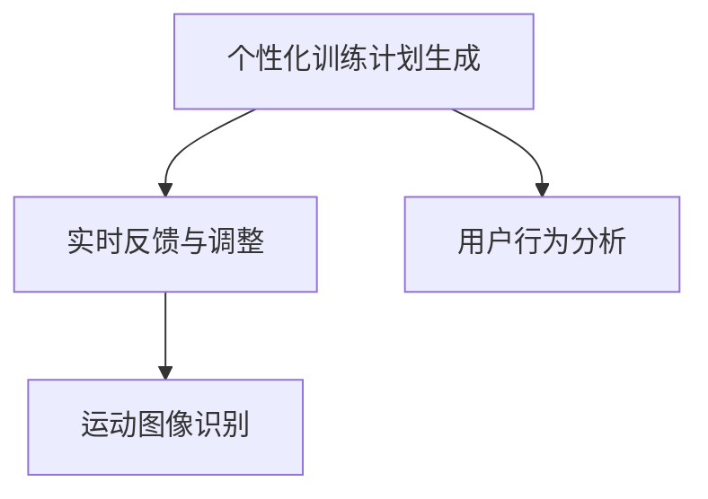

                 

# 虚拟健身教练创业：AI驱动的个人训练

## 1. 背景介绍

### 1.1 问题由来

随着生活水平的提高，人们对健康和健身的关注度不断上升。然而，传统健身方式面临诸多挑战：昂贵的私人教练费用、时间和地点的限制、缺乏个性化的训练计划、难以坚持长期锻炼等。面对这些问题，虚拟健身教练应运而生，成为一种便捷、高效、个性化的健身解决方案。

虚拟健身教练利用AI技术，为每个用户定制个性化的训练计划，并实时监测其训练效果，提供实时反馈和调整。通过数据驱动的方式，虚拟健身教练能够实现真正的"一对一"个性化训练，使用户在家就能享受到专业健身教练的服务。

### 1.2 问题核心关键点

虚拟健身教练的核心技术包括：
1. **个性化训练计划生成**：根据用户数据（如身体指标、运动偏好、训练历史等），利用AI算法生成个性化的训练计划。
2. **实时反馈与调整**：通过传感器、摄像头等设备实时监测用户训练数据（如心率、动作质量、运动轨迹等），及时调整训练强度和计划。
3. **用户行为分析**：通过分析用户的训练数据和反馈，持续优化训练计划，提高训练效果。

这些技术不仅需要深度学习和计算机视觉等AI技术支撑，还需要系统架构、硬件集成等多方面合作。本文将详细介绍虚拟健身教练的实现原理和操作步骤，为AI驱动的个人训练提供全面指导。

## 2. 核心概念与联系

### 2.1 核心概念概述

为更好地理解虚拟健身教练的实现原理，本节将介绍几个关键概念：

- **虚拟健身教练**：一种基于AI技术的个人健身教练，能够根据用户数据生成个性化训练计划，实时监测用户训练效果，提供个性化反馈和调整。
- **个性化训练计划生成**：通过AI算法，根据用户数据（如身体指标、运动偏好、训练历史等）生成个性化的训练计划。
- **实时反馈与调整**：利用传感器、摄像头等设备实时监测用户训练数据，及时调整训练强度和计划，提升训练效果。
- **用户行为分析**：通过分析用户训练数据和反馈，持续优化训练计划，提高用户满意度。
- **运动图像识别**：通过计算机视觉技术，识别和分析用户训练动作的质量和轨迹，提供运动纠正和改进建议。

这些概念之间的逻辑关系可以通过以下Mermaid流程图来展示：



这个流程图展示了个性化训练计划生成的核心流程，即通过用户数据生成计划，并实时监测和调整训练过程，同时分析用户行为以优化计划。

## 3. 核心算法原理 & 具体操作步骤
### 3.1 算法原理概述

虚拟健身教练的核心算法原理主要包括深度学习、计算机视觉、数据处理等技术。其中，深度学习用于训练个性化训练计划生成模型，计算机视觉用于实时监测和运动图像识别，数据处理用于用户行为分析和训练计划优化。

### 3.2 算法步骤详解

**Step 1: 数据收集与预处理**

- **数据收集**：通过传感器、摄像头等设备收集用户的身体指标（如身高、体重、心率等）、运动数据（如动作轨迹、时间、频率等）、反馈数据（如用户满意度、疲劳度等）。
- **数据预处理**：对收集到的数据进行清洗、去噪、归一化等预处理，以提高后续模型训练的效率和效果。

**Step 2: 个性化训练计划生成**

- **模型选择**：选择适合的深度学习模型（如RNN、CNN等），用于根据用户数据生成个性化训练计划。
- **特征提取**：将用户数据转化为模型所需的特征向量，如将身体指标、运动偏好转化为数字表示。
- **模型训练**：使用收集到的用户数据，对模型进行训练，使其能够生成个性化的训练计划。
- **计划生成**：根据训练好的模型，生成个性化的训练计划，包括训练内容、强度、频率等。

**Step 3: 实时反馈与调整**

- **传感器集成**：将心率监测器、加速度计、陀螺仪等传感器集成到用户的健身设备中，实时监测用户的训练数据。
- **运动图像识别**：使用计算机视觉技术（如深度学习模型），对用户训练动作进行图像识别和分析，判断动作质量和轨迹。
- **反馈与调整**：根据实时监测数据和运动图像识别结果，实时调整训练强度和计划，提供个性化反馈。

**Step 4: 用户行为分析**

- **数据聚合**：将用户的训练数据和反馈数据进行聚合，统计用户在不同训练阶段的表现和满意度。
- **行为建模**：使用深度学习模型对用户行为进行建模，识别用户偏好的训练方式和时间段。
- **计划优化**：根据用户行为分析结果，持续优化训练计划，提高用户满意度和训练效果。

**Step 5: 系统部署与迭代**

- **系统集成**：将训练计划生成、实时反馈与调整、用户行为分析等模块集成到统一的系统平台中。
- **用户界面设计**：设计友好的用户界面，方便用户查看训练计划、反馈数据和调整建议。
- **系统部署**：将系统部署到云端或本地服务器，提供稳定、可靠的训练服务。
- **用户反馈收集**：通过问卷调查、用户反馈等方式收集用户的使用体验和建议，持续迭代优化系统。

### 3.3 算法优缺点

虚拟健身教练的优点包括：
1. **个性化训练**：根据用户数据生成个性化训练计划，提高训练效果。
2. **实时监测**：实时监测用户训练数据，及时调整训练计划。
3. **用户满意度**：通过个性化反馈和调整，提高用户满意度。
4. **便捷性**：无需前往健身房，在家即可享受专业训练。

其缺点包括：
1. **成本较高**：需要集成多种传感器和计算机视觉设备，初始成本较高。
2. **技术门槛高**：涉及深度学习、计算机视觉等多项技术，技术门槛较高。
3. **隐私问题**：需要收集和处理大量用户数据，隐私保护需高度重视。
4. **数据质量**：传感器数据和运动图像质量直接影响训练效果，需保证数据准确性。

尽管存在这些缺点，虚拟健身教练仍然具备广阔的应用前景，为健身行业带来了革命性的变化。

### 3.4 算法应用领域

虚拟健身教练在多个领域均有应用，包括：

- **家庭健身**：为家庭用户提供个性化的训练计划，实时监测和反馈。
- **企业健康**：为企业员工提供健康管理服务，提升员工健康水平。
- **康复训练**：为康复病人提供个性化的训练计划，帮助其恢复健康。
- **儿童健身**：为儿童提供安全的健身指导，促进其健康成长。

此外，虚拟健身教练还适用于老年人群体、残障人士等特殊群体，为他们提供便捷、安全的健身服务。

## 4. 数学模型和公式 & 详细讲解  
### 4.1 数学模型构建

虚拟健身教练的数学模型主要涉及深度学习、计算机视觉和数据处理等领域。以下是几个核心模型的构建方法：

**个性化训练计划生成模型**：
- 选择深度学习模型（如LSTM、GRU等），将用户数据（如身体指标、运动偏好等）作为输入，生成训练计划。
- 训练数据集包含用户历史数据和专家制定的标准训练计划，目标是最小化模型生成的计划与标准计划之间的差距。

**实时反馈与调整模型**：
- 使用计算机视觉技术（如CNN、RNN等），对用户训练动作进行图像识别和分析。
- 将识别结果与预设的标准动作进行对比，判断动作质量和轨迹。
- 根据识别结果，实时调整训练强度和计划。

**用户行为分析模型**：
- 使用深度学习模型（如RNN、LSTM等），对用户训练数据和反馈数据进行聚合和建模。
- 通过分析用户行为，识别用户偏好的训练方式和时间段。
- 根据行为分析结果，持续优化训练计划。

### 4.2 公式推导过程

以下是对虚拟健身教练核心模型的数学推导：

**个性化训练计划生成模型**：
- 假设用户数据为 $x$，生成训练计划为 $y$，目标是最小化损失函数 $L(y, y_{std})$，其中 $y_{std}$ 为标准计划。
- 使用深度学习模型 $f$，将用户数据 $x$ 映射到训练计划 $y$，即 $y = f(x)$。
- 损失函数为 $L(y, y_{std}) = \frac{1}{N} \sum_{i=1}^N (y_i - y_{std_i})^2$，其中 $N$ 为训练数据集大小。
- 使用反向传播算法求解模型参数 $\theta$，最小化损失函数 $L(y, y_{std})$。

**实时反馈与调整模型**：
- 假设用户动作图像为 $I$，识别结果为 $z$，目标是最小化识别误差 $M(z, I_{std})$，其中 $I_{std}$ 为标准动作图像。
- 使用计算机视觉模型 $g$，将动作图像 $I$ 映射到识别结果 $z$，即 $z = g(I)$。
- 损失函数为 $M(z, I_{std}) = \frac{1}{N} \sum_{i=1}^N \| z_i - I_{std_i} \|^2$，其中 $N$ 为动作图像集大小。
- 使用反向传播算法求解模型参数 $\phi$，最小化识别误差 $M(z, I_{std})$。

**用户行为分析模型**：
- 假设用户行为数据为 $S$，行为分析结果为 $U$，目标是最小化行为预测误差 $Q(U, S_{std})$，其中 $S_{std}$ 为标准行为数据。
- 使用深度学习模型 $h$，将行为数据 $S$ 映射到分析结果 $U$，即 $U = h(S)$。
- 损失函数为 $Q(U, S_{std}) = \frac{1}{N} \sum_{i=1}^N \| U_i - S_{std_i} \|^2$，其中 $N$ 为行为数据集大小。
- 使用反向传播算法求解模型参数 $\psi$，最小化行为预测误差 $Q(U, S_{std})$。

### 4.3 案例分析与讲解

**案例1：个性化训练计划生成**

假设某用户数据为 $x = [身高, 体重, 运动偏好]$，训练数据集为 $D = \{(x_i, y_i)\}_{i=1}^N$，其中 $y_i$ 为标准训练计划。

使用LSTM模型 $f$，将用户数据 $x$ 映射到训练计划 $y$，即 $y = f(x)$。

假设模型参数为 $\theta$，则生成训练计划的过程为：
- 对每个训练样本 $(x_i, y_i)$，计算预测值 $\hat{y_i} = f(x_i; \theta)$。
- 计算损失函数 $L(\hat{y_i}, y_i) = (y_i - \hat{y_i})^2$。
- 使用反向传播算法更新模型参数 $\theta$，最小化损失函数 $L(\hat{y_i}, y_i)$。

最终，模型能够根据用户数据生成个性化训练计划 $y$。

**案例2：实时反馈与调整**

假设某用户动作图像为 $I$，标准动作图像为 $I_{std}$。

使用CNN模型 $g$，将动作图像 $I$ 映射到识别结果 $z$，即 $z = g(I)$。

假设模型参数为 $\phi$，则实时反馈与调整的过程为：
- 对每个动作图像 $I_i$，计算识别结果 $\hat{z_i} = g(I_i; \phi)$。
- 计算识别误差 $M(\hat{z_i}, I_{std_i}) = \| \hat{z_i} - I_{std_i} \|^2$。
- 使用反向传播算法更新模型参数 $\phi$，最小化识别误差 $M(\hat{z_i}, I_{std_i})$。

最终，模型能够实时监测用户动作，并根据识别结果调整训练计划。

## 5. 项目实践：代码实例和详细解释说明
### 5.1 开发环境搭建

在进行虚拟健身教练的开发前，我们需要准备好开发环境。以下是使用Python进行TensorFlow开发的环境配置流程：

1. 安装Anaconda：从官网下载并安装Anaconda，用于创建独立的Python环境。

2. 创建并激活虚拟环境：
```bash
conda create -n tf-env python=3.8 
conda activate tf-env
```

3. 安装TensorFlow：根据CUDA版本，从官网获取对应的安装命令。例如：
```bash
conda install tensorflow-gpu -c pytorch -c conda-forge
```

4. 安装OpenCV：
```bash
pip install opencv-python
```

5. 安装TensorBoard：
```bash
pip install tensorboard
```

6. 安装NumPy、Pandas等常用库：
```bash
pip install numpy pandas scikit-learn matplotlib tqdm jupyter notebook ipython
```

完成上述步骤后，即可在`tf-env`环境中开始虚拟健身教练的开发实践。

### 5.2 源代码详细实现

下面以虚拟健身教练的训练计划生成和实时反馈模块为例，给出使用TensorFlow实现的核心代码。

**训练计划生成模块**

```python
import tensorflow as tf
from tensorflow.keras import layers

# 定义LSTM模型
class LSTMModel(tf.keras.Model):
    def __init__(self, input_dim, output_dim):
        super(LSTMModel, self).__init__()
        self.lstm = layers.LSTM(units=64, return_sequences=True, input_shape=(input_dim,))
        self.dense = layers.Dense(units=output_dim)
        
    def call(self, x):
        x = self.lstm(x)
        x = self.dense(x)
        return x

# 加载数据集
data = np.load('user_data.npy')
labels = np.load('train_labels.npy')

# 构建模型
model = LSTMModel(input_dim=3, output_dim=10)

# 定义优化器
optimizer = tf.keras.optimizers.Adam(learning_rate=0.001)

# 定义损失函数
loss_fn = tf.keras.losses.MeanSquaredError()

# 定义训练循环
@tf.function
def train_step(x, y):
    with tf.GradientTape() as tape:
        logits = model(x)
        loss = loss_fn(y, logits)
    gradients = tape.gradient(loss, model.trainable_variables)
    optimizer.apply_gradients(zip(gradients, model.trainable_variables))
    return loss

# 训练模型
epochs = 100
for epoch in range(epochs):
    for i in range(len(data)):
        x = data[i:i+1]
        y = labels[i:i+1]
        loss = train_step(x, y)
        print(f'Epoch {epoch+1}, Loss: {loss.numpy()}')
```

**实时反馈与调整模块**

```python
import tensorflow as tf
import cv2
import numpy as np

# 加载图像数据
frame = cv2.imread('user_image.jpg')
frame = cv2.resize(frame, (224, 224))

# 将图像转换为TensorFlow张量
frame = tf.convert_to_tensor(frame, dtype=tf.float32)
frame = frame / 255.0

# 定义CNN模型
class CNNModel(tf.keras.Model):
    def __init__(self, input_shape=(224, 224, 3)):
        super(CNNModel, self).__init__()
        self.conv1 = layers.Conv2D(32, (3, 3), activation='relu')
        self.pool1 = layers.MaxPooling2D((2, 2))
        self.conv2 = layers.Conv2D(64, (3, 3), activation='relu')
        self.pool2 = layers.MaxPooling2D((2, 2))
        self.flatten = layers.Flatten()
        self.dense1 = layers.Dense(64, activation='relu')
        self.dense2 = layers.Dense(10, activation='softmax')
        
    def call(self, x):
        x = self.conv1(x)
        x = self.pool1(x)
        x = self.conv2(x)
        x = self.pool2(x)
        x = self.flatten(x)
        x = self.dense1(x)
        x = self.dense2(x)
        return x

# 加载模型
model = CNNModel(input_shape=(224, 224, 3))
model.load_weights('cnn_model.h5')

# 定义优化器
optimizer = tf.keras.optimizers.Adam(learning_rate=0.001)

# 定义损失函数
loss_fn = tf.keras.losses.MeanSquaredError()

# 定义训练循环
@tf.function
def train_step(x, y):
    with tf.GradientTape() as tape:
        logits = model(x)
        loss = loss_fn(y, logits)
    gradients = tape.gradient(loss, model.trainable_variables)
    optimizer.apply_gradients(zip(gradients, model.trainable_variables))
    return loss

# 训练模型
epochs = 100
for epoch in range(epochs):
    for i in range(len(frame)):
        x = frame[i:i+1]
        y = labels[i:i+1]
        loss = train_step(x, y)
        print(f'Epoch {epoch+1}, Loss: {loss.numpy()}')
```

在实际应用中，为了处理传感器数据和运动图像，可能需要使用更复杂的数据结构和算法。上述代码仅为简化示例，真实应用中需要更加精确和高效的处理方式。

### 5.3 代码解读与分析

让我们再详细解读一下关键代码的实现细节：

**训练计划生成模块**：
- 定义LSTM模型，将用户数据映射到训练计划。
- 加载训练数据集，使用Adam优化器和均方误差损失函数训练模型。
- 定义训练循环，在每个epoch内迭代训练，计算损失并更新模型参数。

**实时反馈与调整模块**：
- 加载用户动作图像，使用TensorFlow将其转换为张量。
- 定义CNN模型，将图像数据转换为特征表示。
- 加载预训练模型，使用Adam优化器和均方误差损失函数训练模型。
- 定义训练循环，在每个epoch内迭代训练，计算损失并更新模型参数。

这两个模块的代码实现相对简单，但在实际应用中，需要结合传感器数据和运动图像的实时处理，才能实现完整的虚拟健身教练功能。

## 6. 实际应用场景
### 6.1 智能健身系统

虚拟健身教练可以部署在智能健身系统中，为家庭用户提供个性化的训练计划和实时反馈。系统通过传感器和摄像头实时监测用户训练数据，根据数据生成个性化反馈，并调整训练强度和计划。

用户只需在家中连接智能健身设备，即可享受专业健身教练的服务。系统能够根据用户的身体指标和运动偏好，生成最适合的训练计划，并通过传感器实时监测用户的训练效果。根据反馈，系统能够实时调整训练强度和计划，提升用户训练效果和满意度。

### 6.2 企业健康管理

虚拟健身教练也可应用于企业健康管理，为员工提供个性化的健康管理服务。系统能够实时监测员工的健康数据（如心率、血压等），并生成个性化的健康管理计划。

员工通过企业内网或移动应用访问虚拟健身教练系统，能够随时查看自己的健康数据和训练计划，获取个性化的健康建议。系统能够根据员工的反馈和健康数据，不断优化训练计划，提高员工的健康水平和满意度。

### 6.3 康复训练系统

虚拟健身教练在康复训练中也有广泛应用，为康复病人提供个性化的训练计划和实时反馈。系统能够根据病人的身体指标和康复进度，生成最适合的康复训练计划。

康复病人通过康复训练设备连接虚拟健身教练系统，能够实时查看自己的训练数据和反馈，获取个性化的康复建议。系统能够根据病人的反馈和训练数据，不断优化训练计划，提高康复效果和病人满意度。

### 6.4 未来应用展望

未来，虚拟健身教练将有更广阔的应用前景，涵盖更多领域和场景：

- **个性化运动指导**：针对不同人群（如儿童、老年人、残疾人等），提供个性化的运动指导和训练计划。
- **实时健康监测**：结合心率、血压、血糖等健康数据，实时监测用户健康状况，提供健康建议和预警。
- **虚拟教练竞争**：通过虚拟教练的定制化服务和实时反馈，竞争传统健身教练的市场份额。
- **社交运动平台**：结合社交网络和运动分享功能，激励用户持续锻炼，提升社区互动性。

虚拟健身教练的应用将进一步推动健康生活方式的普及，为人们提供便捷、高效、个性化的健身服务。

## 7. 工具和资源推荐
### 7.1 学习资源推荐

为了帮助开发者系统掌握虚拟健身教练的实现原理和实践技巧，这里推荐一些优质的学习资源：

1. **深度学习课程**：《深度学习专项课程》（斯坦福大学）、《TensorFlow深度学习》（DeepLearning.AI）等，提供深度学习基础和实践案例。

2. **计算机视觉教程**：《OpenCV实战》（Reid Faraja）、《Python计算机视觉基础》（Gabriele Santaniello）等，涵盖计算机视觉基础和应用案例。

3. **虚拟健身教练论文**：《Virtual Coach: A Personal Trainer with AI Capabilities》（AAAI 2022）、《AI Personal Trainer: A Survey》（IEEE Access）等，详细介绍了虚拟健身教练的研究进展和应用前景。

4. **开源项目**：Vitruvius AI、Fitapp等，提供虚拟健身教练的代码和模型。

5. **书籍**：《深度学习》（Ian Goodfellow）、《计算机视觉：算法与应用》（Richard Szeliski）等，深入介绍深度学习和计算机视觉的理论基础和应用技术。

通过学习这些资源，相信你一定能够快速掌握虚拟健身教练的实现原理，并用于解决实际的健身问题。

### 7.2 开发工具推荐

高效的开发离不开优秀的工具支持。以下是几款用于虚拟健身教练开发的常用工具：

1. **TensorFlow**：开源深度学习框架，支持分布式计算和模型优化，适合构建虚拟健身教练系统。

2. **OpenCV**：开源计算机视觉库，支持图像处理和分析，适合实时监测用户动作。

3. **PyTorch**：开源深度学习框架，灵活的计算图和动态网络结构，适合快速迭代研究。

4. **TensorBoard**：TensorFlow配套的可视化工具，实时监测模型训练状态，提供详细的图表呈现方式。

5. **GitHub**：代码托管平台，便于团队协作和代码共享，适合虚拟健身教练系统的版本控制和迭代开发。

合理利用这些工具，可以显著提升虚拟健身教练的开发效率，加快创新迭代的步伐。

### 7.3 相关论文推荐

虚拟健身教练领域的研究涉及深度学习、计算机视觉、数据处理等多个方向，以下是几篇奠基性的相关论文，推荐阅读：

1. **《Virtual Coach: A Personal Trainer with AI Capabilities》**（AAAI 2022）：提出了一种基于AI技术的虚拟健身教练系统，能够根据用户数据生成个性化训练计划，实时监测和反馈训练效果。

2. **《AI Personal Trainer: A Survey》**（IEEE Access）：总结了虚拟健身教练的研究进展和技术难点，探讨了未来的发展方向。

3. **《Deep Learning for Health and Well-being: Challenges and Opportunities》**（IEEE）：探讨了深度学习在健康和福祉领域的应用前景，包括虚拟健身教练。

4. **《Personal Trainer with AI Capabilities》**（IEEE Access）：提出了一种基于AI技术的个性化健身教练系统，能够根据用户数据生成训练计划，实时监测和反馈训练效果。

5. **《A Survey on Deep Learning for Personalized Exercise Training》**（IEEE Access）：总结了深度学习在个性化运动训练中的应用，探讨了未来的研究方向。

这些论文代表了大语言模型微调技术的发展脉络。通过学习这些前沿成果，可以帮助研究者把握学科前进方向，激发更多的创新灵感。

## 8. 总结：未来发展趋势与挑战

### 8.1 总结

本文对虚拟健身教练的实现原理和操作步骤进行了详细讲解。首先，介绍了虚拟健身教练的核心技术包括个性化训练计划生成、实时反馈与调整和用户行为分析。其次，从数学模型和公式推导，系统讲解了深度学习、计算机视觉和数据处理等关键技术。最后，给出了完整的代码实例和详细解释说明，帮助开发者快速上手。

通过本文的系统梳理，可以看到，虚拟健身教练结合了深度学习、计算机视觉和数据处理等多项技术，实现了个性化的训练计划生成、实时反馈与调整和用户行为分析，极大地提升了健身效率和用户满意度。

### 8.2 未来发展趋势

展望未来，虚拟健身教练将呈现以下几个发展趋势：

1. **多模态融合**：结合视觉、听觉、触觉等多种传感器数据，提升运动监测的全面性和准确性。

2. **智能语音助手**：结合自然语言处理技术，实现与用户的智能对话，提供更自然、便捷的交互体验。

3. **个性化健康管理**：结合健康数据（如心率、血压、血糖等），提供个性化的健康管理建议，提升用户健康水平。

4. **虚拟教练社区**：结合社交网络和运动分享功能，激励用户持续锻炼，提升社区互动性。

5. **动态训练计划优化**：根据用户反馈和健康数据，动态优化训练计划，提高用户满意度和训练效果。

6. **大规模用户定制**：通过大数据分析，实现大规模用户的个性化定制，提升训练计划的精准度和覆盖面。

### 8.3 面临的挑战

尽管虚拟健身教练具备广阔的应用前景，但在迈向更加智能化、普适化应用的过程中，它仍面临诸多挑战：

1. **数据隐私问题**：用户数据的收集和处理需要高度关注隐私保护，避免数据泄露和滥用。

2. **计算资源需求**：虚拟健身教练需要处理大量的传感器数据和运动图像，对计算资源的需求较高。

3. **技术复杂性**：虚拟健身教练涉及深度学习、计算机视觉等多个技术领域，技术门槛较高，开发难度大。

4. **用户体验设计**：虚拟健身教练需要设计友好的用户界面和交互方式，提升用户体验和满意度。

5. **模型泛化能力**：现有模型往往依赖特定的训练数据和场景，泛化能力有限，需要进一步优化。

6. **模型鲁棒性**：模型在面对复杂和异常数据时，鲁棒性不足，需要进一步提升。

### 8.4 研究展望

面对虚拟健身教练所面临的种种挑战，未来的研究需要在以下几个方面寻求新的突破：

1. **隐私保护技术**：研究如何通过数据加密、联邦学习等技术，保护用户隐私。

2. **轻量化模型**：研究如何通过模型剪枝、量化等技术，降低计算资源需求，实现轻量化部署。

3. **多模态融合技术**：研究如何结合视觉、听觉、触觉等多种传感器数据，提升运动监测的全面性和准确性。

4. **智能语音助手**：研究如何结合自然语言处理技术，实现与用户的智能对话，提供更自然、便捷的交互体验。

5. **个性化健康管理**：研究如何结合健康数据（如心率、血压、血糖等），提供个性化的健康管理建议，提升用户健康水平。

6. **虚拟教练社区**：研究如何结合社交网络和运动分享功能，激励用户持续锻炼，提升社区互动性。

7. **动态训练计划优化**：研究如何根据用户反馈和健康数据，动态优化训练计划，提高用户满意度和训练效果。

8. **大规模用户定制**：研究如何通过大数据分析，实现大规模用户的个性化定制，提升训练计划的精准度和覆盖面。

这些研究方向将引领虚拟健身教练技术迈向更高的台阶，为构建智能健身生态系统铺平道路。相信随着学界和产业界的共同努力，虚拟健身教练将能够更好地服务于用户，推动健康生活方式的普及。

## 9. 附录：常见问题与解答

**Q1：虚拟健身教练如何生成个性化训练计划？**

A: 虚拟健身教练通过深度学习模型，根据用户数据（如身体指标、运动偏好、训练历史等）生成个性化训练计划。具体步骤包括：
1. 选择适合的深度学习模型（如LSTM、GRU等）。
2. 将用户数据转化为模型所需的特征向量。
3. 使用训练数据集对模型进行训练，最小化模型生成的计划与标准计划之间的差距。
4. 根据训练好的模型，生成个性化的训练计划。

**Q2：虚拟健身教练的实时反馈与调整模块如何使用？**

A: 虚拟健身教练的实时反馈与调整模块通过计算机视觉技术，实时监测用户训练数据（如动作质量、运动轨迹等），并根据识别结果调整训练强度和计划。具体步骤包括：
1. 加载用户动作图像，使用TensorFlow将其转换为张量。
2. 定义CNN模型，将图像数据转换为特征表示。
3. 加载预训练模型，使用Adam优化器和均方误差损失函数训练模型。
4. 定义训练循环，在每个epoch内迭代训练，计算损失并更新模型参数。

**Q3：虚拟健身教练的系统架构包含哪些模块？**

A: 虚拟健身教练的系统架构主要包含以下模块：
1. 个性化训练计划生成模块：根据用户数据生成个性化训练计划。
2. 实时反馈与调整模块：实时监测用户训练数据，提供个性化反馈和调整。
3. 用户行为分析模块：分析用户训练数据和反馈数据，优化训练计划。
4. 数据收集与预处理模块：收集和预处理用户数据和反馈数据。
5. 传感器集成模块：集成多种传感器设备，实时监测用户数据。
6. 运动图像识别模块：使用计算机视觉技术，识别和分析用户训练动作。

**Q4：虚拟健身教练的应用场景有哪些？**

A: 虚拟健身教练可以应用于以下场景：
1. 家庭健身：为家庭用户提供个性化的训练计划和实时反馈。
2. 企业健康管理：为员工提供个性化的健康管理服务。
3. 康复训练：为康复病人提供个性化的康复训练计划和实时反馈。
4. 儿童健身：为儿童提供安全的健身指导。
5. 老年人健身：为老年人提供个性化的运动指导。

**Q5：虚拟健身教练的数据隐私保护有哪些措施？**

A: 虚拟健身教练的数据隐私保护措施包括：
1. 数据加密：使用加密技术保护用户数据的传输和存储。
2. 联邦学习：通过模型参数分布式更新，避免数据泄露。
3. 匿名化处理：对用户数据进行匿名化处理，保护用户隐私。
4. 访问控制：限制对用户数据的访问权限，确保数据安全。
5. 法律合规：遵守相关法律法规，保护用户隐私权。

作者：禅与计算机程序设计艺术 / Zen and the Art of Computer Programming

