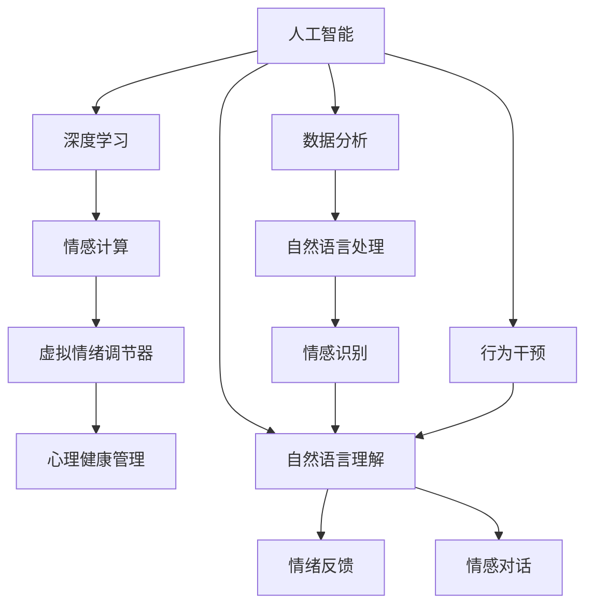

                 

# 虚拟情绪调节器：AI驱动的心理健康管理

> 关键词：人工智能,心理健康管理,虚拟情绪调节器,深度学习,情感计算,数据分析

## 1. 背景介绍

在现代社会中，人们面临来自工作、生活、社交等多方面的压力，心理疾病的发病率持续上升。心理健康已成为全社会普遍关注的重要问题。传统的心理健康管理主要依赖心理咨询师和心理治疗师，但受到资源和成本的限制，难以覆盖所有需要帮助的人群。随着人工智能技术的快速发展，虚拟情绪调节器作为一种新的心理健康管理工具，成为关注焦点。

虚拟情绪调节器是指基于人工智能技术，通过分析和干预用户的情绪和行为，为用户提供心理支持和情感调节的系统。其主要功能包括情绪识别、情绪反馈、情感对话和行为干预等。虚拟情绪调节器可以全天候、无偏见地与用户进行互动，提供个性化的心理健康支持，帮助用户应对压力和情绪问题，提升心理健康水平。

## 2. 核心概念与联系

### 2.1 核心概念概述

为了更好地理解虚拟情绪调节器的工作原理，本节将介绍几个关键概念及其相互联系。

- **人工智能(AI)**：以模拟人类智能行为为目标，通过算法和计算模型，实现对复杂问题的自动化处理。人工智能在情感计算、数据分析、自然语言处理等领域有广泛应用。
- **心理健康管理**：通过科学的心理评估、干预和支持，帮助个体和群体提升心理健康水平，预防和缓解心理疾病。心理健康管理包括心理咨询、心理治疗、心理支持等多种形式。
- **虚拟情绪调节器**：一种基于人工智能技术，用于情感计算和情绪调节的心理健康管理工具。它能够通过自然语言理解、情感识别等技术，实时监测和干预用户的情绪状态。
- **深度学习(Deep Learning)**：一种基于多层神经网络的机器学习技术，能够自动学习和提取数据中的复杂特征，广泛应用于图像识别、语音识别、自然语言处理等领域。
- **情感计算(Emotion Computing)**：通过识别和理解人类的情感，构建能够与人类进行情感交流的系统。情感计算是虚拟情绪调节器的核心技术之一。
- **数据分析(Data Analytics)**：从数据中提取有用信息，帮助做出明智的决策和预测。数据分析在情感识别和行为干预中起到重要作用。

这些核心概念之间的联系可以通过以下Mermaid流程图来展示：



这个流程图展示了各个概念之间的逻辑关系：

1. 人工智能为虚拟情绪调节器提供技术支持。
2. 深度学习用于情感计算，通过神经网络对用户情绪进行识别。
3. 情感计算构建虚拟情绪调节器的核心功能。
4. 数据分析帮助提取情绪数据，指导行为干预。
5. 自然语言处理、情感识别和情感对话是虚拟情绪调节器的关键组件。
6. 行为干预和情绪反馈协同工作，提升心理健康管理效果。

## 3. 核心算法原理 & 具体操作步骤

### 3.1 算法原理概述

虚拟情绪调节器基于人工智能技术，通过深度学习和情感计算实现情感识别和情绪调节。其核心算法原理如下：

1. **情感识别**：通过深度学习模型对用户的语音、文字、表情等进行情感分析，识别用户当前的情绪状态。
2. **情绪反馈**：基于情绪识别结果，向用户提供相应的情绪反馈，帮助用户理解和调整情绪。
3. **情感对话**：通过自然语言处理技术，构建能够与用户进行情感对话的系统，引导用户表达和释放情绪。
4. **行为干预**：结合数据分析和机器学习模型，对用户的行为进行干预，提供个性化的心理健康建议。

### 3.2 算法步骤详解

以下是对虚拟情绪调节器核心算法的详细步骤：

**Step 1: 数据采集与预处理**

- 通过传感器、麦克风、摄像头等设备采集用户的多模态数据。
- 对采集到的数据进行清洗和预处理，如去除噪音、归一化、分帧等。
- 将多模态数据转换为统一的特征表示，如文本转换为词向量，语音转换为MFCC特征。

**Step 2: 情感识别**

- 使用深度学习模型（如卷积神经网络CNN、循环神经网络RNN、长短期记忆网络LSTM等）对用户的情感进行识别。
- 通过情感分类器对用户的情绪进行分类，输出情绪标签（如愤怒、悲伤、焦虑等）。
- 使用情感词典、情感语料库等对情感分类器进行训练和优化。

**Step 3: 情绪反馈**

- 根据情感识别结果，向用户提供相应的情绪反馈。
- 情绪反馈可以是文字、声音、表情等形式，如安慰性语句、舒缓音乐、放松图片等。
- 使用情感生成模型（如GPT-3等）生成个性化的情绪反馈内容。

**Step 4: 情感对话**

- 使用自然语言处理技术，构建情感对话系统。
- 对话系统通过上下文理解用户的情感状态，并提供相应的情感支持。
- 对话系统可以采用多轮对话的方式，逐步引导用户表达和释放情绪。

**Step 5: 行为干预**

- 结合数据分析和机器学习模型，对用户的行为进行干预。
- 通过行为监测和情感反馈，构建个性化心理健康方案。
- 行为干预可以包括时间管理、运动锻炼、放松技巧等，帮助用户调整情绪。

### 3.3 算法优缺点

虚拟情绪调节器在情感计算和心理健康管理方面具有以下优点：

1. **实时性**：通过实时监测和反馈，能够及时干预用户的情绪，避免情绪问题的恶化。
2. **个性化**：能够根据用户的个性化需求，提供定制化的心理健康支持。
3. **无偏见**：不受人类心理治疗师的主观影响，提供客观、公正的支持。
4. **可扩展性**：可以大规模部署，覆盖更多人群，提高心理健康管理的效率。

同时，虚拟情绪调节器也存在一些缺点：

1. **隐私问题**：需要收集用户的敏感信息，可能存在隐私泄露的风险。
2. **复杂性**：涉及多模态数据处理和深度学习模型，技术实现较为复杂。
3. **准确性**：情感识别和行为干预的准确性受限于数据质量和模型性能。
4. **伦理问题**：如何确保算法的公平性和透明性，避免歧视和误导，是一个重要课题。

### 3.4 算法应用领域

虚拟情绪调节器可以应用于多个领域，如：

1. **心理健康应用**：用于个体心理健康支持，帮助用户缓解压力、焦虑等情绪问题。
2. **企业员工福利**：帮助企业员工应对工作压力，提升员工的心理健康水平。
3. **医疗健康**：用于心理健康评估和治疗，辅助医生进行心理疾病的诊断和治疗。
4. **教育领域**：帮助学生应对学业压力，提升学生的心理健康水平。
5. **紧急救援**：用于灾区居民的心理救援，帮助受灾人员度过心理危机。

## 4. 数学模型和公式 & 详细讲解 & 举例说明

### 4.1 数学模型构建

虚拟情绪调节器的核心算法涉及情感识别、情绪反馈和行为干预等多个环节。下面分别介绍这些环节的数学模型构建。

**情感识别**：使用深度学习模型对用户的语音、文字、表情等进行情感分析，识别用户当前的情绪状态。

- **语音情感识别**：使用卷积神经网络CNN对语音信号进行特征提取，使用分类器对提取的特征进行情感分类。
- **文字情感识别**：使用循环神经网络RNN或长短期记忆网络LSTM对文本进行序列建模，使用分类器对文本进行情感分类。
- **表情情感识别**：使用卷积神经网络CNN对图像进行特征提取，使用分类器对特征进行情感分类。

**情绪反馈**：根据情感识别结果，向用户提供相应的情绪反馈。

- **文字情绪反馈**：使用文本生成模型（如GPT-3等）生成安慰性语句，引导用户调整情绪。
- **声音情绪反馈**：使用音频生成模型（如WaveNet等）生成舒缓音乐，帮助用户放松。
- **表情情绪反馈**：使用生成对抗网络GAN生成放松图片，通过表情展示情绪支持。

**情感对话**：使用自然语言处理技术，构建能够与用户进行情感对话的系统。

- **上下文理解**：使用预训练语言模型（如BERT等）对用户文本进行编码，提取上下文信息。
- **情感回复**：使用生成模型（如Seq2Seq等）生成个性化的情感回复，引导用户表达和释放情绪。

**行为干预**：结合数据分析和机器学习模型，对用户的行为进行干预，提供个性化的心理健康建议。

- **行为监测**：使用时间序列分析模型（如ARIMA等）对用户的行为数据进行建模，预测行为趋势。
- **干预建议**：使用强化学习模型（如DQN等）生成个性化的行为干预策略，引导用户调整行为。

### 4.2 公式推导过程

以下以情感识别的核心公式进行详细推导。

假设用户的语音信号为 $X = (x_1, x_2, ..., x_n)$，其中 $x_i$ 表示第 $i$ 个语音样本。语音情感识别的目标是对 $X$ 进行分类，输出情绪标签 $y \in \{0, 1, ..., K-1\}$，其中 $K$ 表示情绪类别数。

**语音特征提取**：使用卷积神经网络（CNN）对语音信号进行特征提取，得到特征表示 $F = (f_1, f_2, ..., f_n)$，其中 $f_i$ 表示第 $i$ 个特征向量。

**特征分类**：使用分类器对特征 $F$ 进行分类，得到情绪标签 $y$。

假设分类器为线性分类器，其输出为：

$$
\hat{y} = Wf + b
$$

其中 $W$ 为权重向量，$b$ 为偏置项。分类器的损失函数为：

$$
L = -\frac{1}{N} \sum_{i=1}^N y_i \log p(y_i)
$$

其中 $y_i$ 为第 $i$ 个样本的真实标签，$p(y_i)$ 为分类器的输出概率。

通过梯度下降算法优化分类器，更新权重向量 $W$ 和偏置项 $b$，最小化损失函数 $L$，即可得到最优的分类器参数。

### 4.3 案例分析与讲解

以一个情感识别的具体案例为例，对上述公式进行解释。

假设某用户说了一段话：“最近工作压力很大，感觉有些焦虑。” 语音信号通过卷积神经网络（CNN）提取特征，得到特征表示 $F = (f_1, f_2, ..., f_n)$。

将特征表示 $F$ 输入到分类器中，输出情绪标签 $y$。假设分类器输出结果为 $y = 2$，表示用户处于焦虑状态。

根据情绪标签 $y$，虚拟情绪调节器向用户提供相应的情绪反馈。例如，生成一段安慰性语句：“感到焦虑很正常，深呼吸几次，放松一下。” 并通过语音合成技术，将该语句转换为舒缓的声音，反馈给用户。

## 5. 项目实践：代码实例和详细解释说明

### 5.1 开发环境搭建

在进行虚拟情绪调节器的开发实践前，需要准备好开发环境。以下是使用Python进行PyTorch开发的环境配置流程：

1. 安装Anaconda：从官网下载并安装Anaconda，用于创建独立的Python环境。

2. 创建并激活虚拟环境：
```bash
conda create -n pytorch-env python=3.8 
conda activate pytorch-env
```

3. 安装PyTorch：根据CUDA版本，从官网获取对应的安装命令。例如：
```bash
conda install pytorch torchvision torchaudio cudatoolkit=11.1 -c pytorch -c conda-forge
```

4. 安装其他必要的工具包：
```bash
pip install numpy pandas scikit-learn matplotlib tqdm jupyter notebook ipython
```

完成上述步骤后，即可在`pytorch-env`环境中开始开发实践。

### 5.2 源代码详细实现

以下是一个情感识别模型的代码实现：

```python
import torch
import torch.nn as nn
import torch.nn.functional as F

class CNNModel(nn.Module):
    def __init__(self, num_classes):
        super(CNNModel, self).__init__()
        self.conv1 = nn.Conv2d(1, 32, kernel_size=3, stride=1, padding=1)
        self.pool = nn.MaxPool2d(kernel_size=2, stride=2)
        self.conv2 = nn.Conv2d(32, 64, kernel_size=3, stride=1, padding=1)
        self.fc1 = nn.Linear(64*8*8, 128)
        self.fc2 = nn.Linear(128, num_classes)
        self.dropout = nn.Dropout(0.5)
        
    def forward(self, x):
        x = self.pool(F.relu(self.conv1(x)))
        x = self.pool(F.relu(self.conv2(x)))
        x = x.view(-1, 64*8*8)
        x = F.relu(self.fc1(x))
        x = self.dropout(x)
        x = self.fc2(x)
        return x

model = CNNModel(num_classes=3)

criterion = nn.CrossEntropyLoss()
optimizer = torch.optim.Adam(model.parameters(), lr=0.001)
```

**代码解读与分析**：

- **CNNModel类**：定义了一个简单的卷积神经网络模型，用于语音情感识别。该模型包含两个卷积层和两个全连接层，中间加入Dropout进行正则化。
- **forward方法**：实现模型的前向传播，通过卷积、池化和全连接层对输入数据进行处理，最后输出情绪分类结果。
- **criterion和optimizer**：定义了损失函数和优化器，分别使用交叉熵损失和Adam优化器进行模型训练。

### 5.3 代码解读与分析

**CNNModel类**：

```python
class CNNModel(nn.Module):
    def __init__(self, num_classes):
        super(CNNModel, self).__init__()
        self.conv1 = nn.Conv2d(1, 32, kernel_size=3, stride=1, padding=1)
        self.pool = nn.MaxPool2d(kernel_size=2, stride=2)
        self.conv2 = nn.Conv2d(32, 64, kernel_size=3, stride=1, padding=1)
        self.fc1 = nn.Linear(64*8*8, 128)
        self.fc2 = nn.Linear(128, num_classes)
        self.dropout = nn.Dropout(0.5)
        
    def forward(self, x):
        x = self.pool(F.relu(self.conv1(x)))
        x = self.pool(F.relu(self.conv2(x)))
        x = x.view(-1, 64*8*8)
        x = F.relu(self.fc1(x))
        x = self.dropout(x)
        x = self.fc2(x)
        return x
```

- **nn.Module**：定义了一个PyTorch模块，用于构建神经网络。
- **conv1、conv2**：定义了两个卷积层，分别用于特征提取。
- **pool**：定义了一个最大池化层，用于降维。
- **fc1、fc2**：定义了两个全连接层，用于分类。
- **dropout**：定义了一个Dropout层，用于正则化。
- **forward方法**：实现模型的前向传播，包括卷积、池化、全连接和Dropout等操作。

**criterion和optimizer**：

```python
criterion = nn.CrossEntropyLoss()
optimizer = torch.optim.Adam(model.parameters(), lr=0.001)
```

- **criterion**：定义了交叉熵损失函数，用于计算模型的输出与真实标签之间的差异。
- **optimizer**：定义了Adam优化器，用于更新模型的参数，最小化损失函数。

## 6. 实际应用场景

### 6.1 心理健康应用

虚拟情绪调节器在心理健康领域有着广泛的应用前景。例如，可以用于个体心理健康支持，帮助用户缓解压力、焦虑等情绪问题。用户通过佩戴智能手环或手机应用，实时监测自己的情绪状态，并根据情绪反馈进行调节。

**案例分析**：

假设用户A感到焦虑，通过智能手环监测到其心跳和呼吸频率异常，将数据传输到虚拟情绪调节器。虚拟情绪调节器对数据进行分析，识别出用户处于焦虑状态。随后，虚拟情绪调节器向用户A提供舒缓的音乐和放松的指导，帮助其放松心情。

### 6.2 企业员工福利

虚拟情绪调节器可以用于企业员工的心理健康管理。企业通过在员工中普及虚拟情绪调节器，帮助员工应对工作压力，提升其心理健康水平。

**案例分析**：

假设某企业员工B在工作中感到压力很大，通过虚拟情绪调节器上传其语音或文字信息。虚拟情绪调节器对信息进行分析，识别出用户处于压力状态。随后，虚拟情绪调节器向员工B提供心理支持，如建议其进行短暂的休息和放松。

### 6.3 医疗健康

虚拟情绪调节器可以用于心理健康评估和治疗，辅助医生进行心理疾病的诊断和治疗。医生通过虚拟情绪调节器收集患者的数据，进行情绪分析，制定个性化的治疗方案。

**案例分析**：

假设某患者C感到抑郁，通过虚拟情绪调节器上传其语音和文字信息。虚拟情绪调节器对信息进行分析，识别出用户处于抑郁状态。随后，虚拟情绪调节器向医生提供患者的情绪状态报告，辅助医生制定治疗方案。

### 6.4 紧急救援

虚拟情绪调节器在紧急救援中也有重要应用。例如，在灾区救援中，救援人员可以通过虚拟情绪调节器对受灾人员进行心理干预，缓解其情绪压力，帮助其度过心理危机。

**案例分析**：

假设某灾区居民D感到恐惧和焦虑，救援人员通过虚拟情绪调节器与其进行情感对话，了解其情绪状态。虚拟情绪调节器根据对话结果，提供相应的情绪支持，如安慰和指导，帮助其缓解情绪。

## 7. 工具和资源推荐

### 7.1 学习资源推荐

为了帮助开发者系统掌握虚拟情绪调节器的开发技术，这里推荐一些优质的学习资源：

1. **《深度学习入门》**：一本入门级的深度学习教材，介绍了深度学习的基本概念和常见算法。
2. **《Python深度学习》**：一本详细介绍深度学习在Python中实现的技术书籍，包括卷积神经网络、循环神经网络等。
3. **《自然语言处理综论》**：一本全面介绍自然语言处理技术的教材，包括文本分类、情感分析、机器翻译等。
4. **《情感计算基础》**：一本介绍情感计算基本理论和应用场景的书籍，包括情感词典、情感分类等。
5. **Google TensorFlow官方文档**：深度学习框架TensorFlow的官方文档，提供了丰富的API和示例代码。
6. **PyTorch官方文档**：深度学习框架PyTorch的官方文档，提供了详细的API和示例代码。

通过学习这些资源，相信你一定能够快速掌握虚拟情绪调节器的开发技术，并将其应用到实际项目中。

### 7.2 开发工具推荐

高效的开发离不开优秀的工具支持。以下是几款用于虚拟情绪调节器开发的常用工具：

1. **TensorFlow**：由Google主导开发的深度学习框架，生产部署方便，适合大规模工程应用。
2. **PyTorch**：由Facebook主导开发的深度学习框架，灵活动态的计算图，适合快速迭代研究。
3. **Hugging Face Transformers**：自然语言处理工具库，提供了多种预训练语言模型，支持微调和迁移学习。
4. **Jupyter Notebook**：一种交互式的开发环境，适合进行数据分析和模型训练。
5. **TensorBoard**：TensorFlow配套的可视化工具，可实时监测模型训练状态，并提供丰富的图表呈现方式。

合理利用这些工具，可以显著提升虚拟情绪调节器的开发效率，加快创新迭代的步伐。

### 7.3 相关论文推荐

虚拟情绪调节器是一个前沿的研究方向，以下是几篇奠基性的相关论文，推荐阅读：

1. **《Emotion Recognition using Deep Learning》**：介绍了使用深度学习进行情感识别的基本方法，包括CNN和LSTM等模型。
2. **《Dialogue Systems for Emotion Management》**：介绍了使用自然语言处理技术构建情感对话系统的方法，包括上下文理解和情感生成等。
3. **《Healthcare AI: A Survey》**：介绍了人工智能在医疗健康领域的应用，包括心理健康管理等。
4. **《An Overview of AI in Employee Mental Health》**：介绍了人工智能在企业员工心理健康管理中的应用，包括虚拟情绪调节器等。
5. **《AI in Emergency Rescue》**：介绍了人工智能在紧急救援中的应用，包括心理救援等。

这些论文代表了大语言模型微调技术的发展脉络。通过学习这些前沿成果，可以帮助研究者把握学科前进方向，激发更多的创新灵感。

## 8. 总结：未来发展趋势与挑战

### 8.1 总结

本文对虚拟情绪调节器进行了全面系统的介绍，从背景、核心概念、算法原理到项目实践，系统梳理了虚拟情绪调节器的开发流程和应用场景。虚拟情绪调节器通过深度学习、情感计算等技术，帮助用户缓解情绪问题，提升心理健康水平，具有广泛的应用前景。

### 8.2 未来发展趋势

展望未来，虚拟情绪调节器在心理健康管理方面将呈现以下几个发展趋势：

1. **多模态融合**：未来的虚拟情绪调节器将综合语音、文字、表情等多模态数据，提高情绪识别的准确性和鲁棒性。
2. **个性化推荐**：未来的虚拟情绪调节器将结合数据分析和机器学习，提供个性化的情绪调节建议。
3. **实时交互**：未来的虚拟情绪调节器将支持实时情感对话，提供持续的情绪支持。
4. **行为干预**：未来的虚拟情绪调节器将结合行为监测和干预，帮助用户建立健康的生活方式。
5. **深度学习模型优化**：未来的虚拟情绪调节器将使用更高效的深度学习模型，提高算法的精度和效率。

### 8.3 面临的挑战

尽管虚拟情绪调节器在心理健康管理方面取得了显著进展，但在迈向更加智能化、普适化应用的过程中，它仍面临着诸多挑战：

1. **隐私问题**：虚拟情绪调节器需要收集用户的敏感信息，可能存在隐私泄露的风险。如何保护用户隐私，是亟待解决的问题。
2. **复杂性**：虚拟情绪调节器涉及多模态数据处理和深度学习模型，技术实现较为复杂。如何简化模型，提高可扩展性，还需要更多的研究。
3. **准确性**：虚拟情绪调节器的情绪识别和行为干预的准确性受限于数据质量和模型性能。如何提高算法的准确性，还需要更多的研究和实践。
4. **伦理问题**：虚拟情绪调节器如何确保算法的公平性和透明性，避免歧视和误导，是一个重要课题。

### 8.4 研究展望

面对虚拟情绪调节器面临的种种挑战，未来的研究需要在以下几个方面寻求新的突破：

1. **隐私保护技术**：发展隐私保护算法和技术，确保用户数据的安全。
2. **高效模型设计**：设计更高效的深度学习模型，提高算法的精度和效率。
3. **公平性和透明性**：确保算法的公平性和透明性，避免歧视和误导。
4. **跨模态融合**：研究多模态数据的融合方法，提高情绪识别的准确性和鲁棒性。

总之，虚拟情绪调节器在心理健康管理方面有着广阔的应用前景，但如何提高其准确性、效率和安全性，还需要研究者的不断努力和探索。相信在未来的发展中，虚拟情绪调节器将不断完善，成为心理健康管理的重要工具。

## 9. 附录：常见问题与解答

**Q1：虚拟情绪调节器是如何实现情绪识别的？**

A: 虚拟情绪调节器使用深度学习模型对用户的语音、文字、表情等进行情感分析，识别用户当前的情绪状态。常见的深度学习模型包括卷积神经网络（CNN）、循环神经网络（RNN）、长短期记忆网络（LSTM）等。这些模型通过学习大量的情感数据，能够自动提取数据中的情感特征，并对情绪进行分类。

**Q2：虚拟情绪调节器如何实现个性化推荐？**

A: 虚拟情绪调节器结合数据分析和机器学习模型，对用户的行为进行干预，提供个性化的心理健康建议。具体实现方式包括时间序列分析、强化学习等技术。通过分析用户的历史行为数据，构建个性化心理健康方案，引导用户调整情绪和行为。

**Q3：虚拟情绪调节器在心理健康管理中面临哪些挑战？**

A: 虚拟情绪调节器在心理健康管理中面临隐私保护、算法复杂性、准确性和伦理问题等挑战。如何保护用户隐私，设计高效的模型，提高算法的准确性，确保算法的公平性和透明性，是未来研究需要重点关注的课题。

**Q4：虚拟情绪调节器如何实现实时情感对话？**

A: 虚拟情绪调节器使用自然语言处理技术，构建能够与用户进行情感对话的系统。对话系统通过上下文理解用户的情感状态，并提供相应的情感支持。具体实现方式包括预训练语言模型（如BERT）和生成模型（如Seq2Seq）等。通过多轮对话的方式，逐步引导用户表达和释放情绪，提供持续的情绪支持。

**Q5：虚拟情绪调节器如何实现行为干预？**

A: 虚拟情绪调节器结合行为监测和数据分析，提供个性化的心理健康建议。具体实现方式包括时间序列分析、强化学习等技术。通过分析用户的行为数据，构建个性化心理健康方案，引导用户调整情绪和行为，如建议其进行短暂的休息和放松。

**Q6：虚拟情绪调节器在企业员工心理健康中的应用场景有哪些？**

A: 虚拟情绪调节器可以用于企业员工的心理健康管理，帮助员工应对工作压力，提升其心理健康水平。具体应用场景包括：

1. **压力管理**：帮助员工识别和管理工作压力，提供个性化的压力管理建议。
2. **情绪支持**：在员工感到焦虑或抑郁时，提供情绪支持和心理疏导。
3. **行为干预**：结合行为监测和干预，帮助员工建立健康的生活方式，如推荐适量的锻炼和放松技巧。
4. **培训支持**：提供心理健康相关的培训和指导，提升员工的自我调节能力。

总之，虚拟情绪调节器在企业员工心理健康管理中有着广泛的应用前景，能够有效提升员工的心理健康水平，增强企业的整体竞争力。

---

作者：禅与计算机程序设计艺术 / Zen and the Art of Computer Programming

