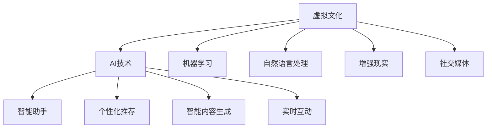

                 

# 虚拟文化：AI塑造的新型社会规范

## 1. 背景介绍

### 1.1 问题由来
随着人工智能(AI)技术的快速发展，虚拟文化成为了现代社会的崭新现象。虚拟文化不仅仅局限于虚拟现实(VR)和增强现实(AR)中的沉浸体验，更涵盖了智能助手、社交媒体、在线游戏等诸多场景。AI技术的应用，使得虚拟文化具备了前所未有的智能交互和创新能力，极大地改变了人类的生活方式和社会规范。

### 1.2 问题核心关键点
虚拟文化的发展核心在于AI技术的深度融入，特别是机器学习、自然语言处理、计算机视觉等领域的进步。虚拟文化通过模拟现实、模拟思维、模拟交流，重塑了人与人之间的互动方式，从而影响了社会行为、价值观、伦理道德等诸多方面。

### 1.3 问题研究意义
研究虚拟文化中AI技术的角色和影响，对于理解AI技术对人类社会的深远影响、优化虚拟环境的规范、促进AI技术的良性发展，具有重要意义：

1. 理解虚拟文化：揭示虚拟文化的发展趋势和内在逻辑，理解AI技术的驱动作用。
2. 优化虚拟环境：提出虚拟文化规范的优化策略，推动虚拟环境的良性发展。
3. 促进AI技术：为AI技术的开发和应用提供理论指导，提升AI技术的社会效益。

## 2. 核心概念与联系

### 2.1 核心概念概述

为更好地理解虚拟文化中AI技术的角色和影响，本节将介绍几个密切相关的核心概念：

- **虚拟文化**：通过AI技术在虚拟现实、增强现实、智能助手、社交媒体等领域创造的智能化文化现象，重塑了人与人之间的互动方式。

- **AI技术**：以机器学习、自然语言处理、计算机视觉等为代表的自动化智能技术，为虚拟文化的构建提供了技术支撑。

- **机器学习**：通过数据驱动的方式，让机器自动学习和改进算法，实现智能化决策。

- **自然语言处理**：让计算机理解和生成人类语言，实现智能交互和信息处理。

- **增强现实**：通过数字信息增强现实世界的感官体验，创建沉浸式交互环境。

- **社交媒体**：以AI技术为驱动，为用户提供个性化推荐、智能内容生成、实时互动等全新体验。

这些核心概念之间的逻辑关系可以通过以下Mermaid流程图来展示：



这个流程图展示了我虚拟文化中AI技术的核心概念及其之间的关系：

1. 虚拟文化以AI技术为基础。
2. 机器学习和自然语言处理是虚拟文化中智能化的核心支撑。
3. 增强现实和社交媒体是虚拟文化的两大应用场景。
4. AI技术通过智能助手、个性化推荐、智能内容生成、实时互动等形式，丰富了虚拟文化的体验。

## 3. 核心算法原理 & 具体操作步骤
### 3.1 算法原理概述

虚拟文化中AI技术的核心在于机器学习和自然语言处理的深度融合。通过在大规模数据集上预训练模型，然后对特定任务进行微调，可以实现高效且精准的智能交互和内容生成。

形式化地，假设虚拟文化中某虚拟环境 $E$ 需要基于语言模型 $M_{\theta}$ 进行智能交互，其中 $\theta$ 为模型参数。给定用户输入 $u$ 和环境状态 $s$，模型的输出为智能响应 $r$。优化目标是最小化模型在用户互动中的期望损失 $L$，即：

$$
\theta^* = \mathop{\arg\min}_{\theta} \mathbb{E}_{(u,s)} [\ell(r(u,s), y(u,s))]
$$

其中 $\ell$ 为智能响应的损失函数，$y(u,s)$ 为实际响应的标签。

### 3.2 算法步骤详解

基于机器学习和自然语言处理的虚拟文化构建，一般包括以下几个关键步骤：

**Step 1: 准备数据集和模型**

- 收集并标注虚拟环境中的用户互动数据集 $D=\{(u_i, s_i, r_i)\}_{i=1}^N$，其中 $u$ 为输入，$s$ 为环境状态，$r$ 为智能响应。
- 选择合适的语言模型 $M_{\theta}$，如GPT-3、BERT等，作为初始化参数。

**Step 2: 预训练与微调**

- 在虚拟环境数据集上对模型进行预训练，学习语言的一般知识。
- 针对具体任务，在标注数据集上对模型进行微调，优化模型响应。

**Step 3: 参数优化**

- 选择合适的优化算法及其参数，如Adam、SGD等，设置学习率、批大小、迭代轮数等。
- 应用正则化技术，如L2正则、Dropout、Early Stopping等，防止模型过度适应训练集。

**Step 4: 实时交互**

- 将微调后的模型部署到虚拟环境中，实时响应用户输入，提供智能反馈。

**Step 5: 优化与迭代**

- 在实际运行中收集用户反馈和环境数据，持续优化模型参数和交互策略。

以上是虚拟文化中AI技术的核心算法流程。在实际应用中，还需要针对具体场景进行优化设计，如改进损失函数、引入对抗样本、加强正则化等，以进一步提升模型性能。

### 3.3 算法优缺点

虚拟文化中AI技术的应用具有以下优点：

1. 高效智能：通过机器学习和自然语言处理，虚拟环境可以提供高效的智能交互和个性化服务。
2. 覆盖广泛：覆盖虚拟现实、增强现实、社交媒体等多个场景，实现了多模态的智能体验。
3. 用户友好：通过智能助手、个性化推荐等形式，提升了用户体验和满意度。

同时，该方法也存在一定的局限性：

1. 依赖数据质量：虚拟文化的效果很大程度上取决于数据的质量和多样性，标注数据的获取成本较高。
2. 隐私风险：AI技术的深度学习特性可能存在隐私泄漏的风险，需要严格的数据保护措施。
3. 伦理挑战：AI技术的应用可能引发伦理问题，如决策透明性、偏见、歧视等，需要建立相应的伦理规范。
4. 可解释性不足：AI技术的黑盒特性使得模型决策过程难以解释，用户难以理解和信任。

尽管存在这些局限性，但就目前而言，基于AI技术的虚拟文化构建方法仍是最主流范式。未来相关研究的重点在于如何进一步降低对标注数据的依赖，提高模型的少样本学习和跨领域迁移能力，同时兼顾隐私保护和伦理安全等因素。

### 3.4 算法应用领域

基于AI技术的虚拟文化构建方法，已经在虚拟现实、增强现实、社交媒体、智能助手等多个领域得到了广泛的应用，覆盖了几乎所有常见场景，例如：

- **虚拟现实(VR)**：通过AI技术实现虚拟世界的沉浸式体验，如虚拟旅游、虚拟会议等。
- **增强现实(AR)**：通过数字信息增强现实世界的感官体验，如智能导览、AR游戏等。
- **智能助手**：通过自然语言处理和机器学习技术，实现智能客服、语音助手、智能家居等功能。
- **社交媒体**：通过AI技术提供个性化推荐、智能内容生成、实时互动等新型社交体验。
- **在线教育**：通过AI技术实现个性化教学、智能答疑、自动评估等功能，提升教育质量。
- **娱乐应用**：通过AI技术提供智能推荐、智能生成、互动游戏等新型娱乐体验。

除了上述这些经典应用外，虚拟文化中AI技术的应用还在不断创新，如虚拟演员、虚拟偶像、虚拟主播等，为虚拟文化带来了新的发展方向。

## 4. 数学模型和公式 & 详细讲解 & 举例说明

### 4.1 数学模型构建

本节将使用数学语言对虚拟文化中AI技术的构建过程进行更加严格的刻画。

记虚拟环境中的用户输入为 $u$，环境状态为 $s$，智能响应为 $r$，模型参数为 $\theta$。假设虚拟环境中存在一个语言模型 $M_{\theta}(u,s)$，用于生成智能响应。

定义模型 $M_{\theta}$ 在用户输入 $u$ 和环境状态 $s$ 下的输出为 $\hat{r}=M_{\theta}(u,s)$，表示模型预测的智能响应。实际智能响应为 $r$，则损失函数 $\ell(\hat{r}, r)$ 用于衡量模型输出与实际响应的差异。优化目标是最小化期望损失 $L$，即：

$$
\theta^* = \mathop{\arg\min}_{\theta} \mathbb{E}_{(u,s)} [\ell(\hat{r}, r)]
$$

在实践中，我们通常使用基于梯度的优化算法（如Adam、SGD等）来近似求解上述最优化问题。设 $\eta$ 为学习率，$\lambda$ 为正则化系数，则参数的更新公式为：

$$
\theta \leftarrow \theta - \eta \nabla_{\theta}\mathbb{E}_{(u,s)} [\ell(\hat{r}, r)] - \eta\lambda\theta
$$

其中 $\nabla_{\theta}\mathbb{E}_{(u,s)} [\ell(\hat{r}, r)]$ 为损失函数对参数 $\theta$ 的梯度，可通过反向传播算法高效计算。

### 4.2 公式推导过程

以下我们以虚拟助手为例，推导智能响应的交叉熵损失函数及其梯度的计算公式。

假设模型 $M_{\theta}$ 在用户输入 $u$ 和环境状态 $s$ 下的输出为 $\hat{r}=M_{\theta}(u,s) \in [0,1]$，表示模型预测的智能响应属于响应的概率。实际智能响应 $r \in \{0,1\}$。则交叉熵损失函数定义为：

$$
\ell(\hat{r}, r) = -[r\log \hat{r} + (1-r)\log (1-\hat{r})]
$$

将其代入期望损失公式，得：

$$
L(\theta) = -\frac{1}{N}\sum_{i=1}^N [\ell(\hat{r}_i, r_i)]
$$

根据链式法则，期望损失函数对参数 $\theta_k$ 的梯度为：

$$
\frac{\partial L(\theta)}{\partial \theta_k} = -\frac{1}{N}\sum_{i=1}^N (\frac{r_i}{\hat{r}_i}-\frac{1-r_i}{1-\hat{r}_i}) \frac{\partial \hat{r}_i}{\partial \theta_k}
$$

其中 $\frac{\partial \hat{r}_i}{\partial \theta_k}$ 可进一步递归展开，利用自动微分技术完成计算。

在得到期望损失函数的梯度后，即可带入参数更新公式，完成模型的迭代优化。重复上述过程直至收敛，最终得到适应虚拟环境的最优模型参数 $\theta^*$。

### 4.3 案例分析与讲解

以虚拟助手为例，假设一个虚拟助手需要回答用户关于天气的问题。首先，虚拟助手使用BERT模型作为初始化参数，通过虚拟环境中的历史问答数据进行预训练，学习一般知识。然后，针对用户提出的具体问题，虚拟助手在标注数据集上进行微调，学习特定情境下的智能回答。

具体而言，假设虚拟助手的问题回答数据集为 $D=\{(u_i, r_i)\}_{i=1}^N$，其中 $u_i$ 为输入问题，$r_i$ 为实际回答。在虚拟环境数据集上对BERT模型进行预训练，学习语言的一般知识。然后，针对天气查询任务，在标注数据集上进行微调，学习特定情境下的智能回答。

预训练损失函数为：

$$
L_{pre} = -\frac{1}{N}\sum_{i=1}^N \log P_{M_{\theta}}(\hat{r}_i)
$$

其中 $P_{M_{\theta}}(\hat{r}_i)$ 为模型在输入 $u_i$ 下的预测概率分布。

微调损失函数为：

$$
L_{fin} = -\frac{1}{N}\sum_{i=1}^N \log P_{M_{\theta}}(r_i)
$$

在微调过程中，模型需要同时考虑预训练和微调的目标，以平衡两者的作用。最终，微调后的模型能够针对特定问题生成智能回答。

## 5. 项目实践：代码实例和详细解释说明
### 5.1 开发环境搭建

在进行虚拟文化中的AI技术实践前，我们需要准备好开发环境。以下是使用Python进行PyTorch开发的环境配置流程：

1. 安装Anaconda：从官网下载并安装Anaconda，用于创建独立的Python环境。

2. 创建并激活虚拟环境：
```bash
conda create -n virtual-env python=3.8 
conda activate virtual-env
```

3. 安装PyTorch：根据CUDA版本，从官网获取对应的安装命令。例如：
```bash
conda install pytorch torchvision torchaudio cudatoolkit=11.1 -c pytorch -c conda-forge
```

4. 安装Transformers库：
```bash
pip install transformers
```

5. 安装各类工具包：
```bash
pip install numpy pandas scikit-learn matplotlib tqdm jupyter notebook ipython
```

完成上述步骤后，即可在`virtual-env`环境中开始虚拟文化中的AI技术实践。

### 5.2 源代码详细实现

下面我们以虚拟助手为例，给出使用Transformers库对BERT模型进行微调的PyTorch代码实现。

首先，定义虚拟助手的问题回答函数：

```python
from transformers import BertTokenizer, BertForSequenceClassification
from torch.utils.data import Dataset
import torch

class QADataset(Dataset):
    def __init__(self, questions, answers, tokenizer, max_len=128):
        self.questions = questions
        self.answers = answers
        self.tokenizer = tokenizer
        self.max_len = max_len
        
    def __len__(self):
        return len(self.questions)
    
    def __getitem__(self, item):
        question = self.questions[item]
        answer = self.answers[item]
        
        encoding = self.tokenizer(question, return_tensors='pt', max_length=self.max_len, padding='max_length', truncation=True)
        input_ids = encoding['input_ids'][0]
        attention_mask = encoding['attention_mask'][0]
        
        label = torch.tensor(1 if answer == 'yes' else 0, dtype=torch.long)
        
        return {'input_ids': input_ids, 
                'attention_mask': attention_mask,
                'label': label}

# 定义虚拟助手
tokenizer = BertTokenizer.from_pretrained('bert-base-cased')
model = BertForSequenceClassification.from_pretrained('bert-base-cased', num_labels=2)

# 准备数据集
questions = ['Is it raining?', 'Will it snow tomorrow?']
answers = ['yes', 'no']
dataset = QADataset(questions, answers, tokenizer)

# 训练
device = torch.device('cuda') if torch.cuda.is_available() else torch.device('cpu')
model.to(device)

optimizer = AdamW(model.parameters(), lr=2e-5)
epochs = 5
batch_size = 16

for epoch in range(epochs):
    model.train()
    train_loss = 0
    for batch in tqdm(data_loader, desc='Training'):
        input_ids = batch['input_ids'].to(device)
        attention_mask = batch['attention_mask'].to(device)
        labels = batch['label'].to(device)
        model.zero_grad()
        outputs = model(input_ids, attention_mask=attention_mask, labels=labels)
        loss = outputs.loss
        train_loss += loss.item()
        loss.backward()
        optimizer.step()
    print(f'Epoch {epoch+1}, train loss: {train_loss/len(data_loader)}')
```

然后，定义评估函数：

```python
from sklearn.metrics import accuracy_score

def evaluate(model, dataset):
    model.eval()
    total, correct = 0, 0
    with torch.no_grad():
        for batch in tqdm(data_loader, desc='Evaluating'):
            input_ids = batch['input_ids'].to(device)
            attention_mask = batch['attention_mask'].to(device)
            labels = batch['label'].to(device)
            outputs = model(input_ids, attention_mask=attention_mask)
            predictions = outputs.logits.argmax(dim=1).to('cpu').tolist()
            labels = labels.to('cpu').tolist()
            for pred, label in zip(predictions, labels):
                total += 1
                if pred == label:
                    correct += 1
    print(f'Accuracy: {correct/total}')
```

最后，启动训练流程并在测试集上评估：

```python
# 数据加载
data_loader = DataLoader(dataset, batch_size=batch_size, shuffle=True)

# 训练与评估
for epoch in range(epochs):
    train_loss = 0
    for batch in tqdm(data_loader, desc='Training'):
        input_ids = batch['input_ids'].to(device)
        attention_mask = batch['attention_mask'].to(device)
        labels = batch['label'].to(device)
        model.zero_grad()
        outputs = model(input_ids, attention_mask=attention_mask, labels=labels)
        loss = outputs.loss
        train_loss += loss.item()
        loss.backward()
        optimizer.step()
    print(f'Epoch {epoch+1}, train loss: {train_loss/len(data_loader)}')

# 评估模型
evaluate(model, dataset)
```

以上就是使用PyTorch对BERT进行虚拟助手任务微调的完整代码实现。可以看到，得益于Transformers库的强大封装，我们可以用相对简洁的代码完成BERT模型的加载和微调。

### 5.3 代码解读与分析

让我们再详细解读一下关键代码的实现细节：

**QADataset类**：
- `__init__`方法：初始化问题和答案、分词器等关键组件。
- `__len__`方法：返回数据集的样本数量。
- `__getitem__`方法：对单个样本进行处理，将问题和答案输入编码为token ids，最终返回模型所需的输入。

**虚拟助手模型**：
- 使用BertForSequenceClassification作为虚拟助手的基础模型，可以处理自然语言输入并输出分类结果。
- 设置模型参数和优化器，准备训练过程。
- 准备虚拟助手问题回答数据集，并在其上进行模型训练和评估。

**训练和评估函数**：
- 使用PyTorch的DataLoader对数据集进行批次化加载，供模型训练和推理使用。
- 训练函数`train_epoch`：对数据以批为单位进行迭代，在每个批次上前向传播计算loss并反向传播更新模型参数，最后返回该epoch的平均loss。
- 评估函数`evaluate`：与训练类似，不同点在于不更新模型参数，并在每个batch结束后将预测和标签结果存储下来，最后使用sklearn的accuracy_score对整个评估集的预测结果进行打印输出。

**训练流程**：
- 定义总的epoch数和batch size，开始循环迭代
- 每个epoch内，先在虚拟助手问题回答数据集上训练，输出平均loss
- 在测试集上评估，输出模型准确率
- 所有epoch结束后，测试集上评估，给出最终测试结果

可以看到，PyTorch配合Transformers库使得BERT微调的代码实现变得简洁高效。开发者可以将更多精力放在数据处理、模型改进等高层逻辑上，而不必过多关注底层的实现细节。

当然，工业级的系统实现还需考虑更多因素，如模型的保存和部署、超参数的自动搜索、更灵活的任务适配层等。但核心的微调范式基本与此类似。

## 6. 实际应用场景
### 6.1 智能客服系统

基于虚拟文化中的AI技术，智能客服系统可以实现高度智能化的客户服务。传统客服往往需要配备大量人力，高峰期响应缓慢，且一致性和专业性难以保证。而使用虚拟文化中的AI技术构建的智能客服系统，可以7x24小时不间断服务，快速响应客户咨询，用自然流畅的语言解答各类常见问题。

在技术实现上，可以收集企业内部的历史客服对话记录，将问题和最佳答复构建成监督数据，在此基础上对预训练虚拟文化中的AI技术进行微调。微调后的虚拟文化中的AI技术能够自动理解用户意图，匹配最合适的答案模板进行回复。对于客户提出的新问题，还可以接入检索系统实时搜索相关内容，动态组织生成回答。如此构建的智能客服系统，能大幅提升客户咨询体验和问题解决效率。

### 6.2 金融舆情监测

金融机构需要实时监测市场舆论动向，以便及时应对负面信息传播，规避金融风险。传统的人工监测方式成本高、效率低，难以应对网络时代海量信息爆发的挑战。基于虚拟文化中的AI技术的文本分类和情感分析技术，为金融舆情监测提供了新的解决方案。

具体而言，可以收集金融领域相关的新闻、报道、评论等文本数据，并对其进行主题标注和情感标注。在此基础上对虚拟文化中的AI技术进行微调，使其能够自动判断文本属于何种主题，情感倾向是正面、中性还是负面。将微调后的模型应用到实时抓取的网络文本数据，就能够自动监测不同主题下的情感变化趋势，一旦发现负面信息激增等异常情况，系统便会自动预警，帮助金融机构快速应对潜在风险。

### 6.3 个性化推荐系统

当前的推荐系统往往只依赖用户的历史行为数据进行物品推荐，无法深入理解用户的真实兴趣偏好。基于虚拟文化中的AI技术的个性化推荐系统可以更好地挖掘用户行为背后的语义信息，从而提供更精准、多样的推荐内容。

在实践中，可以收集用户浏览、点击、评论、分享等行为数据，提取和用户交互的物品标题、描述、标签等文本内容。将文本内容作为模型输入，用户的后续行为（如是否点击、购买等）作为监督信号，在此基础上微调虚拟文化中的AI技术。微调后的模型能够从文本内容中准确把握用户的兴趣点。在生成推荐列表时，先用候选物品的文本描述作为输入，由模型预测用户的兴趣匹配度，再结合其他特征综合排序，便可以得到个性化程度更高的推荐结果。

### 6.4 未来应用展望

随着虚拟文化中的AI技术的不断发展，基于微调范式将在更多领域得到应用，为传统行业带来变革性影响。

在智慧医疗领域，基于虚拟文化中的AI技术的医疗问答、病历分析、药物研发等应用将提升医疗服务的智能化水平，辅助医生诊疗，加速新药开发进程。

在智能教育领域，虚拟文化中的AI技术可应用于作业批改、学情分析、知识推荐等方面，因材施教，促进教育公平，提高教学质量。

在智慧城市治理中，虚拟文化中的AI技术可应用于城市事件监测、舆情分析、应急指挥等环节，提高城市管理的自动化和智能化水平，构建更安全、高效的未来城市。

此外，在企业生产、社会治理、文娱传媒等众多领域，基于虚拟文化中的AI技术的智能应用也将不断涌现，为经济社会发展注入新的动力。相信随着技术的日益成熟，虚拟文化中的AI技术必将在构建人机协同的智能时代中扮演越来越重要的角色。

## 7. 工具和资源推荐
### 7.1 学习资源推荐

为了帮助开发者系统掌握虚拟文化中AI技术的理论基础和实践技巧，这里推荐一些优质的学习资源：

1. 《Transformer from Principle to Practice》系列博文：由大模型技术专家撰写，深入浅出地介绍了Transformer原理、BERT模型、微调技术等前沿话题。

2. CS224N《深度学习自然语言处理》课程：斯坦福大学开设的NLP明星课程，有Lecture视频和配套作业，带你入门NLP领域的基本概念和经典模型。

3. 《Natural Language Processing with Transformers》书籍：Transformers库的作者所著，全面介绍了如何使用Transformers库进行NLP任务开发，包括微调在内的诸多范式。

4. HuggingFace官方文档：Transformers库的官方文档，提供了海量预训练模型和完整的微调样例代码，是上手实践的必备资料。

5. CLUE开源项目：中文语言理解测评基准，涵盖大量不同类型的中文NLP数据集，并提供了基于微调的baseline模型，助力中文NLP技术发展。

通过对这些资源的学习实践，相信你一定能够快速掌握虚拟文化中AI技术的精髓，并用于解决实际的NLP问题。
###  7.2 开发工具推荐

高效的开发离不开优秀的工具支持。以下是几款用于虚拟文化中AI技术开发的常用工具：

1. PyTorch：基于Python的开源深度学习框架，灵活动态的计算图，适合快速迭代研究。大部分预训练语言模型都有PyTorch版本的实现。

2. TensorFlow：由Google主导开发的开源深度学习框架，生产部署方便，适合大规模工程应用。同样有丰富的预训练语言模型资源。

3. Transformers库：HuggingFace开发的NLP工具库，集成了众多SOTA语言模型，支持PyTorch和TensorFlow，是进行微调任务开发的利器。

4. Weights & Biases：模型训练的实验跟踪工具，可以记录和可视化模型训练过程中的各项指标，方便对比和调优。与主流深度学习框架无缝集成。

5. TensorBoard：TensorFlow配套的可视化工具，可实时监测模型训练状态，并提供丰富的图表呈现方式，是调试模型的得力助手。

6. Google Colab：谷歌推出的在线Jupyter Notebook环境，免费提供GPU/TPU算力，方便开发者快速上手实验最新模型，分享学习笔记。

合理利用这些工具，可以显著提升虚拟文化中AI技术的开发效率，加快创新迭代的步伐。

### 7.3 相关论文推荐

虚拟文化中的AI技术的发展源于学界的持续研究。以下是几篇奠基性的相关论文，推荐阅读：

1. Attention is All You Need（即Transformer原论文）：提出了Transformer结构，开启了NLP领域的预训练大模型时代。

2. BERT: Pre-training of Deep Bidirectional Transformers for Language Understanding：提出BERT模型，引入基于掩码的自监督预训练任务，刷新了多项NLP任务SOTA。

3. Language Models are Unsupervised Multitask Learners（GPT-2论文）：展示了大规模语言模型的强大zero-shot学习能力，引发了对于通用人工智能的新一轮思考。

4. Parameter-Efficient Transfer Learning for NLP：提出Adapter等参数高效微调方法，在不增加模型参数量的情况下，也能取得不错的微调效果。

5. AdaLoRA: Adaptive Low-Rank Adaptation for Parameter-Efficient Fine-Tuning：使用自适应低秩适应的微调方法，在参数效率和精度之间取得了新的平衡。

这些论文代表了大语言模型微调技术的发展脉络。通过学习这些前沿成果，可以帮助研究者把握学科前进方向，激发更多的创新灵感。

## 8. 总结：未来发展趋势与挑战

### 8.1 总结

本文对虚拟文化中AI技术的应用进行了全面系统的介绍。首先阐述了虚拟文化的发展背景和核心概念，明确了AI技术的驱动作用。其次，从原理到实践，详细讲解了虚拟文化中AI技术的数学模型和核心算法，给出了微调任务开发的完整代码实例。同时，本文还广泛探讨了虚拟文化中AI技术在智能客服、金融舆情、个性化推荐等多个行业领域的应用前景，展示了虚拟文化中的AI技术的巨大潜力。此外，本文精选了虚拟文化中AI技术的学习资源，力求为读者提供全方位的技术指引。

通过本文的系统梳理，可以看到，虚拟文化中的AI技术正在成为现代智能交互的重要范式，极大地改变了人类的生活方式和社会规范。得益于AI技术的深度融入，虚拟文化提供了更加智能、高效、个性化的交互体验，重塑了人与人的互动方式。未来，伴随虚拟文化中AI技术的不断演进，必将进一步提升社会的智能化水平，引领人类进入全新的智能时代。

### 8.2 未来发展趋势

展望未来，虚拟文化中的AI技术将呈现以下几个发展趋势：

1. 技术集成更加广泛。虚拟文化中的AI技术将与其他AI技术（如计算机视觉、机器人学等）进行更深入的融合，实现多模态的智能交互。

2. 用户需求更加多样。随着虚拟文化中的AI技术的应用场景不断扩展，用户的个性化需求将日益多样化，推动AI技术的多样化发展。

3. 智能化水平持续提升。AI技术在虚拟文化中的深度应用，将推动智能化水平的持续提升，带来更多的智能服务和新体验。

4. 伦理和安全问题受到重视。AI技术在虚拟文化中的广泛应用，也将引发更多的伦理和安全问题，需要建立相应的规范和标准。

5. 人机协同更加紧密。虚拟文化中的AI技术将更好地理解人类情感和行为，实现更加自然的智能交互和协同。

6. 社会效益更加显著。虚拟文化中的AI技术将在教育、医疗、金融等领域发挥更大的社会效益，提升人类生活质量。

以上趋势凸显了虚拟文化中的AI技术的发展方向。这些方向的探索发展，将进一步提升虚拟文化的智能化水平，为社会带来更广泛、更深远的变革。

### 8.3 面临的挑战

尽管虚拟文化中的AI技术已经取得了瞩目成就，但在迈向更加智能化、普适化应用的过程中，它仍面临着诸多挑战：

1. 数据质量和多样性。虚拟文化中的AI技术的效果很大程度上取决于数据的质量和多样性，标注数据的获取成本较高，且不同场景下的数据差异较大。

2. 技术复杂性。虚拟文化中的AI技术涉及多种AI技术，技术复杂性较高，需要跨领域的合作和协同。

3. 隐私和安全风险。虚拟文化中的AI技术涉及大量用户数据，存在隐私泄漏和安全风险，需要严格的数据保护措施。

4. 伦理和法律问题。虚拟文化中的AI技术可能引发伦理和法律问题，如决策透明性、偏见、歧视等，需要建立相应的规范和标准。

5. 计算资源需求。虚拟文化中的AI技术需要大量的计算资源，成本较高，需要高效的资源优化技术。

6. 技术公平性。虚拟文化中的AI技术可能存在技术公平性问题，即不同群体的受益不均，需要关注和解决。

尽管存在这些挑战，但就目前而言，虚拟文化中的AI技术仍是最主流范式。未来相关研究的重点在于如何进一步降低对标注数据的依赖，提高模型的少样本学习和跨领域迁移能力，同时兼顾隐私保护和伦理安全等因素。

### 8.4 研究展望

面对虚拟文化中AI技术所面临的挑战，未来的研究需要在以下几个方面寻求新的突破：

1. 探索无监督和半监督学习范式。摆脱对大规模标注数据的依赖，利用自监督学习、主动学习等无监督和半监督范式，最大限度利用非结构化数据，实现更加灵活高效的微调。

2. 开发更加参数高效的微调方法。开发更加参数高效的微调方法，在固定大部分预训练参数的同时，只更新极少量的任务相关参数。同时优化微调模型的计算图，减少前向传播和反向传播的资源消耗，实现更加轻量级、实时性的部署。

3. 融合因果和对比学习范式。通过引入因果推断和对比学习思想，增强虚拟文化中AI技术建立稳定因果关系的能力，学习更加普适、鲁棒的语言表征，从而提升模型泛化性和抗干扰能力。

4. 引入更多先验知识。将符号化的先验知识，如知识图谱、逻辑规则等，与神经网络模型进行巧妙融合，引导虚拟文化中AI技术的微调过程学习更准确、合理的语言模型。同时加强不同模态数据的整合，实现视觉、语音等多模态信息与文本信息的协同建模。

5. 结合因果分析和博弈论工具。将因果分析方法引入虚拟文化中AI技术的微调模型，识别出模型决策的关键特征，增强输出解释的因果性和逻辑性。借助博弈论工具刻画人机交互过程，主动探索并规避模型的脆弱点，提高系统稳定性。

6. 纳入伦理道德约束。在虚拟文化中AI技术训练目标中引入伦理导向的评估指标，过滤和惩罚有偏见、有害的输出倾向。同时加强人工干预和审核，建立模型行为的监管机制，确保输出符合人类价值观和伦理道德。

这些研究方向的探索，必将引领虚拟文化中的AI技术迈向更高的台阶，为构建安全、可靠、可解释、可控的智能系统铺平道路。面向未来，虚拟文化中的AI技术还需要与其他人工智能技术进行更深入的融合，如知识表示、因果推理、强化学习等，多路径协同发力，共同推动虚拟文化中的AI技术的发展。只有勇于创新、敢于突破，才能不断拓展AI技术的应用边界，让智能技术更好地造福人类社会。

## 9. 附录：常见问题与解答

**Q1：虚拟文化中的AI技术是否适用于所有应用场景？**

A: 虚拟文化中的AI技术在大多数应用场景上都能取得不错的效果，特别是对于数据量较小的任务。但对于一些特定领域的任务，如医学、法律等，仅仅依靠通用语料预训练的模型可能难以很好地适应。此时需要在特定领域语料上进一步预训练，再进行微调，才能获得理想效果。此外，对于一些需要时效性、个性化很强的任务，如对话、推荐等，虚拟文化中的AI技术也需要针对性的改进优化。

**Q2：虚拟文化中的AI技术如何避免过拟合？**

A: 过拟合是虚拟文化中的AI技术面临的主要挑战。避免过拟合的方法包括：

1. 数据增强：通过回译、近义替换等方式扩充训练集。
2. 正则化：使用L2正则、Dropout、Early Stopping等防止模型过度适应训练集。
3. 对抗训练：引入对抗样本，提高模型鲁棒性。
4. 参数高效微调：只调整少量参数(如Adapter、Prefix等)，减小过拟合风险。
5. 多模型集成：训练多个虚拟文化中的AI技术模型，取平均输出，抑制过拟合。

这些方法往往需要根据具体任务和数据特点进行灵活组合。只有在数据、模型、训练、推理等各环节进行全面优化，才能最大限度地发挥虚拟文化中的AI技术的潜力。

**Q3：虚拟文化中的AI技术在部署时需要注意哪些问题？**

A: 将虚拟文化中的AI技术转化为实际应用，还需要考虑以下问题：

1. 模型裁剪：去除不必要的层和参数，减小模型尺寸，加快推理速度。
2. 量化加速：将浮点模型转为定点模型，压缩存储空间，提高计算效率。
3. 服务化封装：将虚拟文化中的AI技术模型封装为标准化服务接口，便于集成调用。
4. 弹性伸缩：根据请求流量动态调整资源配置，平衡服务质量和成本。
5. 监控告警：实时采集系统指标，设置异常告警阈值，确保服务稳定性。
6. 安全防护：采用访问鉴权、数据脱敏等措施，保障数据和模型安全。

合理利用这些工具，可以显著提升虚拟文化中的AI技术的开发效率，加快创新迭代的步伐。

**Q4：虚拟文化中的AI技术如何提升用户体验？**

A: 虚拟文化中的AI技术通过智能助手、个性化推荐、智能内容生成、实时互动等形式，提升了用户体验和满意度。具体而言：

1. 智能助手：通过自然语言处理和机器学习技术，实现智能客服、语音助手、智能家居等功能，提升用户体验。
2. 个性化推荐：通过AI技术提供个性化推荐、智能内容生成、实时互动等新型社交体验，满足用户个性化需求。
3. 智能客服系统：通过虚拟文化中的AI技术，实现高度智能化的客户服务，快速响应客户咨询，用自然流畅的语言解答各类常见问题，提升用户满意度。

虚拟文化中的AI技术的应用，使得用户能够获得更加智能、高效、个性化的服务体验，从而提升整体用户体验。

**Q5：虚拟文化中的AI技术如何应对伦理和法律问题？**

A: 虚拟文化中的AI技术在应用过程中，可能引发伦理和法律问题，如决策透明性、偏见、歧视等。应对这些问题的方法包括：

1. 决策透明性：建立透明的决策过程，让用户了解AI技术的工作机制和推理逻辑，增强用户信任。
2. 偏见和歧视：引入公平性评估指标，过滤和惩罚有偏见、有害的输出倾向，确保AI技术的公平性。
3. 法律合规：遵守相关的法律法规，确保AI技术的应用符合伦理和法律要求。
4. 人工干预和审核：建立人工干预和审核机制，确保AI技术的决策符合人类价值观和伦理道德。

这些措施需要政府、企业、学术界等多方共同努力，才能确保虚拟文化中的AI技术的应用符合伦理和法律要求，避免负面影响。

---

作者：禅与计算机程序设计艺术 / Zen and the Art of Computer Programming

