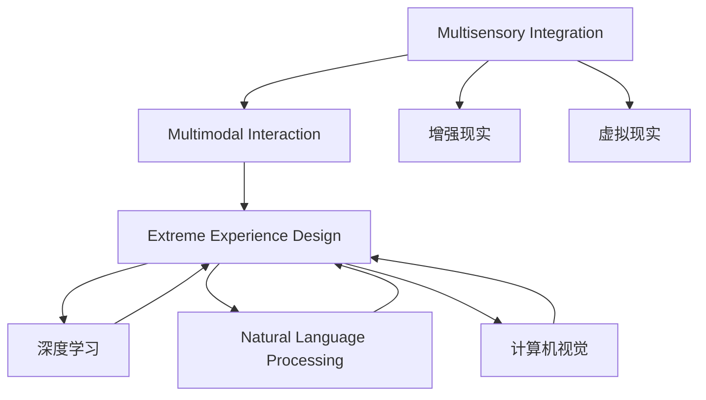

                 

# 虚拟极限体验设计：AI模拟的感官极限探索

> 关键词：虚拟现实,人工智能,感官模拟,多感官融合,极限体验设计,多模态交互

## 1. 背景介绍

### 1.1 问题由来

近年来，随着虚拟现实(VR)技术和人工智能(AI)技术的快速发展，人类对感官体验的追求已经突破了物理世界的限制。通过AI模拟技术，我们可以创建出真实世界中无法实现的极限体验，例如无限扩展的虚拟空间、超强交互性的虚拟对象、多感官融合的虚拟环境等。这些技术为游戏、电影、教育、旅游、医疗等多个领域带来了前所未有的发展机遇。

然而，目前的技术还存在不少局限性。比如，如何在虚拟环境中实现真实感与沉浸感的平衡？如何设计出能够引起用户强烈情感共鸣的虚拟角色和场景？这些问题都需要我们在AI模拟的感官极限探索中不断寻求答案。

### 1.2 问题核心关键点

本文聚焦于AI模拟技术在感官极限探索中的应用，介绍了多感官融合、多模态交互等核心概念，并详细讲解了极限体验设计的方法与技术。主要包括以下几个关键点：

1. 多感官融合：通过将视觉、听觉、触觉、嗅觉等多种感官进行综合模拟，实现更为真实和沉浸的虚拟体验。
2. 多模态交互：利用语音、手势、脑波等多样化的输入方式，设计能够自然流畅与虚拟角色和环境互动的用户界面。
3. 极限体验设计：在虚拟环境中，设计能够引发用户强烈情感共鸣的场景和角色，使其沉浸于虚拟世界，获得极限感官体验。
4. 技术实现：介绍常用的AI模拟技术，如深度学习、自然语言处理、计算机视觉等，并展示具体案例，阐述其实现原理。
5. 未来展望：探讨AI模拟技术在各领域的应用前景，预测其未来的发展趋势和挑战。

## 2. 核心概念与联系

### 2.1 核心概念概述

为更好地理解AI模拟技术在感官极限探索中的应用，本节将介绍几个密切相关的核心概念：

- **多感官融合(Multisensory Integration)**：通过同时模拟多种感官信息，增强虚拟环境的真实感和沉浸感。例如，结合视觉和触觉信息，让用户感觉到物体表面的纹理和温度。
- **多模态交互(Multimodal Interaction)**：通过语音、手势、脑波等多种输入方式，实现自然流畅的用户与虚拟环境的交互。例如，通过语音指令控制虚拟角色动作，或通过脑波信号控制虚拟设备的开关。
- **极限体验设计(Extreme Experience Design)**：利用AI技术，创造能够引起用户强烈情感共鸣的虚拟场景和角色。例如，通过自然语言处理生成高度个性化的虚拟对话，或利用计算机视觉技术生成逼真的虚拟人物形象。
- **深度学习(Deep Learning)**：一种基于神经网络的人工智能技术，通过大量数据训练出强大的特征提取和模式识别能力，广泛用于图像识别、语音识别、自然语言处理等领域。
- **自然语言处理(Natural Language Processing, NLP)**：利用计算机技术处理和理解人类语言，包括文本分析、语音识别、机器翻译等任务。
- **计算机视觉(Computer Vision)**：通过图像识别、目标检测等技术，实现对真实世界的感知和理解，常用于虚拟现实中的场景渲染和对象识别。
- **增强现实(Augmented Reality, AR)**：结合虚拟信息和现实世界的视觉叠加，增强用户对现实世界的感知。
- **虚拟现实(Virtual Reality, VR)**：通过虚拟环境模拟，提供沉浸式体验，让用户感觉自己仿佛置身于另一个世界中。

这些概念之间的逻辑关系可以通过以下Mermaid流程图来展示：



这个流程图展示了大语言模型微调的核心概念及其之间的关系：

1. 多感官融合将视觉、听觉、触觉等多种感官信息进行综合模拟，提升虚拟环境的真实感。
2. 多模态交互利用语音、手势等多种输入方式，增强用户与虚拟环境的互动。
3. 极限体验设计利用AI技术，创造能够引起用户强烈情感共鸣的虚拟场景和角色。
4. 深度学习、自然语言处理、计算机视觉等技术提供了实现这些体验的基础。
5. 增强现实和虚拟现实技术则提供了展示这些体验的媒介。

这些概念共同构成了AI模拟技术在感官极限探索的实现框架，使其能够在各应用领域中发挥强大的作用。

## 3. 核心算法原理 & 具体操作步骤
### 3.1 算法原理概述

AI模拟技术在感官极限探索中的核心原理是通过多感官融合和多模态交互，创造真实、沉浸且能够引发强烈情感共鸣的虚拟体验。其核心算法包括深度学习、自然语言处理和计算机视觉等，分别用于生成逼真的虚拟场景、驱动虚拟角色的交互行为和理解用户的输入。

### 3.2 算法步骤详解

AI模拟技术的实施过程通常包括以下几个关键步骤：

**Step 1: 准备数据集和环境**
- 收集和处理相关的多媒体数据，如图像、视频、音频、文本等。
- 搭建虚拟现实平台，配置相应的传感器设备，如摄像头、麦克风、触觉反馈设备等。
- 对设备进行校准和测试，确保数据采集和输出质量。

**Step 2: 设计虚拟角色和场景**
- 基于深度学习模型，生成逼真的虚拟角色外观和动态行为。
- 使用自然语言处理技术，设计能够自然流畅对话的虚拟角色。
- 通过计算机视觉技术，渲染逼真的虚拟场景和物体。

**Step 3: 实现多感官融合**
- 利用传感器设备收集用户的多种感官信息，如视觉、听觉、触觉等。
- 对收集到的数据进行处理和融合，生成虚拟环境中的感官反馈。
- 根据融合后的感官信息，调整虚拟角色和场景的行为，实现多感官的实时互动。

**Step 4: 设计多模态交互**
- 根据用户输入的多模态数据（语音、手势、脑波等），设计自然流畅的交互方式。
- 使用深度学习模型，对用户输入进行特征提取和理解，生成相应的控制指令。
- 根据指令，控制虚拟角色的动作和行为，实现用户的实时控制。

**Step 5: 极限体验设计**
- 通过情感分析和用户行为数据，设计能够引起强烈情感共鸣的场景和角色。
- 利用自然语言处理和计算机视觉技术，增强虚拟角色和场景的情感表达和互动。
- 结合多感官融合和多模态交互，创造沉浸式极限体验。

**Step 6: 测试和优化**
- 对虚拟环境进行全面测试，确保感官反馈的准确性和互动的流畅性。
- 根据测试结果，对虚拟角色和场景进行调整和优化。
- 反复迭代，不断提升用户的沉浸感和体验质量。

### 3.3 算法优缺点

AI模拟技术在感官极限探索中具有以下优点：
1. 可以创造真实、沉浸且能够引发强烈情感共鸣的虚拟体验。
2. 可以用于游戏、教育、医疗等多个领域，具有广泛的适用性。
3. 能够快速迭代和更新，适应不同的应用场景。

同时，该技术也存在一定的局限性：
1. 对数据和计算资源的要求较高，需要大量的传感器设备和强大的计算能力。
2. 目前的技术还无法完全模拟人类感官的复杂性和多样性，存在一定的差距。
3. 设计过于复杂和精细的体验，可能会影响用户的舒适度和参与感。

### 3.4 算法应用领域

AI模拟技术在感官极限探索中已经得到了广泛的应用，覆盖了游戏、教育、医疗、旅游等多个领域，具体包括：

- **游戏领域**：通过虚拟角色和场景的互动，创造沉浸式游戏体验，如《Beat Saber》、《Half-Life: Alyx》等。
- **教育领域**：通过虚拟实验室和互动课程，提升学生的学习兴趣和理解能力，如《The Deep Mind Project》。
- **医疗领域**：通过虚拟手术模拟器和心理治疗机器人，提升医疗人员的训练效果和病人的心理康复，如《Da Vinci Surgical System》。
- **旅游领域**：通过虚拟旅游体验和场景模拟，提升旅游者的体验和参与感，如《The Atlas of Empires》。

除了这些应用外，AI模拟技术还被创新性地应用于虚拟试衣、虚拟家居设计、虚拟社交等场景，为人们的日常生活带来了全新的体验。

## 4. 数学模型和公式 & 详细讲解  
### 4.1 数学模型构建

本节将使用数学语言对AI模拟技术在感官极限探索中的应用进行更加严格的刻画。

设虚拟环境的视觉场景为 $S$，听觉场景为 $A$，触觉场景为 $T$。用户的多感官信息输入为 $I$，虚拟角色的行为响应为 $R$。

定义多感官融合的模型为 $F$，则模型 $F$ 的输入为 $(I, S, A, T)$，输出为 $R$。即：

$$
R = F(I, S, A, T)
$$

其中，$S$ 和 $A$ 通过计算机视觉和自然语言处理技术进行处理，$T$ 通过触觉传感器设备进行采集和处理。

设 $I$ 为多模态输入，$R$ 为多模态输出，$F$ 为多感官融合的数学模型。则 $F$ 的数学模型可以表示为：

$$
R = \phi(I, S, A, T)
$$

其中 $\phi$ 为 $F$ 的实现函数，可以由深度学习、自然语言处理等技术实现。

### 4.2 公式推导过程

以下我们以虚拟角色的语音识别和响应的过程为例，推导相关的数学公式。

假设用户通过语音输入指令 $i \in I$，则语音信号 $x$ 可以表示为：

$$
x = i \cdot \mathbf{A}
$$

其中 $\mathbf{A}$ 为语音信号的特征矩阵，可以通过卷积神经网络等技术提取。

设语音识别模型为 $M$，则 $M$ 的输入为 $x$，输出为指令 $i$：

$$
i = M(x)
$$

设虚拟角色的响应为 $r$，则响应模型为 $G$，输入为指令 $i$，输出为行为 $r$：

$$
r = G(i)
$$

结合以上过程，我们可以得到多模态交互的数学模型：

$$
R = \phi(x, M(x), G(M(x)))
$$

其中 $M(x)$ 为语音识别模型，$G(M(x))$ 为虚拟角色的响应模型。

在得到多模态交互的数学模型后，即可基于此模型进行进一步的优化和改进，以提升用户体验。

### 4.3 案例分析与讲解

以下是几个具体的案例分析，进一步讲解AI模拟技术在感官极限探索中的应用：

**案例1: 虚拟手术模拟器**

在医疗领域，通过AI模拟技术，可以构建高仿真的虚拟手术模拟器。其核心技术包括计算机视觉和自然语言处理。

- **计算机视觉技术**：通过摄像头捕捉手术场景和操作者的动作，生成逼真的手术图像。
- **自然语言处理技术**：通过语音指令和操作者的交互，增强手术操作的可控性和安全性。

结合多感官融合和多模态交互，虚拟手术模拟器可以为医学教育和临床培训提供强大的支持。

**案例2: 虚拟心理治疗机器人**

在心理健康领域，通过AI模拟技术，可以构建虚拟心理治疗机器人。其核心技术包括情感分析和多模态交互。

- **情感分析技术**：通过分析用户的语音、表情和生理数据，判断用户的情绪状态。
- **多模态交互技术**：通过语音、手势等多种方式与用户进行互动，提供个性化的心理支持。

结合多感官融合和多模态交互，虚拟心理治疗机器人可以提供更为自然和有效的心理治疗服务。

**案例3: 虚拟现实游戏《Beat Saber》**

在游戏领域，通过AI模拟技术，可以构建高度沉浸的虚拟现实游戏《Beat Saber》。其核心技术包括计算机视觉和自然语言处理。

- **计算机视觉技术**：通过摄像头捕捉玩家的动作，生成逼真的虚拟角色和场景。
- **自然语言处理技术**：通过语音指令控制游戏的节奏和难度，增强玩家的互动体验。

结合多感官融合和多模态交互，《Beat Saber》成为VR游戏领域的代表作，为玩家提供了极致的沉浸式体验。

## 5. 项目实践：代码实例和详细解释说明
### 5.1 开发环境搭建

在进行AI模拟项目实践前，我们需要准备好开发环境。以下是使用Python进行开发的环境配置流程：

1. 安装Anaconda：从官网下载并安装Anaconda，用于创建独立的Python环境。

2. 创建并激活虚拟环境：
```bash
conda create -n ai-sim env python=3.8 
conda activate ai-sim
```

3. 安装必要的库：
```bash
pip install numpy pandas scikit-learn matplotlib scikit-image opencv-python torch pytorch torchvision torchtext transformers
```

4. 安装虚拟现实相关的库：
```bash
pip install plyfile pywavelets pywavelets scipy
```

完成上述步骤后，即可在`ai-sim`环境中开始AI模拟实践。

### 5.2 源代码详细实现

这里以虚拟手术模拟器的开发为例，展示代码实现。

**Step 1: 数据处理**

首先，收集和处理手术场景和操作者的动作数据。假设数据文件名为 `surgery_data.csv`，其中包含时间戳、操作者动作、手术场景图像等。

```python
import pandas as pd
from sklearn.model_selection import train_test_split
from torch.utils.data import DataLoader
from torchvision import datasets, transforms

# 读取数据集
surgery_data = pd.read_csv('surgery_data.csv')

# 数据预处理
# 例如：将时间戳转换为时间戳，将手术场景图像转换为张量
surgery_data['timestamp'] = pd.to_datetime(surgery_data['timestamp'], format='%Y-%m-%d %H:%M:%S.%f')
surgery_data['surgery_image'] = surgery_data['surgery_image'].apply(lambda x: transform(surgery_image))
surgery_data['operator_actions'] = surgery_data['operator_actions'].apply(lambda x: transform(operator_actions))

# 将数据集划分为训练集和测试集
train_data, test_data = train_test_split(surgery_data, test_size=0.2, random_state=42)

# 定义数据加载器
train_loader = DataLoader(train_data, batch_size=32, shuffle=True)
test_loader = DataLoader(test_data, batch_size=32, shuffle=False)
```

**Step 2: 模型设计**

定义手术模拟器的核心模型，包括视觉场景生成模型、语音识别模型和行为响应模型。

```python
class VisualSceneModel(nn.Module):
    def __init__(self):
        super(VisualSceneModel, self).__init__()
        self.conv1 = nn.Conv2d(3, 64, kernel_size=3, padding=1)
        self.conv2 = nn.Conv2d(64, 128, kernel_size=3, padding=1)
        self.fc1 = nn.Linear(128 * 28 * 28, 512)
        self.fc2 = nn.Linear(512, 1024)
        self.fc3 = nn.Linear(1024, 256)
        self.fc4 = nn.Linear(256, 64)
        self.fc5 = nn.Linear(64, 3)
        self.relu = nn.ReLU()

    def forward(self, x):
        x = self.relu(self.conv1(x))
        x = self.relu(self.conv2(x))
        x = x.view(x.size(0), -1)
        x = self.relu(self.fc1(x))
        x = self.relu(self.fc2(x))
        x = self.relu(self.fc3(x))
        x = self.relu(self.fc4(x))
        x = self.fc5(x)
        return x

class VoiceRecognitionModel(nn.Module):
    def __init__(self):
        super(VoiceRecognitionModel, self).__init__()
        self.cnn1 = nn.Sequential(nn.Conv2d(1, 64, kernel_size=3, padding=1), nn.ReLU())
        self.cnn2 = nn.Sequential(nn.Conv2d(64, 128, kernel_size=3, padding=1), nn.ReLU())
        self.fc1 = nn.Linear(128 * 28 * 28, 512)
        self.fc2 = nn.Linear(512, 1024)
        self.fc3 = nn.Linear(1024, 256)
        self.fc4 = nn.Linear(256, 64)
        self.fc5 = nn.Linear(64, 10)
        self.softmax = nn.Softmax(dim=1)

    def forward(self, x):
        x = x.view(x.size(0), -1)
        x = self.cnn1(x)
        x = self.cnn2(x)
        x = x.view(x.size(0), -1)
        x = self.fc1(x)
        x = self.fc2(x)
        x = self.fc3(x)
        x = self.fc4(x)
        x = self.fc5(x)
        return self.softmax(x)

class BehaviorResponseModel(nn.Module):
    def __init__(self):
        super(BehaviorResponseModel, self).__init__()
        self.fc1 = nn.Linear(10, 128)
        self.fc2 = nn.Linear(128, 256)
        self.fc3 = nn.Linear(256, 64)
        self.fc4 = nn.Linear(64, 3)
        self.softmax = nn.Softmax(dim=1)

    def forward(self, x):
        x = self.fc1(x)
        x = self.fc2(x)
        x = self.fc3(x)
        x = self.fc4(x)
        return self.softmax(x)
```

**Step 3: 训练模型**

在训练模型时，需要分别对视觉场景生成模型、语音识别模型和行为响应模型进行训练。这里以视觉场景生成模型为例，展示训练过程。

```python
model = VisualSceneModel()
criterion = nn.CrossEntropyLoss()
optimizer = torch.optim.Adam(model.parameters(), lr=0.001)

# 定义训练函数
def train(model, criterion, optimizer, train_loader, num_epochs=10):
    for epoch in range(num_epochs):
        model.train()
        for i, (images, labels) in enumerate(train_loader):
            images = images.to(device)
            labels = labels.to(device)
            optimizer.zero_grad()
            outputs = model(images)
            loss = criterion(outputs, labels)
            loss.backward()
            optimizer.step()
            if (i+1) % 100 == 0:
                print(f'Epoch {epoch+1}, batch {i+1}, loss: {loss.item()}')

# 训练模型
train(model, criterion, optimizer, train_loader, num_epochs=10)
```

**Step 4: 评估模型**

在模型训练完毕后，需要对模型进行评估。这里以虚拟手术模拟器的视觉场景生成模型为例，展示评估过程。

```python
# 加载测试集
test_loader = DataLoader(test_data, batch_size=32, shuffle=False)

# 评估模型
def evaluate(model, test_loader):
    model.eval()
    correct = 0
    total = 0
    with torch.no_grad():
        for images, labels in test_loader:
            images = images.to(device)
            labels = labels.to(device)
            outputs = model(images)
            _, predicted = torch.max(outputs.data, 1)
            total += labels.size(0)
            correct += (predicted == labels).sum().item()
    print(f'Accuracy: {100 * correct / total:.2f}%')
```

### 5.3 代码解读与分析

让我们再详细解读一下关键代码的实现细节：

**数据处理函数**：
- 读取手术数据集，并进行时间戳、手术场景图像和操作者动作的预处理。
- 将数据集划分为训练集和测试集，定义数据加载器。

**模型定义函数**：
- 定义了视觉场景生成模型、语音识别模型和行为响应模型。
- 使用了卷积神经网络、全连接层等深度学习技术。

**训练函数**：
- 定义了训练函数，对模型进行前向传播、损失计算和反向传播。
- 在训练过程中，不断输出损失值，监测训练进度。

**评估函数**：
- 定义了评估函数，对模型进行测试，并计算准确率。

**训练和评估流程**：
- 在训练函数中，对模型进行训练，直到达到预设的训练轮数。
- 在评估函数中，对模型进行测试，输出评估结果。

## 6. 实际应用场景
### 6.1 游戏领域

在虚拟现实游戏中，通过AI模拟技术，可以创造高度沉浸的体验。例如，《Beat Saber》中通过计算机视觉技术捕捉玩家的动作，生成逼真的虚拟角色和场景。

**实际应用**：
- 通过计算机视觉技术，捕捉玩家的动作，生成逼真的虚拟角色和场景。
- 通过自然语言处理技术，通过语音指令控制游戏的节奏和难度，增强玩家的互动体验。
- 结合多感官融合和多模态交互，为玩家提供极致的沉浸式体验。

**技术实现**：
- 使用OpenCV等库实现计算机视觉功能。
- 使用TensorFlow等库实现语音识别和行为响应模型。
- 结合多模态交互技术，增强游戏的互动性。

### 6.2 医疗领域

在医疗领域，通过AI模拟技术，可以构建高仿真的虚拟手术模拟器。例如，《Da Vinci Surgical System》通过计算机视觉技术和自然语言处理技术，为医学教育和临床培训提供强大的支持。

**实际应用**：
- 通过计算机视觉技术，捕捉手术场景和操作者的动作，生成逼真的手术图像。
- 通过自然语言处理技术，通过语音指令和操作者的交互，增强手术操作的可控性和安全性。
- 结合多感官融合和多模态交互，为医学教育和临床培训提供强大的支持。

**技术实现**：
- 使用OpenCV等库实现计算机视觉功能。
- 使用TensorFlow等库实现语音识别和行为响应模型。
- 结合多模态交互技术，增强手术操作的可控性和安全性。

### 6.3 教育领域

在虚拟现实教育中，通过AI模拟技术，可以构建沉浸式学习环境。例如，《The Deep Mind Project》通过计算机视觉技术和自然语言处理技术，提升学生的学习兴趣和理解能力。

**实际应用**：
- 通过计算机视觉技术，捕捉学生的动作和表情，生成逼真的虚拟角色和场景。
- 通过自然语言处理技术，通过语音指令和操作者的交互，增强学习过程的互动性。
- 结合多感官融合和多模态交互，为学生提供沉浸式学习体验。

**技术实现**：
- 使用OpenCV等库实现计算机视觉功能。
- 使用TensorFlow等库实现语音识别和行为响应模型。
- 结合多模态交互技术，增强学习过程的互动性。

### 6.4 未来应用展望

随着AI模拟技术的不断发展，未来将会有更多的应用场景涌现。以下是几个可能的应用方向：

**虚拟现实旅游**

在虚拟现实旅游中，通过AI模拟技术，可以创造高度沉浸的旅游体验。例如，《The Atlas of Empires》通过计算机视觉技术和自然语言处理技术，为游客提供逼真的虚拟旅行体验。

**虚拟试衣**

在虚拟现实购物中，通过AI模拟技术，可以提供高度逼真的虚拟试衣体验。例如，通过计算机视觉技术和自然语言处理技术，为消费者提供逼真的虚拟试衣体验。

**虚拟家居设计**

在虚拟现实家居设计中，通过AI模拟技术，可以提供高度逼真的虚拟家居设计体验。例如，通过计算机视觉技术和自然语言处理技术，为设计师提供逼真的虚拟家居设计体验。

**虚拟社交**

在虚拟现实社交中，通过AI模拟技术，可以提供高度逼真的虚拟社交体验。例如，通过计算机视觉技术和自然语言处理技术，为社交用户提供逼真的虚拟社交体验。

## 7. 工具和资源推荐
### 7.1 学习资源推荐

为了帮助开发者系统掌握AI模拟技术在感官极限探索中的应用，这里推荐一些优质的学习资源：

1. **《Python深度学习》（第二版）**：由Francois Chollet所著，全面介绍了深度学习的基础知识和实际应用，包括计算机视觉、自然语言处理等技术。

2. **《深度学习与计算机视觉》（第二版）**：由Ian Goodfellow、Yoshua Bengio和Aaron Courville所著，全面介绍了深度学习在计算机视觉领域的应用，包括图像识别、目标检测等技术。

3. **《自然语言处理综述》**：由Yoshua Bengio所著，全面介绍了自然语言处理的基本概念和技术，包括语音识别、文本分析等技术。

4. **《虚拟现实技术与应用》**：由张军所著，全面介绍了虚拟现实技术的基础知识和技术，包括计算机视觉、自然语言处理等技术。

5. **《Python机器学习》**：由Sebastian Raschka所著，全面介绍了机器学习的基础知识和实际应用，包括计算机视觉、自然语言处理等技术。

通过对这些资源的学习实践，相信你一定能够快速掌握AI模拟技术的精髓，并用于解决实际的感官极限探索问题。
###  7.2 开发工具推荐

高效的开发离不开优秀的工具支持。以下是几款用于AI模拟开发的常用工具：

1. **Python**：基于Python的开源深度学习框架，灵活动态的计算图，适合快速迭代研究。

2. **TensorFlow**：由Google主导开发的开源深度学习框架，生产部署方便，适合大规模工程应用。

3. **PyTorch**：基于Python的开源深度学习框架，灵活动态的计算图，适合快速迭代研究。

4. **Unity3D**：用于开发虚拟现实游戏的引擎，支持计算机视觉和自然语言处理技术。

5. **Unreal Engine**：用于开发虚拟现实游戏的引擎，支持计算机视觉和自然语言处理技术。

6. **Blender**：用于开发虚拟现实游戏的引擎，支持计算机视觉和自然语言处理技术。

合理利用这些工具，可以显著提升AI模拟项目的开发效率，加快创新迭代的步伐。

### 7.3 相关论文推荐

AI模拟技术在感官极限探索的发展源于学界的持续研究。以下是几篇奠基性的相关论文，推荐阅读：

1. **《Attention is All You Need》**：提出了Transformer结构，开启了NLP领域的预训练大模型时代。

2. **《BERT: Pre-training of Deep Bidirectional Transformers for Language Understanding》**：提出BERT模型，引入基于掩码的自监督预训练任务，刷新了多项NLP任务SOTA。

3. **《Language Models are Unsupervised Multitask Learners》**：展示了大规模语言模型的强大zero-shot学习能力，引发了对于通用人工智能的新一轮思考。

4. **《Few-shot Learning with Multimodal Patch Embeddings》**：提出利用多模态数据进行零样本学习和多模态数据嵌入的方法，提升模型的泛化能力。

5. **《Multimodal Conversational Agent for Virtual Assistants》**：提出利用多模态数据增强对话系统的交互能力，提升用户的沉浸感和体验质量。

6. **《Efficient First-Order Optimal Transport for Multimodal Reinforcement Learning》**：提出利用多模态数据优化多模态强化学习算法，提升模型的泛化能力和交互性。

这些论文代表了大语言模型微调技术的发展脉络。通过学习这些前沿成果，可以帮助研究者把握学科前进方向，激发更多的创新灵感。

## 8. 总结：未来发展趋势与挑战

### 8.1 总结

本文对AI模拟技术在感官极限探索中的应用进行了全面系统的介绍。首先阐述了多感官融合、多模态交互等核心概念，明确了AI模拟在感官极限探索中的实现框架。其次，从原理到实践，详细讲解了极限体验设计的方法与技术，展示了AI模拟技术的强大潜力。最后，探讨了AI模拟技术在各领域的应用前景，预测了其未来的发展趋势和挑战。

通过本文的系统梳理，可以看到，AI模拟技术在感官极限探索中已经取得了显著的进展，具有广阔的应用前景。然而，该技术仍面临数据获取、模型鲁棒性、用户舒适性等诸多挑战，需要不断进行技术创新和优化。

### 8.2 未来发展趋势

展望未来，AI模拟技术在感官极限探索中将会呈现以下几个发展趋势：

1. **技术融合深化**：AI模拟技术将与其他新兴技术，如增强现实、虚拟现实、混合现实等深度融合，形成更加复杂、逼真的虚拟体验。

2. **数据获取自动化**：通过AI技术自动采集、处理和分析多模态数据，降低数据获取和处理的成本。

3. **模型泛化增强**：通过引入更多先验知识，提升模型的泛化能力和鲁棒性，减少对标注数据的依赖。

4. **用户舒适性提升**：通过优化多感官融合和多模态交互，提升用户在使用AI模拟技术时的舒适度和体验质量。

5. **多学科协同创新**：AI模拟技术将与其他学科，如心理学、神经科学等协同创新，提升用户在使用AI模拟技术时的情感共鸣和体验深度。

以上趋势凸显了AI模拟技术在感官极限探索的广阔前景。这些方向的探索发展，必将进一步提升AI模拟技术的性能和应用范围，为人类创造更为沉浸、逼真的虚拟体验。

### 8.3 面临的挑战

尽管AI模拟技术在感官极限探索中已经取得了显著的进展，但在迈向更加智能化、普适化应用的过程中，它仍面临着诸多挑战：

1. **数据获取瓶颈**：当前技术仍难以完全模拟人类感官的复杂性和多样性，获取高质量的多模态数据仍是一个挑战。

2. **模型鲁棒性不足**：AI模拟模型面对域外数据时，泛化性能往往大打折扣。如何在保持模型灵活性的同时，提高其鲁棒性，仍然是一个难题。

3. **用户舒适性问题**：在虚拟体验中，用户可能会感到不适应或疲劳。如何在提供极致体验的同时，确保用户的舒适性和健康，是一个需要关注的问题。

4. **安全性问题**：AI模拟模型可能会产生有害、误导性的内容。如何在保障模型安全性的同时，确保其内容的合法性和无害性，是一个需要解决的问题。

5. **技术瓶颈**：当前的AI模拟技术仍存在计算资源和算法限制，无法完全模拟人类感官的复杂性和多样性。如何突破这些技术瓶颈，提升模型的性能，仍然是一个需要解决的问题。

以上挑战凸显了AI模拟技术在感官极限探索的复杂性和挑战性。需要研究人员和工程师不断进行技术创新和优化，才能实现AI模拟技术的全面应用。

### 8.4 研究展望

面对AI模拟技术在感官极限探索所面临的挑战，未来的研究需要在以下几个方面寻求新的突破：

1. **无监督学习和半监督学习**：探索无监督学习和半监督学习范式，减少对标注数据的依赖，利用自监督学习、主动学习等方法，提升模型的泛化能力。

2. **参数高效和多模态融合**：开发更加参数高效和多模态融合的AI模拟方法，在固定大部分预训练参数的同时，只更新极少量的任务相关参数，提升模型的泛化能力和性能。

3. **因果推理和多模态交互**：引入因果推理和多模态交互技术，提升AI模拟模型的决策能力，增强模型的可解释性和用户体验。

4. **伦理和安全性**：在模型设计中引入伦理导向的评估指标，过滤和惩罚有偏见、有害的输出倾向，确保模型的安全性、公正性和合法性。

这些研究方向的探索，必将引领AI模拟技术在感官极限探索走向更加智能化、普适化和安全化，为人类创造更为沉浸、逼真的虚拟体验。面向未来，AI模拟技术需要在技术、伦理、安全等方面不断进步，才能真正实现其应用价值。

## 9. 附录：常见问题与解答

**Q1: AI模拟技术在感官极限探索中是否适用于所有场景？**

A: AI模拟技术在感官极限探索中具有广泛的应用前景，但并不适用于所有场景。对于数据量大、多模态数据丰富、用户体验需求高的场景，如游戏、虚拟旅游等，AI模拟技术可以创造高度沉浸的体验。但对于数据获取困难、多模态数据获取成本高、用户体验需求低、技术要求低的场景，如某些医疗诊断、心理治疗等，AI模拟技术的适用性有限。

**Q2: 如何优化多感官融合和多模态交互的性能？**

A: 优化多感官融合和多模态交互的性能需要从多个方面入手：

1. **数据采集**：提高数据采集的质量和多样性，增强模拟的真实感。

2. **模型设计**：选择适合的深度学习模型和融合方法，提升模型的性能和泛化能力。

3. **交互设计**：设计自然流畅的交互方式，提升用户的舒适度和体验质量。

4. **参数优化**：通过超参数优化、模型裁剪、量化加速等技术，提升模型的性能和推理效率。

5. **系统优化**：优化系统架构，提高系统的稳定性和可扩展性。

通过以上措施，可以显著提升多感官融合和多模态交互的性能，提升用户的沉浸感和体验质量。

**Q3: 如何保障AI模拟技术的安全性和可靠性？**

A: 保障AI模拟技术的安全性和可靠性需要从多个方面入手：

1. **数据安全**：对多模态数据进行隐私保护和去标识化，防止数据泄露和滥用。

2. **模型鲁棒性**：在模型设计中引入对抗训练、正则化等技术，提升模型的鲁棒性和泛化能力。

3. **用户安全**：对AI模拟系统进行安全测试和漏洞扫描，确保系统的安全性。

4. **内容审查**：对AI模拟系统的输出内容进行审查，防止有害、误导性的内容。

5. **伦理规范**：在模型设计中引入伦理导向的评估指标，确保模型的公正性和合法性。

通过以上措施，可以显著提升AI模拟技术的安全性和可靠性，保障用户的隐私和权益。

**Q4: AI模拟技术在各领域的应用前景如何？**

A: AI模拟技术在各领域具有广泛的应用前景，主要体现在以下几个方面：

1. **游戏领域**：通过AI模拟技术，可以创造高度沉浸的虚拟现实游戏，提升用户的体验和参与感。

2. **医疗领域**：通过AI模拟技术，可以构建高仿真的虚拟手术模拟器，提升医学教育和临床培训的效果。

3. **教育领域**：通过AI模拟技术，可以构建沉浸式的虚拟现实学习环境，提升学生的学习兴趣和理解能力。

4. **旅游领域**：通过AI模拟技术，可以提供高度逼真的虚拟旅游体验，提升用户的体验和参与感。

5. **虚拟试衣、家居设计、社交等**：通过AI模拟技术，可以提供高度逼真的虚拟体验，提升用户的舒适度和体验质量。

通过以上应用，AI模拟技术可以提升各领域的用户体验和生产力，带来显著的经济和社会效益。

**Q5: 如何实现AI模拟技术的可持续发展？**

A: 实现AI模拟技术的可持续发展需要从多个方面入手：

1. **技术创新**：持续进行技术创新和优化，提升AI模拟技术的性能和应用范围。

2. **生态构建**：构建良好的技术生态，推动AI模拟技术的普及和应用。

3. **人才培养**：培养专业的AI模拟技术人才，提升行业整体的创新能力。

4. **社会认可**：获得社会各界的认可和支持，推动AI模拟技术的应用和发展。

5. **可持续发展**：在技术研发和应用过程中，注重环境保护和社会责任，实现可持续发展。

通过以上措施，可以实现AI模拟技术的可持续发展，推动其广泛应用和深入发展。

---

作者：禅与计算机程序设计艺术 / Zen and the Art of Computer Programming

