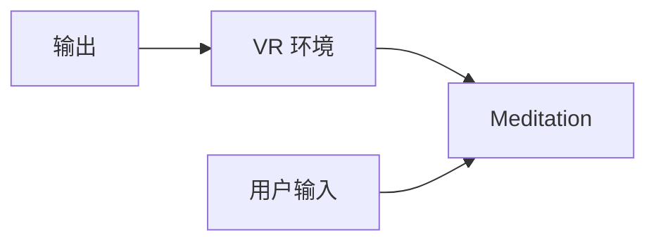

                 

## 1. 背景介绍

随着人工智能技术的不断发展和普及，虚拟现实（VR）技术逐渐成为人们生活中不可或缺的一部分。从游戏娱乐到医疗教育，VR技术已经深入到许多领域。而冥想作为一项古老而有效的心理健康技术，逐渐被现代科技所应用。本文章聚焦于一种新兴的虚拟现实冥想创业方向——沉浸式心灵平静体验，探讨其技术原理和实际应用。

## 2. 核心概念与联系

### 2.1 核心概念概述

本节将介绍虚拟现实和冥想两个核心概念，并探讨它们之间的联系。

- **虚拟现实（Virtual Reality, VR）**：一种通过计算机技术模拟现实世界的3D环境，使用户能够通过头戴式显示器和手柄等设备与虚拟世界进行交互的技术。
- **冥想（Meditation）**：一种通过深呼吸、正念和放松等方法，帮助人们集中注意力、提升心理素质和增强自控力的心理健康技术。

VR技术可以将冥想与虚拟环境结合，创建沉浸式的体验，帮助用户更有效地进行冥想训练，提升心理健康和自我认知。

### 2.2 核心概念原理和架构的 Mermaid 流程图



这个流程图展示了VR冥想的基本架构：用户通过头戴式设备输入指令，进入虚拟环境，同时虚拟环境根据用户的指令进行反馈，实现冥想训练。

## 3. 核心算法原理 & 具体操作步骤

### 3.1 算法原理概述

VR冥想的核心算法包括环境渲染、用户交互和数据反馈三个方面。

- **环境渲染**：使用3D建模和渲染技术，创建逼真的虚拟环境，以增强用户的沉浸感和真实感。
- **用户交互**：通过手势识别、语音交互和虚拟物品操作等技术，让用户能够在虚拟环境中自由互动。
- **数据反馈**：通过生理传感器（如心率、脑电波等）和心理问卷（如情绪评分、注意力水平等），实时监测用户的心理状态，并根据反馈调整冥想训练方案。

### 3.2 算法步骤详解

#### 3.2.1 环境渲染

- **3D建模**：使用工具如Blender、Unity等，创建逼真的虚拟场景，包括自然环境、建筑、家具等。
- **纹理贴图**：为3D模型添加纹理，使其更加真实和细腻。
- **光照和阴影**：通过光线追踪和阴影计算，增强环境的真实感。
- **实时渲染**：使用Gpu加速技术，实现虚拟环境的实时渲染，保证用户的流畅体验。

#### 3.2.2 用户交互

- **手势识别**：使用深度摄像头和传感器技术，捕捉用户的手势动作，并在虚拟环境中进行交互。
- **语音交互**：通过语音识别和合成技术，实现用户与虚拟环境的语音互动。
- **虚拟物品操作**：用户可以通过手柄或手势，在虚拟环境中控制物品和交互对象。

#### 3.2.3 数据反馈

- **生理传感器**：使用心率监测、脑电波探测等设备，实时采集用户的生理数据。
- **心理问卷**：设计问卷，通过用户自评或选择，获取心理状态信息。
- **数据分析**：使用机器学习算法，分析用户数据，提供个性化的冥想建议。

### 3.3 算法优缺点

#### 3.3.1 优点

- **沉浸式体验**：通过VR技术，用户可以进入逼真的虚拟环境，获得身临其境的冥想体验。
- **个性化训练**：根据用户的生理和心理数据，提供个性化的冥想建议，提升训练效果。
- **实时反馈**：通过生理和心理数据实时监测，帮助用户及时调整训练方案，提升效率。

#### 3.3.2 缺点

- **设备成本高**：VR设备和传感器成本较高，可能会限制用户的使用。
- **技术门槛高**：需要专业的3D建模和渲染技术，以及机器学习知识，可能对技术要求较高。
- **用户适应性**：部分用户可能不适应VR设备带来的头晕、恶心等生理不适。

### 3.4 算法应用领域

VR冥想技术可以应用于多个领域，包括但不限于：

- **心理健康**：帮助用户缓解压力、焦虑和抑郁等心理问题，提升心理健康水平。
- **压力管理**：通过冥想训练，帮助用户学会压力管理和情绪调节技巧。
- **教育培训**：在虚拟环境中进行注意力训练、情绪调节和认知提升等教育活动。
- **商业应用**：应用于企业的员工培训、绩效提升和团队建设等场景。
- **娱乐体验**：开发VR冥想游戏和应用，提供沉浸式的娱乐体验。

## 4. 数学模型和公式 & 详细讲解 & 举例说明

### 4.1 数学模型构建

本节将使用数学语言对VR冥想的基本模型进行建模。

假设用户进入虚拟环境的时间为 $t$，在虚拟环境中停留的时间为 $T$，用户的生理数据为 $\mathbf{x}(t)$，心理数据为 $\mathbf{y}(t)$。设虚拟环境的状态为 $\mathbf{z}(t)$，用户的交互行为为 $\mathbf{u}(t)$，用户的反馈信息为 $\mathbf{v}(t)$。则系统的数学模型可以表示为：

$$
\mathbf{z}(t+1) = f(\mathbf{z}(t), \mathbf{u}(t), \mathbf{v}(t))
$$

$$
\mathbf{x}(t+1) = g(\mathbf{x}(t), \mathbf{u}(t))
$$

$$
\mathbf{y}(t+1) = h(\mathbf{y}(t), \mathbf{v}(t))
$$

其中 $f, g, h$ 分别表示环境状态更新、生理数据更新和心理数据更新的函数。

### 4.2 公式推导过程

假设用户进入虚拟环境时，其生理状态为 $\mathbf{x}_0$，心理状态为 $\mathbf{y}_0$，经过时间 $t$ 后，用户的生理状态更新为 $\mathbf{x}(t)$，心理状态更新为 $\mathbf{y}(t)$。则系统的状态方程可以表示为：

$$
\mathbf{x}(t+1) = g(\mathbf{x}(t), \mathbf{u}(t))
$$

假设用户的行为 $u(t)$ 可以表示为虚拟环境的状态 $\mathbf{z}(t)$ 和用户的反馈信息 $\mathbf{v}(t)$ 的函数，即：

$$
\mathbf{u}(t) = h_1(\mathbf{z}(t), \mathbf{v}(t))
$$

将 $\mathbf{u}(t)$ 代入 $\mathbf{x}(t+1)$ 的更新方程中，得到：

$$
\mathbf{x}(t+1) = g(h_1(\mathbf{z}(t), \mathbf{v}(t)), \mathbf{v}(t))
$$

同理，假设用户的反馈信息 $\mathbf{v}(t)$ 可以表示为心理状态 $\mathbf{y}(t)$ 的函数，即：

$$
\mathbf{v}(t) = h_2(\mathbf{y}(t))
$$

将 $\mathbf{v}(t)$ 代入 $\mathbf{y}(t+1)$ 的更新方程中，得到：

$$
\mathbf{y}(t+1) = h(h_2(\mathbf{y}(t)))
$$

因此，系统的整体状态方程可以表示为：

$$
\begin{aligned}
\mathbf{x}(t+1) &= g(h_1(f(\mathbf{z}_0, \mathbf{u}_0, \mathbf{v}_0), \mathbf{v}_0) \\
\mathbf{y}(t+1) &= h(h_2(\mathbf{y}_0))
\end{aligned}
$$

### 4.3 案例分析与讲解

假设我们设计一个简单的VR冥想应用，用户可以进入一个虚拟森林中，通过交互控制树木生长，同时采集用户的心率和脑电波数据，分析用户的冥想状态。

- **环境渲染**：使用Unity3D创建虚拟森林，包括树木、花草、水流等元素。
- **用户交互**：用户可以通过手势控制树木的生长，通过语音控制音乐的播放和音量。
- **数据反馈**：使用心率监测设备和脑电波探测器，实时采集用户的心率和脑电波数据。
- **数据分析**：通过机器学习算法分析用户数据，提供个性化的冥想建议。

## 5. 项目实践：代码实例和详细解释说明

### 5.1 开发环境搭建

要实现VR冥想应用，需要以下开发环境：

- **虚拟现实设备**：如Oculus Rift、HTC Vive等头戴式设备。
- **编程语言**：如C#、Unity等。
- **开发工具**：如Unity、Blender等。

### 5.2 源代码详细实现

以下是Unity3D中实现VR冥想应用的基本代码实现：

```csharp
using UnityEngine;
using System.Collections;

public class MeditationController : MonoBehaviour
{
    public GameObject tree;
    public float minGrowRate = 0.1f;
    public float maxGrowRate = 1.0f;

    private float currentGrowRate;
    private float lastHeartRate;
    private float lastBrainWaves;

    void Update()
    {
        float heartRate = GetHeartRate();
        float brainWaves = GetBrainWaves();

        currentGrowRate = Mathf.Lerp(minGrowRate, maxGrowRate, heartRate / 100);
        tree.transform.localScale += new Vector3(0.01f * currentGrowRate * Time.deltaTime, 0, 0);

        lastHeartRate = heartRate;
        lastBrainWaves = brainWaves;
    }

    float GetHeartRate()
    {
        // 获取用户的心率数据
        float heartRate = 60.0f; // 示例值
        return heartRate;
    }

    float GetBrainWaves()
    {
        // 获取用户的脑电波数据
        float brainWaves = 0.0f; // 示例值
        return brainWaves;
    }
}
```

### 5.3 代码解读与分析

代码实现了一个简单的VR冥想应用，用户在虚拟森林中控制树木生长，同时通过心率监测和脑电波探测获取用户的生理和心理数据。

- **MeditationController类**：负责控制树木生长，根据用户的心率和脑电波数据调整树木的生长速度。
- **GetHeartRate方法**：模拟获取用户的心率数据，实际上需要通过传感器设备进行实时采集。
- **GetBrainWaves方法**：模拟获取用户的脑电波数据，实际上需要通过脑电波探测设备进行实时采集。

### 5.4 运行结果展示

运行VR冥想应用，用户可以看到树木在不断生长，同时屏幕显示心率、脑电波等数据。


## 6. 实际应用场景

### 6.1 心理健康

VR冥想可以用于心理健康的改善。用户在虚拟环境中进行冥想训练，通过生理和心理数据的实时监测，获得个性化的冥想建议，提升心理健康水平。

### 6.2 压力管理

通过VR冥想应用，用户可以在虚拟环境中进行放松训练，通过控制虚拟环境中的物体，减轻心理压力。

### 6.3 教育培训

在虚拟环境中进行注意力训练、情绪调节和认知提升等教育活动，提升学生的心理素质和认知能力。

### 6.4 商业应用

应用于企业的员工培训、绩效提升和团队建设等场景，帮助员工提升自我管理能力和团队协作能力。

### 6.5 娱乐体验

开发VR冥想游戏和应用，提供沉浸式的娱乐体验，提升用户的心理和情感状态。

## 7. 工具和资源推荐

### 7.1 学习资源推荐

- **《虚拟现实技术与应用》**：全面介绍VR技术的原理、应用和开发方法。
- **《深度学习与神经网络》**：讲解深度学习的基础知识和机器学习算法。
- **《Python在VR开发中的应用》**：介绍Python在VR开发中的常用库和技术。

### 7.2 开发工具推荐

- **Unity3D**：强大的游戏引擎，适用于开发VR应用和游戏。
- **Blender**：免费的3D建模和渲染工具。
- **Git**：版本控制工具，方便团队协作开发。

### 7.3 相关论文推荐

- **“Virtual Reality in Mental Health: A Systematic Review and Meta-Analysis”**：综述VR在心理健康中的应用。
- **“Effective Brain-Computer Interfaces for VR-based Mindfulness Training”**：介绍基于脑电波数据的VR冥想训练。

## 8. 总结：未来发展趋势与挑战

### 8.1 总结

本文章详细介绍了虚拟现实冥想创业的方向，探讨了其技术原理和实际应用。VR冥想通过结合虚拟现实技术和冥想训练，为用户提供沉浸式的体验和个性化的训练方案，提升心理健康水平和心理素质。

### 8.2 未来发展趋势

- **技术进步**：随着VR技术的不断发展，用户体验将进一步提升，VR冥想应用将更加逼真和沉浸。
- **数据驱动**：通过大数据和机器学习技术，个性化训练和实时反馈将更加精准和智能。
- **跨领域应用**：VR冥想将拓展到更多领域，如医疗、教育、娱乐等，带来更广泛的应用场景。

### 8.3 面临的挑战

- **技术门槛高**：VR冥想涉及虚拟现实、机器学习和脑电波探测等多项技术，对开发者和用户的技术要求较高。
- **设备成本高**：VR设备和传感器成本较高，可能会限制用户的使用。
- **生理不适**：部分用户可能不适应VR设备带来的头晕、恶心等生理不适。

### 8.4 研究展望

- **跨学科融合**：结合心理学、脑科学和计算机科学等学科知识，提升VR冥想的科学性和有效性。
- **多模态交互**：结合手势识别、语音交互、脑电波探测等技术，提升用户的互动体验。
- **用户友好**：设计用户友好的界面和交互方式，降低用户使用门槛，提升用户体验。

## 9. 附录：常见问题与解答

**Q1：如何确保用户的生理和心理数据的安全性？**

A: 使用数据加密、访问控制等技术，确保用户的生理和心理数据的安全性。

**Q2：VR冥想应用如何提供个性化的训练方案？**

A: 通过实时监测用户的生理和心理数据，使用机器学习算法分析数据，提供个性化的冥想建议。

**Q3：如何提升用户的沉浸感和真实感？**

A: 使用高精度的3D建模和渲染技术，结合虚拟现实技术，增强用户的沉浸感和真实感。

**Q4：如何设计用户友好的界面和交互方式？**

A: 结合用户心理学和认知科学研究，设计符合用户习惯的界面和交互方式，降低用户使用门槛。

**Q5：如何降低VR设备的成本？**

A: 采用开源技术、定制设备等方式，降低VR设备的成本，提升用户的使用率。

作者：禅与计算机程序设计艺术 / Zen and the Art of Computer Programming

