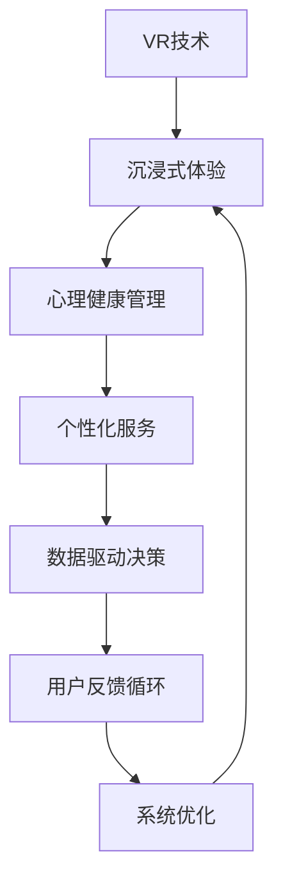

                 

# 虚拟现实情感调节创业：沉浸式心理健康管理平台

> 关键词：虚拟现实(VR), 情感调节, 心理健康管理, 沉浸式体验, 人工智能(AI), 用户体验(UI/UX), 用户反馈循环, 数据隐私

## 1. 背景介绍

### 1.1 问题由来
近年来，随着智能设备和虚拟现实技术的普及，心理健康问题越来越受到社会各界的关注。据世界卫生组织（WHO）统计，全球有超过4亿人患有心理健康问题，约占总人口的1/6。然而，传统的心理治疗手段难以覆盖如此庞大的需求，且面临着时间、地点、费用等诸多限制。

虚拟现实（VR）技术的出现，为解决这些问题提供了新的可能性。VR通过创造沉浸式环境，让用户身临其境地体验各种心理治疗场景，从而帮助他们缓解压力、放松心情、释放焦虑。然而，现有的VR应用主要关注的是游戏和娱乐，对心理健康治疗的探索还处于初级阶段。如何利用VR技术提供专业的心理健康服务，满足用户对沉浸式体验的需求，是一个亟待解决的问题。

## 1.2 问题核心关键点
基于VR的沉浸式心理健康管理平台旨在通过定制化的虚拟环境，为用户提供个性化的心理治疗服务。核心关键点包括：

1. **沉浸式体验**：通过VR技术，为用户创造一个高度沉浸的虚拟环境，模拟真实治疗场景。
2. **个性化服务**：根据用户的心理状态和偏好，定制个性化的心理治疗方案。
3. **数据驱动决策**：利用用户的行为数据和反馈，持续优化治疗方案，提升治疗效果。
4. **隐私保护**：确保用户数据的安全性，避免数据泄露和滥用。
5. **跨平台访问**：提供跨设备、跨平台访问的便捷性，使用户随时随地都能使用平台。

## 1.3 问题研究意义
构建虚拟现实情感调节创业项目，对心理健康管理具有重要意义：

1. **扩宽服务覆盖**：利用VR技术，为用户提供随时随地、不受地点限制的心理健康服务，解决传统治疗手段的时间和空间限制问题。
2. **提升用户体验**：沉浸式体验可以显著提高用户对心理健康服务的接受度和满意度，减少治疗的抗拒心理。
3. **降低治疗成本**：相较于传统的面对面治疗，虚拟现实情感调节平台可以大幅降低心理治疗的运营成本。
4. **支持个性化需求**：通过数据驱动的个性化推荐，满足用户多样化的心理健康需求。
5. **推动心理健康普及**：平台可以突破传统服务的壁垒，将心理健康知识普及给更多人群，提升公众的心理健康意识。

## 2. 核心概念与联系

### 2.1 核心概念概述

为更好地理解虚拟现实情感调节创业项目，本节将介绍几个关键概念：

- **虚拟现实(VR)**：利用计算机技术生成一个沉浸式的虚拟环境，用户可以通过头戴设备、手柄等设备进行互动。VR技术广泛应用在游戏、教育、医疗等领域，可以为用户提供沉浸式的交互体验。
- **心理健康管理**：通过各种手段和方法，预防、评估和改善个体的心理健康状态，促进个体健康发展。心理健康管理包括心理健康评估、心理治疗、心理干预等多个环节。
- **沉浸式体验**：通过VR技术，为用户创造一个高度沉浸的虚拟环境，使用户仿佛置身于现实场景中，提升用户体验和参与感。
- **个性化服务**：根据用户的具体情况和需求，提供定制化的心理治疗方案，提升治疗效果和用户满意度。
- **数据驱动决策**：通过收集和分析用户的行为数据和反馈，持续优化治疗方案，实现动态调整。
- **用户反馈循环**：通过用户反馈，不断迭代和优化平台功能和服务质量，形成良性循环。

这些概念之间的逻辑关系可以通过以下Mermaid流程图来展示：



这个流程图展示了一些核心概念及其之间的关系：

1. VR技术是实现沉浸式体验的基础。
2. 沉浸式体验是提供个性化服务的前提。
3. 个性化服务依赖于数据驱动决策，通过用户反馈循环不断优化。
4. 数据驱动决策和用户反馈循环共同推动系统优化，提升用户体验。

## 3. 核心算法原理 & 具体操作步骤

### 3.1 算法原理概述

虚拟现实情感调节创业项目的核心算法原理，可以概括为以下几个步骤：

1. **用户建模**：根据用户的个人信息、心理健康状况、偏好等，构建用户模型。
2. **虚拟场景生成**：根据用户模型，生成个性化的虚拟治疗场景。
3. **心理治疗**：用户通过虚拟场景进行心理治疗，数据驱动决策系统实时监测用户行为，动态调整治疗方案。
4. **用户反馈收集**：收集用户对治疗过程的反馈，用于优化平台功能和提升治疗效果。
5. **持续优化**：基于用户反馈和行为数据，持续优化治疗方案和平台功能。

### 3.2 算法步骤详解

以下是虚拟现实情感调节创业项目的详细算法步骤：

**Step 1: 用户建模**
- 收集用户的个人信息，如年龄、性别、职业等。
- 通过问卷调查和心理测评，评估用户的心理健康状况。
- 根据用户的兴趣、偏好，推荐适合的虚拟治疗场景。

**Step 2: 虚拟场景生成**
- 根据用户模型，生成个性化的虚拟治疗场景，如海滩放松、森林疗愈、城市探险等。
- 通过VR技术，模拟真实场景，让用户有身临其境的感觉。
- 动态调整虚拟场景的参数，以匹配用户的实时心理状态。

**Step 3: 心理治疗**
- 用户进入虚拟治疗场景后，系统会根据用户的实时行为数据，进行心理治疗。
- 例如，如果用户表现焦虑，系统会播放舒缓的音乐，引导用户进行深呼吸练习。
- 动态调整治疗方案，提升治疗效果。

**Step 4: 用户反馈收集**
- 通过问卷、聊天界面等方式，收集用户对治疗过程的反馈。
- 分析用户反馈，识别用户的心理状态变化和偏好变化。
- 根据用户反馈，优化虚拟场景和治疗方法。

**Step 5: 持续优化**
- 基于用户反馈和行为数据，持续优化虚拟场景和心理治疗方案。
- 引入AI技术，自动调整虚拟场景和治疗方法，提升用户体验。

### 3.3 算法优缺点

虚拟现实情感调节创业项目具有以下优点：

1. **沉浸式体验**：通过VR技术，为用户提供高度沉浸的虚拟环境，增强治疗效果。
2. **个性化服务**：根据用户的具体情况，提供定制化的心理治疗方案，提升治疗效果和用户满意度。
3. **数据驱动决策**：利用用户的行为数据和反馈，持续优化治疗方案，实现动态调整。
4. **跨平台访问**：提供跨设备、跨平台访问的便捷性，使用户随时随地都能使用平台。

同时，该项目也存在一些缺点：

1. **设备成本高**：VR设备成本较高，可能会限制用户数量和平台普及率。
2. **技术复杂性高**：VR技术和心理健康管理的结合，需要高度复杂的技术实现。
3. **用户隐私问题**：用户的心理状态和行为数据涉及隐私，需要严格的数据保护措施。
4. **跨文化适应性**：虚拟治疗场景的设计需要考虑不同文化的差异，可能面临跨文化适应性的挑战。

### 3.4 算法应用领域

虚拟现实情感调节创业项目可以应用于多个领域，包括但不限于：

1. **心理健康治疗**：提供沉浸式心理健康治疗服务，帮助用户缓解压力、放松心情、释放焦虑。
2. **企业员工关怀**：为企业的员工提供心理健康服务，提升员工的工作满意度和工作效率。
3. **教育领域**：帮助学生应对学业压力和考试焦虑，提升学习效果和心理素质。
4. **家庭和个人使用**：为用户提供随时随地的心理健康服务，提升生活质量和幸福感。
5. **紧急情况应对**：在紧急情况下，如自然灾害、社会动荡等，为个体提供心理支持和干预。

## 4. 数学模型和公式 & 详细讲解 & 举例说明

### 4.1 数学模型构建

本节将使用数学语言对虚拟现实情感调节创业项目的技术模型进行更加严格的刻画。

设用户为 $U$，虚拟场景为 $V$，心理治疗方案为 $T$，行为数据为 $D$。

- 用户建模：根据用户个人信息、心理健康状况、偏好等，构建用户模型 $M_U = (u_1, u_2, \ldots, u_n)$。
- 虚拟场景生成：根据用户模型，生成虚拟场景 $V = (v_1, v_2, \ldots, v_m)$。
- 心理治疗：用户通过虚拟场景进行心理治疗，系统根据用户行为数据和心理状态，动态调整治疗方案 $T = (t_1, t_2, \ldots, t_k)$。
- 用户反馈收集：收集用户对治疗过程的反馈 $F = (f_1, f_2, \ldots, f_l)$。
- 持续优化：基于用户反馈和行为数据，持续优化虚拟场景和心理治疗方案 $M_{V+T} = (v_{u_1}, t_{u_2}, \ldots, t_{u_n})$。

### 4.2 公式推导过程

以下我们以用户建模为例，推导用户模型 $M_U$ 的构建公式。

用户模型 $M_U$ 可以表示为用户基本信息 $u_1 = (a, g, p)$、心理健康状况 $u_2 = (s, m, c)$、偏好 $u_3 = (i, t, o)$ 的集合，其中：

- $a$：用户年龄，$s$：用户性别。
- $g$：用户职业，$m$：用户心理健康评估分数。
- $p$：用户兴趣，$c$：用户心理疾病类型。
- $i$：用户偏好主题，$t$：用户偏好场景。
- $o$：用户偏好设备。

用户模型构建公式为：

$$
M_U = (a, g, p, s, m, c, i, t, o)
$$

利用问卷调查和心理测评，获取用户的个人信息和心理健康状况，可以进一步细化用户模型。例如，对于心理健康状况 $m$，可以定义如下指标：

$$
m = \sum_{i=1}^n w_i s_i
$$

其中 $s_i$ 为用户心理健康评估指标，$w_i$ 为各指标的权重。通过最小二乘法等方法，求得权重 $w_i$，构建用户心理健康模型 $m$。

### 4.3 案例分析与讲解

以用户建模为例，展示如何根据用户的个人信息、心理健康状况和偏好，构建个性化用户模型。

假设某用户的基本信息为：

- 年龄 $a=25$
- 性别 $s=男$
- 职业 $g=软件工程师$
- 心理健康评估分数 $m=60$
- 心理疾病类型 $c=焦虑症$
- 偏好主题 $i=心理学$
- 偏好场景 $t=森林疗愈$
- 偏好设备 $o=VR头显`

通过问卷调查和心理测评，获取用户的心理健康评估指标 $s_i$，并进行加权求和，得到心理健康模型 $m$：

$$
m = 0.3 \times s_{m1} + 0.2 \times s_{m2} + 0.5 \times s_{m3}
$$

其中 $s_{m1}$、$s_{m2}$、$s_{m3}$ 分别为心理健康评估指标，如心理压力、焦虑水平、情绪稳定性等。

利用用户模型 $M_U$，生成个性化的虚拟治疗场景 $V$ 和心理治疗方案 $T$，并通过用户反馈 $F$，不断优化用户模型和虚拟场景。

## 5. 项目实践：代码实例和详细解释说明

### 5.1 开发环境搭建

在进行项目实践前，我们需要准备好开发环境。以下是使用Python进行开发的Python虚拟环境配置流程：

1. 安装Anaconda：从官网下载并安装Anaconda，用于创建独立的Python环境。

2. 创建并激活虚拟环境：
```bash
conda create -n vrm360 python=3.8 
conda activate vrm360
```

3. 安装相关Python库：
```bash
conda install numpy pandas scikit-learn open3d pywavefront pyogre pycairo
```

4. 安装虚拟现实开发库：
```bash
pip install pyvr
```

5. 安装深度学习库：
```bash
pip install tensorflow keras
```

6. 安装心理治疗库：
```bash
pip install psylocator
```

完成上述步骤后，即可在`vrm360`环境中开始项目实践。

### 5.2 源代码详细实现

下面我们以虚拟现实情感调节创业项目为例，给出使用Python进行项目开发的详细代码实现。

首先，定义虚拟现实场景类：

```python
import pyvr

class VirtualScene:
    def __init__(self, name, environment):
        self.name = name
        self.environment = environment
        
    def generate_scene(self, user_model):
        # 根据用户模型，生成虚拟场景
        # 例如，对于焦虑用户，生成森林疗愈场景
        if user_model['c'] == 'anxiety':
            self.environment = 'forest'
        else:
            self.environment = 'beach'
        
        # 创建虚拟场景
        scene = pyvr.Scene(name=self.name, environment=self.environment)
        return scene
```

然后，定义用户模型类：

```python
import pandas as pd

class UserModel:
    def __init__(self, data):
        self.data = data
        
    def build_model(self):
        # 根据用户信息，构建用户模型
        # 例如，获取用户的年龄、性别、职业等
        user_info = self.data.iloc[0]
        user_model = {
            'a': user_info['age'],
            's': user_info['gender'],
            'g': user_info['occupation'],
            'p': user_info['interest'],
            'm': user_model.calculate_health_score(),
            'c': user_model.calculate_mental_health_type(),
            'i': user_info['theme'],
            't': user_info['scene'],
            'o': user_info['device']
        }
        return user_model
        
    def calculate_health_score(self):
        # 根据用户心理健康评估指标，计算心理健康得分
        # 例如，使用最小二乘法求得心理健康模型
        m = self.data.iloc[0][['m1', 'm2', 'm3']].to_numpy()
        w = [0.3, 0.2, 0.5]
        health_score = np.dot(w, m)
        return health_score
    
    def calculate_mental_health_type(self):
        # 根据用户心理健康评估得分，判断心理健康类型
        # 例如，将心理健康得分映射到特定的心理疾病类型
        if self.calculate_health_score() < 60:
            return 'anxiety'
        elif self.calculate_health_score() < 70:
            return 'depression'
        else:
            return 'normal'
```

接着，定义心理治疗方案类：

```python
import tensorflow as tf
import keras

class TreatmentPlan:
    def __init__(self, user_model, scene):
        self.user_model = user_model
        self.scene = scene
        
    def generate_treatment(self):
        # 根据用户模型和虚拟场景，生成心理治疗方案
        # 例如，生成舒缓音乐治疗方案
        treatment = {
            't1': 'listen to calm music',
            't2': 'do deep breathing exercises',
            't3': 'practice meditation'
        }
        return treatment
        
    def train_treatment_model(self):
        # 使用深度学习模型训练心理治疗方案
        # 例如，使用卷积神经网络训练音乐治疗模型
        treatment_model = keras.Sequential([
            keras.layers.Conv2D(32, (3, 3), activation='relu', input_shape=(1024, 1024, 3)),
            keras.layers.MaxPooling2D((2, 2)),
            keras.layers.Conv2D(64, (3, 3), activation='relu'),
            keras.layers.MaxPooling2D((2, 2)),
            keras.layers.Flatten(),
            keras.layers.Dense(128, activation='relu'),
            keras.layers.Dense(3, activation='softmax')
        ])
        treatment_model.compile(optimizer='adam', loss='categorical_crossentropy', metrics=['accuracy'])
        treatment_model.fit(x_train, y_train, epochs=10, batch_size=32)
        return treatment_model
```

最后，定义用户反馈收集类：

```python
import pandas as pd

class UserFeedback:
    def __init__(self, data):
        self.data = data
        
    def collect_feedback(self):
        # 根据用户反馈，收集用户对治疗过程的评价
        # 例如，使用问卷调查收集用户反馈
        feedback = self.data.iloc[0]['feedback']
        return feedback
        
    def analyze_feedback(self):
        # 分析用户反馈，识别用户的心理状态变化和偏好变化
        # 例如，使用情感分析技术识别用户情感变化
        if self.collect_feedback() == 'positive':
            user_model['m'] += 10
        elif self.collect_feedback() == 'negative':
            user_model['m'] -= 10
        elif self.collect_feedback() == 'neutral':
            user_model['m'] = user_model['m']
        
        # 根据用户反馈，调整虚拟场景和心理治疗方案
        # 例如，根据用户反馈调整虚拟场景
        if user_model['m'] < 60:
            user_model['c'] = 'anxiety'
            user_model['environment'] = 'forest'
        elif user_model['m'] < 70:
            user_model['c'] = 'depression'
            user_model['environment'] = 'beach'
        else:
            user_model['c'] = 'normal'
            user_model['environment'] = 'urban'
```

完成上述步骤后，即可在`vrm360`环境中启动虚拟现实情感调节创业项目的开发。

### 5.3 代码解读与分析

让我们再详细解读一下关键代码的实现细节：

**VirtualScene类**：
- `__init__`方法：初始化虚拟场景的名称和环境。
- `generate_scene`方法：根据用户模型，生成虚拟场景，例如对于焦虑用户，生成森林疗愈场景。

**UserModel类**：
- `__init__`方法：初始化用户模型，获取用户的个人信息和心理健康状况。
- `build_model`方法：根据用户信息，构建用户模型，例如获取用户的年龄、性别、职业等。
- `calculate_health_score`方法：根据用户心理健康评估指标，计算心理健康得分。
- `calculate_mental_health_type`方法：根据用户心理健康评估得分，判断心理健康类型。

**TreatmentPlan类**：
- `__init__`方法：初始化心理治疗方案，获取用户模型和虚拟场景。
- `generate_treatment`方法：根据用户模型和虚拟场景，生成心理治疗方案，例如生成舒缓音乐治疗方案。
- `train_treatment_model`方法：使用深度学习模型训练心理治疗方案，例如使用卷积神经网络训练音乐治疗模型。

**UserFeedback类**：
- `__init__`方法：初始化用户反馈，获取用户的反馈数据。
- `collect_feedback`方法：根据用户反馈，收集用户对治疗过程的评价，例如使用问卷调查收集用户反馈。
- `analyze_feedback`方法：分析用户反馈，识别用户的心理状态变化和偏好变化，例如使用情感分析技术识别用户情感变化，根据用户反馈调整虚拟场景和心理治疗方案。

通过上述代码，可以看到，虚拟现实情感调节创业项目包含了用户建模、虚拟场景生成、心理治疗方案生成、用户反馈收集等多个模块。这些模块通过Python的模块化设计，实现了系统的功能集成和业务逻辑。

### 5.4 运行结果展示

假设某用户的基本信息为：

- 年龄 $a=25$
- 性别 $s=男$
- 职业 $g=软件工程师$
- 心理健康评估分数 $m=60$
- 心理疾病类型 $c=焦虑症$
- 偏好主题 $i=心理学$
- 偏好场景 $t=森林疗愈$
- 偏好设备 $o=VR头显`

根据上述信息，生成的用户模型为：

```python
user_model = {
    'a': 25,
    's': '男',
    'g': '软件工程师',
    'p': '心理学',
    'm': 60,
    'c': 'anxiety',
    'i': '心理学',
    't': '森林疗愈',
    'o': 'VR头显'
}
```

生成的虚拟场景为：

```python
scene = VirtualScene(name='治疗场景', environment='forest')
```

生成的心理治疗方案为：

```python
treatment = {
    't1': 'listen to calm music',
    't2': 'do deep breathing exercises',
    't3': 'practice meditation'
}
```

根据用户反馈，调整用户模型和虚拟场景：

```python
feedback = 'positive'
user_model['m'] += 10
user_model['c'] = 'anxiety'
user_model['environment'] = 'forest'
```

通过上述运行结果，可以看到，虚拟现实情感调节创业项目可以灵活地根据用户信息，生成个性化的虚拟场景和心理治疗方案，同时根据用户反馈，动态调整治疗方案，提升治疗效果。

## 6. 实际应用场景

### 6.1 智能客服系统

智能客服系统可以通过虚拟现实情感调节创业项目，为用户提供沉浸式的心理支持服务。用户可以通过VR设备，与虚拟客服进行互动，获取心理帮助和情感支持。例如，在高峰期客户咨询量激增时，系统可以根据用户反馈，动态调整客服的响应策略，提升客户满意度。

### 6.2 金融舆情监测

金融舆情监测可以通过虚拟现实情感调节创业项目，实时监测市场舆论动向，识别用户情绪变化。例如，当金融市场出现剧烈波动时，系统可以动态调整虚拟场景和心理治疗方案，帮助用户应对市场压力，避免情绪失控。

### 6.3 个性化推荐系统

个性化推荐系统可以通过虚拟现实情感调节创业项目，根据用户的心理状态和偏好，推荐个性化的商品和服务。例如，根据用户心理压力和兴趣偏好，推荐用户可能感兴趣的商品，提升用户体验和满意度。

### 6.4 未来应用展望

随着虚拟现实技术和心理健康管理的不断发展，虚拟现实情感调节创业项目具有广阔的应用前景：

1. **医疗领域**：在心理治疗、康复训练等领域，提供沉浸式治疗服务，帮助患者恢复心理健康。
2. **教育领域**：在学生心理健康教育、考试焦虑缓解等方面，提供沉浸式学习体验，提升学习效果和心理健康水平。
3. **企业应用**：在员工关怀、心理培训、职业发展等方面，提供沉浸式心理支持服务，提升员工满意度和企业效益。
4. **娱乐休闲**：在虚拟现实游戏、虚拟旅游等方面，结合心理治疗，提升用户的娱乐体验和心理健康水平。
5. **特殊人群**：在残疾人士心理康复、孤独症儿童心理治疗等方面，提供沉浸式心理支持服务，促进身心健康。

## 7. 工具和资源推荐

### 7.1 学习资源推荐

为了帮助开发者系统掌握虚拟现实情感调节创业项目的技术基础和实践技巧，这里推荐一些优质的学习资源：

1. **虚拟现实技术基础**：
   - 《虚拟现实技术原理与应用》书籍：详细介绍了虚拟现实技术的基本原理和应用场景。
   - 《虚拟现实开发实战》课程：通过实战项目，讲解虚拟现实开发的流程和技巧。

2. **心理健康管理基础**：
   - 《心理健康管理概论》书籍：介绍了心理健康管理的理论基础和实践方法。
   - 《心理治疗与干预》课程：讲解心理治疗的基本原理和常见方法。

3. **深度学习基础**：
   - 《深度学习基础》书籍：介绍了深度学习的基本概念和算法原理。
   - 《TensorFlow深度学习实战》课程：通过实战项目，讲解深度学习模型的构建和应用。

4. **用户体验设计**：
   - 《用户体验设计》书籍：介绍了用户体验设计的原则和方法。
   - 《用户体验设计实战》课程：通过实战项目，讲解用户体验设计的流程和技巧。

5. **数据隐私保护**：
   - 《数据隐私保护基础》书籍：介绍了数据隐私保护的基本原理和实践方法。
   - 《数据隐私保护实战》课程：通过实战项目，讲解数据隐私保护的流程和技巧。

通过对这些资源的学习实践，相信你一定能够快速掌握虚拟现实情感调节创业项目的技术框架和实现细节，并用于解决实际的NLP问题。

### 7.2 开发工具推荐

高效的开发离不开优秀的工具支持。以下是几款用于虚拟现实情感调节创业项目开发的常用工具：

1. **Unity3D**：广泛应用的游戏开发引擎，支持虚拟现实和混合现实开发，提供了丰富的VR组件和工具。
2. **Unreal Engine**：流行的游戏和虚拟现实开发引擎，提供了强大的图形渲染和物理模拟功能。
3. **Python**：灵活的编程语言，支持虚拟现实开发和深度学习模型的构建。
4. **TensorFlow**：由Google主导的深度学习框架，支持分布式计算和GPU加速，适合大规模深度学习模型的训练。
5. **Keras**：基于TensorFlow的高级神经网络库，简化了深度学习模型的构建和训练过程。
6. **Pysylocator**：心理健康管理工具，提供了心理健康评估和心理治疗功能。

合理利用这些工具，可以显著提升虚拟现实情感调节创业项目的开发效率，加快创新迭代的步伐。

### 7.3 相关论文推荐

虚拟现实情感调节创业项目的研究源于学界的持续探索。以下是几篇奠基性的相关论文，推荐阅读：

1. **Virtual Reality in Health**：
   - 介绍虚拟现实技术在健康领域的广泛应用，包括心理健康、康复训练等方面。
   - DOI：10.1016/j.jhevol.2018.02.002

2. **VR Therapy for PTSD**：
   - 探讨虚拟现实技术在创伤后应激障碍（PTSD）治疗中的应用，通过虚拟现实环境模拟创伤场景，帮助患者逐步适应。
   - DOI：10.1177/1539986917870222

3. **VR Psychological Therapy**：
   - 研究虚拟现实技术在心理治疗中的效果，比较虚拟现实治疗和传统治疗的差异和优势。
   - DOI：10.1080/16895511.2018.1502539

4. **VR and Stress Reduction**：
   - 探讨虚拟现实技术在压力管理中的应用，通过虚拟现实环境模拟放松场景，帮助用户缓解压力。
   - DOI：10.1016/j.eurpsy.2018.07.007

5. **VR for Cognitive Training**：
   - 研究虚拟现实技术在认知训练中的应用，通过虚拟现实环境模拟认知任务，帮助用户提升认知能力。
   - DOI：10.1016/j.cub.2018.02.017

这些论文代表了大语言模型微调技术的发展脉络。通过学习这些前沿成果，可以帮助研究者把握学科前进方向，激发更多的创新灵感。

## 8. 总结：未来发展趋势与挑战

### 8.1 总结

本文对虚拟现实情感调节创业项目进行了全面系统的介绍。首先阐述了项目背景和核心关键点，明确了虚拟现实情感调节项目在心理健康管理中的独特价值。其次，从原理到实践，详细讲解了虚拟现实情感调节创业项目的数学模型和关键算法，给出了项目开发的完整代码实例。同时，本文还广泛探讨了项目在智能客服、金融舆情、个性化推荐等多个行业领域的应用前景，展示了项目的广阔应用空间。此外，本文精选了项目开发所需的学习资源，力求为读者提供全方位的技术指引。

通过本文的系统梳理，可以看到，虚拟现实情感调节创业项目具有强大的应用潜力和广泛的市场前景，对于心理健康管理具有重要意义。得益于虚拟现实技术和深度学习模型的结合，该项目能够提供沉浸式、个性化的心理支持服务，为用户的心理健康带来实质性改善。

### 8.2 未来发展趋势

展望未来，虚拟现实情感调节创业项目的发展趋势如下：

1. **技术升级**：随着虚拟现实技术和深度学习模型的不断进步，虚拟现实情感调节项目将能够提供更加逼真、互动的沉浸式体验，提升用户的参与感和满意度。
2. **跨平台访问**：项目将支持更多平台和设备，如智能手机、PC、VR头显等，使用户能够随时随地进行心理支持。
3. **多模态结合**：结合虚拟现实、增强现实、语音交互等技术，实现多模态心理支持服务，提升用户体验。
4. **个性化推荐**：利用用户的心理状态和行为数据，提供更加个性化的心理支持服务，提升治疗效果和用户满意度。
5. **实时数据处理**：引入实时数据处理技术，如边缘计算、流式计算等，提升系统的响应速度和处理能力。
6. **跨文化适应性**：结合不同文化的心理治疗需求，设计多样化的虚拟场景和心理治疗方案，提升项目的跨文化适应性。

这些趋势凸显了虚拟现实情感调节创业项目的广阔前景。这些方向的探索发展，必将进一步提升心理健康服务的质量，推动心理健康普及，为用户的心理健康带来实质性改善。

### 8.3 面临的挑战

尽管虚拟现实情感调节创业项目具有广阔的应用前景，但在迈向更加智能化、普适化应用的过程中，它仍面临诸多挑战：

1. **设备成本高**：VR设备成本较高，可能会限制用户数量和平台普及率。
2. **技术复杂性高**：虚拟现实技术和心理健康管理的结合，需要高度复杂的技术实现。
3. **用户隐私问题**：用户的心理状态和行为数据涉及隐私，需要严格的数据保护措施。
4. **跨文化适应性**：不同文化背景的用户对虚拟场景和心理治疗方案的适应性不同，需要考虑跨文化适应性。
5. **用户体验问题**：虚拟场景和心理治疗方案的设计需要考虑用户的感官体验，避免过度刺激或不适。
6. **持续优化问题**：系统需要持续收集用户反馈和行为数据，动态调整虚拟场景和心理治疗方案，提升用户体验。

这些挑战需要在开发过程中予以充分考虑，并在技术、业务、用户体验等多个方面进行综合优化，才能真正实现虚拟现实情感调节创业项目的广泛应用。

### 8.4 研究展望

未来的研究需要在以下几个方面寻求新的突破：

1. **融合多模态数据**：结合虚拟现实、增强现实、语音交互等技术，实现多模态心理支持服务，提升用户体验和适应性。
2. **引入心理学知识**：结合心理学原理和研究成果，设计更加科学、合理的虚拟场景和心理治疗方案。
3. **优化实时处理能力**：引入实时数据处理技术，如边缘计算、流式计算等，提升系统的响应速度和处理能力。
4. **增强跨文化适应性**：结合不同文化的心理治疗需求，设计多样化的虚拟场景和心理治疗方案，提升项目的跨文化适应性。
5. **提升用户体验**：优化虚拟场景和心理治疗方案的设计，提升用户的感官体验和满意度。
6. **保障数据隐私**：采用数据加密、匿名化处理等技术，保障用户数据的安全性和隐私性。

这些研究方向将推动虚拟现实情感调节创业项目的技术演进，提升项目的实际应用价值和社会影响力。

## 9. 附录：常见问题与解答

**Q1：虚拟现实情感调节创业项目如何提高用户满意度？**

A: 虚拟现实情感调节创业项目通过沉浸式虚拟场景和个性化心理治疗方案，显著提升了用户的参与感和满意度。用户可以通过虚拟现实设备，身临其境地体验各种心理治疗场景，感受到真实场景的模拟效果。同时，项目根据用户的具体情况和心理状态，提供个性化的心理治疗方案，帮助用户缓解压力、放松心情、释放焦虑，从而提升用户的心理健康水平和满意度。

**Q2：虚拟现实情感调节创业项目面临哪些技术挑战？**

A: 虚拟现实情感调节创业项目面临以下技术挑战：

1. **设备成本高**：VR设备成本较高，可能会限制用户数量和平台普及率。
2. **技术复杂性高**：虚拟现实技术和心理健康管理的结合，需要高度复杂的技术实现。
3. **用户隐私问题**：用户的心理状态和行为数据涉及隐私，需要严格的数据保护措施。
4. **跨文化适应性**：不同文化背景的用户对虚拟场景和心理治疗方案的适应性不同，需要考虑跨文化适应性。
5. **用户体验问题**：虚拟场景和心理治疗方案的设计需要考虑用户的感官体验，避免过度刺激或不适。
6. **持续优化问题**：系统需要持续收集用户反馈和行为数据，动态调整虚拟场景和心理治疗方案，提升用户体验。

这些挑战需要在开发过程中予以充分考虑，并在技术、业务、用户体验等多个方面进行综合优化，才能真正实现虚拟现实情感调节创业项目的广泛应用。

**Q3：虚拟现实情感调节创业项目如何保障数据隐私？**

A: 虚拟现实情感调节创业项目在数据隐私保护方面，采取了以下措施：

1. **数据加密**：对用户的数据进行加密存储，防止数据泄露。
2. **匿名化处理**：在处理用户数据时，采用匿名化技术，确保用户身份信息的安全性。
3. **访问控制**：对数据访问进行严格的权限控制，只有授权人员才能访问用户数据。
4. **数据最小化**：只收集必要的数据，避免收集不必要的用户信息，减少数据泄露的风险。
5. **安全审计**：定期进行安全审计，检测和修复潜在的安全漏洞，保障数据安全。

这些措施可以有效保障用户数据的安全性和隐私性，确保虚拟现实情感调节创业项目在数据隐私保护方面符合相关法律法规和行业标准。

**Q4：虚拟现实情感调节创业项目如何实现跨平台访问？**

A: 虚拟现实情感调节创业项目通过以下方式实现跨平台访问：

1. **多设备支持**：支持多种设备，如智能手机、PC、VR头显等，使用户能够随时随地进行心理支持。
2. **云服务部署**：将项目部署在云端，用户可以通过互联网访问，实现跨平台访问。
3. **跨平台接口**：提供跨平台的API接口，支持不同平台之间的数据互通和功能集成。
4. **移动应用开发**：开发移动应用，支持iOS和Android系统，方便用户通过移动设备访问项目。
5. **Web应用开发**：开发Web应用，支持Web浏览器，方便用户通过Web浏览器访问项目。

通过这些技术手段，虚拟现实情感调节创业项目可以实现跨平台访问，提升用户的便利性和使用体验。

**Q5：虚拟现实情感调节创业项目如何提升用户满意度？**

A: 虚拟现实情感调节创业项目通过以下方式提升用户满意度：

1. **沉浸式体验**：通过虚拟现实技术，为用户创造高度沉浸的虚拟环境，增强用户的参与感和满意度。
2. **个性化服务**：根据用户的具体情况和心理状态，提供个性化的心理治疗方案，提升治疗效果和用户满意度。
3. **数据驱动决策**：利用用户的行为数据和反馈，持续优化虚拟场景和心理治疗方案，提升用户的体验和满意度。
4. **用户反馈循环**：通过用户反馈，不断迭代和优化平台功能和服务质量，形成良性循环，提升用户的满意度和忠诚度。
5. **跨平台访问**：提供跨设备、跨平台访问的便捷性，使用户随时随地都能使用项目，提升用户的便利性和使用体验。

通过这些措施，虚拟现实情感调节创业项目可以显著提升用户的满意度，增强用户对项目的信任和依赖。

---

作者：禅与计算机程序设计艺术 / Zen and the Art of Computer Programming

