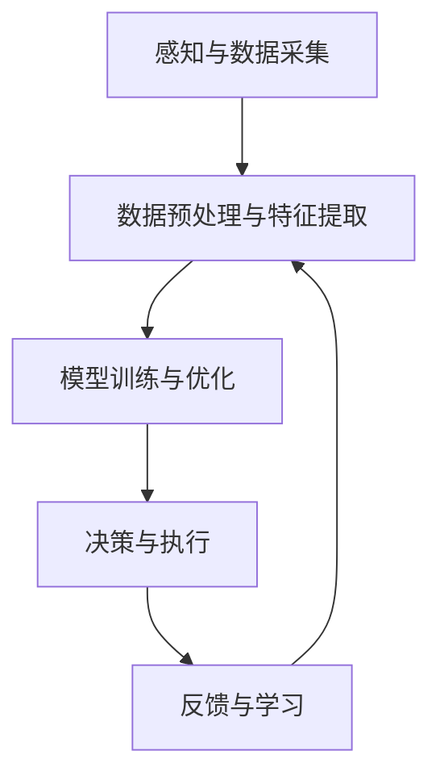

# AI人工智能代理工作流 AI Agent WorkFlow：在工业制造中的应用

## 1.背景介绍

在工业4.0的浪潮中，人工智能（AI）技术正逐渐成为工业制造领域的核心驱动力。AI代理工作流（AI Agent WorkFlow）作为一种新兴的技术手段，正在改变传统的制造流程，提高生产效率，降低成本，并提升产品质量。本文将深入探讨AI代理工作流在工业制造中的应用，揭示其核心概念、算法原理、数学模型、实际应用场景以及未来发展趋势。

## 2.核心概念与联系

### 2.1 AI代理的定义

AI代理（AI Agent）是指能够自主感知环境、做出决策并执行任务的智能系统。它们通常具备学习能力，可以通过与环境的交互不断优化自身的行为。

### 2.2 工作流的定义

工作流（WorkFlow）是指一系列有序的任务和活动，用于完成特定的业务流程。在工业制造中，工作流通常涉及多个步骤，如设计、生产、质量控制和物流等。

### 2.3 AI代理工作流的联系

AI代理工作流将AI代理与工作流结合，通过智能化的决策和自动化的执行，优化整个制造流程。其核心在于利用AI技术对工作流中的各个环节进行智能化改造，从而实现高效、灵活和智能的生产。

## 3.核心算法原理具体操作步骤

### 3.1 感知与数据采集

AI代理首先需要感知环境，这通常通过传感器和物联网设备实现。数据采集是整个流程的基础，确保AI代理能够获取准确的环境信息。

### 3.2 数据预处理与特征提取

采集到的数据通常需要进行预处理，如去噪、归一化等。特征提取是从原始数据中提取出有用的信息，以便后续的分析和决策。

### 3.3 模型训练与优化

AI代理通常采用机器学习或深度学习模型进行训练。模型训练需要大量的历史数据，通过不断优化模型参数，提高预测和决策的准确性。

### 3.4 决策与执行

训练好的模型可以用于实时决策。AI代理根据当前环境状态和模型预测结果，做出最优决策，并通过执行器执行相应的操作。

### 3.5 反馈与学习

AI代理在执行任务后，会根据实际效果进行反馈和学习，不断优化自身的行为。这种闭环的反馈机制是AI代理工作流的关键。



## 4.数学模型和公式详细讲解举例说明

### 4.1 数据预处理

假设我们有一个传感器数据集 $X = \{x_1, x_2, ..., x_n\}$，其中 $x_i$ 表示第 $i$ 个数据点。数据预处理的目标是将原始数据转换为适合模型训练的格式。

$$
\hat{x_i} = \frac{x_i - \mu}{\sigma}
$$

其中，$\mu$ 和 $\sigma$ 分别表示数据的均值和标准差。

### 4.2 特征提取

特征提取可以通过主成分分析（PCA）等方法实现。假设我们有一个数据矩阵 $X \in \mathbb{R}^{n \times d}$，PCA 的目标是找到一个投影矩阵 $W \in \mathbb{R}^{d \times k}$，使得投影后的数据 $Z = XW$ 保留最大的信息量。

$$
W = \arg\max_W \text{tr}(W^T X^T X W)
$$

### 4.3 模型训练

假设我们使用线性回归模型进行预测，模型的形式为：

$$
\hat{y} = X \beta
$$

其中，$\beta$ 是模型参数。模型训练的目标是最小化预测值与真实值之间的均方误差（MSE）：

$$
\min_\beta \frac{1}{n} \sum_{i=1}^n (y_i - \hat{y_i})^2
$$

### 4.4 决策与执行

假设我们使用强化学习（RL）算法进行决策，RL 的目标是通过与环境的交互，学习一个策略 $\pi$，使得累积奖励最大化。累积奖励的期望值为：

$$
J(\pi) = \mathbb{E} \left[ \sum_{t=0}^\infty \gamma^t r_t \right]
$$

其中，$\gamma$ 是折扣因子，$r_t$ 是时间步 $t$ 的奖励。

## 5.项目实践：代码实例和详细解释说明

### 5.1 数据预处理

```python
import numpy as np

# 生成模拟数据
data = np.random.randn(100, 10)

# 数据预处理
mean = np.mean(data, axis=0)
std = np.std(data, axis=0)
data_normalized = (data - mean) / std
```

### 5.2 特征提取

```python
from sklearn.decomposition import PCA

# 特征提取
pca = PCA(n_components=5)
data_pca = pca.fit_transform(data_normalized)
```

### 5.3 模型训练

```python
from sklearn.linear_model import LinearRegression

# 模拟标签数据
labels = np.random.randn(100)

# 模型训练
model = LinearRegression()
model.fit(data_pca, labels)
```

### 5.4 决策与执行

```python
import gym

# 创建环境
env = gym.make('CartPole-v1')

# 初始化策略
policy = np.random.randn(env.observation_space.shape[0], env.action_space.n)

# 决策与执行
state = env.reset()
done = False
while not done:
    action = np.argmax(np.dot(state, policy))
    state, reward, done, _ = env.step(action)
    env.render()
```

## 6.实际应用场景

### 6.1 预测性维护

通过AI代理工作流，可以实现设备的预测性维护。AI代理通过实时监控设备状态，预测可能的故障，并提前采取维护措施，避免生产中断。

### 6.2 质量控制

在生产过程中，AI代理可以实时监控产品质量，检测异常并及时调整生产参数，确保产品质量稳定。

### 6.3 生产优化

AI代理可以根据生产需求和资源情况，动态调整生产计划和流程，提高生产效率，降低成本。

### 6.4 供应链管理

AI代理可以优化供应链管理，通过预测需求、优化库存和物流，提高供应链的响应速度和效率。

## 7.工具和资源推荐

### 7.1 开源工具

- TensorFlow：一个开源的机器学习框架，适用于大规模数据处理和模型训练。
- PyTorch：另一个流行的深度学习框架，具有灵活性和易用性。
- Scikit-learn：一个简单高效的数据挖掘和数据分析工具，适用于中小规模数据集。

### 7.2 数据集

- UCI Machine Learning Repository：一个广泛使用的机器学习数据集库，包含各种领域的数据集。
- Kaggle：一个数据科学竞赛平台，提供大量高质量的数据集和竞赛。

### 7.3 文档和教程

- TensorFlow官方文档：提供详细的API文档和教程。
- PyTorch官方文档：提供全面的API文档和示例代码。
- Scikit-learn官方文档：提供详细的API文档和用户指南。

## 8.总结：未来发展趋势与挑战

### 8.1 未来发展趋势

随着AI技术的不断进步，AI代理工作流在工业制造中的应用将更加广泛和深入。未来，AI代理工作流将朝着以下几个方向发展：

- **智能化程度提高**：AI代理将具备更强的学习和决策能力，能够处理更复杂的任务。
- **集成化和协同化**：AI代理将与其他智能系统和设备更紧密地集成，实现协同工作。
- **自适应性增强**：AI代理将具备更强的自适应能力，能够根据环境变化自动调整自身行为。

### 8.2 挑战

尽管AI代理工作流在工业制造中具有广阔的应用前景，但仍面临一些挑战：

- **数据质量和安全**：高质量的数据是AI代理工作的基础，数据的准确性和安全性至关重要。
- **模型的可解释性**：AI模型的决策过程需要具备可解释性，以便于人类理解和信任。
- **系统的鲁棒性**：AI代理工作流需要具备高鲁棒性，能够应对各种异常情况和突发事件。

## 9.附录：常见问题与解答

### 9.1 AI代理工作流的实现难度大吗？

实现AI代理工作流需要一定的技术积累和经验，尤其是在数据处理、模型训练和系统集成方面。但随着开源工具和平台的不断发展，越来越多的资源和工具可以帮助开发者快速实现AI代理工作流。

### 9.2 AI代理工作流在中小企业中的应用前景如何？

AI代理工作流不仅适用于大型企业，也适用于中小企业。中小企业可以通过引入AI代理工作流，提高生产效率，降低运营成本，增强市场竞争力。

### 9.3 如何评估AI代理工作流的效果？

评估AI代理工作流的效果可以从多个方面进行，如生产效率、产品质量、成本节约和客户满意度等。通过定量和定性分析，可以全面评估AI代理工作流的应用效果。

---

作者：禅与计算机程序设计艺术 / Zen and the Art of Computer Programming