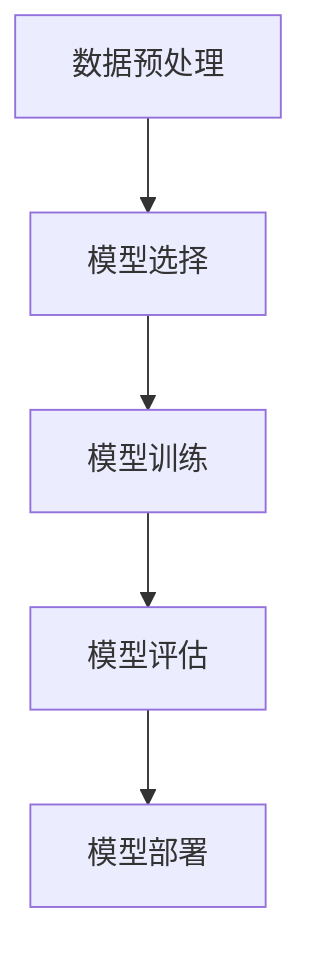

# AI人工智能深度学习算法：在垃圾短信检测中的应用

## 1.背景介绍

垃圾短信是现代通信中的一大问题，不仅浪费用户的时间和资源，还可能带来安全隐患。传统的垃圾短信检测方法主要依赖于规则和关键词匹配，但这些方法在面对不断变化的垃圾短信内容时显得力不从心。随着人工智能和深度学习技术的发展，利用这些技术进行垃圾短信检测成为了一种有效的解决方案。

## 2.核心概念与联系

### 2.1 人工智能与深度学习

人工智能（AI）是指模拟人类智能的计算机系统，能够执行诸如学习、推理和自我纠正等任务。深度学习是人工智能的一个子领域，利用多层神经网络来模拟人脑的工作方式，从大量数据中自动提取特征和模式。

### 2.2 垃圾短信检测

垃圾短信检测是指通过技术手段识别并过滤掉不需要的短信。传统方法包括基于规则的过滤和关键词匹配，而现代方法则更多地依赖于机器学习和深度学习技术。

### 2.3 深度学习在垃圾短信检测中的优势

深度学习在垃圾短信检测中具有以下优势：
- **自动特征提取**：无需手动设计特征，神经网络可以自动从数据中提取有用的特征。
- **高准确率**：深度学习模型通常能够达到较高的准确率，尤其是在处理复杂和多变的数据时。
- **可扩展性**：深度学习模型可以处理大量数据，并且能够随着数据量的增加而提高性能。

## 3.核心算法原理具体操作步骤

### 3.1 数据预处理

数据预处理是深度学习模型训练的第一步，主要包括以下几个步骤：
- **数据清洗**：去除无关信息和噪声。
- **文本向量化**：将文本数据转换为数值形式，常用的方法包括词袋模型（Bag of Words）、TF-IDF和词嵌入（Word Embedding）。
- **数据分割**：将数据集分为训练集、验证集和测试集。

### 3.2 模型选择

常用的深度学习模型包括卷积神经网络（CNN）、循环神经网络（RNN）和长短期记忆网络（LSTM）。在垃圾短信检测中，LSTM和双向LSTM（BiLSTM）由于其在处理序列数据上的优势，常被选用。

### 3.3 模型训练

模型训练是指通过优化算法调整模型参数，使其在训练集上的表现达到最佳。常用的优化算法包括随机梯度下降（SGD）和Adam。

### 3.4 模型评估

模型评估是指在验证集和测试集上评估模型的性能，常用的评估指标包括准确率、精确率、召回率和F1分数。

### 3.5 模型部署

模型部署是指将训练好的模型应用到实际环境中，用于实时垃圾短信检测。

以下是上述步骤的Mermaid流程图：



## 4.数学模型和公式详细讲解举例说明

### 4.1 文本向量化

文本向量化是将文本数据转换为数值形式的过程。常用的方法包括词袋模型（Bag of Words）和TF-IDF。

#### 4.1.1 词袋模型

词袋模型将文本表示为词频向量。假设有一个词汇表 $V$，文本 $T$ 可以表示为一个向量 $X$，其中 $X_i$ 表示词汇表中第 $i$ 个词在文本 $T$ 中出现的次数。

$$
X = [x_1, x_2, \ldots, x_n]
$$

#### 4.1.2 TF-IDF

TF-IDF（Term Frequency-Inverse Document Frequency）是衡量一个词在文档中的重要性的方法。TF表示词频，IDF表示逆文档频率。

$$
\text{TF-IDF}(t, d) = \text{TF}(t, d) \times \text{IDF}(t)
$$

其中，$\text{TF}(t, d)$ 表示词 $t$ 在文档 $d$ 中的频率，$\text{IDF}(t)$ 表示词 $t$ 的逆文档频率。

$$
\text{IDF}(t) = \log \frac{N}{1 + \text{DF}(t)}
$$

其中，$N$ 是文档总数，$\text{DF}(t)$ 是包含词 $t$ 的文档数。

### 4.2 神经网络模型

#### 4.2.1 LSTM

LSTM（Long Short-Term Memory）是一种特殊的RNN，能够有效地捕捉长距离依赖关系。LSTM的核心是记忆单元和三个门控机制：输入门、遗忘门和输出门。

$$
\begin{aligned}
    f_t &= \sigma(W_f \cdot [h_{t-1}, x_t] + b_f) \\
    i_t &= \sigma(W_i \cdot [h_{t-1}, x_t] + b_i) \\
    o_t &= \sigma(W_o \cdot [h_{t-1}, x_t] + b_o) \\
    \tilde{C}_t &= \tanh(W_C \cdot [h_{t-1}, x_t] + b_C) \\
    C_t &= f_t * C_{t-1} + i_t * \tilde{C}_t \\
    h_t &= o_t * \tanh(C_t)
\end{aligned}
$$

其中，$f_t$ 是遗忘门，$i_t$ 是输入门，$o_t$ 是输出门，$C_t$ 是记忆单元，$h_t$ 是隐藏状态。

## 5.项目实践：代码实例和详细解释说明

### 5.1 数据预处理

以下是一个简单的Python代码示例，展示了如何进行数据预处理：

```python
import pandas as pd
from sklearn.model_selection import train_test_split
from sklearn.feature_extraction.text import TfidfVectorizer

# 读取数据
data = pd.read_csv('sms_spam.csv')

# 数据清洗
data['text'] = data['text'].str.replace('[^\w\s]', '').str.lower()

# 文本向量化
vectorizer = TfidfVectorizer()
X = vectorizer.fit_transform(data['text'])

# 数据分割
X_train, X_test, y_train, y_test = train_test_split(X, data['label'], test_size=0.2, random_state=42)
```

### 5.2 模型训练

以下是一个使用Keras进行LSTM模型训练的示例：

```python
import keras
from keras.models import Sequential
from keras.layers import LSTM, Dense, Embedding

# 构建模型
model = Sequential()
model.add(Embedding(input_dim=5000, output_dim=128, input_length=100))
model.add(LSTM(128))
model.add(Dense(1, activation='sigmoid'))

# 编译模型
model.compile(loss='binary_crossentropy', optimizer='adam', metrics=['accuracy'])

# 训练模型
model.fit(X_train, y_train, epochs=10, batch_size=64, validation_data=(X_test, y_test))
```

### 5.3 模型评估

以下是模型评估的代码示例：

```python
# 评估模型
loss, accuracy = model.evaluate(X_test, y_test)
print(f'Loss: {loss}, Accuracy: {accuracy}')
```

## 6.实际应用场景

### 6.1 电信运营商

电信运营商可以利用深度学习模型实时检测和过滤垃圾短信，提升用户体验。

### 6.2 企业内部通信

企业可以在内部通信系统中部署垃圾短信检测模型，防止垃圾信息干扰员工工作。

### 6.3 移动应用

移动应用开发者可以集成垃圾短信检测功能，增强应用的安全性和用户体验。

## 7.工具和资源推荐

### 7.1 开源工具

- **TensorFlow**：一个开源的深度学习框架，支持多种神经网络模型。
- **Keras**：一个高级神经网络API，能够运行在TensorFlow之上，简化了深度学习模型的构建和训练。
- **Scikit-learn**：一个用于数据挖掘和数据分析的Python库，提供了丰富的机器学习算法和工具。

### 7.2 数据集

- **SMS Spam Collection Data Set**：一个包含短信文本和标签的数据集，常用于垃圾短信检测研究。

### 7.3 在线资源

- **Coursera**：提供了多门关于深度学习和自然语言处理的在线课程。
- **Kaggle**：一个数据科学竞赛平台，提供了丰富的数据集和代码示例。

## 8.总结：未来发展趋势与挑战

### 8.1 未来发展趋势

随着深度学习技术的不断发展，垃圾短信检测的准确率和效率将进一步提高。未来的发展趋势包括：
- **多模态学习**：结合文本、图像和音频等多种模态的数据，提高检测的准确性。
- **联邦学习**：在保护用户隐私的前提下，利用分布式数据进行模型训练。
- **自监督学习**：利用未标注数据进行模型训练，减少对标注数据的依赖。

### 8.2 挑战

尽管深度学习在垃圾短信检测中表现出色，但仍面临一些挑战：
- **数据隐私**：如何在保护用户隐私的前提下进行数据收集和模型训练。
- **模型解释性**：深度学习模型通常是黑箱模型，如何提高其解释性是一个重要问题。
- **实时性**：在实际应用中，如何保证模型的实时性和高效性。

## 9.附录：常见问题与解答

### 9.1 如何选择合适的深度学习模型？

选择合适的深度学习模型取决于具体的应用场景和数据特点。对于垃圾短信检测，LSTM和BiLSTM通常是较好的选择，因为它们在处理序列数据上表现出色。

### 9.2 如何处理不平衡数据？

不平衡数据是指正负样本数量差异较大的情况。常用的处理方法包括：
- **重采样**：对少数类进行过采样或对多数类进行欠采样。
- **数据增强**：通过数据增强技术生成更多的少数类样本。
- **调整损失函数**：在损失函数中对少数类样本赋予更高的权重。

### 9.3 如何提高模型的泛化能力？

提高模型的泛化能力可以通过以下几种方法：
- **正则化**：在损失函数中加入正则化项，防止模型过拟合。
- **交叉验证**：使用交叉验证方法评估模型性能，选择最佳模型。
- **数据增强**：通过数据增强技术增加训练数据的多样性。

作者：禅与计算机程序设计艺术 / Zen and the Art of Computer Programming