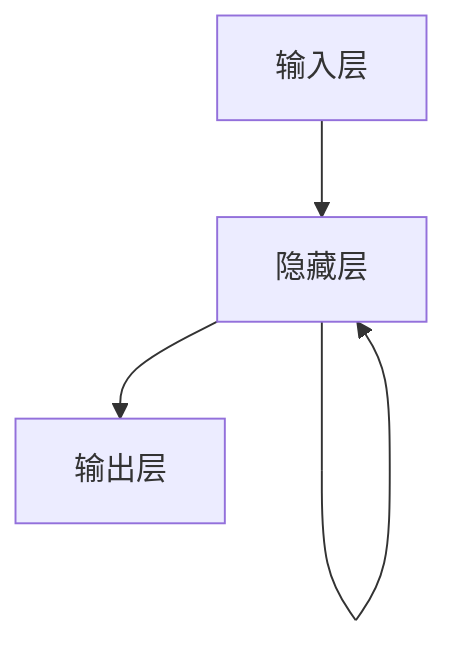

# AI人工智能深度学习算法：循环神经网络的理解与使用

## 1.背景介绍

在人工智能和深度学习的领域中，循环神经网络（Recurrent Neural Networks, RNNs）因其在处理序列数据方面的卓越表现而备受关注。无论是自然语言处理、时间序列预测，还是语音识别，RNNs 都展现出了强大的能力。本文将深入探讨 RNNs 的核心概念、算法原理、数学模型、实际应用及未来发展趋势。

## 2.核心概念与联系

### 2.1 循环神经网络的基本概念

循环神经网络是一种能够处理序列数据的神经网络，其独特之处在于它具有“记忆”功能。RNNs 通过在网络中引入循环连接，使得当前时刻的输出不仅依赖于当前的输入，还依赖于前一时刻的状态。

### 2.2 RNNs 与传统神经网络的区别

传统的前馈神经网络（Feedforward Neural Networks, FNNs）在处理独立同分布的数据时表现良好，但在处理序列数据时却显得力不从心。RNNs 通过引入时间维度，使得网络能够捕捉到数据中的时间依赖关系。

### 2.3 RNNs 的变种

RNNs 有多种变种，包括长短期记忆网络（Long Short-Term Memory, LSTM）和门控循环单元（Gated Recurrent Unit, GRU）。这些变种通过引入门控机制，解决了传统 RNNs 中的梯度消失和梯度爆炸问题。

## 3.核心算法原理具体操作步骤

### 3.1 RNNs 的基本结构

RNNs 的基本结构可以用以下 Mermaid 图表示：



### 3.2 前向传播

在 RNNs 中，前向传播的过程如下：

1. 输入序列 $x = \{x_1, x_2, \ldots, x_T\}$ 逐步输入到网络中。
2. 在每个时间步 $t$，计算隐藏状态 $h_t$ 和输出 $y_t$：
   $$
   h_t = \sigma(W_{xh} x_t + W_{hh} h_{t-1} + b_h)
   $$
   $$
   y_t = \phi(W_{hy} h_t + b_y)
   $$

### 3.3 反向传播

RNNs 的反向传播过程称为“反向传播通过时间”（Backpropagation Through Time, BPTT）。其基本步骤如下：

1. 计算损失函数 $L$ 对每个时间步的输出 $y_t$ 的梯度。
2. 通过时间反向传播梯度，更新网络参数 $W_{xh}$、$W_{hh}$、$W_{hy}$、$b_h$ 和 $b_y$。

## 4.数学模型和公式详细讲解举例说明

### 4.1 数学模型

RNNs 的数学模型可以表示为以下公式：

1. 隐藏状态更新：
   $$
   h_t = \sigma(W_{xh} x_t + W_{hh} h_{t-1} + b_h)
   $$

2. 输出计算：
   $$
   y_t = \phi(W_{hy} h_t + b_y)
   $$

### 4.2 举例说明

假设我们有一个简单的字符预测任务，输入序列为 "hello"，目标是预测下一个字符。我们可以将其表示为一个序列预测问题：

1. 输入序列：$x = \{h, e, l, l, o\}$
2. 目标序列：$y = \{e, l, l, o, \text{<EOS>}\}$

在每个时间步 $t$，RNNs 会根据当前输入 $x_t$ 和前一时刻的隐藏状态 $h_{t-1}$ 计算当前的隐藏状态 $h_t$ 和输出 $y_t$。

## 5.项目实践：代码实例和详细解释说明

### 5.1 环境准备

在开始项目实践之前，我们需要准备好开发环境。本文将使用 Python 和 TensorFlow 来实现 RNNs。

```python
import tensorflow as tf
from tensorflow.keras.models import Sequential
from tensorflow.keras.layers import SimpleRNN, Dense
```

### 5.2 数据准备

我们将使用一个简单的字符序列数据集来进行训练。假设我们有以下数据：

```python
text = "hello world"
chars = sorted(list(set(text)))
char_indices = {c: i for i, c in enumerate(chars)}
indices_char = {i: c for i, c in enumerate(chars)}

# 创建输入和目标序列
maxlen = 5
step = 1
sentences = []
next_chars = []
for i in range(0, len(text) - maxlen, step):
    sentences.append(text[i: i + maxlen])
    next_chars.append(text[i + maxlen])
```

### 5.3 模型构建

我们将构建一个简单的 RNN 模型来进行字符预测。

```python
model = Sequential()
model.add(SimpleRNN(128, input_shape=(maxlen, len(chars))))
model.add(Dense(len(chars), activation='softmax'))

model.compile(loss='categorical_crossentropy', optimizer='adam')
```

### 5.4 模型训练

我们将使用准备好的数据来训练模型。

```python
import numpy as np

X = np.zeros((len(sentences), maxlen, len(chars)), dtype=np.bool)
y = np.zeros((len(sentences), len(chars)), dtype=np.bool)
for i, sentence in enumerate(sentences):
    for t, char in enumerate(sentence):
        X[i, t, char_indices[char]] = 1
    y[i, char_indices[next_chars[i]]] = 1

model.fit(X, y, batch_size=128, epochs=10)
```

### 5.5 模型预测

训练完成后，我们可以使用模型进行字符预测。

```python
def sample(preds, temperature=1.0):
    preds = np.asarray(preds).astype('float64')
    preds = np.log(preds) / temperature
    exp_preds = np.exp(preds)
    preds = exp_preds / np.sum(exp_preds)
    probas = np.random.multinomial(1, preds, 1)
    return np.argmax(probas)

start_index = 0
generated = ''
sentence = text[start_index: start_index + maxlen]
generated += sentence
for i in range(400):
    x_pred = np.zeros((1, maxlen, len(chars)))
    for t, char in enumerate(sentence):
        x_pred[0, t, char_indices[char]] = 1

    preds = model.predict(x_pred, verbose=0)[0]
    next_index = sample(preds, temperature=0.5)
    next_char = indices_char[next_index]

    generated += next_char
    sentence = sentence[1:] + next_char

print(generated)
```

## 6.实际应用场景

### 6.1 自然语言处理

RNNs 在自然语言处理（NLP）领域有广泛的应用，包括语言模型、机器翻译、文本生成等。

### 6.2 时间序列预测

RNNs 在时间序列预测中表现出色，如股票价格预测、天气预报等。

### 6.3 语音识别

RNNs 在语音识别中也有重要应用，通过处理音频序列数据，实现语音到文本的转换。

## 7.工具和资源推荐

### 7.1 开发工具

- TensorFlow: 一个开源的深度学习框架，支持 RNNs 的实现。
- Keras: 一个高级神经网络 API，能够简化 RNNs 的构建和训练。

### 7.2 学习资源

- 《深度学习》：Ian Goodfellow 等著，详细介绍了 RNNs 的理论和应用。
- Coursera 和 Udacity 上的深度学习课程：提供了丰富的 RNNs 学习资源和实践项目。

## 8.总结：未来发展趋势与挑战

RNNs 在处理序列数据方面展现了强大的能力，但也面临一些挑战，如梯度消失和梯度爆炸问题。未来，随着 LSTM 和 GRU 等变种的不断发展，RNNs 的应用前景将更加广阔。同时，如何提高 RNNs 的训练效率和模型性能，也是未来研究的重要方向。

## 9.附录：常见问题与解答

### 9.1 什么是梯度消失和梯度爆炸？

梯度消失和梯度爆炸是 RNNs 在训练过程中常见的问题。梯度消失指的是在反向传播过程中，梯度逐渐变小，导致模型无法有效更新参数；梯度爆炸则是梯度逐渐变大，导致模型参数更新过大，训练过程不稳定。

### 9.2 如何解决梯度消失和梯度爆炸问题？

可以通过使用 LSTM 和 GRU 等变种来解决梯度消失和梯度爆炸问题。这些变种通过引入门控机制，能够更好地捕捉长时间依赖关系，稳定训练过程。

### 9.3 RNNs 与 LSTM、GRU 的区别是什么？

RNNs 是一种基本的循环神经网络结构，而 LSTM 和 GRU 是其变种。LSTM 和 GRU 通过引入门控机制，解决了 RNNs 中的梯度消失和梯度爆炸问题，能够更好地处理长时间依赖关系。

---

作者：禅与计算机程序设计艺术 / Zen and the Art of Computer Programming