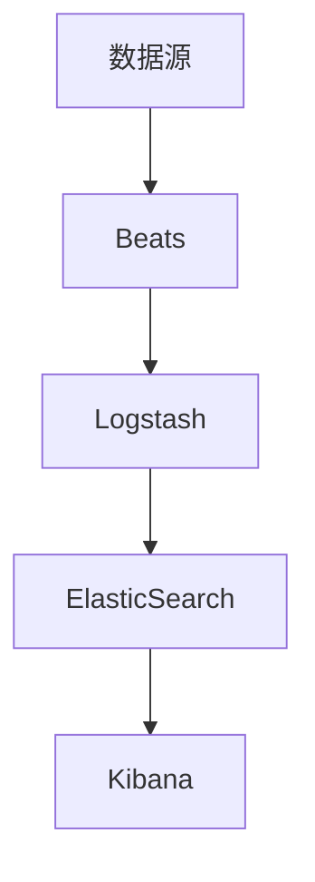

# ElasticSearch Beats原理与代码实例讲解

## 1.背景介绍

在现代数据驱动的世界中，实时数据收集和分析变得至关重要。ElasticSearch作为一个强大的搜索和分析引擎，已经被广泛应用于各种场景。然而，数据的收集和传输同样重要，这就是Elastic Beats的用武之地。Elastic Beats是一组轻量级的数据传输代理，旨在从各种来源收集数据并将其发送到ElasticSearch或Logstash。

## 2.核心概念与联系

### 2.1 ElasticSearch

ElasticSearch是一个分布式、RESTful风格的搜索和分析引擎，能够处理大规模数据。它基于Apache Lucene构建，提供了强大的全文搜索、结构化搜索和分析功能。

### 2.2 Beats

Beats是Elastic Stack中的轻量级数据传输代理，负责从不同的数据源收集数据并将其发送到ElasticSearch或Logstash。Beats家族包括Filebeat、Metricbeat、Packetbeat等，每个Beat都有其特定的用途。

### 2.3 Logstash

Logstash是一个服务器端的数据处理管道，能够从多个来源收集数据，进行转换，并将其发送到ElasticSearch。它与Beats紧密集成，提供了更强大的数据处理能力。

### 2.4 Kibana

Kibana是Elastic Stack中的数据可视化工具，允许用户在ElasticSearch中搜索和查看数据，并创建各种图表和仪表盘。

### 2.5 Beats与ElasticSearch的关系

Beats作为数据收集代理，负责将数据从各种来源（如日志文件、系统指标、网络流量等）收集并发送到ElasticSearch。ElasticSearch则负责存储、索引和分析这些数据。两者的结合使得数据的收集、存储和分析变得高效且无缝。

## 3.核心算法原理具体操作步骤

### 3.1 数据收集

Beats通过轻量级代理从各种数据源收集数据。每个Beat都有其特定的收集方式，例如Filebeat从日志文件中读取数据，Metricbeat从系统和服务中收集指标数据。

### 3.2 数据传输

收集到的数据通过Beats传输到ElasticSearch或Logstash。传输过程中，Beats可以对数据进行简单的处理和格式化。

### 3.3 数据存储与索引

ElasticSearch接收到数据后，会对其进行存储和索引。索引过程包括解析数据、创建倒排索引和存储文档。

### 3.4 数据分析与查询

用户可以通过Kibana或ElasticSearch的API对数据进行查询和分析。ElasticSearch提供了强大的查询DSL（Domain Specific Language），支持复杂的查询和聚合操作。

以下是一个简单的Mermaid流程图，展示了Beats与ElasticSearch的工作流程：



## 4.数学模型和公式详细讲解举例说明

ElasticSearch的核心是其强大的搜索和分析能力，这些能力依赖于底层的数学模型和算法。以下是一些关键的数学概念和公式：

### 4.1 倒排索引

倒排索引是ElasticSearch中最重要的数据结构之一。它将文档中的词汇映射到包含这些词汇的文档列表中。倒排索引的构建过程如下：

1. 解析文档，提取词汇。
2. 为每个词汇创建一个倒排列表，记录包含该词汇的文档ID。

### 4.2 TF-IDF

TF-IDF（Term Frequency-Inverse Document Frequency）是衡量词汇重要性的统计方法。公式如下：

$$
\text{TF-IDF}(t, d) = \text{TF}(t, d) \times \text{IDF}(t)
$$

其中，$\text{TF}(t, d)$表示词汇$t$在文档$d$中的出现频率，$\text{IDF}(t)$表示词汇$t$的逆文档频率，计算公式为：

$$
\text{IDF}(t) = \log \left( \frac{N}{\text{DF}(t)} \right)
$$

其中，$N$是文档总数，$\text{DF}(t)$是包含词汇$t$的文档数。

### 4.3 向量空间模型

ElasticSearch使用向量空间模型（Vector Space Model）来表示文档和查询。每个文档和查询都被表示为一个向量，向量的每个维度对应一个词汇。文档和查询的相似度通过计算向量之间的余弦相似度来衡量：

$$
\text{cosine\_similarity}(d, q) = \frac{\vec{d} \cdot \vec{q}}{\|\vec{d}\| \|\vec{q}\|}
$$

其中，$\vec{d}$和$\vec{q}$分别表示文档和查询的向量，$\cdot$表示向量点积，$\|\vec{d}\|$和$\|\vec{q}\|$表示向量的模。

## 5.项目实践：代码实例和详细解释说明

### 5.1 安装和配置Filebeat

首先，我们需要安装Filebeat。可以通过以下命令在Linux系统上安装：

```bash
sudo apt-get update
sudo apt-get install filebeat
```

安装完成后，编辑Filebeat配置文件`filebeat.yml`，配置日志文件路径和ElasticSearch地址：

```yaml
filebeat.inputs:
- type: log
  enabled: true
  paths:
    - /var/log/*.log

output.elasticsearch:
  hosts: ["localhost:9200"]
```

### 5.2 启动Filebeat

配置完成后，启动Filebeat：

```bash
sudo service filebeat start
```

### 5.3 验证数据传输

在Kibana中，创建一个索引模式来验证Filebeat是否成功将数据传输到ElasticSearch：

1. 打开Kibana，导航到“Management” -> “Index Patterns”。
2. 创建一个新的索引模式，输入`filebeat-*`作为索引模式。
3. 验证数据是否成功导入。

### 5.4 查询和分析数据

在Kibana中，使用Discover功能查询和分析日志数据。可以创建各种图表和仪表盘来可视化数据。

## 6.实际应用场景

### 6.1 日志监控

Filebeat可以用于收集和监控服务器日志，帮助运维人员快速发现和解决问题。

### 6.2 系统指标监控

Metricbeat可以收集系统和服务的性能指标，如CPU使用率、内存使用率等，帮助运维人员监控系统健康状况。

### 6.3 网络流量分析

Packetbeat可以用于捕获和分析网络流量，帮助安全团队检测和分析网络攻击。

### 6.4 应用性能监控

APM（Application Performance Monitoring）可以用于监控应用性能，帮助开发人员优化应用性能。

## 7.工具和资源推荐

### 7.1 官方文档

Elastic官方文档是学习Elastic Stack的最佳资源，涵盖了从安装到高级配置的所有内容。

### 7.2 社区论坛

Elastic社区论坛是一个活跃的讨论平台，用户可以在这里提问、分享经验和获取帮助。

### 7.3 在线课程

Coursera、Udemy等平台提供了许多关于Elastic Stack的在线课程，适合不同水平的学习者。

### 7.4 开源项目

GitHub上有许多开源项目和示例代码，可以帮助用户更好地理解和应用Elastic Stack。

## 8.总结：未来发展趋势与挑战

Elastic Stack在数据收集、存储和分析方面表现出色，但也面临一些挑战和发展趋势：

### 8.1 趋势

- **云原生架构**：随着云计算的普及，Elastic Stack正在向云原生架构转变，提供更好的扩展性和灵活性。
- **机器学习**：Elastic Stack正在集成更多的机器学习功能，帮助用户进行更高级的数据分析和预测。
- **安全性**：随着数据隐私和安全问题的日益重要，Elastic Stack正在加强其安全功能，提供更好的数据保护。

### 8.2 挑战

- **性能优化**：在处理大规模数据时，Elastic Stack的性能优化仍然是一个挑战，特别是在索引和查询性能方面。
- **复杂性管理**：随着功能的增加，Elastic Stack的配置和管理变得越来越复杂，需要更好的工具和文档来帮助用户。
- **数据质量**：确保数据的准确性和一致性是一个持续的挑战，特别是在多源数据集成的情况下。

## 9.附录：常见问题与解答

### 9.1 Filebeat无法启动，如何排查？

- 检查配置文件`filebeat.yml`是否正确。
- 查看Filebeat日志，查找错误信息。
- 确保ElasticSearch服务正常运行。

### 9.2 数据未能成功导入ElasticSearch，如何解决？

- 检查Filebeat和ElasticSearch的连接配置。
- 查看ElasticSearch日志，查找错误信息。
- 确保ElasticSearch索引模式正确配置。

### 9.3 如何优化ElasticSearch查询性能？

- 使用合适的索引和映射配置。
- 使用过滤器而不是查询来减少不必要的数据处理。
- 定期优化和合并索引。

### 9.4 如何监控Elastic Stack的性能？

- 使用Metricbeat收集Elastic Stack的性能指标。
- 在Kibana中创建仪表盘，实时监控性能数据。
- 使用Elastic APM监控应用性能。

---

作者：禅与计算机程序设计艺术 / Zen and the Art of Computer Programming