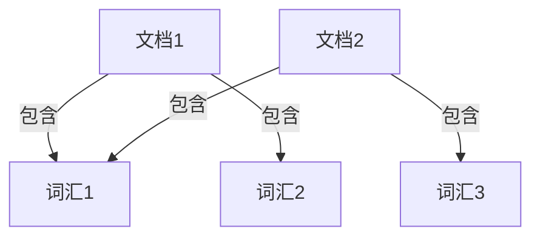

# ElasticSearch原理与代码实例讲解

## 1.背景介绍

ElasticSearch 是一个基于 Lucene 的开源搜索引擎，广泛应用于全文搜索、日志分析、实时数据处理等领域。其强大的分布式搜索和分析功能，使其成为大数据处理和搜索的首选工具。本文将深入探讨 ElasticSearch 的核心概念、算法原理、数学模型，并通过代码实例展示其实际应用。

## 2.核心概念与联系

### 2.1 索引与文档

在 ElasticSearch 中，数据以文档的形式存储在索引中。索引类似于关系数据库中的表，而文档则类似于表中的行。每个文档都是一个 JSON 对象，包含多个字段。

### 2.2 集群与节点

ElasticSearch 的分布式特性使其能够处理大规模数据。一个 ElasticSearch 集群由多个节点组成，每个节点都是一个独立的 ElasticSearch 实例。集群中的节点可以分为主节点、数据节点和协调节点。

### 2.3 分片与副本

为了提高搜索性能和数据可靠性，ElasticSearch 将索引分为多个分片（Shard），每个分片可以有多个副本（Replica）。分片和副本的机制确保了数据的高可用性和负载均衡。

### 2.4 映射与类型

映射（Mapping）定义了文档中字段的类型和属性。类型（Type）是索引中的逻辑分组，虽然在 ElasticSearch 7.x 版本中已经被弃用，但理解其概念有助于理解 ElasticSearch 的演变。

## 3.核心算法原理具体操作步骤

### 3.1 倒排索引

ElasticSearch 使用倒排索引（Inverted Index）来实现快速全文搜索。倒排索引将文档中的每个词汇映射到包含该词汇的文档列表。



### 3.2 分词与分析

分词是将文本分解为独立词汇的过程。ElasticSearch 提供了多种分词器（Analyzer），如标准分词器、简单分词器和自定义分词器。分词器不仅分解文本，还可以进行词干提取、同义词替换等操作。

### 3.3 查询与过滤

ElasticSearch 提供了丰富的查询和过滤功能，包括布尔查询、范围查询、模糊查询等。查询和过滤的组合使用可以实现复杂的搜索需求。

### 3.4 聚合分析

聚合（Aggregation）是 ElasticSearch 的强大功能之一，用于对数据进行统计分析。常见的聚合类型包括直方图聚合、范围聚合、日期聚合等。

## 4.数学模型和公式详细讲解举例说明

### 4.1 TF-IDF 算法

TF-IDF（Term Frequency-Inverse Document Frequency）是衡量词汇重要性的经典算法。其公式如下：

$$
\text{TF-IDF}(t, d) = \text{TF}(t, d) \times \text{IDF}(t)
$$

其中，$\text{TF}(t, d)$ 表示词汇 $t$ 在文档 $d$ 中的出现频率，$\text{IDF}(t)$ 表示词汇 $t$ 的逆文档频率，计算公式为：

$$
\text{IDF}(t) = \log \frac{N}{\text{DF}(t)}
$$

$N$ 是文档总数，$\text{DF}(t)$ 是包含词汇 $t$ 的文档数。

### 4.2 BM25 算法

BM25 是一种改进的 TF-IDF 算法，常用于信息检索。其公式如下：

$$
\text{BM25}(t, d) = \sum_{t \in d} \frac{\text{IDF}(t) \cdot (k_1 + 1) \cdot \text{TF}(t, d)}{\text{TF}(t, d) + k_1 \cdot (1 - b + b \cdot \frac{|d|}{\text{avgdl}})}
$$

其中，$k_1$ 和 $b$ 是调节参数，$|d|$ 是文档 $d$ 的长度，$\text{avgdl}$ 是文档的平均长度。

## 5.项目实践：代码实例和详细解释说明

### 5.1 安装与配置

首先，下载并安装 ElasticSearch：

```bash
wget https://artifacts.elastic.co/downloads/elasticsearch/elasticsearch-7.10.2-linux-x86_64.tar.gz
tar -xzf elasticsearch-7.10.2-linux-x86_64.tar.gz
cd elasticsearch-7.10.2
./bin/elasticsearch
```

### 5.2 创建索引

使用以下命令创建一个名为 `my_index` 的索引：

```bash
curl -X PUT "localhost:9200/my_index"
```

### 5.3 添加文档

向索引中添加文档：

```bash
curl -X POST "localhost:9200/my_index/_doc/1" -H 'Content-Type: application/json' -d'
{
  "title": "ElasticSearch 入门",
  "content": "ElasticSearch 是一个强大的搜索引擎"
}
'
```

### 5.4 查询文档

使用以下命令查询文档：

```bash
curl -X GET "localhost:9200/my_index/_search" -H 'Content-Type: application/json' -d'
{
  "query": {
    "match": {
      "content": "搜索引擎"
    }
  }
}
'
```

### 5.5 聚合分析

进行聚合分析：

```bash
curl -X GET "localhost:9200/my_index/_search" -H 'Content-Type: application/json' -d'
{
  "aggs": {
    "content_terms": {
      "terms": {
        "field": "content.keyword"
      }
    }
  }
}
'
```

## 6.实际应用场景

### 6.1 日志分析

ElasticSearch 常用于日志分析，通过与 Logstash 和 Kibana 结合，形成 ELK（ElasticSearch, Logstash, Kibana）堆栈，实现实时日志收集、分析和可视化。

### 6.2 全文搜索

ElasticSearch 的全文搜索功能广泛应用于电商网站、内容管理系统等场景，提供快速、精准的搜索体验。

### 6.3 实时数据处理

ElasticSearch 支持实时数据处理和分析，适用于金融、物联网等需要实时数据监控和分析的领域。

## 7.工具和资源推荐

### 7.1 开发工具

- **Kibana**：ElasticSearch 的可视化工具，提供强大的数据分析和可视化功能。
- **Logstash**：数据收集和处理工具，与 ElasticSearch 和 Kibana 结合使用。
- **ElasticSearch Head**：ElasticSearch 的管理工具，提供索引管理、数据浏览等功能。

### 7.2 学习资源

- **Elastic 官方文档**：最权威的 ElasticSearch 学习资源，涵盖了从入门到高级的所有内容。
- **《ElasticSearch 权威指南》**：一本全面介绍 ElasticSearch 的书籍，适合深入学习。
- **ElasticSearch 社区**：活跃的社区，提供问题解答和经验分享。

## 8.总结：未来发展趋势与挑战

ElasticSearch 作为一个强大的搜索和分析引擎，未来的发展趋势包括：

- **更强的实时数据处理能力**：随着物联网和大数据的发展，实时数据处理的需求将不断增加。
- **更智能的搜索算法**：结合机器学习和人工智能，提升搜索的精准度和智能化水平。
- **更高的可扩展性和稳定性**：在大规模数据处理和分布式系统中，ElasticSearch 的可扩展性和稳定性将是重要的研究方向。

然而，ElasticSearch 也面临一些挑战，如数据安全、隐私保护和性能优化等问题，需要不断改进和创新。

## 9.附录：常见问题与解答

### 9.1 如何解决 ElasticSearch 内存不足的问题？

ElasticSearch 内存不足通常是由于 JVM 堆内存设置不合理或数据量过大导致的。可以通过以下方法解决：

- 调整 JVM 堆内存大小，修改 `config/jvm.options` 文件中的 `-Xms` 和 `-Xmx` 参数。
- 优化索引和查询，减少不必要的数据加载和计算。
- 增加节点数量，分散数据和负载。

### 9.2 如何提高 ElasticSearch 的查询性能？

提高 ElasticSearch 查询性能的方法包括：

- 使用合适的分片和副本配置，确保数据分布均衡。
- 优化查询语句，避免复杂和低效的查询。
- 使用缓存机制，减少重复查询的开销。
- 定期进行索引优化和合并，保持索引的高效性。

### 9.3 如何确保 ElasticSearch 数据的高可用性？

确保 ElasticSearch 数据高可用性的方法包括：

- 配置多个副本，确保数据在节点故障时仍然可用。
- 使用跨集群复制（CCR）功能，实现跨数据中心的数据备份和恢复。
- 定期备份数据，防止数据丢失和损坏。

---

作者：禅与计算机程序设计艺术 / Zen and the Art of Computer Programming