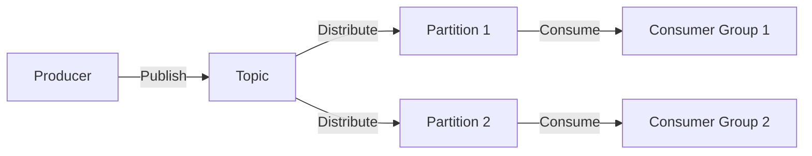

## 1. 背景介绍

Apache Kafka是一个分布式流处理平台，由LinkedIn开发并于2011年开源，现为Apache软件基金会的一部分。Kafka设计用于高吞吐量、可扩展性和容错性，它广泛应用于实时数据管道和流式处理系统。Kafka的核心是一个发布-订阅消息系统，它处理存储、读取、传输和处理流式数据。

## 2. 核心概念与联系

### 2.1 Kafka基础架构

- **Broker**: Kafka集群中的服务器节点称为Broker。
- **Topic**: 数据的分类名，可以看作是消息的队列或者分类。
- **Partition**: Topic物理上的分组，每个Partition在存储层面是一个有序的、不可变的消息序列。
- **Producer**: 消息生产者，负责发布消息到Kafka的Topic。
- **Consumer**: 消息消费者，订阅Topic并处理其发布的消息。
- **Consumer Group**: 一组Consumer实例，它们共享一个或多个Topic的消费。

### 2.2 Kafka数据流转



## 3. 核心算法原理具体操作步骤

### 3.1 数据写入流程

1. **Producer选择Partition**: Producer可以指定Partition或由Kafka根据Key来分配。
2. **消息发送**: Producer将消息发送到指定的Partition。
3. **Leader Replica接收**: Partition的Leader副本接收消息，并将其写入本地日志。
4. **Follower Replica同步**: Follower副本从Leader同步消息，确保数据的冗余和一致性。

### 3.2 数据读取流程

1. **Consumer订阅Topic**: Consumer指定要订阅的Topic。
2. **Consumer Group分配Partition**: Kafka根据Consumer Group内的Consumer数量来分配Partition。
3. **拉取数据**: Consumer从分配给它的Partition拉取数据。
4. **消费消息**: Consumer处理消息，并可能将处理结果输出到其他系统或存储。

## 4. 数学模型和公式详细讲解举例说明

在Kafka中，消息的分发和消费可以用数学模型来描述。例如，假设有一个Topic T，它有P个Partition，每个Partition有N个消息。

$$
T = \{P_1, P_2, ..., P_p\}
$$

$$
P_i = \{M_1, M_2, ..., M_n\}
$$

其中，$P_i$ 是Partition i，$M_j$ 是Partition i中的第j个消息。

Consumer Group的负载均衡可以表示为：

$$
C = \{C_1, C_2, ..., C_c\}
$$

$$
Balance(C, P) = \left\{ \begin{array}{ll}
\frac{|P|}{|C|} & \mbox{if } |P| \geq |C| \\
1 & \mbox{if } |P| < |C|
\end{array} \right.
$$

其中，$C$ 是Consumer Group，$C_k$ 是Consumer Group中的第k个Consumer，$Balance(C, P)$ 是每个Consumer分配到的Partition数量。

## 5. 项目实践：代码实例和详细解释说明

### 5.1 生产者示例

```java
public class ProducerDemo {
    public static void main(String[] args) {
        Properties props = new Properties();
        props.put("bootstrap.servers", "localhost:9092");
        props.put("key.serializer", "org.apache.kafka.common.serialization.StringSerializer");
        props.put("value.serializer", "org.apache.kafka.common.serialization.StringSerializer");

        KafkaProducer<String, String> producer = new KafkaProducer<>(props);
        for(int i = 0; i < 100; i++) {
            producer.send(new ProducerRecord<String, String>("my-topic", Integer.toString(i), "message-" + i));
        }

        producer.close();
    }
}
```

### 5.2 消费者示例

```java
public class ConsumerDemo {
    public static void main(String[] args) {
        Properties props = new Properties();
        props.put("bootstrap.servers", "localhost:9092");
        props.put("group.id", "test");
        props.put("enable.auto.commit", "true");
        props.put("auto.commit.interval.ms", "1000");
        props.put("key.deserializer", "org.apache.kafka.common.serialization.StringDeserializer");
        props.put("value.deserializer", "org.apache.kafka.common.serialization.StringDeserializer");

        KafkaConsumer<String, String> consumer = new KafkaConsumer<>(props);
        consumer.subscribe(Arrays.asList("my-topic"));
        while (true) {
            ConsumerRecords<String, String> records = consumer.poll(Duration.ofMillis(100));
            for (ConsumerRecord<String, String> record : records) {
                System.out.printf("offset = %d, key = %s, value = %s%n", record.offset(), record.key(), record.value());
            }
        }
    }
}
```

## 6. 实际应用场景

Kafka广泛应用于以下场景：

- 日志收集：系统日志、应用日志的集中处理。
- 流式处理：实时数据处理，如实时分析和监控。
- 消息系统：解耦系统间的数据交换。
- 事件源：作为用户行为或系统事件的记录。

## 7. 工具和资源推荐

- **Kafka官方文档**: [https://kafka.apache.org/documentation/](https://kafka.apache.org/documentation/)
- **Confluent Platform**: 提供Kafka的企业级支持和工具。
- **Kafka Streams**: Kafka的流处理库。
- **Kafka Connect**: 数据集成框架，用于连接Kafka与其他系统。

## 8. 总结：未来发展趋势与挑战

Kafka的未来发展趋势包括更强的流处理能力、更好的云服务集成和更高的操作简便性。挑战包括处理大规模数据的性能优化、保证数据安全和隐私以及提高系统的稳定性和可靠性。

## 9. 附录：常见问题与解答

- **Q: Kafka如何保证消息的顺序？**
- **A**: Kafka通过Partition来保证同一个Partition内的消息是有序的。

- **Q: Kafka如何处理消息丢失？**
- **A**: Kafka通过副本机制来保证消息不会因为单点故障而丢失。

- **Q: Kafka和传统消息队列有什么区别？**
- **A**: Kafka是为流处理设计的，支持高吞吐量和分布式系统，而传统消息队列更侧重于点对点和发布-订阅的消息传递模式。

作者：禅与计算机程序设计艺术 / Zen and the Art of Computer Programming