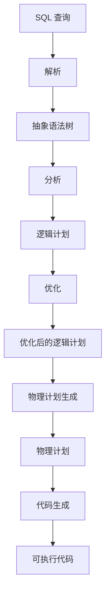

# Spark Catalyst原理与代码实例讲解

## 1.背景介绍

Apache Spark 是一个快速、通用的分布式计算系统，广泛应用于大数据处理和分析。Spark 的核心组件之一是 Catalyst，它是 Spark SQL 的查询优化器和执行引擎。Catalyst 通过一系列的规则和策略来优化查询计划，从而提高查询性能。本文将深入探讨 Spark Catalyst 的原理，并通过代码实例来展示其实际应用。

## 2.核心概念与联系

### 2.1 Catalyst 的架构

Catalyst 的架构主要包括以下几个部分：

- **抽象语法树（AST）**：表示 SQL 查询的结构化形式。
- **逻辑计划（Logical Plan）**：描述查询的逻辑操作。
- **物理计划（Physical Plan）**：描述查询的物理执行方式。
- **规则（Rules）**：用于优化逻辑计划和物理计划。

### 2.2 Catalyst 的工作流程

Catalyst 的工作流程可以分为以下几个步骤：

1. **解析（Parsing）**：将 SQL 查询解析为抽象语法树。
2. **分析（Analysis）**：将抽象语法树转换为逻辑计划，并进行语义检查。
3. **优化（Optimization）**：应用一系列规则对逻辑计划进行优化。
4. **物理计划生成（Physical Planning）**：将优化后的逻辑计划转换为物理计划。
5. **代码生成（Code Generation）**：生成可执行的代码。

以下是 Catalyst 工作流程的 Mermaid 流程图：



## 3.核心算法原理具体操作步骤

### 3.1 解析（Parsing）

解析阶段将 SQL 查询字符串转换为抽象语法树。这个过程通常使用解析器生成器工具（如 ANTLR）来实现。

### 3.2 分析（Analysis）

分析阶段将抽象语法树转换为逻辑计划，并进行语义检查。这个过程包括以下几个步骤：

- **解析表和列的元数据**。
- **验证查询的语义正确性**。
- **将抽象语法树转换为逻辑计划**。

### 3.3 优化（Optimization）

优化阶段应用一系列规则对逻辑计划进行优化。常见的优化规则包括：

- **谓词下推（Predicate Pushdown）**：将过滤条件尽可能下推到数据源。
- **投影剪裁（Projection Pruning）**：只保留查询中实际需要的列。
- **常量折叠（Constant Folding）**：将常量表达式在编译时计算。

### 3.4 物理计划生成（Physical Planning）

物理计划生成阶段将优化后的逻辑计划转换为物理计划。这个过程包括以下几个步骤：

- **选择合适的物理操作**。
- **生成物理执行计划**。

### 3.5 代码生成（Code Generation）

代码生成阶段将物理计划转换为可执行的代码。这个过程通常使用代码生成器工具（如 Janino）来实现。

## 4.数学模型和公式详细讲解举例说明

在 Catalyst 中，查询优化的核心是代价模型（Cost Model）。代价模型用于评估不同查询计划的执行代价，从而选择最优的查询计划。代价模型通常基于以下几个因素：

- **I/O 成本**：读取和写入数据的成本。
- **CPU 成本**：计算操作的成本。
- **网络成本**：数据传输的成本。

假设我们有一个简单的查询：

```sql
SELECT * FROM table WHERE column = 1
```

在这个查询中，Catalyst 可能会生成两个不同的物理计划：

1. **全表扫描**：读取整个表并过滤出满足条件的行。
2. **索引扫描**：使用索引直接查找满足条件的行。

我们可以使用代价模型来评估这两个计划的执行代价：

$$
\text{全表扫描成本} = \text{表的大小} \times \text{I/O 成本}
$$

$$
\text{索引扫描成本} = \text{索引查找成本} + \text{过滤成本}
$$

Catalyst 会选择代价较低的计划来执行查询。

## 5.项目实践：代码实例和详细解释说明

### 5.1 环境准备

首先，我们需要准备一个 Spark 环境。可以使用以下命令安装 Spark：

```bash
wget https://archive.apache.org/dist/spark/spark-3.0.1/spark-3.0.1-bin-hadoop2.7.tgz
tar -xzf spark-3.0.1-bin-hadoop2.7.tgz
cd spark-3.0.1-bin-hadoop2.7
```

### 5.2 示例代码

以下是一个简单的 Spark SQL 示例，展示了 Catalyst 的工作流程：

```scala
import org.apache.spark.sql.SparkSession

// 创建 SparkSession
val spark = SparkSession.builder
  .appName("CatalystExample")
  .master("local")
  .getOrCreate()

// 创建 DataFrame
val data = Seq((1, "Alice"), (2, "Bob"), (3, "Cathy"))
val df = spark.createDataFrame(data).toDF("id", "name")

// 注册临时视图
df.createOrReplaceTempView("people")

// 执行 SQL 查询
val result = spark.sql("SELECT * FROM people WHERE id = 1")

// 显示结果
result.show()
```

### 5.3 详细解释

1. **创建 SparkSession**：SparkSession 是 Spark SQL 的入口点。
2. **创建 DataFrame**：DataFrame 是分布式数据集的抽象。
3. **注册临时视图**：将 DataFrame 注册为临时视图，以便使用 SQL 查询。
4. **执行 SQL 查询**：使用 Catalyst 解析、分析、优化和执行查询。
5. **显示结果**：显示查询结果。

## 6.实际应用场景

Catalyst 在以下几个实际应用场景中发挥了重要作用：

### 6.1 数据仓库

在数据仓库中，Catalyst 可以优化复杂的 SQL 查询，从而提高查询性能。例如，在处理大规模数据集时，Catalyst 可以通过谓词下推和投影剪裁来减少数据扫描的范围。

### 6.2 实时数据分析

在实时数据分析中，Catalyst 可以优化流式查询，从而提高数据处理的效率。例如，在处理实时日志数据时，Catalyst 可以通过常量折叠和索引扫描来加速查询。

### 6.3 机器学习

在机器学习中，Catalyst 可以优化数据预处理和特征工程的操作，从而提高模型训练的效率。例如，在处理大规模特征数据时，Catalyst 可以通过代价模型来选择最优的查询计划。

## 7.工具和资源推荐

### 7.1 工具

- **Apache Spark**：分布式计算系统，支持大数据处理和分析。
- **ANTLR**：解析器生成器工具，用于解析 SQL 查询。
- **Janino**：Java 编译器工具，用于生成可执行代码。

### 7.2 资源

- **Spark 官方文档**：详细介绍了 Spark 的各个组件和使用方法。
- **《Spark: The Definitive Guide》**：一本全面介绍 Spark 的书籍，适合初学者和高级用户。
- **Catalyst 源代码**：可以在 GitHub 上找到 Catalyst 的源代码，适合深入研究。

## 8.总结：未来发展趋势与挑战

Catalyst 作为 Spark SQL 的核心组件，在查询优化和执行方面发挥了重要作用。未来，Catalyst 可能会在以下几个方面进一步发展：

### 8.1 更智能的优化算法

随着机器学习和人工智能的发展，Catalyst 可能会引入更智能的优化算法，从而进一步提高查询性能。

### 8.2 更好的支持多种数据源

Catalyst 可能会进一步扩展其对多种数据源的支持，从而提高数据处理的灵活性。

### 8.3 更高的可扩展性

Catalyst 可能会进一步提高其可扩展性，从而支持更大规模的数据处理和分析。

## 9.附录：常见问题与解答

### 9.1 Catalyst 是什么？

Catalyst 是 Spark SQL 的查询优化器和执行引擎，通过一系列的规则和策略来优化查询计划，从而提高查询性能。

### 9.2 Catalyst 的工作流程是什么？

Catalyst 的工作流程包括解析、分析、优化、物理计划生成和代码生成五个步骤。

### 9.3 如何在 Spark 中使用 Catalyst？

Catalyst 是 Spark SQL 的核心组件，用户可以通过编写 SQL 查询或使用 DataFrame API 来使用 Catalyst。

### 9.4 Catalyst 的优化规则有哪些？

Catalyst 的优化规则包括谓词下推、投影剪裁和常量折叠等。

### 9.5 Catalyst 的未来发展趋势是什么？

Catalyst 可能会引入更智能的优化算法、扩展对多种数据源的支持，并提高其可扩展性。

---

作者：禅与计算机程序设计艺术 / Zen and the Art of Computer Programming