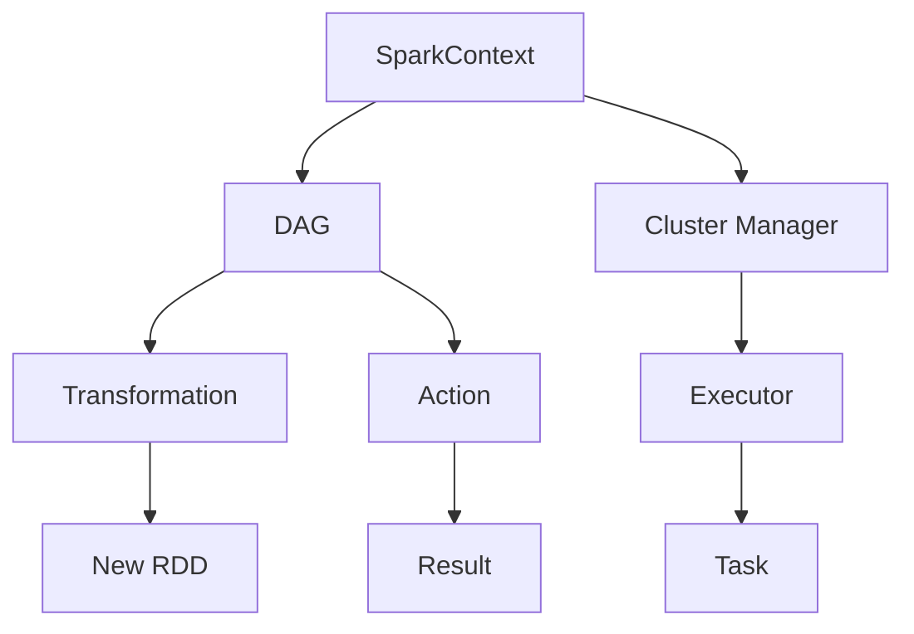

# Spark原理与代码实例讲解

## 1.背景介绍

Apache Spark 是一个开源的分布式计算系统，旨在以高效、可扩展的方式处理大规模数据。自2014年正式发布以来，Spark 已成为大数据处理领域的主流工具之一。其核心优势在于内存计算、丰富的API和广泛的生态系统支持。本文将深入探讨 Spark 的核心概念、算法原理、数学模型、实际应用场景，并通过代码实例详细解释其工作机制。

## 2.核心概念与联系

### 2.1 RDD（弹性分布式数据集）

RDD 是 Spark 的核心抽象，代表一个不可变的分布式对象集合。RDD 提供了两类操作：转换（Transformation）和行动（Action）。转换操作生成新的 RDD，而行动操作则触发实际计算。

### 2.2 DAG（有向无环图）

Spark 使用 DAG 来表示计算任务的依赖关系。每个 RDD 的转换操作都会生成一个新的节点，形成一个有向无环图。DAG 的优化和调度是 Spark 高效执行的关键。

### 2.3 SparkContext

SparkContext 是 Spark 应用的入口点，负责与集群管理器（如 YARN、Mesos）通信，分配资源并启动任务。

### 2.4 Executor 和 Task

Executor 是在工作节点上运行的进程，负责执行任务并存储数据。Task 是最小的计算单元，由 SparkContext 分发给 Executor 执行。



## 3.核心算法原理具体操作步骤

### 3.1 RDD 的创建与转换

RDD 可以从外部数据源（如 HDFS、S3）创建，也可以通过并行化本地集合生成。常见的转换操作包括 map、filter、flatMap、groupByKey、reduceByKey 等。

### 3.2 DAG 的生成与优化

每个 RDD 的转换操作都会生成一个新的 DAG 节点。Spark 会在行动操作触发时，对 DAG 进行优化和调度，生成最优的执行计划。

### 3.3 任务调度与执行

SparkContext 将 DAG 划分为多个阶段（Stage），每个阶段包含若干任务（Task）。任务被分发到 Executor 上执行，结果通过 Shuffle 操作进行数据交换。

### 3.4 内存管理与容错机制

Spark 通过内存计算提高性能，但也提供了磁盘存储和容错机制。RDD 的血统（Lineage）记录了生成过程，允许在节点故障时重新计算丢失的数据。

## 4.数学模型和公式详细讲解举例说明

### 4.1 RDD 转换的数学表示

RDD 的转换可以用函数映射表示。例如，map 操作可以表示为 $ RDD' = f(RDD) $，其中 $ f $ 是应用于每个元素的函数。

### 4.2 DAG 的优化模型

DAG 的优化涉及图论中的最短路径和最小生成树问题。Spark 使用代价模型（Cost Model）评估不同执行计划的代价，选择最优方案。

### 4.3 Shuffle 操作的数学分析

Shuffle 操作涉及数据的重新分区和排序。其复杂度可以表示为 $ O(n \log n) $，其中 $ n $ 是数据量。Spark 通过优化 Shuffle 操作，减少数据传输和排序开销。

## 5.项目实践：代码实例和详细解释说明

### 5.1 环境配置

首先，确保已安装 Spark 和 Java 运行环境。可以通过以下命令启动 Spark Shell：

```bash
$ spark-shell
```

### 5.2 RDD 的创建与基本操作

以下代码示例展示了如何创建 RDD 并执行基本操作：

```scala
// 创建 RDD
val data = Array(1, 2, 3, 4, 5)
val rdd = sc.parallelize(data)

// 转换操作
val rdd2 = rdd.map(x => x * 2)

// 行动操作
val result = rdd2.collect()
result.foreach(println)
```

### 5.3 复杂转换与行动操作

以下示例展示了更复杂的转换和行动操作：

```scala
// 读取外部数据
val textFile = sc.textFile("hdfs://path/to/file")

// 词频统计
val counts = textFile.flatMap(line => line.split(" "))
                     .map(word => (word, 1))
                     .reduceByKey(_ + _)

// 保存结果
counts.saveAsTextFile("hdfs://path/to/output")
```

### 5.4 数据缓存与持久化

Spark 提供了多种数据持久化机制，以提高性能：

```scala
// 缓存 RDD
val cachedRDD = rdd.cache()

// 持久化 RDD
val persistedRDD = rdd.persist(StorageLevel.MEMORY_AND_DISK)
```

## 6.实际应用场景

### 6.1 数据处理与分析

Spark 广泛应用于大规模数据处理和分析任务，如日志分析、用户行为分析、推荐系统等。

### 6.2 机器学习

Spark MLlib 提供了丰富的机器学习算法库，支持分类、回归、聚类、协同过滤等任务。

### 6.3 实时流处理

Spark Streaming 支持实时数据流处理，适用于实时监控、在线分析等场景。

### 6.4 图计算

GraphX 是 Spark 的图计算库，支持图算法和图查询，适用于社交网络分析、路径规划等场景。

## 7.工具和资源推荐

### 7.1 开发工具

- IntelliJ IDEA：支持 Scala 和 Spark 开发的集成开发环境。
- Jupyter Notebook：支持交互式数据分析和可视化。

### 7.2 学习资源

- 《Learning Spark》：Spark 官方推荐的学习书籍。
- Spark 官方文档：详细的 API 参考和使用指南。

### 7.3 社区与支持

- Stack Overflow：活跃的技术问答社区。
- Apache Spark 邮件列表：官方的用户和开发者交流平台。

## 8.总结：未来发展趋势与挑战

### 8.1 未来发展趋势

Spark 将继续在性能优化、易用性和生态系统扩展方面发展。未来可能会引入更多的自动化优化机制和智能调度算法。

### 8.2 面临的挑战

Spark 在处理超大规模数据和复杂计算任务时，仍面临性能瓶颈和资源管理挑战。如何进一步优化内存管理和数据传输，将是未来的重要研究方向。

## 9.附录：常见问题与解答

### 9.1 如何解决内存不足问题？

可以通过调整 Spark 的内存配置参数（如 spark.executor.memory）和使用持久化机制（如 StorageLevel.MEMORY_AND_DISK）来解决内存不足问题。

### 9.2 如何优化 Shuffle 操作？

可以通过调整并行度（如 spark.sql.shuffle.partitions）和使用本地磁盘存储来优化 Shuffle 操作。

### 9.3 如何调试 Spark 应用？

可以使用 Spark 提供的 Web UI 和日志系统进行调试，分析任务执行情况和性能瓶颈。

---

作者：禅与计算机程序设计艺术 / Zen and the Art of Computer Programming