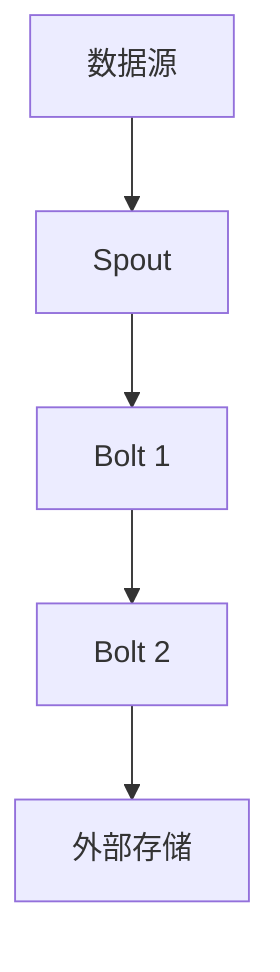

# Storm原理与代码实例讲解

## 1.背景介绍

在大数据处理和实时计算领域，Apache Storm 是一个非常重要的工具。它是一个分布式实时计算系统，能够处理大量的数据流，并且具有高可扩展性和容错性。Storm 的出现填补了 Hadoop 在实时数据处理方面的空白，使得开发者可以更方便地进行实时数据分析和处理。

Storm 的核心理念是将数据流处理任务分解为多个独立的计算单元，这些计算单元可以在分布式环境中并行执行，从而实现高效的数据处理。Storm 的架构设计使得它能够处理各种类型的数据流，包括社交媒体数据、传感器数据、金融交易数据等。

## 2.核心概念与联系

在深入了解 Storm 的工作原理之前，我们需要先了解一些核心概念：

### 2.1 拓扑（Topology）

拓扑是 Storm 中的基本处理单元，它定义了数据流的处理逻辑。一个拓扑由多个节点组成，每个节点执行特定的计算任务。拓扑可以看作是一个有向无环图，其中每个节点代表一个计算单元，边代表数据流。

### 2.2 节点（Node）

节点是拓扑中的基本组成部分，分为两种类型：Spout 和 Bolt。

- **Spout**：数据源节点，负责从外部数据源读取数据并将其发送到拓扑中。
- **Bolt**：处理节点，负责接收数据并进行处理，然后将处理结果发送到下一个节点。

### 2.3 流（Stream）

流是 Storm 中的数据传输通道，数据在流中以元组（Tuple）的形式传输。每个元组包含多个字段，每个字段可以是任意类型的数据。

### 2.4 集群（Cluster）

Storm 集群由多个节点组成，每个节点运行一个或多个工作进程（Worker）。集群中的节点分为两种类型：Nimbus 和 Supervisor。

- **Nimbus**：集群管理节点，负责分配任务、监控集群状态和处理故障。
- **Supervisor**：工作节点，负责执行分配给它的任务。

### 2.5 工作进程（Worker）

工作进程是集群中的基本执行单元，每个工作进程运行一个或多个任务（Task）。任务是拓扑中的基本计算单元，每个任务执行一个特定的计算逻辑。

### 2.6 任务（Task）

任务是拓扑中的基本计算单元，每个任务执行一个特定的计算逻辑。任务可以是 Spout 或 Bolt。

### 2.7 可靠性（Reliability）

Storm 提供了可靠性保证，确保每个元组都能被成功处理。Storm 使用确认机制（Acking）来跟踪元组的处理状态，如果某个元组未能被成功处理，Storm 会重新发送该元组。

## 3.核心算法原理具体操作步骤

Storm 的核心算法原理可以分为以下几个步骤：

### 3.1 数据读取

Spout 从外部数据源读取数据，并将数据转换为元组形式。Spout 可以从各种数据源读取数据，包括消息队列、数据库、文件等。

### 3.2 数据处理

Bolt 接收 Spout 发送的元组，并对元组进行处理。Bolt 可以执行各种类型的计算任务，包括过滤、聚合、转换等。

### 3.3 数据传输

处理后的元组通过流传输到下一个 Bolt，直到所有的处理任务完成。流的传输可以是有序的，也可以是无序的，具体取决于拓扑的设计。

### 3.4 结果输出

最终处理结果可以输出到外部存储系统，如数据库、文件系统等。Bolt 可以将处理结果发送到外部存储系统，或者将结果发送到下一个拓扑进行进一步处理。

以下是 Storm 的核心算法流程图：



## 4.数学模型和公式详细讲解举例说明

Storm 的数据处理模型可以用数学公式来描述。假设我们有一个数据流 $S$，其中每个数据项 $s_i$ 可以表示为一个元组 $t_i$。Spout 从数据源读取数据，并将其转换为元组：

$$
t_i = f(s_i)
$$

其中，$f$ 是数据转换函数。

Bolt 对元组进行处理，处理结果可以表示为：

$$
r_i = g(t_i)
$$

其中，$g$ 是数据处理函数。

最终处理结果可以表示为：

$$
R = \sum_{i=1}^{n} r_i
$$

其中，$n$ 是数据项的数量。

举例说明，假设我们有一个数据流，其中每个数据项表示一个整数。我们希望计算这些整数的平方和。Spout 从数据源读取整数，并将其转换为元组：

$$
t_i = s_i
$$

Bolt 对元组进行平方计算：

$$
r_i = t_i^2
$$

最终处理结果为：

$$
R = \sum_{i=1}^{n} t_i^2
$$

## 5.项目实践：代码实例和详细解释说明

下面我们通过一个具体的代码实例来说明如何使用 Storm 进行数据处理。假设我们有一个数据流，其中每个数据项表示一个整数，我们希望计算这些整数的平方和。

### 5.1 Spout 实现

首先，我们需要实现一个 Spout，从数据源读取整数数据。以下是一个简单的 Spout 实现：

```java
import org.apache.storm.spout.SpoutOutputCollector;
import org.apache.storm.task.OutputCollector;
import org.apache.storm.task.TopologyContext;
import org.apache.storm.topology.OutputFieldsDeclarer;
import org.apache.storm.topology.base.BaseRichSpout;
import org.apache.storm.tuple.Fields;
import org.apache.storm.tuple.Values;

import java.util.Map;
import java.util.Random;

public class IntegerSpout extends BaseRichSpout {
    private SpoutOutputCollector collector;
    private Random random;

    @Override
    public void open(Map conf, TopologyContext context, SpoutOutputCollector collector) {
        this.collector = collector;
        this.random = new Random();
    }

    @Override
    public void nextTuple() {
        int number = random.nextInt(100);
        collector.emit(new Values(number));
    }

    @Override
    public void declareOutputFields(OutputFieldsDeclarer declarer) {
        declarer.declare(new Fields("number"));
    }
}
```

### 5.2 Bolt 实现

接下来，我们需要实现一个 Bolt，对整数进行平方计算。以下是一个简单的 Bolt 实现：

```java
import org.apache.storm.task.OutputCollector;
import org.apache.storm.task.TopologyContext;
import org.apache.storm.topology.OutputFieldsDeclarer;
import org.apache.storm.topology.base.BaseRichBolt;
import org.apache.storm.tuple.Tuple;
import org.apache.storm.tuple.Values;

import java.util.Map;

public class SquareBolt extends BaseRichBolt {
    private OutputCollector collector;

    @Override
    public void prepare(Map conf, TopologyContext context, OutputCollector collector) {
        this.collector = collector;
    }

    @Override
    public void execute(Tuple tuple) {
        int number = tuple.getIntegerByField("number");
        int square = number * number;
        collector.emit(new Values(square));
    }

    @Override
    public void declareOutputFields(OutputFieldsDeclarer declarer) {
        declarer.declare(new Fields("square"));
    }
}
```

### 5.3 拓扑实现

最后，我们需要定义一个拓扑，将 Spout 和 Bolt 连接起来。以下是一个简单的拓扑实现：

```java
import org.apache.storm.Config;
import org.apache.storm.LocalCluster;
import org.apache.storm.topology.TopologyBuilder;

public class SquareTopology {
    public static void main(String[] args) {
        TopologyBuilder builder = new TopologyBuilder();
        builder.setSpout("integer-spout", new IntegerSpout());
        builder.setBolt("square-bolt", new SquareBolt()).shuffleGrouping("integer-spout");

        Config config = new Config();
        config.setDebug(true);

        LocalCluster cluster = new LocalCluster();
        cluster.submitTopology("square-topology", config, builder.createTopology());

        try {
            Thread.sleep(10000);
        } catch (InterruptedException e) {
            e.printStackTrace();
        }

        cluster.shutdown();
    }
}
```

### 5.4 代码解释

- **IntegerSpout**：从数据源读取整数数据，并将其发送到拓扑中。
- **SquareBolt**：接收整数数据，并对其进行平方计算。
- **SquareTopology**：定义拓扑，将 Spout 和 Bolt 连接起来，并提交拓扑到本地集群运行。

## 6.实际应用场景

Storm 在实际应用中有广泛的应用场景，以下是一些典型的应用场景：

### 6.1 实时数据分析

Storm 可以用于实时数据分析，如社交媒体数据分析、传感器数据分析等。通过实时分析数据，企业可以及时获取有价值的信息，做出快速决策。

### 6.2 实时监控

Storm 可以用于实时监控系统，如网络监控、服务器监控等。通过实时监控系统状态，企业可以及时发现和处理故障，确保系统的稳定运行。

### 6.3 实时推荐系统

Storm 可以用于实时推荐系统，如电商推荐、内容推荐等。通过实时分析用户行为数据，企业可以为用户提供个性化的推荐，提高用户体验和满意度。

### 6.4 实时金融交易

Storm 可以用于实时金融交易系统，如股票交易、期货交易等。通过实时处理交易数据，企业可以及时发现市场机会，做出快速交易决策。

## 7.工具和资源推荐

在使用 Storm 进行开发时，有一些工具和资源可以帮助我们提高开发效率和质量：

### 7.1 开发工具

- **IntelliJ IDEA**：一款功能强大的 Java 开发工具，支持 Storm 开发。
- **Eclipse**：另一款流行的 Java 开发工具，也支持 Storm 开发。

### 7.2 资源推荐

- **Storm 官方文档**：提供了详细的 Storm 使用指南和 API 文档。
- **Storm GitHub 仓库**：提供了 Storm 的源代码和示例代码。
- **Storm 社区**：一个活跃的社区，提供了丰富的资源和支持。

## 8.总结：未来发展趋势与挑战

Storm 作为一个分布式实时计算系统，在大数据处理和实时计算领域有着广泛的应用。随着数据量的不断增长和实时计算需求的增加，Storm 的重要性将会越来越大。

### 8.1 未来发展趋势

- **性能优化**：随着硬件性能的提升和算法的优化，Storm 的性能将会不断提高，能够处理更大规模的数据流。
- **功能扩展**：Storm 将会不断扩展其功能，支持更多类型的数据源和处理任务，满足不同应用场景的需求。
- **易用性提升**：Storm 将会不断提升其易用性，提供更友好的开发工具和接口，降低开发门槛。

### 8.2 挑战

- **数据一致性**：在分布式环境中，确保数据的一致性是一个重要的挑战。Storm 需要提供更强大的数据一致性保证机制。
- **容错性**：在大规模分布式系统中，容错性是一个关键问题。Storm 需要提供更强大的容错机制，确保系统的稳定运行。
- **扩展性**：随着数据量的不断增长，系统的扩展性变得越来越重要。Storm 需要提供更强大的扩展能力，支持更大规模的数据处理。

## 9.附录：常见问题与解答

### 9.1 Storm 与 Hadoop 的区别是什么？

Storm 和 Hadoop 都是分布式计算系统，但它们的应用场景不同。Hadoop 主要用于批处理大规模数据，而 Storm 主要用于实时处理数据流。

### 9.2 如何保证 Storm 的数据处理可靠性？

Storm 提供了确认机制（Acking）来跟踪元组的处理状态，如果某个元组未能被成功处理，Storm 会重新发送该元组，从而保证数据处理的可靠性。

### 9.3 Storm 的性能如何？

Storm 的性能非常高，能够处理每秒数百万条数据流。通过合理的拓扑设计和资源配置，可以进一步提升 Storm 的性能。

### 9.4 如何调试 Storm 应用？

可以使用 Storm 提供的日志功能和调试工具来调试 Storm 应用。此外，可以在本地集群中运行拓扑，方便进行调试和测试。

### 9.5 Storm 支持哪些数据源？

Storm 支持多种数据源，包括消息队列（如 Kafka）、数据库、文件系统等。可以通过实现自定义 Spout 来支持更多类型的数据源。

---

作者：禅与计算机程序设计艺术 / Zen and the Art of Computer Programming