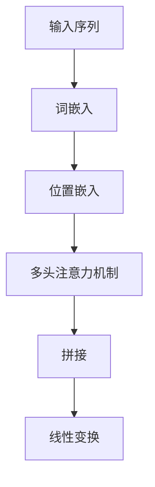

# Transformer大模型实战 跨文本书写的通用性

## 1.背景介绍

在自然语言处理（NLP）领域，Transformer模型自2017年问世以来，迅速成为了研究和应用的热点。其独特的架构和强大的性能，使得Transformer在各种NLP任务中表现出色。本文将深入探讨Transformer大模型的核心概念、算法原理、数学模型，并通过实际项目实践展示其跨文本书写的通用性。

## 2.核心概念与联系

### 2.1 Transformer模型简介

Transformer模型由Vaswani等人在2017年提出，主要用于解决序列到序列的任务。与传统的RNN和LSTM不同，Transformer完全基于注意力机制，能够更好地捕捉长距离依赖关系。

### 2.2 注意力机制

注意力机制是Transformer的核心。它通过计算输入序列中每个元素的重要性权重，来决定如何组合这些元素，从而生成输出。

### 2.3 自注意力机制

自注意力机制（Self-Attention）是Transformer的关键创新。它允许模型在处理一个序列时，同时关注序列中的所有位置，从而捕捉全局信息。

### 2.4 编码器-解码器架构

Transformer采用编码器-解码器架构。编码器将输入序列转换为一组特征表示，解码器则根据这些特征表示生成输出序列。

## 3.核心算法原理具体操作步骤

### 3.1 输入嵌入

输入嵌入将离散的词汇转换为连续的向量表示。Transformer使用词嵌入和位置嵌入的结合来表示输入序列。

### 3.2 多头注意力机制

多头注意力机制通过并行计算多个注意力头，捕捉不同的特征子空间。每个注意力头独立计算，然后将结果拼接并线性变换。



### 3.3 前馈神经网络

每个编码器和解码器层都包含一个前馈神经网络。这个网络由两个线性变换和一个ReLU激活函数组成。

### 3.4 残差连接和层归一化

残差连接和层归一化帮助模型更快地收敛，并提高训练稳定性。每个子层的输出都通过残差连接和层归一化处理。

## 4.数学模型和公式详细讲解举例说明

### 4.1 注意力机制公式

注意力机制的核心公式如下：

$$
\text{Attention}(Q, K, V) = \text{softmax}\left(\frac{QK^T}{\sqrt{d_k}}\right)V
$$

其中，$Q$、$K$、$V$分别表示查询、键和值矩阵，$d_k$是键的维度。

### 4.2 多头注意力机制公式

多头注意力机制通过并行计算多个注意力头，公式如下：

$$
\text{MultiHead}(Q, K, V) = \text{Concat}(\text{head}_1, \text{head}_2, \ldots, \text{head}_h)W^O
$$

其中，每个注意力头的计算方式为：

$$
\text{head}_i = \text{Attention}(QW_i^Q, KW_i^K, VW_i^V)
$$

### 4.3 前馈神经网络公式

前馈神经网络的公式如下：

$$
\text{FFN}(x) = \max(0, xW_1 + b_1)W_2 + b_2
$$

其中，$W_1$、$W_2$、$b_1$、$b_2$是可训练的参数。

## 5.项目实践：代码实例和详细解释说明

### 5.1 环境准备

首先，确保安装了必要的库：

```bash
pip install torch transformers
```

### 5.2 数据预处理

使用Hugging Face的Transformers库进行数据预处理：

```python
from transformers import BertTokenizer

tokenizer = BertTokenizer.from_pretrained('bert-base-uncased')
text = "Hello, how are you?"
inputs = tokenizer(text, return_tensors='pt')
```

### 5.3 模型定义

定义一个简单的Transformer模型：

```python
import torch
from torch import nn
from transformers import BertModel

class SimpleTransformer(nn.Module):
    def __init__(self):
        super(SimpleTransformer, self).__init__()
        self.bert = BertModel.from_pretrained('bert-base-uncased')
        self.classifier = nn.Linear(768, 2)  # 假设是二分类任务

    def forward(self, input_ids, attention_mask):
        outputs = self.bert(input_ids, attention_mask=attention_mask)
        cls_output = outputs[1]  # [CLS] token的输出
        logits = self.classifier(cls_output)
        return logits

model = SimpleTransformer()
```

### 5.4 模型训练

定义训练循环：

```python
from torch.optim import Adam

optimizer = Adam(model.parameters(), lr=2e-5)
loss_fn = nn.CrossEntropyLoss()

for epoch in range(3):  # 假设训练3个epoch
    model.train()
    optimizer.zero_grad()
    outputs = model(inputs['input_ids'], inputs['attention_mask'])
    loss = loss_fn(outputs, torch.tensor([1]))  # 假设标签为1
    loss.backward()
    optimizer.step()
    print(f"Epoch {epoch + 1}, Loss: {loss.item()}")
```

## 6.实际应用场景

### 6.1 机器翻译

Transformer在机器翻译任务中表现出色，能够处理多种语言对的翻译任务。

### 6.2 文本生成

通过预训练和微调，Transformer可以生成高质量的文本，应用于对话系统、内容创作等领域。

### 6.3 情感分析

Transformer可以用于情感分析任务，帮助企业了解用户情感，提高客户满意度。

### 6.4 信息检索

在信息检索领域，Transformer可以提高搜索结果的相关性和准确性。

## 7.工具和资源推荐

### 7.1 Hugging Face Transformers

Hugging Face的Transformers库是一个强大的工具，提供了多种预训练模型和便捷的API。

### 7.2 PyTorch

PyTorch是一个灵活且易用的深度学习框架，适合进行Transformer模型的研究和应用。

### 7.3 TensorFlow

TensorFlow也是一个流行的深度学习框架，提供了丰富的工具和资源支持Transformer模型的开发。

## 8.总结：未来发展趋势与挑战

Transformer模型在NLP领域取得了显著的成果，但仍面临一些挑战。未来的发展趋势包括：

### 8.1 模型压缩与加速

Transformer模型通常非常大，如何在保证性能的前提下进行模型压缩和加速是一个重要的研究方向。

### 8.2 多模态学习

将Transformer应用于多模态数据（如图像、文本、音频）的融合和处理，是一个具有潜力的研究领域。

### 8.3 可解释性

提高Transformer模型的可解释性，帮助用户理解模型的决策过程，是未来的重要方向。

## 9.附录：常见问题与解答

### 9.1 Transformer模型为什么比RNN和LSTM更强大？

Transformer模型通过自注意力机制，能够更好地捕捉长距离依赖关系，并且并行计算效率更高。

### 9.2 如何选择合适的预训练模型？

选择预训练模型时，应根据具体任务和数据集的特点，选择适合的模型。例如，BERT适合处理句子级别的任务，GPT适合生成任务。

### 9.3 如何处理大规模数据集？

处理大规模数据集时，可以考虑使用分布式训练和数据并行技术，提高训练效率。

### 9.4 如何提高模型的泛化能力？

提高模型的泛化能力，可以通过数据增强、正则化、交叉验证等方法。

### 9.5 Transformer模型的训练时间为什么这么长？

Transformer模型通常包含大量参数，训练时间较长。可以通过使用更强大的硬件（如GPU、TPU）和优化算法（如混合精度训练）来加速训练。

---

作者：禅与计算机程序设计艺术 / Zen and the Art of Computer Programming