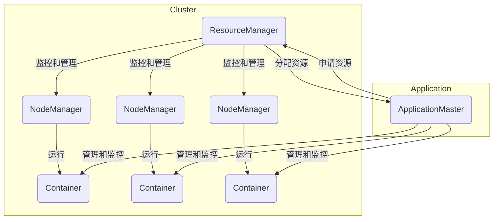

# Yarn原理与代码实例讲解

## 1.背景介绍

在大数据时代,Apache Hadoop作为一个分布式系统基础架构,已经成为了企业存储和大数据处理分析的核心平台。Hadoop2.x版本中引入了全新的资源调度和集群管理技术Yarn(Yet Another Resource Negotiator),旨在构建一个通用的资源管理和调度框架,支持在Hadoop集群上运行多种类型的分布式应用。

Yarn将资源管理和作业调度/监控从MapReduce组件中分离出来,为集群资源的统一管理和调度提供了通用的基础框架。这种"共享资源池"的设计理念,使得Hadoop集群可以高效地共享和利用集群资源,不仅可以运行MapReduce作业,还可以支持其他类型的分布式应用,如Spark、Flink等,极大提高了集群资源利用率。

## 2.核心概念与联系

Yarn主要由ResourceManager(RM)、ApplicationMaster(AM)、NodeManager(NM)等组件构成。其核心概念和组件关系如下:



- **ResourceManager(RM)**: 整个Yarn集群的资源管理和调度总控制器,负责接收应用程序的资源申请,并为已接受的应用程序分配资源,监控集群节点资源使用情况。
- **NodeManager(NM)**: 运行在每个节点上的资源和任务管理器,负责单节点上的资源管理和使用,并定期向RM汇报本节点资源使用情况。
- **ApplicationMaster(AM)**: 应用程序启动时由RM指定的、具体应用程序的"资源协调器",负责应用程序内部的资源申请、任务调度和监控等。
- **Container**: 容器是Yarn中的资源抽象,封装了某个节点上的多维度资源,如CPU、内存、磁盘、网络等。AM向RM申请容器运行具体任务。

## 3.核心算法原理具体操作步骤  

Yarn的工作原理和核心算法流程如下:

### 3.1 启动流程

1. 用户向Yarn提交应用程序,RM收到请求后记录该应用程序的基本信息。
2. RM为该应用程序分配第一个Container,并与对应的Node上的NM联系,要求它们运行AM。
3. AM首先向RM注册,并通过RPC协议循环向RM申请它所需的资源(Container)。
4. RM为AM分配Container,并指示相应的NM为这些Container准备好资源。
5. AM在申请到的Container中启动具体任务,监控任务运行状态。

### 3.2 资源分配算法

Yarn采用了称为"容量调度器(Capacity Scheduler)"的资源分配算法,按照预先配置的队列资源分配策略对多个应用程序进行资源分配。该算法主要步骤:

1. **队列层级结构**:根据配置文件构建多级队列树,每个队列配置一定的资源量。
2. **资源分配顺序**:先按队列层级从根向叶子方向分配资源,再在同级队列间进行资源分配。
3. **同级队列分配**:遵循先行循环(Fair)原则,按需分配资源,并支持多种分配策略。
4. **容量保证**:为每个队列设置资源量上下限,确保队列资源处于合理范围。
5. **弹性负载**:当部分队列资源未用完时,其他队列可以暂时使用剩余资源。
6. **高可用性**:队列支持故障转移,应用可在其他队列恢复运行。

该算法保证了集群资源可以在各队列间合理分配,并具有高可用性和弹性。

### 3.3 任务调度算法

AM根据应用需求,合理分配和调度任务到分配的Container中运行。常用的任务调度算法有:

1. **FIFO调度**:先来先服务,按任务到达顺序执行。简单,吞吐量高,但不利于短任务。
2. **公平调度**:为每个任务设置权重,按权重比例分配资源,防止某些任务monopoly。
3. **容量调度**:按队列对任务进行隔离,资源分配遵循队列容量约束。
4. **延迟调度**:等待一定时间,批量启动任务,提高数据局部性。
5. **基于机器学习的调度**:根据历史数据和工作负载特征,使用机器学习算法进行调度决策。

不同调度策略可根据应用场景和优先级需求进行组合使用。

## 4.数学模型和公式详细讲解举例说明

Yarn的容量调度器算法涉及到多个数学模型,下面对其中几个核心模型进行详细说明。

### 4.1 资源模型

Yarn中将集群资源抽象为多个资源维度的向量,常见的资源维度包括CPU、内存、磁盘、网络等。对于任意节点$i$,其可用资源向量为:

$$R_i = (r_i^1, r_i^2, ..., r_i^d)$$

其中$d$为资源维度数量。

对于任意容器$j$申请的资源向量为:

$$C_j = (c_j^1, c_j^2, ..., c_j^d)$$

则节点$i$是否能启动容器$j$的判据为:

$$\forall k \in \{1,2,...,d\}, r_i^k \ge c_j^k$$

即所有资源维度的可用资源都要大于容器申请量。

### 4.2 队列模型

设有$n$个队列$q_1, q_2,..., q_n$,每个队列$q_i$的资源量上下限分别为:

$$
L_i = (l_i^1, l_i^2, ..., l_i^d)\\
U_i = (u_i^1, u_i^2, ..., u_i^d)
$$

其中$L_i$为队列$q_i$的资源量下限,即必须至少分配给该队列的资源量;$U_i$为上限,即最多可分配给该队列的资源量。

令集群总资源量为$R$,则应满足:

$$
\sum_{i=1}^n L_i \le R \le \sum_{i=1}^n U_i
$$

即所有队列资源下限之和不超过集群总量,上限之和不小于集群总量。

### 4.3 资源分配模型

设在时刻$t$,队列$q_i$的资源使用量为$A_i(t)$,其资源分配量应满足:

$$L_i \le A_i(t) \le U_i$$

即分配量在队列的上下限范围内。

若$\sum A_i(t) < R$,即有剩余资源时,可将剩余资源$S(t)$按队列的资源权重$w_i$分配:

$$S_i(t) = \frac{w_i}{\sum w_j} S(t)$$

其中$\sum w_i = 1$。则队列$q_i$的总分配资源量为:

$$A_i(t) = \min\{U_i, A_i(t) + S_i(t)\}$$

通过上述数学模型,Yarn可以根据队列配置对集群资源进行合理分配和调度。

## 5.项目实践:代码实例和详细解释说明

下面通过一个简单的WordCount示例,演示如何在Yarn上运行MapReduce作业。

### 5.1 项目结构

```
- wordcount/
    - src/
        - WordCount.java
    - input/
        - file1.txt
        - file2.txt
    - pom.xml
```

其中`WordCount.java`为MapReduce作业代码,`input/`目录存放输入文件,`pom.xml`为Maven构建文件。

### 5.2 WordCount代码

```java
import java.io.IOException;
import org.apache.hadoop.conf.Configuration;
import org.apache.hadoop.fs.Path;
import org.apache.hadoop.io.IntWritable;
import org.apache.hadoop.io.Text;
import org.apache.hadoop.mapreduce.Job;
import org.apache.hadoop.mapreduce.Mapper;
import org.apache.hadoop.mapreduce.Reducer;
import org.apache.hadoop.mapreduce.lib.input.FileInputFormat;
import org.apache.hadoop.mapreduce.lib.output.FileOutputFormat;

public class WordCount {

    public static class TokenizerMapper
            extends Mapper<Object, Text, Text, IntWritable> {
        // Map函数,将输入文本行拆分为单词,输出<word,1>
    }

    public static class IntSumReducer
            extends Reducer<Text, IntWritable, Text, IntWritable> {
        // Reduce函数,对每个单词的值进行求和
    }

    public static void main(String[] args) throws Exception {
        Configuration conf = new Configuration();
        Job job = Job.getInstance(conf, "word count");
        // 设置作业的Mapper、Reducer类
        job.setJarByClass(WordCount.class);
        job.setMapperClass(TokenizerMapper.class);
        job.setCombinerClass(IntSumReducer.class);
        job.setReducerClass(IntSumReducer.class);
        // 设置作业输出类型
        job.setOutputKeyClass(Text.class);
        job.setOutputValueClass(IntWritable.class);
        // 设置作业输入输出路径
        FileInputFormat.addInputPath(job, new Path(args[0]));
        FileOutputFormat.setOutputPath(job, new Path(args[1]));
        // 提交作业到Yarn集群运行
        System.exit(job.waitForCompletion(true) ? 0 : 1);
    }
}
```

代码中首先构建`Configuration`和`Job`对象,设置Mapper、Reducer等作业参数,最后通过`job.waitForCompletion`提交作业到Yarn集群运行。

### 5.3 打包运行

使用Maven对项目进行打包:

```
mvn clean package
```

将生成的jar包上传到Hadoop集群,使用`yarn`命令运行作业:

```
yarn jar wordcount.jar WordCount /input /output
```

其中`/input`为输入文件路径,`/output`为输出路径。作业运行完成后,可在`/output`路径查看结果文件。

## 6.实际应用场景

Yarn作为通用的资源管理和调度框架,可以支持在同一个Hadoop集群上运行多种类型的分布式应用,主要应用场景包括:

1. **大数据分析**:支持在Hadoop上运行MapReduce、Spark、Flink等分布式计算框架进行大数据分析,如网络日志分析、用户行为分析等。

2. **机器学习**:借助分布式框架如TensorFlow、Pytorch等,可以在Hadoop集群上训练大规模机器学习模型。

3. **流处理**:使用Spark Streaming、Flink等实时流处理框架,可以构建实时数据处理管道,如网络流量监控、订单处理等。

4. **数据湖**:结合分布式存储系统HDFS,Yarn可以为数据湖构建统一的计算和存储平台。

5. **混合云**:Yarn可以跨云端和本地数据中心统一调度资源,支持混合云部署。

6. **物联网**:借助Yarn可以对海量物联网设备数据进行实时处理和分析。

总之,Yarn为Hadoop集群带来了极大的灵活性,使其可以支持更多种类的大数据应用场景。

## 7.工具和资源推荐

- **YARN UI**: Yarn自带的Web UI,可视化监控集群资源使用、应用运行状态等。
- **Apache Slider**: 在Yarn之上构建的一个框架,用于在Hadoop集群上部署长期运行的分布式应用。
- **Apache Twill**: Yarn原生编程框架,提供简单的API支持开发运行在Yarn上的分布式应用。
- **Apache Submarine**: 在Yarn之上构建机器学习工作负载的框架。
- **YarnNativeServices**: Yarn对GPU等异构硬件资源的支持。

## 8.总结:未来发展趋势与挑战

Yarn作为Hadoop的核心资源管理和调度框架,其发展趋势和面临的主要挑战包括:

1. **多租户和多工作负载支持**:增强对多租户、多工作负载类型(批处理、流、AI等)的统一调度和隔离能力。
2. **异构硬件资源管理**:支持GPU、FPGA等异构硬件资源的统一调度和共享。