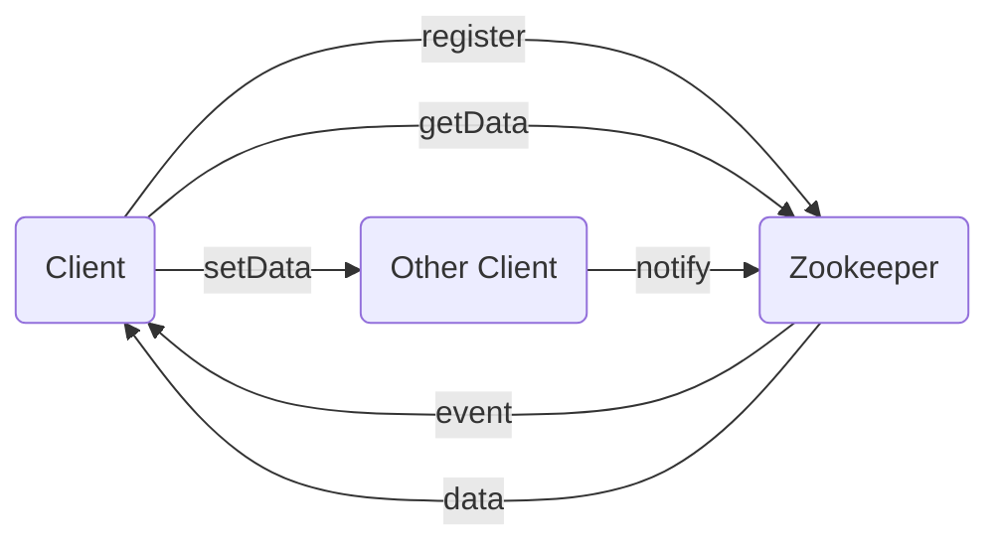

# Zookeeper Watcher机制原理与代码实例讲解

## 1.背景介绍
### 1.1 Zookeeper简介
Apache Zookeeper是一个开源的分布式协调服务系统,它为分布式应用提供了高可用、高性能、一致的分布式配置服务。Zookeeper使用树形结构来存储数据,类似于文件系统,但是它的数据存储在内存中,从而实现高吞吐和低延迟。
### 1.2 Watcher机制产生背景
在分布式系统中,各个节点需要相互协调、同步状态,以保证整个系统的一致性。而传统的轮询方式效率低下,无法满足实时性要求。因此,Zookeeper引入了Watcher机制,允许客户端在数据发生变化时获得通知,从而实现高效的状态同步。

## 2.核心概念与联系
### 2.1 Watcher
Watcher是Zookeeper提供的一种事件通知机制。客户端可以在指定节点上注册Watcher,当节点发生变化(数据改变、节点删除、子节点增加删除)时,Zookeeper会把这个事件发送给客户端。
### 2.2 ACL
ACL即Access Control List,访问控制列表。Zookeeper使用ACL来控制对节点的访问权限,包括CREATE、READ、WRITE、DELETE、ADMIN等。只有具备相应权限的客户端才能进行相应操作。
### 2.3 会话 
客户端与Zookeeper服务端之间通过Session进行连接。每个客户端都会被分配一个全局唯一的SessionID。如果客户端长时间未与服务端进行通信,Session会过期。
### 2.4 数据节点
Zookeeper的数据模型是一棵树,由一系列数据节点组成。每个节点可以存储数据,也可以挂载子节点。节点可以分为持久节点和临时节点(客户端Session结束即被删除)两种。

## 3.核心算法原理具体操作步骤
### 3.1 客户端注册Watcher
1. 客户端调用getData()/exists()/getChildren()三个API中的任意一个,传入Watcher对象
2. 服务端接收到Watcher注册请求,将Watcher对象和请求的数据节点路径关联存储
3. 服务端响应客户端,返回请求的数据内容

### 3.2 服务端处理数据变更事件
1. 其他客户端修改了数据,服务端将变更写入内存数据库
2. 服务端检查该数据节点关联的Watcher列表,如果存在Watcher,则生成一个WatchedEvent事件
3. 服务端将WatchedEvent事件放入对应客户端的事件队列中

### 3.3 客户端回调Watcher
1. 客户端与服务端保持长连接,并轮询是否有新事件
2. 客户端从事件队列中取出事件,根据事件类型调用相应的Watcher回调函数
3. 回调函数执行完毕,该Watcher生命周期结束。如需继续监听,需再次调用注册方法

## 4.数学模型和公式详细讲解举例说明
Zookeeper Watcher机制可以用下面的公式来表示:

$WatchedEvent = (type, path, state)$

其中:
- $type$ 表示事件类型,取值有: None, NodeCreated, NodeDeleted, NodeDataChanged, NodeChildrenChanged
- $path$ 表示发生变更的节点路径  
- $state$ 表示Zookeeper服务端状态,取值有: Disconnected, SyncConnected, AuthFailed, ConnectedReadOnly, SaslAuthenticated, Expired

例如,如果/app/config节点的数据内容发生变化,则对应的WatchedEvent为:
$WatchedEvent(NodeDataChanged, /app/config, SyncConnected)$

## 5.项目实践：代码实例和详细解释说明
下面是一个使用Java API注册Watcher的代码示例:

```java
public class ConfigWatcher implements Watcher {
    private static final String CONFIG_NODE = "/app/config";
    private ZooKeeper zk;
    
    public ConfigWatcher() throws IOException {
        zk = new ZooKeeper("localhost:2181", 3000, this); 
    }
    
    public void start() throws KeeperException, InterruptedException {
        zk.exists(CONFIG_NODE, this);
    }
    
    @Override
    public void process(WatchedEvent event) {
        if (event.getType() == EventType.NodeDataChanged) {
            try {
                byte[] data = zk.getData(CONFIG_NODE, false, null);
                String config = new String(data);
                System.out.println("New config: " + config);
                // 继续监听是否有变更
                zk.exists(CONFIG_NODE, this);
            } catch (KeeperException | InterruptedException e) {
                e.printStackTrace();
            }
        }
    }
}
```

说明:
1. 实现Watcher接口,在process()方法中处理事件通知
2. 创建Zookeeper客户端实例,传入Watcher对象
3. 在start()方法中,调用exists()方法在CONFIG_NODE节点上注册Watcher
4. 当CONFIG_NODE节点数据发生变化时,process()方法会被回调
5. 在process()中首先判断事件类型是否为NodeDataChanged
6. 调用getData()获取最新的配置数据
7. 处理完毕后,再次调用exists()注册Watcher,从而持续监听

## 6.实际应用场景
Zookeeper Watcher机制在分布式系统中有着广泛的应用,下面列举几个典型场景:

### 6.1 分布式配置管理
将应用配置信息存储在Zookeeper中,各个节点监听配置变更事件,实时获取最新配置。

### 6.2 服务注册与发现
服务提供者在Zookeeper中注册服务,服务消费者订阅服务节点的变更事件,实时获取可用服务列表。

### 6.3 分布式锁
多个客户端在Zookeeper的同一个节点上创建临时顺序节点,判断自己是否获得了锁。监听前一个节点的删除事件,从而实现锁的释放。

### 6.4 集群管理
将集群节点信息注册到Zookeeper中,监听节点状态变更事件,实现节点的动态上下线。

## 7.工具和资源推荐
### 7.1 Zookeeper官网
https://zookeeper.apache.org/  
可以找到Zookeeper的各个版本的下载地址、官方文档、API参考手册等。

### 7.2 Curator框架
http://curator.apache.org/  
Curator是Netflix公司开源的一个Zookeeper客户端框架,对Zookeeper的原生API进行了封装,使得Zookeeper开发更加简洁和易用。

### 7.3 《从Paxos到Zookeeper》
这是一本介绍Zookeeper原理和应用的书籍,对Zookeeper的内部实现和典型应用场景进行了深入浅出的讲解,是学习和使用Zookeeper的不错选择。

## 8.总结：未来发展趋势与挑战
### 8.1 发展趋势 
随着分布式系统的不断发展,对协调服务的依赖也日益增加。Zookeeper作为成熟稳定的分布式协调服务,其应用场景将不断拓展。同时,基于Zookeeper的上层应用和框架也将不断涌现,进一步降低分布式系统开发难度。

### 8.2 挑战
海量数据和高并发访问对Zookeeper的性能提出了挑战,如何进一步提高系统吞吐量是一个重要课题。  
另外,Zookeeper仅提供了基础的分布式协调能力,如何在此基础上构建易用、高效、安全的分布式应用框架,也是未来需要持续研究的方向。

## 9.附录：常见问题与解答
### 9.1 Q: Watcher为什么是一次性的?
A: Zookeeper客户端与服务端之间通过长连接通信,注册Watcher后,服务端只会发送一次事件通知。这样设计是为了防止客户端收到过期事件通知。如果需要持续监听,客户端收到通知后要再次调用注册方法。

### 9.2 Q: 客户端断开连接后,Watcher是否还会触发? 
A: 当客户端与服务端断开连接时,注册在客户端的Watcher将无法接收到任何事件。当客户端重新建立连接后,需要重新注册Watcher。

### 9.3 Q: Watcher通知是否有顺序保证?
A: 对于同一个客户端,Watcher通知是顺序发送的。但是多个客户端之间,通知可能会有乱序。

### 9.4 Q: Zookeeper能实时通知数据的变更吗?
A: 通过Watcher机制,Zookeeper可以实现近实时的数据变更通知。但是由于网络延迟等因素,通知到达客户端会有一定时间差。对实时性要求极高的场景,可能需要考虑其他方案,如Paxos、Raft等。



以上就是关于Zookeeper Watcher机制的原理解析和实践分享。Watcher机制是Zookeeper提供的核心功能之一,是实现分布式协调的关键。深入理解Watcher机制,可以帮助我们更好地应用Zookeeper,从容应对分布式环境的种种挑战。

作者：禅与计算机程序设计艺术 / Zen and the Art of Computer Programming