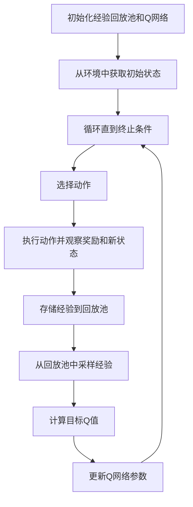

# deep Q-Learning原理与代码实例讲解

## 1.背景介绍

在人工智能和机器学习领域，强化学习（Reinforcement Learning, RL）是一种重要的学习范式。它通过与环境的交互来学习策略，以最大化累积奖励。深度Q学习（Deep Q-Learning, DQN）是强化学习中的一种重要算法，它结合了深度学习和Q学习的优势，能够在复杂的环境中进行有效的决策。

Q学习是一种无模型的强化学习算法，通过学习状态-动作值函数（Q函数）来指导智能体的行为。然而，传统的Q学习在处理高维状态空间时表现不佳。深度Q学习通过引入深度神经网络来逼近Q函数，从而解决了这一问题。

## 2.核心概念与联系

### 2.1 强化学习基本概念

- **状态（State, S）**：智能体在某一时刻所处的环境信息。
- **动作（Action, A）**：智能体在某一状态下可以执行的操作。
- **奖励（Reward, R）**：智能体执行某一动作后从环境中获得的反馈。
- **策略（Policy, π）**：智能体在各个状态下选择动作的规则。
- **值函数（Value Function, V）**：在某一状态下，智能体在未来能够获得的期望奖励。
- **Q函数（Q-Function, Q）**：在某一状态下执行某一动作后，智能体在未来能够获得的期望奖励。

### 2.2 Q学习与深度Q学习

- **Q学习**：通过更新Q值来学习最优策略，更新公式为：
  $$
  Q(s, a) \leftarrow Q(s, a) + \alpha [r + \gamma \max_{a'} Q(s', a') - Q(s, a)]
  $$
  其中，$\alpha$ 是学习率，$\gamma$ 是折扣因子，$r$ 是即时奖励，$s'$ 是执行动作$a$后到达的新状态。

- **深度Q学习**：使用深度神经网络来逼近Q函数，解决高维状态空间的问题。其核心思想是用神经网络参数$\theta$来表示Q函数，即$Q(s, a; \theta)$。

## 3.核心算法原理具体操作步骤

### 3.1 深度Q学习算法流程



### 3.2 具体操作步骤

1. **初始化**：初始化经验回放池（Replay Buffer）和Q网络参数$\theta$。
2. **获取初始状态**：从环境中获取初始状态$s$。
3. **循环直到终止条件**：
   - **选择动作**：根据$\epsilon$-贪心策略选择动作$a$。
   - **执行动作**：在环境中执行动作$a$，观察奖励$r$和新状态$s'$。
   - **存储经验**：将经验$(s, a, r, s')$存储到回放池中。
   - **采样经验**：从回放池中随机采样一批经验。
   - **计算目标Q值**：使用目标网络计算目标Q值$y$：
     $$
     y = r + \gamma \max_{a'} Q(s', a'; \theta^-)
     $$
   - **更新Q网络参数**：通过最小化损失函数来更新Q网络参数$\theta$：
     $$
     L(\theta) = \mathbb{E}[(y - Q(s, a; \theta))^2]
     $$

## 4.数学模型和公式详细讲解举例说明

### 4.1 Q学习更新公式

Q学习的更新公式为：
$$
Q(s, a) \leftarrow Q(s, a) + \alpha [r + \gamma \max_{a'} Q(s', a') - Q(s, a)]
$$
其中：
- $Q(s, a)$ 是当前状态-动作对的Q值。
- $\alpha$ 是学习率，控制更新步长。
- $r$ 是即时奖励。
- $\gamma$ 是折扣因子，衡量未来奖励的重要性。
- $\max_{a'} Q(s', a')$ 是在新状态$s'$下的最大Q值。

### 4.2 深度Q学习目标Q值计算

在深度Q学习中，目标Q值$y$的计算公式为：
$$
y = r + \gamma \max_{a'} Q(s', a'; \theta^-)
$$
其中：
- $\theta^-$ 是目标网络的参数，定期从Q网络参数$\theta$复制而来。

### 4.3 损失函数

深度Q学习通过最小化以下损失函数来更新Q网络参数$\theta$：
$$
L(\theta) = \mathbb{E}[(y - Q(s, a; \theta))^2]
$$
其中：
- $y$ 是目标Q值。
- $Q(s, a; \theta)$ 是当前Q网络的预测Q值。

### 4.4 举例说明

假设在某一状态$s$下，智能体选择了动作$a$，获得即时奖励$r$，并到达新状态$s'$。在新状态$s'$下，最大Q值为$Q(s', a'; \theta^-) = 10$。设定$\alpha = 0.1$，$\gamma = 0.9$，当前Q值$Q(s, a) = 5$。

目标Q值$y$的计算为：
$$
y = r + \gamma \max_{a'} Q(s', a'; \theta^-) = r + 0.9 \times 10
$$

假设$r = 2$，则：
$$
y = 2 + 0.9 \times 10 = 11
$$

更新后的Q值为：
$$
Q(s, a) \leftarrow 5 + 0.1 \times (11 - 5) = 5 + 0.6 = 5.6
$$

## 5.项目实践：代码实例和详细解释说明

### 5.1 环境准备

首先，我们需要安装必要的库，如TensorFlow或PyTorch，以及OpenAI Gym。

```bash
pip install tensorflow gym
```

### 5.2 深度Q学习代码实现

以下是一个使用TensorFlow实现的深度Q学习代码示例：

```python
import gym
import numpy as np
import tensorflow as tf
from collections import deque
import random

# 超参数
learning_rate = 0.001
gamma = 0.99
epsilon = 1.0
epsilon_decay = 0.995
epsilon_min = 0.01
batch_size = 64
memory_size = 100000

# 创建环境
env = gym.make('CartPole-v1')
state_size = env.observation_space.shape[0]
action_size = env.action_space.n

# 构建Q网络
model = tf.keras.models.Sequential([
    tf.keras.layers.Dense(24, input_dim=state_size, activation='relu'),
    tf.keras.layers.Dense(24, activation='relu'),
    tf.keras.layers.Dense(action_size, activation='linear')
])
model.compile(loss='mse', optimizer=tf.keras.optimizers.Adam(learning_rate=learning_rate))

# 经验回放池
memory = deque(maxlen=memory_size)

# 训练函数
def train_model():
    if len(memory) < batch_size:
        return
    batch = random.sample(memory, batch_size)
    for state, action, reward, next_state, done in batch:
        target = reward
        if not done:
            target += gamma * np.amax(model.predict(next_state)[0])
        target_f = model.predict(state)
        target_f[0][action] = target
        model.fit(state, target_f, epochs=1, verbose=0)

# 主循环
for e in range(1000):
    state = env.reset()
    state = np.reshape(state, [1, state_size])
    for time in range(500):
        if np.random.rand() <= epsilon:
            action = random.randrange(action_size)
        else:
            action = np.argmax(model.predict(state)[0])
        next_state, reward, done, _ = env.step(action)
        reward = reward if not done else -10
        next_state = np.reshape(next_state, [1, state_size])
        memory.append((state, action, reward, next_state, done))
        state = next_state
        if done:
            print(f"episode: {e}/{1000}, score: {time}, e: {epsilon:.2}")
            break
        train_model()
    if epsilon > epsilon_min:
        epsilon *= epsilon_decay
```

### 5.3 代码解释

1. **超参数设置**：包括学习率、折扣因子、$\epsilon$-贪心策略的参数、批量大小和经验回放池大小。
2. **环境创建**：使用OpenAI Gym创建CartPole环境，并获取状态和动作的维度。
3. **Q网络构建**：使用TensorFlow构建一个简单的全连接神经网络。
4. **经验回放池**：使用deque数据结构来存储经验。
5. **训练函数**：从经验回放池中采样一批经验，计算目标Q值，并更新Q网络参数。
6. **主循环**：在每个回合中，智能体根据$\epsilon$-贪心策略选择动作，执行动作并存储经验，调用训练函数更新Q网络参数。

## 6.实际应用场景

### 6.1 游戏AI

深度Q学习在游戏AI中有广泛应用，如Atari游戏、围棋等。通过与环境的不断交互，智能体能够学习到复杂的策略，从而在游戏中表现出色。

### 6.2 机器人控制

在机器人控制领域，深度Q学习可以用于路径规划、运动控制等任务。通过与环境的交互，机器人能够自主学习到最优的控制策略。

### 6.3 自动驾驶

深度Q学习在自动驾驶中的应用也非常广泛。通过模拟环境中的驾驶训练，自动驾驶系统能够学习到复杂的驾驶策略，从而提高驾驶安全性和效率。

## 7.工具和资源推荐

### 7.1 开源库

- **TensorFlow**：一个广泛使用的深度学习框架，支持深度Q学习的实现。
- **PyTorch**：另一个流行的深度学习框架，具有灵活性和易用性。
- **OpenAI Gym**：一个用于开发和比较强化学习算法的工具包，提供了多种环境。

### 7.2 书籍和教程

- **《强化学习：原理与实践》**：一本详细介绍强化学习理论和实践的书籍。
- **《深度强化学习入门》**：一本适合初学者的深度强化学习入门书籍。
- **Coursera上的强化学习课程**：由知名大学和机构提供的在线课程，涵盖强化学习的基础和高级内容。

## 8.总结：未来发展趋势与挑战

### 8.1 未来发展趋势

- **多智能体强化学习**：研究多个智能体在同一环境中协作或竞争的学习方法。
- **元强化学习**：研究智能体在不同任务之间快速适应和迁移的能力。
- **强化学习与其他技术的结合**：如强化学习与自然语言处理、计算机视觉等技术的结合，拓展应用场景。

### 8.2 挑战

- **样本效率**：深度Q学习需要大量的样本进行训练，如何提高样本效率是一个重要挑战。
- **稳定性和收敛性**：深度Q学习在训练过程中可能会出现不稳定和不收敛的情况，需要进一步研究改进算法。
- **实际应用中的安全性**：在实际应用中，如何保证强化学习算法的安全性和可靠性是一个重要问题。

## 9.附录：常见问题与解答

### 9.1 深度Q学习与传统Q学习的区别是什么？

深度Q学习使用深度神经网络来逼近Q函数，解决了传统Q学习在高维状态空间中的表现不佳的问题。

### 9.2 如何选择合适的超参数？

超参数的选择需要根据具体问题进行调试。可以通过网格搜索、随机搜索等方法进行超参数优化。

### 9.3 经验回放池的作用是什么？

经验回放池用于存储智能体的经验，通过从回放池中随机采样经验进行训练，可以打破经验之间的相关性，提高训练效果。

### 9.4 如何处理深度Q学习中的过拟合问题？

可以通过增加训练数据、使用正则化技术、早停等方法来防止过拟合。

### 9.5 深度Q学习在实际应用中有哪些限制？

深度Q学习在实际应用中可能面临样本效率低、训练不稳定等问题，需要进一步研究改进算法。

---

作者：禅与计算机程序设计艺术 / Zen and the Art of Computer Programming