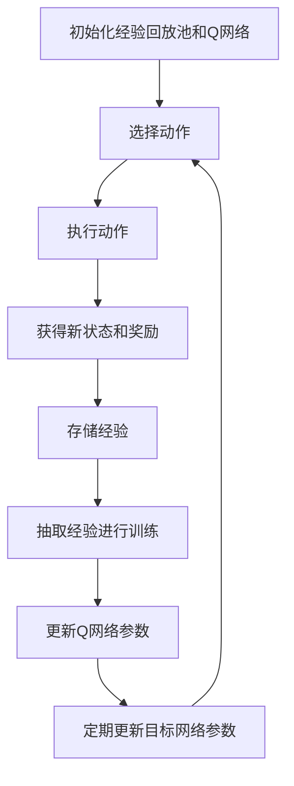

# 一切皆是映射：DQN优化技巧：奖励设计原则详解

## 1.背景介绍

深度强化学习（Deep Reinforcement Learning, DRL）近年来在多个领域取得了显著的成果，其中深度Q网络（Deep Q-Network, DQN）作为一种经典的DRL算法，广泛应用于游戏、机器人控制等领域。然而，DQN的性能在很大程度上依赖于奖励设计的质量。奖励设计不仅影响算法的收敛速度，还直接决定了最终策略的优劣。因此，深入理解和优化奖励设计原则对于提升DQN的性能至关重要。

## 2.核心概念与联系

### 2.1 强化学习基本概念

强化学习是一种通过与环境交互来学习最优策略的机器学习方法。其核心要素包括状态（State）、动作（Action）、奖励（Reward）和策略（Policy）。在每个时间步，智能体根据当前状态选择一个动作，执行该动作后环境会反馈一个新的状态和奖励。

### 2.2 深度Q网络（DQN）

DQN结合了Q学习和深度神经网络，通过神经网络近似Q值函数，从而解决了传统Q学习在高维状态空间中的局限性。DQN的核心思想是使用经验回放（Experience Replay）和目标网络（Target Network）来稳定训练过程。

### 2.3 奖励设计的重要性

奖励设计是强化学习中的关键环节。一个好的奖励设计可以引导智能体快速学习到最优策略，而不合理的奖励设计可能导致智能体陷入局部最优或无法收敛。奖励设计的目标是通过合理的奖励信号，使智能体在探索过程中逐步逼近最优策略。

## 3.核心算法原理具体操作步骤

### 3.1 DQN算法流程

DQN算法的基本流程如下：

1. 初始化经验回放池和Q网络。
2. 在每个时间步，智能体根据当前状态选择一个动作。
3. 执行动作，获得新的状态和奖励。
4. 将经验存储到回放池中。
5. 从回放池中随机抽取一批经验进行训练。
6. 更新Q网络参数。
7. 定期更新目标网络参数。



### 3.2 奖励设计的具体步骤

1. **明确目标**：确定智能体需要完成的任务和最终目标。
2. **分解任务**：将复杂任务分解为多个子任务，每个子任务设定相应的奖励。
3. **设计奖励函数**：根据任务需求设计奖励函数，确保奖励信号能够有效引导智能体。
4. **调试和优化**：通过实验不断调试和优化奖励函数，确保其能够稳定收敛。

## 4.数学模型和公式详细讲解举例说明

### 4.1 Q值函数

Q值函数 $Q(s, a)$ 表示在状态 $s$ 下选择动作 $a$ 所能获得的期望回报。DQN通过神经网络来近似Q值函数，其损失函数为：

$$
L(\theta) = \mathbb{E}_{(s, a, r, s') \sim D} \left[ \left( r + \gamma \max_{a'} Q(s', a'; \theta^-) - Q(s, a; \theta) \right)^2 \right]
$$

其中，$\theta$ 是Q网络的参数，$\theta^-$ 是目标网络的参数，$D$ 是经验回放池，$\gamma$ 是折扣因子。

### 4.2 奖励函数设计

奖励函数 $R(s, a)$ 的设计需要考虑以下几个方面：

1. **即时奖励**：在每个时间步给予智能体即时反馈。
2. **长期奖励**：通过折扣因子 $\gamma$ 考虑未来回报。
3. **平衡探索与利用**：通过奖励信号引导智能体在探索和利用之间找到平衡。

例如，在一个机器人导航任务中，奖励函数可以设计为：

$$
R(s, a) = \begin{cases} 
100 & \text{到达目标位置} \\
-1 & \text{碰撞障碍物} \\
-0.1 & \text{每移动一步}
\end{cases}
$$

## 5.项目实践：代码实例和详细解释说明

### 5.1 环境搭建

首先，我们需要搭建一个强化学习环境。这里以OpenAI Gym中的CartPole环境为例：

```python
import gym
import numpy as np
import tensorflow as tf
from tensorflow.keras import layers

env = gym.make('CartPole-v1')
```

### 5.2 Q网络构建

接下来，我们构建一个简单的Q网络：

```python
def build_q_network(input_shape, num_actions):
    model = tf.keras.Sequential([
        layers.Dense(24, activation='relu', input_shape=input_shape),
        layers.Dense(24, activation='relu'),
        layers.Dense(num_actions, activation='linear')
    ])
    return model

input_shape = (env.observation_space.shape[0],)
num_actions = env.action_space.n
q_network = build_q_network(input_shape, num_actions)
target_network = build_q_network(input_shape, num_actions)
target_network.set_weights(q_network.get_weights())
```

### 5.3 经验回放池

我们需要一个经验回放池来存储智能体的经验：

```python
class ReplayBuffer:
    def __init__(self, max_size):
        self.buffer = []
        self.max_size = max_size
        self.size = 0

    def add(self, experience):
        if self.size < self.max_size:
            self.buffer.append(experience)
        else:
            self.buffer[self.size % self.max_size] = experience
        self.size += 1

    def sample(self, batch_size):
        indices = np.random.choice(min(self.size, self.max_size), batch_size)
        return [self.buffer[i] for i in indices]

replay_buffer = ReplayBuffer(max_size=10000)
```

### 5.4 训练过程

最后，我们实现DQN的训练过程：

```python
def train_dqn(env, q_network, target_network, replay_buffer, num_episodes, batch_size, gamma, update_target_freq):
    optimizer = tf.keras.optimizers.Adam(learning_rate=0.001)
    loss_fn = tf.keras.losses.MeanSquaredError()

    for episode in range(num_episodes):
        state = env.reset()
        total_reward = 0

        while True:
            action = np.argmax(q_network.predict(state[np.newaxis]))
            next_state, reward, done, _ = env.step(action)
            replay_buffer.add((state, action, reward, next_state, done))
            total_reward += reward

            if done:
                break

            if replay_buffer.size >= batch_size:
                experiences = replay_buffer.sample(batch_size)
                states, actions, rewards, next_states, dones = zip(*experiences)

                target_q_values = target_network.predict(np.array(next_states))
                max_target_q_values = np.max(target_q_values, axis=1)
                targets = np.array(rewards) + gamma * max_target_q_values * (1 - np.array(dones))

                with tf.GradientTape() as tape:
                    q_values = q_network(np.array(states))
                    q_values = tf.reduce_sum(q_values * tf.one_hot(actions, num_actions), axis=1)
                    loss = loss_fn(targets, q_values)

                grads = tape.gradient(loss, q_network.trainable_variables)
                optimizer.apply_gradients(zip(grads, q_network.trainable_variables))

            state = next_state

        if episode % update_target_freq == 0:
            target_network.set_weights(q_network.get_weights())

        print(f'Episode {episode}, Total Reward: {total_reward}')

train_dqn(env, q_network, target_network, replay_buffer, num_episodes=500, batch_size=64, gamma=0.99, update_target_freq=10)
```

## 6.实际应用场景

### 6.1 游戏AI

DQN在游戏AI中有广泛应用，例如在Atari游戏中，DQN通过学习能够在多个游戏中达到甚至超越人类水平。

### 6.2 机器人控制

在机器人控制领域，DQN可以用于路径规划、避障等任务，通过合理的奖励设计，机器人能够自主学习复杂的控制策略。

### 6.3 自动驾驶

在自动驾驶中，DQN可以用于决策和控制模块，通过学习驾驶策略，提升自动驾驶系统的安全性和效率。

## 7.工具和资源推荐

### 7.1 开源框架

- **TensorFlow**：一个广泛使用的深度学习框架，支持DQN的实现。
- **PyTorch**：另一个流行的深度学习框架，具有灵活的动态计算图特性。
- **OpenAI Gym**：一个用于开发和比较强化学习算法的工具包，提供了多种环境。

### 7.2 参考书籍

- **《深度强化学习》**：详细介绍了深度强化学习的理论和实践。
- **《强化学习：原理与实践》**：一本全面的强化学习教材，涵盖了从基础到高级的内容。

### 7.3 在线课程

- **Coursera**：提供了多门关于深度学习和强化学习的课程。
- **Udacity**：提供了强化学习纳米学位课程，涵盖了DQN等算法的详细讲解。

## 8.总结：未来发展趋势与挑战

### 8.1 未来发展趋势

随着计算能力的提升和算法的不断改进，DQN及其变种在更多复杂任务中的应用前景广阔。未来，DQN可能在以下几个方面取得突破：

1. **多智能体系统**：在多智能体环境中，DQN可以用于协作和竞争策略的学习。
2. **自适应奖励设计**：通过自动化工具和算法，动态调整奖励函数，提高学习效率。
3. **跨领域应用**：DQN在金融、医疗等领域的应用潜力巨大，通过学习复杂的决策策略，提升系统性能。

### 8.2 挑战

尽管DQN取得了显著成果，但仍面临一些挑战：

1. **样本效率**：DQN需要大量的样本进行训练，如何提高样本效率是一个重要问题。
2. **稳定性**：DQN在训练过程中可能出现不稳定现象，需要进一步研究稳定训练的方法。
3. **奖励稀疏性**：在一些任务中，奖励信号稀疏，如何设计有效的奖励函数是一个难点。

## 9.附录：常见问题与解答

### 9.1 如何选择合适的奖励函数？

选择合适的奖励函数需要结合具体任务和目标，确保奖励信号能够有效引导智能体学习到最优策略。可以通过实验不断调试和优化奖励函数。

### 9.2 如何处理奖励稀疏问题？

奖励稀疏问题可以通过以下几种方法解决：

1. **奖励塑造**：设计中间奖励，提供更多的反馈信号。
2. **层次化强化学习**：将复杂任务分解为多个子任务，每个子任务设定相应的奖励。
3. **逆强化学习**：通过学习专家示范，推断出合理的奖励函数。

### 9.3 如何提高DQN的样本效率？

提高DQN的样本效率可以通过以下几种方法：

1. **优先经验回放**：优先选择重要的经验进行训练。
2. **双重DQN**：使用双重Q学习方法，减少过估计偏差。
3. **分布式DQN**：通过分布式训练，提升样本利用率。

作者：禅与计算机程序设计艺术 / Zen and the Art of Computer Programming