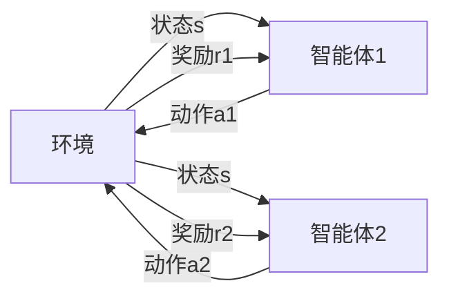

# 一切皆是映射：多智能体DQN：原理、挑战与协同机制

## 1. 背景介绍

在人工智能的研究领域，强化学习已经成为一种重要的自主学习方法。它通过与环境的交互来学习最优策略，以实现长期目标。深度Q网络（Deep Q-Network, DQN）作为强化学习中的一个里程碑，将深度学习与Q学习相结合，大幅提升了单智能体在复杂环境中的学习能力。然而，现实世界中的许多问题往往涉及多个智能体的交互，如自动驾驶、多机器人协作等，这就需要我们将研究的视角扩展到多智能体系统。多智能体强化学习（Multi-Agent Reinforcement Learning, MARL）中的一个关键挑战是如何设计能够在共享环境中协同工作的智能体。

## 2. 核心概念与联系

### 2.1 强化学习与DQN

强化学习是一种学习方法，智能体通过与环境的交互来学习策略，以最大化累积奖励。DQN通过引入深度神经网络来近似Q函数，即在给定状态下采取某个动作的期望回报。

### 2.2 多智能体系统

多智能体系统由多个智能体组成，它们在同一个环境中相互作用。每个智能体都有自己的目标，可能是合作、竞争或两者的混合。

### 2.3 协同机制

在多智能体系统中，协同机制是指智能体之间的合作策略，它们需要通过某种方式来共享信息、分配任务并协调行动。

## 3. 核心算法原理具体操作步骤

### 3.1 多智能体DQN的基本框架

多智能体DQN在传统DQN的基础上进行了扩展，允许多个智能体共享环境并同时学习。



### 3.2 学习过程

1. 初始化：每个智能体初始化自己的Q网络。
2. 观察：智能体观察当前环境状态。
3. 行动：每个智能体根据自己的Q网络选择动作。
4. 更新：根据环境反馈的奖励和新状态，更新Q网络。

## 4. 数学模型和公式详细讲解举例说明

### 4.1 Q学习的更新公式

$$ Q(s, a) \leftarrow Q(s, a) + \alpha [r + \gamma \max_{a'} Q(s', a') - Q(s, a)] $$

其中，$s$和$s'$分别代表当前状态和下一个状态，$a$是当前动作，$r$是奖励，$\alpha$是学习率，$\gamma$是折扣因子。

### 4.2 多智能体DQN的联合Q值

在多智能体DQN中，我们需要考虑所有智能体的联合动作空间，联合Q值可以表示为：

$$ Q_{total}(s, \mathbf{a}) = Q_1(s, a_1) + Q_2(s, a_2) + ... + Q_n(s, a_n) $$

其中，$\mathbf{a} = (a_1, a_2, ..., a_n)$是所有智能体的动作组合。

## 5. 项目实践：代码实例和详细解释说明

### 5.1 环境搭建

首先，我们需要搭建一个多智能体的环境，例如使用OpenAI的Gym库。

```python
import gym
env = gym.make('MultiAgentEnv')
```

### 5.2 智能体实现

每个智能体都需要有自己的DQN网络。以下是一个简化的智能体DQN实现：

```python
class AgentDQN:
    def __init__(self, state_size, action_size):
        self.state_size = state_size
        self.action_size = action_size
        self.model = self._build_model()
    
    def _build_model(self):
        # 构建深度神经网络
        pass
    
    def act(self, state):
        # 根据当前状态选择动作
        pass
    
    def learn(self, state, action, reward, next_state):
        # 更新Q网络
        pass
```

### 5.3 协同学习过程

在多智能体环境中，智能体需要通过观察共享的环境状态来协同学习。

```python
agents = [AgentDQN(env.state_size, env.action_size) for _ in range(num_agents)]
for episode in range(total_episodes):
    state = env.reset()
    while True:
        actions = [agent.act(state) for agent in agents]
        next_state, rewards, done, _ = env.step(actions)
        for i, agent in enumerate(agents):
            agent.learn(state, actions[i], rewards[i], next_state)
        state = next_state
        if done:
            break
```

## 6. 实际应用场景

多智能体DQN可以应用于多种场景，包括：

- 多机器人协作：例如，仓库中的机器人需要协同完成货物的搬运和排序任务。
- 自动驾驶车队：一组自动驾驶汽车需要协调行驶以避免交通拥堵和事故。
- 网络安全：多个防御智能体需要协同工作以对抗网络攻击。

## 7. 工具和资源推荐

- OpenAI Gym：一个用于开发和比较强化学习算法的工具包。
- TensorFlow或PyTorch：用于构建和训练深度神经网络的框架。
- Ray和RLlib：用于多智能体强化学习的可扩展框架。

## 8. 总结：未来发展趋势与挑战

多智能体DQN作为MARL的一个重要分支，其未来的发展趋势包括算法的进一步优化、更高效的协同机制设计以及在更复杂环境中的应用。面临的挑战包括非平稳环境下的学习稳定性、智能体间的通信效率以及策略的可解释性。

## 9. 附录：常见问题与解答

Q1: 多智能体DQN如何处理环境的非平稳性？
A1: 通过设计更复杂的学习算法，例如使用多智能体演员-评论家方法，可以在一定程度上缓解这一问题。

Q2: 如何评估多智能体系统的性能？
A2: 可以通过环境提供的总奖励、任务完成率或特定的性能指标来评估。

Q3: 多智能体DQN是否适用于所有类型的多智能体问题？
A3: 不是，它更适合于那些可以通过共享奖励和状态信息来协同工作的问题。

作者：禅与计算机程序设计艺术 / Zen and the Art of Computer Programming