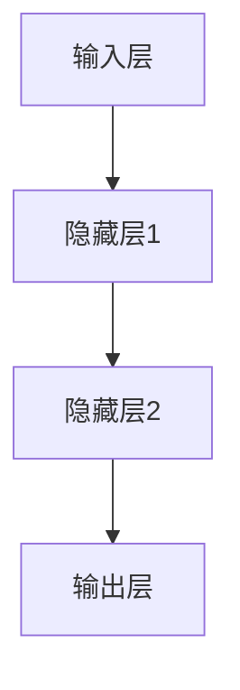

# 一切皆是映射：深度学习与人类语言理解

## 1.背景介绍

在过去的几十年里，深度学习已经成为人工智能领域的一个重要分支，并在多个领域取得了显著的成果。特别是在自然语言处理（NLP）方面，深度学习的应用使得机器能够更好地理解和生成人类语言。本文将探讨深度学习与人类语言理解之间的关系，揭示其核心概念、算法原理、数学模型、实际应用以及未来的发展趋势。

## 2.核心概念与联系

### 2.1 映射的概念

在数学和计算机科学中，映射（Mapping）是指将一个集合中的元素关联到另一个集合中的元素的过程。在深度学习中，映射通常指的是将输入数据转换为输出结果的过程。

### 2.2 深度学习中的映射

深度学习模型，特别是神经网络，通过多层非线性变换实现从输入到输出的映射。这些变换可以看作是逐层的映射，每一层都将输入数据映射到一个新的表示空间。

### 2.3 人类语言理解中的映射

人类语言理解可以看作是将语言符号映射到意义的过程。这个过程涉及多个层次的映射，包括词汇层面的映射、句法层面的映射以及语义层面的映射。

### 2.4 深度学习与人类语言理解的联系

深度学习模型通过模拟人类大脑的神经元连接，能够实现复杂的映射过程，从而在一定程度上模拟人类的语言理解能力。通过训练，深度学习模型可以学习到语言中的模式和规律，从而实现对语言的理解和生成。

## 3.核心算法原理具体操作步骤

### 3.1 神经网络的基本结构

神经网络是深度学习的基础结构，通常由输入层、隐藏层和输出层组成。每一层由若干个神经元（节点）组成，神经元之间通过权重连接。



### 3.2 前向传播

前向传播是指将输入数据通过神经网络逐层传递，最终得到输出结果的过程。每一层的输出是上一层输出的非线性变换。

### 3.3 反向传播

反向传播是指通过计算输出结果与真实值之间的误差，逐层更新神经网络的权重，以最小化误差的过程。反向传播算法使用梯度下降法来更新权重。

### 3.4 训练过程

训练过程包括前向传播和反向传播的反复迭代。通过大量的训练数据，神经网络逐渐学习到输入数据与输出结果之间的映射关系。

### 3.5 具体操作步骤

1. 初始化神经网络的权重和偏置。
2. 将输入数据传递给输入层，进行前向传播，计算每一层的输出。
3. 计算输出层的误差。
4. 进行反向传播，计算每一层的梯度。
5. 更新权重和偏置。
6. 重复步骤2-5，直到误差收敛或达到预定的训练轮数。

## 4.数学模型和公式详细讲解举例说明

### 4.1 神经网络的数学模型

神经网络的每一层可以表示为一个数学函数。假设第 $l$ 层的输入为 $a^{(l-1)}$，权重矩阵为 $W^{(l)}$，偏置向量为 $b^{(l)}$，激活函数为 $f$，则第 $l$ 层的输出 $a^{(l)}$ 可以表示为：

$$
z^{(l)} = W^{(l)} a^{(l-1)} + b^{(l)}
$$

$$
a^{(l)} = f(z^{(l)})
$$

### 4.2 前向传播的数学表示

前向传播的过程可以通过上述公式逐层计算，直到得到输出层的结果。假设输出层的激活函数为 $g$，则输出层的结果 $y$ 可以表示为：

$$
y = g(W^{(L)} a^{(L-1)} + b^{(L)})
$$

### 4.3 反向传播的数学表示

反向传播的过程通过计算损失函数 $L$ 对每一层权重和偏置的梯度来更新参数。假设损失函数为 $L(y, \hat{y})$，其中 $\hat{y}$ 为真实值，则第 $l$ 层的梯度可以表示为：

$$
\frac{\partial L}{\partial W^{(l)}} = \delta^{(l)} a^{(l-1)^T}
$$

$$
\frac{\partial L}{\partial b^{(l)}} = \delta^{(l)}
$$

其中，$\delta^{(l)}$ 为第 $l$ 层的误差项，可以通过链式法则逐层计算。

### 4.4 举例说明

假设我们有一个简单的两层神经网络，用于分类任务。输入层有两个节点，隐藏层有三个节点，输出层有一个节点。激活函数为ReLU，损失函数为均方误差。

1. 初始化权重和偏置：
   $$
   W^{(1)} = \begin{bmatrix}
   w_{11} & w_{12} \\
   w_{21} & w_{22} \\
   w_{31} & w_{32}
   \end{bmatrix}, \quad b^{(1)} = \begin{bmatrix}
   b_1 \\
   b_2 \\
   b_3
   \end{bmatrix}
   $$

   $$
   W^{(2)} = \begin{bmatrix}
   w_{41} & w_{42} & w_{43}
   \end{bmatrix}, \quad b^{(2)} = b_4
   $$

2. 前向传播：
   $$
   z^{(1)} = W^{(1)} a^{(0)} + b^{(1)}
   $$

   $$
   a^{(1)} = \text{ReLU}(z^{(1)})
   $$

   $$
   z^{(2)} = W^{(2)} a^{(1)} + b^{(2)}
   $$

   $$
   y = \text{sigmoid}(z^{(2)})
   $$

3. 计算损失：
   $$
   L = \frac{1}{2} (y - \hat{y})^2
   $$

4. 反向传播：
   $$
   \delta^{(2)} = (y - \hat{y}) \cdot \text{sigmoid}'(z^{(2)})
   $$

   $$
   \delta^{(1)} = (W^{(2)^T} \delta^{(2)}) \cdot \text{ReLU}'(z^{(1)})
   $$

   $$
   \frac{\partial L}{\partial W^{(2)}} = \delta^{(2)} a^{(1)^T}
   $$

   $$
   \frac{\partial L}{\partial b^{(2)}} = \delta^{(2)}
   $$

   $$
   \frac{\partial L}{\partial W^{(1)}} = \delta^{(1)} a^{(0)^T}
   $$

   $$
   \frac{\partial L}{\partial b^{(1)}} = \delta^{(1)}
   $$

5. 更新权重和偏置：
   $$
   W^{(l)} = W^{(l)} - \eta \frac{\partial L}{\partial W^{(l)}}
   $$

   $$
   b^{(l)} = b^{(l)} - \eta \frac{\partial L}{\partial b^{(l)}}
   $$

## 5.项目实践：代码实例和详细解释说明

### 5.1 项目概述

我们将实现一个简单的文本分类项目，使用深度学习模型对电影评论进行情感分析。我们将使用Python和TensorFlow框架。

### 5.2 数据准备

我们将使用IMDB电影评论数据集，该数据集包含50000条电影评论，其中25000条用于训练，25000条用于测试。

```python
import tensorflow as tf
from tensorflow.keras.datasets import imdb
from tensorflow.keras.preprocessing.sequence import pad_sequences

# 加载数据
max_features = 10000
maxlen = 100

(x_train, y_train), (x_test, y_test) = imdb.load_data(num_words=max_features)

# 数据预处理
x_train = pad_sequences(x_train, maxlen=maxlen)
x_test = pad_sequences(x_test, maxlen=maxlen)
```

### 5.3 模型构建

我们将构建一个简单的卷积神经网络（CNN）模型，用于文本分类。

```python
from tensorflow.keras.models import Sequential
from tensorflow.keras.layers import Embedding, Conv1D, GlobalMaxPooling1D, Dense

model = Sequential()
model.add(Embedding(max_features, 128, input_length=maxlen))
model.add(Conv1D(128, 7, activation='relu'))
model.add(GlobalMaxPooling1D())
model.add(Dense(1, activation='sigmoid'))

model.compile(optimizer='adam', loss='binary_crossentropy', metrics=['accuracy'])
```

### 5.4 模型训练

我们将使用训练数据对模型进行训练。

```python
history = model.fit(x_train, y_train, epochs=10, batch_size=32, validation_split=0.2)
```

### 5.5 模型评估

我们将使用测试数据对模型进行评估。

```python
test_loss, test_acc = model.evaluate(x_test, y_test)
print(f'Test Accuracy: {test_acc}')
```

### 5.6 代码解释

1. **数据准备**：我们加载IMDB数据集，并将评论数据转换为固定长度的序列。
2. **模型构建**：我们构建了一个包含嵌入层、卷积层、全局最大池化层和全连接层的CNN模型。
3. **模型训练**：我们使用训练数据对模型进行训练，并在训练过程中进行验证。
4. **模型评估**：我们使用测试数据对模型进行评估，并输出测试准确率。

## 6.实际应用场景

### 6.1 机器翻译

深度学习在机器翻译领域取得了显著的成果。通过训练神经网络模型，机器可以将一种语言的文本准确地翻译成另一种语言。

### 6.2 语音识别

深度学习模型可以将语音信号映射为文本，从而实现语音识别。常见的应用包括语音助手、语音输入法等。

### 6.3 情感分析

通过训练深度学习模型，可以对文本进行情感分析，判断文本的情感倾向。常见的应用包括社交媒体情感分析、客户反馈分析等。

### 6.4 自动摘要

深度学习模型可以自动生成文本摘要，从而帮助用户快速获取关键信息。常见的应用包括新闻摘要、文档摘要等。

### 6.5 对话系统

深度学习在对话系统中的应用使得机器能够与人类进行自然的对话。常见的应用包括智能客服、聊天机器人等。

## 7.工具和资源推荐

### 7.1 编程语言和框架

- **Python**：深度学习领域最常用的编程语言。
- **TensorFlow**：谷歌开发的深度学习框架，支持多种平台。
- **PyTorch**：Facebook开发的深度学习框架，易于使用和调试。

### 7.2 数据集

- **IMDB**：电影评论数据集，用于情感分析。
- **MNIST**：手写数字数据集，用于图像分类。
- **COCO**：图像数据集，用于图像识别和生成。

### 7.3 学习资源

- **Coursera**：提供多种深度学习课程。
- **Udacity**：提供深度学习纳米学位课程。
- **Kaggle**：数据科学竞赛平台，提供丰富的数据集和教程。

## 8.总结：未来发展趋势与挑战

### 8.1 未来发展趋势

1. **多模态学习**：结合多种数据类型（如文本、图像、语音）进行学习和推理。
2. **自监督学习**：通过自监督学习方法，减少对标注数据的依赖。
3. **可解释性**：提高深度学习模型的可解释性，使其决策过程更加透明。

### 8.2 挑战

1. **数据隐私**：在使用大规模数据进行训练时，如何保护用户隐私是一个重要挑战。
2. **计算资源**：深度学习模型的训练需要大量的计算资源，如何提高计算效率是一个重要问题。
3. **模型泛化**：如何提高模型在不同数据集上的泛化能力，避免过拟合。

## 9.附录：常见问题与解答

### 9.1 什么是深度学习？

深度学习是机器学习的一个分支，通过多层神经网络模型对数据进行学习和推理。

### 9.2 什么是前向传播和反向传播？

前向传播是指将输入数据通过神经网络逐层传递，最终得到输出结果的过程。反向传播是指通过计算输出结果与真实值之间的误差，逐层更新神经网络的权重，以最小化误差的过程。

### 9.3 如何选择合适的激活函数？

常见的激活函数包括ReLU、sigmoid和tanh。ReLU通常用于隐藏层，sigmoid和tanh通常用于输出层。选择激活函数时需要考虑具体的任务和数据特点。

### 9.4 如何防止过拟合？

防止过拟合的方法包括使用正则化、数据增强、早停法和交叉验证等。

### 9.5 深度学习模型的训练需要多长时间？

深度学习模型的训练时间取决于模型的复杂度、数据集的大小和计算资源的配置。通常需要数小时到数天不等。

---

作者：禅与计算机程序设计艺术 / Zen and the Art of Computer Programming