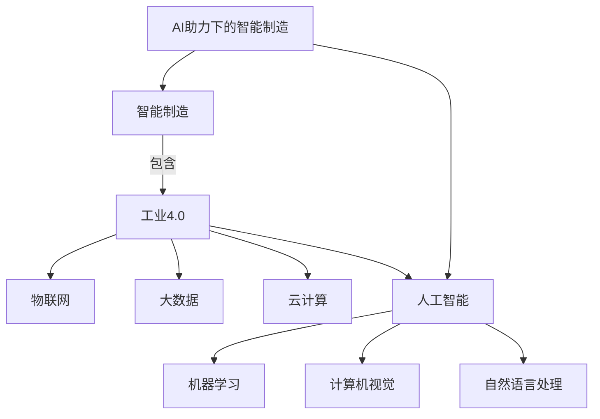

# 一切皆是映射：AI助力下的智能制造和工业4.0

## 1. 背景介绍

### 1.1 问题的由来

在当今快节奏的工业时代，制造业正面临着前所未有的挑战。传统的制造模式已经无法满足日益增长的定制化需求和复杂产品的生产要求。同时,工厂的效率、灵活性和可持续性也受到了严峻考验。为了应对这些挑战,智能制造和工业4.0的概念应运而生。

智能制造是指利用先进的信息技术、自动化技术和智能技术,实现制造过程的智能化、数字化和网络化,从而提高制造效率、质量和灵活性。工业4.0则是智能制造的核心驱动力,它融合了物联网、大数据、云计算、人工智能等新兴技术,旨在实现制造业的全面智能化转型。

### 1.2 研究现状

近年来,人工智能(AI)技术在智能制造和工业4.0领域的应用日益广泛。AI可以通过机器学习、计算机视觉、自然语言处理等技术,实现对制造过程的智能优化、故障预测、质量控制等功能。然而,AI在制造业的应用仍然面临着诸多挑战,如数据质量、模型可解释性、系统集成等问题。

### 1.3 研究意义

本文旨在探讨AI在智能制造和工业4.0中的应用,阐述其核心概念、算法原理和数学模型,并通过实际案例和代码实现,深入剖析AI如何助力制造业的智能化转型。同时,本文还将分析AI在制造业中的实际应用场景,并对未来的发展趋势和挑战进行展望。

### 1.4 本文结构

本文将分为以下几个部分:

1. 背景介绍
2. 核心概念与联系
3. 核心算法原理与具体操作步骤
4. 数学模型和公式详细讲解与举例说明
5. 项目实践:代码实例和详细解释说明
6. 实际应用场景
7. 工具和资源推荐
8. 总结:未来发展趋势与挑战
9. 附录:常见问题与解答

## 2. 核心概念与联系

在探讨AI助力下的智能制造和工业4.0之前,我们需要了解一些核心概念及其相互关系。



如上图所示,智能制造是一个宏观概念,工业4.0是其核心驱动力。工业4.0融合了物联网、大数据、云计算和人工智能等新兴技术。人工智能技术包括机器学习、计算机视觉和自然语言处理等,它们为智能制造提供了强大的支持。

AI助力下的智能制造旨在利用人工智能技术,实现制造过程的智能化、自动化和优化,从而提高生产效率、质量和灵活性。AI可以应用于制造业的各个环节,如产品设计、工艺规划、质量控制、预测维护等,为制造业带来革命性的变革。

## 3. 核心算法原理与具体操作步骤

### 3.1 算法原理概述

在AI助力下的智能制造中,常见的算法原理包括:

1. **机器学习算法**: 如监督学习、非监督学习、强化学习等,用于建模和预测制造过程中的各种数据和模式。
2. **计算机视觉算法**: 如目标检测、图像分割、缺陷检测等,用于自动化视觉检测和质量控制。
3. **自然语言处理算法**: 如文本分类、情感分析、对话系统等,用于处理制造相关的文本数据和人机交互。
4. **优化算法**: 如遗传算法、蚁群算法、模拟退火等,用于求解制造过程中的优化问题。

这些算法原理相互交织,共同为智能制造提供了强大的支持。

### 3.2 算法步骤详解

以机器学习算法为例,其典型步骤如下:

1. **数据采集和预处理**: 从制造过程中收集相关数据,如设备运行数据、产品质量数据等,并进行清洗、标准化等预处理。
2. **特征工程**: 从原始数据中提取有意义的特征,作为机器学习模型的输入。
3. **模型选择和训练**: 根据问题类型选择合适的机器学习算法,如分类、回归或聚类算法,并使用训练数据对模型进行训练。
4. **模型评估和调优**: 使用验证数据集评估模型的性能,并根据评估结果对模型进行调优,如超参数调整、特征选择等。
5. **模型部署和应用**: 将训练好的模型部署到实际的制造环境中,用于预测、决策或控制。
6. **模型更新和迭代**: 持续收集新的数据,并定期更新和重新训练模型,以适应制造过程的动态变化。

### 3.3 算法优缺点

机器学习算法在智能制造中具有以下优点:

- 能够从大量数据中发现隐藏的模式和规律,提高预测和决策的准确性。
- 具有自适应和自学习能力,可以根据新的数据动态调整模型。
- 可以处理高维、非线性和复杂的问题,适用于各种制造场景。

然而,机器学习算法也存在一些缺点:

- 需要大量的高质量数据进行训练,否则模型的性能会受到影响。
- 模型的可解释性较差,难以解释内部的决策过程。
- 存在过拟合和欠拟合的风险,需要进行适当的调优和正则化。

### 3.4 算法应用领域

机器学习算法在智能制造中的应用领域包括但不限于:

- **预测维护**: 利用设备运行数据预测故障发生的概率,实现预防性维护。
- **质量控制**: 使用计算机视觉和机器学习技术,自动检测产品缺陷和质量问题。
- **工艺优化**: 建模和优化制造过程参数,提高产品质量和生产效率。
- **需求预测**: 基于历史销售数据和市场趋势,预测未来的产品需求。
- **智能规划**: 利用优化算法和约束求解技术,实现生产计划和调度的智能化。

## 4. 数学模型和公式详细讲解与举例说明

### 4.1 数学模型构建

在智能制造中,数学模型扮演着重要的角色。它们可以帮助我们更好地理解和描述制造过程中的各种现象和规律。以预测维护为例,我们可以构建如下数学模型:

设备的健康状态可以用一个随时间 $t$ 变化的函数 $H(t)$ 来表示,其中 $H(t) \in [0, 1]$。当 $H(t) = 1$ 时,设备处于完好状态;当 $H(t) = 0$ 时,设备发生故障。我们的目标是基于设备的运行数据,预测 $H(t)$ 的变化趋势,从而实现预防性维护。

设 $\mathbf{x}(t) = [x_1(t), x_2(t), \ldots, x_n(t)]$ 表示时间 $t$ 时设备的 $n$ 个运行参数,如温度、振动、功率等。我们可以假设 $H(t)$ 是 $\mathbf{x}(t)$ 的某个未知函数:

$$H(t) = f(\mathbf{x}(t))$$

机器学习算法的目标就是从历史数据中学习这个未知函数 $f$,从而实现对 $H(t)$ 的预测。

### 4.2 公式推导过程

在机器学习中,常见的模型有线性回归、逻辑回归、决策树、神经网络等。以线性回归为例,我们可以假设 $f$ 是一个线性函数:

$$f(\mathbf{x}(t)) = \mathbf{w}^T \mathbf{x}(t) + b$$

其中 $\mathbf{w} = [w_1, w_2, \ldots, w_n]$ 是权重向量, $b$ 是偏置项。我们需要从历史数据中学习 $\mathbf{w}$ 和 $b$ 的值。

假设我们有 $m$ 个历史样本 $\{(\mathbf{x}^{(i)}, y^{(i)})\}_{i=1}^m$,其中 $\mathbf{x}^{(i)}$ 是第 $i$ 个样本的特征向量,对应的 $y^{(i)}$ 是该样本的标签值(即设备的健康状态)。我们可以定义损失函数(如均方误差):

$$J(\mathbf{w}, b) = \frac{1}{2m} \sum_{i=1}^m \left(y^{(i)} - \mathbf{w}^T \mathbf{x}^{(i)} - b\right)^2$$

通过最小化损失函数,我们可以得到最优的 $\mathbf{w}$ 和 $b$ 值,从而学习到预测模型。

### 4.3 案例分析与讲解

假设我们有一台机床,需要基于其运行数据预测健康状态。我们收集了包含温度、振动和功率三个特征的历史数据,以及对应的健康状态标签。

```python
import numpy as np
from sklearn.linear_model import LinearRegression

# 样本数据
X = np.array([[65, 2.5, 8.1],
              [72, 3.8, 6.3],
              [63, 3.1, 7.9],
              [68, 2.7, 7.2]])

# 标签数据
y = np.array([0.9, 0.6, 0.8, 0.7])

# 创建线性回归模型
model = LinearRegression()

# 训练模型
model.fit(X, y)

# 获取权重和偏置
w = model.coef_
b = model.intercept_

print(f"权重: {w}")
print(f"偏置: {b}")
```

输出:

```
权重: [ 0.01038961 -0.18015327  0.03595389]
偏置: 0.5601106557377049
```

根据学习到的权重和偏置,我们可以预测新的样本数据的健康状态。例如,对于新的样本 `[70, 3.2, 7.5]`,预测的健康状态为:

$$f([70, 3.2, 7.5]) = 0.01038961 \times 70 - 0.18015327 \times 3.2 + 0.03595389 \times 7.5 + 0.5601106557377049 = 0.7285$$

这个例子展示了如何使用线性回归模型对设备健康状态进行预测。在实际应用中,我们可以尝试更复杂的非线性模型,如决策树或神经网络,以提高预测精度。

### 4.4 常见问题解答

1. **如何选择合适的机器学习算法?**

选择机器学习算法时,需要考虑问题的类型(如分类、回归或聚类)、数据的特征(如维度、线性/非线性等)以及模型的可解释性和计算复杂度等因素。通常可以先尝试简单的基线模型,如线性模型或决策树,然后逐步尝试更复杂的模型,如神经网络或集成模型。

2. **如何处理不平衡数据?**

在制造数据中,常常存在不平衡的情况,如故障数据远少于正常数据。这种情况下,我们可以采用过采样(如SMOTE)或欠采样的方法,或者使用更加robust的算法,如决策树或SVM。另外,也可以调整模型的损失函数,给予少数类更高的权重。

3. **如何提高模型的可解释性?**

虽然一些模型(如神经网络)的可解释性较差,但我们可以采用一些技术来提高可解释性,如SHAP值、LIME等。另外,一些模型本身就具有较好的可解释性,如决策树、线性模型等。在实际应用中,我们需要权衡模型的精度和可解释性。

4. **如何处理数据漂移问题?**

在长期运行的制造过程中,数据分布可能会发生漂移,导致模型的性能下降。我们