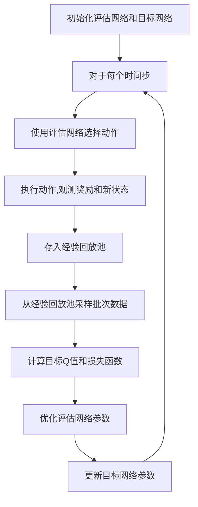

# 一切皆是映射：DQN的故障诊断与调试技巧：如何快速定位问题

## 1. 背景介绍

### 1.1 问题的由来

在深度强化学习领域中,深度 Q 网络(Deep Q-Network, DQN)是一种具有里程碑意义的算法,它将深度神经网络与 Q-Learning 相结合,成功解决了许多经典的强化学习问题。然而,在实际应用中,DQN 模型的训练和部署过程中常常会遇到各种各样的故障和异常情况,导致模型性能下降或无法正常工作。快速诊断和解决这些问题对于保证 DQN 系统的稳定运行至关重要。

### 1.2 研究现状

目前,已有一些研究针对 DQN 的故障诊断和调试进行了初步探索。例如,一些研究提出了基于可解释性的调试方法,通过可视化神经网络的内部状态来帮助定位问题。另一些研究则关注于利用模拟环境和测试用例来系统地测试和调试 DQN 模型。然而,这些方法往往局限于特定的场景或问题,缺乏一种通用的、系统化的调试框架。

### 1.3 研究意义

快速有效地诊断和解决 DQN 系统中的故障对于保证系统的稳定运行至关重要。通过建立一套完善的故障诊断和调试技巧,可以帮助开发人员更好地理解和控制 DQN 模型的行为,提高模型的可靠性和性能。同时,这也将推动 DQN 在更多实际应用场景中的落地和推广。

### 1.4 本文结构

本文将从以下几个方面系统地介绍 DQN 的故障诊断与调试技巧:

1. 核心概念与联系
2. 核心算法原理与具体操作步骤
3. 数学模型和公式详细讲解与案例分析
4. 项目实践:代码实例和详细解释说明
5. 实际应用场景
6. 工具和资源推荐
7. 总结:未来发展趋势与挑战
8. 附录:常见问题与解答

## 2. 核心概念与联系

在深入探讨 DQN 的故障诊断与调试技巧之前,我们需要先了解一些核心概念及它们之间的联系。

### 2.1 强化学习

强化学习(Reinforcement Learning)是机器学习的一个重要分支,它研究如何基于环境的反馈信号(奖励或惩罚)来学习一个最优策略,以最大化长期累积奖励。强化学习问题通常被建模为一个马尔可夫决策过程(Markov Decision Process, MDP),其中智能体(Agent)与环境(Environment)进行交互。

### 2.2 Q-Learning

Q-Learning 是强化学习中一种著名的无模型学习算法,它通过不断更新状态-动作值函数 Q(s, a) 来近似最优策略。Q(s, a) 表示在状态 s 下执行动作 a 后可以获得的最大期望累积奖励。通过不断探索和利用,Q-Learning 算法可以逐步找到最优的 Q 函数,从而得到最优策略。

$$
Q(s_t, a_t) \leftarrow Q(s_t, a_t) + \alpha \left( r_t + \gamma \max_{a} Q(s_{t+1}, a) - Q(s_t, a_t) \right)
$$

### 2.3 深度 Q 网络 (DQN)

传统的 Q-Learning 算法在处理高维观测数据(如图像、视频等)时会遇到维数灾难的问题。深度 Q 网络(Deep Q-Network, DQN)通过将深度神经网络与 Q-Learning 相结合,成功解决了这一问题。DQN 使用一个深度神经网络来拟合 Q 函数,可以直接从高维原始输入(如像素数据)中学习最优策略,而无需手工设计特征。

DQN 算法的关键在于以下几个技巧:

1. 使用经验回放池(Experience Replay)来打破数据的相关性,提高数据利用效率。
2. 采用目标网络(Target Network)的方式来增强训练稳定性。
3. 通过逐步加入探索噪声的方式来平衡探索和利用。

### 2.4 故障诊断与调试

在 DQN 系统的实际应用中,常常会遇到各种故障和异常情况,导致模型性能下降或无法正常工作。故障诊断和调试就是识别、定位并修复这些问题的过程。有效的故障诊断和调试技巧可以帮助开发人员更好地理解和控制 DQN 模型的行为,提高模型的可靠性和性能。

## 3. 核心算法原理与具体操作步骤

### 3.1 算法原理概述

DQN 算法的核心思想是使用一个深度神经网络来近似 Q 函数,从而解决高维观测数据的问题。算法的训练过程如下:

1. 初始化一个评估网络(评估 Q 函数)和一个目标网络(给出 Q 目标值)。
2. 对于每个时间步:
    a. 使用评估网络和 $\epsilon$-贪婪策略选择动作。
    b. 执行动作,观测奖励和新状态。
    c. 将转移过程存入经验回放池。
    d. 从经验回放池中采样一个批次的转移过程。
    e. 计算目标 Q 值,并最小化评估网络输出的 Q 值与目标 Q 值之间的均方差。
    f. 每隔一定步数将评估网络的参数复制到目标网络。

### 3.2 算法步骤详解

1. **初始化评估网络和目标网络**

我们使用两个深度神经网络,一个是评估网络(用于估计 Q 值),另一个是目标网络(用于给出 Q 目标值)。初始时,两个网络的参数是相同的。

2. **选择动作**

对于当前状态 $s_t$,我们使用评估网络输出的 Q 值 $Q(s_t, a; \theta)$ 和 $\epsilon$-贪婪策略选择动作 $a_t$。$\epsilon$-贪婪策略意味着以 $\epsilon$ 的概率随机选择一个动作(探索),以 $1-\epsilon$ 的概率选择 Q 值最大的动作(利用)。

$$
a_t = \begin{cases}
\arg\max_a Q(s_t, a; \theta) & \text{with probability } 1-\epsilon\
\text{random action} & \text{with probability } \epsilon
\end{cases}
$$

3. **执行动作并存储转移过程**

执行选择的动作 $a_t$,观测到奖励 $r_t$ 和新状态 $s_{t+1}$。将转移过程 $(s_t, a_t, r_t, s_{t+1})$ 存入经验回放池。

4. **从经验回放池采样数据**

从经验回放池中随机采样一个批次的转移过程 $(s_j, a_j, r_j, s_{j+1})$。

5. **计算目标 Q 值和损失函数**

对于每个转移过程,我们使用目标网络计算目标 Q 值:

$$
y_j = r_j + \gamma \max_{a'} Q(s_{j+1}, a'; \theta^-)
$$

其中 $\theta^-$ 表示目标网络的参数。

然后,我们计算评估网络输出的 Q 值 $Q(s_j, a_j; \theta)$ 与目标 Q 值之间的均方差作为损失函数:

$$
L(\theta) = \mathbb{E}_{(s_j, a_j, r_j, s_{j+1}) \sim D} \left[ \left( y_j - Q(s_j, a_j; \theta) \right)^2 \right]
$$

6. **优化评估网络参数**

使用梯度下降法最小化损失函数,更新评估网络的参数 $\theta$:

$$
\theta \leftarrow \theta - \alpha \nabla_\theta L(\theta)
$$

7. **更新目标网络参数**

每隔一定步数(如 1000 步),我们将评估网络的参数复制到目标网络,以增强训练稳定性:

$$
\theta^- \leftarrow \theta
$$

重复上述步骤,直到模型收敛或达到预定的训练步数。

### 3.3 算法优缺点

**优点:**

1. 能够直接从高维原始输入(如像素数据)中学习最优策略,无需手工设计特征。
2. 通过经验回放池和目标网络的方式,提高了训练稳定性和数据利用效率。
3. $\epsilon$-贪婪策略平衡了探索和利用,有助于找到更优的策略。

**缺点:**

1. 训练过程相对复杂,需要调节多个超参数(如学习率、折扣因子、探索率等)。
2. 对于一些连续控制问题,DQN 可能无法取得理想的性能。
3. 在一些复杂任务中,DQN 可能会遇到过度估计或者欠估计的问题。

### 3.4 算法应用领域

DQN 算法及其变体已经被广泛应用于多个领域,包括但不限于:

- 游戏 AI (如 Atari 游戏、棋类游戏等)
- 机器人控制
- 自动驾驶决策
- 对话系统
- 资源管理和调度
- 金融投资决策

## 4. 数学模型和公式详细讲解与举例说明

### 4.1 数学模型构建

在 DQN 算法中,我们需要使用一个深度神经网络来近似 Q 函数。假设神经网络的参数为 $\theta$,输入状态为 $s$,输出为一个向量 $Q(s, a; \theta)$,其中每个元素对应着在状态 $s$ 下执行动作 $a$ 的 Q 值估计。

我们的目标是找到一组最优参数 $\theta^*$,使得神经网络输出的 Q 值 $Q(s, a; \theta^*)$ 尽可能接近真实的最优 Q 函数 $Q^*(s, a)$:

$$
\theta^* = \arg\min_\theta \mathbb{E}_{s \sim \rho^{\pi}} \left[ \sum_a \left\| Q(s, a; \theta) - Q^*(s, a) \right\|^2 \right]
$$

其中 $\rho^{\pi}$ 表示在策略 $\pi$ 下状态的分布。

### 4.2 公式推导过程

为了找到最优参数 $\theta^*$,我们使用一种基于 Q-Learning 的迭代方法。具体来说,我们定义一个损失函数:

$$
L(\theta) = \mathbb{E}_{(s, a, r, s') \sim D} \left[ \left( r + \gamma \max_{a'} Q(s', a'; \theta^-) - Q(s, a; \theta) \right)^2 \right]
$$

其中 $D$ 是经验回放池,$(s, a, r, s')$ 表示一个转移过程,$(s, a)$ 是当前状态-动作对,$(r, s')$ 是执行动作 $a$ 后获得的奖励和新状态。$\theta^-$ 表示目标网络的参数,它是评估网络参数 $\theta$ 的一个滞后拷贝,用于计算目标 Q 值 $r + \gamma \max_{a'} Q(s', a'; \theta^-)$。

我们使用梯度下降法最小化损失函数 $L(\theta)$,迭代更新评估网络的参数 $\theta$:

$$
\theta \leftarrow \theta - \alpha \nabla_\theta L(\theta)
$$

其中 $\alpha$ 是学习率。

经过足够多的迭代,评估网络的参数 $\theta$ 将收敛到最优参数 $\theta^*$,使得 $Q(s, a; \theta^*) \approx Q