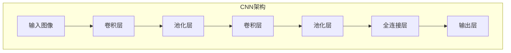

# 一切皆是映射：卷积神经网络(CNN)原理解析

## 1. 背景介绍

### 1.1 问题的由来

在人工智能领域中,视觉识别任务一直是一个极具挑战性的问题。传统的机器学习算法在处理图像数据时往往需要手动提取特征,这种方式不仅效率低下,而且容易受到人为偏差的影响。为了解决这一问题,卷积神经网络(Convolutional Neural Network, CNN)应运而生。

### 1.2 研究现状

卷积神经网络最初由生物学家Hubel和Wiesel在20世纪60年代提出,他们发现动物视觉皮层中存在一些神经元对特定方向的边缘和角度特别敏感。受此启发,CNN在1998年被LeCun等人成功应用于手写数字识别任务,取得了令人瞩目的成绩。随后,CNN在2012年的ImageNet大赛上再次大放异彩,从此开启了深度学习在计算机视觉领域的新纪元。

### 1.3 研究意义

CNN能够自动学习图像的特征表示,避免了手工设计特征的复杂过程。它通过卷积操作和池化操作对图像进行特征提取,并利用多层神经网络对特征进行高层次抽象,最终实现准确的图像分类和识别。CNN在图像分类、目标检测、语义分割等视觉任务中表现出色,极大推动了计算机视觉技术的发展。

### 1.4 本文结构

本文将从CNN的基本原理出发,详细介绍其核心概念、算法流程、数学模型以及实际应用。通过理论与实践相结合,旨在为读者提供全面而深入的CNN知识。文章结构如下:

1. 背景介绍
2. 核心概念与联系
3. 核心算法原理与具体操作步骤
4. 数学模型和公式详细讲解与举例说明
5. 项目实践:代码实例和详细解释说明
6. 实际应用场景
7. 工具和资源推荐
8. 总结:未来发展趋势与挑战
9. 附录:常见问题与解答

## 2. 核心概念与联系

卷积神经网络(CNN)是一种前馈神经网络,它借鉴了生物视觉系统的层次结构,具有局部连接、权值共享和空间下采样等特点。CNN主要由卷积层(Convolutional Layer)、池化层(Pooling Layer)和全连接层(Fully Connected Layer)组成。

1. **卷积层(Convolutional Layer)**: 卷积层是CNN的核心部分,它通过卷积操作在图像上滑动过滤器(Filter)或核(Kernel),提取局部特征。卷积操作能够保留图像的空间结构信息,并通过权值共享减少参数量。

2. **池化层(Pooling Layer)**: 池化层通常在卷积层之后,对卷积层的输出进行下采样操作。它能够减小特征图的维度,从而降低计算复杂度并提高鲁棒性。常见的池化方法有最大池化(Max Pooling)和平均池化(Average Pooling)。

3. **全连接层(Fully Connected Layer)**: 全连接层类似于传统的神经网络,它将前面卷积层和池化层提取的特征进行整合,并进行分类或回归任务。全连接层通常位于CNN的最后几层。

上述三种层按顺序堆叠,形成了CNN的基本架构。通过多层卷积和池化操作,CNN能够自动学习图像的低级特征(如边缘和纹理)和高级语义特征,从而实现准确的图像识别和分类。

## 3. 核心算法原理与具体操作步骤

### 3.1 算法原理概述

卷积神经网络的核心算法原理可以概括为三个关键步骤:卷积(Convolution)、池化(Pooling)和分类(Classification)。

1. **卷积(Convolution)**: 卷积操作是CNN的核心,它通过在输入图像上滑动过滤器(Filter)或核(Kernel)来提取局部特征。过滤器是一个小矩阵,它与输入图像的局部区域进行元素级乘积,然后求和得到一个新的特征图(Feature Map)。过滤器的权重在训练过程中通过反向传播算法不断调整,以学习最优的特征表示。

2. **池化(Pooling)**: 池化操作通常在卷积层之后,对特征图进行下采样。它将特征图分成多个小区域,并在每个区域内选取一个代表值(如最大值或平均值)作为新的特征图的元素。池化操作能够减小特征图的维度,从而降低计算复杂度并提高鲁棒性。

3. **分类(Classification)**: 经过多层卷积和池化操作后,CNN会得到高级语义特征表示。这些特征通常会被馈送到一个或多个全连接层,进行分类或回归任务。全连接层类似于传统的神经网络,它将所有输入特征与权重进行矩阵乘法,并通过激活函数得到输出。

通过上述三个步骤,CNN能够自动学习图像的特征表示,从而实现准确的图像识别和分类。下面将详细介绍每个步骤的具体操作步骤。

### 3.2 算法步骤详解

#### 3.2.1 卷积操作

卷积操作是CNN的核心,它通过在输入图像上滑动过滤器或核来提取局部特征。具体步骤如下:

1. 初始化过滤器(Filter)或核(Kernel)的权重,通常使用随机初始化或预训练模型。
2. 将过滤器滑动到输入图像的每个位置,并执行元素级乘积和求和操作,得到一个新的特征图(Feature Map)。
3. 对特征图进行激活函数操作(如ReLU),以增加非线性特性。
4. 重复步骤2和3,使用多个不同的过滤器,生成多个特征图。

卷积操作的数学表达式如下:

$$
\text{Output}(x, y) = \sum_{i, j} \text{Input}(x + i, y + j) \cdot \text{Filter}(i, j)
$$

其中,$(x, y)$是输出特征图的坐标,$(i, j)$是过滤器的坐标。输出特征图的每个元素是输入图像局部区域与过滤器的元素级乘积之和。

通过卷积操作,CNN能够自动学习图像的低级特征,如边缘、纹理和简单形状等。不同的过滤器能够捕获不同的特征,从而为后续的高级特征提取奠定基础。

#### 3.2.2 池化操作

池化操作通常在卷积层之后,对特征图进行下采样。它将特征图分成多个小区域,并在每个区域内选取一个代表值作为新的特征图的元素。常见的池化方法有最大池化(Max Pooling)和平均池化(Average Pooling)。

最大池化的操作步骤如下:

1. 将特征图划分为多个小区域,通常使用2x2或3x3的窗口大小。
2. 在每个小区域内,选取最大值作为新的特征图的元素。
3. 移动窗口,重复步骤2,直到遍历整个特征图。

最大池化的数学表达式如下:

$$
\text{Output}(x, y) = \max_{(i, j) \in R} \text{Input}(x + i, y + j)
$$

其中,$(x, y)$是输出特征图的坐标,$(i, j)$是池化窗口的坐标,$R$表示池化窗口的区域。输出特征图的每个元素是输入特征图对应区域内的最大值。

平均池化的操作步骤与最大池化类似,不同之处在于它取的是小区域内元素的平均值,而不是最大值。

池化操作能够减小特征图的维度,从而降低计算复杂度并提高鲁棒性。同时,它也能够捕获图像的不变性(Invariance),如平移、缩放和旋转等,这对于图像识别任务非常重要。

#### 3.2.3 分类操作

经过多层卷积和池化操作后,CNN会得到高级语义特征表示。这些特征通常会被馈送到一个或多个全连接层,进行分类或回归任务。

全连接层的操作步骤如下:

1. 将前面卷积层和池化层提取的特征展平(Flatten)为一维向量。
2. 将展平后的特征向量与全连接层的权重矩阵相乘,得到新的特征向量。
3. 对新的特征向量应用激活函数(如ReLU或Sigmoid)。
4. 重复步骤2和3,直到最后一层全连接层。
5. 最后一层全连接层的输出通常对应于分类任务的类别数或回归任务的目标值。

全连接层的数学表达式如下:

$$
\text{Output} = f(\mathbf{W} \cdot \mathbf{x} + \mathbf{b})
$$

其中,$\mathbf{W}$是权重矩阵,$\mathbf{x}$是输入特征向量,$\mathbf{b}$是偏置向量,$f$是激活函数。

在训练过程中,CNN会通过反向传播算法不断调整卷积层、池化层和全连接层的权重,以最小化损失函数(如交叉熵损失函数),从而实现准确的图像识别和分类。

### 3.3 算法优缺点

#### 优点:

1. **自动特征提取**: CNN能够自动学习图像的特征表示,避免了手工设计特征的复杂过程。
2. **空间结构保留**: 卷积操作能够保留图像的空间结构信息,有利于捕获图像的局部特征。
3. **参数共享**: 卷积层中的过滤器在整个图像上共享权重,大大减少了参数量,提高了计算效率。
4. **平移不变性**: 池化操作能够捕获图像的平移不变性,提高了模型的鲁棒性。
5. **可解释性**: CNN的层次结构类似于生物视觉系统,从低级特征到高级特征的提取过程具有一定的可解释性。

#### 缺点:

1. **参数调节困难**: CNN涉及许多超参数(如过滤器大小、步长、池化窗口大小等),调节这些参数往往需要大量的经验和试错。
2. **对旋转和缩放敏感**: 尽管池化操作能够捕获平移不变性,但CNN对图像的旋转和缩放仍然比较敏感。
3. **需要大量数据**: CNN通常需要大量的标注数据进行训练,否则容易出现过拟合问题。
4. **计算资源要求高**: CNN的训练和推理过程需要大量的计算资源,尤其是在处理高分辨率图像时。
5. **黑箱性质**: CNN的内部机制仍然存在一定的黑箱性质,难以完全解释其决策过程。

### 3.4 算法应用领域

由于卷积神经网络在图像处理任务中表现出色,它已被广泛应用于以下领域:

1. **图像分类**: CNN能够准确地将图像分类到预定义的类别中,如识别图像中的物体、动物、场景等。
2. **目标检测**: 通过在图像中定位并框选出感兴趣的目标,CNN可以应用于目标检测任务,如人脸检测、行人检测等。
3. **语义分割**: CNN能够对图像中的每个像素进行分类,实现对图像的像素级语义分割,广泛应用于自动驾驶、医学影像分析等领域。
4. **超分辨率重建**: CNN可以通过学习低分辨率和高分辨率图像之间的映射关系,实现图像的超分辨率重建。
5. **图像去噪和修复**: CNN能够学习图像的先验知识,从而实现图像去噪和修复,提高图像质量。
6. **图像生成**: 基于生成对抗网络(GAN)的CNN模型能够生成逼真的图像,应用于图像编辑、风格迁移等任务。
7. **视频分析**: CNN不仅可以应用于静态图像,还能够处理视频数据,用于视频分类、行为识别等任务。

总的来说,卷积神经网络已经成为计