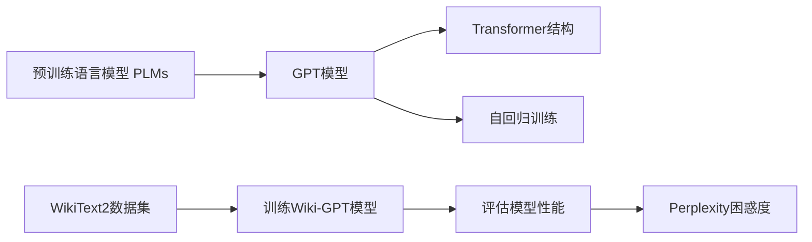

# 使用WikiText2数据集训练Wiki-GPT模型

作者：禅与计算机程序设计艺术 / Zen and the Art of Computer Programming

## 1. 背景介绍
### 1.1 问题的由来
随着自然语言处理(NLP)技术的快速发展,预训练语言模型(Pre-trained Language Models,PLMs)已成为NLP领域的研究热点。其中,GPT(Generative Pre-Training)系列模型以其强大的语言理解和生成能力而备受关注。然而,训练一个高质量的GPT模型需要海量的文本数据,这对于许多研究者和开发者来说是一个挑战。

### 1.2 研究现状
目前,已经有许多开源的预训练GPT模型,如OpenAI的GPT-2和GPT-3,Google的BERT和T5等。这些模型在各种NLP任务上取得了优异的性能,但它们大多是在大规模通用语料上训练的,可能无法很好地适应特定领域的应用。因此,在特定领域数据集上训练GPT模型仍然是一个值得探索的方向。

### 1.3 研究意义
WikiText2是一个广泛使用的自然语言处理基准数据集,包含了大量来自维基百科的高质量文本数据。在WikiText2数据集上训练GPT模型有以下几点意义:

1. 探索在特定领域数据上训练GPT模型的可行性和效果。
2. 为研究者和开发者提供一个训练GPT模型的参考案例。
3. 促进GPT模型在知识密集型任务(如问答、摘要等)上的应用。

### 1.4 本文结构
本文将详细介绍使用WikiText2数据集训练Wiki-GPT模型的整个过程,包括数据准备、模型设计、训练流程、评估方法等。全文结构如下:

1. 背景介绍
2. 核心概念与联系
3. 核心算法原理 & 具体操作步骤
4. 数学模型和公式 & 详细讲解 & 举例说明
5. 项目实践:代码实例和详细解释说明
6. 实际应用场景
7. 工具和资源推荐
8. 总结:未来发展趋势与挑战
9. 附录:常见问题与解答

## 2. 核心概念与联系

在训练Wiki-GPT模型之前,我们需要了解以下几个核心概念:

1. **预训练语言模型(PLMs)**: 指在大规模无标注文本数据上预先训练的语言模型,可以学习到丰富的语言知识和表征。常见的PLMs包括BERT、GPT、XLNet等。

2. **GPT(Generative Pre-Training)**: 由OpenAI提出的一种预训练语言模型,采用Transformer的解码器结构,以自回归的方式训练,可以生成连贯、流畅的文本。

3. **WikiText2数据集**: 由Salesforce研究院发布的一个基准数据集,包含了维基百科上的高质量文本数据,广泛用于评估语言模型的性能。

4. **Transformer**: 由Google提出的一种神经网络结构,基于自注意力机制,可以并行计算,在NLP任务上取得了显著的性能提升。

5. **自回归(Autoregressive)**: 一种序列生成模型,根据之前生成的token来预测下一个token,可以生成任意长度的序列。

6. **Perplexity(困惑度)**: 衡量语言模型性能的一个指标,表示模型在给定上下文下预测下一个单词的困难程度。困惑度越低,模型性能越好。

这些概念之间的联系如下图所示:



## 3. 核心算法原理 & 具体操作步骤
### 3.1 算法原理概述
GPT模型的核心是Transformer的解码器结构,通过自回归的方式训练。具体来说,模型在每个时间步根据之前生成的token序列来预测下一个token,从而最大化整个序列的概率。模型的目标函数可以表示为:

$$L(\theta) = \sum_{i=1}^{n} \log P(x_i|x_{<i};\theta)$$

其中,$x_i$表示第$i$个token,$x_{<i}$表示$x_i$之前的所有token序列,$\theta$表示模型参数。

### 3.2 算法步骤详解
训练Wiki-GPT模型的具体步骤如下:

1. **数据准备**: 下载并预处理WikiText2数据集,将文本数据转换为模型可以接受的格式(如token ID序列)。

2. **模型设计**: 根据WikiText2数据集的特点,设计合适的GPT模型结构,包括模型层数、隐藏层大小、注意力头数等超参数。

3. **模型初始化**: 随机初始化模型参数,或者使用预训练的GPT模型参数进行初始化(如GPT-2)。

4. **模型训练**: 使用WikiText2数据集训练Wiki-GPT模型,通过最小化目标函数来更新模型参数。常用的优化算法包括Adam、AdamW等。

5. **模型评估**: 在WikiText2的验证集和测试集上评估模型性能,计算Perplexity等指标。可以通过调整超参数来进一步优化模型。

6. **模型应用**: 使用训练好的Wiki-GPT模型进行文本生成、问答等下游任务。

### 3.3 算法优缺点
GPT算法的优点包括:

1. 可以生成连贯、流畅的文本,语言表达能力强。
2. 通过预训练可以学习到丰富的语言知识,具有良好的迁移能力。
3. 模型结构简单,易于实现和扩展。

GPT算法的缺点包括:

1. 训练需要大量的计算资源和时间。
2. 生成的文本可能存在语法错误、逻辑不一致等问题。
3. 对于长文本生成,模型的性能可能会下降。

### 3.4 算法应用领域
GPT算法可以应用于以下领域:

1. 文本生成:如新闻写作、对话生成、故事创作等。
2. 问答系统:根据给定的问题生成回答。
3. 机器翻译:将源语言文本翻译成目标语言文本。
4. 文本摘要:自动生成文章的摘要。
5. 情感分析:根据文本内容判断情感倾向。

## 4. 数学模型和公式 & 详细讲解 & 举例说明
### 4.1 数学模型构建
GPT模型的数学模型可以表示为:

$$P(x) = \prod_{i=1}^{n} P(x_i|x_{<i})$$

其中,$x$表示一个长度为$n$的token序列,$x_i$表示第$i$个token,$x_{<i}$表示$x_i$之前的所有token序列。

模型的目标是最大化整个序列的概率,即:

$$\arg\max_{\theta} P(x;\theta) = \arg\max_{\theta} \sum_{i=1}^{n} \log P(x_i|x_{<i};\theta)$$

其中,$\theta$表示模型参数。

### 4.2 公式推导过程
根据链式法则,序列$x$的概率可以分解为:

$$P(x) = P(x_1, x_2, ..., x_n) = P(x_1) P(x_2|x_1) P(x_3|x_1,x_2) ... P(x_n|x_1,x_2,...,x_{n-1})$$

将其简化为:

$$P(x) = \prod_{i=1}^{n} P(x_i|x_{<i})$$

对上式取对数,得到:

$$\log P(x) = \sum_{i=1}^{n} \log P(x_i|x_{<i})$$

因此,模型的目标函数可以表示为:

$$L(\theta) = \sum_{i=1}^{n} \log P(x_i|x_{<i};\theta)$$

### 4.3 案例分析与讲解
以一个简单的例子来说明GPT模型的工作原理。假设我们要生成一个句子"I love machine learning"。

1. 模型首先生成第一个单词"I",概率为$P(x_1)$。
2. 根据"I",模型生成第二个单词"love",概率为$P(x_2|x_1)$。
3. 根据"I love",模型生成第三个单词"machine",概率为$P(x_3|x_1,x_2)$。
4. 根据"I love machine",模型生成第四个单词"learning",概率为$P(x_4|x_1,x_2,x_3)$。

整个句子的概率为:

$$P(x) = P(x_1) P(x_2|x_1) P(x_3|x_1,x_2) P(x_4|x_1,x_2,x_3)$$

模型通过最大化这个概率来生成连贯、流畅的句子。

### 4.4 常见问题解答
1. **Q**: GPT模型可以生成任意长度的文本吗?
   **A**: 理论上可以,但是由于模型的限制(如记忆力有限),生成的文本质量可能会随着长度的增加而下降。

2. **Q**: GPT模型生成的文本是否具有创新性?
   **A**: GPT模型主要是根据训练数据生成文本,因此生成的内容主要来自于训练数据,创新性有限。但是通过引入额外的技术(如控制生成、知识融合等),可以提高生成文本的创新性。

3. **Q**: 如何提高GPT模型生成文本的质量?
   **A**: 可以从以下几个方面入手:
   - 增加训练数据的质量和数量
   - 优化模型结构和超参数
   - 引入额外的约束和规则(如语法检查、逻辑一致性等)
   - 使用领域知识对生成的文本进行后处理

## 5. 项目实践:代码实例和详细解释说明
### 5.1 开发环境搭建
本项目使用PyTorch框架实现,需要安装以下依赖:

- Python 3.6+
- PyTorch 1.8+
- Transformers 4.5+
- Datasets 1.5+

可以使用以下命令安装依赖:

```bash
pip install torch transformers datasets
```

### 5.2 源代码详细实现
以下是使用WikiText2数据集训练Wiki-GPT模型的PyTorch代码实现:

```python
import torch
from torch.utils.data import Dataset, DataLoader
from transformers import GPT2Tokenizer, GPT2LMHeadModel, AdamW, get_linear_schedule_with_warmup
from datasets import load_dataset

# 定义WikiText2数据集
class WikiText2Dataset(Dataset):
    def __init__(self, tokenizer, max_length):
        self.tokenizer = tokenizer
        self.max_length = max_length
        self.examples = []

        # 加载WikiText2数据集
        dataset = load_dataset('wikitext', 'wikitext-2-raw-v1')
        text = dataset['train']['text'] + dataset['validation']['text']

        # 将文本切分为句子
        sentences = text.split('\n')
        for sentence in sentences:
            # 对句子进行编码
            input_ids = tokenizer.encode(sentence, add_special_tokens=True, max_length=max_length, truncation=True)
            self.examples.append(input_ids)

    def __len__(self):
        return len(self.examples)

    def __getitem__(self, index):
        return torch.tensor(self.examples[index])

# 定义训练函数
def train(model, tokenizer, train_loader, optimizer, scheduler, device, epochs):
    model.train()
    for epoch in range(epochs):
        total_loss = 0
        for batch in train_loader:
            inputs = batch.to(device)
            labels = inputs.clone()

            # 前向传播
            outputs = model(inputs, labels=labels)
            loss = outputs.loss
            total_loss += loss.item()

            # 反向传播
            loss.backward()
            optimizer.step()
            scheduler.step()
            optimizer.zero_grad()

        avg_loss = total_loss / len(train_loader)
        print(f'Epoch {epoch + 1}, Loss: {avg_loss:.4f}')

# 定义评估函数
def evaluate(model, tokenizer, text, device, max_length=100):
    model.eval()
    input_ids = tokenizer.encode(text, add_special_tokens=True, return_tensors='pt').to(device)

    # 生成文本
    output_ids = model.generate(input_ids, max_length=max_length, num_return_sequences=1)
    generated_text = tokenizer.decode(output_ids[0], skip_special_tokens=True)

    return generated_text

# 主函数
def main():
    # 设置超参数
    batch_size = 8
    max_length = 512
    epochs = 3
    learning_rate = 1e-4