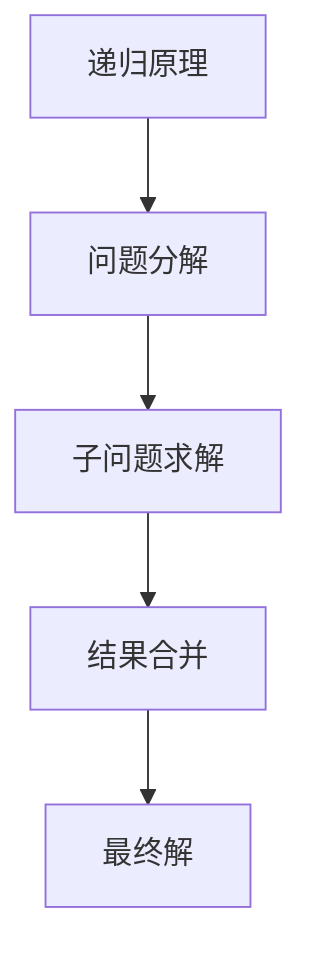
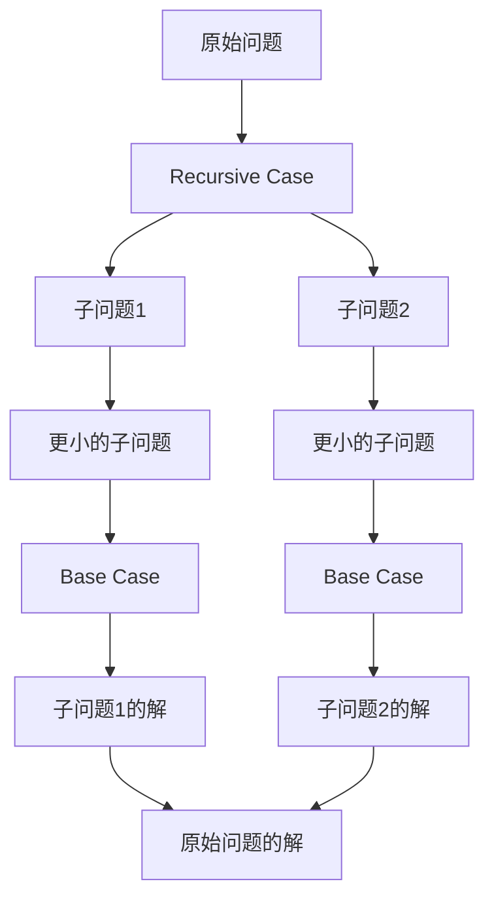

# 像数学家一样思考：递归原理

## 1. 背景介绍

### 1.1 问题的由来

在计算机科学和数学领域中,递归是一种强大而优雅的解决问题的方式。它源于人类思维的本质,即将复杂问题分解为更小的子问题,直到可以直接解决为止。这种分而治之的思路不仅贯穿于数学证明和算法设计中,也体现在日常生活的方方面面。

递归的概念最初可追溯到古希腊数学家欧几里德(Euclid)的时代。他在研究几何问题时,发现许多复杂的几何形状都可以由基本的形状(如点、线、圆等)通过递归的方式构建而成。这种观察为后来的递归思想奠定了基础。

随着计算机科学的发展,递归在算法设计和程序实现中扮演着越来越重要的角色。许多经典算法,如快速排序、归并排序、深度优先搜索等,都采用了递归的思路。递归不仅使算法实现更加简洁优雅,也为复杂问题的解决提供了新的视角。

### 1.2 研究现状

近年来,随着计算机硬件性能的飞速提升,递归在人工智能、大数据处理等领域也得到了广泛应用。例如,决策树算法和神经网络中的反向传播算法都采用了递归的思想。此外,函数式编程语言(如Lisp、Haskell等)也将递归作为核心特性,使程序员能够更加自然地表达递归思想。

然而,递归也存在一些缺陷和局限性。例如,递归调用会占用额外的系统资源(如内存),并且可能导致栈溢出等问题。因此,在实际应用中,需要权衡递归的优缺点,并根据具体情况选择合适的解决方案。

### 1.3 研究意义

深入理解递归原理对于提高程序员的算法设计能力和解决复杂问题的能力至关重要。掌握递归不仅能帮助我们编写出更加简洁、优雅的代码,也能培养我们将复杂问题分解为可管理的子问题的思维习惯。

此外,递归思想在数学、计算机科学乃至其他学科领域都有广泛的应用。研究递归原理有助于我们建立一种跨学科的思维模式,从而能够更好地解决现实世界中的复杂问题。

### 1.4 本文结构

本文将从以下几个方面全面探讨递归的原理:

1. 核心概念与联系
2. 核心算法原理及具体操作步骤
3. 数学模型和公式详细讲解及案例分析
4. 项目实践:代码实例和详细解释
5. 实际应用场景
6. 工具和资源推荐
7. 总结:未来发展趋势与挑战
8. 附录:常见问题与解答

接下来,我们将逐一深入探讨这些内容。

## 2. 核心概念与联系

递归是一种解决问题的方法,它的核心思想是将原问题与其子问题联系起来,通过解决子问题来逐步求解原问题。这种思路源于数学归纳法,并被广泛应用于算法设计和程序实现中。



上图展示了递归原理的核心流程。具体来说,递归通常包含以下三个关键步骤:

1. **问题分解(Problem Decomposition)**: 将原始问题分解为一个或多个相似但更小的子问题。
2. **子问题求解(Subproblem Solving)**: 递归地解决这些子问题,直到遇到可以直接求解的基本情况(Base Case)。
3. **结果合并(Result Composition)**: 将子问题的解合并,从而得到原始问题的解。

需要注意的是,递归过程中必须存在一个终止条件(Base Case),否则会导致无限递归,造成程序崩溃或资源耗尽。同时,递归也需要满足"子问题比原问题更简单"的条件,以确保问题规模在每次递归调用中都在缩小,最终能够收敛到Base Case。

递归思想不仅体现在算法和程序设计中,也广泛存在于数学、物理、生物等许多学科领域。例如,分形几何、卡夫曼方程、细胞分裂等都蕴含着递归的本质。因此,掌握递归原理有助于我们建立一种跨学科的思维模式,从而能够更好地解决复杂问题。

## 3. 核心算法原理及具体操作步骤

### 3.1 算法原理概述

递归算法的核心原理可以概括为以下三个要素:

1. **Base Case(基本情况)**: 递归算法必须有一个或多个终止条件,即不需要进行递归调用而可以直接求解的情况。这是递归过程的出口,确保算法不会陷入无限循环。

2. **Recursive Case(递归情况)**: 将原始问题分解为一个或多个相似但更小的子问题,并递归地求解这些子问题。这是递归过程的核心步骤,体现了"分而治之"的思想。

3. **Recursive Case到Base Case的阶段性变换**: 在每次递归调用中,问题的规模都会逐渐缩小,直到满足Base Case的条件。这个过程确保了算法能够最终收敛并得到解。



上图展示了递归算法的一般流程。可以看出,递归算法通过不断分解问题并求解子问题,最终将复杂的原始问题简化为可直接求解的Base Case,再将这些子问题的解合并,从而得到原始问题的解。

值得注意的是,在设计递归算法时,需要仔细考虑Base Case的选择和递归终止条件,以避免无限递归或错误的结果。同时,还需要权衡递归调用带来的额外开销,在一些情况下,非递归的迭代算法可能会更加高效。

### 3.2 算法步骤详解

下面我们将通过一个具体的例子,详细解释递归算法的实现步骤。我们将使用经典的斐波那契数列(Fibonacci Sequence)问题来说明递归算法的设计过程。

**问题描述**:斐波那契数列是一个非常著名的数学序列,它的定义如下:

$$
F(n) =
\begin{cases}
0, & \text{if }n=0\
1, & \text{if }n=1\
F(n-1) + F(n-2), & \text{if }n>1
\end{cases}
$$

我们的目标是设计一个递归算法来计算第n个斐波那契数。

**步骤1: 确定Base Case**

Base Case是递归算法的终止条件,对于斐波那契数列问题,我们可以将$n=0$和$n=1$作为Base Case,因为它们的值是已知的。

```python
def fibonacci(n):
    if n == 0:
        return 0
    elif n == 1:
        return 1
    # 递归情况
```

**步骤2: 确定Recursive Case**

Recursive Case是将原始问题分解为更小的子问题的步骤。对于斐波那契数列,我们可以将$F(n)$表示为前两个斐波那契数之和,即:

$$F(n) = F(n-1) + F(n-2)$$

因此,我们可以通过递归调用计算$F(n-1)$和$F(n-2)$,然后将它们相加得到$F(n)$的值。

```python
def fibonacci(n):
    if n == 0:
        return 0
    elif n == 1:
        return 1
    else:
        return fibonacci(n-1) + fibonacci(n-2)
```

**步骤3: 递归终止条件检查**

在每次递归调用之前,我们需要检查是否已经满足了Base Case的条件。如果满足,则直接返回对应的值,否则继续进行递归调用。

```python
def fibonacci(n):
    if n == 0:
        return 0
    elif n == 1:
        return 1
    else:
        return fibonacci(n-1) + fibonacci(n-2)
```

**步骤4: 算法测试和优化**

最后,我们可以测试算法的正确性,并根据需要进行优化。例如,我们可以使用记忆化(Memoization)技术来避免重复计算,从而提高算法的效率。

```python
def fibonacci(n, memo={}):
    if n in memo:
        return memo[n]
    if n == 0:
        return 0
    elif n == 1:
        return 1
    else:
        result = fibonacci(n-1, memo) + fibonacci(n-2, memo)
        memo[n] = result
        return result
```

通过上述步骤,我们成功设计了一个递归算法来求解斐波那契数列问题。值得注意的是,递归算法的设计过程并不是一蹴而就的,通常需要反复思考和调整,直到找到最优的解决方案。

### 3.3 算法优缺点

递归算法具有以下优点:

1. **简洁优雅**: 递归算法通常能够用简洁的代码表达复杂的逻辑,使代码更加易读和易维护。
2. **符合人类思维模式**: 递归算法与人类分解问题、解决子问题的思维模式非常吻合,因此更加直观和自然。
3. **适用于树形结构和分形结构**: 递归算法非常适合处理树形结构和分形结构等具有自相似性质的问题。
4. **模块化和可重用性强**: 递归算法通常可以将复杂问题分解为多个相似的子问题,这些子问题可以被视为独立的模块,从而提高了代码的可重用性和可维护性。

然而,递归算法也存在一些缺点:

1. **额外的系统开销**: 每次递归调用都会占用一定的系统资源(如内存、CPU时间等),当递归层次过深时,可能会导致栈溢出或性能下降。
2. **可读性和调试难度较高**: 虽然递归算法本身简洁,但由于涉及多层嵌套调用,因此可读性和调试难度较高,尤其是在出现错误或异常情况时。
3. **不适合大规模计算**: 对于一些需要大量计算的问题,递归算法可能会由于过多的递归调用而导致效率低下。在这种情况下,迭代算法可能会更加高效。
4. **存在重复计算**: 某些递归算法可能会重复计算相同的子问题,导致计算效率低下。这种情况可以通过记忆化(Memoization)或动态规划(Dynamic Programming)等技术来优化。

因此,在实际应用中,我们需要权衡递归算法的优缺点,根据具体问题的特点选择最合适的解决方案。在一些情况下,非递归的迭代算法可能会更加高效;而在另一些情况下,递归算法则能够提供更简洁、优雅的解决方式。

### 3.4 算法应用领域

递归算法在计算机科学和数学领域有着广泛的应用,包括但不限于以下几个方面:

1. **数据结构操作**: 许多经典的数据结构,如树、链表等,都可以通过递归算法进行遍历、插入、删除等操作。
2. **图论算法**: 许多图论算法,如深度优先搜索(DFS)、广度优先搜索(BFS)等,都采用了递归的思路。
3. **分治算法**: 分治算法(Divide and Conquer)是一种将复杂问题分解为更小的子问题,递归地解决子问题,并合并结果的算法设计范式。许多经典算法,如快速排序、归并排序等,都基于分治思想。
4. **动态规划算法**: 动态规划算法通常会将复杂问题分解为重叠的子问题,并通过记录子问题的解来避免重复计算。这种思路与递归算法有着密切的联系。
5. **组合数学**: 递归在组合数学中有着广泛的应用,例如计算排列、组合、递推关系等。
6. **编译器设计**: