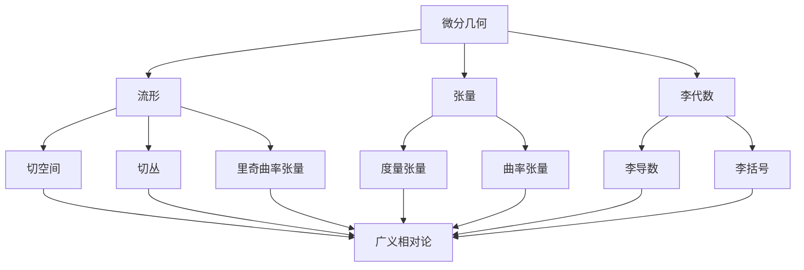

# 微分几何入门与广义相对论：非涨视界

## 1. 背景介绍

### 1.1 问题的由来

自古以来，人类一直对宇宙的奥秘充满好奇。从古希腊时期的哲学家到现代物理学家，都在不懈地探索着宇宙的本质和运行规律。然而,传统的牛顿力学在解释宇宙尺度上的现象时存在着明显的缺陷,无法解释许多观测现象,如水星运行轨道的离心率、光线在引力场中的偏折等。这促使科学家们开始寻求一种新的理论来解释这些现象。

### 1.2 研究现状

在20世纪初,爱因斯坦提出了革命性的广义相对论,为解释宇宙中的引力现象提供了全新的视角。广义相对论将引力视为时空的曲率,而不是传统意义上的力。这一理论不仅解决了牛顿力学无法解释的问题,还预言了许多新的现象,如黑洞的存在和引力波的辐射。

然而,广义相对论的数学基础——微分几何,对于许多人来说仍然是一个巨大的挑战。微分几何是一门研究曲面和更高维流形的几何性质的数学分支,其概念和计算往往非常抽象和复杂。因此,如何更好地理解和掌握微分几何,对于深入学习和应用广义相对论至关重要。

### 1.3 研究意义

掌握微分几何不仅有助于我们更好地理解广义相对论的数学基础,还可以拓展我们对时空本质的认知。此外,微分几何在许多其他领域也有广泛的应用,如计算机图形学、计算机视觉、机器人技术等。因此,研究微分几何入门与广义相对论的关系,对于推动相关领域的发展具有重要意义。

### 1.4 本文结构

本文将从以下几个方面深入探讨微分几何入门与广义相对论的关系:

1. 核心概念与联系
2. 核心算法原理与具体操作步骤
3. 数学模型和公式详细讲解与举例说明
4. 项目实践:代码实例和详细解释说明
5. 实际应用场景
6. 工具和资源推荐
7. 总结:未来发展趋势与挑战
8. 附录:常见问题与解答

## 2. 核心概念与联系

在探讨微分几何入门与广义相对论的关系之前,我们需要先了解一些核心概念。

### 2.1 流形(Manifold)

流形是微分几何中的基本概念,它是一种局部看起来像欧几里得空间的拓扑空间。在广义相对论中,时空被描述为一个四维流形,其中每一点都有四个坐标(三个空间坐标和一个时间坐标)。

### 2.2 张量(Tensor)

张量是一种几何对象,可以用来描述流形上的物理量。在广义相对论中,引力场被描述为一种张量场,即度量张量场。此外,曲率张量也是一种描述时空曲率的重要张量。

### 2.3 李代数(Lie Algebra)

李代数是一种研究连续对称性的数学工具。在广义相对论中,李代数被用来描述时空的对称性,如平移对称性和旋转对称性。李导数和李括号是李代数中的两个重要概念。

### 2.4 切空间和切丛(Tangent Space and Tangent Bundle)

切空间是流形上的一种局部线性近似,它描述了流形在某一点的局部结构。切丛则是所有切空间的集合,它描述了整个流形的局部结构。在广义相对论中,切空间和切丛被用来描述时空的局部结构。

### 2.5 里奇曲率张量(Ricci Curvature Tensor)

里奇曲率张量是一种描述时空曲率的重要张量,它是由曲率张量通过一种特殊的张量收缩操作得到的。在广义相对论的爱因斯坦场方程中,里奇曲率张量与物质分布密度相关。

通过上述核心概念,我们可以看到微分几何与广义相对论之间存在着密切的联系。微分几何为广义相对论提供了数学基础,而广义相对论则为微分几何提供了丰富的应用背景。

## 3. 核心算法原理与具体操作步骤

### 3.1 算法原理概述

在广义相对论中,爱因斯坦场方程是描述时空曲率与物质分布之间关系的核心方程。该方程的左边是描述时空曲率的里奇曲率张量,右边是描述物质分布的能量-动量张量。具体来说,爱因斯坦场方程可以写成:

$$
R_{\mu\nu} - \frac{1}{2}g_{\mu\nu}R = \frac{8\pi G}{c^4}T_{\mu\nu}
$$

其中:

- $R_{\mu\nu}$ 是里奇曲率张量
- $g_{\mu\nu}$ 是度量张量
- $R$ 是标量曲率(里奇曲率张量的迹)
- $T_{\mu\nu}$ 是能量-动量张量
- $G$ 是牛顿引力常数
- $c$ 是光速

爱因斯坦场方程描述了时空是如何被物质的存在所弯曲的,同时也描述了物质是如何沿着弯曲的时空运动的。因此,解析这个方程对于理解广义相对论至关重要。

### 3.2 算法步骤详解

解析爱因斯坦场方程通常需要以下几个步骤:

1. **选择度量张量**

   首先,我们需要选择一个合适的度量张量 $g_{\mu\nu}$ 来描述时空的几何结构。在不同的情况下,我们可能会选择不同的度量张量,如闵可夫斯基度量、施瓦西子度量等。

2. **计算里奇曲率张量**

   给定度量张量 $g_{\mu\nu}$,我们可以计算出相应的里奇曲率张量 $R_{\mu\nu}$。这通常需要进行一系列复杂的张量计算,包括计算切空间、切丛、仿射连接、曲率张量等。

3. **确定能量-动量张量**

   根据具体的物理情况,我们需要确定能量-动量张量 $T_{\mu\nu}$ 的具体形式。例如,对于理想流体,能量-动量张量可以写成:

   $$
   T_{\mu\nu} = (\rho + p/c^2)u_\mu u_\nu + p g_{\mu\nu}
   $$

   其中 $\rho$ 是能量密度, $p$ 是压强, $u_\mu$ 是四速度。

4. **解析爱因斯坦场方程**

   将已知的里奇曲率张量 $R_{\mu\nu}$ 和能量-动量张量 $T_{\mu\nu}$ 代入爱因斯坦场方程,我们可以得到一组耦合的非线性偏微分方程。解析这些方程可以得到度量张量 $g_{\mu\nu}$ 的具体形式,从而描述出时空的几何结构。

5. **分析解的物理意义**

   最后,我们需要分析所得解的物理意义,例如是否存在奇点、是否存在时空旋转等,并将理论预言与观测结果进行比较和验证。

### 3.3 算法优缺点

爱因斯坦场方程的解析过程具有以下优缺点:

**优点:**

- 能够准确描述时空的几何结构和物质的运动
- 在许多情况下,可以得到解析解或近似解
- 为研究黑洞、引力波等重大物理现象提供了理论基础

**缺点:**

- 方程本身非常复杂,解析过程往往需要进行大量的张量计算
- 在某些情况下(如强引力场),可能无法得到解析解或精确解
- 需要掌握微分几何、张量分析等数学知识,门槛较高

### 3.4 算法应用领域

爱因斯坦场方程及其解析方法在以下领域有着广泛的应用:

- **天体物理学:** 研究黑洞、中子星、引力透镜等天体现象
- **宇宙学:** 研究宇宙的起源、演化和未来
- **引力波物理学:** 研究引力波的产生、传播和探测
- **等离子体物理学:** 研究等离子体在强引力场中的行为
- **量子引力:** 试图将量子力学和广义相对论统一的理论

## 4. 数学模型和公式详细讲解与举例说明

### 4.1 数学模型构建

在广义相对论中,时空被描述为一个四维流形,其上定义了一个度量张量场 $g_{\mu\nu}$。度量张量描述了时空的几何结构,并决定了物质在时空中的运动轨迹。

为了构建数学模型,我们需要引入一些基本概念:

- **流形 (Manifold):** 一种局部看起来像欧几里得空间的拓扑空间。时空被描述为一个四维流形 $\mathcal{M}$。
- **切空间 (Tangent Space):** 流形上的一种局部线性近似,描述了流形在某一点的局部结构。切空间记为 $T_p\mathcal{M}$,其中 $p$ 是流形上的一点。
- **切丛 (Tangent Bundle):** 所有切空间的集合,描述了整个流形的局部结构。切丛记为 $T\mathcal{M}$。
- **度量张量 (Metric Tensor):** 定义在流形上的一种张量场,描述了时空的几何结构。度量张量记为 $g_{\mu\nu}$,其中 $\mu,\nu=0,1,2,3$ 分别代表时间和三个空间坐标。

在这个数学模型中,时空的几何结构由度量张量 $g_{\mu\nu}$ 完全确定。物质在时空中的运动轨迹由geodesic方程决定,即:

$$
\frac{d^2x^\mu}{d\tau^2} + \Gamma^\mu_{\alpha\beta}\frac{dx^\alpha}{d\tau}\frac{dx^\beta}{d\tau} = 0
$$

其中 $\Gamma^\mu_{\alpha\beta}$ 是由度量张量 $g_{\mu\nu}$ 决定的仿射连接,描述了时空的曲率。

### 4.2 公式推导过程

在广义相对论中,爱因斯坦场方程是描述时空曲率与物质分布之间关系的核心方程。下面我们将详细推导这个著名的方程。

首先,我们需要引入里奇曲率张量 $R_{\mu\nu}$,它是由曲率张量 $R^\rho_{\mu\sigma\nu}$ 通过一种特殊的张量收缩操作得到的:

$$
R_{\mu\nu} = R^\rho_{\mu\rho\nu}
$$

里奇曲率张量描述了时空的曲率,它的迹 $R = g^{\mu\nu}R_{\mu\nu}$ 被称为标量曲率。

另一方面,我们需要引入能量-动量张量 $T_{\mu\nu}$,它描述了物质的分布和运动。对于理想流体,能量-动量张量可以写成:

$$
T_{\mu\nu} = (\rho + p/c^2)u_\mu u_\nu + p g_{\mu\nu}
$$

其中 $\rho$ 是能量密度, $p$ 是压强, $u_\mu$ 是四速度,满足 $u^\mu u_\mu = -c^2$。

爱因斯坦场方程就是将里奇曲率张量 $R_{\mu\nu}$ 与能量-动量张量 $T_{\mu\nu}$ 联系起来的方程:

$$
R_{\mu\nu} - \frac{1}{2}g_{\mu\nu}R = \frac{8\pi G}{c^4}T_{\mu\nu}
$$

这个方程的左边描述了时空的曲率,右边描述了物质的分布和运动。方程中的常数 $G$ 是牛顿