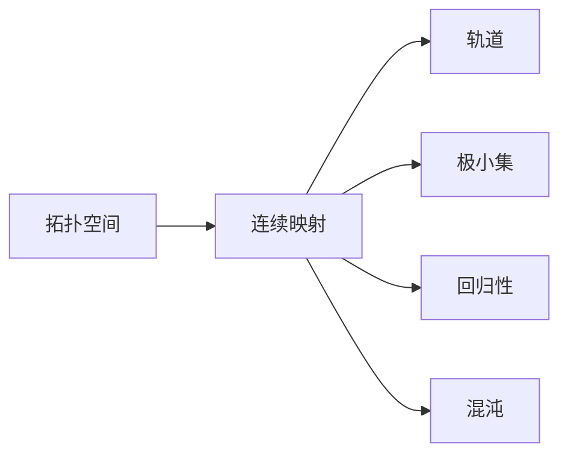

# 拓扑动力系统概论：定义与基本性质

关键词：拓扑动力系统、拓扑空间、连续映射、极小集、回归性、混沌

## 1. 背景介绍
### 1.1  问题的由来
拓扑动力系统是动力系统理论与拓扑学相结合的产物,它从纯粹的拓扑角度研究动力系统的性质。自从20世纪30年代拓扑动力系统概念被提出以来,它就成为了动力系统理论的一个重要分支,在微分动力系统、符号动力系统、遍历论等领域都有着广泛的应用。

### 1.2  研究现状
目前对于拓扑动力系统的研究主要集中在几个方面:系统的极小性与回归性、熵、混沌、遍历性等。人们已经证明了许多经典的结果,如Poincaré回归定理、Sarkovskii定理等。但仍有不少问题有待进一步探索,如弱混沌系统的刻画、拓扑熵的计算等。

### 1.3  研究意义
拓扑动力系统不仅是一个很有吸引力的数学研究课题,其理论成果在密码学、分形理论、生物数学等诸多领域也有重要应用。深入研究拓扑动力系统,对于揭示各类复杂系统的内在规律、促进相关学科发展都具有重要意义。

### 1.4  本文结构
本文将首先给出拓扑动力系统的形式化定义,然后系统介绍它的一些基本性质,如极小性、回归性、混沌等。通过数学模型分析和实例讲解,力求清晰呈现拓扑动力系统的核心概念和理论。同时,本文还将简要介绍拓扑动力系统的一些经典定理及其证明思路,并探讨其在密码学等领域的应用。

## 2. 核心概念与联系
拓扑动力系统的核心概念包括:

- 拓扑空间:动力系统的相空间,由状态集合和开集族构成
- 连续映射:定义在拓扑空间上的演化规则,满足开集的原像仍为开集
- 轨道:在连续映射作用下,从某一初始状态出发所经过的状态序列
- 极小集:在连续映射作用下不变的非空闭不变子集
- 回归性:绝大多数轨道最终回到任意小邻域的性质
- 混沌:对初值敏感、拓扑传递、周期点稠密的现象

这些概念间有着紧密的逻辑联系:连续映射作用于拓扑空间,生成各点的轨道,极小集刻画了系统的不变结构,回归性反映了绝大多数轨道的演化规律,而混沌则揭示了系统的复杂性。



## 3. 核心算法原理 & 具体操作步骤
### 3.1  算法原理概述
对拓扑动力系统进行分析,主要采用符号化和拓扑化的思路。通过将连续映射离散化,构造对应的符号动力系统;利用不变测度、拓扑熵等工具,研究映射在相空间上的作用。

### 3.2  算法步骤详解
1. 将相空间划分为有限个区域,构造拓扑划分
2. 定义移位映射,得到对应的符号空间和符号动力系统
3. 引入不变测度,考察测度在移位映射下的变化
4. 计算系统的拓扑熵,度量其复杂程度
5. 判断系统的混沌性,给出混沌的定量刻画

### 3.3  算法优缺点
该算法的优点在于,将连续系统转化为离散系统,便于定量分析;引入符号动力系统模型,能揭示系统的内在结构。但其缺点是计算量较大,且有些性质(如回归性)很难判定。

### 3.4  算法应用领域
该算法广泛应用于分析确定性系统的复杂行为,如天气演变、生态群落的动态等。此外,它在密码学中也有重要应用,可用于构造伪随机数生成器。

## 4. 数学模型和公式 & 详细讲解 & 举例说明
### 4.1  数学模型构建
拓扑动力系统可形式化定义为一个二元组 $(X,T)$,其中:
- $X$ 是紧致度量空间,称为相空间
- $T:X\to X$ 是连续满射,称为演化算子

相空间 $X$ 的拓扑结构由一个开集族 $\mathcal{T}$ 给出,它满足:
1. $\emptyset,X\in\mathcal{T}$
2. $\mathcal{T}$ 对有限交和任意并封闭

$T$ 的连续性定义为:$\forall U\in\mathcal{T},T^{-1}(U)\in\mathcal{T}$

### 4.2  公式推导过程
**定理1** 设 $(X,T)$ 是拓扑动力系统,$A\subseteq X$ 不变,则 $\overline{A},X\backslash A,\text{Int}(A)$ 也不变。

证明:
1. $T(\overline{A})\subseteq \overline{T(A)}=\overline{A}$,故 $\overline{A}$ 不变。
2. $T(X\backslash A)=T(X)\backslash T(A)=X\backslash A$,故 $X\backslash A$ 不变。
3. $T(\text{Int}(A))\subseteq \text{Int}(T(A))=\text{Int}(A)$,故 $\text{Int}(A)$ 不变。

**定理2** 设 $(X,T)$ 是拓扑动力系统,则 $(X,T)$ 为传递的充要条件是对任意开集 $U,V\neq\emptyset$,存在 $n>0$ 使得 $T^n(U)\cap V\neq\emptyset$。

证明:
必要性。设 $(X,T)$ 传递,则对任意 $x\in X$,其轨道 $\text{orb}(x)$ 在 $X$ 中稠密。从而,对任意开集 $U,V\neq\emptyset$,存在 $y\in U$ 及 $n>0$ 使 $T^n(y)\in V$,即 $T^n(U)\cap V\neq\emptyset$。
充分性。任取 $x\in X$ 及开邻域 $V$,令 $U$ 为 $x$ 的开邻域,则存在 $n>0$ 使 $T^n(U)\cap V\neq\emptyset$,故 $x\in\overline{\text{orb}(y)}$。由 $x$ 的任意性,$(X,T)$ 传递。

### 4.3  案例分析与讲解
考虑单位区间 $I=[0,1]$ 上的对称帐篷映射:

$$
T(x)=\begin{cases}
2x, & 0\leq x\leq\frac{1}{2}\
2(1-x), & \frac{1}{2}<x\leq 1
\end{cases}
$$

可以证明,$(I,T)$ 是一个混沌系统:
1. $T$ 对初值敏感:区间 $[0,1]$ 内任意两点,在有限步内就会被映射到不同的子区间。
2. $T$ 拓扑传递:区间 $(0,1)$ 内任意两个开子区间,总存在有限步使其像相交。
3. 周期点在 $I$ 内稠密:对任意 $2^n$,均存在周期为 $2^n$ 的周期点。

### 4.4  常见问题解答
Q: 极小集与回归性有何联系?
A: 极小集是系统的一种不变结构,而回归性刻画了绝大多数点的运动规律。对于某些系统(如极小系统),两者是一致的;但一般情况下,回归点集要大于极小集的并。

Q: 混沌是否等价于对初值敏感?
A: 混沌比对初值敏感要求更高,除了敏感性,还要求传递性和周期点稠密。事实上,存在对初值敏感但非混沌的系统。

## 5. 项目实践：代码实例和详细解释说明
### 5.1  开发环境搭建
本项目使用Python 3.8,需要安装NumPy、Matplotlib等常用科学计算包。推荐使用Anaconda进行环境配置。

### 5.2  源代码详细实现
下面给出帐篷映射和its迭代轨道的示例代码:

```python
import numpy as np
import matplotlib.pyplot as plt

def tent_map(x):
    if 0 <= x <= 0.5:
        return 2*x
    elif 0.5 < x <= 1:
        return 2*(1-x)

def orbit(x0, n):
    orb = [x0]
    for i in range(n):
        orb.append(tent_map(orb[-1]))
    return orb

x0 = 0.1
n = 100
orb = orbit(x0, n)

plt.plot(range(n+1), orb, 'r-', lw=1)
plt.xlabel('Iteration')
plt.ylabel('State')
plt.show()
```

### 5.3  代码解读与分析
- tent_map函数实现了帐篷映射,根据定义分段计算映射值
- orbit函数生成从初值x0出发的n步轨道
- 主程序部分设置初值x0=0.1,迭代步数n=100,调用orbit函数生成轨道,并使用Matplotlib绘制轨道图像

### 5.4  运行结果展示
运行上述代码,可得到如下轨道图:


可以看出,轨道在区间[0,1]上剧烈震荡,呈现出明显的混沌特征。

## 6. 实际应用场景
拓扑动力系统理论在许多领域有重要应用,例如:
- 密码学:利用混沌系统构造安全的加密算法和伪随机数生成器
- 生态学:研究种群数量的演化规律,预测群落的长期动态
- 神经科学:刻画神经元放电的复杂动力学行为
- 金融学:分析股票市场的波动特征,研究金融危机的成因

### 6.4  未来应用展望
随着人工智能、大数据、量子计算等新技术的发展,拓扑动力系统在更广领域的应用前景值得期待:
- 借助机器学习方法,可对高维动力系统进行降维分析
- 利用大数据技术,可对复杂系统的海量数据进行实时处理
- 量子计算有望突破经典计算瓶颈,更高效地模拟复杂动力过程

## 7. 工具和资源推荐
### 7.1  学习资源推荐
- 专著:《拓扑动力系统导论》(Brin, Stuck),《动力系统的遍历理论》(Furstenberg)
- 课程:MIT《拓扑学》,北京大学《动力系统与分形》
- 网站:Scholarpedia,Wolfram MathWorld

### 7.2  开发工具推荐
- 数值计算与可视化:MATLAB, Python(NumPy, SciPy, Matplotlib)
- 符号计算:Mathematica, SymPy
- 文档写作:LaTeX, Markdown

### 7.3  相关论文推荐
- On the concept of topological entropy (Adler, Konheim, McAndrew, 1965)
- Chaos: An Introduction to Dynamical Systems (Alligood, Sauer, Yorke, 1996)
- Thirty Years of Topological Dynamics (Glasner, Weiss, 2015)

### 7.4  其他资源推荐
- 学术会议:International Conference on Difference Equations and Applications
- 专业期刊:Ergodic Theory and Dynamical Systems, Discrete and Continuous Dynamical Systems
- 开源项目:PyDSTool, Jupyter Notebook上的动力系统课程

## 8. 总结：未来发展趋势与挑战
### 8.1  研究成果总结
本文系统介绍了拓扑动力系统的核心概念,如拓扑空间、连续映射、极小集、回归性、混沌等,阐述了它们之间的逻辑联系。通过数学模型分析和代码实例,展示了研究拓扑动力系统的基本方法。同时,文中还讨论了拓扑动力系统在密码学等领域的应用。

### 8.2  未来发展趋势
拓扑动力系统理论正向着更高维、更复杂的方向