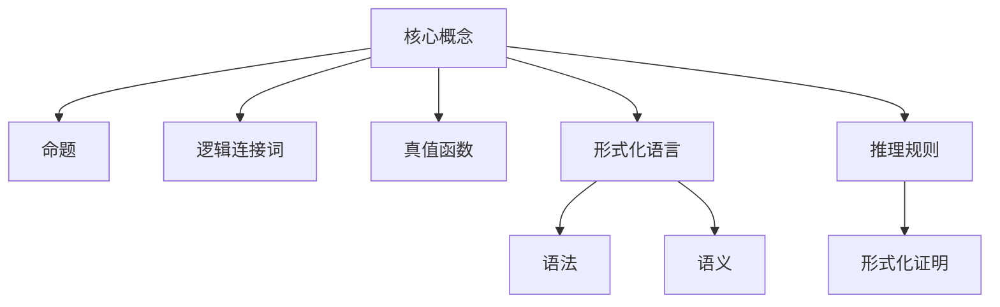

# 数理逻辑：逻辑演算（一）

## 1. 背景介绍

### 1.1 问题的由来

在计算机科学和数学领域中，逻辑是一门研究推理规则和论证方法的学科。它为我们提供了一种严格的框架来分析和操作语句、命题和证明。逻辑演算作为逻辑学的核心部分,探讨了如何使用形式化的符号系统来表示和操作逻辑语句。

随着计算机技术的飞速发展,逻辑演算在许多领域发挥着重要作用。例如,在人工智能领域,逻辑推理是实现智能系统的关键技术之一。在程序验证和形式化方法领域,逻辑演算为构建可靠和正确的软件系统提供了坚实的理论基础。此外,在密码学、数据库理论和量子计算等领域,逻辑演算也扮演着不可或缺的角色。

### 1.2 研究现状

逻辑演算的研究可以追溯到古希腊时期,当时的哲学家们开始探索推理和论证的规则。在现代,逻辑演算已经发展成为一门成熟的学科,涵盖了命题逻辑、谓词逻辑、模态逻辑、非经典逻辑等多个分支。

目前,逻辑演算的研究主要集中在以下几个方面:

1. 逻辑系统的语法和语义:研究如何构建形式化的逻辑系统,并探讨它们的语法和语义特性。
2. 推理规则和证明理论:研究如何在逻辑系统中进行有效的推理和构建正确的证明。
3. 自动定理证明:开发算法和工具,以自动化逻辑推理和定理证明的过程。
4. 逻辑在计算机科学中的应用:探索逻辑在程序验证、人工智能、数据库理论等领域的应用。
5. 非经典逻辑:研究不同于经典逻辑的逻辑系统,如模态逻辑、相关逻辑、非单调逻辑等。

### 1.3 研究意义

逻辑演算的研究对于计算机科学和数学领域具有重要意义:

1. 为构建可靠和正确的计算机系统提供理论基础。
2. 支持人工智能系统的推理和决策过程。
3. 促进形式化方法和程序验证技术的发展。
4. 推动密码学、数据库理论和量子计算等领域的进步。
5. 深化对推理规则和论证方法的理解。

### 1.4 本文结构

本文将全面介绍逻辑演算的核心概念、算法原理和数学模型,并通过实际案例和代码实现来加深读者对该主题的理解。文章结构如下:

1. 背景介绍
2. 核心概念与联系
3. 核心算法原理与具体操作步骤
4. 数学模型和公式详细讲解与举例说明
5. 项目实践:代码实例和详细解释说明
6. 实际应用场景
7. 工具和资源推荐
8. 总结:未来发展趋势与挑战
9. 附录:常见问题与解答

## 2. 核心概念与联系

在探讨逻辑演算的核心概念之前,我们需要先了解一些基本术语和定义。

**命题(Proposition)**: 一个命题是一个可以被判断为真或假的语句。例如,"2 + 3 = 5"是一个真命题,而"今天是星期六"则是一个真或假取决于具体情况的命题。

**逻辑连接词(Logical Connectives)**: 逻辑连接词用于将多个命题连接成更复杂的命题。常见的逻辑连接词包括"与"(∧)、"或"(∨)、"非"(¬)、"蕴含"(→)和"等价"(↔)。

**真值函数(Truth Function)**: 真值函数是一种将命题的真值映射到另一个真值的函数。例如,与运算(∧)是一个真值函数,它将两个命题的真值组合成一个新的真值。

**形式化语言(Formal Language)**: 形式化语言是一种严格定义的符号系统,用于表示和操作逻辑语句。它包括一组规则,定义了语句的合法构造方式。

**语法(Syntax)**: 语法规定了形式化语言中语句的结构和构造规则。它确保语句的形式正确性,但不关注语句的实际含义。

**语义(Semantics)**: 语义赋予形式化语言中的语句以实际含义。它定义了语句的真值条件,并确保语句与现实世界之间的对应关系。

**推理规则(Inference Rules)**: 推理规则是一组用于从已知命题推导出新命题的规则。它们确保推理过程的有效性和正确性。

**形式化证明(Formal Proof)**: 形式化证明是一种使用推理规则从一组前提推导出结论的严格论证过程。它在数学和计算机科学中扮演着重要角色。

这些核心概念相互关联,共同构成了逻辑演算的理论基础。掌握这些概念对于理解和应用逻辑演算至关重要。

## 3. 核心算法原理与具体操作步骤

### 3.1 算法原理概述

逻辑演算的核心算法之一是真值表(Truth Table)算法,它用于计算复合命题的真值。真值表算法的基本思想是枚举所有可能的真值组合,并根据逻辑连接词的定义计算出复合命题的真值。

真值表算法的步骤如下:

1. 列出所有原子命题(Atomic Propositions)。
2. 为每个原子命题生成所有可能的真值组合。
3. 根据逻辑连接词的定义,计算复合命题在每个真值组合下的真值。
4. 将计算结果填入真值表中。

真值表算法虽然简单,但在计算复杂命题的真值时非常有用。它为推理过程提供了一种系统化和可视化的方法,有助于理解和验证逻辑语句的正确性。

### 3.2 算法步骤详解

为了更好地理解真值表算法,让我们通过一个具体示例来详细解释每个步骤。

假设我们有两个原子命题 p 和 q,以及一个复合命题 (p ∧ q) → (p ∨ q)。我们需要计算这个复合命题的真值表。

**步骤 1: 列出所有原子命题**

在这个示例中,我们有两个原子命题 p 和 q。

**步骤 2: 为每个原子命题生成所有可能的真值组合**

对于两个原子命题,有四种可能的真值组合:

| p | q |
|---|---|
| T | T |
| T | F |
| F | T |
| F | F |

**步骤 3: 根据逻辑连接词的定义,计算复合命题在每个真值组合下的真值**

对于每个真值组合,我们需要计算 (p ∧ q) 和 (p ∨ q) 的真值,然后根据蕴含运算 (→) 的定义计算出复合命题的真值。

蕴含运算的定义:

- 如果前件(p ∧ q)为假,后件(p ∨ q)的真值无关紧要,整个蕴含式为真。
- 如果前件为真,后件也为真,整个蕴含式为真。
- 如果前件为真,后件为假,整个蕴含式为假。

根据这个定义,我们可以计算出每个真值组合下复合命题的真值:

| p | q | p ∧ q | p ∨ q | (p ∧ q) → (p ∨ q) |
|---|---|-------|-------|-------------------|
| T | T | T     | T     | T                 |
| T | F | F     | T     | T                 |
| F | T | F     | T     | T                 |
| F | F | F     | F     | T                 |

**步骤 4: 将计算结果填入真值表中**

最后,我们将计算结果填入真值表中,完成了整个算法过程。

真值表算法虽然简单,但在计算复杂命题的真值时非常有用。它为推理过程提供了一种系统化和可视化的方法,有助于理解和验证逻辑语句的正确性。

### 3.3 算法优缺点

真值表算法具有以下优点:

1. **直观性**: 真值表算法提供了一种直观的方式来计算复合命题的真值,有助于理解逻辑语句的含义。
2. **系统性**: 通过枚举所有可能的真值组合,真值表算法确保了计算过程的完整性和正确性。
3. **可视化**: 真值表以表格形式呈现计算过程,便于人类理解和验证。

然而,真值表算法也存在一些缺点:

1. **计算复杂度**: 对于包含大量原子命题的复合命题,真值表算法的计算量会exponentially增长,导致计算效率低下。
2. **局限性**: 真值表算法只适用于命题逻辑,无法处理涉及量词和变量的谓词逻辑语句。
3. **缺乏一般性**: 真值表算法专注于计算命题的真值,无法解决其他类型的逻辑问题,如推理和证明。

尽管存在这些缺点,真值表算法仍然是逻辑演算中一种重要的基本算法,为更高级的推理算法奠定了基础。

### 3.4 算法应用领域

真值表算法在以下领域有着广泛的应用:

1. **数字电路设计**: 在数字电路设计中,真值表被用于描述和分析逻辑门的行为。
2. **编译器构建**: 在编译器构建过程中,真值表可用于优化布尔表达式。
3. **形式化验证**: 真值表算法可用于验证硬件和软件系统是否满足特定的逻辑规范。
4. **人工智能**: 在某些基于规则的人工智能系统中,真值表可用于表示和推理知识库中的逻辑规则。
5. **教育**: 真值表算法常被用作教学逻辑演算的入门工具,有助于学生理解逻辑语句和推理过程。

总的来说,真值表算法虽然简单,但在许多领域都发挥着重要作用,为更高级的逻辑推理和应用奠定了基础。

## 4. 数学模型和公式详细讲解与举例说明

### 4.1 数学模型构建

在逻辑演算中,我们使用数学模型来形式化描述逻辑语句和推理过程。命题逻辑的数学模型由以下几个部分组成:

1. **命题变元(Propositional Variables)**: 用于表示原子命题的符号,通常使用小写字母 p、q、r 等表示。
2. **逻辑连接词(Logical Connectives)**: 用于构建复合命题的运算符,包括与(∧)、或(∨)、非(¬)、蕴含(→)和等价(↔)。
3. **命题公式(Propositional Formulas)**: 使用命题变元和逻辑连接词构建的逻辑语句。
4. **语法规则(Syntactic Rules)**: 定义了命题公式的合法构造方式。
5. **语义规则(Semantic Rules)**: 赋予命题公式以实际含义,定义了它们的真值条件。

我们可以使用以下形式化定义来描述命题逻辑的数学模型:

$$
\begin{align*}
\text{命题变元} &= \{p, q, r, \ldots\} \
\text{命题公式} &::= p \mid \neg \varphi \mid (\varphi \wedge \psi) \mid (\varphi \vee \psi) \mid (\varphi \rightarrow \psi) \mid (\varphi \leftrightarrow \psi)
\end{align*}
$$

其中,$ \varphi $ 和 $ \psi $ 是任意命题公式。

这个形式化定义描述了命题公式的递归构造方式。一个命题公式可以是一个命题变元,也可以是由其他命题公式和逻辑连接词构成的复合命题。

### 4.2 公式推导过程

在命