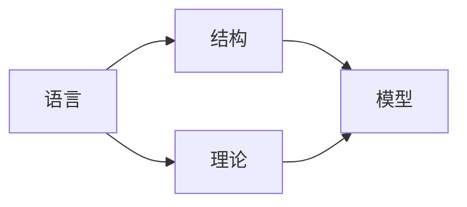

# 模型论基础：数学结构及其理论

关键词：模型论，数学结构，一阶逻辑，完备性定理，紧致性定理

## 1. 背景介绍
### 1.1 问题的由来
模型论是数理逻辑的一个重要分支，它研究数学结构及其性质。模型论起源于20世纪初，由于数学基础危机的出现，数学家们开始反思数学的基础，试图用严格的逻辑方法来重建数学。在这个过程中，模型论应运而生，它为研究数学结构提供了强大的工具和方法。

### 1.2 研究现状
经过一个多世纪的发展，模型论已经成为一个成熟的数学分支。它在代数、几何、拓扑、计算机科学等领域都有广泛的应用。目前，模型论的研究主要集中在以下几个方面：

1. 稳定理论：研究具有良好性质的理论，如 $\omega$-稳定理论、超稳定理论等。
2. o-极小理论：研究具有良好性质的结构，如强极小结构、$\omega$-范畴结构等。
3. 有限模型论：研究有限结构的性质，在计算复杂性理论中有重要应用。
4. 应用模型论：将模型论的方法应用到其他数学分支和计算机科学中，如代数几何的模型论、数据库理论等。

### 1.3 研究意义
模型论的研究对于理解数学结构的本质具有重要意义。通过模型论，我们可以用统一的语言来刻画各种不同的数学结构，揭示它们的共性和特性。同时，模型论为解决许多数学问题提供了新的思路和方法，推动了数学的发展。

此外，模型论在计算机科学中也有广泛应用。很多计算机科学的概念，如数据库、形式验证、类型系统等，都可以用模型论的语言来刻画和研究。模型论为理解和设计这些系统提供了理论基础。

### 1.4 本文结构
本文将系统介绍模型论的基本概念和理论。全文分为9个部分：
1. 背景介绍
2. 核心概念与联系
3. 核心算法原理 & 具体操作步骤
4. 数学模型和公式 & 详细讲解 & 举例说明
5. 项目实践：代码实例和详细解释说明
6. 实际应用场景
7. 工具和资源推荐
8. 总结：未来发展趋势与挑战
9. 附录：常见问题与解答

## 2. 核心概念与联系

模型论的核心概念包括：语言、结构、理论、模型等。它们之间的关系如下图所示：

- 语言：用一阶逻辑语言来刻画数学对象和结构。
- 结构：满足给定语言的解释的对象。
- 理论：用语言描述结构满足的性质，即结构的公理化。
- 模型：理论的一个具体实例，满足该理论的结构。

除此之外，模型论还有许多重要概念，如：
- 基本概念：项、公式、句子、理论等。
- 子结构与扩张：描述结构之间的关系。
- 同构与自同构：刻画结构之间的相似性。
- 极大极小原理：构造模型的重要工具。
- 饱和性：研究结构的性质。
- 类型：刻画元素在结构中的特征。

这些概念之间有着紧密的联系，共同构成了模型论的基本框架。

## 3. 核心算法原理 & 具体操作步骤

### 3.1 算法原理概述

模型论中的核心算法是构造模型的方法。给定一个理论$T$，如何构造它的模型呢？常用的方法有：

1. 极大极小原理：通过构造极大一致集来得到模型。
2. 紧致性定理：利用语言的紧致性，用超积构造模型。
3. 存在量词消去：通过消去存在量词，将问题化归为命题逻辑可满足性问题。

### 3.2 算法步骤详解

下面以极大极小原理为例，详细介绍构造模型的步骤。

极大极小原理的思想是：给定理论$T$，先构造$T$的有限公式集的极大一致集，再由此构造$T$的模型。

具体步骤如下：

1. 构造$T$的有限公式集$\Sigma_0,\Sigma_1,\dots$，使得$\Sigma=\bigcup_{i\in\omega}\Sigma_i$包含$T$中的所有公式。

2. 构造$\Sigma$的极大一致子集列$\Delta_0\subseteq \Delta_1\subseteq \dots$。
   - $\Delta_0=\Sigma_0$
   - 给定$\Delta_n$，构造$\Delta_{n+1}$：
      - 若$\Delta_n\cup\{\varphi_{n+1}\}$一致，则$\Delta_{n+1}=\Delta_n\cup\{\varphi_{n+1}\}$；
      - 否则$\Delta_{n+1}=\Delta_n$。
   - 令$\Delta=\bigcup_{i\in\omega}\Delta_i$，则$\Delta$是$\Sigma$的极大一致子集。

3. 由$\Delta$构造$T$的模型$\mathcal{M}$：
   - $\mathcal{M}$的论域$M$是项的集合。
   - 对每个函数符号$f$，解释$f^\mathcal{M}$为：$f^\mathcal{M}(t_1,\dots,t_n)=ft_1\dots t_n$。
   - 对每个关系符号$R$，解释$R^\mathcal{M}$为：$(t_1,\dots,t_n)\in R^\mathcal{M}$ 当且仅当 $Rt_1\dots t_n\in \Delta$。

可以证明，由此构造出的$\mathcal{M}$是$T$的模型。

### 3.3 算法优缺点

极大极小原理构造模型的优点是：
- 构造出的模型可以是无穷的，对研究无穷结构很有用。
- 构造过程直观，容易理解和实现。

缺点是：
- 构造出的模型一般不是饱和的，对研究结构的性质帮助有限。
- 构造过程是无穷的，不能应用于计算机实现。

### 3.4 算法应用领域
构造模型的算法在模型论研究中有广泛应用，主要用于：
- 证明理论的可满足性。
- 研究结构的性质。
- 构造反例。

此外，在计算机科学中，构造模型的算法也有应用，如在形式验证、定理证明、人工智能等领域。

## 4. 数学模型和公式 & 详细讲解 & 举例说明

### 4.1 数学模型构建

模型论的数学模型可以用二元组 $\langle L,\vDash \rangle$ 来刻画，其中：
- $L$ 是一阶语言，包含非逻辑符号（常元、函数、关系符号）和逻辑符号（连接词、量词、等词、变元）。
- $\vDash$ 是满足关系，刻画语言和结构之间的关系。给定结构$\mathcal{M}$和$L$-公式$\varphi$，$\mathcal{M}\vDash \varphi$表示$\mathcal{M}$满足$\varphi$。

例如，考虑语言$L=\{0,1,+,\cdot\}$，其中$0,1$是常元，$+$和$\cdot$是二元函数。整数结构$\mathbb{Z}=\langle \mathbb{Z};0,1,+,\cdot \rangle$由整数集$\mathbb{Z}$，以及其上的0,1,+,·运算组成，是$L$的一个模型。

给定$L$-句子$\varphi$，定义它的模型类为：

$$
\text{Mod}(\varphi)=\{\mathcal{M}:\mathcal{M}\vDash \varphi\}
$$

所有$L$-句子的模型类构成$L$上的全体结构。

### 4.2 公式推导过程

模型论的核心问题之一是：给定理论（公理集）$T$，如何推导出$T$的逻辑结论？

设$\Sigma$是$L$-语句集，$\varphi$是$L$-语句，称$\varphi$是$\Sigma$的逻辑结论，记为$\Sigma\vDash \varphi$，如果对于任意$L$-结构$\mathcal{M}$，若$\mathcal{M}\vDash \Sigma$，则$\mathcal{M}\vDash \varphi$。

推导逻辑结论的主要方法是使用演绎定理：

$$
T\vDash \varphi \Longleftrightarrow T\vdash \varphi
$$

其中$\vdash$表示形式推演关系。该定理说明，$\varphi$是$T$的逻辑结论，当且仅当$\varphi$能够由$T$形式推演出来。

形式推演的具体规则包括：
- 前提引入规则：$\dfrac{}{A}$（$A$是公理）
- 结论引入规则：$\dfrac{A_1,A_2,\dots,A_n}{B}$（由前提$A_1,A_2,\dots,A_n$可以推出$B$）
- 置换规则、代入规则等。

### 4.3 案例分析与讲解

下面我们以命题逻辑中的一个例子来说明推导过程。

考虑命题逻辑语言$L$，其中只有命题变元和连接词$\lnot,\land,\lor,\to$。设$\Sigma=\{p\to q, p\}$，$\varphi=q$，我们来证明$\Sigma\vdash \varphi$。

证明：
1. $p\to q$ （前提引入）
2. $p$ （前提引入）
3. $q$ （由1,2，结论引入）

由此，我们推导出了$\Sigma\vdash q$，从而根据演绎定理，$\Sigma\vDash q$。

### 4.4 常见问题解答

Q：什么是紧致性定理？它在构造模型中有什么作用？

A：紧致性定理说明，如果理论$T$的每个有穷子集都有模型，则$T$有模型。它的一个重要推论是，如果$T$的每个有穷子集都有无穷模型，则$T$有无穷模型。

紧致性定理在构造模型中的作用是：
1. 证明理论的可满足性。如果$T$的每个有穷子集都可满足，则由紧致性定理，$T$可满足。
2. 构造无穷模型。利用紧致性定理的推论，可以构造理论的无穷模型。
3. 证明存在量词消去结果。

Q：什么是饱和结构？它有什么重要性质？

A：设$\mathcal{M}$是$L$-结构，$A\subseteq M$，称$\mathcal{M}$是$|A|^+$-饱和的，如果对于任意$B\subseteq A$且$|B|<|A|^+$，$B$在$\mathcal{M}$中的1-类型都在$\mathcal{M}$中实现。

饱和结构有许多重要性质，如：
1. 同构性：如果$\mathcal{M}_1$和$\mathcal{M}_2$都是$\kappa$-饱和的，且它们的所有$<\kappa$基数的子结构都同构，则$\mathcal{M}_1$和$\mathcal{M}_2$同构。
2. 泛性：$\kappa$-饱和结构包含同类型的所有$<\kappa$基数结构作为子结构。
3. 分支性：$\kappa$-饱和结构的$\kappa$-分支是$\kappa$-饱和的。

Q：什么是局部有限性？它有什么应用？

A：称结构$\mathcal{M}$是局部有限的，如果它的每个有限子集生成的子结构都是有限的。

局部有限性在有限模型论中有重要应用。局部有限结构的一阶理论有许多良好性质，如：
1. 存在量词消去：每个局部有限结构的一阶理论允许存在量词消去。
2. 有限公理化：每个局部有限结构的一阶理论可以用有限个公理公理化。
3. 多项式时间可判定性：局部有限结构的一阶理论可以在多项式时间内判定。

## 5. 项目实践：代码实例和详细