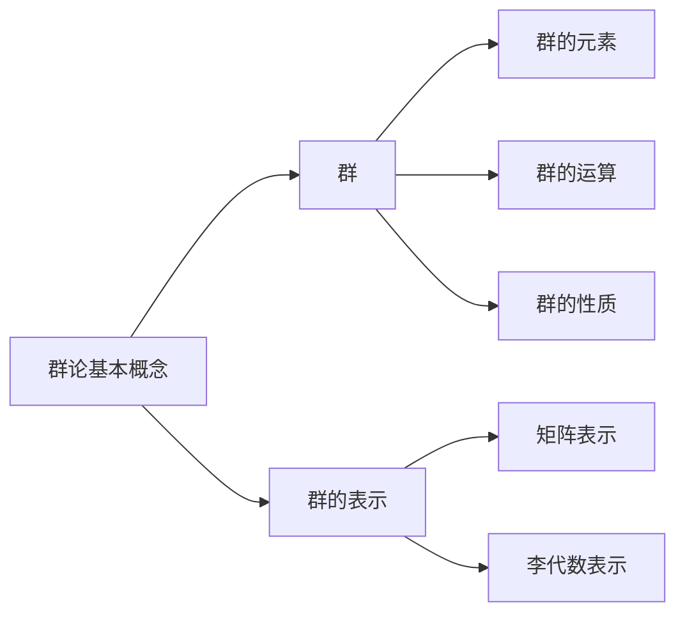
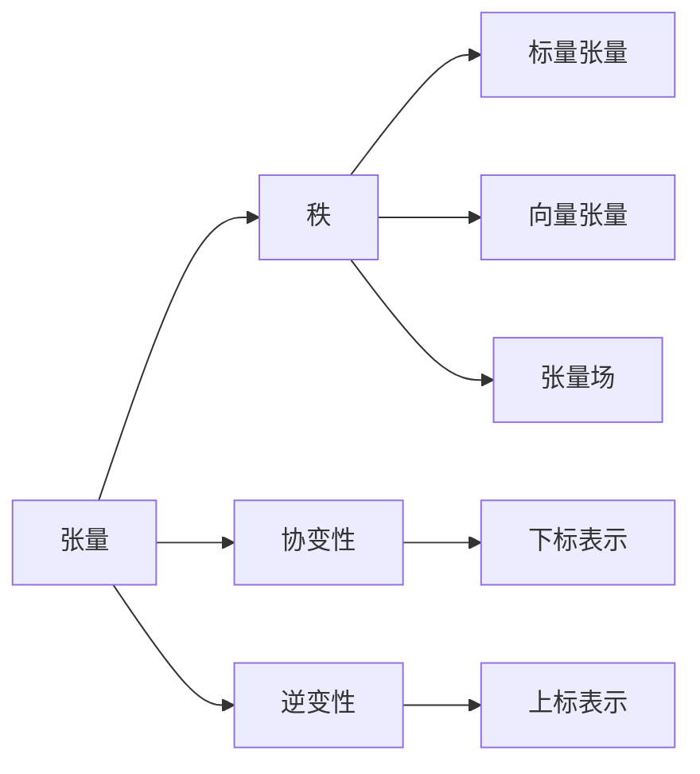
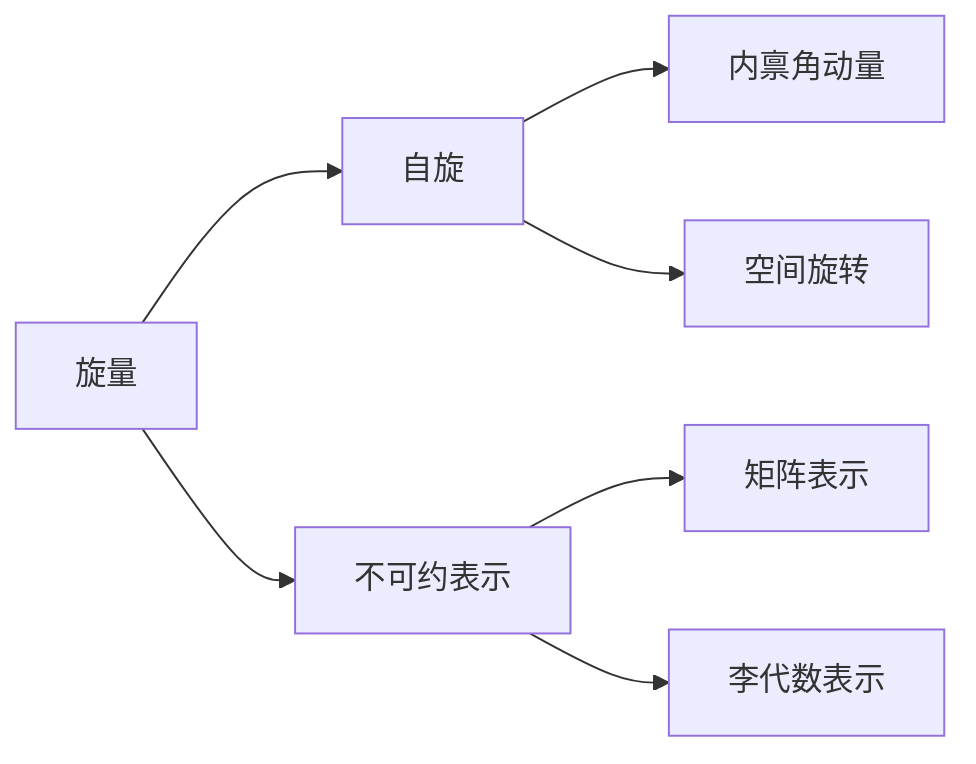
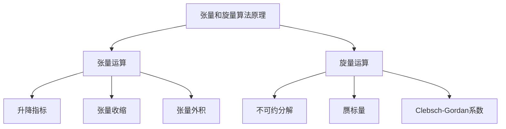

# 物理学中的群论：张量和旋量

## 1. 背景介绍

### 1.1 问题的由来

物理学是一门研究自然界规律的基础科学。在探索宇宙奥秘的过程中,物理学家们发现许多自然现象都具有某种对称性。例如,电磁场在旋转变换下保持不变;粒子的内禀自旋在空间旋转下表现出特殊的行为。这些对称性不仅揭示了自然界的本质规律,也为物理学家提供了强有力的数学工具——群论。

群论是一种研究代数结构的数学理论,它描述了一组元素在二元运算下所满足的代数性质。物理学中的许多对称性都可以用群论来精确描述和操作。因此,群论在物理学中扮演着极其重要的角色,成为物理学家探索自然奥秘的利器。

### 1.2 研究现状

近代物理学的发展离不开群论的指导作用。例如,量子力学中的对称性原理是建立在群论基础之上的;相对论中的洛伦兹变换群描述了时空的对称性;粒子物理学中的规范场论依赖于规范对称性群。可以说,群论已经渗透到物理学的方方面面,成为物理学家的必修课。

然而,群论在物理学中的应用并非一蹴而就。物理学家们不断探索群论与物理学之间的内在联系,努力将抽象的群论语言与具体的物理问题相结合。这一过程催生了张量分析、表示论等重要数学工具,极大地推动了物理学的发展。

### 1.3 研究意义

深入理解物理学中的群论对于探索自然界的规律至关重要。群论不仅为物理学提供了强有力的数学语言,更重要的是揭示了自然界内在的对称性原理。掌握群论知识有助于物理学家们发现新的对称性,建立新的物理模型,预言新的物理现象。

此外,物理学中的群论理论也为其他学科带来了重要启示。例如,化学中的分子对称性群、晶体学中的空间群、生物学中的对称性模式等,都可以借鉴物理学中的群论方法。因此,研究物理学中的群论不仅有助于推进物理学自身的发展,也将为其他学科的进步贡献力量。

### 1.4 本文结构

本文将系统地介绍物理学中的群论及其应用,着重探讨张量和旋量这两个重要概念。全文共分为八个部分:

1. 背景介绍
2. 核心概念与联系
3. 核心算法原理与具体操作步骤
4. 数学模型和公式详细讲解与举例说明
5. 项目实践:代码实例和详细解释说明
6. 实际应用场景
7. 工具和资源推荐
8. 总结:未来发展趋势与挑战

接下来,我们将从群论的基本概念出发,逐步深入探讨张量和旋量在物理学中的应用,并介绍相关的算法原理、数学模型和项目实践。最后,我们将总结物理学中群论的发展趋势和面临的挑战。

## 2. 核心概念与联系

在探讨张量和旋量之前,我们需要先了解一些群论的基本概念。群论描述了一组元素在二元运算下所满足的代数性质,是研究对称性的重要数学工具。

### 2.1 群的定义

群是一个代数结构,由一个非空集合 $G$ 和一个在 $G$ 上的二元运算 $*$ 组成,需满足以下四个公理:

1. 封闭性:对于 $G$ 中任意两个元素 $a,b$,它们的运算结果 $a*b$ 也属于集合 $G$。
2. 结合律:对于 $G$ 中任意三个元素 $a,b,c$,都有 $(a*b)*c=a*(b*c)$。
3. 存在单位元:在 $G$ 中存在一个单位元 $e$,对于任意元素 $a$,都有 $e*a=a*e=a$。
4. 存在逆元素:对于 $G$ 中任意元素 $a$,都存在一个逆元素 $a^{-1}$,使得 $a*a^{-1}=a^{-1}*a=e$。

群的概念非常抽象,但它描述了自然界中许多对称性现象的本质。例如,空间中的旋转变换就构成了一个群。

### 2.2 群的表示

群的表示是将群的元素对应到其他代数结构(如矩阵、线性变换等)上的同构映射。常见的群表示有:

1. 矩阵表示:将群的元素表示为矩阵,群的运算对应矩阵的乘法。
2. 李代数表示:将群的元素无穷小变换表示为微分算子,群的运算对应算子的切换。

群的表示为我们研究群的性质提供了有力的工具,也为物理学中的对称性问题提供了简洁的数学描述。

### 2.3 张量

张量是描述物理量在不同坐标系下变换规律的数学工具。在物理学中,我们经常遇到一些物理量(如向量、矩阵等)在不同坐标系下的表示形式不同,但它们之间存在某种内在的对应关系。张量就是用来刻画这种对应关系的数学对象。

张量的主要特征包括:

1. 秩:张量的秩指张量的阶数,标量为0阶张量,向量为1阶张量,矩阵为2阶张量等。
2. 协变性和逆变性:张量的分量在不同坐标系下的变换规律可分为协变分量(用下标表示)和逆变分量(用上标表示)。

张量在物理学中有着广泛的应用,例如电磁场张量、能量动量张量、曲率张量等,都是描述自然界本质的重要数学工具。

### 2.4 旋量

旋量是研究粒子自旋时提出的一种特殊的张量。粒子的自旋是一种内禀的角动量,在空间旋转变换下表现出特殊的行为。旋量就是用来描述这种行为的数学对象。

旋量的主要特征包括:

1. 自旋:旋量描述了粒子在空间旋转变换下的行为,体现了粒子的内禀自旋性质。
2. 不可约表示:旋量通常用群的不可约表示来描述,可以是矩阵表示或李代数表示。

旋量在量子力学和相对论中扮演着重要角色,是描述自然界微观世界的关键数学工具。例如,狄拉克旋量描述了电子的自旋行为,是建立量子电动力学的基础。

通过上述概念的介绍,我们可以看出张量和旋量虽然来源不同,但都是描述自然界对称性的重要数学工具。它们在物理学中扮演着至关重要的角色,为我们探索自然奥秘提供了强有力的数学语言。

## 3. 核心算法原理与具体操作步骤

### 3.1 算法原理概述

在物理学中,我们经常需要处理张量和旋量的各种运算,例如张量的升降指标、张量的收缩、旋量的不可约分解等。这些运算都有相应的算法原理,我们需要掌握这些原理才能正确地操作张量和旋量。

张量运算的核心原理包括:

1. 升降指标:通过度规张量(通常是度规张量$g_{\mu\nu}$)将协变指标和逆变指标相互转换。
2. 张量收缩:将张量的一个协变指标与一个逆变指标按张量乘积规则相乘并求和。
3. 张量外积:将两个张量的分量进行直积运算,得到一个更高阶的张量。

旋量运算的核心原理包括:

1. 不可约分解:将旋量按其自旋量子数分解为不可约表示的直和。
2. 赝标量:通过对旋量取迹得到一个在空间反射下改变符号的伪标量。
3. Clebsch-Gordan系数:将两个不可约表示耦合成更高自旋的不可约表示。

掌握了这些核心原理,我们就能够灵活地操作张量和旋量,解决物理学中的各种对称性问题。

### 3.2 算法步骤详解

接下来,我们将详细介绍一些常见的张量和旋量算法的具体步骤。

#### 3.2.1 张量升降指标算法

设有一个二阶张量 $T^{\mu\nu}$,我们想将其中的一个逆变指标 $\nu$ 降为协变指标,得到 $T^{\mu}_{\phantom{\mu}\nu}$,步骤如下:

1. 引入度规张量 $g_{\mu\nu}$,其中 $g_{\mu\nu}g^{\nu\rho}=\delta^\rho_\mu$。
2. 计算 $T^{\mu}_{\phantom{\mu}\nu}=T^{\mu\rho}g_{\rho\nu}$。

如果想将协变指标 $\mu$ 升为逆变指标,步骤类似:

1. 引入度规张量 $g^{\mu\nu}$,其中 $g_{\mu\nu}g^{\nu\rho}=\delta^\rho_\mu$。
2. 计算 $T^{\mu\nu}=T^{\rho}_{\phantom{\rho}\nu}g_{\rho}^{\phantom{\rho}\mu}$。

这个算法的关键在于利用度规张量作为"桥梁",将协变指标和逆变指标相互转换。

#### 3.2.2 张量收缩算法

设有一个四阶张量 $T^{\mu\nu\rho\sigma}$,我们想将其收缩成一个二阶张量 $T^{\mu\nu}$,步骤如下:

1. 任取两个指标,例如 $\rho$ 和 $\sigma$。
2. 计算 $T^{\mu\nu}=T^{\mu\nu\rho\sigma}g_{\rho\sigma}$。

这个算法的本质是将协变指标与逆变指标按张量乘积规则相乘并求和,从而降低张量的阶数。我们也可以继续收缩,将 $T^{\mu\nu}$ 收缩成一个标量 $T$。

#### 3.2.3 旋量不可约分解算法

设有一个自旋为 $j$ 的旋量 $\Psi^{(j)}$,我们想将其分解为不可约表示的直和,步骤如下:

1. 确定 $\Psi^{(j)}$ 的矩阵表示 $D^{(j)}(R)$,其中 $R$ 为空间旋转。
2. 利用矩阵对角化或其他方法,将 $D^{(j)}(R)$ 分解为不可约表示 $D^{(j_1)}\oplus D^{(j_2)}\oplus\cdots$。
3. 对应地,将 $\Psi^{(j)}$ 分解为 $\Psi^{(j_1)}\oplus\Psi^{(j_2)}\oplus\cdots$。

这个算法的关键在于利用矩阵表示的不可约性质,将旋量按其自旋量子数进行分解。

以上是一些常见的张量和旋量算法步骤,通过掌握这些算法,我们就能够灵活地操作张量和旋量