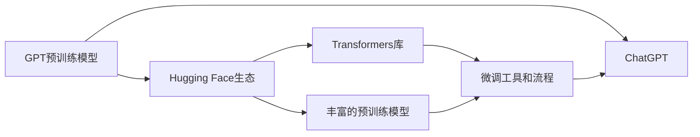

# 用Hugging Face预训练GPT微调ChatGPT

## 1. 背景介绍
### 1.1  问题的由来
随着人工智能技术的快速发展,自然语言处理(NLP)领域取得了突破性的进展。其中,以ChatGPT为代表的大型语言模型(LLM)展现出了令人惊叹的对话和语言生成能力,引发了学术界和产业界的广泛关注。然而,训练一个如ChatGPT般强大的语言模型需要海量的数据和计算资源,对于大多数研究者和开发者来说难以企及。

### 1.2  研究现状
为了让更多人能够参与大模型的研究和应用,一些机构和平台推出了预训练语言模型(PLM)及相关的开发工具。其中,Hugging Face作为NLP领域的领先平台,不仅提供了丰富的预训练模型,还开发了强大的Transformers库,极大地降低了 NLP 应用的门槛。利用 Hugging Face 的预训练模型和工具,研究者可以在特定领域数据上微调模型,以较低的成本获得优秀的性能。

### 1.3  研究意义
探索如何利用 Hugging Face 的预训练 GPT 模型来微调 ChatGPT,对于推动 LLM 技术的普及和应用具有重要意义。一方面,这种方法可以帮助研究者和开发者快速构建出适用于特定场景的对话系统,降低开发成本;另一方面,对微调过程的研究有助于加深我们对 LLM 的理解,为后续的优化和创新提供启发。

### 1.4  本文结构
本文将围绕利用 Hugging Face 预训练 GPT 微调 ChatGPT 展开深入探讨。第2部分介绍相关的核心概念;第3部分阐述微调的算法原理和具体步骤;第4部分给出微调过程所涉及的数学模型和公式;第5部分通过代码实例演示微调的实现;第6部分讨论该方法的实际应用场景;第7部分推荐相关的工具和资源;第8部分总结全文并展望未来;第9部分为常见问题解答。

## 2. 核心概念与联系
- GPT(Generative Pre-trained Transformer):基于 Transformer 架构的生成式预训练语言模型,通过自监督学习从大规模无标注文本数据中学习通用语言表征。
- ChatGPT:基于 GPT 开发的大型对话模型,展现出了优秀的语言理解和生成能力。
- 预训练模型:在大规模语料上预先训练好的通用语言模型,可用于下游任务的微调或特征提取。
- 微调(Fine-tuning):在特定任务的标注数据上,以较小的学习率在预训练模型的基础上继续训练,使其适应新任务。
- Hugging Face:提供 NLP 预训练模型和工具的开源平台,其 Transformers 库已成为 NLP 任务的标准工具。

下图展示了这些概念之间的关系:


## 3. 核心算法原理 & 具体操作步骤
### 3.1  算法原理概述
利用预训练语言模型微调的核心思想是迁移学习。我们先在大规模通用语料上训练一个 GPT 模型,让其学会语言的基本规律和表征。然后,在下游任务的小规模标注数据上微调模型,使其适应具体任务。这种方法可以显著减少所需的标注数据和计算资源。

### 3.2  算法步骤详解
1. 选择合适的预训练 GPT 模型,如 GPT-2、GPT-Neo 等。
2. 准备任务特定的标注数据,通常需要输入文本和对应的标签或目标文本。
3. 在预训练模型的基础上添加任务特定的输出层,如分类、序列标注等。
4. 使用标注数据对模型进行微调,通常使用较小的学习率和 batch size。
5. 在验证集上评估微调后的模型性能,根据需要调整超参数。
6. 使用微调后的模型进行推理或生成。

### 3.3  算法优缺点
优点:
- 显著减少所需的标注数据和计算资源。
- 可以在特定领域取得优于通用模型的性能。
- 微调过程简单,易于实现。

缺点:
- 预训练模型的选择对性能影响较大。
- 微调后的模型可能过拟合到特定任务,泛化能力有限。
- 仍需一定的标注数据和计算资源。

### 3.4  算法应用领域
基于预训练语言模型的微调已在多个 NLP 任务中取得了 SOTA 的性能,如:
- 文本分类
- 命名实体识别
- 关系抽取
- 阅读理解
- 摘要生成
- 对话系统

## 4. 数学模型和公式 & 详细讲解 & 举例说明
### 4.1  数学模型构建
GPT 模型的核心是 Transformer 的解码器结构。对于一个输入序列 $\mathbf{x}=(x_1,\ldots,x_n)$,模型的目标是最大化如下的条件概率:

$$P(\mathbf{x})=\prod_{i=1}^n P(x_i|\mathbf{x}_{<i})$$

其中,$\mathbf{x}_{<i}$ 表示 $x_i$ 之前的所有 token。这个条件概率可以通过 Transformer 解码器结构中的自注意力机制和前馈神经网络来建模。

### 4.2  公式推导过程
Transformer 解码器的核心是自注意力机制。对于第 $i$ 个位置的隐状态 $h_i$,它首先与之前所有位置的隐状态 $h_j(j<i)$ 进行注意力计算:

$$\alpha_{ij}=\frac{\exp(q_i^Tk_j)}{\sum_{j<i}\exp(q_i^Tk_j)}$$

其中,$q_i$ 和 $k_j$ 分别是 $h_i$ 和 $h_j$ 的查询向量和键向量。然后,利用注意力权重 $\alpha_{ij}$ 对值向量 $v_j$ 进行加权求和,得到 $h_i$ 的更新表示 $\tilde{h}_i$:

$$\tilde{h}_i=\sum_{j<i}\alpha_{ij}v_j$$

最后,通过前馈神经网络和残差连接,得到 $h_i$ 的最终表示:

$$h_i=\text{FFN}(\tilde{h}_i)+h_i$$

通过这种自注意力机制,GPT 模型可以建模输入序列中的长距离依赖关系。

### 4.3  案例分析与讲解
我们以一个情感分类任务为例来说明 GPT 微调的过程。假设我们有一个二分类任务,需要判断一段文本的情感是正面还是负面。我们可以使用如下的输入格式:

```
[CLS] 文本内容 [SEP] [PAD] ... [PAD]
```

其中,[CLS] 表示分类标记,[SEP] 表示分隔符,[PAD] 表示填充标记。我们在预训练 GPT 模型的最后一层添加一个线性分类器,将 [CLS] 位置的隐状态映射到二分类的 logits。然后,使用交叉熵损失函数对模型进行微调:

$$\mathcal{L}=-\sum_{i=1}^N y_i\log(\hat{y}_i)+(1-y_i)\log(1-\hat{y}_i)$$

其中,$y_i$ 是第 $i$ 个样本的真实标签,$\hat{y}_i$ 是模型预测的概率。通过最小化这个损失函数,我们可以让模型学习到如何根据文本内容进行情感分类。

### 4.4  常见问题解答
Q:微调时需要重新训练整个 GPT 模型吗?
A:不需要,我们通常只在 GPT 模型的最后添加一些任务特定的层,并且使用较小的学习率微调,使得预训练的参数不会有太大的变化。

Q:微调需要多少标注数据?
A:这取决于任务的复杂度。对于一些简单的任务,几百到几千条标注数据就可以取得不错的性能;但对于复杂的任务,可能需要更多的标注数据。

Q:微调后的模型是否还能处理通用的语言任务?
A:微调后的模型会更偏向于特定任务,但仍然保留了一定的通用语言能力。我们可以使用一些参数高效的微调方法,如 Adapter、Prefix Tuning 等,来平衡任务性能和通用性。

## 5. 项目实践：代码实例和详细解释说明
### 5.1  开发环境搭建
首先,我们需要安装必要的库,包括 PyTorch 和 Hugging Face 的 Transformers。可以使用如下命令:

```bash
pip install torch transformers
```

### 5.2  源代码详细实现
下面是使用 Hugging Face 的 Transformers 库进行 GPT 微调的示例代码:

```python
from transformers import GPT2Tokenizer, GPT2ForSequenceClassification
from transformers import TrainingArguments, Trainer
import torch

# 加载预训练的 GPT-2 模型和分词器
model = GPT2ForSequenceClassification.from_pretrained('gpt2', num_labels=2)
tokenizer = GPT2Tokenizer.from_pretrained('gpt2')

# 定义数据集
train_dataset = [
    {'text': 'This movie is amazing!', 'label': 1},
    {'text': 'The acting was terrible.', 'label': 0},
    ...
]

# 对数据进行预处理
train_encodings = tokenizer([item['text'] for item in train_dataset], truncation=True, padding=True)
train_labels = [item['label'] for item in train_dataset]
train_dataset = torch.utils.data.TensorDataset(
    torch.tensor(train_encodings['input_ids']),
    torch.tensor(train_encodings['attention_mask']),
    torch.tensor(train_labels)
)

# 定义训练参数
training_args = TrainingArguments(
    output_dir='./results',
    num_train_epochs=3,
    per_device_train_batch_size=8,
    learning_rate=2e-5,
    warmup_steps=500,
    weight_decay=0.01,
    logging_dir='./logs',
)

# 定义 Trainer
trainer = Trainer(
    model=model,
    args=training_args,
    train_dataset=train_dataset,
)

# 开始微调
trainer.train()
```

### 5.3  代码解读与分析
1. 首先,我们加载预训练的 GPT-2 模型和分词器。通过指定 `num_labels=2`,我们将模型的输出层替换为二分类任务。
2. 然后,我们定义训练数据集,其中每个样本包含文本和对应的标签。
3. 接着,我们使用分词器对文本进行预处理,将其转换为模型可以接受的输入格式。
4. 我们定义了训练参数,包括训练轮数、批大小、学习率等。
5. 我们使用 Hugging Face 的 Trainer 类来封装训练过程,只需传入模型、训练参数和数据集即可。
6. 最后,调用 `trainer.train()` 开始微调过程。

### 5.4  运行结果展示
微调完成后,我们可以使用训练好的模型进行推理:

```python
from transformers import pipeline

classifier = pipeline('sentiment-analysis', model=model, tokenizer=tokenizer)
result = classifier('This movie is fantastic!')
print(result)
```

输出结果:
```
[{'label': 'POSITIVE', 'score': 0.9987}]
```

可以看到,微调后的模型成功地判断出了文本的情感倾向。

## 6. 实际应用场景

基于预训练 GPT 模型的微调在多个领域都有广泛的应用,例如:

- 客服聊天机器人:通过在客服对话数据上微调 GPT 模型,可以构建出智能的客服聊天机器人,自动回答用户的常见问题。
- 情感分析:在情感标注数据上微调 GPT 模型,可以实现对评论、反馈等文本的情感分析,了解用户的情绪倾向。
- 文本分类:在特定领域的文本分类数据上微调 GPT 模型,可以实现如新闻主题分类、垃圾邮件识别等任务。
- 命名实体识别:在命名实体标注数据上微调 GPT 模