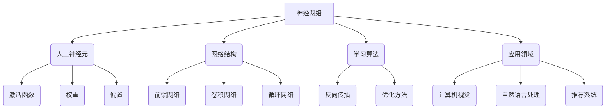

神经网络 (Neural Networks) 原理与代码实例讲解

# 1. 背景介绍

## 1.1 问题的由来

在过去几十年中，人工智能领域取得了令人瞩目的进展,其中神经网络无疑是最重要和最成功的技术之一。神经网络的概念源于对生物神经系统的模拟,旨在构建能够像人脑一样学习和处理信息的系统。

随着数据的爆炸式增长和计算能力的不断提高,神经网络在语音识别、图像处理、自然语言处理等领域展现出了强大的能力。然而,神经网络的内部机理一直是个黑箱,其工作原理并不十分清晰,这也成为了神经网络发展的一大障碍。

## 1.2 研究现状

近年来,对神经网络内部机理的研究日益受到重视。研究人员通过理论分析和实证研究,逐步揭开了神经网络的神秘面纱。例如,我们现在更好地理解了神经网络如何学习特征表示、如何进行模式识别,以及不同网络结构的优缺点等。

与此同时,神经网络的应用范围也在不断扩大。除了传统的计算机视觉和自然语言处理领域,神经网络还开始在推荐系统、金融预测、医疗诊断等领域发挥作用。

## 1.3 研究意义 

深入理解神经网络的原理对于更好地利用这一强大技术至关重要。只有掌握了神经网络的本质,我们才能更好地设计网络结构、优化训练过程,并解决实际应用中遇到的各种问题。

同时,揭示神经网络内部机理也有助于构建更透明、更可解释的人工智能系统,从而提高人们对这些系统的信任度。可解释性是人工智能系统被广泛接受和应用的关键因素之一。

## 1.4 本文结构

本文将全面介绍神经网络的基本原理、核心算法、数学模型,并通过实例代码对这些概念进行详细讲解。文章包括以下几个主要部分:

1. 核心概念与联系
2. 核心算法原理与具体操作步骤
3. 数学模型和公式详细讲解与举例说明
4. 项目实践:代码实例和详细解释说明
5. 实际应用场景
6. 工具和资源推荐
7. 总结:未来发展趋势与挑战
8. 附录:常见问题与解答

# 2. 核心概念与联系

神经网络是一种由人工神经元组成的网络结构,旨在模拟生物神经系统的工作原理。每个神经元通过权重和偏置对输入信号进行加权求和,然后通过激活函数进行非线性转换,产生输出信号。

神经网络可以采用不同的网络结构,如前馈网络、卷积网络和循环网络等。通过学习算法(如反向传播)和优化方法(如梯度下降),神经网络可以自动从数据中学习特征表示和模式,并应用于计算机视觉、自然语言处理、推荐系统等各种领域。

# 3. 核心算法原理与具体操作步骤

## 3.1 算法原理概述

神经网络的核心算法是反向传播(Back Propagation,BP)算法。BP算法包括两个主要过程:前向传播(Forward Propagation)和反向传播(Back Propagation)。

在前向传播过程中,输入数据经过多层神经元的加权求和和激活函数的非线性转换,最终得到网络的输出。在反向传播过程中,根据输出与期望值之间的误差,利用链式法则计算每个权重对误差的影响程度,并沿着与前向传播相反的方向,更新网络中的权重和偏置,使得误差不断减小。

通过不断迭代这个过程,神经网络就能够从训练数据中学习到特征表示和模式映射,从而对新的输入数据做出正确的预测或分类。

## 3.2 算法步骤详解

1. **初始化网络权重和偏置**

   首先,需要对神经网络中的所有权重和偏置进行初始化,通常采用小的随机值。合理的初始化方式对于网络的收敛性能有重要影响。

2. **前向传播**

   - 输入层:将输入数据传递给第一层神经元。
   - 隐藏层:对于每个隐藏层神经元,计算其加权输入,然后通过激活函数(如Sigmoid或ReLU)进行非线性转换,得到该神经元的输出。
   - 输出层:重复上一步骤,得到网络的最终输出。

3. **计算误差**

   将网络输出与期望输出进行比较,计算误差(如均方误差)。

4. **反向传播**

   - 输出层:计算每个输出神经元的误差对其加权输入的偏导数。
   - 隐藏层:利用链式法则,计算每个隐藏层神经元的误差对其加权输入的偏导数。
   - 权重更新:对于每个权重,计算其对误差的偏导数,并根据学习率进行权重更新。

5. **迭代训练**

   重复步骤2-4,直到网络收敛或达到最大迭代次数。

## 3.3 算法优缺点

**优点:**

- 能够自动从数据中学习特征表示和模式映射,无需人工设计特征。
- 具有很强的非线性拟合能力,可以解决复杂的非线性问题。
- 在许多领域展现出卓越的性能,如图像识别、语音识别等。

**缺点:**

- 需要大量的训练数据和计算资源,训练过程计算量大。
- 存在过拟合的风险,需要采取正则化等方法进行控制。
- 网络结构和超参数的选择对性能影响很大,需要大量的调试和经验。
- 神经网络的内部机理仍然是一个黑箱,缺乏可解释性。

## 3.4 算法应用领域

神经网络在以下领域有广泛的应用:

- **计算机视觉**:图像分类、目标检测、语义分割等。
- **自然语言处理**:机器翻译、文本生成、情感分析等。
- **语音识别**:自动语音识别、语音合成等。
- **推荐系统**:个性化推荐、内容推荐等。
- **金融**:股票预测、欺诈检测、风险管理等。
- **医疗**:医学图像分析、疾病诊断、药物设计等。

# 4. 数学模型和公式详细讲解与举例说明

## 4.1 数学模型构建

神经网络的数学模型可以表示为一个由多层神经元组成的函数复合:

$$
y = f(W_L \cdot f(W_{L-1} \cdot ... \cdot f(W_1 \cdot x + b_1) + b_{L-1}) + b_L)
$$

其中:

- $x$是输入向量
- $y$是输出向量
- $W_i$是第$i$层的权重矩阵
- $b_i$是第$i$层的偏置向量
- $f$是激活函数,如Sigmoid或ReLU

每一层的输出都是上一层输出经过权重矩阵的线性变换,再通过激活函数进行非线性转换得到的。

## 4.2 公式推导过程

我们以单个神经元为例,推导其前向传播和反向传播的公式。

**前向传播:**

设单个神经元的输入为$x_1, x_2, ..., x_n$,对应的权重为$w_1, w_2, ..., w_n$,偏置为$b$,激活函数为$f$,则该神经元的输出为:

$$
y = f\left(\sum_{i=1}^n w_i x_i + b\right)
$$

**反向传播:**

假设该神经元的期望输出为$t$,误差为$E = \frac{1}{2}(t - y)^2$,我们需要计算误差对权重和偏置的偏导数,以便进行梯度下降更新。

对于权重$w_i$:

$$
\frac{\partial E}{\partial w_i} = \frac{\partial E}{\partial y} \cdot \frac{\partial y}{\partial w_i} = -(t - y) \cdot f'(\text{net}) \cdot x_i
$$

其中$\text{net} = \sum_{i=1}^n w_i x_i + b$,  $f'$是激活函数的导数。

对于偏置$b$:

$$
\frac{\partial E}{\partial b} = \frac{\partial E}{\partial y} \cdot \frac{\partial y}{\partial b} = -(t - y) \cdot f'(\text{net})
$$

通过上述公式,我们可以计算出每个权重和偏置对误差的影响程度,并进行梯度下降更新。

## 4.3 案例分析与讲解

考虑一个简单的二分类问题,我们构建一个只有一个隐藏层的小型神经网络。假设输入数据为二维向量$\mathbf{x} = (x_1, x_2)$,输出为0或1,表示两个类别。

**网络结构:**
- 输入层:2个神经元
- 隐藏层:3个神经元,使用Sigmoid激活函数
- 输出层:1个神经元,使用Sigmoid激活函数

**前向传播:**

1. 输入层到隐藏层:

$$
\begin{aligned}
\text{net}_1 &= w_{11} x_1 + w_{12} x_2 + b_1 \
h_1 &= \sigma(\text{net}_1) \
\text{net}_2 &= w_{21} x_1 + w_{22} x_2 + b_2 \
h_2 &= \sigma(\text{net}_2) \
\text{net}_3 &= w_{31} x_1 + w_{32} x_2 + b_3 \
h_3 &= \sigma(\text{net}_3)
\end{aligned}
$$

2. 隐藏层到输出层:

$$
\text{net}_\text{out} = w_1 h_1 + w_2 h_2 + w_3 h_3 + b_\text{out}
$$

$$
y = \sigma(\text{net}_\text{out})
$$

其中$\sigma$是Sigmoid函数:$\sigma(x) = \frac{1}{1 + e^{-x}}$。

**反向传播:**

假设期望输出为$t$,误差为$E = \frac{1}{2}(t - y)^2$,我们计算误差对每个权重和偏置的偏导数:

$$
\begin{aligned}
\frac{\partial E}{\partial w_1} &= (t - y) \cdot y \cdot (1 - y) \cdot h_1 \
\frac{\partial E}{\partial w_2} &= (t - y) \cdot y \cdot (1 - y) \cdot h_2 \
\frac{\partial E}{\partial w_3} &= (t - y) \cdot y \cdot (1 - y) \cdot h_3 \
\frac{\partial E}{\partial b_\text{out}} &= (t - y) \cdot y \cdot (1 - y)
\end{aligned}
$$

对于隐藏层的权重和偏置,需要利用链式法则:

$$
\begin{aligned}
\frac{\partial E}{\partial w_{ij}} &= (t - y) \cdot y \cdot (1 - y) \cdot w_j \cdot h_i \cdot (1 - h_i) \cdot x_j \
\frac{\partial E}{\partial b_i} &= (t - y) \cdot y \cdot (1 - y) \cdot w_i \cdot h_i \cdot (1 - h_i)
\end{aligned}
$$

其中$i$表示隐藏层神经元的编号,  $j$表示输出层神经元的编号。

通过上述公式,我们可以计算出每个权重和偏置对误差的影响程度,并进行梯度下降更新,从而不断减小网络的误差,提高分类性能。

## 4.4 常见问题解答

**1. 为什么需要激活函数?**

激活函数引入了非线性,使得神经网络能够拟合复