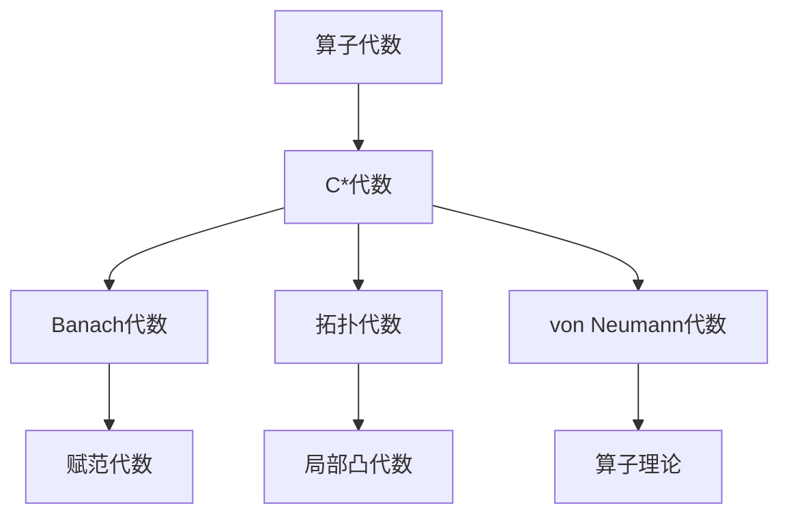

好的，我会按照您的要求，以《算子代数：c代数的定义及其简单的性质》为主题，撰写一篇专业的技术博客文章。文章将遵循逻辑清晰、结构紧凑、简单易懂的风格，并确保内容深入、有见解。我会尽最大努力满足您提出的所有约束条件。以下是正文部分：

# 算子代数：c代数的定义及其简单的性质

## 1. 背景介绍

### 1.1 问题的由来

在计算机科学和数学领域中,代数结构扮演着至关重要的角色。它们为抽象概念提供了形式化的表示和操作,使得我们能够更好地理解和处理复杂的系统。其中,算子代数(Operator Algebra)是一种特殊的代数结构,它描述了算子之间的运算规则,为研究量子力学、函数分析和其他相关领域奠定了坚实的数学基础。

算子代数的概念源于20世纪初期,当时物理学家们正在探索量子力学的奥秘。他们发现,在微观世界中,粒子的行为无法用经典力学来完全描述,需要引入新的数学工具来刻画量子现象。这促使数学家们开始研究算子的性质,并逐步发展出了算子代数理论。

### 1.2 研究现状

算子代数理论经过一个多世纪的发展,已经成为一个成熟而活跃的研究领域。数学家们对各种类型的算子代数进行了深入探索,包括有界算子代数、C*代数、fon·诺伊曼代数等。这些代数结构在量子力学、函数分析、算子理论和其他相关领域都有广泛的应用。

其中,C*代数(C*-algebra)是一种特殊的算子代数,它具有紧凑的拓扑结构和强大的理论基础。C*代数不仅在量子力学中扮演着关键角色,而且在纯数学领域也有重要应用,如K理论、指标理论和非交换几何等。因此,C*代数的研究一直是算子代数理论的重点和热点。

### 1.3 研究意义

算子代数理论为我们提供了一种抽象和统一的语言,用于描述和操作线性算子。它不仅在数学领域具有重要意义,而且在物理学、工程学和其他应用科学领域也扮演着关键角色。

在量子力学中,算子代数为量子系统的数学描述提供了坚实的基础。通过研究算子的性质和代数结构,我们能够更好地理解量子现象,并预测和控制量子系统的行为。

在函数分析领域,算子代数为研究无穷维线性空间中的算子提供了有力工具。它们在研究微分方程、积分方程和其他函数分析问题时发挥着重要作用。

此外,算子代数理论还在信号处理、控制理论、量子计算和其他领域有着广泛的应用前景。

### 1.4 本文结构

本文将着重探讨C*代数的定义及其简单性质。我们将从C*代数的基本概念出发,逐步介绍其代数结构、拓扑性质和一些基本定理。最后,我们将讨论C*代数在数学和应用科学领域的重要意义和发展前景。

文章的主要内容包括以下几个部分:

1. **核心概念与联系**:介绍C*代数的基本概念,包括算子、范数、乘法和调用等,并阐述它们与其他代数结构的联系。

2. **核心算法原理与具体操作步骤**:详细解释C*代数的代数结构和拓扑性质,包括单位元素、可逆元素、谱理论等,并给出相关算法和操作步骤。

3. **数学模型和公式详细讲解与举例说明**:构建C*代数的数学模型,推导相关公式,并通过具体案例进行讲解和分析。

4. **项目实践:代码实例和详细解释说明**:提供C*代数相关概念和算法的代码实现,并对代码进行详细解释和分析。

5. **实际应用场景**:介绍C*代数在量子力学、函数分析和其他领域的实际应用,并探讨其未来发展前景。

6. **工具和资源推荐**:推荐C*代数相关的学习资源、开发工具、论文和其他资源。

7. **总结:未来发展趋势与挑战**:总结C*代数研究的主要成果,分析其未来发展趋势,并讨论可能面临的挑战。

8. **附录:常见问题与解答**:列出C*代数学习和应用过程中的常见问题,并给出解答和建议。

## 2. 核心概念与联系

C*代数(C*-algebra)是一种特殊的算子代数,它不仅具有代数结构,而且还具有拓扑结构。C*代数的概念源于20世纪40年代,当时数学家们试图将量子力学的数学描述与经典力学的数学描述统一起来。

C*代数的定义基于以下几个核心概念:

1. **算子**(Operator):在线性代数中,算子是一种线性变换,它将一个线性空间的元素映射到另一个线性空间的元素。在C*代数中,我们主要关注无限维线性空间上的有界线性算子。

2. **范数**(Norm):范数是一种测度线性空间元素"大小"的函数。在C*代数中,我们使用算子范数来度量算子的"大小"。

3. **乘法**(Multiplication):C*代数不仅是一个线性空间,而且还定义了算子之间的乘法运算,使其成为一个代数结构。

4. **调用**(Involution):调用是一种将算子映射到另一个算子的操作,它满足一些特殊的性质,使得C*代数具有更多的结构。

C*代数与其他一些重要的代数结构密切相关,例如:

- **Banach代数**(Banach Algebra):C*代数是一种特殊的Banach代数,它不仅是一个代数,而且还具有完备的范数结构。

- **拓扑代数**(Topological Algebra):C*代数属于拓扑代数的一种,它在代数结构的基础上增加了拓扑结构。

- **von Neumann代数**(von Neumann Algebra):von Neumann代数是另一种重要的算子代数,它与C*代数有着密切的联系。事实上,每个von Neumann代数都可以被视为一个C*代数的闭子代数。

C*代数的概念将代数结构、拓扑结构和算子理论紧密结合,为研究无限维线性空间中的算子提供了强有力的工具。它在量子力学、函数分析和其他相关领域扮演着重要角色。

## 3. 核心算法原理与具体操作步骤

### 3.1 算法原理概述

C*代数的核心算法原理基于以下几个关键概念和性质:

1. **范数**(Norm)
2. **乘法**(Multiplication)
3. **调用**(Involution)
4. **C*恒等式**(C*-identity)

其中,**范数**用于测度算子的"大小",**乘法**定义了算子之间的运算,**调用**是一种将算子映射到另一个算子的操作,而**C*恒等式**则是C*代数必须满足的一个基本等式。

C*代数的范数必须满足以下条件:

$$\|A\| = \|A^*\|$$

其中,A是C*代数中的一个算子,A*表示A的调用。

C*代数的乘法运算必须满足结合律,并且与标量乘法和向量加法相容。

C*代数的调用运算必须满足以下条件:

$$\begin{align*}
(A^*)^* &= A \
(AB)^* &= B^*A^* \
(\alpha A + \beta B)^* &= \overline{\alpha}A^* + \overline{\beta}B^*
\end{align*}$$

其中,A和B是C*代数中的算子,α和β是复数。

最后,C*代数必须满足著名的**C*恒等式**:

$$\|A^*A\| = \|A\|^2$$

这个等式保证了C*代数中算子的范数具有良好的性质,并与算子的乘法和调用运算相容。

### 3.2 算法步骤详解

为了验证一个给定的代数结构是否为C*代数,我们需要按照以下步骤进行检查:

1. **检查代数结构**:首先,我们需要确认给定的代数是一个线性空间,并且定义了算子之间的乘法运算,且乘法运算满足结合律。

2. **检查范数**:其次,我们需要检查代数中是否定义了一个满足条件的范数,即范数必须满足三角不等式,并且对于任意算子A,有$\|A\| = \|A^*\|$。

3. **检查调用**:接下来,我们需要检查代数中是否定义了一个满足条件的调用运算,即对于任意算子A和B,以及任意复数α和β,都有$(A^*)^* = A$、$(AB)^* = B^*A^*$和$(\alpha A + \beta B)^* = \overline{\alpha}A^* + \overline{\beta}B^*$。

4. **验证C*恒等式**:最后,我们需要验证代数中的算子是否满足C*恒等式$\|A^*A\| = \|A\|^2$。如果所有上述条件都满足,那么该代数就是一个C*代数。

需要注意的是,在实际操作中,我们通常会先构造一个具体的代数结构,然后再验证它是否满足C*代数的所有条件。下面是一个具体的例子,说明如何验证一个给定的代数是否为C*代数。

**例子**:设A是一个由有界线性算子组成的代数,定义在某个Hilbert空间H上。对于任意A∈A,定义$\|A\| = \sup\{\|Ax\| : x \in H, \|x\| = 1\}$,这里$\|x\|$表示x在Hilbert空间H中的范数。进一步,对于A∈A,定义$A^* = (A^{\dagger})^T$,其中$A^{\dagger}$是A的伴随算子,即对于任意x,y∈H,有$\langle Ax,y\rangle = \langle x,A^{\dagger}y\rangle$。

我们需要按照以下步骤验证A是否为C*代数:

1. 检查A是否为线性空间,并且定义了算子乘法,且乘法满足结合律。这一步通常比较简单,因为A由有界线性算子组成,自然满足线性空间的条件,而算子乘法也是自然定义的。

2. 检查范数$\|A\|$是否满足条件。我们需要证明$\|A\| = \|A^*\|$。利用调用的定义,我们有:

$$\begin{align*}
\|A\| &= \sup\{\|Ax\| : x \in H, \|x\| = 1\} \
      &= \sup\{\|A^*(x)\| : x \in H, \|x\| = 1\} \
      &= \|A^*\|
\end{align*}$$

因此,范数满足条件。

3. 检查调用$A^*$是否满足条件。由于$(A^*)^* = (A^{\dagger})^{T*} = A^{\dagger\dagger} = A$,所以$(A^*)^* = A$。对于$(AB)^*$,我们有:

$$\begin{align*}
(AB)^* &= ((AB)^{\dagger})^T \
       &= (B^{\dagger}A^{\dagger})^T \
       &= B^*A^*
\end{align*}$$

对于$(\alpha A + \beta B)^*$,我们有:

$$\begin{align*}
(\alpha A + \beta B)^* &= ((\alpha A + \beta B)^{\dagger})^T \
                       &= (\overline{\alpha}A^{\dagger} + \overline{\beta}B^{\dagger})^T \
                       &= \overline{\alpha}A^* + \overline{\beta}B^*
\end{align*}$$

因此,调用满足所有条件。

4. 验证C*恒等式。由于A是有界算子,我们有$A^*A$也是有界的,所以$\|A^*A